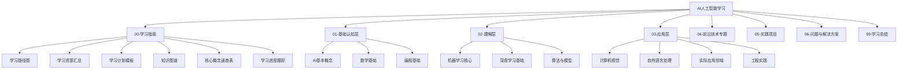
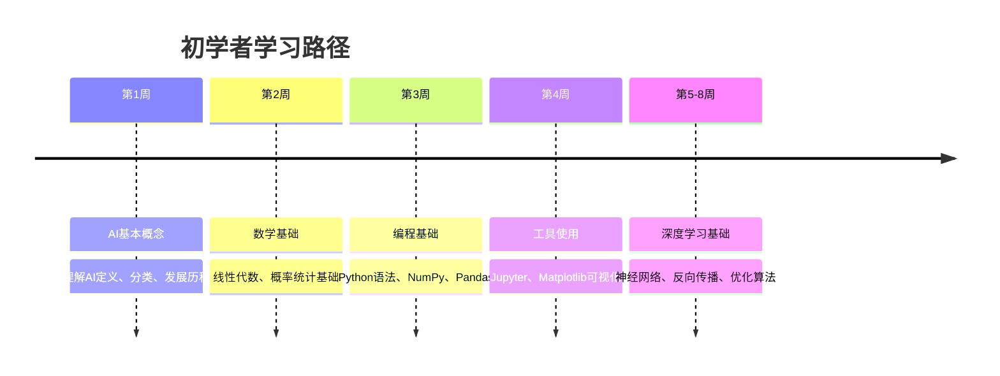
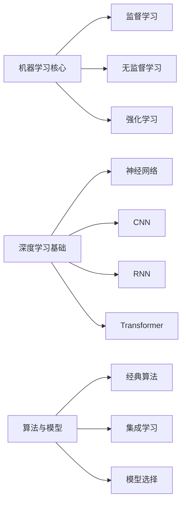
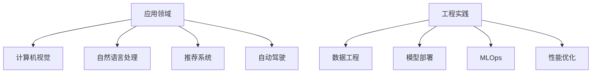
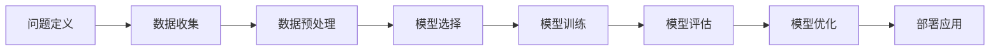

# 学习路径图

## 🗺️ AI学习全景图

### 学习层次结构

## 🎯 学习路径规划

### 1. 初学者路径（0-6个月）

**第一阶段：基础认知（1-2个月）**

**学习重点：**
- 🎯 **概念理解**：建立AI基本认知框架
- 📊 **数学基础**：掌握必要的数学工具
- 💻 **编程技能**：熟练使用Python和数据处理工具
- 🔧 **实践能力**：能够实现简单的机器学习算法

### 2. 进阶路径（6-12个月）

**第二阶段：深入理解（3-4个月）**

**学习重点：**
- 🧠 **算法原理**：深入理解各种机器学习算法
- 🔬 **数学推导**：掌握算法的数学基础
- 🎯 **模型设计**：能够设计和优化模型
- 📊 **性能评估**：掌握模型评估和优化方法

### 3. 专业路径（12-18个月）

**第三阶段：应用实践（5-6个月）**

**学习重点：**
- 🎯 **专业应用**：深入特定应用领域
- 🏗️ **工程能力**：掌握生产级开发技能
- 🔧 **系统设计**：能够设计完整的AI系统
- 📈 **项目管理**：具备AI项目管理能力

## 📚 学习资源体系

### 1. 核心教材

**数学基础：**
- 📖 《线性代数及其应用》- Gilbert Strang
- 📖 《概率论与数理统计》- 茆诗松
- 📖 《微积分》- James Stewart
- 📖 《信息论基础》- Thomas Cover

**机器学习：**
- 📖 《机器学习》- 周志华
- 📖 《统计学习方法》- 李航
- 📖 《Pattern Recognition and Machine Learning》- Christopher Bishop
- 📖 《The Elements of Statistical Learning》- Hastie, Tibshirani, Friedman

**深度学习：**
- 📖 《深度学习》- Ian Goodfellow
- 📖 《Deep Learning》- Yoshua Bengio
- 📖 《动手学深度学习》- 李沐
- 📖 《Neural Networks and Deep Learning》- Michael Nielsen

### 2. 在线课程

**基础课程：**
- 🎓 **Coursera**: Machine Learning (Andrew Ng)
- 🎓 **edX**: Introduction to Artificial Intelligence
- 🎓 **Udacity**: Intro to Machine Learning
- 🎓 **MIT**: Introduction to Machine Learning

**进阶课程：**
- 🎓 **Stanford**: CS229 Machine Learning
- 🎓 **CMU**: Machine Learning (10-701)
- 🎓 **Berkeley**: CS188 Introduction to AI
- 🎓 **Deep Learning Specialization** (Andrew Ng)

### 3. 实践平台

**编程环境：**
- 💻 **Jupyter Notebook**: 交互式开发
- 💻 **Google Colab**: 云端GPU环境
- 💻 **Kaggle Kernels**: 数据科学竞赛
- 💻 **GitHub**: 代码管理和协作

**数据集：**
- 📊 **UCI ML Repository**: 经典数据集
- 📊 **Kaggle Datasets**: 竞赛数据集
- 📊 **ImageNet**: 图像识别数据集
- 📊 **Common Crawl**: 网络文本数据

## 🎯 学习策略

### 1. 费曼学习法

**四个步骤：**
1. **选择概念**：选择一个要学习的概念
2. **教学他人**：用简单的语言解释这个概念
3. **识别盲点**：找出解释不清楚的地方
4. **重新学习**：回到原始材料，重新学习

**实践建议：**
- 📝 **写博客**：记录学习过程和心得
- 🎤 **讲给朋友**：向他人解释AI概念
- 📚 **制作笔记**：整理知识要点
- 🔄 **定期复习**：巩固学习成果

### 2. 刻意练习

**练习原则：**
- 🎯 **明确目标**：设定具体的学习目标
- 🔍 **专注练习**：专注于薄弱环节
- 📊 **及时反馈**：获得练习结果的反馈
- 🚀 **走出舒适区**：挑战更难的题目

**实践方法：**
- 💻 **编程实现**：亲手实现算法
- 🧮 **数学推导**：推导算法原理
- 📊 **数据分析**：分析真实数据
- 🏆 **参加竞赛**：参与机器学习竞赛

### 3. 项目驱动学习

**项目类型：**
- 🎯 **基础项目**：实现经典算法
- 🔬 **研究项目**：探索前沿技术
- 🏗️ **工程项目**：构建完整系统
- 🌟 **创新项目**：解决实际问题

**项目流程：**

## 📊 学习进度跟踪

### 1. 技能评估矩阵

| 技能领域 | 初学者 | 进阶者 | 专家 | 当前水平 |
|----------|--------|--------|------|----------|
| **数学基础** | 了解基本概念 | 掌握核心方法 | 精通数学推导 | ⭐⭐⭐ |
| **编程能力** | 基础语法 | 熟练使用工具 | 系统架构设计 | ⭐⭐⭐ |
| **机器学习** | 理解算法原理 | 实现经典算法 | 创新算法设计 | ⭐⭐ |
| **深度学习** | 了解网络结构 | 训练复杂模型 | 架构创新 | ⭐ |
| **应用开发** | 简单应用 | 完整系统 | 产品级应用 | ⭐ |

### 2. 学习里程碑

**3个月目标：**
- ✅ 完成基础认知层学习
- ✅ 掌握Python和数据处理
- ✅ 理解机器学习基本概念
- ✅ 实现简单的分类和回归

**6个月目标：**
- 🎯 完成理解层学习
- 🎯 掌握深度学习基础
- 🎯 能够训练神经网络
- 🎯 完成2-3个实践项目

**12个月目标：**
- 🚀 完成应用层学习
- 🚀 深入特定应用领域
- 🚀 掌握工程实践技能
- 🚀 完成5-8个完整项目

## 🔗 相关链接
- [[00-02-学习资源汇总]] - 详细学习资源
- [[00-03-学习计划模板]] - 学习计划制定
- [[00-04-知识图谱]] - 知识体系结构
- [[00-05-核心概念速查表]] - 概念快速查询

## 💡 学习建议

**学习心态：**
- 🎯 **保持好奇**：对AI技术保持好奇心
- 💪 **坚持不懈**：学习是一个长期过程
- 🤝 **主动交流**：与同行交流学习心得
- 🔄 **持续更新**：AI技术发展迅速，需要持续学习

**学习方法：**
- 📚 **理论学习**：掌握扎实的理论基础
- 💻 **实践练习**：通过编程加深理解
- 🎯 **项目驱动**：通过项目整合知识
- 📊 **定期评估**：定期评估学习进度

---
*📝 学习提示：学习AI是一个循序渐进的过程，建议按照学习路径图逐步深入，注重理论与实践结合*

