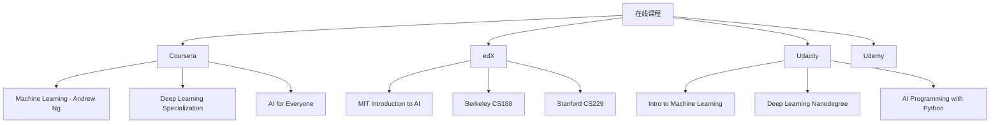
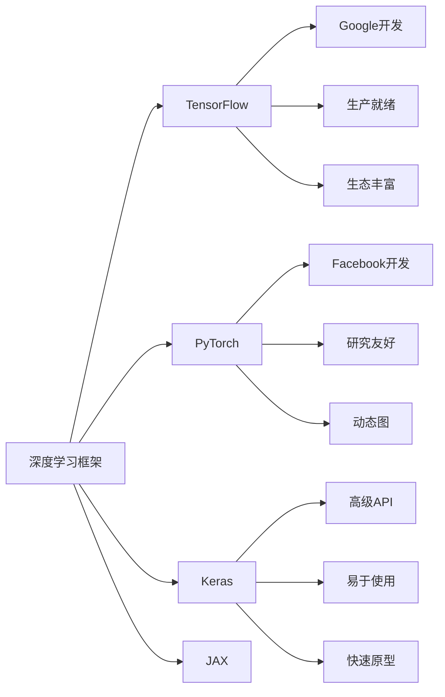
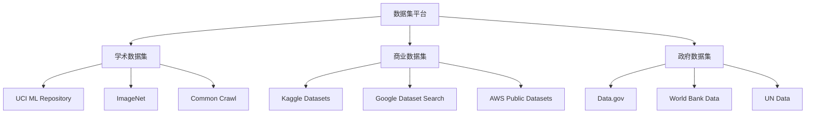

# 学习资源汇总

## 📚 核心学习资源

### 1. 经典教材

**数学基础教材：**

| 书名 | 作者 | 难度 | 特点 | 推荐指数 |
|------|------|------|------|----------|
| 《线性代数及其应用》 | Gilbert Strang | 中等 | 直观易懂，MIT课程配套 | ⭐⭐⭐⭐⭐ |
| 《概率论与数理统计》 | 茆诗松 | 中等 | 理论严谨，例题丰富 | ⭐⭐⭐⭐ |
| 《微积分》 | James Stewart | 中等 | 应用导向，图形丰富 | ⭐⭐⭐⭐ |
| 《信息论基础》 | Thomas Cover | 较难 | 经典教材，理论深入 | ⭐⭐⭐⭐⭐ |

**机器学习教材：**

| 书名 | 作者 | 难度 | 特点 | 推荐指数 |
|------|------|------|------|----------|
| 《机器学习》 | 周志华 | 中等 | 中文经典，理论全面 | ⭐⭐⭐⭐⭐ |
| 《统计学习方法》 | 李航 | 中等 | 算法详细，数学推导 | ⭐⭐⭐⭐⭐ |
| 《Pattern Recognition and ML》 | Christopher Bishop | 较难 | 贝叶斯视角，理论深入 | ⭐⭐⭐⭐ |
| 《The Elements of Statistical Learning》 | Hastie等 | 较难 | 统计学习经典 | ⭐⭐⭐⭐ |

**深度学习教材：**

| 书名 | 作者 | 难度 | 特点 | 推荐指数 |
|------|------|------|------|----------|
| 《深度学习》 | Ian Goodfellow | 较难 | 深度学习圣经 | ⭐⭐⭐⭐⭐ |
| 《动手学深度学习》 | 李沐 | 中等 | 实践导向，代码丰富 | ⭐⭐⭐⭐⭐ |
| 《Neural Networks and Deep Learning》 | Michael Nielsen | 中等 | 在线免费，直观易懂 | ⭐⭐⭐⭐ |
| 《Deep Learning with Python》 | François Chollet | 简单 | Keras作者，实用性强 | ⭐⭐⭐⭐ |

### 2. 在线课程

**基础入门课程：**

**课程推荐：**

| 平台 | 课程名称 | 讲师 | 难度 | 时长 | 特点 |
|------|----------|------|------|------|------|
| **Coursera** | Machine Learning | Andrew Ng | 中等 | 11周 | 经典入门，理论扎实 |
| **Coursera** | Deep Learning Specialization | Andrew Ng | 中等 | 5个月 | 深度学习全面覆盖 |
| **edX** | MIT Introduction to AI | MIT | 较难 | 12周 | 理论深入，MIT质量 |
| **Udacity** | Deep Learning Nanodegree | Udacity | 中等 | 4个月 | 项目导向，实用性强 |

### 3. 技术博客和网站

**权威博客：**
- 🏆 **Distill.pub**: 深度学习可视化解释
- 🏆 **OpenAI Blog**: OpenAI最新研究
- 🏆 **Google AI Blog**: Google AI研究动态
- 🏆 **Facebook AI Research**: Meta AI研究
- 🏆 **DeepMind Blog**: DeepMind研究进展

**技术社区：**
- 💬 **Reddit r/MachineLearning**: 机器学习讨论
- 💬 **Stack Overflow**: 编程问题解答
- 💬 **GitHub**: 开源代码和项目
- 💬 **Kaggle**: 数据科学竞赛和讨论
- 💬 **Papers with Code**: 论文和代码结合

## 🛠️ 开发工具和框架

### 1. 编程环境

**开发环境：**

| 工具 | 类型 | 特点 | 适用场景 |
|------|------|------|----------|
| **Jupyter Notebook** | 交互式 | 可视化友好，适合探索 | 数据分析和原型开发 |
| **Google Colab** | 云端 | 免费GPU，协作方便 | 学习和实验 |
| **VS Code** | 编辑器 | 功能强大，插件丰富 | 专业开发 |
| **PyCharm** | IDE | 智能提示，调试方便 | 大型项目开发 |

**版本控制：**
- 🔧 **Git**: 分布式版本控制
- 🔧 **GitHub**: 代码托管和协作
- 🔧 **GitLab**: 企业级代码管理
- 🔧 **Bitbucket**: Atlassian生态

### 2. 机器学习框架

**深度学习框架：**

**框架对比：**

| 框架 | 开发公司 | 特点 | 适用场景 | 学习难度 |
|------|----------|------|----------|----------|
| **TensorFlow** | Google | 生产就绪，生态丰富 | 工业应用 | 中等 |
| **PyTorch** | Meta | 研究友好，动态图 | 学术研究 | 中等 |
| **Keras** | Google | 高级API，易于使用 | 快速原型 | 简单 |
| **JAX** | Google | 函数式，高性能 | 科学计算 | 较难 |

### 3. 数据处理工具

**数据处理库：**
- 📊 **NumPy**: 数值计算基础
- 📊 **Pandas**: 数据分析和处理
- 📊 **Matplotlib**: 数据可视化
- 📊 **Seaborn**: 统计可视化
- 📊 **Plotly**: 交互式可视化

**大数据工具：**
- 🚀 **Apache Spark**: 大数据处理
- 🚀 **Dask**: 并行计算
- 🚀 **Ray**: 分布式计算
- 🚀 **Apache Kafka**: 流数据处理

## 🎯 实践平台

### 1. 竞赛平台

**数据科学竞赛：**

| 平台 | 特点 | 奖励 | 难度 | 推荐指数 |
|------|------|------|------|----------|
| **Kaggle** | 全球最大，社区活跃 | 奖金丰厚 | 中等 | ⭐⭐⭐⭐⭐ |
| **天池** | 阿里云，中文友好 | 奖金+工作机会 | 中等 | ⭐⭐⭐⭐ |
| **DataFountain** | 中国平台，项目丰富 | 奖金+实习 | 中等 | ⭐⭐⭐ |
| **DrivenData** | 社会影响项目 | 奖金+影响力 | 中等 | ⭐⭐⭐ |

**AI竞赛：**
- 🏆 **ImageNet**: 图像识别基准
- 🏆 **GLUE**: 自然语言理解
- 🏆 **SQuAD**: 问答系统
- 🏆 **COCO**: 目标检测和分割

### 2. 数据集平台

**公开数据集：**

**数据集推荐：**

| 数据集 | 类型 | 大小 | 难度 | 应用场景 |
|--------|------|------|------|----------|
| **MNIST** | 图像分类 | 70K样本 | 简单 | 手写数字识别 |
| **CIFAR-10** | 图像分类 | 60K样本 | 中等 | 自然图像分类 |
| **IMDB** | 文本分类 | 50K样本 | 中等 | 情感分析 |
| **Boston Housing** | 回归 | 506样本 | 简单 | 房价预测 |

### 3. 云平台服务

**云服务提供商：**
- ☁️ **Google Cloud Platform**: AI服务丰富
- ☁️ **Amazon Web Services**: 企业级服务
- ☁️ **Microsoft Azure**: 企业集成
- ☁️ **阿里云**: 国内服务，中文支持

**AI服务：**
- 🤖 **AutoML**: 自动机器学习
- 🤖 **预训练模型**: 开箱即用
- 🤖 **ML Pipeline**: 机器学习流水线
- 🤖 **Model Serving**: 模型部署服务

## 📱 移动学习资源

### 1. 学习应用

**移动学习应用：**
- 📱 **Coursera**: 移动端课程学习
- 📱 **edX**: 移动端课程访问
- 📱 **Khan Academy**: 数学基础学习
- 📱 **Duolingo**: 编程语言学习

**技术阅读应用：**
- 📖 **Medium**: 技术文章阅读
- 📖 **Pocket**: 文章收藏和阅读
- 📖 **Feedly**: RSS订阅管理
- 📖 **Instapaper**: 稍后阅读

### 2. 播客和视频

**技术播客：**
- 🎧 **The AI Podcast**: NVIDIA AI播客
- 🎧 **Data Skeptic**: 数据科学播客
- 🎧 **Machine Learning Street Talk**: 机器学习讨论
- 🎧 **Lex Fridman Podcast**: AI和科技访谈

**视频频道：**
- 📺 **3Blue1Brown**: 数学可视化
- 📺 **Two Minute Papers**: 论文解读
- 📺 **sentdex**: Python机器学习教程
- 📺 **Siraj Raval**: AI教育内容

## 🔗 相关链接
- [[00-01-学习路径图]] - 学习路径规划
- [[00-03-学习计划模板]] - 学习计划制定
- [[00-04-知识图谱]] - 知识体系结构
- [[00-05-核心概念速查表]] - 概念快速查询

## 💡 资源使用建议

**学习策略：**
- 🎯 **选择适合的资源**：根据自己的水平选择合适的资源
- 📚 **多资源结合**：结合教材、课程、实践等多种资源
- 🔄 **定期更新**：AI技术发展快，需要定期更新资源
- 🤝 **社区参与**：积极参与技术社区讨论

**时间管理：**
- ⏰ **制定学习计划**：合理安排学习时间
- 📅 **定期复习**：定期回顾学习内容
- 🎯 **设定目标**：设定明确的学习目标
- 📊 **跟踪进度**：记录学习进度和成果

---
*📝 学习提示：学习资源是学习的基础，建议选择高质量的资源，结合多种学习方式，持续更新知识*

