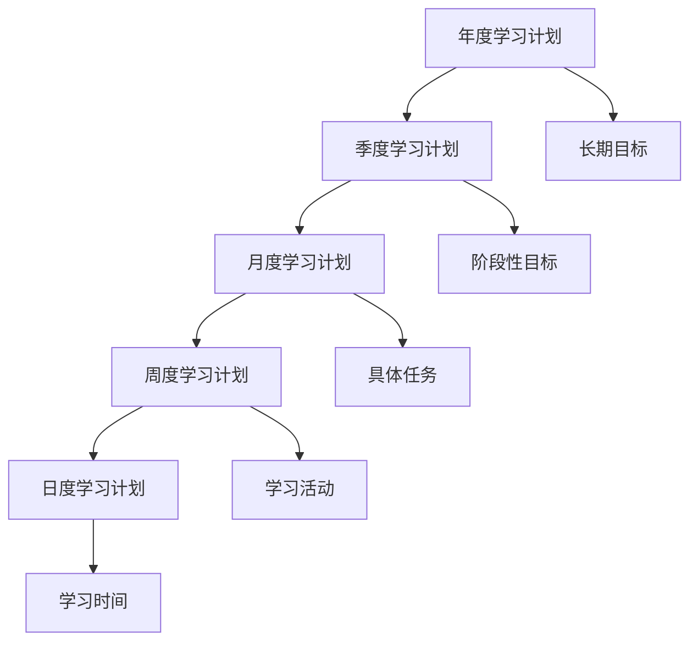
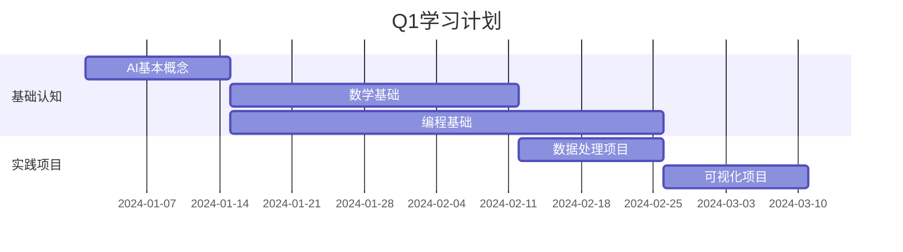
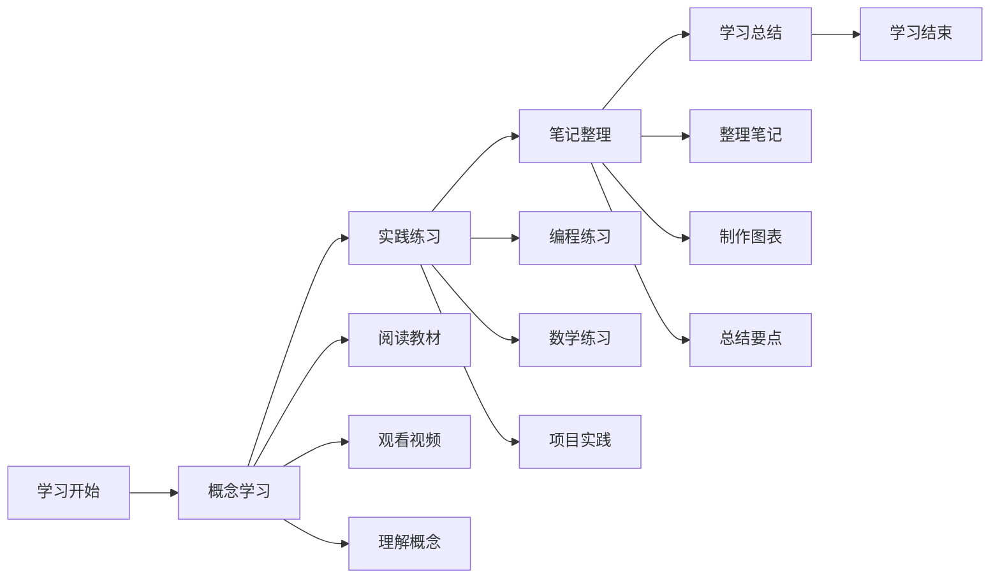

# 学习计划模板

## 📅 学习计划制定框架

### 1. SMART目标设定

**SMART原则：**
- 🎯 **Specific（具体）**：目标要具体明确
- 📊 **Measurable（可测量）**：目标要可以量化
- 🎯 **Achievable（可实现）**：目标要现实可行
- 🔗 **Relevant（相关）**：目标要与AI学习相关
- ⏰ **Time-bound（有时限）**：目标要有明确时间

**目标设定模板：**
```
学习目标：[具体描述]
时间期限：[开始日期] - [结束日期]
成功标准：[可量化的指标]
学习资源：[使用的资源]
评估方法：[如何评估进度]
```

### 2. 学习计划结构

**计划层次：**


## 📋 学习计划模板

### 1. 年度学习计划

**2024年AI学习计划模板：**

| 季度 | 学习重点 | 主要目标 | 预期成果 |
|------|----------|----------|----------|
| **Q1** | 基础认知 | 掌握AI基本概念和数学基础 | 完成基础认知层学习 |
| **Q2** | 理解深入 | 掌握机器学习和深度学习 | 完成理解层学习 |
| **Q3** | 应用实践 | 深入特定应用领域 | 完成应用层学习 |
| **Q4** | 前沿探索 | 学习前沿技术和项目实践 | 完成前沿技术专题 |

**年度目标设定：**
```
主要目标：掌握AI人工智能核心知识和技能
具体目标：
- 完成AI知识体系学习
- 掌握Python和机器学习工具
- 完成5-8个实践项目
- 获得相关认证或证书
- 建立个人AI作品集

成功指标：
- 学习完成度：90%以上
- 项目完成数：5个以上
- 技能评估：达到中级水平
- 社区参与：活跃参与技术讨论
```

### 2. 季度学习计划

**Q1学习计划模板：**

**学习目标：**
- 🎯 掌握AI基本概念和分类
- 📊 学习数学基础（线性代数、概率统计、微积分）
- 💻 掌握Python编程和数据处理
- 🔧 熟练使用Jupyter和可视化工具

**学习内容：**


**学习资源：**
- 📚 教材：《机器学习》（周志华）
- 🎓 课程：Coursera Machine Learning
- 💻 工具：Python, NumPy, Pandas, Matplotlib
- 🏆 项目：数据分析和可视化项目

**评估方法：**
- 📊 每周学习总结
- 🎯 月度技能测试
- 💻 项目作品展示
- 📝 学习笔记整理

### 3. 月度学习计划

**1月学习计划模板：**

**学习目标：**
- 🎯 理解AI定义、分类和发展历程
- 📊 掌握线性代数基础
- 💻 熟练使用Python基础语法
- 🔧 完成第一个数据分析项目

**学习安排：**
| 周次 | 学习内容 | 学习时间 | 学习方式 | 输出成果 |
|------|----------|----------|----------|----------|
| **第1周** | AI基本概念 | 10小时 | 阅读+视频 | 概念笔记 |
| **第2周** | 线性代数 | 12小时 | 教材+练习 | 习题解答 |
| **第3周** | Python基础 | 15小时 | 编程+实践 | 代码练习 |
| **第4周** | 数据分析项目 | 20小时 | 项目实践 | 项目报告 |

**学习资源：**
- 📖 教材：AI基本概念相关章节
- 🎓 视频：线性代数在线课程
- 💻 编程：Python官方教程
- 📊 数据：Kaggle入门数据集

**评估标准：**
- ✅ 概念理解：能够解释AI基本概念
- ✅ 数学掌握：能够解决线性代数问题
- ✅ 编程能力：能够编写Python程序
- ✅ 项目完成：能够完成数据分析项目

### 4. 周度学习计划

**第1周学习计划模板：**

**学习目标：**
- 🎯 理解AI定义和分类
- 📊 学习AI发展历程
- 💻 掌握AI应用领域
- 🔧 了解AI伦理问题

**学习安排：**
| 日期 | 学习内容 | 学习时间 | 学习方式 | 输出成果 |
|------|----------|----------|----------|----------|
| **周一** | AI定义与分类 | 2小时 | 阅读+笔记 | 概念总结 |
| **周二** | AI发展历程 | 2小时 | 视频+思考 | 时间线整理 |
| **周三** | AI应用领域 | 2小时 | 案例+分析 | 应用案例集 |
| **周四** | AI伦理问题 | 2小时 | 讨论+反思 | 伦理观点 |
| **周五** | 知识整合 | 2小时 | 总结+复习 | 知识图谱 |

**学习资源：**
- 📖 教材：AI基本概念章节
- 🎓 视频：AI发展历史纪录片
- 📰 文章：AI应用案例文章
- 💬 讨论：AI伦理相关讨论

**评估方法：**
- 📝 每日学习笔记
- 🎯 概念理解测试
- 💬 学习心得分享
- 📊 知识掌握评估

### 5. 日度学习计划

**每日学习计划模板：**

**学习目标：**
- 🎯 完成当日学习任务
- 📊 掌握核心概念
- 💻 完成实践练习
- 🔧 整理学习笔记

**学习安排：**


**时间分配：**
- ⏰ **概念学习**：40%（理论学习）
- ⏰ **实践练习**：40%（动手实践）
- ⏰ **笔记整理**：20%（知识整理）

**学习环境：**
- 🏠 **学习空间**：安静、整洁的学习环境
- 💻 **学习工具**：电脑、笔记本、参考书
- 📱 **学习应用**：Jupyter、VS Code、学习应用
- 🎧 **学习辅助**：耳机、计时器、学习音乐

## 📊 学习进度跟踪

### 1. 进度跟踪表

**学习进度跟踪模板：**

| 学习内容 | 计划时间 | 实际时间 | 完成度 | 掌握程度 | 备注 |
|----------|----------|----------|--------|----------|------|
| AI基本概念 | 10小时 | 12小时 | 100% | 良好 | 概念清晰 |
| 线性代数 | 20小时 | 18小时 | 90% | 一般 | 需要复习 |
| Python基础 | 30小时 | 35小时 | 100% | 良好 | 编程熟练 |
| 数据分析 | 25小时 | 20小时 | 80% | 一般 | 项目进行中 |

**掌握程度评估：**
- 🟢 **优秀**：完全掌握，能够应用
- 🟡 **良好**：基本掌握，需要练习
- 🟠 **一般**：部分掌握，需要加强
- 🔴 **较差**：掌握不足，需要重新学习

### 2. 学习成果记录

**学习成果记录模板：**

**项目作品：**
- 📊 **数据分析项目**：房价预测分析
- 🎯 **机器学习项目**：图像分类器
- 🔧 **深度学习项目**：文本情感分析
- 🚀 **应用开发项目**：AI聊天机器人

**技能证书：**
- 🏆 **Coursera证书**：Machine Learning Certificate
- 🏆 **Kaggle证书**：Data Science Competitions
- 🏆 **Google证书**：TensorFlow Developer Certificate
- 🏆 **AWS证书**：Machine Learning Specialty

**社区贡献：**
- 💬 **技术博客**：发布10篇技术文章
- 🤝 **开源贡献**：参与5个开源项目
- 🎤 **技术分享**：参加3次技术会议
- 👥 **社区参与**：活跃参与技术讨论

## 🔗 相关链接
- [[00-01-学习路径图]] - 学习路径规划
- [[00-02-学习资源汇总]] - 学习资源
- [[00-04-知识图谱]] - 知识体系结构
- [[00-06-学习进度跟踪]] - 进度跟踪

## 💡 学习计划建议

**制定原则：**
- 🎯 **目标明确**：设定清晰的学习目标
- 📊 **计划合理**：制定现实可行的计划
- 🔄 **灵活调整**：根据实际情况调整计划
- 📈 **持续改进**：不断优化学习计划

**执行建议：**
- ⏰ **时间管理**：合理安排学习时间
- 📝 **记录跟踪**：记录学习进度和成果
- 🤝 **寻求帮助**：遇到困难及时寻求帮助
- 🎉 **庆祝成果**：及时庆祝学习成果

---
*📝 学习提示：学习计划是学习成功的基础，建议制定详细的计划，并严格执行和跟踪*

