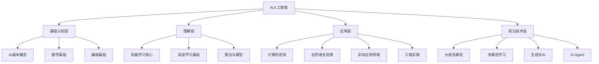
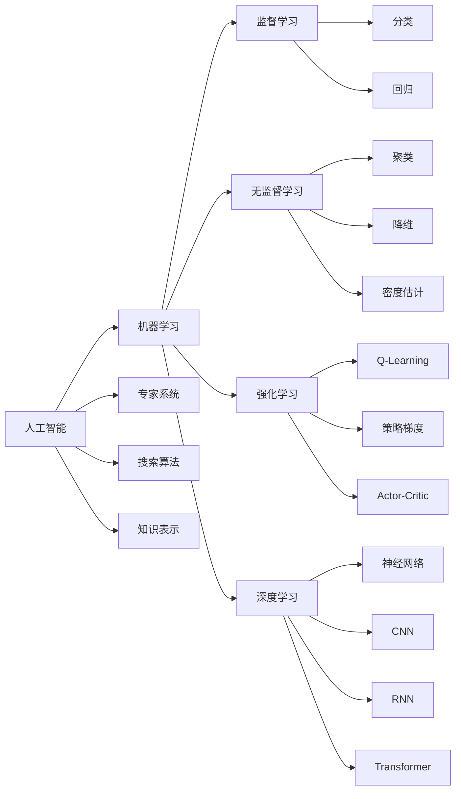
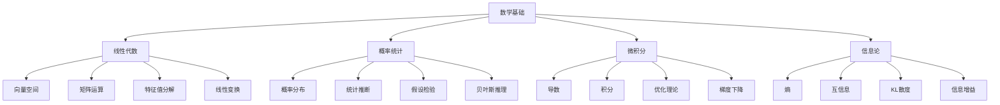
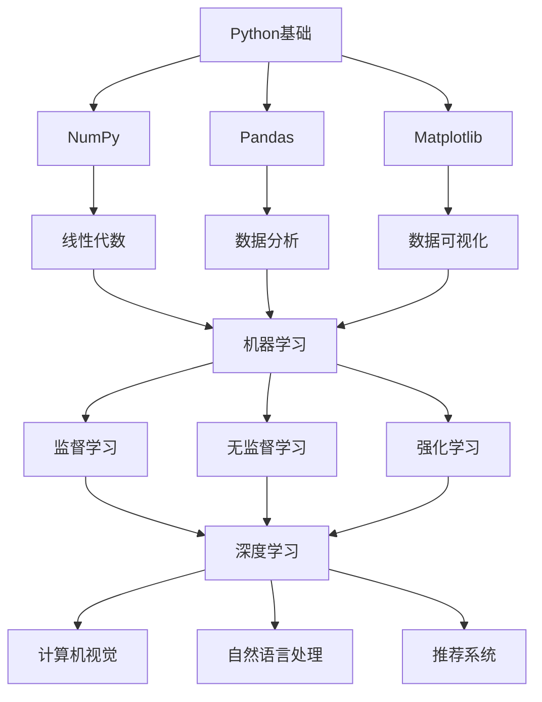
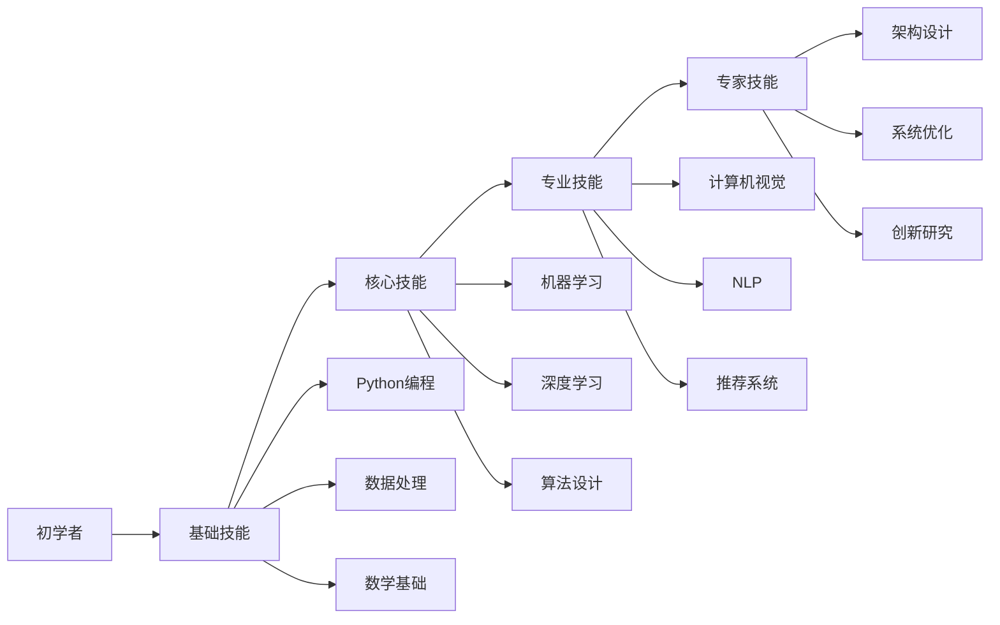
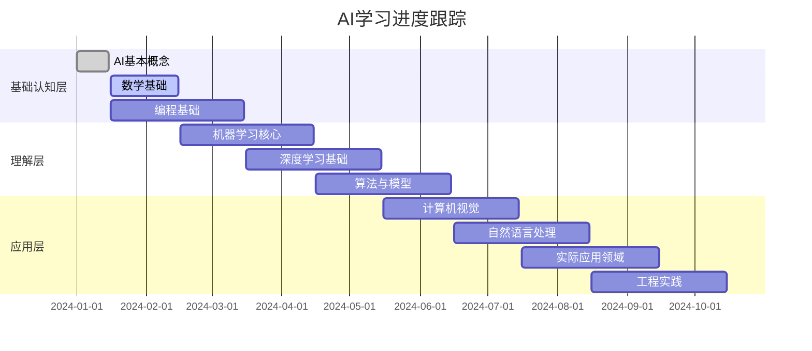
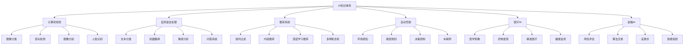
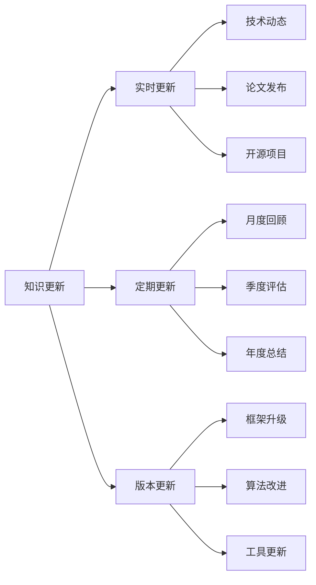

# 知识图谱

## 🕸️ AI知识体系图谱

### 1. 整体知识架构

**知识层次结构：**

### 2. 核心概念关系图

**AI核心概念网络：**

### 3. 数学基础关系图

**数学概念网络：**

## 🔗 知识点关联分析

### 1. 概念依赖关系

**学习依赖图：**

**依赖关系表：**

| 知识点 | 前置知识 | 后续知识 | 重要性 |
|--------|----------|----------|--------|
| **Python基础** | 编程基础 | NumPy, Pandas | 核心 |
| **线性代数** | 数学基础 | 机器学习 | 核心 |
| **概率统计** | 数学基础 | 机器学习 | 核心 |
| **机器学习** | 数学+编程 | 深度学习 | 核心 |
| **深度学习** | 机器学习 | 应用领域 | 核心 |

### 2. 技能发展路径

**技能发展图：**

## 📊 知识掌握度评估

### 1. 知识掌握矩阵

**掌握度评估表：**

| 知识领域 | 概念理解 | 原理掌握 | 实践应用 | 创新思考 | 综合评分 |
|----------|----------|----------|----------|----------|----------|
| **AI基本概念** | ⭐⭐⭐⭐⭐ | ⭐⭐⭐⭐ | ⭐⭐⭐ | ⭐⭐ | 85% |
| **数学基础** | ⭐⭐⭐⭐ | ⭐⭐⭐ | ⭐⭐ | ⭐ | 60% |
| **编程基础** | ⭐⭐⭐⭐⭐ | ⭐⭐⭐⭐ | ⭐⭐⭐⭐ | ⭐⭐⭐ | 80% |
| **机器学习** | ⭐⭐⭐ | ⭐⭐ | ⭐⭐ | ⭐ | 50% |
| **深度学习** | ⭐⭐ | ⭐ | ⭐ | ⭐ | 30% |

**评分标准：**
- ⭐⭐⭐⭐⭐ **优秀**：完全掌握，能够创新应用
- ⭐⭐⭐⭐ **良好**：基本掌握，能够熟练应用
- ⭐⭐⭐ **一般**：部分掌握，能够基本应用
- ⭐⭐ **较差**：掌握不足，需要加强学习
- ⭐ **很差**：基本不会，需要重新学习

### 2. 学习进度跟踪

**学习进度图：**

## 🎯 知识应用场景

### 1. 应用领域映射

**知识应用图：**

### 2. 技能需求分析

**技能需求矩阵：**

| 应用领域 | 数学要求 | 编程要求 | 算法要求 | 工程要求 | 业务理解 |
|----------|----------|----------|----------|----------|----------|
| **计算机视觉** | 高 | 高 | 高 | 中 | 中 |
| **自然语言处理** | 中 | 高 | 高 | 中 | 高 |
| **推荐系统** | 中 | 中 | 中 | 高 | 高 |
| **自动驾驶** | 高 | 高 | 高 | 高 | 高 |
| **医疗AI** | 高 | 中 | 高 | 中 | 高 |
| **金融AI** | 中 | 中 | 中 | 高 | 高 |

## 🔄 知识更新机制

### 1. 知识更新周期

**更新频率：**

**更新策略：**
- 🔄 **持续学习**：关注最新技术动态
- 📚 **定期复习**：定期回顾已学知识
- 🆕 **新知识学习**：学习前沿技术
- 🔧 **实践应用**：在实际项目中应用知识

### 2. 知识质量保证

**质量评估标准：**
- ✅ **准确性**：知识内容准确无误
- ✅ **完整性**：知识体系完整全面
- ✅ **时效性**：知识内容及时更新
- ✅ **实用性**：知识能够实际应用

**质量改进方法：**
- 🔍 **定期审查**：定期审查知识内容
- 🤝 **同行评议**：邀请专家评议
- 📊 **用户反馈**：收集用户反馈
- 🔄 **持续改进**：基于反馈持续改进

## 🔗 相关链接
- [[00-01-学习路径图]] - 学习路径规划
- [[00-02-学习资源汇总]] - 学习资源
- [[00-03-学习计划模板]] - 学习计划
- [[00-05-核心概念速查表]] - 概念查询

## 💡 知识图谱使用建议

**使用方法：**
- 🗺️ **导航学习**：使用图谱导航学习路径
- 🔍 **查找关联**：查找知识点之间的关联
- 📊 **评估进度**：评估学习进度和掌握程度
- 🎯 **规划学习**：规划下一步学习计划

**维护建议：**
- 📝 **定期更新**：定期更新知识图谱
- 🔄 **持续完善**：持续完善知识体系
- 🤝 **协作维护**：与学习伙伴协作维护
- 📊 **效果评估**：评估图谱使用效果

---
*📝 学习提示：知识图谱是学习的重要工具，建议定期更新和完善，充分利用图谱指导学习*

