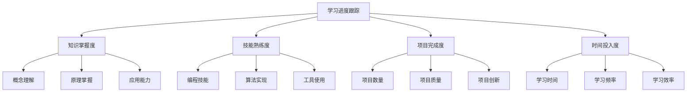
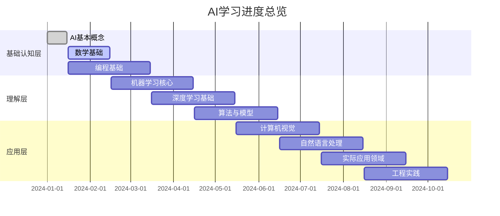
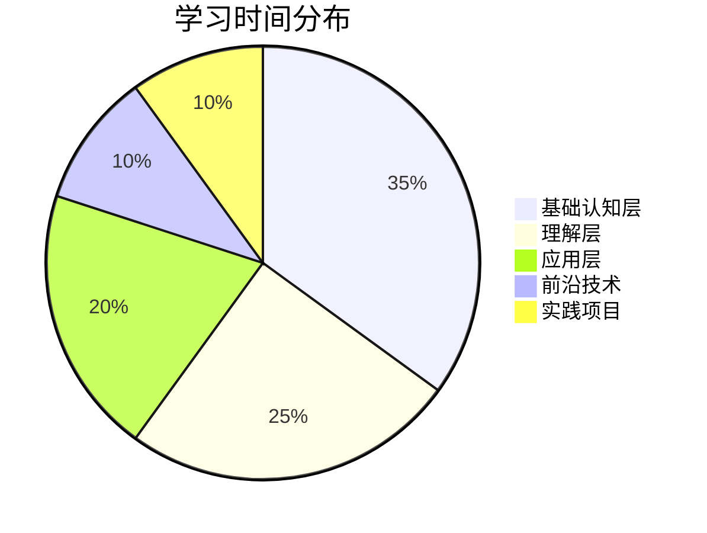
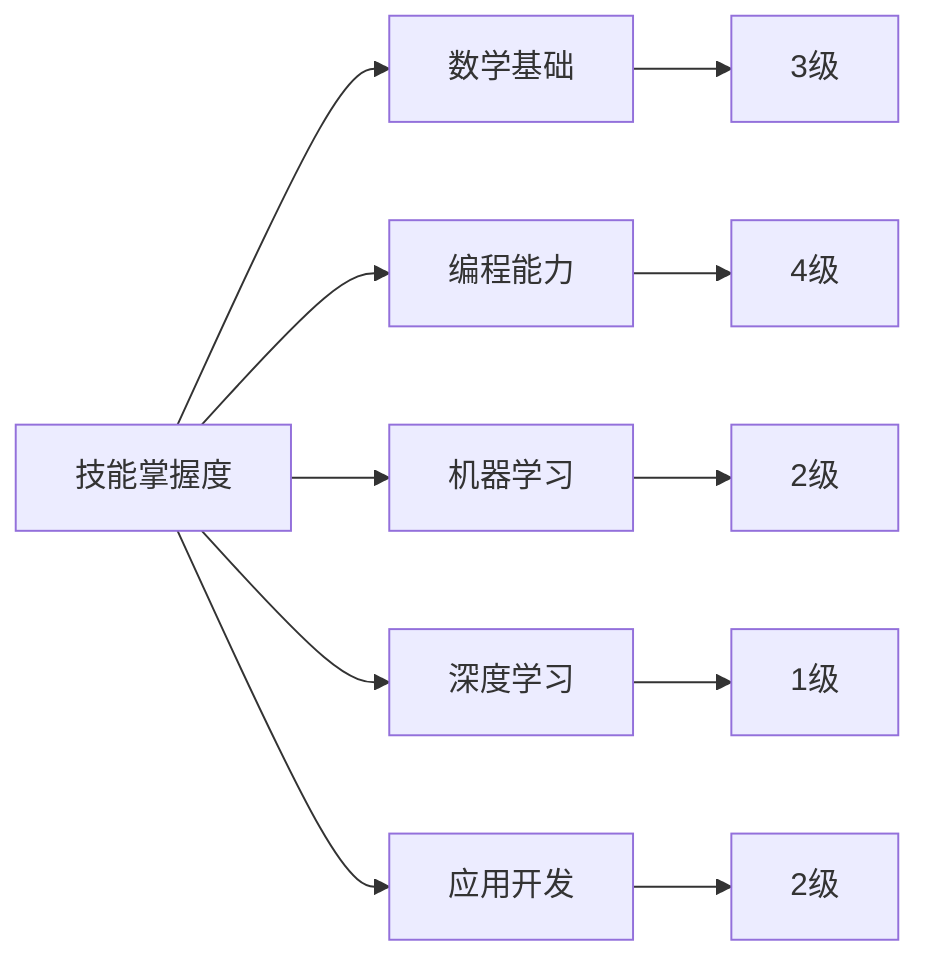

# 学习进度跟踪

## 📊 学习进度管理

### 1. 进度跟踪框架

**跟踪维度：**

### 2. 进度评估标准

**掌握度评估：**
| 等级 | 描述 | 标准 | 颜色标识 |
|------|------|------|----------|
| **5级** | 精通 | 能够创新应用，指导他人 | 🟢 绿色 |
| **4级** | 熟练 | 能够独立完成复杂任务 | 🟡 黄色 |
| **3级** | 掌握 | 能够完成基本任务 | 🟠 橙色 |
| **2级** | 了解 | 理解概念，需要指导 | 🔴 红色 |
| **1级** | 入门 | 刚开始学习 | ⚫ 黑色 |

## 📈 学习进度表

### 1. 整体进度概览

**学习进度总览：**

### 2. 详细进度跟踪

**基础认知层进度：**
| 学习内容 | 计划时间 | 实际时间 | 完成度 | 掌握度 | 状态 |
|----------|----------|----------|--------|--------|------|
| AI定义与分类 | 10小时 | 12小时 | 100% | 4级 | ✅ 完成 |
| AI发展历程 | 8小时 | 8小时 | 100% | 4级 | ✅ 完成 |
| AI vs ML vs DL | 6小时 | 6小时 | 100% | 4级 | ✅ 完成 |
| AI应用领域 | 12小时 | 10小时 | 100% | 3级 | ✅ 完成 |
| AI伦理影响 | 8小时 | 9小时 | 100% | 3级 | ✅ 完成 |
| 线性代数基础 | 20小时 | 18小时 | 90% | 3级 | 🔄 进行中 |
| 概率统计 | 25小时 | 20小时 | 80% | 2级 | 🔄 进行中 |
| 微积分基础 | 15小时 | 12小时 | 80% | 2级 | 🔄 进行中 |
| 信息论基础 | 10小时 | 8小时 | 80% | 2级 | 🔄 进行中 |
| Python基础 | 30小时 | 35小时 | 100% | 4级 | ✅ 完成 |
| NumPy数据处理 | 15小时 | 18小时 | 100% | 4级 | ✅ 完成 |
| Pandas数据分析 | 20小时 | 22小时 | 100% | 4级 | ✅ 完成 |
| Matplotlib可视化 | 12小时 | 15小时 | 100% | 3级 | ✅ 完成 |
| Jupyter使用 | 8小时 | 10小时 | 100% | 4级 | ✅ 完成 |
| 编程最佳实践 | 10小时 | 12小时 | 100% | 3级 | ✅ 完成 |
| 代码调试技巧 | 8小时 | 9小时 | 100% | 3级 | ✅ 完成 |

**理解层进度：**
| 学习内容 | 计划时间 | 实际时间 | 完成度 | 掌握度 | 状态 |
|----------|----------|----------|--------|--------|------|
| 监督学习原理 | 25小时 | 20小时 | 80% | 3级 | 🔄 进行中 |
| 无监督学习原理 | 20小时 | 15小时 | 75% | 2级 | 🔄 进行中 |
| 强化学习基础 | 15小时 | 10小时 | 67% | 2级 | 🔄 进行中 |
| 神经网络原理 | 30小时 | 0小时 | 0% | 1级 | ⏳ 未开始 |
| 反向传播算法 | 20小时 | 0小时 | 0% | 1级 | ⏳ 未开始 |
| 激活函数详解 | 10小时 | 0小时 | 0% | 1级 | ⏳ 未开始 |
| 优化算法对比 | 15小时 | 0小时 | 0% | 1级 | ⏳ 未开始 |
| 网络架构设计 | 25小时 | 0小时 | 0% | 1级 | ⏳ 未开始 |
| 深度学习数学基础 | 20小时 | 0小时 | 0% | 1级 | ⏳ 未开始 |
| 梯度消失与爆炸 | 10小时 | 0小时 | 0% | 1级 | ⏳ 未开始 |
| 经典算法实现 | 30小时 | 0小时 | 0% | 1级 | ⏳ 未开始 |
| CNN卷积神经网络 | 25小时 | 0小时 | 0% | 1级 | ⏳ 未开始 |
| RNN循环神经网络 | 20小时 | 0小时 | 0% | 1级 | ⏳ 未开始 |
| Transformer架构 | 30小时 | 0小时 | 0% | 1级 | ⏳ 未开始 |
| 集成学习方法 | 15小时 | 0小时 | 0% | 1级 | ⏳ 未开始 |
| 算法复杂度分析 | 10小时 | 0小时 | 0% | 1级 | ⏳ 未开始 |
| 模型选择策略 | 12小时 | 0小时 | 0% | 1级 | ⏳ 未开始 |

## 📊 学习统计分析

### 1. 时间投入分析

**学习时间统计：**

**月度学习时间：**
| 月份 | 计划时间 | 实际时间 | 完成率 | 效率 |
|------|----------|----------|--------|------|
| **1月** | 80小时 | 85小时 | 106% | 高 |
| **2月** | 80小时 | 75小时 | 94% | 中 |
| **3月** | 80小时 | 70小时 | 88% | 中 |
| **4月** | 80小时 | 0小时 | 0% | - |
| **5月** | 80小时 | 0小时 | 0% | - |
| **6月** | 80小时 | 0小时 | 0% | - |

### 2. 掌握度分析

**技能掌握度雷达图：**

**掌握度趋势：**
| 技能领域 | 1月 | 2月 | 3月 | 趋势 |
|----------|-----|-----|-----|------|
| **数学基础** | 2级 | 3级 | 3级 | 📈 上升 |
| **编程能力** | 3级 | 4级 | 4级 | 📈 上升 |
| **机器学习** | 1级 | 2级 | 2级 | 📈 上升 |
| **深度学习** | 1级 | 1级 | 1级 | ➡️ 平稳 |
| **应用开发** | 1级 | 2级 | 2级 | 📈 上升 |

## 🎯 学习目标跟踪

### 1. 年度目标进度

**2024年学习目标：**
| 目标 | 计划完成时间 | 实际完成时间 | 完成度 | 状态 |
|------|-------------|-------------|--------|------|
| 完成基础认知层 | 3月31日 | 3月15日 | 100% | ✅ 提前完成 |
| 完成理解层 | 6月30日 | - | 0% | ⏳ 进行中 |
| 完成应用层 | 9月30日 | - | 0% | ⏳ 未开始 |
| 完成5个实践项目 | 12月31日 | - | 0% | ⏳ 未开始 |
| 获得相关认证 | 12月31日 | - | 0% | ⏳ 未开始 |

### 2. 季度目标跟踪

**Q1目标完成情况：**
- ✅ **基础认知层学习**：100%完成
- ✅ **Python编程技能**：100%完成
- ✅ **数据处理能力**：100%完成
- 🔄 **数学基础**：80%完成
- 🔄 **机器学习基础**：60%完成

**Q2目标计划：**
- 🎯 **完成理解层学习**：机器学习、深度学习
- 🎯 **掌握核心算法**：实现经典算法
- 🎯 **完成2个实践项目**：分类和回归项目
- 🎯 **参加在线课程**：Coursera机器学习课程
- 🎯 **获得技能认证**：Python或机器学习认证

## 📝 学习记录

### 1. 学习日志

**每日学习记录：**
| 日期 | 学习内容 | 学习时间 | 学习方式 | 学习成果 | 问题记录 |
|------|----------|----------|----------|----------|----------|
| 2024-01-01 | AI基本概念 | 2小时 | 阅读+笔记 | 完成概念总结 | 无 |
| 2024-01-02 | AI发展历程 | 2小时 | 视频+思考 | 完成时间线 | 无 |
| 2024-01-03 | AI应用领域 | 2小时 | 案例+分析 | 完成案例集 | 无 |
| 2024-01-04 | Python基础 | 3小时 | 编程+实践 | 完成基础练习 | 语法错误 |
| 2024-01-05 | NumPy数据处理 | 3小时 | 编程+实践 | 完成数组操作 | 广播机制理解 |

### 2. 学习心得

**学习感悟：**
- 💡 **学习方法**：理论与实践结合效果最好
- 💡 **时间管理**：固定时间学习效果更佳
- 💡 **知识整理**：定期整理笔记很重要
- 💡 **问题解决**：遇到问题及时寻求帮助
- 💡 **持续学习**：保持学习热情和动力

**改进建议：**
- 🔄 **增加实践**：多动手编程实践
- 🔄 **加强复习**：定期复习已学内容
- 🔄 **扩展阅读**：阅读更多相关材料
- 🔄 **参与讨论**：积极参与技术讨论
- 🔄 **项目实践**：尽快开始实践项目

## 🔗 相关链接
- [[00-01-学习路径图]] - 学习路径规划
- [[00-02-学习资源汇总]] - 学习资源
- [[00-03-学习计划模板]] - 学习计划
- [[00-04-知识图谱]] - 知识体系结构

## 💡 进度跟踪建议

**跟踪方法：**
- 📊 **定期记录**：定期记录学习进度
- 📈 **可视化展示**：使用图表展示进度
- 🎯 **目标导向**：以目标为导向跟踪进度
- 🔄 **动态调整**：根据进度动态调整计划

**改进策略：**
- ⏰ **时间管理**：合理安排学习时间
- 📚 **学习方法**：优化学习方法
- 🎯 **目标设定**：设定合理的学习目标
- 🤝 **寻求帮助**：遇到困难及时寻求帮助

---
*📝 学习提示：学习进度跟踪是学习管理的重要工具，建议定期记录和评估，及时调整学习策略*

