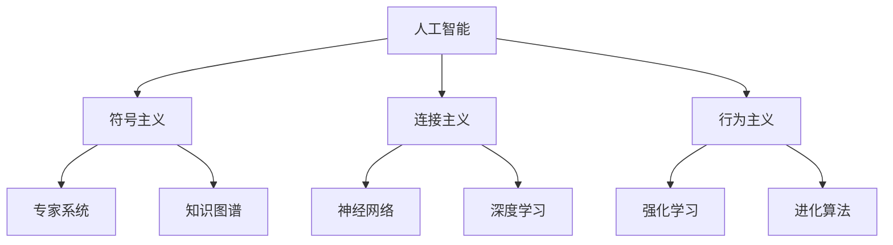

# AI定义与分类

## 📋 核心概念

### 人工智能（Artificial Intelligence）定义
> **AI是让机器模拟人类智能行为的技术和科学**

**本质特征：**
- 🧠 **感知能力**：理解环境信息
- 🤔 **推理能力**：基于逻辑进行判断
- 🎯 **学习能力**：从经验中改进
- 💬 **交互能力**：与人类和环境沟通

## 🏗️ AI分类体系

### 按能力水平分类

| 类型 | 特征 | 代表技术 | 应用场景 |
|------|------|----------|----------|
| **弱AI** | 特定领域智能 | 图像识别、语音助手 | 日常应用 |
| **强AI** | 通用人类智能 | 理论阶段 | 未来目标 |
| **超AI** | 超越人类智能 | 科幻概念 | 哲学讨论 |

### 按技术方法分类

## 🔍 关键理解要点

### 1. AI vs 传统程序
| 维度 | 传统程序 | AI系统 |
|------|----------|--------|
| **输入** | 固定规则 | 数据驱动 |
| **输出** | 确定性结果 | 概率性结果 |
| **适应** | 静态不变 | 动态学习 |
| **复杂度** | 线性增长 | 指数增长 |

### 2. AI发展三要素
- 📊 **数据**：燃料（Data is the new oil）
- 🧮 **算法**：引擎（Algorithm is the engine）
- 💻 **算力**：基础设施（Computing power is the infrastructure）

## 🎯 学习路径指引

### 认知层 → 理解层 → 应用层
1. **认知**：掌握基本概念和分类
2. **理解**：深入算法原理和数学基础
3. **应用**：实际项目开发和问题解决

## 🔗 相关链接
- [[01-01-02-AI发展历程]] - 了解AI历史脉络
- [[01-01-03-AI vs ML vs DL]] - 理清概念关系
- [[01-01-04-AI应用领域概览]] - 探索应用场景

## 💡 费曼学习法应用
**用自己的话解释**：AI就是让计算机像人一样思考的技术，分为三个层次：能解决特定问题的弱AI（如手机助手），能像人一样全面思考的强AI（还在研究中），以及超越人类智能的超AI（科幻概念）。

**教学他人**：向朋友解释AI时，可以说"AI就是让机器变聪明的技术，就像教小孩认字一样，通过大量数据训练，让机器学会识别、理解和决策"。

---
*📝 学习提示：理解AI定义是学习AI的基础，建议结合实际应用场景加深理解*

