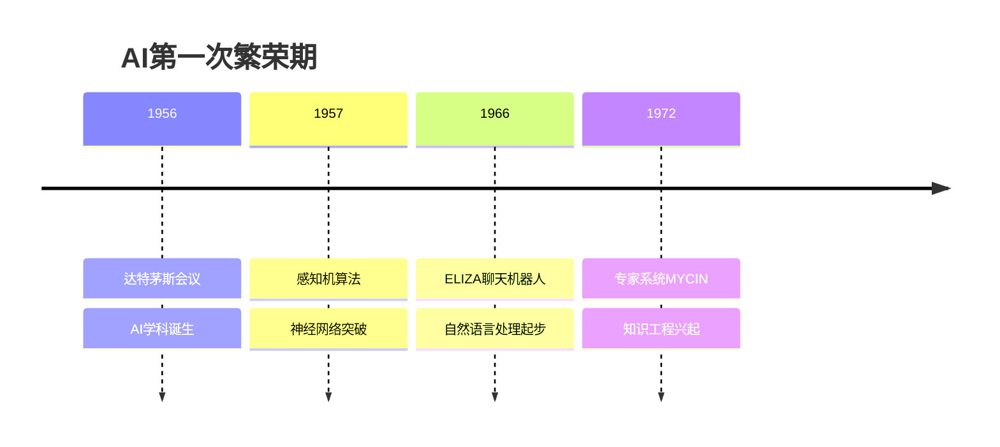
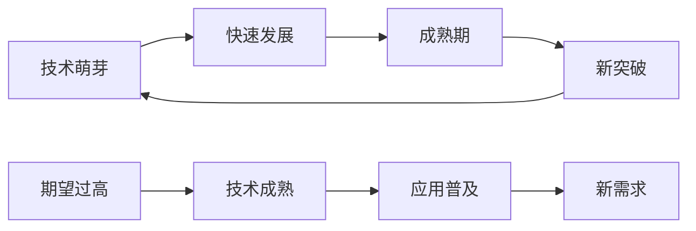

# AI发展历程

## 📅 发展时间线

### 第一阶段：萌芽期（1940s-1950s）

| 时间 | 重要事件 | 意义 |
|------|----------|------|
| **1943** | McCulloch-Pitts神经元模型 | 神经网络理论基础 |
| **1950** | 图灵测试提出 | AI判断标准确立 |
| **1956** | 达特茅斯会议 | AI学科正式诞生 |

**关键人物：**
- 🧠 **艾伦·图灵**：提出图灵测试
- 🎯 **约翰·麦卡锡**：AI概念提出者
- 🔬 **马文·明斯基**：AI先驱

### 第二阶段：第一次繁荣（1950s-1970s）

**主要成就：**
- 🤖 **专家系统**：模拟专家决策
- 🧮 **符号推理**：基于规则的AI
- 📚 **知识表示**：结构化知识存储

### 第三阶段：第一次寒冬（1970s-1980s）

**寒冬原因：**
- ❌ **算力不足**：硬件限制
- ❌ **数据稀缺**：训练数据有限
- ❌ **期望过高**：技术无法满足预期
- ❌ **资金减少**：投资热情下降

### 第四阶段：第二次繁荣（1980s-1990s）

**复兴标志：**
- 💻 **个人计算机**：算力大幅提升
- 📊 **数据库技术**：数据存储改善
- 🔧 **专家系统商业化**：实际应用成功
- 🌐 **互联网兴起**：信息获取便利

### 第五阶段：深度学习革命（2000s-至今）

| 里程碑 | 年份 | 突破意义 |
|--------|------|----------|
| **ImageNet** | 2012 | 深度学习崛起 |
| **AlphaGo** | 2016 | AI战胜人类 |
| **GPT系列** | 2018-2023 | 大语言模型时代 |
| **ChatGPT** | 2022 | AI应用普及 |

## 🔄 发展规律分析

### 技术发展S曲线

### 三要素驱动模型

| 要素 | 作用 | 当前状态 |
|------|------|----------|
| **数据** | 训练燃料 | 大数据时代 |
| **算法** | 核心引擎 | 深度学习成熟 |
| **算力** | 基础设施 | GPU/TPU普及 |

## 🎯 历史启示

### 1. 技术发展规律
- 📈 **螺旋上升**：不是直线发展
- ⏰ **周期性**：繁荣-寒冬-复兴
- 🔄 **迭代性**：技术不断改进

### 2. 成功关键因素
- 💡 **理论突破**：算法创新
- 🛠️ **工程实现**：技术落地
- 📊 **数据支撑**：训练材料
- 💰 **商业价值**：应用场景

### 3. 未来发展趋势
- 🌟 **通用AI**：AGI目标
- 🔗 **多模态**：跨领域融合
- ⚡ **边缘计算**：分布式AI
- 🛡️ **AI安全**：伦理与安全

## 🔗 相关链接
- [[01-01-01-AI定义与分类]] - 理解AI基本概念
- [[01-01-03-AI vs ML vs DL]] - 技术发展脉络
- [[01-01-04-AI应用领域概览]] - 应用发展历程

## 💡 费曼学习法应用
**历史脉络梳理**：AI发展就像人类学习过程，从模仿（专家系统）到理解（机器学习）再到创新（深度学习），每个阶段都有其历史必然性。

**关键转折点**：2012年ImageNet竞赛是AI发展的分水岭，深度学习从此成为主流，就像工业革命一样改变了整个领域。

---
*📝 学习提示：理解AI发展历史有助于把握技术发展趋势，避免重复历史错误*

