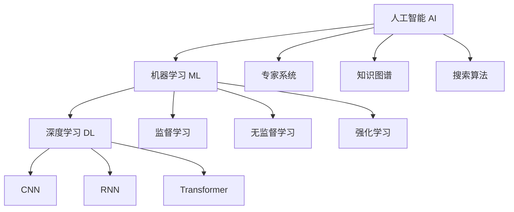
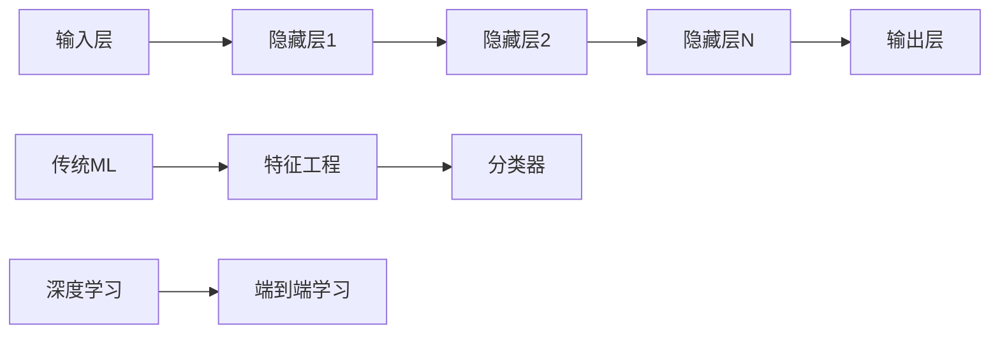
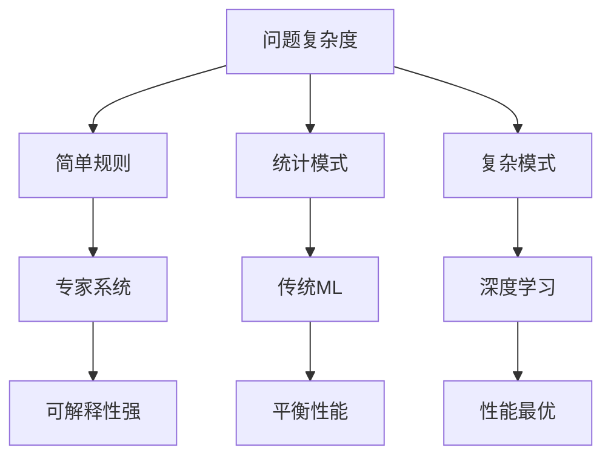
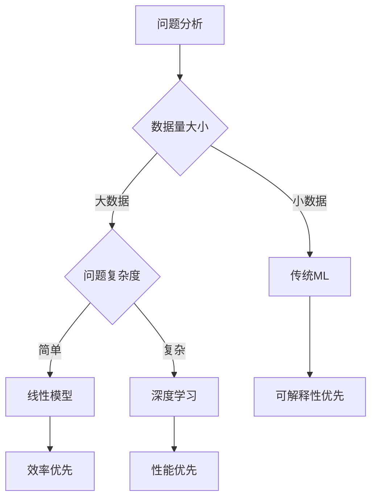

# AI vs ML vs DL

## 🎯 核心概念辨析

### 概念层次关系



## 📊 三概念对比表

| 维度 | AI | ML | DL |
|------|----|----|----|
| **定义** | 让机器具备智能 | 让机器从数据学习 | 多层神经网络学习 |
| **范围** | 最广泛 | AI的子集 | ML的子集 |
| **方法** | 多种技术路径 | 数据驱动 | 神经网络 |
| **复杂度** | 概念层面 | 算法层面 | 架构层面 |
| **应用** | 所有智能系统 | 预测、分类 | 图像、语音、NLP |

## 🔍 详细解析

### 1. 人工智能（AI）- 顶层概念

**核心特征：**
- 🎯 **目标导向**：解决智能问题
- 🔄 **多路径**：不限于特定方法
- 🌐 **广泛性**：涵盖所有智能技术

**包含内容：**
```
AI
├── 机器学习（ML）
├── 专家系统
├── 知识图谱
├── 搜索算法
└── 其他智能技术
```

### 2. 机器学习（ML）- 核心方法

**核心特征：**
- 📊 **数据驱动**：从数据中学习模式
- 🔄 **自动改进**：性能随数据提升
- 🎯 **预测能力**：基于历史预测未来

**学习方式：**

| 类型 | 特点 | 典型算法 | 应用场景 |
|------|------|----------|----------|
| **监督学习** | 有标签数据 | 线性回归、SVM | 分类、回归 |
| **无监督学习** | 无标签数据 | K-means、PCA | 聚类、降维 |
| **强化学习** | 环境交互 | Q-learning | 游戏、控制 |

### 3. 深度学习（DL）- 技术突破

**核心特征：**
- 🧠 **多层网络**：深度神经网络
- 🔄 **端到端**：自动特征提取
- 🎯 **强大能力**：处理复杂模式

**网络架构：**



## 🚀 技术演进路径

### 从AI到DL的发展

| 阶段 | 技术特点 | 代表技术 | 局限性 |
|------|----------|----------|--------|
| **AI初期** | 规则驱动 | 专家系统 | 知识获取困难 |
| **ML兴起** | 数据驱动 | 统计学习 | 特征工程复杂 |
| **DL突破** | 自动学习 | 神经网络 | 需要大量数据 |

### 技术能力对比



## 🎯 实际应用场景

### AI应用层次

| 应用领域 | AI技术 | ML技术 | DL技术 |
|----------|--------|--------|--------|
| **图像识别** | 计算机视觉 | SVM分类 | CNN网络 |
| **语音处理** | 语音识别 | HMM模型 | RNN/LSTM |
| **自然语言** | NLP | 统计方法 | Transformer |
| **推荐系统** | 智能推荐 | 协同过滤 | 深度推荐 |

### 技术选择策略



## 🔗 学习路径建议

### 学习顺序
1. **AI概念** → 建立整体认知
2. **ML原理** → 掌握核心方法
3. **DL技术** → 深入前沿应用

### 实践建议
- 🎯 **从简单开始**：先掌握传统ML
- 📊 **重视数据**：数据质量决定效果
- 🔄 **持续学习**：技术发展迅速

## 🔗 相关链接
- [[01-01-01-AI定义与分类]] - 理解AI基本概念
- [[01-01-02-AI发展历程]] - 技术发展脉络
- [[02-01-01-监督学习原理]] - ML核心方法
- [[02-02-01-神经网络原理]] - DL基础理论

## 💡 费曼学习法应用
**概念关系**：AI是目标（让机器变聪明），ML是方法（从数据学习），DL是工具（深度神经网络）。就像学开车，AI是目标（会开车），ML是方法（通过练习学习），DL是工具（自动挡汽车）。

**技术选择**：选择技术就像选择交通工具，短距离用自行车（传统ML），长距离用汽车（深度学习），关键是要匹配问题需求。

---
*📝 学习提示：理解三者的关系是学习AI的基础，建议结合实际项目加深理解*

