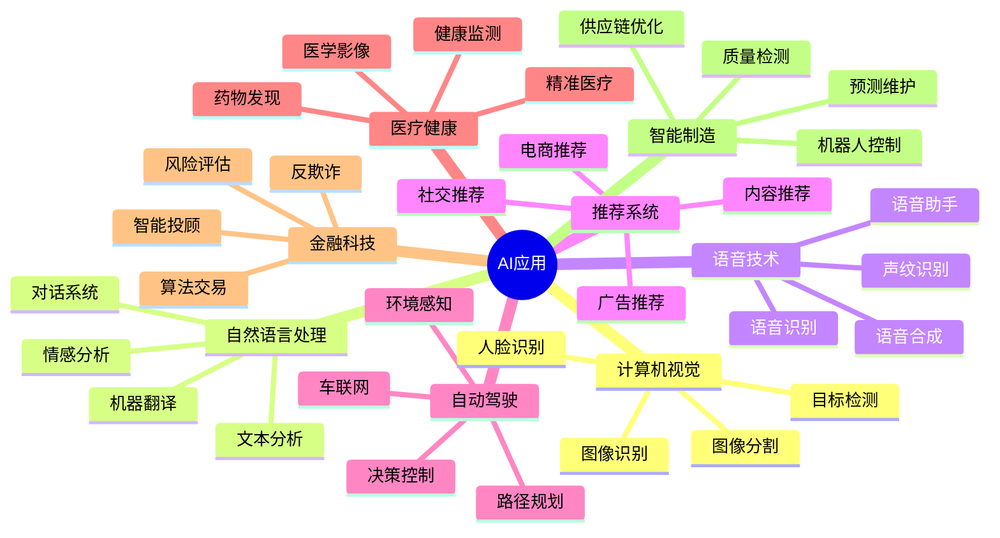
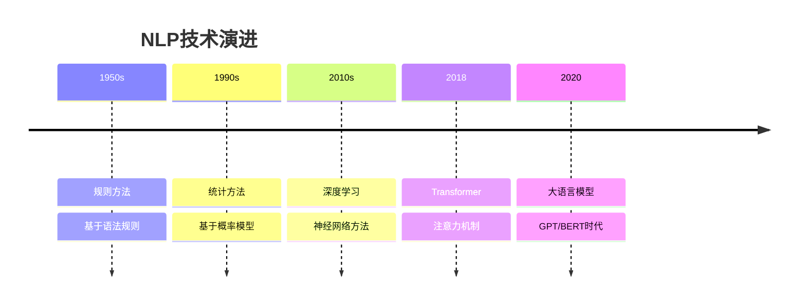
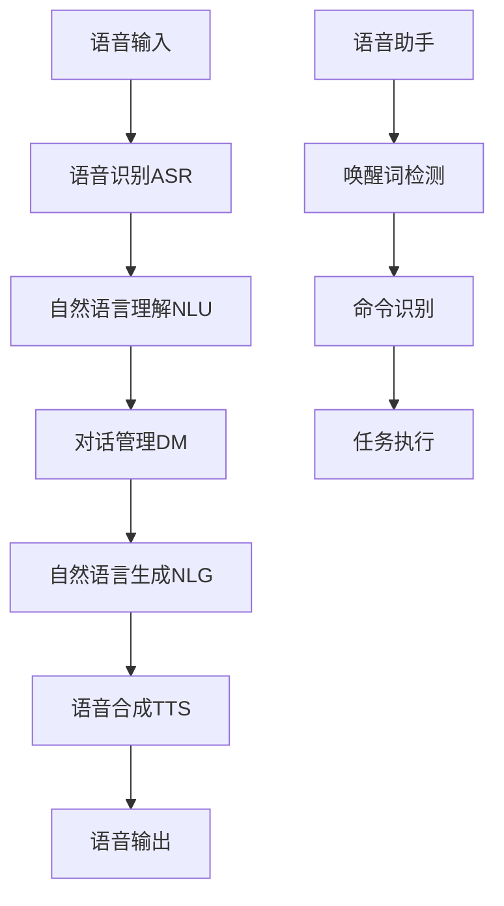
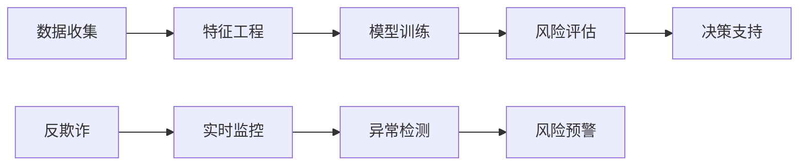
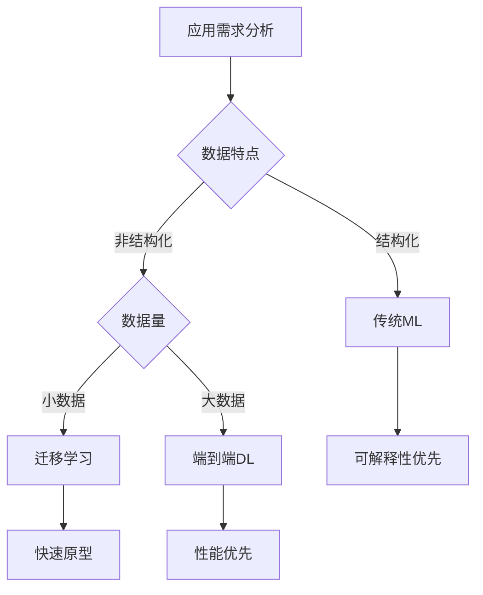

# AI应用领域概览

## 🌐 应用领域全景图

### 核心应用领域

## 🎯 重点应用领域详解

### 1. 计算机视觉（Computer Vision）

**核心能力：**
- 👁️ **图像理解**：识别、分类、检测
- 🔍 **模式识别**：特征提取、匹配
- 📊 **空间分析**：深度估计、3D重建

**典型应用：**

| 应用场景 | 技术方案 | 商业价值 | 技术挑战 |
|----------|----------|----------|----------|
| **人脸识别** | CNN + 人脸检测 | 安防、支付 | 隐私保护 |
| **医学影像** | 深度学习诊断 | 辅助诊断 | 准确性要求 |
| **自动驾驶** | 多传感器融合 | 交通革命 | 安全性保障 |
| **工业检测** | 缺陷检测算法 | 质量提升 | 实时性要求 |

### 2. 自然语言处理（NLP）

**技术发展脉络：**

**应用场景分析：**

| 场景 | 技术特点 | 商业应用 | 发展趋势 |
|------|----------|----------|----------|
| **智能客服** | 意图识别+对话生成 | 降本增效 | 多轮对话 |
| **内容创作** | 文本生成+优化 | 媒体行业 | 创意辅助 |
| **机器翻译** | 序列到序列 | 全球化 | 实时翻译 |
| **情感分析** | 文本分类 | 市场研究 | 细粒度分析 |

### 3. 语音技术（Speech Technology）

**技术栈：**

**市场应用：**

| 产品类型 | 技术特点 | 用户规模 | 发展方向 |
|----------|----------|----------|----------|
| **智能音箱** | 远场语音识别 | 数亿用户 | 多模态交互 |
| **语音助手** | 自然对话 | 移动设备 | 个性化服务 |
| **会议转录** | 实时转写 | 企业应用 | 多语言支持 |
| **语音合成** | 个性化声音 | 内容创作 | 情感表达 |

## 🏭 行业应用深度分析

### 医疗健康领域

**AI应用矩阵：**

| 应用方向 | 技术方案 | 临床价值 | 监管要求 |
|----------|----------|----------|----------|
| **影像诊断** | CNN + 医学影像 | 辅助诊断 | FDA认证 |
| **药物发现** | 分子设计 + 预测 | 加速研发 | 临床试验 |
| **精准医疗** | 基因组分析 | 个性化治疗 | 数据安全 |
| **健康监测** | 可穿戴设备 | 预防医学 | 隐私保护 |

### 金融科技领域

**风险控制体系：**

**核心应用：**

| 业务场景 | AI技术 | 业务价值 | 技术挑战 |
|----------|--------|----------|----------|
| **信用评估** | 机器学习 | 风险控制 | 模型可解释性 |
| **算法交易** | 强化学习 | 收益优化 | 市场波动 |
| **反洗钱** | 异常检测 | 合规要求 | 误报率控制 |
| **智能投顾** | 推荐系统 | 个性化服务 | 监管合规 |

## 🚀 新兴应用趋势

### 1. 多模态AI

**技术融合：**
- 🖼️ **视觉+语言**：图像描述、视觉问答
- 🎵 **音频+视觉**：视频理解、情感分析
- 📱 **多传感器**：AR/VR、智能家居

### 2. 边缘AI

**部署策略：**
- 📱 **移动端**：手机AI芯片
- 🏠 **智能家居**：本地处理
- 🚗 **车载系统**：实时响应

### 3. AI Agent

**智能代理：**
- 🤖 **自主决策**：环境感知+行动执行
- 🔄 **持续学习**：在线学习+适应
- 🤝 **人机协作**：增强人类能力

## 📊 应用价值评估框架

### 商业价值评估

| 维度 | 评估指标 | 权重 | 说明 |
|------|----------|------|------|
| **技术成熟度** | TRL等级 | 30% | 技术可行性 |
| **市场潜力** | 市场规模 | 25% | 商业前景 |
| **实施难度** | 复杂度评分 | 20% | 落地难度 |
| **竞争优势** | 差异化程度 | 15% | 竞争壁垒 |
| **风险控制** | 风险等级 | 10% | 实施风险 |

### 技术选型建议

## 🔗 相关链接
- [[01-01-01-AI定义与分类]] - 理解AI基本概念
- [[01-01-02-AI发展历程]] - 技术发展脉络
- [[03-01-01-图像处理基础]] - 计算机视觉入门
- [[03-02-01-文本预处理技术]] - NLP技术基础

## 💡 费曼学习法应用
**应用理解**：AI应用就像工具箱，不同领域需要不同的工具。计算机视觉是"眼睛"，NLP是"大脑"，语音技术是"耳朵和嘴巴"，推荐系统是"顾问"。

**价值判断**：选择AI应用就像选择投资项目，要看技术成熟度、市场潜力、实施难度和竞争优势，综合评估后决定是否投入。

---
*📝 学习提示：了解AI应用领域有助于确定学习方向，建议结合个人兴趣和职业规划选择重点领域*

