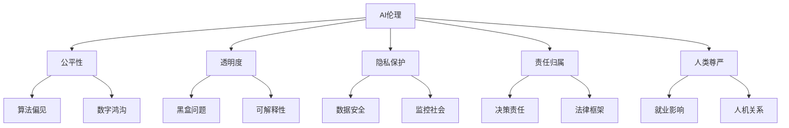
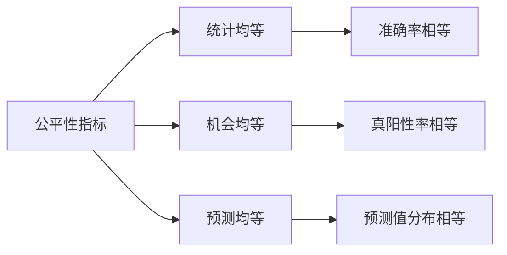
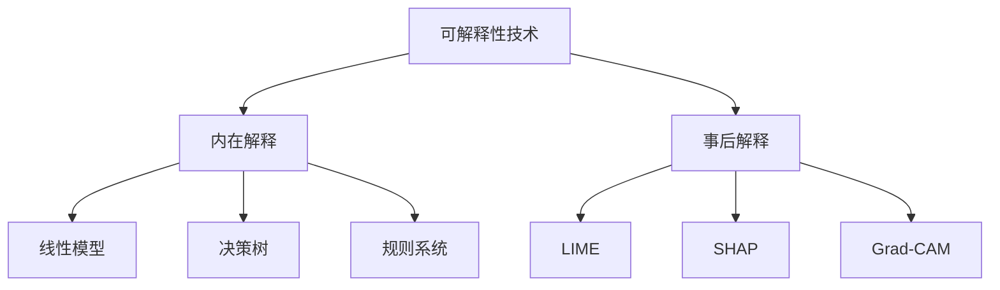
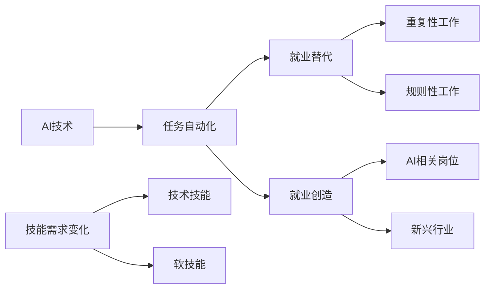
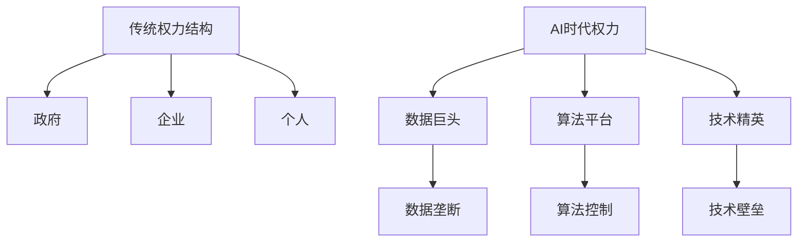
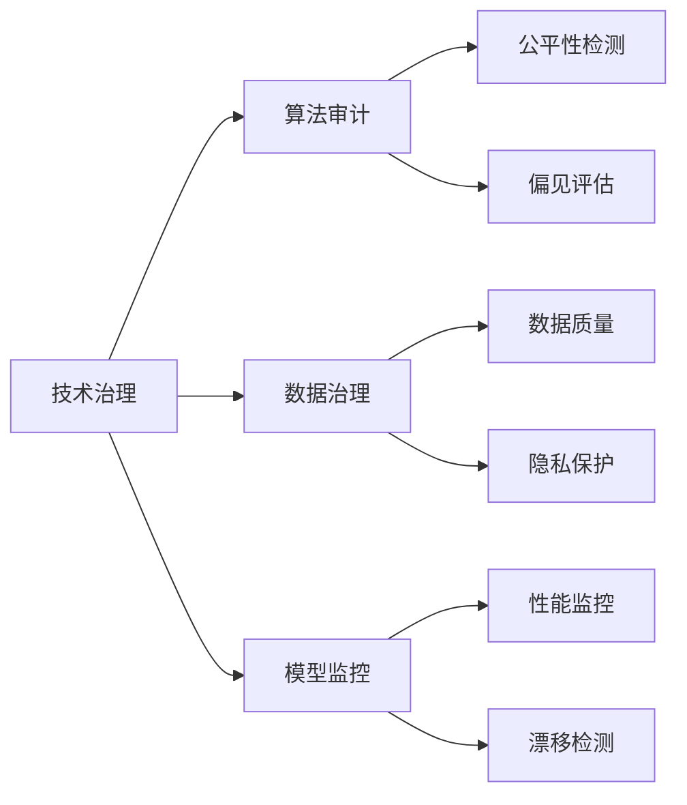
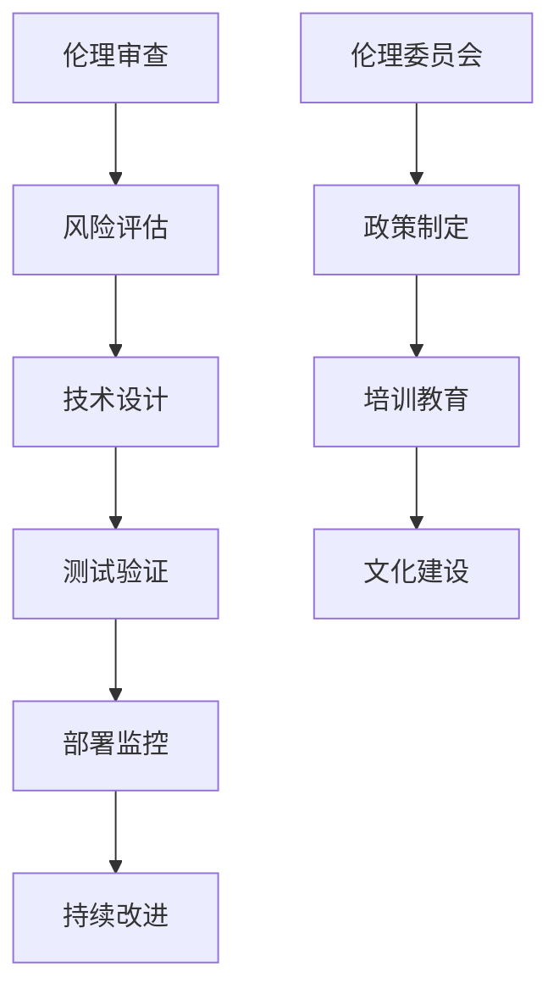

# AI伦理与社会影响

## ⚖️ AI伦理核心议题

### 伦理问题框架

## 🎯 核心伦理问题

### 1. 算法公平性（Algorithmic Fairness）

**偏见来源分析：**

| 偏见类型 | 产生原因 | 典型例子 | 解决方案 |
|----------|----------|----------|----------|
| **数据偏见** | 训练数据不均衡 | 人脸识别性别偏差 | 数据平衡 |
| **算法偏见** | 模型设计缺陷 | 信用评分种族歧视 | 公平性约束 |
| **社会偏见** | 历史不平等 | 招聘系统性别歧视 | 去偏算法 |
| **确认偏见** | 人类认知局限 | 推荐系统信息茧房 | 多样性设计 |

**公平性评估指标：**

### 2. 透明度与可解释性

**可解释性层次：**

| 层次 | 要求 | 技术方案 | 应用场景 |
|------|------|----------|----------|
| **全局解释** | 模型整体行为 | 特征重要性 | 模型审计 |
| **局部解释** | 单个预测原因 | LIME、SHAP | 医疗诊断 |
| **反事实解释** | 改变预测结果 | 反事实分析 | 决策建议 |
| **因果解释** | 因果关系 | 因果推理 | 政策制定 |

**解释性技术对比：**

### 3. 隐私保护

**隐私保护技术：**

| 技术类型 | 原理 | 应用场景 | 保护程度 |
|----------|------|----------|----------|
| **差分隐私** | 添加噪声 | 统计查询 | 强保护 |
| **联邦学习** | 分布式训练 | 多机构协作 | 中等保护 |
| **同态加密** | 加密计算 | 云计算 | 强保护 |
| **安全多方计算** | 协议保护 | 数据共享 | 强保护 |

## 🌍 社会影响分析

### 1. 就业影响

**影响机制：**

**职业影响评估：**

| 职业类型 | AI影响程度 | 替代风险 | 转型建议 |
|----------|------------|----------|----------|
| **高技能专业** | 低 | 低 | 增强AI协作能力 |
| **中等技能** | 中 | 中 | 学习新技术 |
| **低技能服务** | 高 | 高 | 转向AI难以替代领域 |
| **创意工作** | 低 | 低 | 利用AI增强创意 |

### 2. 数字鸿沟

**鸿沟表现：**

| 维度 | 发达国家 | 发展中国家 | 差距影响 |
|------|----------|------------|----------|
| **技术接入** | 普及率高 | 普及率低 | 信息获取不平等 |
| **技能水平** | 教育完善 | 教育资源不足 | 就业机会不均 |
| **数据资源** | 数据丰富 | 数据稀缺 | AI发展不平衡 |
| **政策支持** | 政策完善 | 政策滞后 | 发展环境差异 |

### 3. 权力集中

**权力结构变化：**

## 🛡️ 治理框架

### 1. 国际治理

**主要倡议：**

| 组织 | 倡议内容 | 影响范围 | 实施状态 |
|------|----------|----------|----------|
| **欧盟** | AI法案 | 欧盟地区 | 立法阶段 |
| **OECD** | AI原则 | 国际共识 | 政策指导 |
| **UNESCO** | AI伦理建议 | 全球范围 | 框架制定 |
| **IEEE** | 伦理标准 | 技术社区 | 标准制定 |

### 2. 技术治理

**治理技术：**

### 3. 企业责任

**责任框架：**

| 责任类型 | 具体要求 | 实施措施 | 评估标准 |
|----------|----------|----------|----------|
| **技术责任** | 算法公平性 | 偏见检测 | 公平性指标 |
| **数据责任** | 隐私保护 | 数据最小化 | 合规审计 |
| **社会责任** | 社会影响 | 影响评估 | 社会指标 |
| **法律责任** | 合规运营 | 法律遵循 | 合规检查 |

## 🎯 实践建议

### 1. 开发者伦理

**开发原则：**
- 🎯 **目的明确**：技术服务于人类福祉
- ⚖️ **公平公正**：避免算法偏见
- 🔍 **透明可解释**：提供决策依据
- 🛡️ **隐私保护**：最小化数据收集

### 2. 企业实践

**实施框架：**

### 3. 政策建议

**政策方向：**
- 📋 **法律框架**：建立AI法律体系
- 🎓 **教育体系**：培养AI伦理意识
- 🔬 **研究支持**：推动伦理技术研究
- 🌐 **国际合作**：协调全球治理

## 🔗 相关链接
- [[01-01-01-AI定义与分类]] - 理解AI基本概念
- [[01-01-02-AI发展历程]] - 技术发展脉络
- [[03-04-04-AI伦理与安全]] - 工程实践中的伦理
- [[99-01-知识体系总结]] - 整体知识框架

## 💡 费曼学习法应用
**伦理理解**：AI伦理就像交通规则，确保AI技术安全、公平地为人类服务。算法偏见就像有色眼镜，会让我们看到扭曲的世界。

**责任意识**：开发AI就像造车，不仅要考虑性能，更要考虑安全性。每个AI开发者都是"司机"，要对技术的社会影响负责。

---
*📝 学习提示：AI伦理不是技术问题，而是价值观问题。建议在学习技术的同时，培养伦理意识和责任感*

