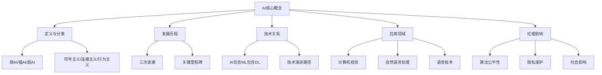
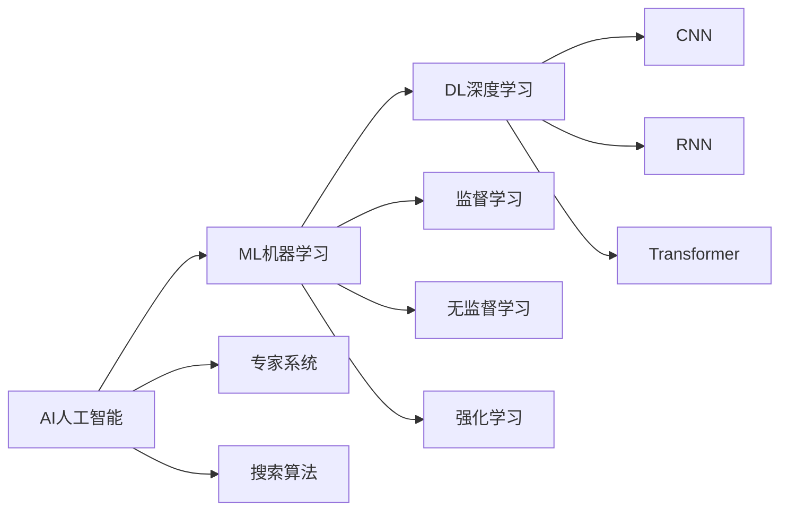
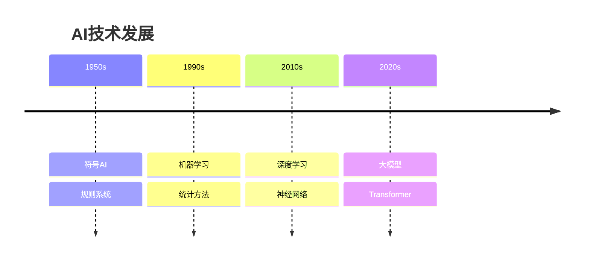

# 基础概念记忆要点

## 🧠 记忆策略

### 金字塔记忆法

## 📝 核心概念速记

### 1. AI定义三要素

| 要素 | 关键词 | 记忆口诀 |
|------|--------|----------|
| **感知** | 理解环境 | "看得见" |
| **推理** | 逻辑判断 | "想得通" |
| **学习** | 经验改进 | "学得会" |
| **交互** | 沟通交流 | "说得来" |

**记忆口诀**：AI四能力，感知推理学习交互

### 2. AI分类记忆

**按能力分类：**
- 🔵 **弱AI**：特定任务（如Siri）
- 🟡 **强AI**：通用智能（目标）
- 🔴 **超AI**：超越人类（科幻）

**按方法分类：**
- 📚 **符号主义**：知识+规则
- 🧠 **连接主义**：神经网络
- 🎯 **行为主义**：环境交互

### 3. 技术关系图

**记忆口诀**：AI最大，包含ML，ML包含DL

## 🎯 关键时间节点

### 历史里程碑

| 年份 | 事件 | 意义 | 记忆技巧 |
|------|------|------|----------|
| **1950** | 图灵测试 | AI判断标准 | "50年代测智能" |
| **1956** | 达特茅斯会议 | AI学科诞生 | "56年AI生" |
| **2012** | ImageNet突破 | 深度学习崛起 | "12年深度起" |
| **2016** | AlphaGo胜利 | AI战胜人类 | "16年AI胜" |
| **2022** | ChatGPT发布 | AI应用普及 | "22年AI普" |

### 发展规律

**三要素驱动：**
- 📊 **数据**：燃料
- 🧮 **算法**：引擎  
- 💻 **算力**：基础设施

**记忆口诀**：数据燃料算法引擎算力基础

## 🔍 应用领域速记

### 五大核心领域

| 领域 | 核心能力 | 典型应用 | 记忆关键词 |
|------|----------|----------|------------|
| **计算机视觉** | 图像理解 | 人脸识别 | "眼睛" |
| **自然语言处理** | 文本理解 | 机器翻译 | "大脑" |
| **语音技术** | 语音处理 | 语音助手 | "耳朵嘴巴" |
| **推荐系统** | 个性化推荐 | 电商推荐 | "顾问" |
| **自动驾驶** | 环境感知 | 无人驾驶 | "司机" |

**记忆口诀**：视觉眼睛语言大脑语音耳朵推荐顾问驾驶司机

### 技术发展脉络

## ⚖️ 伦理要点

### 四大伦理原则

| 原则 | 核心要求 | 实践要点 | 记忆关键词 |
|------|----------|----------|------------|
| **公平性** | 避免偏见 | 算法审计 | "公平" |
| **透明度** | 可解释性 | 黑盒问题 | "透明" |
| **隐私** | 数据保护 | 最小化原则 | "隐私" |
| **责任** | 明确归属 | 法律框架 | "责任" |

**记忆口诀**：公平透明隐私责任

### 社会影响

**就业影响：**
- 🔄 **替代效应**：自动化替代
- 🆕 **创造效应**：新岗位产生
- 📚 **技能升级**：终身学习

**记忆口诀**：替代创造技能升级

## 🎯 学习检查清单

### 概念理解检查

- [ ] 能用自己的话解释AI定义
- [ ] 能区分弱AI、强AI、超AI
- [ ] 能说明AI、ML、DL的关系
- [ ] 能列举主要应用领域
- [ ] 能识别伦理问题

### 知识应用检查

- [ ] 能分析具体AI应用的分类
- [ ] 能评估AI技术的社会影响
- [ ] 能识别算法偏见问题
- [ ] 能提出伦理解决方案
- [ ] 能规划学习路径

## 🔗 相关链接
- [[01-01-01-AI定义与分类]] - 详细概念解析
- [[01-01-02-AI发展历程]] - 历史脉络梳理
- [[01-01-03-AI vs ML vs DL]] - 技术关系详解
- [[01-01-04-AI应用领域概览]] - 应用场景分析
- [[01-01-05-AI伦理与社会影响]] - 伦理问题探讨

## 💡 费曼学习法应用
**概念复述**：AI就是让机器变聪明的技术，就像教小孩一样，通过大量数据训练，让机器学会识别、理解和决策。

**知识关联**：AI像一棵大树，AI是树干，ML是主要分支，DL是细枝，各种应用是叶子，伦理是根系的土壤。

**教学他人**：向朋友解释AI时，可以说"AI就是让计算机像人一样思考的技术，现在主要是弱AI，能解决特定问题，比如手机助手、人脸识别等"。

---
*📝 学习提示：记忆要点是学习的基础，建议定期回顾和测试，确保核心概念掌握牢固*

