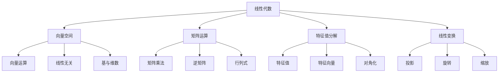
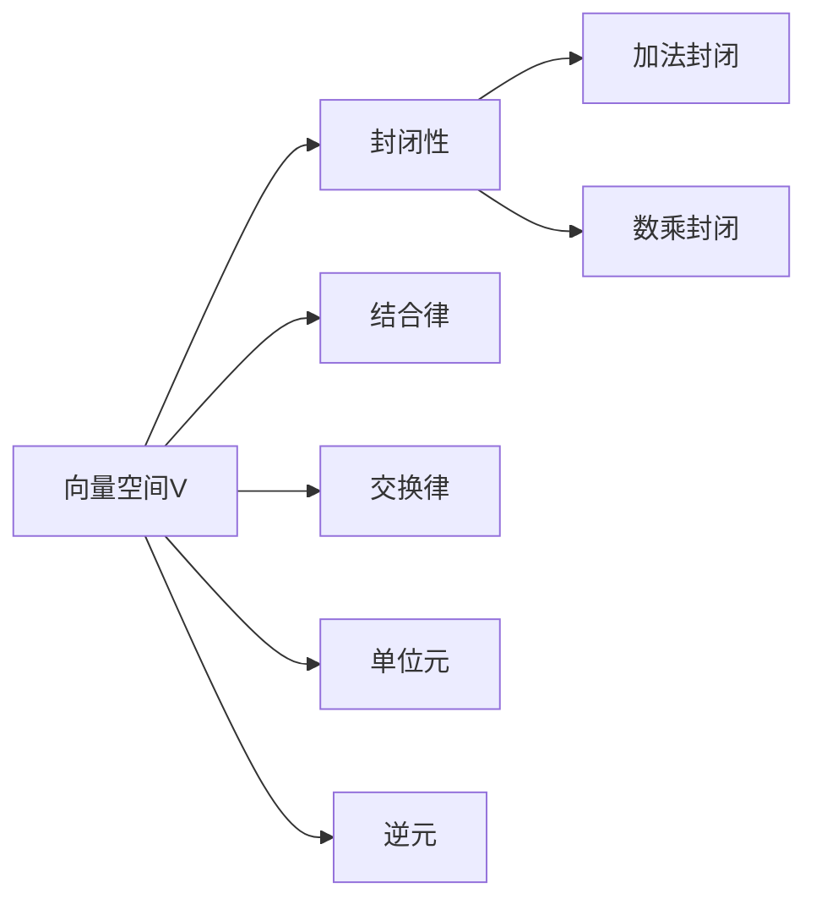
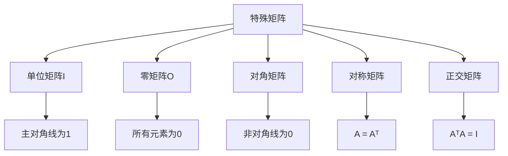
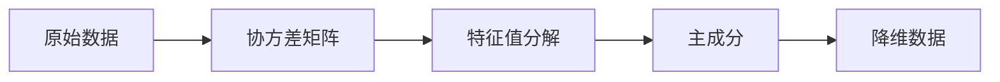
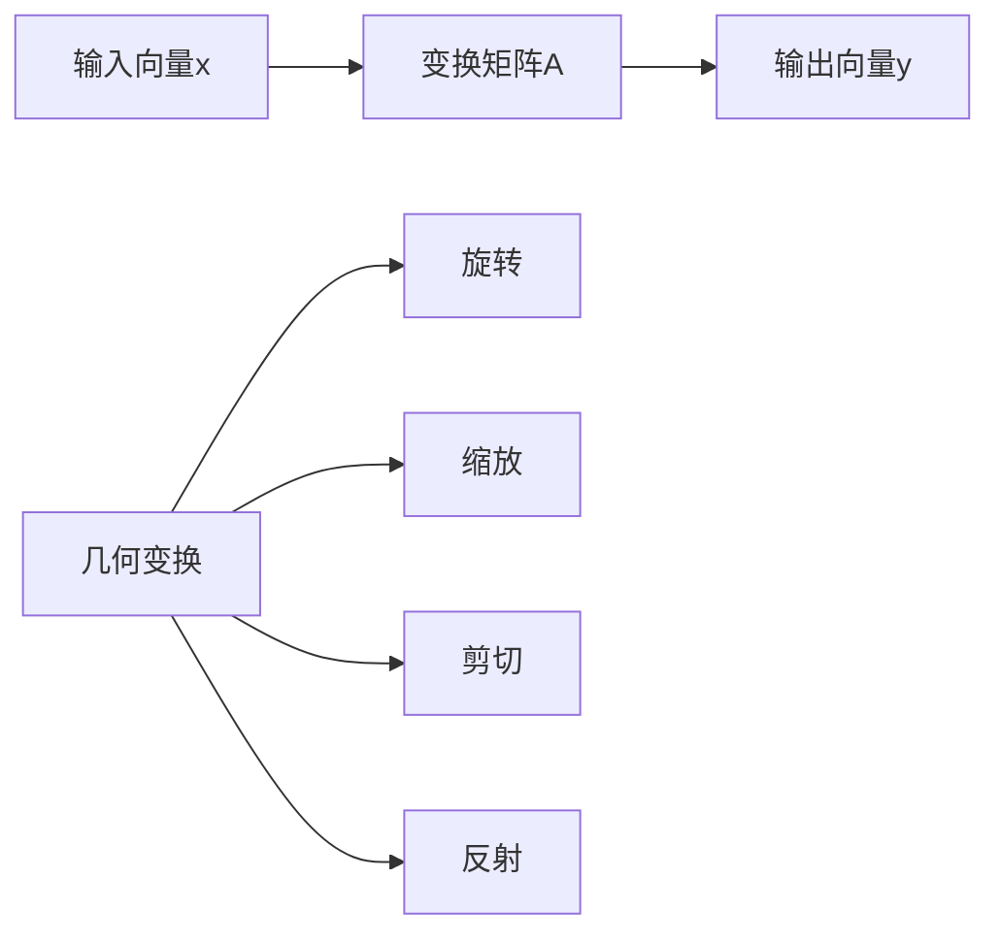

# 线性代数基础

## 📐 核心概念体系

### 线性代数知识图谱



## 🎯 核心概念详解

### 1. 向量与向量空间

**向量表示：**
- 📊 **几何表示**：有向线段
- 🔢 **代数表示**：坐标数组
- 🎯 **物理表示**：力、速度、位移

**向量运算：**

| 运算 | 定义 | 几何意义 | AI应用 |
|------|------|----------|--------|
| **加法** | 对应分量相加 | 平行四边形法则 | 特征组合 |
| **数乘** | 标量乘以向量 | 缩放变换 | 权重调整 |
| **点积** | 对应分量相乘求和 | 投影长度 | 相似度计算 |
| **叉积** | 三维向量运算 | 垂直向量 | 3D变换 |

**向量空间性质：**


### 2. 矩阵基础

**矩阵表示：**
```
A = [a₁₁  a₁₂  ...  a₁ₙ]
    [a₂₁  a₂₂  ...  a₂ₙ]
    [ ⋮    ⋮   ⋱   ⋮ ]
    [aₘ₁  aₘ₂  ...  aₘₙ]
```

**矩阵运算：**

| 运算 | 条件 | 结果 | AI应用 |
|------|------|------|--------|
| **加法** | 同维矩阵 | 对应元素相加 | 特征融合 |
| **乘法** | 列数=行数 | 新矩阵 | 线性变换 |
| **转置** | 任意矩阵 | 行列互换 | 梯度计算 |
| **逆** | 方阵且可逆 | 满足AA⁻¹=I | 线性方程组 |

**特殊矩阵：**



### 3. 特征值与特征向量

**定义：**
对于矩阵A，如果存在非零向量v和标量λ，使得：
```
Av = λv
```
则λ称为特征值，v称为特征向量。

**几何意义：**
- 🎯 **特征向量**：变换后方向不变的向量
- 📏 **特征值**：变换后向量的缩放倍数

**计算步骤：**
1. 求解特征方程：det(A - λI) = 0
2. 求特征值λ
3. 对每个λ，求解(A - λI)v = 0
4. 得到特征向量v

## 🔧 AI中的应用

### 1. 主成分分析（PCA）

**原理：**


**数学表达：**
- 协方差矩阵：C = (1/n)XᵀX
- 特征值分解：C = VΛVᵀ
- 主成分：选择最大特征值对应的特征向量

### 2. 奇异值分解（SVD）

**分解形式：**
```
A = UΣVᵀ
```
其中：
- U：左奇异向量矩阵
- Σ：奇异值对角矩阵
- V：右奇异向量矩阵

**应用场景：**
- 📊 **数据降维**：保留主要信息
- 🔍 **推荐系统**：矩阵分解
- 🖼️ **图像压缩**：低秩近似

### 3. 线性回归

**数学形式：**
```
y = Xw + b
```
其中：
- X：特征矩阵
- w：权重向量
- b：偏置项

**最小二乘解：**
```
w = (XᵀX)⁻¹Xᵀy
```

## 📊 重要定理与性质

### 1. 线性无关性

**定义：**
向量组{v₁, v₂, ..., vₙ}线性无关，当且仅当：
```
c₁v₁ + c₂v₂ + ... + cₙvₙ = 0
```
只有c₁ = c₂ = ... = cₙ = 0时成立。

**判断方法：**
- 🔢 **行列式法**：det ≠ 0
- 🎯 **秩法**：rank = n
- 🔍 **高斯消元**：无自由变量

### 2. 基与维数

**基的定义：**
向量空间V的基是线性无关的向量组，且能张成整个空间V。

**维数定理：**
- 📏 **维数**：基中向量的个数
- 🔄 **唯一性**：所有基的维数相同
- 📊 **坐标表示**：任何向量可唯一表示为基的线性组合

### 3. 线性变换

**变换矩阵：**


## 🎯 计算技巧

### 1. 矩阵乘法优化

**分块乘法：**
```
[A₁₁ A₁₂] [B₁₁ B₁₂]   [A₁₁B₁₁+A₁₂B₂₁ A₁₁B₁₂+A₁₂B₂₂]
[A₂₁ A₂₂] [B₂₁ B₂₂] = [A₂₁B₁₁+A₂₂B₂₁ A₂₁B₁₂+A₂₂B₂₂]
```

**向量化计算：**
- 🚀 **并行计算**：GPU加速
- 📊 **内存优化**：缓存友好
- 🔢 **数值稳定**：避免溢出

### 2. 特征值计算

**幂迭代法：**
```python
# 伪代码
v = random_vector()
for i in range(max_iter):
    v = A @ v
    v = v / norm(v)
    eigenvalue = v.T @ A @ v
```

**QR算法：**
- 🔄 **迭代分解**：A = QR
- 🔄 **重新组合**：A = RQ
- 📈 **收敛性**：趋向对角矩阵

## 🔗 相关链接
- [[01-02-02-概率论与统计学]] - 概率基础
- [[01-02-03-微积分基础]] - 导数与积分
- [[02-01-01-监督学习原理]] - 线性回归应用
- [[02-02-01-神经网络原理]] - 矩阵运算应用

## 💡 费曼学习法应用
**概念理解**：线性代数就像"数学的语法"，向量是"句子"，矩阵是"语法规则"，特征值是"语法特征"。学习线性代数就是学习如何用数学语言描述世界。

**几何直觉**：矩阵乘法就像"变换机器"，输入一个向量，输出变换后的向量。特征向量是"不变方向"，特征值是"缩放倍数"。

**实际应用**：在AI中，线性代数无处不在。神经网络就是矩阵运算，PCA降维就是特征值分解，推荐系统就是矩阵分解。

---
*📝 学习提示：线性代数是AI的数学基础，建议多练习矩阵运算，培养几何直觉，理解变换的本质*


