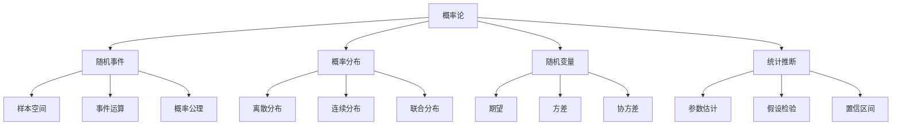
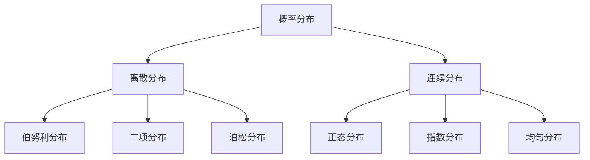

# 概率论与统计学

## 📊 概率论核心概念

### 概率论知识体系



## 🎯 基础概念

### 1. 随机事件与概率

**概率公理：**
1. **非负性**：P(A) ≥ 0
2. **规范性**：P(Ω) = 1
3. **可加性**：P(A∪B) = P(A) + P(B) - P(A∩B)

**条件概率：**
```
P(A|B) = P(A∩B) / P(B)
```

**贝叶斯定理：**
```
P(A|B) = P(B|A) × P(A) / P(B)
```

**事件关系：**

| 关系 | 定义 | 概率公式 | AI应用 |
|------|------|----------|--------|
| **独立** | P(A∩B) = P(A)P(B) | 无影响 | 特征独立假设 |
| **互斥** | P(A∩B) = 0 | P(A∪B) = P(A)+P(B) | 分类问题 |
| **完备** | P(A₁∪...∪Aₙ) = 1 | 全概率公式 | 模型集成 |

### 2. 随机变量

**离散随机变量：**
- 📊 **概率质量函数**：P(X = x)
- 🎯 **期望**：E[X] = Σx·P(X = x)
- 📏 **方差**：Var(X) = E[X²] - E[X]²

**连续随机变量：**
- 📈 **概率密度函数**：f(x)
- 🎯 **期望**：E[X] = ∫xf(x)dx
- 📏 **方差**：Var(X) = E[X²] - E[X]²

**重要分布：**



## 📈 重要概率分布

### 1. 正态分布

**概率密度函数：**
```
f(x) = (1/√(2πσ²)) × e^(-(x-μ)²/(2σ²))
```

**性质：**
- 🎯 **对称性**：关于均值对称
- 📊 **68-95-99.7规则**：1σ、2σ、3σ区间
- 🔄 **中心极限定理**：样本均值趋于正态

**标准正态分布：**
- μ = 0, σ = 1
- 记作 Z ~ N(0,1)
- 查表计算概率

### 2. 二项分布

**概率质量函数：**
```
P(X = k) = C(n,k) × p^k × (1-p)^(n-k)
```

**参数：**
- n：试验次数
- p：成功概率
- k：成功次数

**应用场景：**
- 🎯 **分类问题**：二分类准确率
- 📊 **质量控制**：缺陷率统计
- 🔍 **A/B测试**：转化率分析

### 3. 泊松分布

**概率质量函数：**
```
P(X = k) = (λ^k × e^(-λ)) / k!
```

**参数：**
- λ：平均发生率
- k：实际发生次数

**应用场景：**
- 📞 **呼叫中心**：电话到达率
- 🚗 **交通流量**：车辆到达
- 🛒 **电商订单**：订单到达

## 📊 统计学基础

### 1. 描述性统计

**中心趋势：**

| 统计量 | 定义 | 特点 | 适用场景 |
|--------|------|------|----------|
| **均值** | Σx/n | 受异常值影响 | 正态分布 |
| **中位数** | 中间值 | 稳健 | 偏态分布 |
| **众数** | 最频繁值 | 直观 | 分类数据 |

**离散程度：**

| 统计量 | 定义 | 单位 | 特点 |
|--------|------|------|------|
| **方差** | Σ(x-μ)²/n | 原单位² | 平方和 |
| **标准差** | √方差 | 原单位 | 可解释性 |
| **变异系数** | σ/μ | 无量纲 | 相对离散 |

### 2. 参数估计

**点估计：**

| 参数 | 估计量 | 性质 | 公式 |
|------|--------|------|------|
| **均值** | 样本均值 | 无偏、一致 | x̄ = Σx/n |
| **方差** | 样本方差 | 无偏 | s² = Σ(x-x̄)²/(n-1) |
| **比例** | 样本比例 | 无偏、一致 | p̂ = k/n |

**区间估计：**
```
置信区间 = 估计值 ± 临界值 × 标准误差
```

**置信水平：**
- 90%：α = 0.1
- 95%：α = 0.05
- 99%：α = 0.01

### 3. 假设检验

**检验步骤：**
1. **建立假设**：H₀（原假设）vs H₁（备择假设）
2. **选择检验统计量**：t统计量、z统计量等
3. **确定显著性水平**：α = 0.05
4. **计算p值**：P(统计量 ≥ 观察值)
5. **做出决策**：p < α 拒绝H₀

**错误类型：**

| 错误类型 | 定义 | 概率 | 控制方法 |
|----------|------|------|----------|
| **第一类错误** | 拒绝真H₀ | α | 显著性水平 |
| **第二类错误** | 接受假H₀ | β | 样本量、效应量 |

## 🔧 AI中的应用

### 1. 贝叶斯推理

**贝叶斯更新：**
```
后验概率 ∝ 似然 × 先验概率
P(θ|D) ∝ P(D|θ) × P(θ)
```

**应用场景：**
- 🎯 **朴素贝叶斯**：文本分类
- 🔍 **贝叶斯网络**：因果关系
- 📊 **贝叶斯优化**：超参数调优

### 2. 最大似然估计

**似然函数：**
```
L(θ) = ∏ᵢ P(xᵢ|θ)
```

**对数似然：**
```
ℓ(θ) = log L(θ) = Σᵢ log P(xᵢ|θ)
```

**最大似然估计：**
```
θ̂ = argmax L(θ) = argmax ℓ(θ)
```

### 3. 中心极限定理

**定理内容：**
样本均值X̄的分布趋于正态分布N(μ, σ²/n)

**应用：**
- 📊 **置信区间**：均值估计
- 🔍 **假设检验**：均值比较
- 📈 **质量控制**：过程监控

## 📊 统计检验方法

### 1. 参数检验

**t检验：**
- 🎯 **单样本t检验**：检验均值
- 🔄 **配对t检验**：相关样本
- 📊 **独立样本t检验**：两组比较

**F检验：**
- 📏 **方差齐性检验**：Levene检验
- 🔍 **方差分析**：多组比较

### 2. 非参数检验

**卡方检验：**
- 📊 **拟合优度检验**：分布拟合
- 🔍 **独立性检验**：变量关联

**Mann-Whitney U检验：**
- 📈 **中位数比较**：非正态数据
- 🔄 **Wilcoxon检验**：配对数据

## 🎯 计算技巧

### 1. 数值计算

**蒙特卡洛方法：**
```python
# 伪代码
def monte_carlo_integration(f, a, b, n):
    samples = uniform(a, b, n)
    return (b-a) * mean(f(samples))
```

**Bootstrap方法：**
- 🔄 **重采样**：有放回抽样
- 📊 **置信区间**：非参数估计
- 🎯 **偏差估计**：模型评估

### 2. 贝叶斯计算

**MCMC方法：**
- 🔄 **马尔可夫链**：状态转移
- 📊 **蒙特卡洛**：随机采样
- 🎯 **后验分布**：近似计算

**变分推理：**
- 🔍 **近似分布**：简化计算
- 📈 **优化目标**：ELBO最大化
- ⚡ **计算效率**：快速收敛

## 🔗 相关链接
- [[01-02-01-线性代数基础]] - 数学基础
- [[01-02-03-微积分基础]] - 导数与积分
- [[02-01-01-监督学习原理]] - 概率应用
- [[02-01-04-模型评估方法]] - 统计评估

## 💡 费曼学习法应用
**概念理解**：概率论就像"不确定性数学"，描述随机现象。统计学就像"数据侦探"，从数据中找出规律。贝叶斯定理就像"更新信念"，用新信息修正原有判断。

**实际应用**：在AI中，概率论无处不在。机器学习就是"概率推理"，深度学习就是"概率优化"，贝叶斯网络就是"因果推理"。

**直觉培养**：概率就像"天气预报"，统计学就像"民意调查"，假设检验就像"法庭审判"。

---
*📝 学习提示：概率论与统计学是AI的理论基础，建议多练习计算，培养概率直觉，理解统计推理的本质*

