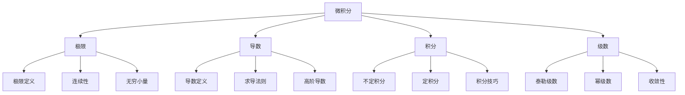

# 微积分基础

## 📐 微积分核心概念

### 微积分知识体系



## 🎯 极限与连续性

### 1. 极限概念

**极限定义：**
```
lim(x→a) f(x) = L
```
当x无限接近a时，f(x)无限接近L。

**极限性质：**
- 🔄 **唯一性**：极限值唯一
- 📊 **局部性**：只与a附近的值有关
- 🔢 **运算性**：极限可进行四则运算

**重要极限：**
```
lim(x→0) sin(x)/x = 1
lim(x→∞) (1 + 1/x)^x = e
```

### 2. 连续性

**连续定义：**
函数f在点a连续，当且仅当：
```
lim(x→a) f(x) = f(a)
```

**连续性质：**
- 🔗 **局部性质**：在点a附近连续
- 📈 **全局性质**：在整个区间连续
- 🎯 **中间值定理**：连续函数有中间值

## 📈 导数基础

### 1. 导数定义

**导数定义：**
```
f'(x) = lim(h→0) [f(x+h) - f(x)]/h
```

**几何意义：**
- 📊 **切线斜率**：曲线在某点的切线斜率
- 🎯 **瞬时变化率**：函数在某点的变化速度
- 📈 **函数性质**：单调性、极值

**物理意义：**
- 🚗 **速度**：位移对时间的导数
- ⚡ **加速度**：速度对时间的导数
- 🔥 **功率**：功对时间的导数

### 2. 求导法则

**基本求导公式：**

| 函数类型 | 导数公式 | 例子 |
|----------|----------|------|
| **常数** | (c)' = 0 | (5)' = 0 |
| **幂函数** | (x^n)' = nx^(n-1) | (x³)' = 3x² |
| **指数函数** | (e^x)' = e^x | (e^x)' = e^x |
| **对数函数** | (ln x)' = 1/x | (ln x)' = 1/x |
| **三角函数** | (sin x)' = cos x | (sin x)' = cos x |

**求导法则：**

| 法则 | 公式 | 应用 |
|------|------|------|
| **和差法则** | (f±g)' = f'±g' | 多项式求导 |
| **积法则** | (fg)' = f'g + fg' | 复合函数 |
| **商法则** | (f/g)' = (f'g-fg')/g² | 有理函数 |
| **链式法则** | (f(g(x)))' = f'(g(x))g'(x) | 复合函数 |

### 3. 高阶导数

**二阶导数：**
```
f''(x) = d²f/dx²
```

**几何意义：**
- 📊 **曲率**：曲线的弯曲程度
- 🎯 **凹凸性**：函数的凹凸性质
- 📈 **拐点**：凹凸性改变的点

**应用：**
- 🔍 **优化问题**：二阶导数判断极值
- 📊 **泰勒展开**：高阶项系数
- 🎯 **牛顿法**：二阶收敛

## 📊 积分基础

### 1. 不定积分

**积分定义：**
```
∫f(x)dx = F(x) + C
```
其中F'(x) = f(x)，C为常数。

**基本积分公式：**

| 函数类型 | 积分公式 | 例子 |
|----------|----------|------|
| **幂函数** | ∫x^n dx = x^(n+1)/(n+1) + C | ∫x² dx = x³/3 + C |
| **指数函数** | ∫e^x dx = e^x + C | ∫e^x dx = e^x + C |
| **对数函数** | ∫1/x dx = ln|x| + C | ∫1/x dx = ln|x| + C |
| **三角函数** | ∫sin x dx = -cos x + C | ∫sin x dx = -cos x + C |

### 2. 定积分

**定积分定义：**
```
∫[a,b] f(x)dx = lim(n→∞) Σf(xᵢ)Δx
```

**几何意义：**
- 📊 **面积**：曲线与x轴围成的面积
- 🎯 **累积量**：函数的累积效应
- 📈 **平均值**：函数在区间上的平均值

**牛顿-莱布尼茨公式：**
```
∫[a,b] f(x)dx = F(b) - F(a)
```

### 3. 积分技巧

**换元积分法：**
```
∫f(g(x))g'(x)dx = ∫f(u)du
```

**分部积分法：**
```
∫u dv = uv - ∫v du
```

**应用场景：**
- 🔍 **复杂函数**：简化积分计算
- 📊 **特殊函数**：处理特殊积分
- 🎯 **数值计算**：近似计算

## 🔧 AI中的应用

### 1. 梯度下降

**梯度定义：**
```
∇f = (∂f/∂x₁, ∂f/∂x₂, ..., ∂f/∂xₙ)
```

**梯度下降算法：**
```
x^(k+1) = x^(k) - α∇f(x^(k))
```

**应用场景：**
- 🎯 **优化问题**：最小化损失函数
- 📊 **机器学习**：参数更新
- 🔍 **深度学习**：反向传播

### 2. 链式法则

**复合函数求导：**
```
d/dx[f(g(x))] = f'(g(x)) × g'(x)
```

**多元链式法则：**
```
∂z/∂x = (∂z/∂u)(∂u/∂x) + (∂z/∂v)(∂v/∂x)
```

**应用：**
- 🧠 **反向传播**：神经网络训练
- 📊 **自动微分**：计算图求导
- 🎯 **优化算法**：梯度计算

### 3. 泰勒展开

**泰勒级数：**
```
f(x) = f(a) + f'(a)(x-a) + f''(a)(x-a)²/2! + ...
```

**应用：**
- 📊 **函数近似**：复杂函数近似
- 🔍 **数值计算**：提高精度
- 🎯 **优化算法**：二阶方法

## 📊 多元微积分

### 1. 偏导数

**偏导数定义：**
```
∂f/∂x = lim(h→0) [f(x+h,y) - f(x,y)]/h
```

**几何意义：**
- 📊 **切线斜率**：沿x方向的斜率
- 🎯 **变化率**：函数沿某方向的变化率
- 📈 **梯度方向**：函数增长最快的方向

### 2. 梯度

**梯度向量：**
```
∇f = (∂f/∂x, ∂f/∂y, ∂f/∂z)
```

**性质：**
- 🎯 **方向导数**：∇f·u = D_u f
- 📊 **最速上升**：梯度方向
- 🔍 **等高线**：梯度垂直于等高线

### 3. 拉格朗日乘数法

**约束优化：**
```
min f(x,y) subject to g(x,y) = 0
```

**拉格朗日函数：**
```
L(x,y,λ) = f(x,y) - λg(x,y)
```

**必要条件：**
```
∇L = 0
```

## 🎯 数值方法

### 1. 数值微分

**前向差分：**
```
f'(x) ≈ [f(x+h) - f(x)]/h
```

**中心差分：**
```
f'(x) ≈ [f(x+h) - f(x-h)]/(2h)
```

**误差分析：**
- 📊 **截断误差**：O(h)
- 🔍 **舍入误差**：O(1/h)
- 🎯 **最优步长**：平衡两种误差

### 2. 数值积分

**梯形法则：**
```
∫[a,b] f(x)dx ≈ (b-a)[f(a)+f(b)]/2
```

**辛普森法则：**
```
∫[a,b] f(x)dx ≈ (b-a)[f(a)+4f((a+b)/2)+f(b)]/6
```

**蒙特卡洛积分：**
```
∫[a,b] f(x)dx ≈ (b-a) × (1/n)Σf(xᵢ)
```

## 🔗 相关链接
- [[01-02-01-线性代数基础]] - 数学基础
- [[01-02-02-概率论与统计学]] - 概率统计
- [[02-02-02-反向传播算法]] - 梯度应用
- [[02-02-04-优化算法对比]] - 优化方法

## 💡 费曼学习法应用
**概念理解**：微积分就像"变化的数学"，导数描述"变化速度"，积分描述"累积效果"。就像开车，导数是"瞬时速度"，积分是"总路程"。

**几何直觉**：导数就是"切线斜率"，积分就是"曲线下面积"。梯度就是"最陡峭的方向"，就像爬山时选择最陡的路径。

**实际应用**：在AI中，微积分无处不在。梯度下降就是"沿着最陡峭的方向下山"，反向传播就是"链式法则的应用"，优化就是"寻找最小值"。

---
*📝 学习提示：微积分是AI优化的数学基础，建议多练习求导和积分，培养几何直觉，理解变化和累积的本质*


