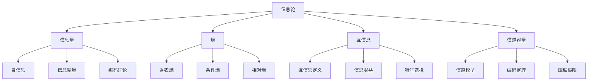
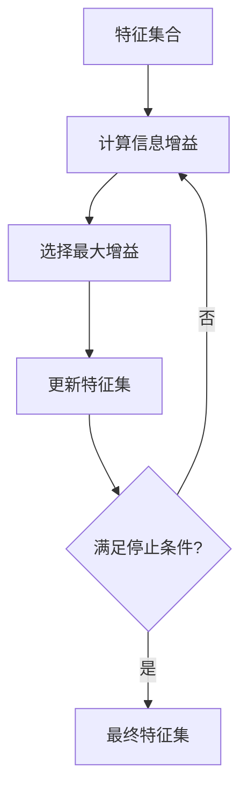

# 信息论基础

## 📊 信息论核心概念

### 信息论知识体系



## 🎯 信息量基础

### 1. 自信息

**定义：**
对于事件x，其自信息为：
```
I(x) = -log P(x)
```

**性质：**
- 📊 **非负性**：I(x) ≥ 0
- 🎯 **单调性**：概率越小，信息量越大
- 🔢 **可加性**：独立事件的信息量相加

**单位：**
- **比特（bit）**：以2为底的对数
- **奈特（nat）**：以e为底的对数
- **哈特（hart）**：以10为底的对数

### 2. 信息度量

**信息量对比：**

| 事件概率 | 自信息（bit） | 直观理解 |
|----------|---------------|----------|
| **1/2** | 1 | 抛硬币结果 |
| **1/4** | 2 | 两次抛硬币 |
| **1/8** | 3 | 三次抛硬币 |
| **1/16** | 4 | 四次抛硬币 |

**信息量公式：**
```
I(x) = -log₂ P(x)
```

## 📈 熵理论

### 1. 香农熵

**定义：**
```
H(X) = -Σ P(x) log P(x)
```

**物理意义：**
- 🎯 **不确定性**：随机变量的不确定性
- 📊 **信息量**：平均信息量
- 🔍 **复杂度**：系统的复杂程度

**熵的性质：**
- 📏 **非负性**：H(X) ≥ 0
- 🎯 **最大值**：H(X) ≤ log n
- 🔄 **对称性**：H(X) = H(X')

### 2. 条件熵

**定义：**
```
H(Y|X) = -Σ P(x,y) log P(y|x)
```

**链式法则：**
```
H(X,Y) = H(X) + H(Y|X)
```

**应用：**
- 🔍 **特征选择**：条件熵最小化
- 📊 **信息增益**：H(Y) - H(Y|X)
- 🎯 **决策树**：分裂准则

### 3. 相对熵（KL散度）

**定义：**
```
D(P||Q) = Σ P(x) log(P(x)/Q(x))
```

**性质：**
- 📊 **非负性**：D(P||Q) ≥ 0
- 🎯 **不对称性**：D(P||Q) ≠ D(Q||P)
- 🔍 **凸性**：D(P||Q)是凸函数

**应用：**
- 🎯 **模型选择**：模型比较
- 📊 **分布距离**：分布相似性
- 🔍 **变分推理**：近似后验

## 🔗 互信息

### 1. 互信息定义

**定义：**
```
I(X;Y) = Σ P(x,y) log(P(x,y)/(P(x)P(y)))
```

**等价形式：**
```
I(X;Y) = H(X) - H(X|Y) = H(Y) - H(Y|X)
```

**性质：**
- 📊 **对称性**：I(X;Y) = I(Y;X)
- 🎯 **非负性**：I(X;Y) ≥ 0
- 🔍 **独立性**：I(X;Y) = 0 当且仅当X,Y独立

### 2. 信息增益

**信息增益：**
```
IG(Y|X) = H(Y) - H(Y|X) = I(X;Y)
```

**应用场景：**
- 🌳 **决策树**：特征选择
- 🔍 **特征工程**：相关性分析
- 📊 **降维**：信息保持

**信息增益比：**
```
IGR(Y|X) = IG(Y|X) / H(X)
```

## 📊 信道理论

### 1. 信道模型

**二进制对称信道：**
```
P(0|0) = 1-p, P(1|0) = p
P(0|1) = p,   P(1|1) = 1-p
```

**信道容量：**
```
C = max I(X;Y)
```

**香农定理：**
- 📊 **编码定理**：存在编码使错误率任意小
- 🎯 **逆定理**：超过容量无法可靠传输
- 🔍 **极限**：理论极限

### 2. 编码理论

**霍夫曼编码：**
- 🎯 **最优前缀码**：平均码长最短
- 📊 **贪心算法**：自底向上构建
- 🔍 **应用**：数据压缩

**香农-范诺编码：**
- 📊 **递归分割**：概率二分
- 🎯 **近似最优**：接近理论极限
- 🔍 **实现简单**：易于编程

## 🔧 AI中的应用

### 1. 特征选择

**信息增益准则：**


**应用场景：**
- 🎯 **文本分类**：词特征选择
- 📊 **图像识别**：像素特征选择
- 🔍 **推荐系统**：用户特征选择

### 2. 决策树

**ID3算法：**
```
选择信息增益最大的特征作为分裂节点
```

**C4.5算法：**
```
选择信息增益比最大的特征作为分裂节点
```

**CART算法：**
```
选择基尼不纯度最小的特征作为分裂节点
```

### 3. 聚类分析

**信息论聚类：**
- 🎯 **最小化互信息**：簇内相似性
- 📊 **最大化互信息**：簇间差异性
- 🔍 **信息瓶颈**：压缩与保持平衡

## 📈 信息论度量

### 1. 交叉熵

**定义：**
```
H(P,Q) = -Σ P(x) log Q(x)
```

**与KL散度的关系：**
```
H(P,Q) = H(P) + D(P||Q)
```

**应用：**
- 🎯 **损失函数**：分类问题
- 📊 **模型评估**：分布比较
- 🔍 **优化目标**：最小化交叉熵

### 2. 互信息最大化

**目标函数：**
```
max I(X;Y) = max H(Y) - H(Y|X)
```

**应用：**
- 🎯 **特征学习**：无监督学习
- 📊 **表示学习**：信息保持
- 🔍 **对抗训练**：信息最大化

### 3. 信息瓶颈

**目标函数：**
```
min I(X;T) - βI(T;Y)
```

**解释：**
- 🎯 **压缩**：最小化I(X;T)
- 📊 **保持**：最大化I(T;Y)
- 🔍 **平衡**：β参数调节

## 🎯 计算技巧

### 1. 熵估计

**直方图估计：**
```
Ĥ(X) = -Σ (nᵢ/n) log(nᵢ/n)
```

**核密度估计：**
```
Ĥ(X) = -∫ f̂(x) log f̂(x) dx
```

**k近邻估计：**
```
Ĥ(X) = -(1/n)Σ log(πᵏᵢ/n)
```

### 2. 互信息估计

**直方图方法：**
```
Î(X;Y) = Σ (nᵢⱼ/n) log(nᵢⱼn/(nᵢnⱼ))
```

**核方法：**
```
Î(X;Y) = ∫∫ f̂(x,y) log(f̂(x,y)/(f̂(x)f̂(y))) dxdy
```

**k近邻方法：**
```
Î(X;Y) = ψ(k) - (1/n)Σ[ψ(nₓᵢ) + ψ(nᵧᵢ)]
```

## 🔗 相关链接
- [[01-02-02-概率论与统计学]] - 概率基础
- [[02-01-01-监督学习原理]] - 信息论应用
- [[02-01-06-机器学习算法对比]] - 算法选择
- [[03-02-02-词向量技术]] - 表示学习

## 💡 费曼学习法应用
**概念理解**：信息论就像"信息的数学"，熵是"不确定性"，互信息是"相关性"。就像天气预报，熵高表示"不确定"，互信息高表示"相关性强"。

**实际应用**：在AI中，信息论无处不在。特征选择就是"找最相关的"，决策树就是"信息增益最大"，聚类就是"信息保持"。

**直觉培养**：熵就像"混乱程度"，互信息就像"共享信息"，KL散度就像"分布距离"。

---
*📝 学习提示：信息论是AI特征选择和模型评估的理论基础，建议多练习熵和互信息的计算，理解信息的本质*

