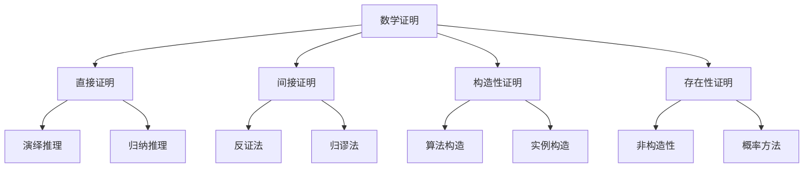

# 数学证明与推导

## 🔍 证明方法体系

### 数学证明方法



## 🎯 基础证明技巧

### 1. 直接证明

**基本结构：**
```
已知：P
证明：Q
方法：P → P₁ → P₂ → ... → Q
```

**示例：证明奇数的平方是奇数**
```
设 n 是奇数，则 n = 2k + 1 (k ∈ ℤ)
n² = (2k + 1)² = 4k² + 4k + 1 = 2(2k² + 2k) + 1
因为 2k² + 2k ∈ ℤ，所以 n² = 2m + 1 (m ∈ ℤ)
因此 n² 是奇数
```

### 2. 反证法

**基本结构：**
```
要证明：P
假设：¬P
推导：¬P → Q ∧ ¬Q (矛盾)
结论：P 成立
```

**示例：证明√2是无理数**
```
假设：√2是有理数
则：√2 = p/q (p,q互质)
平方：2 = p²/q²
整理：2q² = p²
因此：p²是偶数，p是偶数
设：p = 2k
代入：2q² = (2k)² = 4k²
整理：q² = 2k²
因此：q²是偶数，q是偶数
矛盾：p,q都是偶数，与互质矛盾
结论：√2是无理数
```

### 3. 数学归纳法

**基本结构：**
```
基础步骤：证明P(1)成立
归纳步骤：假设P(k)成立，证明P(k+1)成立
结论：对所有n，P(n)成立
```

**示例：证明1+2+...+n = n(n+1)/2**
```
基础步骤：n=1时，1 = 1×2/2 = 1 ✓
归纳步骤：假设1+2+...+k = k(k+1)/2
证明：1+2+...+k+(k+1) = k(k+1)/2 + (k+1)
     = (k+1)(k/2 + 1) = (k+1)(k+2)/2 ✓
结论：对所有n，公式成立
```

## 📊 AI中的数学推导

### 1. 线性回归推导

**问题：最小化平方误差**
```
min ||Xw - y||²
```

**推导过程：**
```
L(w) = ||Xw - y||² = (Xw - y)ᵀ(Xw - y)
     = wᵀXᵀXw - 2yᵀXw + yᵀy

对w求导：
∂L/∂w = 2XᵀXw - 2Xᵀy = 0

解得：
XᵀXw = Xᵀy
w = (XᵀX)⁻¹Xᵀy
```

### 2. 梯度下降收敛性

**问题：证明梯度下降收敛**

**假设条件：**
- 函数f是L-光滑的：||∇f(x) - ∇f(y)|| ≤ L||x - y||
- 函数f是μ-强凸的：f(y) ≥ f(x) + ∇f(x)ᵀ(y-x) + (μ/2)||y-x||²

**证明：**
```
设 x^(k+1) = x^(k) - α∇f(x^(k))

对于强凸函数：
f(x^(k+1)) ≤ f(x^(k)) - α||∇f(x^(k))||² + (Lα²/2)||∇f(x^(k))||²
           = f(x^(k)) - α(1 - Lα/2)||∇f(x^(k))||²

选择 α ≤ 1/L：
f(x^(k+1)) ≤ f(x^(k)) - (α/2)||∇f(x^(k))||²

因此序列{f(x^(k))}单调递减且有下界，必收敛
```

### 3. 贝叶斯定理推导

**问题：推导贝叶斯定理**

**推导过程：**
```
根据条件概率定义：
P(A|B) = P(A∩B) / P(B)
P(B|A) = P(A∩B) / P(A)

从第二个等式：
P(A∩B) = P(B|A) × P(A)

代入第一个等式：
P(A|B) = P(B|A) × P(A) / P(B)

根据全概率公式：
P(B) = Σ P(B|Aᵢ) × P(Aᵢ)

因此：
P(A|B) = P(B|A) × P(A) / Σ P(B|Aᵢ) × P(Aᵢ)
```

## 🔧 重要定理证明

### 1. 中心极限定理

**定理：** 设X₁, X₂, ..., Xₙ是独立同分布的随机变量，均值为μ，方差为σ²，则：
```
√n(X̄ₙ - μ) → N(0, σ²)
```

**证明思路：**
```
1. 标准化：Zₙ = √n(X̄ₙ - μ)/σ
2. 特征函数：φₙ(t) = E[e^(itZₙ)]
3. 泰勒展开：φₙ(t) = (1 - t²/(2n) + o(1/n))ⁿ
4. 极限：lim φₙ(t) = e^(-t²/2)
5. 结论：Zₙ → N(0,1)
```

### 2. 拉格朗日乘数法

**定理：** 在约束g(x,y) = 0下，f(x,y)的极值点满足：
```
∇f = λ∇g
```

**证明：**
```
设约束曲线为r(t) = (x(t), y(t))
在极值点：df/dt = 0

df/dt = (∂f/∂x)(dx/dt) + (∂f/∂y)(dy/dt) = 0
dg/dt = (∂g/∂x)(dx/dt) + (∂g/∂y)(dy/dt) = 0

因此：(∂f/∂x, ∂f/∂y) 与 (∂g/∂x, ∂g/∂y) 平行
即：∇f = λ∇g
```

### 3. 信息不等式

**定理：** 对于概率分布P和Q：
```
D(P||Q) ≥ 0
```

**证明：**
```
D(P||Q) = Σ P(x) log(P(x)/Q(x))
        = -Σ P(x) log(Q(x)/P(x))
        ≥ -log(Σ P(x) × Q(x)/P(x))  [Jensen不等式]
        = -log(Σ Q(x))
        = -log(1) = 0
```

## 📈 优化理论证明

### 1. 凸优化最优性条件

**定理：** 对于凸函数f，x*是最优解当且仅当：
```
∇f(x*) = 0
```

**证明：**
```
必要性：如果x*是最优解，则对任意y：
f(y) ≥ f(x*)

由凸性：f(y) ≥ f(x*) + ∇f(x*)ᵀ(y - x*)

如果∇f(x*) ≠ 0，取y = x* - α∇f(x*) (α > 0)：
f(y) = f(x*) - α||∇f(x*)||² < f(x*)

矛盾，因此∇f(x*) = 0

充分性：如果∇f(x*) = 0，由凸性：
f(y) ≥ f(x*) + ∇f(x*)ᵀ(y - x*) = f(x*)

因此x*是最优解
```

### 2. 梯度下降收敛率

**定理：** 对于μ-强凸函数，梯度下降的收敛率为：
```
f(x^(k)) - f(x*) ≤ (1 - μ/L)^k (f(x^(0)) - f(x*))
```

**证明：**
```
设e^(k) = f(x^(k)) - f(x*)

由强凸性：
e^(k+1) ≤ e^(k) - (α/2)||∇f(x^(k))||²

由L-光滑性：
||∇f(x^(k))||² ≥ (2μ/L)e^(k)

因此：
e^(k+1) ≤ e^(k) - (αμ/L)e^(k) = (1 - αμ/L)e^(k)

选择α = 1/L：
e^(k+1) ≤ (1 - μ/L)e^(k)
```

## 🎯 证明技巧总结

### 1. 常用不等式

| 不等式 | 形式 | 应用场景 |
|--------|------|----------|
| **Cauchy-Schwarz** | |⟨u,v⟩| ≤ ||u|| ||v|| | 向量内积 |
| **Jensen** | f(E[X]) ≤ E[f(X)] | 凸函数 |
| **Holder** | ||fg||₁ ≤ ||f||ₚ ||g||q | 函数空间 |
| **Minkowski** | ||f+g||ₚ ≤ ||f||ₚ + ||g||ₚ | 范数空间 |

### 2. 证明策略

**分析策略：**
- 🔍 **分解**：将复杂问题分解为简单子问题
- 📊 **类比**：利用已知结果类比新问题
- 🎯 **特殊化**：从特殊情况推广到一般情况
- 🔄 **对称性**：利用对称性简化证明

**构造策略：**
- 🏗️ **直接构造**：明确给出解的形式
- 🔍 **存在性证明**：证明解存在但不给出具体形式
- 📊 **概率方法**：用概率证明确定性结果
- 🎯 **算法构造**：通过算法构造解

## 🔗 相关链接
- [[01-02-01-线性代数基础]] - 线性代数理论
- [[01-02-02-概率论与统计学]] - 概率统计理论
- [[01-02-03-微积分基础]] - 微积分理论
- [[02-02-04-优化算法对比]] - 优化理论应用

## 💡 费曼学习法应用
**证明理解**：数学证明就像"逻辑推理"，每一步都要有依据，不能跳跃。就像侦探破案，要有证据链，环环相扣。

**技巧掌握**：证明技巧就像"工具箱"，不同问题用不同工具。反证法像"排除法"，归纳法像"多米诺骨牌"。

**实践建议**：学习证明要多练习，从简单开始，逐步提高。理解证明思路比记住证明过程更重要。

---
*📝 学习提示：数学证明是AI理论的基础，建议多练习各种证明方法，培养逻辑思维和严谨性*

