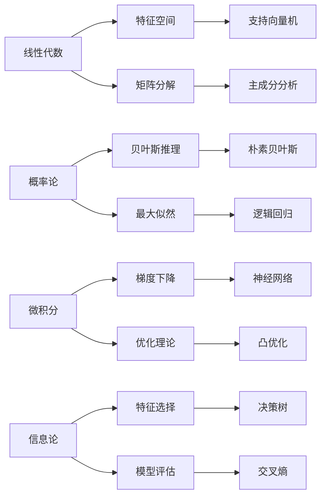
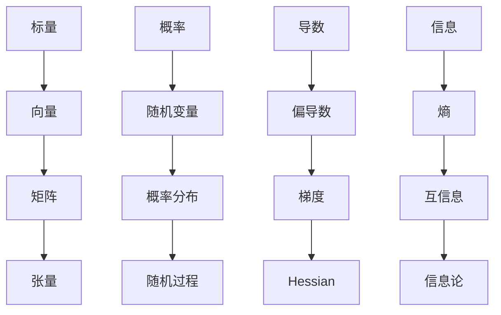

# 数学概念关联图

## 🕸️ 数学概念网络

### 核心概念关系图

```mermaid
graph TD
    A[线性代数] --> B[向量空间]
    A --> C[矩阵运算]
    A --> D[特征值分解]
    
    B --> E[线性无关]
    B --> F[基与维数]
    B --> G[线性变换]
    
    C --> H[矩阵乘法]
    C --> I[逆矩阵]
    C --> J[行列式]
    
    D --> K[特征值]
    D --> L[特征向量]
    D --> M[对角化]
    
    N[微积分] --> O[导数]
    N --> P[积分]
    N --> Q[级数]
    
    O --> R[梯度]
    O --> S[链式法则]
    O --> T[泰勒展开]
    
    P --> U[定积分]
    P --> V[不定积分]
    P --> W[数值积分]
    
    X[概率论] --> Y[随机变量]
    X --> Z[概率分布]
    X --> AA[统计推断]
    
    Y --> BB[期望]
    Y --> CC[方差]
    Y --> DD[协方差]
    
    Z --> EE[正态分布]
    Z --> FF[二项分布]
    Z --> GG[泊松分布]
    
    HH[信息论] --> II[熵]
    HH --> JJ[互信息]
    HH --> KK[信道容量]
    
    II --> LL[香农熵]
    II --> MM[条件熵]
    II --> NN[相对熵]
```



## 🔗 概念关联分析

### 1. 线性代数 ↔ 微积分

**关联点：**
- 🎯 **梯度**：多元函数的导数向量
- 📊 **Hessian矩阵**：二阶偏导数矩阵
- 🔍 **方向导数**：沿特定方向的变化率

**具体关系：**
```
梯度：∇f = (∂f/∂x₁, ∂f/∂x₂, ..., ∂f/∂xₙ)
Hessian：H = [∂²f/∂xᵢ∂xⱼ]
方向导数：D_u f = ∇f · u
```

### 2. 概率论 ↔ 信息论

**关联点：**
- 📊 **熵**：随机变量的不确定性
- 🔍 **互信息**：随机变量间的相关性
- 🎯 **KL散度**：概率分布间的距离

**具体关系：**
```
熵：H(X) = -Σ P(x) log P(x)
互信息：I(X;Y) = H(X) - H(X|Y)
KL散度：D(P||Q) = Σ P(x) log(P(x)/Q(x))
```

### 3. 线性代数 ↔ 概率论

**关联点：**
- 📊 **协方差矩阵**：随机向量的二阶矩
- 🎯 **主成分分析**：协方差矩阵的特征值分解
- 🔍 **多元正态分布**：矩阵形式的概率密度

**具体关系：**
```
协方差矩阵：Σ = E[(X-μ)(X-μ)ᵀ]
多元正态：f(x) = (1/√(2π)ᵏ|Σ|) exp(-½(x-μ)ᵀΣ⁻¹(x-μ))
PCA：Y = UᵀX，其中U是Σ的特征向量矩阵
```

## 🎯 AI中的数学关联

### 1. 机器学习数学基础



### 2. 深度学习数学框架

**前向传播：**
```
z^(l) = W^(l) a^(l-1) + b^(l)
a^(l) = σ(z^(l))
```

**反向传播：**
```
δ^(l) = (W^(l+1))ᵀ δ^(l+1) ⊙ σ'(z^(l))
∂J/∂W^(l) = δ^(l) (a^(l-1))ᵀ
```

**数学概念：**
- 🔢 **矩阵乘法**：线性变换
- 📊 **链式法则**：复合函数求导
- 🎯 **梯度**：参数更新方向
- 📈 **激活函数**：非线性变换

## 📊 概念层次结构

### 1. 基础层

| 概念 | 定义 | 性质 | 应用 |
|------|------|------|------|
| **向量** | 有序数组 | 线性运算 | 特征表示 |
| **矩阵** | 二维数组 | 乘法运算 | 线性变换 |
| **概率** | 事件可能性 | 0≤P≤1 | 不确定性建模 |
| **导数** | 变化率 | 局部性质 | 优化算法 |

### 2. 中级层

| 概念 | 定义 | 依赖 | 应用 |
|------|------|------|------|
| **特征值** | 矩阵不变方向 | 矩阵运算 | 主成分分析 |
| **梯度** | 多元函数导数 | 偏导数 | 梯度下降 |
| **熵** | 不确定性度量 | 概率分布 | 信息论 |
| **协方差** | 变量相关性 | 期望运算 | 多元分析 |

### 3. 高级层

| 概念 | 定义 | 依赖 | 应用 |
|------|------|------|------|
| **SVD** | 矩阵分解 | 特征值 | 降维 |
| **拉格朗日** | 约束优化 | 梯度 | 支持向量机 |
| **KL散度** | 分布距离 | 熵 | 变分推理 |
| **泰勒展开** | 函数近似 | 导数 | 数值方法 |

## 🔍 概念理解路径

### 1. 从简单到复杂



### 2. 从具体到抽象

**具体例子：**
- 🔢 **数字** → 向量 → 矩阵 → 线性空间
- 🎯 **事件** → 随机变量 → 概率分布 → 随机过程
- 📊 **斜率** → 导数 → 梯度 → 微分几何
- 🔍 **信息** → 熵 → 互信息 → 信息论

**抽象概念：**
- 🏗️ **结构**：向量空间、概率空间、度量空间
- 🔄 **运算**：线性变换、概率运算、微分运算
- 📈 **性质**：连续性、可微性、可积性
- 🎯 **关系**：等价关系、序关系、拓扑关系

## 🎯 学习建议

### 1. 概念关联学习

**建立联系：**
- 🔗 **横向联系**：同一层次概念间的关系
- 📊 **纵向联系**：不同层次概念间的递进
- 🎯 **应用联系**：理论与实际应用的关系

**学习方法：**
- 📝 **概念地图**：绘制概念关系图
- 🔍 **类比学习**：用熟悉概念理解新概念
- 🎯 **实例驱动**：通过具体例子理解抽象概念

### 2. 数学直觉培养

**几何直觉：**
- 📊 **向量**：有向线段
- 🎯 **矩阵**：线性变换
- 📈 **导数**：切线斜率
- 🔍 **概率**：面积比例

**物理直觉：**
- 🚗 **速度**：位置导数
- ⚡ **加速度**：速度导数
- 🔥 **功率**：功的导数
- 📊 **密度**：概率密度

## 🔗 相关链接
- [[01-02-01-线性代数基础]] - 线性代数理论
- [[01-02-02-概率论与统计学]] - 概率统计理论
- [[01-02-03-微积分基础]] - 微积分理论
- [[01-02-04-信息论基础]] - 信息论理论
- [[01-02-05-数学工具速查]] - 数学工具

## 💡 费曼学习法应用
**概念理解**：数学概念就像"积木"，每个概念都是一个小积木，组合起来可以构建复杂的"数学大厦"。理解概念间的关联就像理解积木间的连接方式。

**学习策略**：学习数学概念要像"搭积木"，先掌握基础积木（基本概念），再学习连接方式（概念关系），最后构建复杂结构（高级应用）。

**实践建议**：多画概念图，多找概念间的联系，多思考概念的本质，这样学习效果会更好。

---
*📝 学习提示：理解数学概念间的关联是深入学习AI的基础，建议多练习概念关联，培养数学直觉*


