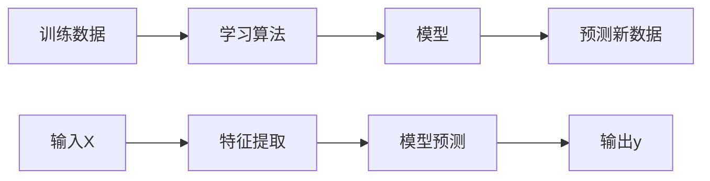
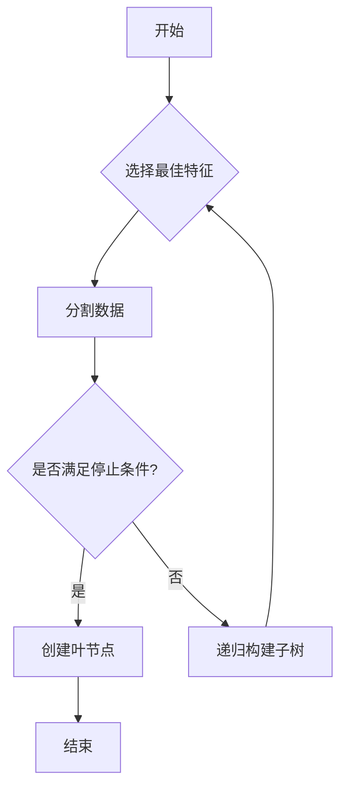

# 监督学习原理

## 🎯 监督学习基础

### 1. 核心概念

**监督学习定义：**
> **监督学习是从标记的训练数据中学习一个映射函数，用于预测新数据的输出**

**基本要素：**
- 📊 **训练数据**：输入-输出对 (X, y)
- 🎯 **学习目标**：找到函数 f: X → y
- 🔍 **预测任务**：对新输入 x' 预测输出 y'

**学习过程：**


### 2. 问题类型

**分类问题：**
- 🎯 **目标**：预测离散类别
- 📊 **输出**：类别标签 {0, 1, 2, ...}
- 🔍 **例子**：邮件分类、图像识别、疾病诊断

**回归问题：**
- 🎯 **目标**：预测连续数值
- 📊 **输出**：实数值
- 🔍 **例子**：房价预测、股票价格、温度预测

**问题类型对比：**

| 维度 | 分类 | 回归 |
|------|------|------|
| **输出类型** | 离散 | 连续 |
| **损失函数** | 交叉熵 | 均方误差 |
| **评估指标** | 准确率 | RMSE |
| **典型算法** | 逻辑回归 | 线性回归 |

## 📊 数学基础

### 1. 损失函数

**分类损失：**
```python
# 交叉熵损失
def cross_entropy_loss(y_true, y_pred):
    """
    交叉熵损失函数
    L = -Σ y_true * log(y_pred)
    """
    epsilon = 1e-15
    y_pred = np.clip(y_pred, epsilon, 1 - epsilon)
    return -np.mean(y_true * np.log(y_pred))

# 二分类交叉熵
def binary_cross_entropy(y_true, y_pred):
    """
    二分类交叉熵损失
    L = -[y*log(p) + (1-y)*log(1-p)]
    """
    epsilon = 1e-15
    y_pred = np.clip(y_pred, epsilon, 1 - epsilon)
    return -np.mean(y_true * np.log(y_pred) + (1 - y_true) * np.log(1 - y_pred))
```

**回归损失：**
```python
# 均方误差
def mean_squared_error(y_true, y_pred):
    """
    均方误差损失
    L = (1/n) * Σ(y_true - y_pred)²
    """
    return np.mean((y_true - y_pred) ** 2)

# 平均绝对误差
def mean_absolute_error(y_true, y_pred):
    """
    平均绝对误差损失
    L = (1/n) * Σ|y_true - y_pred|
    """
    return np.mean(np.abs(y_true - y_pred))
```

### 2. 优化算法

**梯度下降：**
```python
def gradient_descent(X, y, learning_rate=0.01, epochs=1000):
    """
    梯度下降算法
    """
    m = len(y)
    theta = np.zeros(X.shape[1])
    
    for epoch in range(epochs):
        # 前向传播
        predictions = X @ theta
        
        # 计算损失
        loss = mean_squared_error(y, predictions)
        
        # 计算梯度
        gradient = (2/m) * X.T @ (predictions - y)
        
        # 更新参数
        theta = theta - learning_rate * gradient
        
        if epoch % 100 == 0:
            print(f"Epoch {epoch}, Loss: {loss:.4f}")
    
    return theta
```

**随机梯度下降：**
```python
def stochastic_gradient_descent(X, y, learning_rate=0.01, epochs=1000):
    """
    随机梯度下降算法
    """
    m = len(y)
    theta = np.zeros(X.shape[1])
    
    for epoch in range(epochs):
        # 随机打乱数据
        indices = np.random.permutation(m)
        
        for i in indices:
            # 单个样本
            x_i = X[i:i+1]
            y_i = y[i:i+1]
            
            # 前向传播
            prediction = x_i @ theta
            
            # 计算梯度
            gradient = 2 * x_i.T @ (prediction - y_i)
            
            # 更新参数
            theta = theta - learning_rate * gradient
    
    return theta
```

## 🔧 经典算法

### 1. 线性回归

**数学原理：**
```
假设函数：h(x) = θ₀ + θ₁x₁ + θ₂x₂ + ... + θₙxₙ
损失函数：J(θ) = (1/2m) * Σ(h(x⁽ⁱ⁾) - y⁽ⁱ⁾)²
梯度：∂J/∂θⱼ = (1/m) * Σ(h(x⁽ⁱ⁾) - y⁽ⁱ⁾) * xⱼ⁽ⁱ⁾
```

**实现代码：**
```python
class LinearRegression:
    def __init__(self, learning_rate=0.01, epochs=1000):
        self.learning_rate = learning_rate
        self.epochs = epochs
        self.theta = None
    
    def fit(self, X, y):
        """训练模型"""
        m = len(y)
        X = np.c_[np.ones(m), X]  # 添加偏置项
        self.theta = np.zeros(X.shape[1])
        
        for epoch in range(self.epochs):
            # 前向传播
            predictions = X @ self.theta
            
            # 计算损失
            loss = mean_squared_error(y, predictions)
            
            # 计算梯度
            gradient = (1/m) * X.T @ (predictions - y)
            
            # 更新参数
            self.theta = self.theta - self.learning_rate * gradient
    
    def predict(self, X):
        """预测"""
        m = len(X)
        X = np.c_[np.ones(m), X]
        return X @ self.theta
```

### 2. 逻辑回归

**数学原理：**
```
假设函数：h(x) = 1 / (1 + e^(-θᵀx))
损失函数：J(θ) = -(1/m) * Σ[y⁽ⁱ⁾log(h(x⁽ⁱ⁾)) + (1-y⁽ⁱ⁾)log(1-h(x⁽ⁱ⁾))]
梯度：∂J/∂θⱼ = (1/m) * Σ(h(x⁽ⁱ⁾) - y⁽ⁱ⁾) * xⱼ⁽ⁱ⁾
```

**实现代码：**
```python
class LogisticRegression:
    def __init__(self, learning_rate=0.01, epochs=1000):
        self.learning_rate = learning_rate
        self.epochs = epochs
        self.theta = None
    
    def sigmoid(self, z):
        """Sigmoid函数"""
        return 1 / (1 + np.exp(-np.clip(z, -250, 250)))
    
    def fit(self, X, y):
        """训练模型"""
        m = len(y)
        X = np.c_[np.ones(m), X]
        self.theta = np.zeros(X.shape[1])
        
        for epoch in range(self.epochs):
            # 前向传播
            z = X @ self.theta
            h = self.sigmoid(z)
            
            # 计算损失
            loss = -np.mean(y * np.log(h + 1e-15) + (1 - y) * np.log(1 - h + 1e-15))
            
            # 计算梯度
            gradient = (1/m) * X.T @ (h - y)
            
            # 更新参数
            self.theta = self.theta - self.learning_rate * gradient
    
    def predict(self, X):
        """预测概率"""
        m = len(X)
        X = np.c_[np.ones(m), X]
        return self.sigmoid(X @ self.theta)
    
    def predict_class(self, X):
        """预测类别"""
        probabilities = self.predict(X)
        return (probabilities >= 0.5).astype(int)
```

### 3. 决策树

**算法原理：**


**实现代码：**
```python
class DecisionTree:
    def __init__(self, max_depth=None, min_samples_split=2):
        self.max_depth = max_depth
        self.min_samples_split = min_samples_split
        self.tree = None
    
    def gini_impurity(self, y):
        """计算基尼不纯度"""
        if len(y) == 0:
            return 0
        counts = np.bincount(y)
        probabilities = counts / len(y)
        return 1 - np.sum(probabilities ** 2)
    
    def information_gain(self, X, y, feature_idx, threshold):
        """计算信息增益"""
        # 分割数据
        left_mask = X[:, feature_idx] <= threshold
        right_mask = ~left_mask
        
        if np.sum(left_mask) == 0 or np.sum(right_mask) == 0:
            return 0
        
        # 计算信息增益
        parent_impurity = self.gini_impurity(y)
        left_impurity = self.gini_impurity(y[left_mask])
        right_impurity = self.gini_impurity(y[right_mask])
        
        left_weight = np.sum(left_mask) / len(y)
        right_weight = np.sum(right_mask) / len(y)
        
        child_impurity = left_weight * left_impurity + right_weight * right_impurity
        return parent_impurity - child_impurity
    
    def find_best_split(self, X, y):
        """找到最佳分割点"""
        best_gain = 0
        best_feature = None
        best_threshold = None
        
        for feature_idx in range(X.shape[1]):
            thresholds = np.unique(X[:, feature_idx])
            for threshold in thresholds:
                gain = self.information_gain(X, y, feature_idx, threshold)
                if gain > best_gain:
                    best_gain = gain
                    best_feature = feature_idx
                    best_threshold = threshold
        
        return best_feature, best_threshold, best_gain
    
    def build_tree(self, X, y, depth=0):
        """构建决策树"""
        # 停止条件
        if (self.max_depth is not None and depth >= self.max_depth) or \
           len(y) < self.min_samples_split or \
           len(np.unique(y)) == 1:
            return {'leaf': True, 'class': np.bincount(y).argmax()}
        
        # 找到最佳分割
        feature, threshold, gain = self.find_best_split(X, y)
        
        if gain == 0:
            return {'leaf': True, 'class': np.bincount(y).argmax()}
        
        # 分割数据
        left_mask = X[:, feature] <= threshold
        right_mask = ~left_mask
        
        # 递归构建子树
        left_tree = self.build_tree(X[left_mask], y[left_mask], depth + 1)
        right_tree = self.build_tree(X[right_mask], y[right_mask], depth + 1)
        
        return {
            'leaf': False,
            'feature': feature,
            'threshold': threshold,
            'left': left_tree,
            'right': right_tree
        }
    
    def fit(self, X, y):
        """训练模型"""
        self.tree = self.build_tree(X, y)
    
    def predict_sample(self, x, tree):
        """预测单个样本"""
        if tree['leaf']:
            return tree['class']
        
        if x[tree['feature']] <= tree['threshold']:
            return self.predict_sample(x, tree['left'])
        else:
            return self.predict_sample(x, tree['right'])
    
    def predict(self, X):
        """预测"""
        predictions = []
        for x in X:
            predictions.append(self.predict_sample(x, self.tree))
        return np.array(predictions)
```

## 📈 模型评估

### 1. 分类评估

**混淆矩阵：**
```python
def confusion_matrix(y_true, y_pred):
    """计算混淆矩阵"""
    classes = np.unique(y_true)
    n_classes = len(classes)
    matrix = np.zeros((n_classes, n_classes))
    
    for i in range(n_classes):
        for j in range(n_classes):
            matrix[i, j] = np.sum((y_true == classes[i]) & (y_pred == classes[j]))
    
    return matrix

# 评估指标
def accuracy(y_true, y_pred):
    """准确率"""
    return np.mean(y_true == y_pred)

def precision(y_true, y_pred):
    """精确率"""
    cm = confusion_matrix(y_true, y_pred)
    return np.diag(cm) / np.sum(cm, axis=0)

def recall(y_true, y_pred):
    """召回率"""
    cm = confusion_matrix(y_true, y_pred)
    return np.diag(cm) / np.sum(cm, axis=1)

def f1_score(y_true, y_pred):
    """F1分数"""
    p = precision(y_true, y_pred)
    r = recall(y_true, y_pred)
    return 2 * p * r / (p + r)
```

### 2. 回归评估

**评估指标：**
```python
def mean_squared_error(y_true, y_pred):
    """均方误差"""
    return np.mean((y_true - y_pred) ** 2)

def root_mean_squared_error(y_true, y_pred):
    """均方根误差"""
    return np.sqrt(mean_squared_error(y_true, y_pred))

def mean_absolute_error(y_true, y_pred):
    """平均绝对误差"""
    return np.mean(np.abs(y_true - y_pred))

def r2_score(y_true, y_pred):
    """决定系数"""
    ss_res = np.sum((y_true - y_pred) ** 2)
    ss_tot = np.sum((y_true - np.mean(y_true)) ** 2)
    return 1 - (ss_res / ss_tot)
```

## 🎯 实际应用

### 1. 数据预处理

**特征标准化：**
```python
def standardize_features(X):
    """特征标准化"""
    mean = np.mean(X, axis=0)
    std = np.std(X, axis=0)
    return (X - mean) / std

def normalize_features(X):
    """特征归一化"""
    min_val = np.min(X, axis=0)
    max_val = np.max(X, axis=0)
    return (X - min_val) / (max_val - min_val)
```

**特征选择：**
```python
def select_features(X, y, k=10):
    """特征选择"""
    n_features = X.shape[1]
    scores = []
    
    for i in range(n_features):
        # 计算特征与目标的相关性
        correlation = np.corrcoef(X[:, i], y)[0, 1]
        scores.append(abs(correlation))
    
    # 选择前k个特征
    top_features = np.argsort(scores)[-k:]
    return X[:, top_features], top_features
```

### 2. 交叉验证

**K折交叉验证：**
```python
def k_fold_cross_validation(X, y, model, k=5):
    """K折交叉验证"""
    n_samples = len(y)
    fold_size = n_samples // k
    scores = []
    
    for i in range(k):
        # 分割数据
        start = i * fold_size
        end = start + fold_size
        
        X_test = X[start:end]
        y_test = y[start:end]
        X_train = np.concatenate([X[:start], X[end:]])
        y_train = np.concatenate([y[:start], y[end:]])
        
        # 训练和评估
        model.fit(X_train, y_train)
        y_pred = model.predict(X_test)
        score = accuracy(y_test, y_pred)
        scores.append(score)
    
    return np.mean(scores), np.std(scores)
```

## 🔗 相关链接
- [[01-02-02-概率论与统计学]] - 概率统计基础
- [[01-02-03-微积分基础]] - 微积分基础
- [[02-01-02-无监督学习原理]] - 无监督学习
- [[02-01-04-模型评估方法]] - 模型评估

## 💡 费曼学习法应用
**概念理解**：监督学习就像"老师教学生"，有标准答案（标签），学生通过学习（训练）掌握规律，然后能够回答新问题（预测）。

**实践建议**：学习监督学习要像"学数学"，多练习各种算法，理解数学原理，掌握评估方法。

**AI应用**：监督学习是AI的"基础技能"，大部分AI应用都基于监督学习。就像数学是科学的基础，监督学习是AI的基础。

---
*📝 学习提示：监督学习是AI的核心方法，建议多练习各种算法，理解数学原理，掌握评估技巧*


