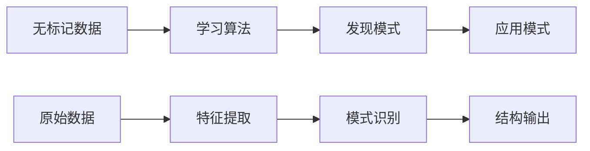
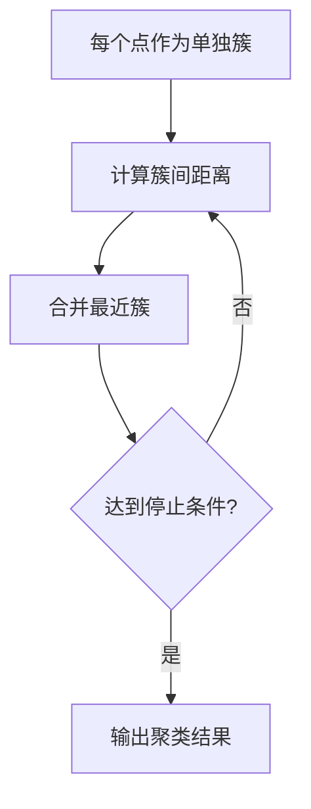

# 无监督学习原理

## 🎯 无监督学习基础

### 1. 核心概念

**无监督学习定义：**
> **无监督学习是从无标记的数据中发现隐藏的模式和结构，无需人工标注**

**学习目标：**
- 🔍 **发现模式**：识别数据中的潜在结构
- 📊 **数据压缩**：降低数据维度
- 🎯 **异常检测**：识别异常数据点
- 🔄 **数据生成**：生成新的数据样本

**学习过程：**


### 2. 问题类型

**聚类问题：**
- 🎯 **目标**：将数据分组为相似的簇
- 📊 **输出**：簇标签
- 🔍 **例子**：客户细分、基因分析、图像分割

**降维问题：**
- 🎯 **目标**：减少数据维度
- 📊 **输出**：低维表示
- 🔍 **例子**：数据可视化、特征提取、噪声去除

**密度估计：**
- 🎯 **目标**：估计数据分布
- 📊 **输出**：概率密度函数
- 🔍 **例子**：异常检测、数据生成

**问题类型对比：**

| 维度 | 聚类 | 降维 | 密度估计 |
|------|------|------|----------|
| **目标** | 数据分组 | 维度减少 | 分布估计 |
| **输出** | 簇标签 | 低维数据 | 概率密度 |
| **应用** | 数据分割 | 可视化 | 异常检测 |
| **典型算法** | K-means | PCA | 高斯混合 |

## 📊 聚类算法

### 1. K-means聚类

**算法原理：**
```
1. 随机初始化k个聚类中心
2. 将每个数据点分配到最近的聚类中心
3. 更新聚类中心为簇内点的均值
4. 重复步骤2-3直到收敛
```

**数学表达：**
```
目标函数：J = Σᵢ₌₁ᵏ Σₓ∈Cᵢ ||x - μᵢ||²
其中：μᵢ = (1/|Cᵢ|) Σₓ∈Cᵢ x
```

**实现代码：**
```python
class KMeans:
    def __init__(self, k=3, max_iters=100, tol=1e-4):
        self.k = k
        self.max_iters = max_iters
        self.tol = tol
        self.centroids = None
        self.labels = None
    
    def initialize_centroids(self, X):
        """随机初始化聚类中心"""
        n_samples, n_features = X.shape
        centroids = np.zeros((self.k, n_features))
        
        for i in range(self.k):
            centroids[i] = X[np.random.choice(n_samples)]
        
        return centroids
    
    def assign_clusters(self, X, centroids):
        """分配数据点到最近的聚类中心"""
        distances = np.sqrt(((X - centroids[:, np.newaxis])**2).sum(axis=2))
        return np.argmin(distances, axis=0)
    
    def update_centroids(self, X, labels):
        """更新聚类中心"""
        centroids = np.zeros((self.k, X.shape[1]))
        for i in range(self.k):
            centroids[i] = X[labels == i].mean(axis=0)
        return centroids
    
    def fit(self, X):
        """训练模型"""
        # 初始化
        self.centroids = self.initialize_centroids(X)
        
        for iteration in range(self.max_iters):
            # 分配簇
            old_labels = self.labels
            self.labels = self.assign_clusters(X, self.centroids)
            
            # 检查收敛
            if old_labels is not None and np.all(old_labels == self.labels):
                break
            
            # 更新中心
            new_centroids = self.update_centroids(X, self.labels)
            
            # 检查中心变化
            if np.allclose(self.centroids, new_centroids, atol=self.tol):
                break
            
            self.centroids = new_centroids
    
    def predict(self, X):
        """预测新数据点的簇"""
        return self.assign_clusters(X, self.centroids)
```

### 2. 层次聚类

**算法原理：**


**距离度量：**
```python
def euclidean_distance(x1, x2):
    """欧几里得距离"""
    return np.sqrt(np.sum((x1 - x2) ** 2))

def manhattan_distance(x1, x2):
    """曼哈顿距离"""
    return np.sum(np.abs(x1 - x2))

def cosine_distance(x1, x2):
    """余弦距离"""
    dot_product = np.dot(x1, x2)
    norm1 = np.linalg.norm(x1)
    norm2 = np.linalg.norm(x2)
    return 1 - (dot_product / (norm1 * norm2))
```

**实现代码：**
```python
class HierarchicalClustering:
    def __init__(self, n_clusters=3, linkage='ward'):
        self.n_clusters = n_clusters
        self.linkage = linkage
        self.labels = None
    
    def single_linkage(self, cluster1, cluster2, X):
        """单链接距离"""
        min_dist = float('inf')
        for i in cluster1:
            for j in cluster2:
                dist = euclidean_distance(X[i], X[j])
                min_dist = min(min_dist, dist)
        return min_dist
    
    def complete_linkage(self, cluster1, cluster2, X):
        """完全链接距离"""
        max_dist = 0
        for i in cluster1:
            for j in cluster2:
                dist = euclidean_distance(X[i], X[j])
                max_dist = max(max_dist, dist)
        return max_dist
    
    def average_linkage(self, cluster1, cluster2, X):
        """平均链接距离"""
        total_dist = 0
        count = 0
        for i in cluster1:
            for j in cluster2:
                dist = euclidean_distance(X[i], X[j])
                total_dist += dist
                count += 1
        return total_dist / count
    
    def ward_linkage(self, cluster1, cluster2, X):
        """Ward链接距离"""
        # 计算簇中心
        center1 = X[cluster1].mean(axis=0)
        center2 = X[cluster2].mean(axis=0)
        
        # 计算Ward距离
        return euclidean_distance(center1, center2) ** 2
    
    def fit(self, X):
        """训练模型"""
        n_samples = X.shape[0]
        
        # 初始化：每个点作为一个簇
        clusters = [[i] for i in range(n_samples)]
        
        # 合并簇直到达到目标数量
        while len(clusters) > self.n_clusters:
            min_dist = float('inf')
            merge_i, merge_j = 0, 0
            
            # 找到最近的簇对
            for i in range(len(clusters)):
                for j in range(i + 1, len(clusters)):
                    if self.linkage == 'single':
                        dist = self.single_linkage(clusters[i], clusters[j], X)
                    elif self.linkage == 'complete':
                        dist = self.complete_linkage(clusters[i], clusters[j], X)
                    elif self.linkage == 'average':
                        dist = self.average_linkage(clusters[i], clusters[j], X)
                    elif self.linkage == 'ward':
                        dist = self.ward_linkage(clusters[i], clusters[j], X)
                    
                    if dist < min_dist:
                        min_dist = dist
                        merge_i, merge_j = i, j
            
            # 合并簇
            clusters[merge_i].extend(clusters[merge_j])
            clusters.pop(merge_j)
        
        # 分配标签
        self.labels = np.zeros(n_samples)
        for cluster_id, cluster in enumerate(clusters):
            for point_id in cluster:
                self.labels[point_id] = cluster_id
```

### 3. DBSCAN聚类

**算法原理：**
```
1. 定义核心点：邻域内点数 ≥ MinPts
2. 定义边界点：邻域内点数 < MinPts 但被核心点可达
3. 定义噪声点：既不是核心点也不是边界点
4. 从核心点开始扩展簇
```

**实现代码：**
```python
class DBSCAN:
    def __init__(self, eps=0.5, min_samples=5):
        self.eps = eps
        self.min_samples = min_samples
        self.labels = None
    
    def get_neighbors(self, point_idx, X):
        """获取邻域内的点"""
        distances = np.sqrt(np.sum((X - X[point_idx]) ** 2, axis=1))
        return np.where(distances <= self.eps)[0]
    
    def expand_cluster(self, X, point_idx, neighbors, cluster_id):
        """扩展簇"""
        self.labels[point_idx] = cluster_id
        i = 0
        
        while i < len(neighbors):
            neighbor_idx = neighbors[i]
            
            if self.labels[neighbor_idx] == -1:  # 噪声点
                self.labels[neighbor_idx] = cluster_id
            elif self.labels[neighbor_idx] == 0:  # 未访问点
                self.labels[neighbor_idx] = cluster_id
                
                # 获取邻域
                neighbor_neighbors = self.get_neighbors(neighbor_idx, X)
                
                # 如果是核心点，扩展邻域
                if len(neighbor_neighbors) >= self.min_samples:
                    neighbors = np.concatenate([neighbors, neighbor_neighbors])
            
            i += 1
    
    def fit(self, X):
        """训练模型"""
        n_samples = X.shape[0]
        self.labels = np.zeros(n_samples)  # 0表示未访问
        cluster_id = 0
        
        for point_idx in range(n_samples):
            if self.labels[point_idx] != 0:  # 已访问
                continue
            
            # 获取邻域
            neighbors = self.get_neighbors(point_idx, X)
            
            if len(neighbors) < self.min_samples:  # 噪声点
                self.labels[point_idx] = -1
            else:  # 核心点
                self.expand_cluster(X, point_idx, neighbors, cluster_id)
                cluster_id += 1
```

## 📈 降维算法

### 1. 主成分分析（PCA）

**数学原理：**
```
目标：找到投影方向，使投影后数据的方差最大
数学表达：max wᵀCw，其中C是协方差矩阵
约束：||w|| = 1
解：C的特征向量
```

**实现代码：**
```python
class PCA:
    def __init__(self, n_components=None):
        self.n_components = n_components
        self.components = None
        self.mean = None
        self.explained_variance_ratio = None
    
    def fit(self, X):
        """训练模型"""
        # 中心化数据
        self.mean = np.mean(X, axis=0)
        X_centered = X - self.mean
        
        # 计算协方差矩阵
        cov_matrix = np.cov(X_centered.T)
        
        # 特征值分解
        eigenvalues, eigenvectors = np.linalg.eigh(cov_matrix)
        
        # 按特征值降序排列
        idx = np.argsort(eigenvalues)[::-1]
        eigenvalues = eigenvalues[idx]
        eigenvectors = eigenvectors[:, idx]
        
        # 选择主成分
        if self.n_components is None:
            self.n_components = X.shape[1]
        
        self.components = eigenvectors[:, :self.n_components]
        
        # 计算解释方差比
        total_variance = np.sum(eigenvalues)
        self.explained_variance_ratio = eigenvalues[:self.n_components] / total_variance
    
    def transform(self, X):
        """降维变换"""
        X_centered = X - self.mean
        return X_centered @ self.components
    
    def inverse_transform(self, X_transformed):
        """逆变换"""
        return X_transformed @ self.components.T + self.mean
```

### 2. 线性判别分析（LDA）

**数学原理：**
```
目标：找到投影方向，使类间距离最大，类内距离最小
数学表达：max wᵀSbw / wᵀSww
其中：Sb是类间散度矩阵，Sw是类内散度矩阵
解：Sw⁻¹Sb的特征向量
```

**实现代码：**
```python
class LDA:
    def __init__(self, n_components=None):
        self.n_components = n_components
        self.components = None
        self.mean = None
    
    def fit(self, X, y):
        """训练模型"""
        n_samples, n_features = X.shape
        classes = np.unique(y)
        n_classes = len(classes)
        
        # 计算总体均值
        self.mean = np.mean(X, axis=0)
        
        # 计算类内散度矩阵Sw
        Sw = np.zeros((n_features, n_features))
        for c in classes:
            X_c = X[y == c]
            mean_c = np.mean(X_c, axis=0)
            Sw += (X_c - mean_c).T @ (X_c - mean_c)
        
        # 计算类间散度矩阵Sb
        Sb = np.zeros((n_features, n_features))
        for c in classes:
            X_c = X[y == c]
            mean_c = np.mean(X_c, axis=0)
            n_c = len(X_c)
            Sb += n_c * np.outer(mean_c - self.mean, mean_c - self.mean)
        
        # 求解广义特征值问题
        eigenvalues, eigenvectors = np.linalg.eigh(np.linalg.inv(Sw) @ Sb)
        
        # 按特征值降序排列
        idx = np.argsort(eigenvalues)[::-1]
        eigenvectors = eigenvectors[:, idx]
        
        # 选择主成分
        if self.n_components is None:
            self.n_components = min(n_classes - 1, n_features)
        
        self.components = eigenvectors[:, :self.n_components]
    
    def transform(self, X):
        """降维变换"""
        X_centered = X - self.mean
        return X_centered @ self.components
```

### 3. t-SNE

**算法原理：**
```
1. 计算高维空间中的相似度矩阵
2. 计算低维空间中的相似度矩阵
3. 最小化两个分布之间的KL散度
4. 使用梯度下降优化
```

**实现代码：**
```python
class TSNE:
    def __init__(self, n_components=2, perplexity=30, learning_rate=200, n_iter=1000):
        self.n_components = n_components
        self.perplexity = perplexity
        self.learning_rate = learning_rate
        self.n_iter = n_iter
        self.embedding = None
    
    def compute_pairwise_distances(self, X):
        """计算成对距离"""
        return np.sqrt(np.sum((X[:, np.newaxis] - X[np.newaxis, :]) ** 2, axis=2))
    
    def compute_similarities(self, distances, perplexity):
        """计算相似度矩阵"""
        n_samples = distances.shape[0]
        similarities = np.zeros((n_samples, n_samples))
        
        for i in range(n_samples):
            # 二分搜索找到合适的σ
            sigma = self.binary_search_sigma(distances[i], perplexity)
            similarities[i] = np.exp(-distances[i] ** 2 / (2 * sigma ** 2))
            similarities[i, i] = 0
        
        # 对称化
        similarities = (similarities + similarities.T) / 2
        similarities = similarities / np.sum(similarities)
        
        return similarities
    
    def binary_search_sigma(self, distances, perplexity):
        """二分搜索找到合适的σ"""
        def entropy(sigma):
            p = np.exp(-distances ** 2 / (2 * sigma ** 2))
            p = p / np.sum(p)
            return -np.sum(p * np.log(p + 1e-10))
        
        sigma_min, sigma_max = 1e-10, 1e10
        target_entropy = np.log(perplexity)
        
        for _ in range(50):
            sigma = (sigma_min + sigma_max) / 2
            current_entropy = entropy(sigma)
            
            if current_entropy < target_entropy:
                sigma_min = sigma
            else:
                sigma_max = sigma
        
        return sigma
    
    def compute_low_dim_similarities(self, embedding):
        """计算低维相似度"""
        distances = self.compute_pairwise_distances(embedding)
        similarities = 1 / (1 + distances ** 2)
        similarities = similarities / np.sum(similarities)
        return similarities
    
    def fit_transform(self, X):
        """训练并变换"""
        n_samples = X.shape[0]
        
        # 计算高维相似度
        distances = self.compute_pairwise_distances(X)
        high_dim_similarities = self.compute_similarities(distances, self.perplexity)
        
        # 初始化低维嵌入
        self.embedding = np.random.normal(0, 1e-4, (n_samples, self.n_components))
        
        # 梯度下降优化
        for iteration in range(self.n_iter):
            # 计算低维相似度
            low_dim_similarities = self.compute_low_dim_similarities(self.embedding)
            
            # 计算梯度
            gradient = self.compute_gradient(high_dim_similarities, low_dim_similarities)
            
            # 更新嵌入
            self.embedding = self.embedding - self.learning_rate * gradient
            
            # 调整学习率
            if iteration == 100:
                self.learning_rate = self.learning_rate / 2
        
        return self.embedding
    
    def compute_gradient(self, high_dim_similarities, low_dim_similarities):
        """计算梯度"""
        n_samples = self.embedding.shape[0]
        gradient = np.zeros_like(self.embedding)
        
        for i in range(n_samples):
            for j in range(n_samples):
                if i != j:
                    diff = self.embedding[i] - self.embedding[j]
                    gradient[i] += 4 * (high_dim_similarities[i, j] - low_dim_similarities[i, j]) * diff
        
        return gradient
```

## 🎯 实际应用

### 1. 数据预处理

**数据标准化：**
```python
def standardize_data(X):
    """数据标准化"""
    mean = np.mean(X, axis=0)
    std = np.std(X, axis=0)
    return (X - mean) / std

def normalize_data(X):
    """数据归一化"""
    min_val = np.min(X, axis=0)
    max_val = np.max(X, axis=0)
    return (X - min_val) / (max_val - min_val)
```

**异常值检测：**
```python
def detect_outliers(X, threshold=3):
    """基于Z-score的异常值检测"""
    z_scores = np.abs((X - np.mean(X, axis=0)) / np.std(X, axis=0))
    return np.any(z_scores > threshold, axis=1)

def remove_outliers(X, threshold=3):
    """移除异常值"""
    outlier_mask = detect_outliers(X, threshold)
    return X[~outlier_mask]
```

### 2. 模型评估

**聚类评估：**
```python
def silhouette_score(X, labels):
    """轮廓系数"""
    n_samples = X.shape[0]
    n_clusters = len(np.unique(labels))
    
    if n_clusters <= 1:
        return 0
    
    silhouette_scores = []
    
    for i in range(n_samples):
        # 计算簇内距离
        cluster = labels[i]
        cluster_points = X[labels == cluster]
        if len(cluster_points) > 1:
            a_i = np.mean([euclidean_distance(X[i], point) for point in cluster_points if not np.array_equal(X[i], point)])
        else:
            a_i = 0
        
        # 计算簇间距离
        b_i = float('inf')
        for other_cluster in np.unique(labels):
            if other_cluster != cluster:
                other_cluster_points = X[labels == other_cluster]
                b_i = min(b_i, np.mean([euclidean_distance(X[i], point) for point in other_cluster_points]))
        
        # 计算轮廓系数
        if max(a_i, b_i) > 0:
            silhouette_scores.append((b_i - a_i) / max(a_i, b_i))
        else:
            silhouette_scores.append(0)
    
    return np.mean(silhouette_scores)
```

**降维评估：**
```python
def reconstruction_error(X, X_reconstructed):
    """重构误差"""
    return np.mean((X - X_reconstructed) ** 2)

def explained_variance_ratio(X, X_transformed):
    """解释方差比"""
    original_variance = np.var(X, axis=0).sum()
    transformed_variance = np.var(X_transformed, axis=0).sum()
    return transformed_variance / original_variance
```

## 🔗 相关链接
- [[01-02-02-概率论与统计学]] - 概率统计基础
- [[01-02-04-信息论基础]] - 信息论基础
- [[02-01-01-监督学习原理]] - 监督学习
- [[02-01-04-模型评估方法]] - 模型评估

## 💡 费曼学习法应用
**概念理解**：无监督学习就像"自己探索"，没有老师指导，通过观察数据找出规律。聚类就像"分堆"，降维就像"压缩"。

**实践建议**：学习无监督学习要像"学探索"，多练习各种算法，理解数据的内在结构，掌握模式识别技巧。

**AI应用**：无监督学习是AI的"发现技能"，能够从数据中发现隐藏的模式。就像考古学家发现文物，无监督学习发现数据规律。

---
*📝 学习提示：无监督学习是AI的重要分支，建议多练习各种算法，理解数据的内在结构*

