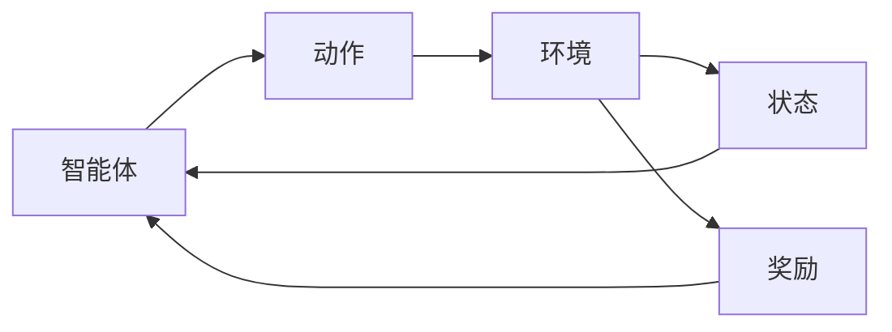

# 强化学习基础

## 🎯 强化学习核心概念

### 1. 基本定义

**强化学习定义：**
> **强化学习是智能体通过与环境交互，通过试错学习最优策略的机器学习方法**

**核心要素：**
- 🤖 **智能体（Agent）**：学习和决策的主体
- 🌍 **环境（Environment）**：智能体交互的外部世界
- 🎯 **状态（State）**：环境的当前情况
- 🎮 **动作（Action）**：智能体可以执行的操作
- 🏆 **奖励（Reward）**：环境对动作的反馈
- 📋 **策略（Policy）**：状态到动作的映射

**学习过程：**


### 2. 马尔可夫决策过程（MDP）

**MDP定义：**
```
MDP = (S, A, P, R, γ)
其中：
S: 状态空间
A: 动作空间
P: 状态转移概率 P(s'|s,a)
R: 奖励函数 R(s,a,s')
γ: 折扣因子
```

**马尔可夫性质：**
```
P(s_{t+1}|s_t, a_t, s_{t-1}, a_{t-1}, ...) = P(s_{t+1}|s_t, a_t)
```

**价值函数：**
```python
def state_value_function(state, policy, gamma=0.9):
    """状态价值函数"""
    value = 0
    for action in possible_actions(state):
        action_prob = policy(state, action)
        for next_state in possible_states(state, action):
            transition_prob = transition_probability(state, action, next_state)
            reward = reward_function(state, action, next_state)
            value += action_prob * transition_prob * (reward + gamma * state_value_function(next_state, policy, gamma))
    return value

def action_value_function(state, action, policy, gamma=0.9):
    """动作价值函数"""
    value = 0
    for next_state in possible_states(state, action):
        transition_prob = transition_probability(state, action, next_state)
        reward = reward_function(state, action, next_state)
        value += transition_prob * (reward + gamma * state_value_function(next_state, policy, gamma))
    return value
```

## 🔧 经典算法

### 1. Q-Learning

**算法原理：**
```
Q(s,a) ← Q(s,a) + α[r + γ max Q(s',a') - Q(s,a)]
其中：
α: 学习率
γ: 折扣因子
r: 即时奖励
```

**实现代码：**
```python
class QLearning:
    def __init__(self, states, actions, learning_rate=0.1, discount_factor=0.9, epsilon=0.1):
        self.states = states
        self.actions = actions
        self.learning_rate = learning_rate
        self.discount_factor = discount_factor
        self.epsilon = epsilon
        self.q_table = np.zeros((len(states), len(actions)))
    
    def get_state_index(self, state):
        """获取状态索引"""
        return self.states.index(state)
    
    def get_action_index(self, action):
        """获取动作索引"""
        return self.actions.index(action)
    
    def choose_action(self, state, training=True):
        """选择动作"""
        if training and np.random.random() < self.epsilon:
            # 探索：随机选择动作
            return np.random.choice(self.actions)
        else:
            # 利用：选择Q值最大的动作
            state_idx = self.get_state_index(state)
            q_values = self.q_table[state_idx]
            max_q = np.max(q_values)
            best_actions = [action for action in self.actions 
                           if q_values[self.get_action_index(action)] == max_q]
            return np.random.choice(best_actions)
    
    def update_q_value(self, state, action, reward, next_state):
        """更新Q值"""
        state_idx = self.get_state_index(state)
        action_idx = self.get_action_index(action)
        next_state_idx = self.get_state_index(next_state)
        
        # Q-Learning更新规则
        current_q = self.q_table[state_idx, action_idx]
        max_next_q = np.max(self.q_table[next_state_idx])
        target_q = reward + self.discount_factor * max_next_q
        
        self.q_table[state_idx, action_idx] = current_q + self.learning_rate * (target_q - current_q)
    
    def train(self, episodes=1000):
        """训练模型"""
        for episode in range(episodes):
            state = self.reset_environment()
            done = False
            
            while not done:
                action = self.choose_action(state)
                next_state, reward, done = self.step_environment(state, action)
                self.update_q_value(state, action, reward, next_state)
                state = next_state
            
            # 衰减epsilon
            if episode % 100 == 0:
                self.epsilon = max(0.01, self.epsilon * 0.99)
```

### 2. SARSA算法

**算法原理：**
```
Q(s,a) ← Q(s,a) + α[r + γ Q(s',a') - Q(s,a)]
其中：
a': 下一个状态选择的动作
```

**实现代码：**
```python
class SARSA:
    def __init__(self, states, actions, learning_rate=0.1, discount_factor=0.9, epsilon=0.1):
        self.states = states
        self.actions = actions
        self.learning_rate = learning_rate
        self.discount_factor = discount_factor
        self.epsilon = epsilon
        self.q_table = np.zeros((len(states), len(actions)))
    
    def choose_action(self, state, training=True):
        """选择动作"""
        if training and np.random.random() < self.epsilon:
            return np.random.choice(self.actions)
        else:
            state_idx = self.get_state_index(state)
            q_values = self.q_table[state_idx]
            max_q = np.max(q_values)
            best_actions = [action for action in self.actions 
                           if q_values[self.get_action_index(action)] == max_q]
            return np.random.choice(best_actions)
    
    def update_q_value(self, state, action, reward, next_state, next_action):
        """更新Q值"""
        state_idx = self.get_state_index(state)
        action_idx = self.get_action_index(action)
        next_state_idx = self.get_state_index(next_state)
        next_action_idx = self.get_action_index(next_action)
        
        # SARSA更新规则
        current_q = self.q_table[state_idx, action_idx]
        next_q = self.q_table[next_state_idx, next_action_idx]
        target_q = reward + self.discount_factor * next_q
        
        self.q_table[state_idx, action_idx] = current_q + self.learning_rate * (target_q - current_q)
    
    def train(self, episodes=1000):
        """训练模型"""
        for episode in range(episodes):
            state = self.reset_environment()
            action = self.choose_action(state)
            done = False
            
            while not done:
                next_state, reward, done = self.step_environment(state, action)
                next_action = self.choose_action(next_state)
                self.update_q_value(state, action, reward, next_state, next_action)
                state = next_state
                action = next_action
            
            # 衰减epsilon
            if episode % 100 == 0:
                self.epsilon = max(0.01, self.epsilon * 0.99)
```

### 3. 策略梯度方法

**算法原理：**
```
∇J(θ) = E[∇log π(a|s,θ) Q(s,a)]
其中：
J(θ): 策略目标函数
π(a|s,θ): 策略函数
Q(s,a): 动作价值函数
```

**实现代码：**
```python
class PolicyGradient:
    def __init__(self, state_dim, action_dim, learning_rate=0.01):
        self.state_dim = state_dim
        self.action_dim = action_dim
        self.learning_rate = learning_rate
        
        # 策略网络参数
        self.theta = np.random.normal(0, 0.1, (state_dim, action_dim))
    
    def policy(self, state):
        """策略函数"""
        logits = state @ self.theta
        exp_logits = np.exp(logits - np.max(logits))
        probabilities = exp_logits / np.sum(exp_logits)
        return probabilities
    
    def choose_action(self, state):
        """选择动作"""
        probabilities = self.policy(state)
        action = np.random.choice(self.action_dim, p=probabilities)
        return action, probabilities[action]
    
    def compute_policy_gradient(self, states, actions, rewards):
        """计算策略梯度"""
        gradient = np.zeros_like(self.theta)
        
        for i, (state, action, reward) in enumerate(zip(states, actions, rewards)):
            probabilities = self.policy(state)
            
            # 计算对数概率梯度
            log_prob_gradient = np.zeros(self.action_dim)
            log_prob_gradient[action] = 1.0 / probabilities[action]
            
            # 计算策略梯度
            gradient += reward * np.outer(state, log_prob_gradient)
        
        return gradient / len(states)
    
    def update_policy(self, states, actions, rewards):
        """更新策略"""
        gradient = self.compute_policy_gradient(states, actions, rewards)
        self.theta += self.learning_rate * gradient
    
    def train(self, episodes=1000):
        """训练模型"""
        for episode in range(episodes):
            states, actions, rewards = self.run_episode()
            self.update_policy(states, actions, rewards)
```

## 🎮 实际应用

### 1. 游戏AI

**贪吃蛇游戏：**
```python
class SnakeGame:
    def __init__(self, width=10, height=10):
        self.width = width
        self.height = height
        self.reset()
    
    def reset(self):
        """重置游戏"""
        self.snake = [(width//2, height//2)]
        self.food = self.generate_food()
        self.direction = (0, 1)
        self.score = 0
        self.done = False
    
    def generate_food(self):
        """生成食物"""
        while True:
            food = (np.random.randint(0, self.width), np.random.randint(0, self.height))
            if food not in self.snake:
                return food
    
    def step(self, action):
        """执行动作"""
        if self.done:
            return self.get_state(), 0, True
        
        # 更新方向
        directions = [(0, -1), (1, 0), (0, 1), (-1, 0)]  # 上、右、下、左
        self.direction = directions[action]
        
        # 移动蛇头
        head = self.snake[0]
        new_head = (head[0] + self.direction[0], head[1] + self.direction[1])
        
        # 检查碰撞
        if (new_head[0] < 0 or new_head[0] >= self.width or 
            new_head[1] < 0 or new_head[1] >= self.height or 
            new_head in self.snake):
            self.done = True
            return self.get_state(), -10, True
        
        self.snake.insert(0, new_head)
        
        # 检查是否吃到食物
        if new_head == self.food:
            self.score += 10
            self.food = self.generate_food()
            reward = 10
        else:
            self.snake.pop()
            reward = -1
        
        return self.get_state(), reward, self.done
    
    def get_state(self):
        """获取当前状态"""
        state = np.zeros((self.width, self.height))
        
        # 蛇身
        for segment in self.snake:
            state[segment[0], segment[1]] = 1
        
        # 食物
        state[self.food[0], self.food[1]] = 2
        
        return state.flatten()
```

### 2. 机器人控制

**机器人导航：**
```python
class RobotNavigation:
    def __init__(self, grid_size=10):
        self.grid_size = grid_size
        self.obstacles = self.generate_obstacles()
        self.reset()
    
    def reset(self):
        """重置环境"""
        self.robot_pos = (0, 0)
        self.target_pos = (self.grid_size-1, self.grid_size-1)
        self.done = False
    
    def generate_obstacles(self):
        """生成障碍物"""
        obstacles = []
        for _ in range(5):
            obstacle = (np.random.randint(0, self.grid_size), 
                       np.random.randint(0, self.grid_size))
            if obstacle not in obstacles:
                obstacles.append(obstacle)
        return obstacles
    
    def step(self, action):
        """执行动作"""
        if self.done:
            return self.get_state(), 0, True
        
        # 动作映射
        actions = [(0, -1), (1, 0), (0, 1), (-1, 0)]  # 上、右、下、左
        dx, dy = actions[action]
        
        # 更新位置
        new_pos = (self.robot_pos[0] + dx, self.robot_pos[1] + dy)
        
        # 检查边界和障碍物
        if (new_pos[0] < 0 or new_pos[0] >= self.grid_size or 
            new_pos[1] < 0 or new_pos[1] >= self.grid_size or 
            new_pos in self.obstacles):
            reward = -5
        else:
            self.robot_pos = new_pos
            reward = -1
        
        # 检查是否到达目标
        if self.robot_pos == self.target_pos:
            self.done = True
            reward = 100
        
        return self.get_state(), reward, self.done
    
    def get_state(self):
        """获取当前状态"""
        state = np.zeros((self.grid_size, self.grid_size))
        
        # 机器人位置
        state[self.robot_pos[0], self.robot_pos[1]] = 1
        
        # 目标位置
        state[self.target_pos[0], self.target_pos[1]] = 2
        
        # 障碍物
        for obstacle in self.obstacles:
            state[obstacle[0], obstacle[1]] = -1
        
        return state.flatten()
```

## 📊 评估方法

### 1. 性能指标

**累积奖励：**
```python
def evaluate_agent(agent, environment, episodes=100):
    """评估智能体性能"""
    total_rewards = []
    
    for episode in range(episodes):
        state = environment.reset()
        episode_reward = 0
        done = False
        
        while not done:
            action = agent.choose_action(state, training=False)
            state, reward, done = environment.step(action)
            episode_reward += reward
        
        total_rewards.append(episode_reward)
    
    return {
        'mean_reward': np.mean(total_rewards),
        'std_reward': np.std(total_rewards),
        'min_reward': np.min(total_rewards),
        'max_reward': np.max(total_rewards)
    }
```

**学习曲线：**
```python
def plot_learning_curve(rewards_history):
    """绘制学习曲线"""
    import matplotlib.pyplot as plt
    
    plt.figure(figsize=(10, 6))
    plt.plot(rewards_history)
    plt.xlabel('Episode')
    plt.ylabel('Cumulative Reward')
    plt.title('Learning Curve')
    plt.grid(True)
    plt.show()
```

### 2. 策略评估

**策略价值：**
```python
def evaluate_policy(policy, environment, gamma=0.9):
    """评估策略价值"""
    state_values = {}
    visited_states = set()
    
    def compute_state_value(state):
        if state in state_values:
            return state_values[state]
        
        if state in visited_states:
            return 0  # 避免循环
        
        visited_states.add(state)
        
        value = 0
        for action in environment.get_possible_actions(state):
            action_prob = policy(state, action)
            for next_state, reward, done in environment.get_transitions(state, action):
                transition_prob = environment.get_transition_probability(state, action, next_state)
                if done:
                    value += action_prob * transition_prob * reward
                else:
                    value += action_prob * transition_prob * (reward + gamma * compute_state_value(next_state))
        
        state_values[state] = value
        return value
    
    return compute_state_value(environment.get_initial_state())
```

## 🔗 相关链接
- [[01-02-02-概率论与统计学]] - 概率统计基础
- [[01-02-03-微积分基础]] - 微积分基础
- [[02-01-01-监督学习原理]] - 监督学习
- [[02-01-02-无监督学习原理]] - 无监督学习

## 💡 费曼学习法应用
**概念理解**：强化学习就像"学骑自行车"，通过试错学习最优策略。智能体就像"学习者"，环境就像"自行车"，奖励就像"成功或失败"。

**实践建议**：学习强化学习要像"学技能"，多练习各种算法，理解环境交互，掌握策略优化。

**AI应用**：强化学习是AI的"学习技能"，能够通过试错学习最优策略。就像人类学习技能，强化学习让AI学会决策。

---
*📝 学习提示：强化学习是AI的重要分支，建议多练习各种算法，理解环境交互和策略优化*


