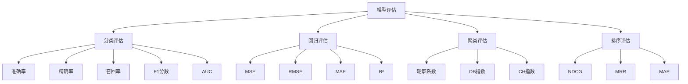

# 模型评估方法

## 📊 评估方法体系

### 1. 评估方法分类

**评估方法框架：**


### 2. 评估原则

**评估原则：**
- 🎯 **目标导向**：评估指标要与业务目标一致
- 📊 **全面评估**：从多个维度评估模型性能
- 🔄 **交叉验证**：使用交叉验证避免过拟合
- 📈 **持续监控**：在生产环境中持续监控模型性能

## 🎯 分类模型评估

### 1. 混淆矩阵

**混淆矩阵定义：**
```
混淆矩阵 = [TP  FP]
          [FN  TN]

其中：
TP: 真正例 (True Positive)
FP: 假正例 (False Positive)
FN: 假负例 (False Negative)
TN: 真负例 (True Negative)
```

**实现代码：**
```python
import numpy as np
from sklearn.metrics import confusion_matrix, classification_report

def confusion_matrix_analysis(y_true, y_pred):
    """混淆矩阵分析"""
    cm = confusion_matrix(y_true, y_pred)
    
    # 计算各种指标
    tp = cm[1, 1]  # 真正例
    fp = cm[0, 1]  # 假正例
    fn = cm[1, 0]  # 假负例
    tn = cm[0, 0]  # 真负例
    
    # 计算评估指标
    accuracy = (tp + tn) / (tp + fp + fn + tn)
    precision = tp / (tp + fp) if (tp + fp) > 0 else 0
    recall = tp / (tp + fn) if (tp + fn) > 0 else 0
    f1 = 2 * precision * recall / (precision + recall) if (precision + recall) > 0 else 0
    
    return {
        'confusion_matrix': cm,
        'accuracy': accuracy,
        'precision': precision,
        'recall': recall,
        'f1_score': f1
    }
```

### 2. 分类指标详解

**准确率（Accuracy）：**
```python
def accuracy_score(y_true, y_pred):
    """准确率计算"""
    correct = np.sum(y_true == y_pred)
    total = len(y_true)
    return correct / total

# 特点：
# - 优点：直观易懂
# - 缺点：在类别不平衡时可能误导
# - 适用：类别平衡的二分类问题
```

**精确率（Precision）：**
```python
def precision_score(y_true, y_pred):
    """精确率计算"""
    tp = np.sum((y_true == 1) & (y_pred == 1))
    fp = np.sum((y_true == 0) & (y_pred == 1))
    return tp / (tp + fp) if (tp + fp) > 0 else 0

# 特点：
# - 含义：预测为正例中实际为正例的比例
# - 适用：关注假正例的场景（如垃圾邮件检测）
```

**召回率（Recall）：**
```python
def recall_score(y_true, y_pred):
    """召回率计算"""
    tp = np.sum((y_true == 1) & (y_pred == 1))
    fn = np.sum((y_true == 1) & (y_pred == 0))
    return tp / (tp + fn) if (tp + fn) > 0 else 0

# 特点：
# - 含义：实际正例中被预测为正例的比例
# - 适用：关注假负例的场景（如疾病诊断）
```

**F1分数（F1-Score）：**
```python
def f1_score(y_true, y_pred):
    """F1分数计算"""
    precision = precision_score(y_true, y_pred)
    recall = recall_score(y_true, y_pred)
    return 2 * precision * recall / (precision + recall) if (precision + recall) > 0 else 0

# 特点：
# - 含义：精确率和召回率的调和平均
# - 适用：平衡精确率和召回率的场景
```

### 3. ROC和AUC

**ROC曲线：**
```python
import matplotlib.pyplot as plt
from sklearn.metrics import roc_curve, auc

def plot_roc_curve(y_true, y_scores):
    """绘制ROC曲线"""
    fpr, tpr, thresholds = roc_curve(y_true, y_scores)
    roc_auc = auc(fpr, tpr)
    
    plt.figure(figsize=(8, 6))
    plt.plot(fpr, tpr, color='darkorange', lw=2, 
             label=f'ROC curve (AUC = {roc_auc:.2f})')
    plt.plot([0, 1], [0, 1], color='navy', lw=2, linestyle='--')
    plt.xlim([0.0, 1.0])
    plt.ylim([0.0, 1.05])
    plt.xlabel('False Positive Rate')
    plt.ylabel('True Positive Rate')
    plt.title('Receiver Operating Characteristic (ROC) Curve')
    plt.legend(loc="lower right")
    plt.show()
    
    return roc_auc

# AUC解释：
# - 0.5: 随机分类器
# - 0.7-0.8: 较好的分类器
# - 0.8-0.9: 很好的分类器
# - 0.9-1.0: 优秀的分类器
```

## 📈 回归模型评估

### 1. 回归指标

**均方误差（MSE）：**
```python
def mean_squared_error(y_true, y_pred):
    """均方误差计算"""
    return np.mean((y_true - y_pred) ** 2)

# 特点：
# - 单位：原单位的平方
# - 对异常值敏感
# - 值越小越好
```

**均方根误差（RMSE）：**
```python
def root_mean_squared_error(y_true, y_pred):
    """均方根误差计算"""
    return np.sqrt(mean_squared_error(y_true, y_pred))

# 特点：
# - 单位：与原单位相同
# - 对异常值敏感
# - 值越小越好
```

**平均绝对误差（MAE）：**
```python
def mean_absolute_error(y_true, y_pred):
    """平均绝对误差计算"""
    return np.mean(np.abs(y_true - y_pred))

# 特点：
# - 单位：与原单位相同
# - 对异常值不敏感
# - 值越小越好
```

**决定系数（R²）：**
```python
def r2_score(y_true, y_pred):
    """决定系数计算"""
    ss_res = np.sum((y_true - y_pred) ** 2)
    ss_tot = np.sum((y_true - np.mean(y_true)) ** 2)
    return 1 - (ss_res / ss_tot)

# 特点：
# - 范围：[0, 1]
# - 含义：模型解释的方差比例
# - 值越大越好
```

### 2. 回归评估可视化

**残差分析：**
```python
def plot_residuals(y_true, y_pred):
    """绘制残差图"""
    residuals = y_true - y_pred
    
    fig, axes = plt.subplots(2, 2, figsize=(12, 10))
    
    # 残差散点图
    axes[0, 0].scatter(y_pred, residuals, alpha=0.6)
    axes[0, 0].axhline(y=0, color='r', linestyle='--')
    axes[0, 0].set_xlabel('Predicted Values')
    axes[0, 0].set_ylabel('Residuals')
    axes[0, 0].set_title('Residuals vs Predicted')
    
    # 残差直方图
    axes[0, 1].hist(residuals, bins=30, alpha=0.7)
    axes[0, 1].set_xlabel('Residuals')
    axes[0, 1].set_ylabel('Frequency')
    axes[0, 1].set_title('Residuals Distribution')
    
    # Q-Q图
    from scipy import stats
    stats.probplot(residuals, dist="norm", plot=axes[1, 0])
    axes[1, 0].set_title('Q-Q Plot')
    
    # 预测值vs真实值
    axes[1, 1].scatter(y_true, y_pred, alpha=0.6)
    axes[1, 1].plot([y_true.min(), y_true.max()], 
                    [y_true.min(), y_true.max()], 'r--', lw=2)
    axes[1, 1].set_xlabel('True Values')
    axes[1, 1].set_ylabel('Predicted Values')
    axes[1, 1].set_title('True vs Predicted')
    
    plt.tight_layout()
    plt.show()
```

## 🔍 聚类模型评估

### 1. 内部评估指标

**轮廓系数（Silhouette Score）：**
```python
from sklearn.metrics import silhouette_score

def silhouette_analysis(X, labels):
    """轮廓系数分析"""
    score = silhouette_score(X, labels)
    
    # 计算每个样本的轮廓系数
    from sklearn.metrics import silhouette_samples
    sample_silhouette_values = silhouette_samples(X, labels)
    
    # 可视化
    fig, ax = plt.subplots(1, 1, figsize=(10, 6))
    
    y_lower = 10
    for i in range(len(np.unique(labels))):
        cluster_silhouette_values = sample_silhouette_values[labels == i]
        cluster_silhouette_values.sort()
        
        size_cluster_i = cluster_silhouette_values.shape[0]
        y_upper = y_lower + size_cluster_i
        
        color = plt.cm.nipy_spectral(float(i) / len(np.unique(labels)))
        ax.fill_betweenx(np.arange(y_lower, y_upper),
                         0, cluster_silhouette_values,
                         facecolor=color, edgecolor=color, alpha=0.7)
        
        ax.text(-0.05, y_lower + 0.5 * size_cluster_i, str(i))
        y_lower = y_upper + 10
    
    ax.set_xlabel('Silhouette Coefficient')
    ax.set_ylabel('Cluster Label')
    ax.set_title(f'Silhouette Analysis (Score: {score:.3f})')
    
    plt.show()
    return score

# 轮廓系数解释：
# - 范围：[-1, 1]
# - > 0.5: 聚类效果很好
# - 0.2-0.5: 聚类效果一般
# - < 0.2: 聚类效果较差
```

**Davies-Bouldin指数：**
```python
from sklearn.metrics import davies_bouldin_score

def davies_bouldin_analysis(X, labels):
    """Davies-Bouldin指数分析"""
    score = davies_bouldin_score(X, labels)
    
    # 计算每个簇的指标
    n_clusters = len(np.unique(labels))
    cluster_centers = []
    cluster_sizes = []
    
    for i in range(n_clusters):
        cluster_points = X[labels == i]
        cluster_centers.append(np.mean(cluster_points, axis=0))
        cluster_sizes.append(len(cluster_points))
    
    # 可视化簇中心
    plt.figure(figsize=(10, 6))
    colors = plt.cm.nipy_spectral(np.linspace(0, 1, n_clusters))
    
    for i, (center, size) in enumerate(zip(cluster_centers, cluster_sizes)):
        plt.scatter(center[0], center[1], c=[colors[i]], s=size*10, 
                   alpha=0.7, label=f'Cluster {i}')
    
    plt.xlabel('Feature 1')
    plt.ylabel('Feature 2')
    plt.title(f'Cluster Centers (DB Score: {score:.3f})')
    plt.legend()
    plt.show()
    
    return score

# DB指数解释：
# - 范围：[0, ∞)
# - 值越小越好
# - 考虑簇内紧密度和簇间分离度
```

### 2. 外部评估指标

**调整兰德指数（ARI）：**
```python
from sklearn.metrics import adjusted_rand_score

def ari_analysis(true_labels, pred_labels):
    """调整兰德指数分析"""
    ari = adjusted_rand_score(true_labels, pred_labels)
    
    # 可视化对比
    fig, axes = plt.subplots(1, 2, figsize=(12, 5))
    
    # 真实标签
    scatter1 = axes[0].scatter(X[:, 0], X[:, 1], c=true_labels, 
                               cmap='viridis', alpha=0.7)
    axes[0].set_title('True Labels')
    axes[0].set_xlabel('Feature 1')
    axes[0].set_ylabel('Feature 2')
    
    # 预测标签
    scatter2 = axes[1].scatter(X[:, 0], X[:, 1], c=pred_labels, 
                               cmap='viridis', alpha=0.7)
    axes[1].set_title(f'Predicted Labels (ARI: {ari:.3f})')
    axes[1].set_xlabel('Feature 1')
    axes[1].set_ylabel('Feature 2')
    
    plt.tight_layout()
    plt.show()
    
    return ari

# ARI解释：
# - 范围：[-1, 1]
# - 1: 完全一致
# - 0: 随机标签
# - -1: 完全不一致
```

## 🔄 交叉验证

### 1. K折交叉验证

**K折交叉验证实现：**
```python
from sklearn.model_selection import KFold, cross_val_score

def k_fold_cross_validation(X, y, model, k=5):
    """K折交叉验证"""
    kf = KFold(n_splits=k, shuffle=True, random_state=42)
    
    # 计算交叉验证分数
    scores = cross_val_score(model, X, y, cv=kf, scoring='accuracy')
    
    # 可视化结果
    plt.figure(figsize=(10, 6))
    plt.plot(range(1, k+1), scores, 'bo-', label='CV Scores')
    plt.axhline(y=scores.mean(), color='r', linestyle='--', 
                label=f'Mean Score: {scores.mean():.3f}')
    plt.fill_between(range(1, k+1), 
                     scores.mean() - scores.std(),
                     scores.mean() + scores.std(),
                     alpha=0.2, label='±1 Std')
    plt.xlabel('Fold')
    plt.ylabel('Score')
    plt.title('K-Fold Cross Validation Results')
    plt.legend()
    plt.grid(True)
    plt.show()
    
    return {
        'scores': scores,
        'mean': scores.mean(),
        'std': scores.std(),
        'min': scores.min(),
        'max': scores.max()
    }
```

### 2. 留一法交叉验证

**留一法交叉验证：**
```python
from sklearn.model_selection import LeaveOneOut

def leave_one_out_cv(X, y, model):
    """留一法交叉验证"""
    loo = LeaveOneOut()
    scores = cross_val_score(model, X, y, cv=loo, scoring='accuracy')
    
    print(f"Leave-One-Out CV Results:")
    print(f"Mean Score: {scores.mean():.3f}")
    print(f"Std Score: {scores.std():.3f}")
    print(f"Min Score: {scores.min():.3f}")
    print(f"Max Score: {scores.max():.3f}")
    
    return scores
```

### 3. 时间序列交叉验证

**时间序列交叉验证：**
```python
from sklearn.model_selection import TimeSeriesSplit

def time_series_cv(X, y, model, n_splits=5):
    """时间序列交叉验证"""
    tscv = TimeSeriesSplit(n_splits=n_splits)
    
    scores = []
    for train_idx, test_idx in tscv.split(X):
        X_train, X_test = X[train_idx], X[test_idx]
        y_train, y_test = y[train_idx], y[test_idx]
        
        model.fit(X_train, y_train)
        score = model.score(X_test, y_test)
        scores.append(score)
    
    # 可视化
    plt.figure(figsize=(10, 6))
    plt.plot(range(1, n_splits+1), scores, 'bo-')
    plt.xlabel('Split')
    plt.ylabel('Score')
    plt.title('Time Series Cross Validation Results')
    plt.grid(True)
    plt.show()
    
    return scores
```

## 📊 模型比较

### 1. 模型性能比较

**多模型比较：**
```python
def compare_models(X, y, models):
    """比较多个模型性能"""
    results = {}
    
    for name, model in models.items():
        # 交叉验证
        cv_scores = cross_val_score(model, X, y, cv=5, scoring='accuracy')
        
        # 训练和测试
        X_train, X_test, y_train, y_test = train_test_split(X, y, test_size=0.2, random_state=42)
        model.fit(X_train, y_train)
        train_score = model.score(X_train, y_train)
        test_score = model.score(X_test, y_test)
        
        results[name] = {
            'cv_mean': cv_scores.mean(),
            'cv_std': cv_scores.std(),
            'train_score': train_score,
            'test_score': test_score,
            'overfitting': train_score - test_score
        }
    
    # 可视化比较
    fig, axes = plt.subplots(2, 2, figsize=(15, 10))
    
    # 交叉验证分数
    names = list(results.keys())
    cv_means = [results[name]['cv_mean'] for name in names]
    cv_stds = [results[name]['cv_std'] for name in names]
    
    axes[0, 0].bar(names, cv_means, yerr=cv_stds, capsize=5)
    axes[0, 0].set_title('Cross Validation Scores')
    axes[0, 0].set_ylabel('Score')
    axes[0, 0].tick_params(axis='x', rotation=45)
    
    # 训练和测试分数
    train_scores = [results[name]['train_score'] for name in names]
    test_scores = [results[name]['test_score'] for name in names]
    
    x = np.arange(len(names))
    width = 0.35
    
    axes[0, 1].bar(x - width/2, train_scores, width, label='Train')
    axes[0, 1].bar(x + width/2, test_scores, width, label='Test')
    axes[0, 1].set_title('Train vs Test Scores')
    axes[0, 1].set_ylabel('Score')
    axes[0, 1].set_xticks(x)
    axes[0, 1].set_xticklabels(names, rotation=45)
    axes[0, 1].legend()
    
    # 过拟合程度
    overfitting = [results[name]['overfitting'] for name in names]
    axes[1, 0].bar(names, overfitting)
    axes[1, 0].set_title('Overfitting (Train - Test)')
    axes[1, 0].set_ylabel('Overfitting')
    axes[1, 0].tick_params(axis='x', rotation=45)
    
    # 综合评分
    composite_scores = [results[name]['cv_mean'] - results[name]['overfitting'] for name in names]
    axes[1, 1].bar(names, composite_scores)
    axes[1, 1].set_title('Composite Score (CV - Overfitting)')
    axes[1, 1].set_ylabel('Score')
    axes[1, 1].tick_params(axis='x', rotation=45)
    
    plt.tight_layout()
    plt.show()
    
    return results
```

## 🔗 相关链接
- [[02-01-01-监督学习原理]] - 监督学习
- [[02-01-02-无监督学习原理]] - 无监督学习
- [[02-01-05-过拟合与正则化]] - 过拟合问题
- [[02-01-06-机器学习算法对比]] - 算法比较

## 💡 评估方法建议

**选择原则：**
- 🎯 **业务导向**：选择与业务目标一致的指标
- 📊 **全面评估**：使用多个指标综合评估
- 🔄 **交叉验证**：使用交叉验证避免过拟合
- 📈 **持续监控**：在生产环境中持续监控

**实践建议：**
- 📝 **记录结果**：详细记录评估结果
- 🔍 **分析原因**：分析性能差异的原因
- 🔄 **迭代改进**：基于评估结果改进模型
- 📊 **可视化展示**：使用图表展示评估结果

---
*📝 学习提示：模型评估是机器学习的重要环节，建议掌握各种评估方法，选择适合的评估指标*


