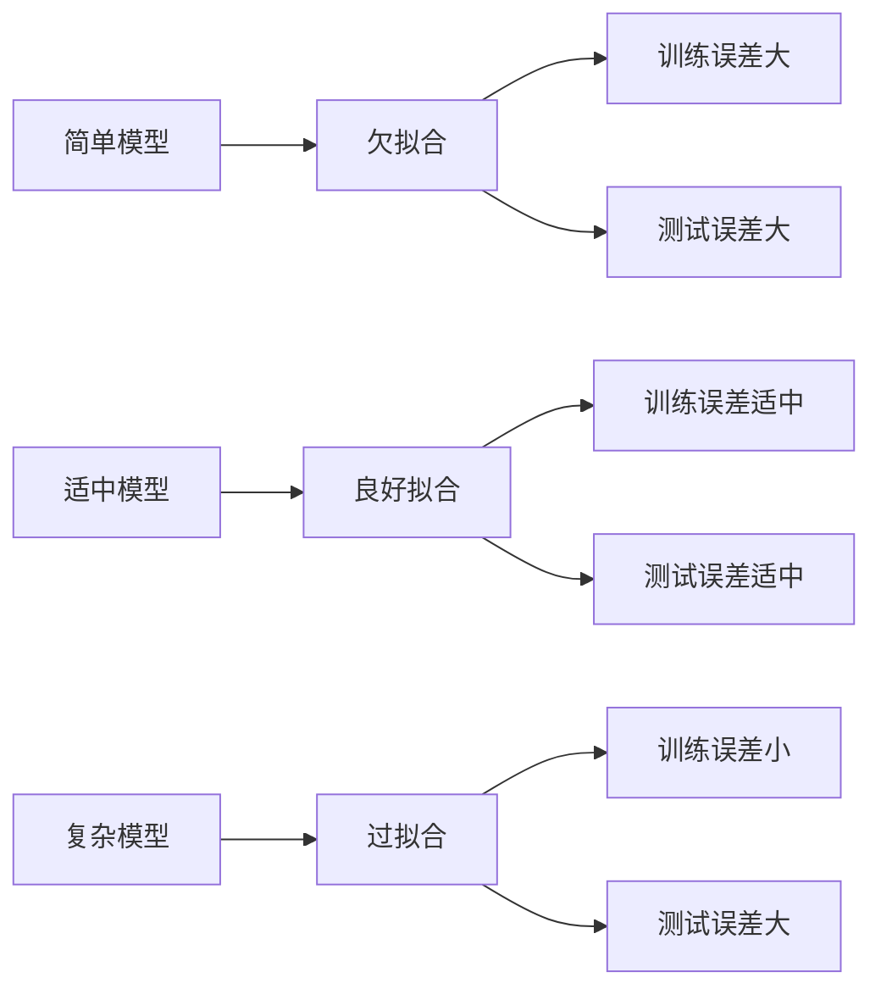

# 过拟合与正则化

## 🎯 过拟合问题

### 1. 过拟合定义

**过拟合概念：**
> **过拟合是指模型在训练数据上表现很好，但在测试数据上表现较差的现象**

**过拟合特征：**
- 📈 **训练误差小**：模型在训练集上误差很小
- 📉 **测试误差大**：模型在测试集上误差较大
- 🔍 **泛化能力差**：模型对新数据的预测能力差
- 📊 **复杂度高**：模型过于复杂，学习了噪声

**过拟合示意图：**


### 2. 过拟合原因分析

**主要原因：**

| 原因 | 描述 | 影响 | 解决方案 |
|------|------|------|----------|
| **模型复杂度过高** | 参数过多，容量过大 | 学习噪声 | 降低复杂度 |
| **训练数据不足** | 数据量小，多样性不够 | 无法泛化 | 增加数据 |
| **训练时间过长** | 过度训练，记忆数据 | 失去泛化 | 早停策略 |
| **特征过多** | 特征维度高，噪声多 | 维度灾难 | 特征选择 |

**过拟合检测：**
```python
import matplotlib.pyplot as plt
import numpy as np

def plot_learning_curves(model, X_train, y_train, X_val, y_val):
    """绘制学习曲线"""
    train_scores = []
    val_scores = []
    
    # 不同训练集大小
    train_sizes = np.linspace(0.1, 1.0, 10)
    
    for size in train_sizes:
        # 采样训练数据
        n_samples = int(size * len(X_train))
        X_subset = X_train[:n_samples]
        y_subset = y_train[:n_samples]
        
        # 训练模型
        model.fit(X_subset, y_subset)
        
        # 计算分数
        train_score = model.score(X_subset, y_subset)
        val_score = model.score(X_val, y_val)
        
        train_scores.append(train_score)
        val_scores.append(val_score)
    
    # 绘制学习曲线
    plt.figure(figsize=(10, 6))
    plt.plot(train_sizes, train_scores, 'o-', label='Training Score')
    plt.plot(train_sizes, val_scores, 'o-', label='Validation Score')
    plt.xlabel('Training Set Size')
    plt.ylabel('Score')
    plt.title('Learning Curves')
    plt.legend()
    plt.grid(True)
    plt.show()
    
    return train_scores, val_scores

# 过拟合判断标准：
# - 训练分数持续上升
# - 验证分数先上升后下降
# - 训练分数和验证分数差距大
```

## 🔧 正则化技术

### 1. L1正则化（Lasso）

**L1正则化原理：**
```
损失函数 = 原始损失 + λ * Σ|wᵢ|

其中：
λ: 正则化参数
wᵢ: 模型参数
```

**L1正则化特点：**
- 🎯 **特征选择**：能够将不重要的特征权重设为0
- 📊 **稀疏性**：产生稀疏的权重向量
- 🔍 **可解释性**：模型更简单，更易解释
- ⚖️ **权衡**：在拟合和稀疏性之间权衡

**L1正则化实现：**
```python
import numpy as np
from sklearn.linear_model import Lasso
from sklearn.preprocessing import StandardScaler

class L1Regularization:
    def __init__(self, alpha=1.0):
        self.alpha = alpha
        self.model = Lasso(alpha=alpha)
        self.scaler = StandardScaler()
    
    def fit(self, X, y):
        """训练L1正则化模型"""
        # 标准化特征
        X_scaled = self.scaler.fit_transform(X)
        
        # 训练模型
        self.model.fit(X_scaled, y)
        
        return self
    
    def predict(self, X):
        """预测"""
        X_scaled = self.scaler.transform(X)
        return self.model.predict(X_scaled)
    
    def get_feature_importance(self):
        """获取特征重要性"""
        return np.abs(self.model.coef_)
    
    def get_selected_features(self, threshold=1e-6):
        """获取选择的特征"""
        return np.where(np.abs(self.model.coef_) > threshold)[0]

# L1正则化参数选择
def l1_parameter_selection(X, y):
    """L1正则化参数选择"""
    alphas = np.logspace(-4, 1, 50)
    train_scores = []
    val_scores = []
    
    for alpha in alphas:
        model = Lasso(alpha=alpha)
        # 交叉验证
        from sklearn.model_selection import cross_val_score
        scores = cross_val_score(model, X, y, cv=5)
        val_scores.append(scores.mean())
        
        # 训练分数
        model.fit(X, y)
        train_scores.append(model.score(X, y))
    
    # 绘制参数选择图
    plt.figure(figsize=(12, 5))
    
    plt.subplot(1, 2, 1)
    plt.semilogx(alphas, train_scores, label='Training Score')
    plt.semilogx(alphas, val_scores, label='Validation Score')
    plt.xlabel('Alpha')
    plt.ylabel('Score')
    plt.title('L1 Regularization Parameter Selection')
    plt.legend()
    plt.grid(True)
    
    plt.subplot(1, 2, 2)
    plt.semilogx(alphas, np.array(train_scores) - np.array(val_scores))
    plt.xlabel('Alpha')
    plt.ylabel('Overfitting (Train - Val)')
    plt.title('Overfitting vs Alpha')
    plt.grid(True)
    
    plt.tight_layout()
    plt.show()
    
    return alphas, train_scores, val_scores
```

### 2. L2正则化（Ridge）

**L2正则化原理：**
```
损失函数 = 原始损失 + λ * Σwᵢ²

其中：
λ: 正则化参数
wᵢ: 模型参数
```

**L2正则化特点：**
- 🎯 **权重衰减**：减小权重值，防止过拟合
- 📊 **平滑性**：权重变化更平滑
- 🔍 **稳定性**：数值计算更稳定
- ⚖️ **权衡**：在拟合和复杂度之间权衡

**L2正则化实现：**
```python
from sklearn.linear_model import Ridge

class L2Regularization:
    def __init__(self, alpha=1.0):
        self.alpha = alpha
        self.model = Ridge(alpha=alpha)
        self.scaler = StandardScaler()
    
    def fit(self, X, y):
        """训练L2正则化模型"""
        # 标准化特征
        X_scaled = self.scaler.fit_transform(X)
        
        # 训练模型
        self.model.fit(X_scaled, y)
        
        return self
    
    def predict(self, X):
        """预测"""
        X_scaled = self.scaler.transform(X)
        return self.model.predict(X_scaled)
    
    def get_feature_importance(self):
        """获取特征重要性"""
        return np.abs(self.model.coef_)

# L2正则化参数选择
def l2_parameter_selection(X, y):
    """L2正则化参数选择"""
    alphas = np.logspace(-4, 4, 50)
    train_scores = []
    val_scores = []
    
    for alpha in alphas:
        model = Ridge(alpha=alpha)
        # 交叉验证
        scores = cross_val_score(model, X, y, cv=5)
        val_scores.append(scores.mean())
        
        # 训练分数
        model.fit(X, y)
        train_scores.append(model.score(X, y))
    
    # 绘制参数选择图
    plt.figure(figsize=(12, 5))
    
    plt.subplot(1, 2, 1)
    plt.semilogx(alphas, train_scores, label='Training Score')
    plt.semilogx(alphas, val_scores, label='Validation Score')
    plt.xlabel('Alpha')
    plt.ylabel('Score')
    plt.title('L2 Regularization Parameter Selection')
    plt.legend()
    plt.grid(True)
    
    plt.subplot(1, 2, 2)
    plt.semilogx(alphas, np.array(train_scores) - np.array(val_scores))
    plt.xlabel('Alpha')
    plt.ylabel('Overfitting (Train - Val)')
    plt.title('Overfitting vs Alpha')
    plt.grid(True)
    
    plt.tight_layout()
    plt.show()
    
    return alphas, train_scores, val_scores
```

### 3. 弹性网络（Elastic Net）

**弹性网络原理：**
```
损失函数 = 原始损失 + λ₁ * Σ|wᵢ| + λ₂ * Σwᵢ²

其中：
λ₁: L1正则化参数
λ₂: L2正则化参数
wᵢ: 模型参数
```

**弹性网络特点：**
- 🎯 **结合优势**：结合L1和L2正则化的优点
- 📊 **特征选择**：具有L1的特征选择能力
- 🔍 **稳定性**：具有L2的数值稳定性
- ⚖️ **灵活性**：可以调节L1和L2的权重

**弹性网络实现：**
```python
from sklearn.linear_model import ElasticNet

class ElasticNetRegularization:
    def __init__(self, alpha=1.0, l1_ratio=0.5):
        self.alpha = alpha
        self.l1_ratio = l1_ratio
        self.model = ElasticNet(alpha=alpha, l1_ratio=l1_ratio)
        self.scaler = StandardScaler()
    
    def fit(self, X, y):
        """训练弹性网络模型"""
        # 标准化特征
        X_scaled = self.scaler.fit_transform(X)
        
        # 训练模型
        self.model.fit(X_scaled, y)
        
        return self
    
    def predict(self, X):
        """预测"""
        X_scaled = self.scaler.transform(X)
        return self.model.predict(X_scaled)
    
    def get_feature_importance(self):
        """获取特征重要性"""
        return np.abs(self.model.coef_)

# 弹性网络参数选择
def elastic_net_parameter_selection(X, y):
    """弹性网络参数选择"""
    alphas = np.logspace(-4, 1, 20)
    l1_ratios = np.linspace(0, 1, 11)
    
    best_score = -np.inf
    best_params = {}
    
    for alpha in alphas:
        for l1_ratio in l1_ratios:
            model = ElasticNet(alpha=alpha, l1_ratio=l1_ratio)
            scores = cross_val_score(model, X, y, cv=5)
            score = scores.mean()
            
            if score > best_score:
                best_score = score
                best_params = {'alpha': alpha, 'l1_ratio': l1_ratio}
    
    # 可视化参数选择
    scores_matrix = np.zeros((len(alphas), len(l1_ratios)))
    
    for i, alpha in enumerate(alphas):
        for j, l1_ratio in enumerate(l1_ratios):
            model = ElasticNet(alpha=alpha, l1_ratio=l1_ratio)
            scores = cross_val_score(model, X, y, cv=5)
            scores_matrix[i, j] = scores.mean()
    
    plt.figure(figsize=(10, 8))
    im = plt.imshow(scores_matrix, aspect='auto', origin='lower')
    plt.colorbar(im)
    plt.xlabel('L1 Ratio')
    plt.ylabel('Alpha')
    plt.title('Elastic Net Parameter Selection')
    plt.xticks(range(len(l1_ratios)), [f'{lr:.1f}' for lr in l1_ratios])
    plt.yticks(range(len(alphas)), [f'{a:.3f}' for a in alphas])
    plt.show()
    
    return best_params, best_score
```

## 🎯 深度学习正则化

### 1. Dropout

**Dropout原理：**
```
训练时：随机将部分神经元输出设为0
测试时：使用所有神经元，但权重需要缩放
```

**Dropout实现：**
```python
import torch
import torch.nn as nn

class DropoutLayer(nn.Module):
    def __init__(self, p=0.5):
        super(DropoutLayer, self).__init__()
        self.p = p
        self.training = True
    
    def forward(self, x):
        if self.training:
            # 训练时随机丢弃
            mask = torch.rand(x.size()) > self.p
            return x * mask / (1 - self.p)
        else:
            # 测试时使用所有神经元
            return x

# Dropout网络示例
class DropoutNet(nn.Module):
    def __init__(self, input_size, hidden_size, output_size, dropout_p=0.5):
        super(DropoutNet, self).__init__()
        self.fc1 = nn.Linear(input_size, hidden_size)
        self.dropout1 = nn.Dropout(dropout_p)
        self.fc2 = nn.Linear(hidden_size, hidden_size)
        self.dropout2 = nn.Dropout(dropout_p)
        self.fc3 = nn.Linear(hidden_size, output_size)
        self.relu = nn.ReLU()
    
    def forward(self, x):
        x = self.relu(self.fc1(x))
        x = self.dropout1(x)
        x = self.relu(self.fc2(x))
        x = self.dropout2(x)
        x = self.fc3(x)
        return x

# Dropout效果分析
def analyze_dropout_effect(model, X_train, y_train, X_val, y_val):
    """分析Dropout效果"""
    dropout_rates = [0.0, 0.1, 0.2, 0.3, 0.4, 0.5]
    train_scores = []
    val_scores = []
    
    for rate in dropout_rates:
        # 创建模型
        net = DropoutNet(X_train.shape[1], 64, 1, dropout_p=rate)
        
        # 训练模型
        criterion = nn.MSELoss()
        optimizer = torch.optim.Adam(net.parameters())
        
        for epoch in range(100):
            optimizer.zero_grad()
            outputs = net(torch.FloatTensor(X_train))
            loss = criterion(outputs.squeeze(), torch.FloatTensor(y_train))
            loss.backward()
            optimizer.step()
        
        # 评估模型
        net.eval()
        with torch.no_grad():
            train_pred = net(torch.FloatTensor(X_train))
            val_pred = net(torch.FloatTensor(X_val))
            
            train_score = torch.mean((train_pred.squeeze() - torch.FloatTensor(y_train))**2)
            val_score = torch.mean((val_pred.squeeze() - torch.FloatTensor(y_val))**2)
            
            train_scores.append(train_score.item())
            val_scores.append(val_score.item())
    
    # 可视化结果
    plt.figure(figsize=(10, 6))
    plt.plot(dropout_rates, train_scores, 'o-', label='Training Loss')
    plt.plot(dropout_rates, val_scores, 'o-', label='Validation Loss')
    plt.xlabel('Dropout Rate')
    plt.ylabel('Loss')
    plt.title('Dropout Effect Analysis')
    plt.legend()
    plt.grid(True)
    plt.show()
    
    return dropout_rates, train_scores, val_scores
```

### 2. 批量归一化

**批量归一化原理：**
```
BN(x) = γ * (x - μ) / σ + β

其中：
μ: 批量均值
σ: 批量标准差
γ, β: 可学习参数
```

**批量归一化实现：**
```python
class BatchNormLayer(nn.Module):
    def __init__(self, num_features, eps=1e-5, momentum=0.1):
        super(BatchNormLayer, self).__init__()
        self.num_features = num_features
        self.eps = eps
        self.momentum = momentum
        
        # 可学习参数
        self.gamma = nn.Parameter(torch.ones(num_features))
        self.beta = nn.Parameter(torch.zeros(num_features))
        
        # 运行时统计
        self.register_buffer('running_mean', torch.zeros(num_features))
        self.register_buffer('running_var', torch.ones(num_features))
    
    def forward(self, x):
        if self.training:
            # 训练时使用当前批量统计
            mean = x.mean(dim=0)
            var = x.var(dim=0)
            
            # 更新运行时统计
            self.running_mean = (1 - self.momentum) * self.running_mean + self.momentum * mean
            self.running_var = (1 - self.momentum) * self.running_var + self.momentum * var
        else:
            # 测试时使用运行时统计
            mean = self.running_mean
            var = self.running_var
        
        # 归一化
        x_norm = (x - mean) / torch.sqrt(var + self.eps)
        
        # 缩放和偏移
        return self.gamma * x_norm + self.beta

# 批量归一化网络
class BatchNormNet(nn.Module):
    def __init__(self, input_size, hidden_size, output_size):
        super(BatchNormNet, self).__init__()
        self.fc1 = nn.Linear(input_size, hidden_size)
        self.bn1 = BatchNormLayer(hidden_size)
        self.fc2 = nn.Linear(hidden_size, hidden_size)
        self.bn2 = BatchNormLayer(hidden_size)
        self.fc3 = nn.Linear(hidden_size, output_size)
        self.relu = nn.ReLU()
    
    def forward(self, x):
        x = self.relu(self.bn1(self.fc1(x)))
        x = self.relu(self.bn2(self.fc2(x)))
        x = self.fc3(x)
        return x
```

### 3. 早停策略

**早停策略原理：**
```
监控验证集性能，当性能不再提升时停止训练
```

**早停策略实现：**
```python
class EarlyStopping:
    def __init__(self, patience=10, min_delta=0, restore_best_weights=True):
        self.patience = patience
        self.min_delta = min_delta
        self.restore_best_weights = restore_best_weights
        self.best_loss = None
        self.counter = 0
        self.best_weights = None
    
    def __call__(self, val_loss, model):
        if self.best_loss is None:
            self.best_loss = val_loss
            self.save_checkpoint(model)
        elif val_loss < self.best_loss - self.min_delta:
            self.best_loss = val_loss
            self.counter = 0
            self.save_checkpoint(model)
        else:
            self.counter += 1
        
        if self.counter >= self.patience:
            if self.restore_best_weights:
                model.load_state_dict(self.best_weights)
            return True
        return False
    
    def save_checkpoint(self, model):
        self.best_weights = model.state_dict().copy()

# 早停训练示例
def train_with_early_stopping(model, X_train, y_train, X_val, y_val, epochs=1000):
    """使用早停策略训练模型"""
    criterion = nn.MSELoss()
    optimizer = torch.optim.Adam(model.parameters())
    early_stopping = EarlyStopping(patience=20)
    
    train_losses = []
    val_losses = []
    
    for epoch in range(epochs):
        # 训练
        model.train()
        optimizer.zero_grad()
        train_pred = model(torch.FloatTensor(X_train))
        train_loss = criterion(train_pred.squeeze(), torch.FloatTensor(y_train))
        train_loss.backward()
        optimizer.step()
        
        # 验证
        model.eval()
        with torch.no_grad():
            val_pred = model(torch.FloatTensor(X_val))
            val_loss = criterion(val_pred.squeeze(), torch.FloatTensor(y_val))
        
        train_losses.append(train_loss.item())
        val_losses.append(val_loss.item())
        
        # 早停检查
        if early_stopping(val_loss.item(), model):
            print(f"Early stopping at epoch {epoch}")
            break
    
    # 可视化训练过程
    plt.figure(figsize=(10, 6))
    plt.plot(train_losses, label='Training Loss')
    plt.plot(val_losses, label='Validation Loss')
    plt.xlabel('Epoch')
    plt.ylabel('Loss')
    plt.title('Training with Early Stopping')
    plt.legend()
    plt.grid(True)
    plt.show()
    
    return train_losses, val_losses
```

## 📊 正则化效果分析

### 1. 正则化对比

**正则化方法对比：**
```python
def compare_regularization_methods(X, y):
    """比较不同正则化方法"""
    from sklearn.linear_model import LinearRegression, Lasso, Ridge, ElasticNet
    from sklearn.model_selection import train_test_split
    
    X_train, X_test, y_train, y_test = train_test_split(X, y, test_size=0.2, random_state=42)
    
    models = {
        'No Regularization': LinearRegression(),
        'L1 (Lasso)': Lasso(alpha=0.1),
        'L2 (Ridge)': Ridge(alpha=0.1),
        'Elastic Net': ElasticNet(alpha=0.1, l1_ratio=0.5)
    }
    
    results = {}
    
    for name, model in models.items():
        # 训练模型
        model.fit(X_train, y_train)
        
        # 预测
        y_train_pred = model.predict(X_train)
        y_test_pred = model.predict(X_test)
        
        # 计算指标
        train_mse = np.mean((y_train - y_train_pred) ** 2)
        test_mse = np.mean((y_test - y_test_pred) ** 2)
        
        # 计算权重
        if hasattr(model, 'coef_'):
            weights = model.coef_
            weight_norm = np.linalg.norm(weights)
            sparsity = np.sum(np.abs(weights) < 1e-6) / len(weights)
        else:
            weight_norm = 0
            sparsity = 0
        
        results[name] = {
            'train_mse': train_mse,
            'test_mse': test_mse,
            'overfitting': train_mse - test_mse,
            'weight_norm': weight_norm,
            'sparsity': sparsity
        }
    
    # 可视化比较
    fig, axes = plt.subplots(2, 2, figsize=(15, 10))
    
    names = list(results.keys())
    train_mses = [results[name]['train_mse'] for name in names]
    test_mses = [results[name]['test_mse'] for name in names]
    overfitting = [results[name]['overfitting'] for name in names]
    weight_norms = [results[name]['weight_norm'] for name in names]
    sparsities = [results[name]['sparsity'] for name in names]
    
    # 训练和测试MSE
    x = np.arange(len(names))
    width = 0.35
    
    axes[0, 0].bar(x - width/2, train_mses, width, label='Train MSE')
    axes[0, 0].bar(x + width/2, test_mses, width, label='Test MSE')
    axes[0, 0].set_xlabel('Method')
    axes[0, 0].set_ylabel('MSE')
    axes[0, 0].set_title('Training vs Test MSE')
    axes[0, 0].set_xticks(x)
    axes[0, 0].set_xticklabels(names, rotation=45)
    axes[0, 0].legend()
    
    # 过拟合程度
    axes[0, 1].bar(names, overfitting)
    axes[0, 1].set_xlabel('Method')
    axes[0, 1].set_ylabel('Overfitting')
    axes[0, 1].set_title('Overfitting Analysis')
    axes[0, 1].tick_params(axis='x', rotation=45)
    
    # 权重范数
    axes[1, 0].bar(names, weight_norms)
    axes[1, 0].set_xlabel('Method')
    axes[1, 0].set_ylabel('Weight Norm')
    axes[1, 0].set_title('Weight Norm Analysis')
    axes[1, 0].tick_params(axis='x', rotation=45)
    
    # 稀疏性
    axes[1, 1].bar(names, sparsities)
    axes[1, 1].set_xlabel('Method')
    axes[1, 1].set_ylabel('Sparsity')
    axes[1, 1].set_title('Sparsity Analysis')
    axes[1, 1].tick_params(axis='x', rotation=45)
    
    plt.tight_layout()
    plt.show()
    
    return results
```

### 2. 正则化参数调优

**参数调优策略：**
```python
def regularization_parameter_tuning(X, y):
    """正则化参数调优"""
    from sklearn.model_selection import GridSearchCV
    
    # 参数网格
    param_grids = {
        'Lasso': {'alpha': np.logspace(-4, 1, 20)},
        'Ridge': {'alpha': np.logspace(-4, 4, 20)},
        'ElasticNet': {
            'alpha': np.logspace(-4, 1, 10),
            'l1_ratio': np.linspace(0, 1, 11)
        }
    }
    
    models = {
        'Lasso': Lasso(),
        'Ridge': Ridge(),
        'ElasticNet': ElasticNet()
    }
    
    best_models = {}
    
    for name, model in models.items():
        # 网格搜索
        grid_search = GridSearchCV(
            model, 
            param_grids[name], 
            cv=5, 
            scoring='neg_mean_squared_error',
            n_jobs=-1
        )
        
        grid_search.fit(X, y)
        
        best_models[name] = {
            'model': grid_search.best_estimator_,
            'params': grid_search.best_params_,
            'score': -grid_search.best_score_
        }
        
        print(f"{name} Best Parameters: {grid_search.best_params_}")
        print(f"{name} Best Score: {-grid_search.best_score_:.4f}")
    
    return best_models
```

## 🔗 相关链接
- [[02-01-01-监督学习原理]] - 监督学习
- [[02-01-04-模型评估方法]] - 模型评估
- [[02-02-01-神经网络原理]] - 神经网络
- [[02-02-04-优化算法对比]] - 优化算法

## 💡 正则化建议

**选择原则：**
- 🎯 **问题类型**：根据问题类型选择正则化方法
- 📊 **数据特征**：根据数据特征调整正则化强度
- 🔍 **模型复杂度**：根据模型复杂度选择正则化方法
- ⚖️ **权衡考虑**：在拟合和泛化之间权衡

**实践建议：**
- 📝 **参数调优**：使用交叉验证调优正则化参数
- 🔄 **组合使用**：可以组合多种正则化方法
- 📊 **效果监控**：监控正则化效果，及时调整
- 🎯 **业务导向**：根据业务需求选择正则化方法

---
*📝 学习提示：正则化是防止过拟合的重要技术，建议掌握各种正则化方法，根据实际情况选择合适的方法*

