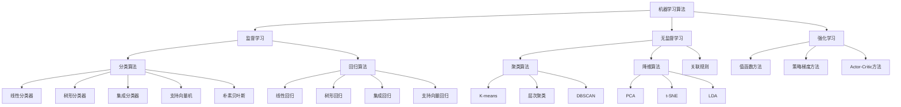
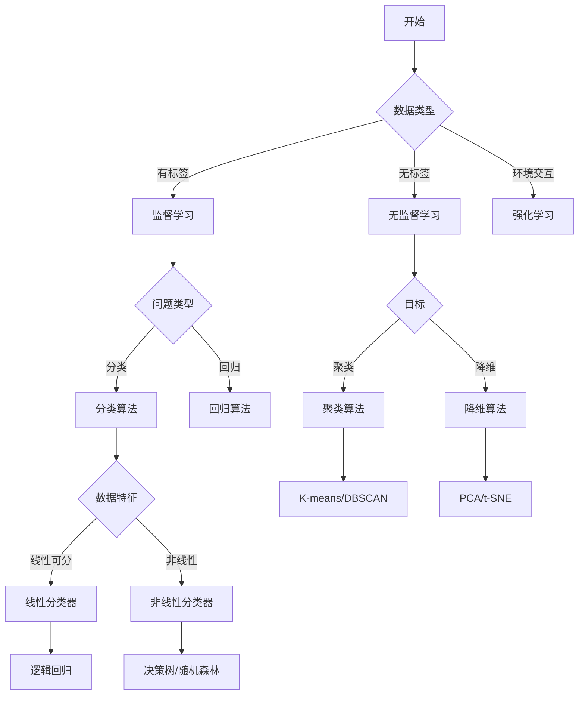

# 机器学习算法对比

## 🔍 算法分类体系

### 1. 算法分类框架

**算法分类图：**


### 2. 算法特性对比

**算法特性矩阵：**

| 算法 | 类型 | 复杂度 | 可解释性 | 训练速度 | 预测速度 | 内存需求 |
|------|------|--------|----------|----------|----------|----------|
| **线性回归** | 回归 | 低 | 高 | 快 | 快 | 低 |
| **逻辑回归** | 分类 | 低 | 高 | 快 | 快 | 低 |
| **决策树** | 分类/回归 | 中 | 高 | 中 | 快 | 中 |
| **随机森林** | 分类/回归 | 高 | 中 | 慢 | 快 | 高 |
| **SVM** | 分类/回归 | 中 | 低 | 慢 | 快 | 中 |
| **朴素贝叶斯** | 分类 | 低 | 高 | 快 | 快 | 低 |
| **K-means** | 聚类 | 低 | 中 | 快 | 快 | 低 |
| **PCA** | 降维 | 中 | 中 | 中 | 快 | 中 |

## 📊 监督学习算法对比

### 1. 分类算法对比

**分类算法性能对比：**
```python
import numpy as np
import matplotlib.pyplot as plt
from sklearn.datasets import make_classification
from sklearn.model_selection import train_test_split, cross_val_score
from sklearn.linear_model import LogisticRegression
from sklearn.tree import DecisionTreeClassifier
from sklearn.ensemble import RandomForestClassifier
from sklearn.svm import SVC
from sklearn.naive_bayes import GaussianNB
from sklearn.neighbors import KNeighborsClassifier

def compare_classification_algorithms():
    """比较分类算法性能"""
    # 生成数据集
    X, y = make_classification(n_samples=1000, n_features=20, n_classes=2, random_state=42)
    X_train, X_test, y_train, y_test = train_test_split(X, y, test_size=0.2, random_state=42)
    
    # 定义算法
    algorithms = {
        'Logistic Regression': LogisticRegression(random_state=42),
        'Decision Tree': DecisionTreeClassifier(random_state=42),
        'Random Forest': RandomForestClassifier(random_state=42),
        'SVM': SVC(random_state=42),
        'Naive Bayes': GaussianNB(),
        'K-NN': KNeighborsClassifier()
    }
    
    # 评估指标
    metrics = ['accuracy', 'precision', 'recall', 'f1']
    results = {}
    
    for name, algorithm in algorithms.items():
        # 交叉验证
        cv_scores = {}
        for metric in metrics:
            scores = cross_val_score(algorithm, X_train, y_train, cv=5, scoring=metric)
            cv_scores[metric] = {
                'mean': scores.mean(),
                'std': scores.std()
            }
        
        # 训练和测试
        algorithm.fit(X_train, y_train)
        train_score = algorithm.score(X_train, y_train)
        test_score = algorithm.score(X_test, y_test)
        
        results[name] = {
            'cv_scores': cv_scores,
            'train_score': train_score,
            'test_score': test_score,
            'overfitting': train_score - test_score
        }
    
    # 可视化结果
    visualize_classification_results(results)
    
    return results

def visualize_classification_results(results):
    """可视化分类算法结果"""
    fig, axes = plt.subplots(2, 2, figsize=(15, 12))
    
    names = list(results.keys())
    
    # 交叉验证准确率
    cv_means = [results[name]['cv_scores']['accuracy']['mean'] for name in names]
    cv_stds = [results[name]['cv_scores']['accuracy']['std'] for name in names]
    
    axes[0, 0].bar(names, cv_means, yerr=cv_stds, capsize=5)
    axes[0, 0].set_title('Cross Validation Accuracy')
    axes[0, 0].set_ylabel('Accuracy')
    axes[0, 0].tick_params(axis='x', rotation=45)
    
    # 训练和测试分数
    train_scores = [results[name]['train_score'] for name in names]
    test_scores = [results[name]['test_score'] for name in names]
    
    x = np.arange(len(names))
    width = 0.35
    
    axes[0, 1].bar(x - width/2, train_scores, width, label='Train')
    axes[0, 1].bar(x + width/2, test_scores, width, label='Test')
    axes[0, 1].set_title('Train vs Test Scores')
    axes[0, 1].set_ylabel('Score')
    axes[0, 1].set_xticks(x)
    axes[0, 1].set_xticklabels(names, rotation=45)
    axes[0, 1].legend()
    
    # 过拟合程度
    overfitting = [results[name]['overfitting'] for name in names]
    axes[1, 0].bar(names, overfitting)
    axes[1, 0].set_title('Overfitting Analysis')
    axes[1, 0].set_ylabel('Overfitting')
    axes[1, 0].tick_params(axis='x', rotation=45)
    
    # F1分数
    f1_means = [results[name]['cv_scores']['f1']['mean'] for name in names]
    f1_stds = [results[name]['cv_scores']['f1']['std'] for name in names]
    
    axes[1, 1].bar(names, f1_means, yerr=f1_stds, capsize=5)
    axes[1, 1].set_title('Cross Validation F1 Score')
    axes[1, 1].set_ylabel('F1 Score')
    axes[1, 1].tick_params(axis='x', rotation=45)
    
    plt.tight_layout()
    plt.show()
```

### 2. 回归算法对比

**回归算法性能对比：**
```python
from sklearn.datasets import make_regression
from sklearn.linear_model import LinearRegression, Ridge, Lasso
from sklearn.tree import DecisionTreeRegressor
from sklearn.ensemble import RandomForestRegressor
from sklearn.svm import SVR
from sklearn.neighbors import KNeighborsRegressor

def compare_regression_algorithms():
    """比较回归算法性能"""
    # 生成数据集
    X, y = make_regression(n_samples=1000, n_features=20, noise=0.1, random_state=42)
    X_train, X_test, y_train, y_test = train_test_split(X, y, test_size=0.2, random_state=42)
    
    # 定义算法
    algorithms = {
        'Linear Regression': LinearRegression(),
        'Ridge Regression': Ridge(alpha=1.0),
        'Lasso Regression': Lasso(alpha=1.0),
        'Decision Tree': DecisionTreeRegressor(random_state=42),
        'Random Forest': RandomForestRegressor(random_state=42),
        'SVR': SVR(),
        'K-NN': KNeighborsRegressor()
    }
    
    # 评估指标
    metrics = ['neg_mean_squared_error', 'neg_mean_absolute_error', 'r2']
    results = {}
    
    for name, algorithm in algorithms.items():
        # 交叉验证
        cv_scores = {}
        for metric in metrics:
            scores = cross_val_score(algorithm, X_train, y_train, cv=5, scoring=metric)
            cv_scores[metric] = {
                'mean': scores.mean(),
                'std': scores.std()
            }
        
        # 训练和测试
        algorithm.fit(X_train, y_train)
        train_score = algorithm.score(X_train, y_train)
        test_score = algorithm.score(X_test, y_test)
        
        results[name] = {
            'cv_scores': cv_scores,
            'train_score': train_score,
            'test_score': test_score,
            'overfitting': train_score - test_score
        }
    
    # 可视化结果
    visualize_regression_results(results)
    
    return results

def visualize_regression_results(results):
    """可视化回归算法结果"""
    fig, axes = plt.subplots(2, 2, figsize=(15, 12))
    
    names = list(results.keys())
    
    # R²分数
    r2_means = [results[name]['cv_scores']['r2']['mean'] for name in names]
    r2_stds = [results[name]['cv_scores']['r2']['std'] for name in names]
    
    axes[0, 0].bar(names, r2_means, yerr=r2_stds, capsize=5)
    axes[0, 0].set_title('Cross Validation R² Score')
    axes[0, 0].set_ylabel('R² Score')
    axes[0, 0].tick_params(axis='x', rotation=45)
    
    # MSE
    mse_means = [-results[name]['cv_scores']['neg_mean_squared_error']['mean'] for name in names]
    mse_stds = [results[name]['cv_scores']['neg_mean_squared_error']['std'] for name in names]
    
    axes[0, 1].bar(names, mse_means, yerr=mse_stds, capsize=5)
    axes[0, 1].set_title('Cross Validation MSE')
    axes[0, 1].set_ylabel('MSE')
    axes[0, 1].tick_params(axis='x', rotation=45)
    
    # 训练和测试分数
    train_scores = [results[name]['train_score'] for name in names]
    test_scores = [results[name]['test_score'] for name in names]
    
    x = np.arange(len(names))
    width = 0.35
    
    axes[1, 0].bar(x - width/2, train_scores, width, label='Train')
    axes[1, 0].bar(x + width/2, test_scores, width, label='Test')
    axes[1, 0].set_title('Train vs Test Scores')
    axes[1, 0].set_ylabel('Score')
    axes[1, 0].set_xticks(x)
    axes[1, 0].set_xticklabels(names, rotation=45)
    axes[1, 0].legend()
    
    # 过拟合程度
    overfitting = [results[name]['overfitting'] for name in names]
    axes[1, 1].bar(names, overfitting)
    axes[1, 1].set_title('Overfitting Analysis')
    axes[1, 1].set_ylabel('Overfitting')
    axes[1, 1].tick_params(axis='x', rotation=45)
    
    plt.tight_layout()
    plt.show()
```

## 🔍 无监督学习算法对比

### 1. 聚类算法对比

**聚类算法性能对比：**
```python
from sklearn.datasets import make_blobs
from sklearn.cluster import KMeans, AgglomerativeClustering, DBSCAN
from sklearn.mixture import GaussianMixture
from sklearn.metrics import silhouette_score, adjusted_rand_score

def compare_clustering_algorithms():
    """比较聚类算法性能"""
    # 生成数据集
    X, y_true = make_blobs(n_samples=1000, centers=4, cluster_std=1.0, random_state=42)
    
    # 定义算法
    algorithms = {
        'K-means': KMeans(n_clusters=4, random_state=42),
        'Hierarchical': AgglomerativeClustering(n_clusters=4),
        'DBSCAN': DBSCAN(eps=0.5, min_samples=5),
        'Gaussian Mixture': GaussianMixture(n_components=4, random_state=42)
    }
    
    results = {}
    
    for name, algorithm in algorithms.items():
        # 训练模型
        if name == 'Gaussian Mixture':
            y_pred = algorithm.fit_predict(X)
        else:
            y_pred = algorithm.fit_predict(X)
        
        # 计算评估指标
        if len(np.unique(y_pred)) > 1:  # 确保有多个簇
            silhouette = silhouette_score(X, y_pred)
            ari = adjusted_rand_score(y_true, y_pred)
        else:
            silhouette = -1
            ari = 0
        
        results[name] = {
            'silhouette_score': silhouette,
            'ari_score': ari,
            'n_clusters': len(np.unique(y_pred)),
            'labels': y_pred
        }
    
    # 可视化结果
    visualize_clustering_results(X, y_true, results)
    
    return results

def visualize_clustering_results(X, y_true, results):
    """可视化聚类算法结果"""
    fig, axes = plt.subplots(2, 3, figsize=(18, 12))
    
    # 真实标签
    axes[0, 0].scatter(X[:, 0], X[:, 1], c=y_true, cmap='viridis', alpha=0.7)
    axes[0, 0].set_title('True Labels')
    axes[0, 0].set_xlabel('Feature 1')
    axes[0, 0].set_ylabel('Feature 2')
    
    # 各算法结果
    for i, (name, result) in enumerate(results.items()):
        row = (i + 1) // 3
        col = (i + 1) % 3
        
        axes[row, col].scatter(X[:, 0], X[:, 1], c=result['labels'], cmap='viridis', alpha=0.7)
        axes[row, col].set_title(f'{name}\nSilhouette: {result["silhouette_score"]:.3f}, ARI: {result["ari_score"]:.3f}')
        axes[row, col].set_xlabel('Feature 1')
        axes[row, col].set_ylabel('Feature 2')
    
    # 隐藏多余的子图
    if len(results) < 5:
        axes[1, 2].axis('off')
    
    plt.tight_layout()
    plt.show()
```

### 2. 降维算法对比

**降维算法性能对比：**
```python
from sklearn.decomposition import PCA, FastICA
from sklearn.manifold import TSNE, Isomap
from sklearn.discriminant_analysis import LinearDiscriminantAnalysis
from sklearn.metrics import pairwise_distances

def compare_dimensionality_reduction_algorithms():
    """比较降维算法性能"""
    # 生成数据集
    X, y = make_classification(n_samples=1000, n_features=50, n_classes=3, random_state=42)
    
    # 定义算法
    algorithms = {
        'PCA': PCA(n_components=2, random_state=42),
        'LDA': LinearDiscriminantAnalysis(n_components=2),
        'ICA': FastICA(n_components=2, random_state=42),
        't-SNE': TSNE(n_components=2, random_state=42),
        'Isomap': Isomap(n_components=2)
    }
    
    results = {}
    
    for name, algorithm in algorithms.items():
        # 降维
        X_reduced = algorithm.fit_transform(X, y) if name == 'LDA' else algorithm.fit_transform(X)
        
        # 计算评估指标
        # 保持距离的能力
        original_distances = pairwise_distances(X)
        reduced_distances = pairwise_distances(X_reduced)
        
        # 计算距离保持度
        distance_preservation = np.corrcoef(original_distances.flatten(), reduced_distances.flatten())[0, 1]
        
        results[name] = {
            'X_reduced': X_reduced,
            'distance_preservation': distance_preservation,
            'explained_variance_ratio': getattr(algorithm, 'explained_variance_ratio_', None)
        }
    
    # 可视化结果
    visualize_dimensionality_reduction_results(X, y, results)
    
    return results

def visualize_dimensionality_reduction_results(X, y, results):
    """可视化降维算法结果"""
    fig, axes = plt.subplots(2, 3, figsize=(18, 12))
    
    # 原始数据（前两个特征）
    axes[0, 0].scatter(X[:, 0], X[:, 1], c=y, cmap='viridis', alpha=0.7)
    axes[0, 0].set_title('Original Data (First 2 Features)')
    axes[0, 0].set_xlabel('Feature 1')
    axes[0, 0].set_ylabel('Feature 2')
    
    # 各算法结果
    for i, (name, result) in enumerate(results.items()):
        row = (i + 1) // 3
        col = (i + 1) % 3
        
        X_reduced = result['X_reduced']
        axes[row, col].scatter(X_reduced[:, 0], X_reduced[:, 1], c=y, cmap='viridis', alpha=0.7)
        axes[row, col].set_title(f'{name}\nDistance Preservation: {result["distance_preservation"]:.3f}')
        axes[row, col].set_xlabel('Component 1')
        axes[row, col].set_ylabel('Component 2')
    
    # 隐藏多余的子图
    if len(results) < 5:
        axes[1, 2].axis('off')
    
    plt.tight_layout()
    plt.show()
```

## ⚡ 算法性能分析

### 1. 时间复杂度分析

**算法时间复杂度对比：**

| 算法 | 训练时间复杂度 | 预测时间复杂度 | 空间复杂度 |
|------|----------------|----------------|------------|
| **线性回归** | O(n×m) | O(m) | O(m) |
| **逻辑回归** | O(n×m×k) | O(m) | O(m) |
| **决策树** | O(n×m×log(n)) | O(log(n)) | O(n) |
| **随机森林** | O(n×m×log(n)×k) | O(log(n)×k) | O(n×k) |
| **SVM** | O(n²×m) | O(m) | O(n) |
| **K-means** | O(n×k×m×i) | O(k×m) | O(k×m) |
| **PCA** | O(n×m²) | O(m²) | O(m²) |

其中：
- n: 样本数量
- m: 特征数量
- k: 迭代次数或树的数量
- i: K-means迭代次数

### 2. 算法适用场景

**算法适用场景分析：**
```python
def algorithm_recommendation_system():
    """算法推荐系统"""
    recommendations = {
        'small_dataset': {
            'description': '小数据集（<1000样本）',
            'algorithms': ['SVM', '朴素贝叶斯', 'K-NN'],
            'reason': '小数据集适合简单算法，避免过拟合'
        },
        'large_dataset': {
            'description': '大数据集（>10000样本）',
            'algorithms': ['随机森林', '梯度提升', '神经网络'],
            'reason': '大数据集可以使用复杂算法'
        },
        'high_dimensional': {
            'description': '高维数据（>1000特征）',
            'algorithms': ['SVM', '随机森林', 'PCA+Lasso'],
            'reason': '高维数据需要降维或正则化'
        },
        'text_classification': {
            'description': '文本分类',
            'algorithms': ['朴素贝叶斯', 'SVM', '逻辑回归'],
            'reason': '文本数据适合线性算法'
        },
        'image_classification': {
            'description': '图像分类',
            'algorithms': ['CNN', '随机森林', 'SVM'],
            'reason': '图像数据需要深度学习或特征提取'
        },
        'time_series': {
            'description': '时间序列',
            'algorithms': ['ARIMA', 'LSTM', 'Prophet'],
            'reason': '时间序列需要考虑时间依赖性'
        },
        'anomaly_detection': {
            'description': '异常检测',
            'algorithms': ['Isolation Forest', 'One-Class SVM', 'DBSCAN'],
            'reason': '异常检测需要无监督或单类学习'
        },
        'recommendation': {
            'description': '推荐系统',
            'algorithms': ['协同过滤', '矩阵分解', '深度学习'],
            'reason': '推荐系统需要处理稀疏矩阵'
        }
    }
    
    return recommendations
```

## 📊 算法选择指南

### 1. 算法选择流程图

**算法选择流程：**


### 2. 算法选择决策树

**决策树选择：**
```python
def algorithm_selection_decision_tree():
    """算法选择决策树"""
    decision_tree = {
        'root': {
            'question': '数据是否有标签？',
            'yes': 'supervised',
            'no': 'unsupervised'
        },
        'supervised': {
            'question': '问题类型是什么？',
            'classification': 'classification_algorithms',
            'regression': 'regression_algorithms'
        },
        'classification_algorithms': {
            'question': '数据特征是什么？',
            'linear': ['逻辑回归', 'SVM'],
            'nonlinear': ['决策树', '随机森林', '神经网络'],
            'text': ['朴素贝叶斯', 'SVM'],
            'image': ['CNN', '随机森林']
        },
        'regression_algorithms': {
            'question': '数据特征是什么？',
            'linear': ['线性回归', 'Ridge', 'Lasso'],
            'nonlinear': ['决策树', '随机森林', '神经网络'],
            'time_series': ['ARIMA', 'LSTM']
        },
        'unsupervised': {
            'question': '目标是什么？',
            'clustering': ['K-means', 'DBSCAN', '层次聚类'],
            'dimensionality_reduction': ['PCA', 't-SNE', 'LDA'],
            'anomaly_detection': ['Isolation Forest', 'One-Class SVM']
        }
    }
    
    return decision_tree
```

## 🔗 相关链接
- [[02-01-01-监督学习原理]] - 监督学习
- [[02-01-02-无监督学习原理]] - 无监督学习
- [[02-01-03-强化学习基础]] - 强化学习
- [[02-01-04-模型评估方法]] - 模型评估

## 💡 算法选择建议

**选择原则：**
- 🎯 **问题导向**：根据具体问题选择算法
- 📊 **数据特征**：考虑数据的特征和规模
- ⚡ **性能要求**：考虑训练和预测的性能要求
- 🔍 **可解释性**：考虑模型的可解释性需求

**实践建议：**
- 🔄 **多算法尝试**：尝试多种算法进行比较
- 📊 **交叉验证**：使用交叉验证评估算法性能
- 🎯 **业务理解**：结合业务需求选择算法
- 📈 **持续优化**：根据结果持续优化算法选择

---
*📝 学习提示：算法选择是机器学习的重要环节，建议掌握各种算法的特点和适用场景，根据实际情况选择最合适的算法*


