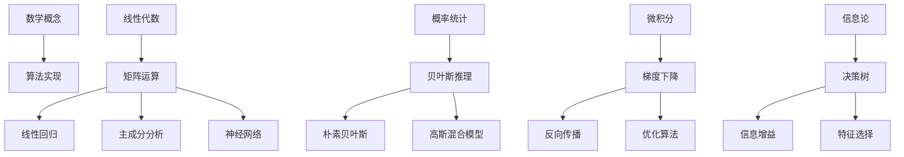

# 从数学到算法

## 🧮 数学基础到算法实现

### 1. 数学概念到算法映射

**数学-算法映射关系：**


### 2. 核心数学概念

**线性代数应用：**
```python
import numpy as np
import matplotlib.pyplot as plt

class LinearAlgebraToAlgorithms:
    """线性代数到算法的转换"""
    
    def matrix_multiplication_to_linear_regression(self):
        """矩阵乘法到线性回归"""
        # 数学形式：y = Xw + b
        # 矩阵形式：Y = XW + B
        
        # 生成数据
        np.random.seed(42)
        X = np.random.randn(100, 2)
        w_true = np.array([2.5, -1.3])
        b_true = 1.0
        y = X @ w_true + b_true + 0.1 * np.random.randn(100)
        
        # 添加偏置项
        X_with_bias = np.c_[X, np.ones(X.shape[0])]
        w_with_bias = np.append(w_true, b_true)
        
        # 最小二乘解：w = (X^T X)^(-1) X^T y
        w_estimated = np.linalg.inv(X_with_bias.T @ X_with_bias) @ X_with_bias.T @ y
        
        print(f"真实参数: {w_with_bias}")
        print(f"估计参数: {w_estimated}")
        
        return w_estimated
    
    def eigenvalue_decomposition_to_pca(self):
        """特征值分解到主成分分析"""
        # 生成数据
        np.random.seed(42)
        X = np.random.randn(100, 3)
        
        # 中心化数据
        X_centered = X - np.mean(X, axis=0)
        
        # 计算协方差矩阵
        cov_matrix = np.cov(X_centered.T)
        
        # 特征值分解
        eigenvalues, eigenvectors = np.linalg.eigh(cov_matrix)
        
        # 按特征值降序排列
        idx = np.argsort(eigenvalues)[::-1]
        eigenvalues = eigenvalues[idx]
        eigenvectors = eigenvectors[:, idx]
        
        # 选择前两个主成分
        principal_components = eigenvectors[:, :2]
        
        # 投影到主成分空间
        X_pca = X_centered @ principal_components
        
        # 可视化
        fig, axes = plt.subplots(1, 2, figsize=(12, 5))
        
        # 原始数据
        axes[0].scatter(X[:, 0], X[:, 1], alpha=0.7)
        axes[0].set_title('Original Data')
        axes[0].set_xlabel('Feature 1')
        axes[0].set_ylabel('Feature 2')
        
        # PCA结果
        axes[1].scatter(X_pca[:, 0], X_pca[:, 1], alpha=0.7)
        axes[1].set_title('PCA Result')
        axes[1].set_xlabel('PC1')
        axes[1].set_ylabel('PC2')
        
        plt.tight_layout()
        plt.show()
        
        return X_pca, eigenvalues, eigenvectors
```

**概率统计应用：**
```python
class ProbabilityToAlgorithms:
    """概率统计到算法的转换"""
    
    def bayes_theorem_to_naive_bayes(self):
        """贝叶斯定理到朴素贝叶斯"""
        # 贝叶斯定理：P(A|B) = P(B|A) * P(A) / P(B)
        # 朴素贝叶斯：P(class|features) = P(features|class) * P(class) / P(features)
        
        # 生成示例数据
        np.random.seed(42)
        n_samples = 1000
        
        # 两个类别的数据
        class_0 = np.random.normal(0, 1, (n_samples//2, 2))
        class_1 = np.random.normal(2, 1, (n_samples//2, 2))
        
        X = np.vstack([class_0, class_1])
        y = np.hstack([np.zeros(n_samples//2), np.ones(n_samples//2)])
        
        # 朴素贝叶斯实现
        class NaiveBayes:
            def __init__(self):
                self.priors = {}
                self.likelihoods = {}
            
            def fit(self, X, y):
                """训练朴素贝叶斯模型"""
                classes = np.unique(y)
                
                for c in classes:
                    # 计算先验概率
                    self.priors[c] = np.sum(y == c) / len(y)
                    
                    # 计算似然概率（假设高斯分布）
                    X_c = X[y == c]
                    self.likelihoods[c] = {
                        'mean': np.mean(X_c, axis=0),
                        'std': np.std(X_c, axis=0)
                    }
            
            def predict(self, X):
                """预测"""
                predictions = []
                
                for x in X:
                    posteriors = {}
                    
                    for c in self.priors.keys():
                        # 计算后验概率
                        prior = self.priors[c]
                        likelihood = 1.0
                        
                        for i, feature in enumerate(x):
                            mean = self.likelihoods[c]['mean'][i]
                            std = self.likelihoods[c]['std'][i]
                            likelihood *= self._gaussian_pdf(feature, mean, std)
                        
                        posteriors[c] = prior * likelihood
                    
                    # 选择最大后验概率的类别
                    predictions.append(max(posteriors, key=posteriors.get))
                
                return np.array(predictions)
            
            def _gaussian_pdf(self, x, mean, std):
                """高斯概率密度函数"""
                return (1 / (std * np.sqrt(2 * np.pi))) * np.exp(-0.5 * ((x - mean) / std) ** 2)
        
        # 训练和测试
        model = NaiveBayes()
        model.fit(X, y)
        predictions = model.predict(X)
        
        accuracy = np.mean(predictions == y)
        print(f"朴素贝叶斯准确率: {accuracy:.3f}")
        
        return model, predictions
    
    def maximum_likelihood_to_linear_regression(self):
        """最大似然估计到线性回归"""
        # 最大似然估计：找到使似然函数最大的参数
        # 线性回归：假设 y = Xw + ε，其中 ε ~ N(0, σ²)
        
        # 生成数据
        np.random.seed(42)
        X = np.random.randn(100, 1)
        w_true = 2.5
        b_true = 1.0
        y = w_true * X.flatten() + b_true + 0.1 * np.random.randn(100)
        
        # 最大似然估计等价于最小二乘
        X_with_bias = np.c_[X, np.ones(X.shape[0])]
        w_ml = np.linalg.inv(X_with_bias.T @ X_with_bias) @ X_with_bias.T @ y
        
        # 可视化
        plt.figure(figsize=(10, 6))
        plt.scatter(X, y, alpha=0.7, label='Data')
        
        X_plot = np.linspace(X.min(), X.max(), 100).reshape(-1, 1)
        X_plot_with_bias = np.c_[X_plot, np.ones(X_plot.shape[0])]
        y_plot = X_plot_with_bias @ w_ml
        
        plt.plot(X_plot, y_plot, 'r-', label=f'ML Estimate: y = {w_ml[0]:.3f}x + {w_ml[1]:.3f}')
        plt.xlabel('X')
        plt.ylabel('y')
        plt.title('Maximum Likelihood Estimation')
        plt.legend()
        plt.grid(True)
        plt.show()
        
        return w_ml
```

**微积分应用：**
```python
class CalculusToAlgorithms:
    """微积分到算法的转换"""
    
    def gradient_descent_implementation(self):
        """梯度下降实现"""
        # 梯度下降：w = w - α * ∇J(w)
        # 其中 ∇J(w) 是损失函数对参数的梯度
        
        # 定义损失函数：J(w) = (1/2m) * Σ(y_pred - y_true)²
        def loss_function(w, X, y):
            """均方误差损失函数"""
            m = len(y)
            y_pred = X @ w
            return (1 / (2 * m)) * np.sum((y_pred - y) ** 2)
        
        def gradient(w, X, y):
            """损失函数的梯度"""
            m = len(y)
            y_pred = X @ w
            return (1 / m) * X.T @ (y_pred - y)
        
        # 生成数据
        np.random.seed(42)
        X = np.random.randn(100, 2)
        w_true = np.array([2.5, -1.3])
        y = X @ w_true + 0.1 * np.random.randn(100)
        
        # 添加偏置项
        X_with_bias = np.c_[X, np.ones(X.shape[0])]
        w_init = np.random.randn(3)
        
        # 梯度下降
        learning_rate = 0.01
        n_iterations = 1000
        w = w_init.copy()
        losses = []
        
        for i in range(n_iterations):
            # 计算损失
            loss = loss_function(w, X_with_bias, y)
            losses.append(loss)
            
            # 计算梯度
            grad = gradient(w, X_with_bias, y)
            
            # 更新参数
            w = w - learning_rate * grad
            
            # 早停条件
            if i > 0 and abs(losses[-1] - losses[-2]) < 1e-6:
                break
        
        # 可视化
        fig, axes = plt.subplots(1, 2, figsize=(15, 5))
        
        # 损失函数
        axes[0].plot(losses)
        axes[0].set_xlabel('Iteration')
        axes[0].set_ylabel('Loss')
        axes[0].set_title('Gradient Descent Convergence')
        axes[0].grid(True)
        
        # 参数收敛
        axes[1].plot(w)
        axes[1].set_xlabel('Parameter Index')
        axes[1].set_ylabel('Parameter Value')
        axes[1].set_title('Parameter Convergence')
        axes[1].grid(True)
        
        plt.tight_layout()
        plt.show()
        
        print(f"真实参数: {np.append(w_true, 0)}")
        print(f"估计参数: {w}")
        
        return w, losses
    
    def chain_rule_to_backpropagation(self):
        """链式法则到反向传播"""
        # 链式法则：∂f/∂x = (∂f/∂y) * (∂y/∂x)
        # 反向传播：从输出层向输入层传播梯度
        
        class SimpleNeuralNetwork:
            def __init__(self, input_size, hidden_size, output_size):
                # 初始化权重
                self.W1 = np.random.randn(input_size, hidden_size) * 0.1
                self.b1 = np.zeros(hidden_size)
                self.W2 = np.random.randn(hidden_size, output_size) * 0.1
                self.b2 = np.zeros(output_size)
            
            def sigmoid(self, x):
                """Sigmoid激活函数"""
                return 1 / (1 + np.exp(-np.clip(x, -250, 250)))
            
            def sigmoid_derivative(self, x):
                """Sigmoid导数"""
                s = self.sigmoid(x)
                return s * (1 - s)
            
            def forward(self, X):
                """前向传播"""
                self.z1 = X @ self.W1 + self.b1
                self.a1 = self.sigmoid(self.z1)
                self.z2 = self.a1 @ self.W2 + self.b2
                self.a2 = self.sigmoid(self.z2)
                return self.a2
            
            def backward(self, X, y, output):
                """反向传播"""
                m = X.shape[0]
                
                # 输出层梯度
                dz2 = output - y
                dW2 = (1 / m) * self.a1.T @ dz2
                db2 = (1 / m) * np.sum(dz2, axis=0)
                
                # 隐藏层梯度
                da1 = dz2 @ self.W2.T
                dz1 = da1 * self.sigmoid_derivative(self.z1)
                dW1 = (1 / m) * X.T @ dz1
                db1 = (1 / m) * np.sum(dz1, axis=0)
                
                return dW1, db1, dW2, db2
            
            def train(self, X, y, epochs=1000, learning_rate=0.1):
                """训练神经网络"""
                losses = []
                
                for epoch in range(epochs):
                    # 前向传播
                    output = self.forward(X)
                    
                    # 计算损失
                    loss = np.mean((output - y) ** 2)
                    losses.append(loss)
                    
                    # 反向传播
                    dW1, db1, dW2, db2 = self.backward(X, y, output)
                    
                    # 更新权重
                    self.W1 -= learning_rate * dW1
                    self.b1 -= learning_rate * db1
                    self.W2 -= learning_rate * dW2
                    self.b2 -= learning_rate * db2
                    
                    if epoch % 100 == 0:
                        print(f"Epoch {epoch}, Loss: {loss:.4f}")
                
                return losses
        
        # 生成数据
        np.random.seed(42)
        X = np.random.randn(100, 2)
        y = (X[:, 0] + X[:, 1] > 0).astype(int).reshape(-1, 1)
        
        # 创建和训练网络
        nn = SimpleNeuralNetwork(input_size=2, hidden_size=4, output_size=1)
        losses = nn.train(X, y, epochs=1000, learning_rate=0.1)
        
        # 可视化
        plt.figure(figsize=(10, 6))
        plt.plot(losses)
        plt.xlabel('Epoch')
        plt.ylabel('Loss')
        plt.title('Neural Network Training')
        plt.grid(True)
        plt.show()
        
        return nn, losses
```

**信息论应用：**
```python
class InformationTheoryToAlgorithms:
    """信息论到算法的转换"""
    
    def entropy_to_decision_tree(self):
        """熵到决策树"""
        # 信息熵：H(X) = -Σ P(x) log P(x)
        # 信息增益：IG = H(S) - Σ (|Sv|/|S|) * H(Sv)
        
        def entropy(y):
            """计算熵"""
            if len(y) == 0:
                return 0
            counts = np.bincount(y)
            probabilities = counts / len(y)
            return -np.sum(probabilities * np.log2(probabilities + 1e-10))
        
        def information_gain(X, y, feature_idx, threshold):
            """计算信息增益"""
            # 分割数据
            left_mask = X[:, feature_idx] <= threshold
            right_mask = ~left_mask
            
            if np.sum(left_mask) == 0 or np.sum(right_mask) == 0:
                return 0
            
            # 计算信息增益
            parent_entropy = entropy(y)
            left_entropy = entropy(y[left_mask])
            right_entropy = entropy(y[right_mask])
            
            left_weight = np.sum(left_mask) / len(y)
            right_weight = np.sum(right_mask) / len(y)
            
            child_entropy = left_weight * left_entropy + right_weight * right_entropy
            return parent_entropy - child_entropy
        
        def find_best_split(X, y):
            """找到最佳分割点"""
            best_gain = 0
            best_feature = None
            best_threshold = None
            
            for feature_idx in range(X.shape[1]):
                thresholds = np.unique(X[:, feature_idx])
                for threshold in thresholds:
                    gain = information_gain(X, y, feature_idx, threshold)
                    if gain > best_gain:
                        best_gain = gain
                        best_feature = feature_idx
                        best_threshold = threshold
            
            return best_feature, best_threshold, best_gain
        
        # 生成数据
        np.random.seed(42)
        X = np.random.randn(100, 2)
        y = (X[:, 0] + X[:, 1] > 0).astype(int)
        
        # 找到最佳分割
        best_feature, best_threshold, best_gain = find_best_split(X, y)
        
        print(f"最佳特征: {best_feature}")
        print(f"最佳阈值: {best_threshold:.3f}")
        print(f"信息增益: {best_gain:.3f}")
        
        # 可视化分割结果
        plt.figure(figsize=(10, 6))
        colors = ['red' if label == 0 else 'blue' for label in y]
        plt.scatter(X[:, 0], X[:, 1], c=colors, alpha=0.7)
        
        if best_feature == 0:
            plt.axvline(x=best_threshold, color='green', linestyle='--', linewidth=2)
        else:
            plt.axhline(y=best_threshold, color='green', linestyle='--', linewidth=2)
        
        plt.xlabel('Feature 0')
        plt.ylabel('Feature 1')
        plt.title('Decision Tree Split')
        plt.show()
        
        return best_feature, best_threshold, best_gain
    
    def mutual_information_to_feature_selection(self):
        """互信息到特征选择"""
        # 互信息：I(X;Y) = H(X) - H(X|Y)
        # 特征选择：选择与目标变量互信息最大的特征
        
        def mutual_information(X, y):
            """计算互信息"""
            n = len(y)
            mi_scores = []
            
            for i in range(X.shape[1]):
                # 离散化连续特征
                X_discrete = np.digitize(X[:, i], bins=np.linspace(X[:, i].min(), X[:, i].max(), 10))
                
                # 计算互信息
                mi = 0
                for x_val in np.unique(X_discrete):
                    for y_val in np.unique(y):
                        # 联合概率
                        p_xy = np.sum((X_discrete == x_val) & (y == y_val)) / n
                        # 边际概率
                        p_x = np.sum(X_discrete == x_val) / n
                        p_y = np.sum(y == y_val) / n
                        
                        if p_xy > 0:
                            mi += p_xy * np.log2(p_xy / (p_x * p_y))
                
                mi_scores.append(mi)
            
            return np.array(mi_scores)
        
        # 生成数据
        np.random.seed(42)
        X = np.random.randn(100, 5)
        y = (X[:, 0] + X[:, 1] > 0).astype(int)
        
        # 计算互信息
        mi_scores = mutual_information(X, y)
        
        # 可视化
        plt.figure(figsize=(10, 6))
        plt.bar(range(len(mi_scores)), mi_scores)
        plt.xlabel('Feature Index')
        plt.ylabel('Mutual Information')
        plt.title('Feature Selection by Mutual Information')
        plt.grid(True)
        plt.show()
        
        # 选择前k个特征
        k = 3
        top_features = np.argsort(mi_scores)[-k:]
        print(f"选择的特征: {top_features}")
        print(f"互信息分数: {mi_scores[top_features]}")
        
        return top_features, mi_scores
```

## 🔗 相关链接
- [[01-02-01-线性代数基础]] - 线性代数
- [[01-02-02-概率论与统计学]] - 概率统计
- [[01-02-03-微积分基础]] - 微积分
- [[01-02-04-信息论基础]] - 信息论

## 💡 数学到算法转换建议

**学习策略：**
- 🧮 **理解数学原理**：深入理解数学概念的本质
- 🔄 **建立映射关系**：建立数学概念到算法的映射
- 💻 **动手实现**：通过编程实现加深理解
- 📊 **可视化分析**：通过可视化理解算法过程

**实践建议：**
- 📝 **推导过程**：推导算法的数学原理
- 🔍 **代码实现**：从零开始实现算法
- 📊 **结果分析**：分析算法的数学性质
- 🎯 **应用场景**：理解算法的适用场景

---
*📝 学习提示：数学是算法的基础，建议深入理解数学原理，建立数学概念到算法的映射关系*

