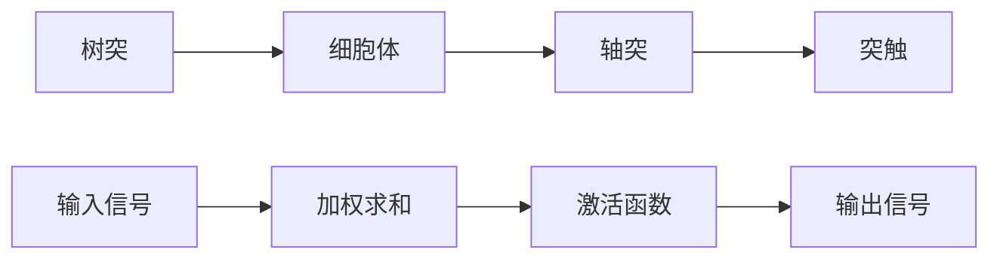
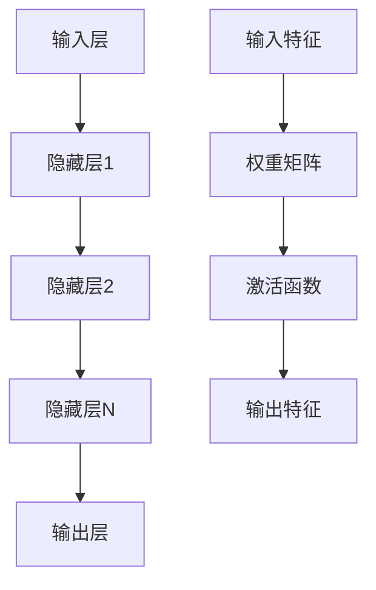
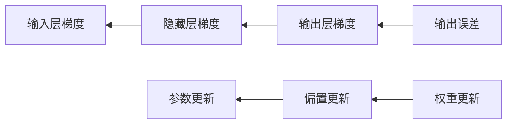

# 神经网络原理

## 🧠 神经网络基础

### 1. 神经元模型

**生物神经元模型：**


**人工神经元模型：**
```python
import numpy as np
import matplotlib.pyplot as plt

class ArtificialNeuron:
    """人工神经元模型"""
    
    def __init__(self, n_inputs, activation='sigmoid'):
        self.n_inputs = n_inputs
        self.weights = np.random.randn(n_inputs) * 0.1
        self.bias = np.random.randn() * 0.1
        self.activation = activation
        self.output = 0
        self.delta = 0
    
    def forward(self, inputs):
        """前向传播"""
        # 加权求和
        self.net_input = np.dot(inputs, self.weights) + self.bias
        
        # 激活函数
        if self.activation == 'sigmoid':
            self.output = self._sigmoid(self.net_input)
        elif self.activation == 'relu':
            self.output = self._relu(self.net_input)
        elif self.activation == 'tanh':
            self.output = self._tanh(self.net_input)
        else:
            self.output = self.net_input  # 线性激活
        
        return self.output
    
    def _sigmoid(self, x):
        """Sigmoid激活函数"""
        return 1 / (1 + np.exp(-np.clip(x, -250, 250)))
    
    def _relu(self, x):
        """ReLU激活函数"""
        return np.maximum(0, x)
    
    def _tanh(self, x):
        """Tanh激活函数"""
        return np.tanh(x)
    
    def backward(self, error, learning_rate=0.01):
        """反向传播"""
        # 计算激活函数的导数
        if self.activation == 'sigmoid':
            activation_derivative = self.output * (1 - self.output)
        elif self.activation == 'relu':
            activation_derivative = 1 if self.net_input > 0 else 0
        elif self.activation == 'tanh':
            activation_derivative = 1 - self.output ** 2
        else:
            activation_derivative = 1
        
        # 计算误差
        self.delta = error * activation_derivative
        
        # 更新权重和偏置
        self.weights += learning_rate * self.delta * self.last_inputs
        self.bias += learning_rate * self.delta
        
        return self.delta * self.weights

# 神经元可视化
def visualize_neuron():
    """可视化神经元"""
    neuron = ArtificialNeuron(2, 'sigmoid')
    
    # 生成测试数据
    x1 = np.linspace(-5, 5, 100)
    x2 = np.linspace(-5, 5, 100)
    X1, X2 = np.meshgrid(x1, x2)
    
    # 计算输出
    outputs = np.zeros_like(X1)
    for i in range(X1.shape[0]):
        for j in range(X1.shape[1]):
            inputs = np.array([X1[i, j], X2[i, j]])
            outputs[i, j] = neuron.forward(inputs)
    
    # 可视化
    plt.figure(figsize=(12, 5))
    
    # 3D表面图
    ax1 = plt.subplot(1, 2, 1, projection='3d')
    ax1.plot_surface(X1, X2, outputs, cmap='viridis')
    ax1.set_xlabel('Input 1')
    ax1.set_ylabel('Input 2')
    ax1.set_zlabel('Output')
    ax1.set_title('Neuron Output Surface')
    
    # 激活函数
    ax2 = plt.subplot(1, 2, 2)
    x = np.linspace(-5, 5, 100)
    y_sigmoid = 1 / (1 + np.exp(-x))
    y_relu = np.maximum(0, x)
    y_tanh = np.tanh(x)
    
    ax2.plot(x, y_sigmoid, label='Sigmoid')
    ax2.plot(x, y_relu, label='ReLU')
    ax2.plot(x, y_tanh, label='Tanh')
    ax2.set_xlabel('Input')
    ax2.set_ylabel('Output')
    ax2.set_title('Activation Functions')
    ax2.legend()
    ax2.grid(True)
    
    plt.tight_layout()
    plt.show()

visualize_neuron()
```

### 2. 神经网络架构

**网络结构：**


**多层感知机实现：**
```python
class MultiLayerPerceptron:
    """多层感知机"""
    
    def __init__(self, layers, activation='sigmoid', learning_rate=0.01):
        self.layers = layers
        self.activation = activation
        self.learning_rate = learning_rate
        
        # 初始化权重和偏置
        self.weights = []
        self.biases = []
        
        for i in range(len(layers) - 1):
            # Xavier初始化
            w = np.random.randn(layers[i], layers[i+1]) * np.sqrt(2.0 / layers[i])
            b = np.zeros(layers[i+1])
            self.weights.append(w)
            self.biases.append(b)
        
        # 存储前向传播的中间结果
        self.activations = []
        self.net_inputs = []
    
    def forward(self, X):
        """前向传播"""
        self.activations = [X]
        self.net_inputs = []
        
        for i in range(len(self.weights)):
            # 计算净输入
            net_input = np.dot(self.activations[-1], self.weights[i]) + self.biases[i]
            self.net_inputs.append(net_input)
            
            # 应用激活函数
            if i == len(self.weights) - 1:  # 输出层
                activation = self._softmax(net_input)
            else:  # 隐藏层
                activation = self._apply_activation(net_input)
            
            self.activations.append(activation)
        
        return self.activations[-1]
    
    def backward(self, y_true, y_pred):
        """反向传播"""
        m = y_true.shape[0]
        
        # 计算输出层误差
        error = y_pred - y_true
        
        # 反向传播误差
        for i in range(len(self.weights) - 1, -1, -1):
            # 计算权重和偏置的梯度
            dW = np.dot(self.activations[i].T, error) / m
            db = np.sum(error, axis=0) / m
            
            # 更新权重和偏置
            self.weights[i] -= self.learning_rate * dW
            self.biases[i] -= self.learning_rate * db
            
            # 计算前一层的误差
            if i > 0:
                error = np.dot(error, self.weights[i].T)
                error *= self._activation_derivative(self.net_inputs[i-1])
    
    def _apply_activation(self, x):
        """应用激活函数"""
        if self.activation == 'sigmoid':
            return 1 / (1 + np.exp(-np.clip(x, -250, 250)))
        elif self.activation == 'relu':
            return np.maximum(0, x)
        elif self.activation == 'tanh':
            return np.tanh(x)
        else:
            return x
    
    def _activation_derivative(self, x):
        """激活函数导数"""
        if self.activation == 'sigmoid':
            s = 1 / (1 + np.exp(-np.clip(x, -250, 250)))
            return s * (1 - s)
        elif self.activation == 'relu':
            return (x > 0).astype(float)
        elif self.activation == 'tanh':
            return 1 - np.tanh(x) ** 2
        else:
            return np.ones_like(x)
    
    def _softmax(self, x):
        """Softmax激活函数"""
        exp_x = np.exp(x - np.max(x, axis=1, keepdims=True))
        return exp_x / np.sum(exp_x, axis=1, keepdims=True)
    
    def train(self, X, y, epochs=1000, batch_size=32):
        """训练网络"""
        losses = []
        
        for epoch in range(epochs):
            # 随机打乱数据
            indices = np.random.permutation(len(X))
            X_shuffled = X[indices]
            y_shuffled = y[indices]
            
            epoch_loss = 0
            
            # 批量训练
            for i in range(0, len(X), batch_size):
                X_batch = X_shuffled[i:i+batch_size]
                y_batch = y_shuffled[i:i+batch_size]
                
                # 前向传播
                y_pred = self.forward(X_batch)
                
                # 计算损失
                loss = self._cross_entropy_loss(y_batch, y_pred)
                epoch_loss += loss
                
                # 反向传播
                self.backward(y_batch, y_pred)
            
            losses.append(epoch_loss / (len(X) // batch_size))
            
            if epoch % 100 == 0:
                print(f"Epoch {epoch}, Loss: {losses[-1]:.4f}")
        
        return losses
    
    def _cross_entropy_loss(self, y_true, y_pred):
        """交叉熵损失"""
        return -np.mean(np.sum(y_true * np.log(y_pred + 1e-15), axis=1))
    
    def predict(self, X):
        """预测"""
        y_pred = self.forward(X)
        return np.argmax(y_pred, axis=1)

# 测试多层感知机
def test_mlp():
    """测试多层感知机"""
    # 生成数据
    np.random.seed(42)
    X = np.random.randn(1000, 2)
    y = (X[:, 0] + X[:, 1] > 0).astype(int)
    
    # 转换为one-hot编码
    y_onehot = np.zeros((len(y), 2))
    y_onehot[np.arange(len(y)), y] = 1
    
    # 创建网络
    mlp = MultiLayerPerceptron([2, 4, 2], activation='sigmoid', learning_rate=0.1)
    
    # 训练网络
    losses = mlp.train(X, y_onehot, epochs=1000, batch_size=32)
    
    # 可视化训练过程
    plt.figure(figsize=(10, 6))
    plt.plot(losses)
    plt.xlabel('Epoch')
    plt.ylabel('Loss')
    plt.title('MLP Training Loss')
    plt.grid(True)
    plt.show()
    
    # 测试预测
    predictions = mlp.predict(X)
    accuracy = np.mean(predictions == y)
    print(f"Accuracy: {accuracy:.3f}")
    
    return mlp, losses

test_mlp()
```

## 🔄 前向传播

### 1. 前向传播原理

**前向传播过程：**


**前向传播实现：**
```python
class ForwardPropagation:
    """前向传播实现"""
    
    def __init__(self, layers, activation='sigmoid'):
        self.layers = layers
        self.activation = activation
        self.weights = []
        self.biases = []
        
        # 初始化权重和偏置
        for i in range(len(layers) - 1):
            w = np.random.randn(layers[i], layers[i+1]) * 0.1
            b = np.zeros(layers[i+1])
            self.weights.append(w)
            self.biases.append(b)
    
    def forward(self, X):
        """前向传播"""
        activations = [X]
        
        for i in range(len(self.weights)):
            # 计算净输入
            z = np.dot(activations[-1], self.weights[i]) + self.biases[i]
            
            # 应用激活函数
            if i == len(self.weights) - 1:  # 输出层
                a = self._softmax(z)
            else:  # 隐藏层
                a = self._apply_activation(z)
            
            activations.append(a)
        
        return activations
    
    def _apply_activation(self, z):
        """应用激活函数"""
        if self.activation == 'sigmoid':
            return 1 / (1 + np.exp(-np.clip(z, -250, 250)))
        elif self.activation == 'relu':
            return np.maximum(0, z)
        elif self.activation == 'tanh':
            return np.tanh(z)
        else:
            return z
    
    def _softmax(self, z):
        """Softmax激活函数"""
        exp_z = np.exp(z - np.max(z, axis=1, keepdims=True))
        return exp_z / np.sum(exp_z, axis=1, keepdims=True)
    
    def visualize_forward_propagation(self, X):
        """可视化前向传播过程"""
        activations = self.forward(X)
        
        fig, axes = plt.subplots(1, len(activations), figsize=(15, 5))
        
        for i, activation in enumerate(activations):
            if activation.shape[1] <= 2:
                # 2D可视化
                axes[i].scatter(activation[:, 0], activation[:, 1], alpha=0.7)
                axes[i].set_title(f'Layer {i}')
                axes[i].set_xlabel('Feature 1')
                axes[i].set_ylabel('Feature 2')
            else:
                # 高维数据可视化（使用PCA降维）
                from sklearn.decomposition import PCA
                pca = PCA(n_components=2)
                activation_2d = pca.fit_transform(activation)
                axes[i].scatter(activation_2d[:, 0], activation_2d[:, 1], alpha=0.7)
                axes[i].set_title(f'Layer {i} (PCA)')
                axes[i].set_xlabel('PC1')
                axes[i].set_ylabel('PC2')
        
        plt.tight_layout()
        plt.show()
        
        return activations

# 测试前向传播
def test_forward_propagation():
    """测试前向传播"""
    # 生成数据
    np.random.seed(42)
    X = np.random.randn(100, 2)
    
    # 创建网络
    fp = ForwardPropagation([2, 4, 3, 2], activation='sigmoid')
    
    # 可视化前向传播
    activations = fp.visualize_forward_propagation(X)
    
    return fp, activations

test_forward_propagation()
```

## 🔙 反向传播

### 1. 反向传播原理

**反向传播过程：**


**反向传播实现：**
```python
class BackwardPropagation:
    """反向传播实现"""
    
    def __init__(self, layers, activation='sigmoid', learning_rate=0.01):
        self.layers = layers
        self.activation = activation
        self.learning_rate = learning_rate
        
        # 初始化权重和偏置
        self.weights = []
        self.biases = []
        
        for i in range(len(layers) - 1):
            w = np.random.randn(layers[i], layers[i+1]) * 0.1
            b = np.zeros(layers[i+1])
            self.weights.append(w)
            self.biases.append(b)
    
    def forward(self, X):
        """前向传播"""
        self.activations = [X]
        self.net_inputs = []
        
        for i in range(len(self.weights)):
            z = np.dot(self.activations[-1], self.weights[i]) + self.biases[i]
            self.net_inputs.append(z)
            
            if i == len(self.weights) - 1:  # 输出层
                a = self._softmax(z)
            else:  # 隐藏层
                a = self._apply_activation(z)
            
            self.activations.append(a)
        
        return self.activations[-1]
    
    def backward(self, y_true, y_pred):
        """反向传播"""
        m = y_true.shape[0]
        
        # 计算输出层误差
        error = y_pred - y_true
        
        # 存储梯度
        dW = []
        db = []
        
        # 反向传播
        for i in range(len(self.weights) - 1, -1, -1):
            # 计算权重和偏置的梯度
            dW_i = np.dot(self.activations[i].T, error) / m
            db_i = np.sum(error, axis=0) / m
            
            dW.insert(0, dW_i)
            db.insert(0, db_i)
            
            # 计算前一层的误差
            if i > 0:
                error = np.dot(error, self.weights[i].T)
                error *= self._activation_derivative(self.net_inputs[i-1])
        
        return dW, db
    
    def update_parameters(self, dW, db):
        """更新参数"""
        for i in range(len(self.weights)):
            self.weights[i] -= self.learning_rate * dW[i]
            self.biases[i] -= self.learning_rate * db[i]
    
    def _apply_activation(self, z):
        """应用激活函数"""
        if self.activation == 'sigmoid':
            return 1 / (1 + np.exp(-np.clip(z, -250, 250)))
        elif self.activation == 'relu':
            return np.maximum(0, z)
        elif self.activation == 'tanh':
            return np.tanh(z)
        else:
            return z
    
    def _activation_derivative(self, z):
        """激活函数导数"""
        if self.activation == 'sigmoid':
            s = 1 / (1 + np.exp(-np.clip(z, -250, 250)))
            return s * (1 - s)
        elif self.activation == 'relu':
            return (z > 0).astype(float)
        elif self.activation == 'tanh':
            return 1 - np.tanh(z) ** 2
        else:
            return np.ones_like(z)
    
    def _softmax(self, z):
        """Softmax激活函数"""
        exp_z = np.exp(z - np.max(z, axis=1, keepdims=True))
        return exp_z / np.sum(exp_z, axis=1, keepdims=True)
    
    def train(self, X, y, epochs=1000, batch_size=32):
        """训练网络"""
        losses = []
        
        for epoch in range(epochs):
            # 随机打乱数据
            indices = np.random.permutation(len(X))
            X_shuffled = X[indices]
            y_shuffled = y[indices]
            
            epoch_loss = 0
            
            # 批量训练
            for i in range(0, len(X), batch_size):
                X_batch = X_shuffled[i:i+batch_size]
                y_batch = y_shuffled[i:i+batch_size]
                
                # 前向传播
                y_pred = self.forward(X_batch)
                
                # 计算损失
                loss = self._cross_entropy_loss(y_batch, y_pred)
                epoch_loss += loss
                
                # 反向传播
                dW, db = self.backward(y_batch, y_pred)
                
                # 更新参数
                self.update_parameters(dW, db)
            
            losses.append(epoch_loss / (len(X) // batch_size))
            
            if epoch % 100 == 0:
                print(f"Epoch {epoch}, Loss: {losses[-1]:.4f}")
        
        return losses
    
    def _cross_entropy_loss(self, y_true, y_pred):
        """交叉熵损失"""
        return -np.mean(np.sum(y_true * np.log(y_pred + 1e-15), axis=1))
    
    def visualize_gradients(self, X, y):
        """可视化梯度"""
        # 前向传播
        y_pred = self.forward(X)
        
        # 反向传播
        dW, db = self.backward(y, y_pred)
        
        # 可视化梯度
        fig, axes = plt.subplots(2, len(dW), figsize=(15, 10))
        
        for i in range(len(dW)):
            # 权重梯度
            axes[0, i].imshow(dW[i], cmap='RdBu', aspect='auto')
            axes[0, i].set_title(f'Weight Gradients Layer {i+1}')
            axes[0, i].set_xlabel('Output Neurons')
            axes[0, i].set_ylabel('Input Neurons')
            
            # 偏置梯度
            axes[1, i].bar(range(len(db[i])), db[i])
            axes[1, i].set_title(f'Bias Gradients Layer {i+1}')
            axes[1, i].set_xlabel('Neuron Index')
            axes[1, i].set_ylabel('Gradient')
        
        plt.tight_layout()
        plt.show()
        
        return dW, db

# 测试反向传播
def test_backward_propagation():
    """测试反向传播"""
    # 生成数据
    np.random.seed(42)
    X = np.random.randn(1000, 2)
    y = (X[:, 0] + X[:, 1] > 0).astype(int)
    
    # 转换为one-hot编码
    y_onehot = np.zeros((len(y), 2))
    y_onehot[np.arange(len(y)), y] = 1
    
    # 创建网络
    bp = BackwardPropagation([2, 4, 2], activation='sigmoid', learning_rate=0.1)
    
    # 训练网络
    losses = bp.train(X, y_onehot, epochs=1000, batch_size=32)
    
    # 可视化训练过程
    plt.figure(figsize=(10, 6))
    plt.plot(losses)
    plt.xlabel('Epoch')
    plt.ylabel('Loss')
    plt.title('Backward Propagation Training')
    plt.grid(True)
    plt.show()
    
    # 可视化梯度
    bp.visualize_gradients(X[:100], y_onehot[:100])
    
    return bp, losses

test_backward_propagation()
```

## 🔗 相关链接
- [[01-02-01-线性代数基础]] - 线性代数
- [[01-02-03-微积分基础]] - 微积分
- [[02-01-01-监督学习原理]] - 监督学习
- [[02-02-02-反向传播算法]] - 反向传播

## 💡 神经网络学习建议

**学习策略：**
- 🧠 **理解原理**：深入理解神经元和网络的工作原理
- 🔄 **动手实现**：从零开始实现神经网络
- 📊 **可视化分析**：通过可视化理解网络行为
- 🎯 **实践应用**：在实际问题中应用神经网络

**实践建议：**
- 📝 **推导公式**：推导前向和反向传播的数学公式
- 💻 **代码实现**：实现各种激活函数和网络结构
- 📊 **参数调优**：学习如何调优网络参数
- 🔍 **问题诊断**：学会诊断和解决训练问题

---
*📝 学习提示：神经网络是深度学习的基础，建议深入理解原理，通过实践掌握网络的设计和训练*

