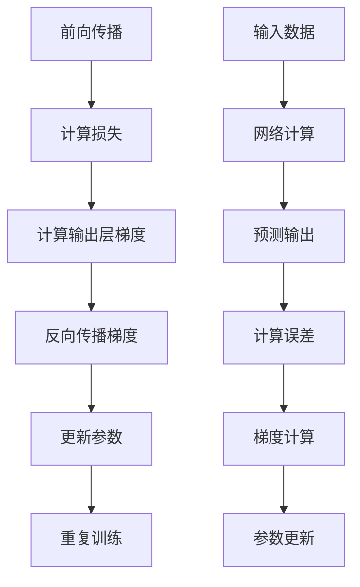

# 反向传播算法

## 🔙 反向传播基础

### 1. 算法原理

**反向传播定义：**
> **反向传播是一种用于训练神经网络的算法，通过计算损失函数对网络参数的梯度来更新权重和偏置**

**算法流程：**


**数学原理：**
```
链式法则：∂L/∂w = (∂L/∂y) × (∂y/∂z) × (∂z/∂w)

其中：
L: 损失函数
y: 网络输出
z: 净输入
w: 权重参数
```

### 2. 梯度计算

**梯度计算实现：**
```python
import numpy as np
import matplotlib.pyplot as plt

class BackpropagationAlgorithm:
    """反向传播算法实现"""
    
    def __init__(self, layers, activation='sigmoid', learning_rate=0.01):
        self.layers = layers
        self.activation = activation
        self.learning_rate = learning_rate
        
        # 初始化权重和偏置
        self.weights = []
        self.biases = []
        
        for i in range(len(layers) - 1):
            # Xavier初始化
            w = np.random.randn(layers[i], layers[i+1]) * np.sqrt(2.0 / layers[i])
            b = np.zeros(layers[i+1])
            self.weights.append(w)
            self.biases.append(b)
        
        # 存储前向传播的中间结果
        self.activations = []
        self.net_inputs = []
    
    def forward(self, X):
        """前向传播"""
        self.activations = [X]
        self.net_inputs = []
        
        for i in range(len(self.weights)):
            # 计算净输入
            z = np.dot(self.activations[-1], self.weights[i]) + self.biases[i]
            self.net_inputs.append(z)
            
            # 应用激活函数
            if i == len(self.weights) - 1:  # 输出层
                a = self._softmax(z)
            else:  # 隐藏层
                a = self._apply_activation(z)
            
            self.activations.append(a)
        
        return self.activations[-1]
    
    def backward(self, y_true, y_pred):
        """反向传播"""
        m = y_true.shape[0]
        
        # 计算输出层误差
        error = y_pred - y_true
        
        # 存储梯度
        dW = []
        db = []
        
        # 反向传播
        for i in range(len(self.weights) - 1, -1, -1):
            # 计算权重和偏置的梯度
            dW_i = np.dot(self.activations[i].T, error) / m
            db_i = np.sum(error, axis=0) / m
            
            dW.insert(0, dW_i)
            db.insert(0, db_i)
            
            # 计算前一层的误差
            if i > 0:
                error = np.dot(error, self.weights[i].T)
                error *= self._activation_derivative(self.net_inputs[i-1])
        
        return dW, db
    
    def update_parameters(self, dW, db):
        """更新参数"""
        for i in range(len(self.weights)):
            self.weights[i] -= self.learning_rate * dW[i]
            self.biases[i] -= self.learning_rate * db[i]
    
    def _apply_activation(self, z):
        """应用激活函数"""
        if self.activation == 'sigmoid':
            return 1 / (1 + np.exp(-np.clip(z, -250, 250)))
        elif self.activation == 'relu':
            return np.maximum(0, z)
        elif self.activation == 'tanh':
            return np.tanh(z)
        else:
            return z
    
    def _activation_derivative(self, z):
        """激活函数导数"""
        if self.activation == 'sigmoid':
            s = 1 / (1 + np.exp(-np.clip(z, -250, 250)))
            return s * (1 - s)
        elif self.activation == 'relu':
            return (z > 0).astype(float)
        elif self.activation == 'tanh':
            return 1 - np.tanh(z) ** 2
        else:
            return np.ones_like(z)
    
    def _softmax(self, z):
        """Softmax激活函数"""
        exp_z = np.exp(z - np.max(z, axis=1, keepdims=True))
        return exp_z / np.sum(exp_z, axis=1, keepdims=True)
    
    def _cross_entropy_loss(self, y_true, y_pred):
        """交叉熵损失"""
        return -np.mean(np.sum(y_true * np.log(y_pred + 1e-15), axis=1))
    
    def train(self, X, y, epochs=1000, batch_size=32):
        """训练网络"""
        losses = []
        
        for epoch in range(epochs):
            # 随机打乱数据
            indices = np.random.permutation(len(X))
            X_shuffled = X[indices]
            y_shuffled = y[indices]
            
            epoch_loss = 0
            
            # 批量训练
            for i in range(0, len(X), batch_size):
                X_batch = X_shuffled[i:i+batch_size]
                y_batch = y_shuffled[i:i+batch_size]
                
                # 前向传播
                y_pred = self.forward(X_batch)
                
                # 计算损失
                loss = self._cross_entropy_loss(y_batch, y_pred)
                epoch_loss += loss
                
                # 反向传播
                dW, db = self.backward(y_batch, y_pred)
                
                # 更新参数
                self.update_parameters(dW, db)
            
            losses.append(epoch_loss / (len(X) // batch_size))
            
            if epoch % 100 == 0:
                print(f"Epoch {epoch}, Loss: {losses[-1]:.4f}")
        
        return losses
    
    def predict(self, X):
        """预测"""
        y_pred = self.forward(X)
        return np.argmax(y_pred, axis=1)
    
    def visualize_backpropagation(self, X, y):
        """可视化反向传播过程"""
        # 前向传播
        y_pred = self.forward(X)
        
        # 反向传播
        dW, db = self.backward(y, y_pred)
        
        # 可视化梯度
        fig, axes = plt.subplots(2, len(dW), figsize=(15, 10))
        
        for i in range(len(dW)):
            # 权重梯度
            im1 = axes[0, i].imshow(dW[i], cmap='RdBu', aspect='auto')
            axes[0, i].set_title(f'Weight Gradients Layer {i+1}')
            axes[0, i].set_xlabel('Output Neurons')
            axes[0, i].set_ylabel('Input Neurons')
            plt.colorbar(im1, ax=axes[0, i])
            
            # 偏置梯度
            axes[1, i].bar(range(len(db[i])), db[i])
            axes[1, i].set_title(f'Bias Gradients Layer {i+1}')
            axes[1, i].set_xlabel('Neuron Index')
            axes[1, i].set_ylabel('Gradient')
        
        plt.tight_layout()
        plt.show()
        
        return dW, db

# 测试反向传播算法
def test_backpropagation():
    """测试反向传播算法"""
    # 生成数据
    np.random.seed(42)
    X = np.random.randn(1000, 2)
    y = (X[:, 0] + X[:, 1] > 0).astype(int)
    
    # 转换为one-hot编码
    y_onehot = np.zeros((len(y), 2))
    y_onehot[np.arange(len(y)), y] = 1
    
    # 创建网络
    bp = BackpropagationAlgorithm([2, 4, 2], activation='sigmoid', learning_rate=0.1)
    
    # 训练网络
    losses = bp.train(X, y_onehot, epochs=1000, batch_size=32)
    
    # 可视化训练过程
    plt.figure(figsize=(10, 6))
    plt.plot(losses)
    plt.xlabel('Epoch')
    plt.ylabel('Loss')
    plt.title('Backpropagation Training')
    plt.grid(True)
    plt.show()
    
    # 测试预测
    predictions = bp.predict(X)
    accuracy = np.mean(predictions == y)
    print(f"Accuracy: {accuracy:.3f}")
    
    # 可视化反向传播
    bp.visualize_backpropagation(X[:100], y_onehot[:100])
    
    return bp, losses

test_backpropagation()
```

## 🔍 梯度计算详解

### 1. 链式法则应用

**链式法则推导：**
```python
class ChainRuleDerivation:
    """链式法则推导"""
    
    def __init__(self):
        self.derivatives = {}
    
    def compute_derivative(self, function, variable):
        """计算导数"""
        if function == 'sigmoid':
            return lambda x: x * (1 - x)
        elif function == 'relu':
            return lambda x: (x > 0).astype(float)
        elif function == 'tanh':
            return lambda x: 1 - x ** 2
        elif function == 'softmax':
            return lambda x: x * (1 - x)
        else:
            return lambda x: np.ones_like(x)
    
    def chain_rule_example(self):
        """链式法则示例"""
        # 假设网络结构：输入 -> 隐藏层 -> 输出层
        # 损失函数：L = -log(y_pred)
        # 输出层：y_pred = softmax(z2)
        # 隐藏层：z2 = W2 * a1 + b2
        # 隐藏层：a1 = sigmoid(z1)
        # 输入层：z1 = W1 * x + b1
        
        # 计算梯度
        # ∂L/∂W2 = ∂L/∂y_pred * ∂y_pred/∂z2 * ∂z2/∂W2
        # ∂L/∂W1 = ∂L/∂y_pred * ∂y_pred/∂z2 * ∂z2/∂a1 * ∂a1/∂z1 * ∂z1/∂W1
        
        print("链式法则梯度计算：")
        print("∂L/∂W2 = ∂L/∂y_pred * ∂y_pred/∂z2 * ∂z2/∂W2")
        print("∂L/∂W1 = ∂L/∂y_pred * ∂y_pred/∂z2 * ∂z2/∂a1 * ∂a1/∂z1 * ∂z1/∂W1")
        
        return self
    
    def visualize_chain_rule(self):
        """可视化链式法则"""
        # 创建一个简单的网络
        x = np.linspace(-5, 5, 100)
        
        # 前向传播
        z1 = 2 * x + 1  # 线性变换
        a1 = 1 / (1 + np.exp(-z1))  # Sigmoid激活
        z2 = 3 * a1 + 2  # 线性变换
        y = 1 / (1 + np.exp(-z2))  # Sigmoid激活
        
        # 反向传播（链式法则）
        dy_dz2 = y * (1 - y)  # Sigmoid导数
        dz2_da1 = 3  # 线性变换导数
        da1_dz1 = a1 * (1 - a1)  # Sigmoid导数
        dz1_dx = 2  # 线性变换导数
        
        # 计算最终梯度
        dy_dx = dy_dz2 * dz2_da1 * da1_dz1 * dz1_dx
        
        # 可视化
        fig, axes = plt.subplots(2, 2, figsize=(12, 10))
        
        # 前向传播
        axes[0, 0].plot(x, y, 'b-', label='y = f(x)')
        axes[0, 0].set_xlabel('x')
        axes[0, 0].set_ylabel('y')
        axes[0, 0].set_title('Forward Propagation')
        axes[0, 0].legend()
        axes[0, 0].grid(True)
        
        # 中间变量
        axes[0, 1].plot(x, a1, 'g-', label='a1 = sigmoid(z1)')
        axes[0, 1].set_xlabel('x')
        axes[0, 1].set_ylabel('a1')
        axes[0, 1].set_title('Hidden Layer Activation')
        axes[0, 1].legend()
        axes[0, 1].grid(True)
        
        # 梯度
        axes[1, 0].plot(x, dy_dx, 'r-', label='dy/dx')
        axes[1, 0].set_xlabel('x')
        axes[1, 0].set_ylabel('dy/dx')
        axes[1, 0].set_title('Gradient (Chain Rule)')
        axes[1, 0].legend()
        axes[1, 0].grid(True)
        
        # 梯度分解
        axes[1, 1].plot(x, dy_dz2, 'r-', label='dy/dz2')
        axes[1, 1].plot(x, da1_dz1, 'g-', label='da1/dz1')
        axes[1, 1].set_xlabel('x')
        axes[1, 1].set_ylabel('Gradient')
        axes[1, 1].set_title('Gradient Components')
        axes[1, 1].legend()
        axes[1, 1].grid(True)
        
        plt.tight_layout()
        plt.show()
        
        return dy_dx

# 测试链式法则
def test_chain_rule():
    """测试链式法则"""
    cr = ChainRuleDerivation()
    cr.chain_rule_example()
    dy_dx = cr.visualize_chain_rule()
    return cr, dy_dx

test_chain_rule()
```

### 2. 梯度消失和爆炸

**梯度消失和爆炸问题：**
```python
class GradientVanishingExploding:
    """梯度消失和爆炸问题"""
    
    def __init__(self, layers, activation='sigmoid'):
        self.layers = layers
        self.activation = activation
        self.weights = []
        self.biases = []
        
        # 初始化权重和偏置
        for i in range(len(layers) - 1):
            w = np.random.randn(layers[i], layers[i+1]) * 0.1
            b = np.zeros(layers[i+1])
            self.weights.append(w)
            self.biases.append(b)
    
    def forward(self, X):
        """前向传播"""
        activations = [X]
        net_inputs = []
        
        for i in range(len(self.weights)):
            z = np.dot(activations[-1], self.weights[i]) + self.biases[i]
            net_inputs.append(z)
            
            if i == len(self.weights) - 1:  # 输出层
                a = self._softmax(z)
            else:  # 隐藏层
                a = self._apply_activation(z)
            
            activations.append(a)
        
        return activations, net_inputs
    
    def backward(self, y_true, y_pred, activations, net_inputs):
        """反向传播"""
        m = y_true.shape[0]
        
        # 计算输出层误差
        error = y_pred - y_true
        
        # 存储梯度
        dW = []
        db = []
        gradients = []
        
        # 反向传播
        for i in range(len(self.weights) - 1, -1, -1):
            # 计算权重和偏置的梯度
            dW_i = np.dot(activations[i].T, error) / m
            db_i = np.sum(error, axis=0) / m
            
            dW.insert(0, dW_i)
            db.insert(0, db_i)
            
            # 计算梯度范数
            grad_norm = np.linalg.norm(dW_i)
            gradients.append(grad_norm)
            
            # 计算前一层的误差
            if i > 0:
                error = np.dot(error, self.weights[i].T)
                error *= self._activation_derivative(net_inputs[i-1])
        
        return dW, db, gradients
    
    def _apply_activation(self, z):
        """应用激活函数"""
        if self.activation == 'sigmoid':
            return 1 / (1 + np.exp(-np.clip(z, -250, 250)))
        elif self.activation == 'relu':
            return np.maximum(0, z)
        elif self.activation == 'tanh':
            return np.tanh(z)
        else:
            return z
    
    def _activation_derivative(self, z):
        """激活函数导数"""
        if self.activation == 'sigmoid':
            s = 1 / (1 + np.exp(-np.clip(z, -250, 250)))
            return s * (1 - s)
        elif self.activation == 'relu':
            return (z > 0).astype(float)
        elif self.activation == 'tanh':
            return 1 - np.tanh(z) ** 2
        else:
            return np.ones_like(z)
    
    def _softmax(self, z):
        """Softmax激活函数"""
        exp_z = np.exp(z - np.max(z, axis=1, keepdims=True))
        return exp_z / np.sum(exp_z, axis=1, keepdims=True)
    
    def analyze_gradient_flow(self, X, y):
        """分析梯度流"""
        # 前向传播
        activations, net_inputs = self.forward(X)
        y_pred = activations[-1]
        
        # 反向传播
        dW, db, gradients = self.backward(y, y_pred, activations, net_inputs)
        
        # 可视化梯度流
        fig, axes = plt.subplots(2, 2, figsize=(15, 10))
        
        # 梯度范数
        layer_names = [f'Layer {i+1}' for i in range(len(gradients))]
        axes[0, 0].bar(layer_names, gradients)
        axes[0, 0].set_title('Gradient Norms')
        axes[0, 0].set_ylabel('Gradient Norm')
        axes[0, 0].tick_params(axis='x', rotation=45)
        
        # 梯度分布
        for i, grad in enumerate(dW):
            axes[0, 1].hist(grad.flatten(), alpha=0.7, label=f'Layer {i+1}')
        axes[0, 1].set_title('Gradient Distributions')
        axes[0, 1].set_xlabel('Gradient Value')
        axes[0, 1].set_ylabel('Frequency')
        axes[0, 1].legend()
        
        # 权重分布
        for i, weight in enumerate(self.weights):
            axes[1, 0].hist(weight.flatten(), alpha=0.7, label=f'Layer {i+1}')
        axes[1, 0].set_title('Weight Distributions')
        axes[1, 0].set_xlabel('Weight Value')
        axes[1, 0].set_ylabel('Frequency')
        axes[1, 0].legend()
        
        # 激活值分布
        for i, activation in enumerate(activations[1:]):
            axes[1, 1].hist(activation.flatten(), alpha=0.7, label=f'Layer {i+1}')
        axes[1, 1].set_title('Activation Distributions')
        axes[1, 1].set_xlabel('Activation Value')
        axes[1, 1].set_ylabel('Frequency')
        axes[1, 1].legend()
        
        plt.tight_layout()
        plt.show()
        
        return gradients, dW, db
    
    def compare_activations(self, X, y):
        """比较不同激活函数的梯度流"""
        activations = ['sigmoid', 'relu', 'tanh']
        results = {}
        
        for activation in activations:
            # 创建网络
            gve = GradientVanishingExploding(self.layers, activation=activation)
            
            # 分析梯度流
            gradients, dW, db = gve.analyze_gradient_flow(X, y)
            results[activation] = {
                'gradients': gradients,
                'dW': dW,
                'db': db
            }
        
        # 比较结果
        fig, axes = plt.subplots(1, 2, figsize=(15, 5))
        
        # 梯度范数比较
        for activation, result in results.items():
            axes[0].plot(result['gradients'], 'o-', label=activation)
        axes[0].set_title('Gradient Norms Comparison')
        axes[0].set_xlabel('Layer')
        axes[0].set_ylabel('Gradient Norm')
        axes[0].legend()
        axes[0].grid(True)
        
        # 梯度方差比较
        for activation, result in results.items():
            variances = [np.var(grad) for grad in result['dW']]
            axes[1].plot(variances, 'o-', label=activation)
        axes[1].set_title('Gradient Variances Comparison')
        axes[1].set_xlabel('Layer')
        axes[1].set_ylabel('Gradient Variance')
        axes[1].legend()
        axes[1].grid(True)
        
        plt.tight_layout()
        plt.show()
        
        return results

# 测试梯度消失和爆炸
def test_gradient_vanishing_exploding():
    """测试梯度消失和爆炸"""
    # 生成数据
    np.random.seed(42)
    X = np.random.randn(1000, 2)
    y = (X[:, 0] + X[:, 1] > 0).astype(int)
    
    # 转换为one-hot编码
    y_onehot = np.zeros((len(y), 2))
    y_onehot[np.arange(len(y)), y] = 1
    
    # 创建深层网络
    gve = GradientVanishingExploding([2, 10, 10, 10, 2], activation='sigmoid')
    
    # 分析梯度流
    gradients, dW, db = gve.analyze_gradient_flow(X, y_onehot)
    
    # 比较不同激活函数
    results = gve.compare_activations(X, y_onehot)
    
    return gve, results

test_gradient_vanishing_exploding()
```

## 🔗 相关链接
- [[01-02-03-微积分基础]] - 微积分
- [[02-02-01-神经网络原理]] - 神经网络
- [[02-02-03-激活函数详解]] - 激活函数
- [[02-02-07-梯度消失与爆炸]] - 梯度问题

## 💡 反向传播学习建议

**学习策略：**
- 🧮 **理解数学原理**：深入理解链式法则和梯度计算
- 🔄 **动手实现**：从零开始实现反向传播算法
- 📊 **可视化分析**：通过可视化理解梯度流
- 🎯 **问题诊断**：学会诊断和解决梯度问题

**实践建议：**
- 📝 **推导公式**：推导反向传播的数学公式
- 💻 **代码实现**：实现各种激活函数的导数
- 📊 **梯度分析**：分析梯度的分布和变化
- 🔍 **问题解决**：学会解决梯度消失和爆炸问题

---
*📝 学习提示：反向传播是神经网络训练的核心算法，建议深入理解数学原理，通过实践掌握算法的实现和优化*


