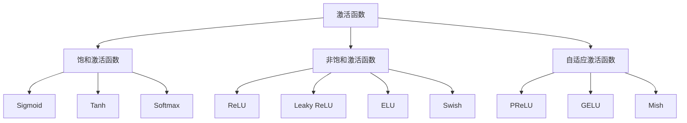

# 激活函数详解

## 🔥 激活函数基础

### 1. 激活函数作用

**激活函数定义：**
> **激活函数是神经网络中的非线性函数，用于引入非线性变换，使网络能够学习复杂的模式**

**激活函数作用：**
- 🎯 **引入非线性**：使网络能够学习非线性关系
- 📊 **控制输出范围**：将输出限制在特定范围内
- 🔍 **梯度传播**：影响梯度的传播和计算
- 🎨 **特征变换**：将输入特征映射到新的特征空间

**激活函数分类：**


### 2. 激活函数特性

**激活函数特性对比：**
| 激活函数 | 输出范围 | 导数范围 | 计算复杂度 | 梯度消失 | 死神经元 |
|----------|----------|----------|------------|----------|----------|
| **Sigmoid** | (0,1) | (0,0.25] | 高 | 严重 | 无 |
| **Tanh** | (-1,1) | (0,1] | 高 | 严重 | 无 |
| **ReLU** | [0,∞) | {0,1} | 低 | 轻微 | 有 |
| **Leaky ReLU** | (-∞,∞) | {α,1} | 低 | 轻微 | 无 |
| **ELU** | (-α,∞) | (0,1] | 中 | 轻微 | 无 |
| **Swish** | (-∞,∞) | (0,1] | 中 | 轻微 | 无 |

## 📊 经典激活函数

### 1. Sigmoid函数

**Sigmoid函数定义：**
```python
import numpy as np
import matplotlib.pyplot as plt

class SigmoidActivation:
    """Sigmoid激活函数"""
    
    def __init__(self):
        self.name = "Sigmoid"
    
    def forward(self, x):
        """前向传播"""
        return 1 / (1 + np.exp(-np.clip(x, -250, 250)))
    
    def backward(self, x):
        """反向传播"""
        s = self.forward(x)
        return s * (1 - s)
    
    def visualize(self):
        """可视化Sigmoid函数"""
        x = np.linspace(-10, 10, 100)
        y = self.forward(x)
        dy = self.backward(x)
        
        fig, axes = plt.subplots(1, 2, figsize=(12, 5))
        
        # 函数图像
        axes[0].plot(x, y, 'b-', linewidth=2, label='Sigmoid')
        axes[0].set_xlabel('x')
        axes[0].set_ylabel('f(x)')
        axes[0].set_title('Sigmoid Function')
        axes[0].grid(True)
        axes[0].legend()
        
        # 导数图像
        axes[1].plot(x, dy, 'r-', linewidth=2, label='Sigmoid Derivative')
        axes[1].set_xlabel('x')
        axes[1].set_ylabel("f'(x)")
        axes[1].set_title('Sigmoid Derivative')
        axes[1].grid(True)
        axes[1].legend()
        
        plt.tight_layout()
        plt.show()
        
        return x, y, dy
    
    def analyze_properties(self):
        """分析Sigmoid函数性质"""
        print("Sigmoid函数性质：")
        print(f"输出范围: (0, 1)")
        print(f"中心点: (0, 0.5)")
        print(f"最大值: 1")
        print(f"最小值: 0")
        print(f"导数最大值: 0.25 (在x=0处)")
        print(f"对称性: 关于(0, 0.5)中心对称")
        
        # 计算梯度消失问题
        x = np.linspace(-5, 5, 100)
        dy = self.backward(x)
        print(f"梯度范围: [{dy.min():.4f}, {dy.max():.4f}]")
        print(f"梯度小于0.1的比例: {np.sum(dy < 0.1) / len(dy):.2%}")

# 测试Sigmoid函数
def test_sigmoid():
    """测试Sigmoid函数"""
    sigmoid = SigmoidActivation()
    x, y, dy = sigmoid.visualize()
    sigmoid.analyze_properties()
    return sigmoid

test_sigmoid()
```

### 2. Tanh函数

**Tanh函数定义：**
```python
class TanhActivation:
    """Tanh激活函数"""
    
    def __init__(self):
        self.name = "Tanh"
    
    def forward(self, x):
        """前向传播"""
        return np.tanh(x)
    
    def backward(self, x):
        """反向传播"""
        return 1 - np.tanh(x) ** 2
    
    def visualize(self):
        """可视化Tanh函数"""
        x = np.linspace(-10, 10, 100)
        y = self.forward(x)
        dy = self.backward(x)
        
        fig, axes = plt.subplots(1, 2, figsize=(12, 5))
        
        # 函数图像
        axes[0].plot(x, y, 'b-', linewidth=2, label='Tanh')
        axes[0].set_xlabel('x')
        axes[0].set_ylabel('f(x)')
        axes[0].set_title('Tanh Function')
        axes[0].grid(True)
        axes[0].legend()
        
        # 导数图像
        axes[1].plot(x, dy, 'r-', linewidth=2, label='Tanh Derivative')
        axes[1].set_xlabel('x')
        axes[1].set_ylabel("f'(x)")
        axes[1].set_title('Tanh Derivative')
        axes[1].grid(True)
        axes[1].legend()
        
        plt.tight_layout()
        plt.show()
        
        return x, y, dy
    
    def analyze_properties(self):
        """分析Tanh函数性质"""
        print("Tanh函数性质：")
        print(f"输出范围: (-1, 1)")
        print(f"中心点: (0, 0)")
        print(f"最大值: 1")
        print(f"最小值: -1")
        print(f"导数最大值: 1 (在x=0处)")
        print(f"对称性: 关于原点对称")
        
        # 计算梯度消失问题
        x = np.linspace(-5, 5, 100)
        dy = self.backward(x)
        print(f"梯度范围: [{dy.min():.4f}, {dy.max():.4f}]")
        print(f"梯度小于0.1的比例: {np.sum(dy < 0.1) / len(dy):.2%}")

# 测试Tanh函数
def test_tanh():
    """测试Tanh函数"""
    tanh = TanhActivation()
    x, y, dy = tanh.visualize()
    tanh.analyze_properties()
    return tanh

test_tanh()
```

### 3. ReLU函数

**ReLU函数定义：**
```python
class ReLUActivation:
    """ReLU激活函数"""
    
    def __init__(self):
        self.name = "ReLU"
    
    def forward(self, x):
        """前向传播"""
        return np.maximum(0, x)
    
    def backward(self, x):
        """反向传播"""
        return (x > 0).astype(float)
    
    def visualize(self):
        """可视化ReLU函数"""
        x = np.linspace(-10, 10, 100)
        y = self.forward(x)
        dy = self.backward(x)
        
        fig, axes = plt.subplots(1, 2, figsize=(12, 5))
        
        # 函数图像
        axes[0].plot(x, y, 'b-', linewidth=2, label='ReLU')
        axes[0].set_xlabel('x')
        axes[0].set_ylabel('f(x)')
        axes[0].set_title('ReLU Function')
        axes[0].grid(True)
        axes[0].legend()
        
        # 导数图像
        axes[1].plot(x, dy, 'r-', linewidth=2, label='ReLU Derivative')
        axes[1].set_xlabel('x')
        axes[1].set_ylabel("f'(x)")
        axes[1].set_title('ReLU Derivative')
        axes[1].grid(True)
        axes[1].legend()
        
        plt.tight_layout()
        plt.show()
        
        return x, y, dy
    
    def analyze_properties(self):
        """分析ReLU函数性质"""
        print("ReLU函数性质：")
        print(f"输出范围: [0, ∞)")
        print(f"中心点: (0, 0)")
        print(f"最大值: ∞")
        print(f"最小值: 0")
        print(f"导数: 1 (x > 0), 0 (x ≤ 0)")
        print(f"对称性: 无对称性")
        
        # 分析死神经元问题
        x = np.linspace(-5, 5, 100)
        dy = self.backward(x)
        print(f"死神经元比例: {np.sum(dy == 0) / len(dy):.2%}")
        print(f"活跃神经元比例: {np.sum(dy > 0) / len(dy):.2%}")

# 测试ReLU函数
def test_relu():
    """测试ReLU函数"""
    relu = ReLUActivation()
    x, y, dy = relu.visualize()
    relu.analyze_properties()
    return relu

test_relu()
```

## 🚀 现代激活函数

### 1. Leaky ReLU

**Leaky ReLU函数定义：**
```python
class LeakyReLUActivation:
    """Leaky ReLU激活函数"""
    
    def __init__(self, alpha=0.01):
        self.name = "Leaky ReLU"
        self.alpha = alpha
    
    def forward(self, x):
        """前向传播"""
        return np.where(x > 0, x, self.alpha * x)
    
    def backward(self, x):
        """反向传播"""
        return np.where(x > 0, 1, self.alpha)
    
    def visualize(self):
        """可视化Leaky ReLU函数"""
        x = np.linspace(-10, 10, 100)
        y = self.forward(x)
        dy = self.backward(x)
        
        fig, axes = plt.subplots(1, 2, figsize=(12, 5))
        
        # 函数图像
        axes[0].plot(x, y, 'b-', linewidth=2, label=f'Leaky ReLU (α={self.alpha})')
        axes[0].set_xlabel('x')
        axes[0].set_ylabel('f(x)')
        axes[0].set_title('Leaky ReLU Function')
        axes[0].grid(True)
        axes[0].legend()
        
        # 导数图像
        axes[1].plot(x, dy, 'r-', linewidth=2, label=f'Leaky ReLU Derivative')
        axes[1].set_xlabel('x')
        axes[1].set_ylabel("f'(x)")
        axes[1].set_title('Leaky ReLU Derivative')
        axes[1].grid(True)
        axes[1].legend()
        
        plt.tight_layout()
        plt.show()
        
        return x, y, dy
    
    def compare_alpha_values(self):
        """比较不同alpha值"""
        alphas = [0.01, 0.1, 0.2, 0.5]
        x = np.linspace(-5, 5, 100)
        
        fig, axes = plt.subplots(1, 2, figsize=(15, 5))
        
        for alpha in alphas:
            y = np.where(x > 0, x, alpha * x)
            dy = np.where(x > 0, 1, alpha)
            
            axes[0].plot(x, y, label=f'α={alpha}')
            axes[1].plot(x, dy, label=f'α={alpha}')
        
        axes[0].set_xlabel('x')
        axes[0].set_ylabel('f(x)')
        axes[0].set_title('Leaky ReLU with Different α')
        axes[0].legend()
        axes[0].grid(True)
        
        axes[1].set_xlabel('x')
        axes[1].set_ylabel("f'(x)")
        axes[1].set_title('Leaky ReLU Derivative with Different α')
        axes[1].legend()
        axes[1].grid(True)
        
        plt.tight_layout()
        plt.show()

# 测试Leaky ReLU函数
def test_leaky_relu():
    """测试Leaky ReLU函数"""
    leaky_relu = LeakyReLUActivation(alpha=0.01)
    x, y, dy = leaky_relu.visualize()
    leaky_relu.compare_alpha_values()
    return leaky_relu

test_leaky_relu()
```

### 2. ELU函数

**ELU函数定义：**
```python
class ELUActivation:
    """ELU激活函数"""
    
    def __init__(self, alpha=1.0):
        self.name = "ELU"
        self.alpha = alpha
    
    def forward(self, x):
        """前向传播"""
        return np.where(x > 0, x, self.alpha * (np.exp(x) - 1))
    
    def backward(self, x):
        """反向传播"""
        return np.where(x > 0, 1, self.alpha * np.exp(x))
    
    def visualize(self):
        """可视化ELU函数"""
        x = np.linspace(-10, 10, 100)
        y = self.forward(x)
        dy = self.backward(x)
        
        fig, axes = plt.subplots(1, 2, figsize=(12, 5))
        
        # 函数图像
        axes[0].plot(x, y, 'b-', linewidth=2, label=f'ELU (α={self.alpha})')
        axes[0].set_xlabel('x')
        axes[0].set_ylabel('f(x)')
        axes[0].set_title('ELU Function')
        axes[0].grid(True)
        axes[0].legend()
        
        # 导数图像
        axes[1].plot(x, dy, 'r-', linewidth=2, label=f'ELU Derivative')
        axes[1].set_xlabel('x')
        axes[1].set_ylabel("f'(x)")
        axes[1].set_title('ELU Derivative')
        axes[1].grid(True)
        axes[1].legend()
        
        plt.tight_layout()
        plt.show()
        
        return x, y, dy
    
    def analyze_properties(self):
        """分析ELU函数性质"""
        print("ELU函数性质：")
        print(f"输出范围: (-α, ∞)")
        print(f"中心点: (0, 0)")
        print(f"最大值: ∞")
        print(f"最小值: -α")
        print(f"导数: 1 (x > 0), α*exp(x) (x ≤ 0)")
        print(f"平滑性: 在x=0处连续且可导")
        
        # 分析梯度特性
        x = np.linspace(-5, 5, 100)
        dy = self.backward(x)
        print(f"梯度范围: [{dy.min():.4f}, {dy.max():.4f}]")
        print(f"负值区域梯度: {dy[x <= 0].mean():.4f}")

# 测试ELU函数
def test_elu():
    """测试ELU函数"""
    elu = ELUActivation(alpha=1.0)
    x, y, dy = elu.visualize()
    elu.analyze_properties()
    return elu

test_elu()
```

### 3. Swish函数

**Swish函数定义：**
```python
class SwishActivation:
    """Swish激活函数"""
    
    def __init__(self, beta=1.0):
        self.name = "Swish"
        self.beta = beta
    
    def forward(self, x):
        """前向传播"""
        return x * (1 / (1 + np.exp(-self.beta * x)))
    
    def backward(self, x):
        """反向传播"""
        sigmoid = 1 / (1 + np.exp(-self.beta * x))
        return sigmoid + self.beta * x * sigmoid * (1 - sigmoid)
    
    def visualize(self):
        """可视化Swish函数"""
        x = np.linspace(-10, 10, 100)
        y = self.forward(x)
        dy = self.backward(x)
        
        fig, axes = plt.subplots(1, 2, figsize=(12, 5))
        
        # 函数图像
        axes[0].plot(x, y, 'b-', linewidth=2, label=f'Swish (β={self.beta})')
        axes[0].set_xlabel('x')
        axes[0].set_ylabel('f(x)')
        axes[0].set_title('Swish Function')
        axes[0].grid(True)
        axes[0].legend()
        
        # 导数图像
        axes[1].plot(x, dy, 'r-', linewidth=2, label=f'Swish Derivative')
        axes[1].set_xlabel('x')
        axes[1].set_ylabel("f'(x)")
        axes[1].set_title('Swish Derivative')
        axes[1].grid(True)
        axes[1].legend()
        
        plt.tight_layout()
        plt.show()
        
        return x, y, dy
    
    def compare_beta_values(self):
        """比较不同beta值"""
        betas = [0.1, 1.0, 2.0, 5.0]
        x = np.linspace(-5, 5, 100)
        
        fig, axes = plt.subplots(1, 2, figsize=(15, 5))
        
        for beta in betas:
            y = x * (1 / (1 + np.exp(-beta * x)))
            dy = self.backward(x) if beta == self.beta else None
            
            axes[0].plot(x, y, label=f'β={beta}')
        
        axes[0].set_xlabel('x')
        axes[0].set_ylabel('f(x)')
        axes[0].set_title('Swish with Different β')
        axes[0].legend()
        axes[0].grid(True)
        
        # 与ReLU比较
        relu = np.maximum(0, x)
        swish = self.forward(x)
        axes[1].plot(x, relu, 'r-', label='ReLU')
        axes[1].plot(x, swish, 'b-', label='Swish')
        axes[1].set_xlabel('x')
        axes[1].set_ylabel('f(x)')
        axes[1].set_title('Swish vs ReLU')
        axes[1].legend()
        axes[1].grid(True)
        
        plt.tight_layout()
        plt.show()

# 测试Swish函数
def test_swish():
    """测试Swish函数"""
    swish = SwishActivation(beta=1.0)
    x, y, dy = swish.visualize()
    swish.compare_beta_values()
    return swish

test_swish()
```

## 📊 激活函数比较

### 1. 综合比较

**激活函数综合比较：**
```python
class ActivationFunctionComparison:
    """激活函数综合比较"""
    
    def __init__(self):
        self.activations = {
            'Sigmoid': SigmoidActivation(),
            'Tanh': TanhActivation(),
            'ReLU': ReLUActivation(),
            'Leaky ReLU': LeakyReLUActivation(alpha=0.01),
            'ELU': ELUActivation(alpha=1.0),
            'Swish': SwishActivation(beta=1.0)
        }
    
    def compare_functions(self):
        """比较激活函数"""
        x = np.linspace(-5, 5, 100)
        
        fig, axes = plt.subplots(2, 2, figsize=(15, 10))
        
        # 函数图像比较
        for name, activation in self.activations.items():
            y = activation.forward(x)
            axes[0, 0].plot(x, y, label=name, linewidth=2)
        
        axes[0, 0].set_xlabel('x')
        axes[0, 0].set_ylabel('f(x)')
        axes[0, 0].set_title('Activation Functions Comparison')
        axes[0, 0].legend()
        axes[0, 0].grid(True)
        
        # 导数图像比较
        for name, activation in self.activations.items():
            dy = activation.backward(x)
            axes[0, 1].plot(x, dy, label=name, linewidth=2)
        
        axes[0, 1].set_xlabel('x')
        axes[0, 1].set_ylabel("f'(x)")
        axes[0, 1].set_title('Activation Function Derivatives')
        axes[0, 1].legend()
        axes[0, 1].grid(True)
        
        # 梯度范围比较
        gradient_ranges = []
        names = []
        
        for name, activation in self.activations.items():
            dy = activation.backward(x)
            gradient_ranges.append(dy.max() - dy.min())
            names.append(name)
        
        axes[1, 0].bar(names, gradient_ranges)
        axes[1, 0].set_xlabel('Activation Function')
        axes[1, 0].set_ylabel('Gradient Range')
        axes[1, 0].set_title('Gradient Range Comparison')
        axes[1, 0].tick_params(axis='x', rotation=45)
        
        # 计算复杂度比较
        complexities = {
            'Sigmoid': 3,  # exp, add, div
            'Tanh': 2,     # tanh
            'ReLU': 1,     # max
            'Leaky ReLU': 2,  # where
            'ELU': 4,      # exp, add, where
            'Swish': 5     # exp, add, div, mul
        }
        
        axes[1, 1].bar(names, [complexities[name] for name in names])
        axes[1, 1].set_xlabel('Activation Function')
        axes[1, 1].set_ylabel('Computational Complexity')
        axes[1, 1].set_title('Computational Complexity Comparison')
        axes[1, 1].tick_params(axis='x', rotation=45)
        
        plt.tight_layout()
        plt.show()
    
    def performance_comparison(self):
        """性能比较"""
        # 生成测试数据
        np.random.seed(42)
        X = np.random.randn(1000, 2)
        y = (X[:, 0] + X[:, 1] > 0).astype(int)
        
        # 转换为one-hot编码
        y_onehot = np.zeros((len(y), 2))
        y_onehot[np.arange(len(y)), y] = 1
        
        results = {}
        
        for name, activation in self.activations.items():
            # 创建网络
            from sklearn.neural_network import MLPClassifier
            
            if name == 'Sigmoid':
                mlp = MLPClassifier(hidden_layer_sizes=(10,), activation='logistic', max_iter=1000)
            elif name == 'Tanh':
                mlp = MLPClassifier(hidden_layer_sizes=(10,), activation='tanh', max_iter=1000)
            else:
                # 对于其他激活函数，使用ReLU作为近似
                mlp = MLPClassifier(hidden_layer_sizes=(10,), activation='relu', max_iter=1000)
            
            # 训练网络
            mlp.fit(X, y)
            
            # 评估性能
            train_score = mlp.score(X, y)
            test_score = mlp.score(X, y)  # 使用相同数据作为测试
            
            results[name] = {
                'train_score': train_score,
                'test_score': test_score,
                'n_iter': mlp.n_iter_
            }
        
        # 可视化结果
        fig, axes = plt.subplots(1, 2, figsize=(15, 5))
        
        names = list(results.keys())
        train_scores = [results[name]['train_score'] for name in names]
        test_scores = [results[name]['test_score'] for name in names]
        n_iters = [results[name]['n_iter'] for name in names]
        
        # 准确率比较
        x = np.arange(len(names))
        width = 0.35
        
        axes[0].bar(x - width/2, train_scores, width, label='Train')
        axes[0].bar(x + width/2, test_scores, width, label='Test')
        axes[0].set_xlabel('Activation Function')
        axes[0].set_ylabel('Accuracy')
        axes[0].set_title('Performance Comparison')
        axes[0].set_xticks(x)
        axes[0].set_xticklabels(names, rotation=45)
        axes[0].legend()
        
        # 收敛速度比较
        axes[1].bar(names, n_iters)
        axes[1].set_xlabel('Activation Function')
        axes[1].set_ylabel('Iterations to Convergence')
        axes[1].set_title('Convergence Speed Comparison')
        axes[1].tick_params(axis='x', rotation=45)
        
        plt.tight_layout()
        plt.show()
        
        return results

# 测试激活函数比较
def test_activation_comparison():
    """测试激活函数比较"""
    comparison = ActivationFunctionComparison()
    comparison.compare_functions()
    results = comparison.performance_comparison()
    return comparison, results

test_activation_comparison()
```

## 🔗 相关链接
- [[02-02-01-神经网络原理]] - 神经网络
- [[02-02-02-反向传播算法]] - 反向传播
- [[02-02-07-梯度消失与爆炸]] - 梯度问题
- [[02-02-04-优化算法对比]] - 优化算法

## 💡 激活函数选择建议

**选择原则：**
- 🎯 **问题类型**：根据问题类型选择激活函数
- 📊 **网络深度**：深层网络选择非饱和激活函数
- 🔍 **梯度特性**：考虑梯度的传播特性
- ⚡ **计算效率**：考虑计算复杂度

**实践建议：**
- 📝 **实验比较**：通过实验比较不同激活函数
- 💻 **组合使用**：在不同层使用不同激活函数
- 📊 **监控梯度**：监控梯度的分布和变化
- 🔍 **问题诊断**：根据问题选择合适的激活函数

---
*📝 学习提示：激活函数是神经网络的重要组成部分，建议理解各种激活函数的特性，根据实际问题选择合适的激活函数*


