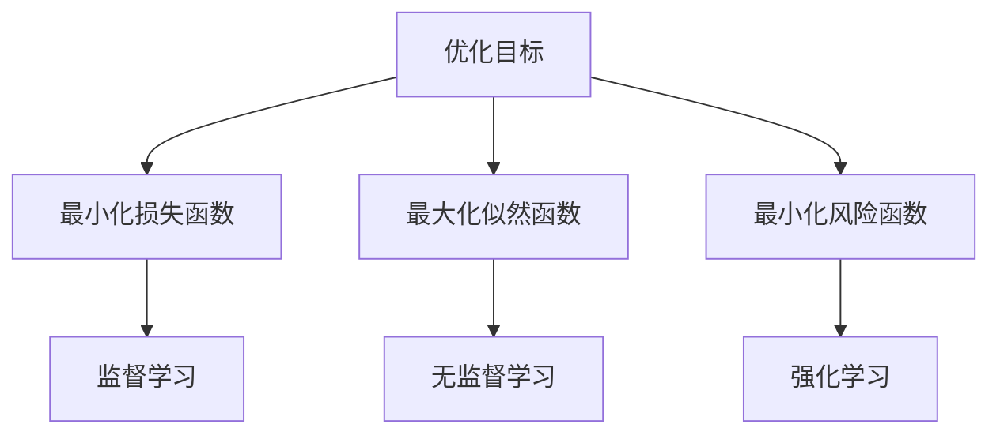
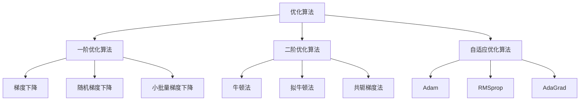

# 优化算法对比

## 🚀 优化算法基础

### 1. 优化问题定义

**优化问题：**
> **优化算法是用于最小化或最大化目标函数的算法，在深度学习中用于最小化损失函数**

**优化目标：**


**优化算法分类：**


### 2. 优化算法特性

**算法特性对比：**
| 算法 | 收敛速度 | 内存需求 | 计算复杂度 | 超参数 | 适用场景 |
|------|----------|----------|------------|--------|----------|
| **SGD** | 慢 | 低 | 低 | 学习率 | 大规模数据 |
| **Momentum** | 中 | 低 | 低 | 学习率、动量 | 一般场景 |
| **Adam** | 快 | 中 | 中 | 学习率、β1、β2 | 深度学习 |
| **RMSprop** | 中 | 中 | 中 | 学习率、衰减率 | RNN训练 |
| **AdaGrad** | 中 | 高 | 中 | 学习率 | 稀疏梯度 |

## 📊 经典优化算法

### 1. 梯度下降（GD）

**梯度下降原理：**
```python
import numpy as np
import matplotlib.pyplot as plt

class GradientDescent:
    """梯度下降算法"""
    
    def __init__(self, learning_rate=0.01):
        self.learning_rate = learning_rate
        self.history = []
    
    def optimize(self, f, grad_f, x0, max_iter=1000, tol=1e-6):
        """优化函数"""
        x = x0.copy()
        self.history = [x.copy()]
        
        for i in range(max_iter):
            # 计算梯度
            gradient = grad_f(x)
            
            # 更新参数
            x = x - self.learning_rate * gradient
            
            # 记录历史
            self.history.append(x.copy())
            
            # 检查收敛
            if np.linalg.norm(gradient) < tol:
                print(f"收敛于第 {i+1} 次迭代")
                break
        
        return x
    
    def visualize_optimization(self, f, grad_f, x0, bounds=(-5, 5)):
        """可视化优化过程"""
        # 创建网格
        x1 = np.linspace(bounds[0], bounds[1], 100)
        x2 = np.linspace(bounds[0], bounds[1], 100)
        X1, X2 = np.meshgrid(x1, x2)
        
        # 计算函数值
        Z = np.zeros_like(X1)
        for i in range(X1.shape[0]):
            for j in range(X1.shape[1]):
                Z[i, j] = f(np.array([X1[i, j], X2[i, j]]))
        
        # 优化
        x_opt = self.optimize(f, grad_f, x0)
        
        # 可视化
        plt.figure(figsize=(12, 5))
        
        # 等高线图
        plt.subplot(1, 2, 1)
        plt.contour(X1, X2, Z, levels=50, alpha=0.6)
        plt.colorbar()
        
        # 绘制优化路径
        history = np.array(self.history)
        plt.plot(history[:, 0], history[:, 1], 'ro-', markersize=4, linewidth=2)
        plt.plot(x0[0], x0[1], 'go', markersize=10, label='起点')
        plt.plot(x_opt[0], x_opt[1], 'r*', markersize=15, label='最优点')
        plt.xlabel('x1')
        plt.ylabel('x2')
        plt.title('梯度下降优化路径')
        plt.legend()
        plt.grid(True)
        
        # 损失函数值
        plt.subplot(1, 2, 2)
        losses = [f(x) for x in self.history]
        plt.plot(losses, 'b-', linewidth=2)
        plt.xlabel('迭代次数')
        plt.ylabel('损失函数值')
        plt.title('损失函数收敛过程')
        plt.grid(True)
        
        plt.tight_layout()
        plt.show()
        
        return x_opt

# 测试梯度下降
def test_gradient_descent():
    """测试梯度下降算法"""
    # 定义目标函数（Rosenbrock函数）
    def rosenbrock(x):
        return 100 * (x[1] - x[0]**2)**2 + (1 - x[0])**2
    
    def rosenbrock_grad(x):
        return np.array([
            -400 * x[0] * (x[1] - x[0]**2) - 2 * (1 - x[0]),
            200 * (x[1] - x[0]**2)
        ])
    
    # 创建优化器
    gd = GradientDescent(learning_rate=0.001)
    
    # 优化
    x0 = np.array([-1.5, 1.5])
    x_opt = gd.visualize_optimization(rosenbrock, rosenbrock_grad, x0)
    
    print(f"最优解: {x_opt}")
    print(f"最优值: {rosenbrock(x_opt)}")
    
    return gd, x_opt

test_gradient_descent()
```

### 2. 随机梯度下降（SGD）

**SGD原理：**
```python
class StochasticGradientDescent:
    """随机梯度下降算法"""
    
    def __init__(self, learning_rate=0.01, momentum=0.0):
        self.learning_rate = learning_rate
        self.momentum = momentum
        self.velocity = None
        self.history = []
    
    def optimize(self, f, grad_f, x0, max_iter=1000, tol=1e-6):
        """优化函数"""
        x = x0.copy()
        self.velocity = np.zeros_like(x)
        self.history = [x.copy()]
        
        for i in range(max_iter):
            # 随机采样（这里简化为添加噪声）
            noise = np.random.normal(0, 0.1, x.shape)
            gradient = grad_f(x) + noise
            
            # 动量更新
            self.velocity = self.momentum * self.velocity + self.learning_rate * gradient
            
            # 更新参数
            x = x - self.velocity
            
            # 记录历史
            self.history.append(x.copy())
            
            # 检查收敛
            if np.linalg.norm(gradient) < tol:
                print(f"收敛于第 {i+1} 次迭代")
                break
        
        return x
    
    def compare_with_gd(self, f, grad_f, x0):
        """与梯度下降比较"""
        # SGD优化
        sgd_opt = self.optimize(f, grad_f, x0)
        sgd_losses = [f(x) for x in self.history]
        
        # GD优化
        gd = GradientDescent(learning_rate=self.learning_rate)
        gd_opt = gd.optimize(f, grad_f, x0)
        gd_losses = [f(x) for x in gd.history]
        
        # 可视化比较
        plt.figure(figsize=(12, 5))
        
        # 损失函数比较
        plt.subplot(1, 2, 1)
        plt.plot(sgd_losses, 'r-', label='SGD', linewidth=2)
        plt.plot(gd_losses, 'b-', label='GD', linewidth=2)
        plt.xlabel('迭代次数')
        plt.ylabel('损失函数值')
        plt.title('SGD vs GD 收敛比较')
        plt.legend()
        plt.grid(True)
        
        # 优化路径比较
        plt.subplot(1, 2, 2)
        sgd_history = np.array(self.history)
        gd_history = np.array(gd.history)
        
        plt.plot(sgd_history[:, 0], sgd_history[:, 1], 'r-', label='SGD', linewidth=2)
        plt.plot(gd_history[:, 0], gd_history[:, 1], 'b-', label='GD', linewidth=2)
        plt.plot(x0[0], x0[1], 'go', markersize=10, label='起点')
        plt.plot(sgd_opt[0], sgd_opt[1], 'r*', markersize=15, label='SGD最优点')
        plt.plot(gd_opt[0], gd_opt[1], 'b*', markersize=15, label='GD最优点')
        plt.xlabel('x1')
        plt.ylabel('x2')
        plt.title('优化路径比较')
        plt.legend()
        plt.grid(True)
        
        plt.tight_layout()
        plt.show()
        
        return sgd_opt, gd_opt

# 测试SGD
def test_sgd():
    """测试SGD算法"""
    # 定义目标函数
    def quadratic(x):
        return x[0]**2 + 2*x[1]**2 + x[0]*x[1]
    
    def quadratic_grad(x):
        return np.array([2*x[0] + x[1], 4*x[1] + x[0]])
    
    # 创建优化器
    sgd = StochasticGradientDescent(learning_rate=0.01, momentum=0.9)
    
    # 优化
    x0 = np.array([3.0, 3.0])
    sgd_opt, gd_opt = sgd.compare_with_gd(quadratic, quadratic_grad, x0)
    
    print(f"SGD最优解: {sgd_opt}")
    print(f"GD最优解: {gd_opt}")
    
    return sgd

test_sgd()
```

### 3. 动量法（Momentum）

**动量法原理：**
```python
class MomentumOptimizer:
    """动量优化算法"""
    
    def __init__(self, learning_rate=0.01, momentum=0.9):
        self.learning_rate = learning_rate
        self.momentum = momentum
        self.velocity = None
        self.history = []
    
    def optimize(self, f, grad_f, x0, max_iter=1000, tol=1e-6):
        """优化函数"""
        x = x0.copy()
        self.velocity = np.zeros_like(x)
        self.history = [x.copy()]
        
        for i in range(max_iter):
            # 计算梯度
            gradient = grad_f(x)
            
            # 更新速度
            self.velocity = self.momentum * self.velocity + self.learning_rate * gradient
            
            # 更新参数
            x = x - self.velocity
            
            # 记录历史
            self.history.append(x.copy())
            
            # 检查收敛
            if np.linalg.norm(gradient) < tol:
                print(f"收敛于第 {i+1} 次迭代")
                break
        
        return x
    
    def compare_momentum_values(self, f, grad_f, x0):
        """比较不同动量值"""
        momentum_values = [0.0, 0.5, 0.9, 0.99]
        results = {}
        
        for momentum in momentum_values:
            optimizer = MomentumOptimizer(learning_rate=0.01, momentum=momentum)
            x_opt = optimizer.optimize(f, grad_f, x0)
            losses = [f(x) for x in optimizer.history]
            results[momentum] = {
                'x_opt': x_opt,
                'losses': losses,
                'history': optimizer.history
            }
        
        # 可视化比较
        plt.figure(figsize=(15, 5))
        
        # 损失函数比较
        plt.subplot(1, 3, 1)
        for momentum, result in results.items():
            plt.plot(result['losses'], label=f'Momentum={momentum}', linewidth=2)
        plt.xlabel('迭代次数')
        plt.ylabel('损失函数值')
        plt.title('不同动量值收敛比较')
        plt.legend()
        plt.grid(True)
        
        # 优化路径比较
        plt.subplot(1, 3, 2)
        for momentum, result in results.items():
            history = np.array(result['history'])
            plt.plot(history[:, 0], history[:, 1], label=f'Momentum={momentum}', linewidth=2)
        plt.plot(x0[0], x0[1], 'ko', markersize=10, label='起点')
        plt.xlabel('x1')
        plt.ylabel('x2')
        plt.title('优化路径比较')
        plt.legend()
        plt.grid(True)
        
        # 速度变化
        plt.subplot(1, 3, 3)
        for momentum, result in results.items():
            history = np.array(result['history'])
            velocities = np.linalg.norm(np.diff(history, axis=0), axis=1)
            plt.plot(velocities, label=f'Momentum={momentum}', linewidth=2)
        plt.xlabel('迭代次数')
        plt.ylabel('速度')
        plt.title('速度变化比较')
        plt.legend()
        plt.grid(True)
        
        plt.tight_layout()
        plt.show()
        
        return results

# 测试动量法
def test_momentum():
    """测试动量优化算法"""
    # 定义目标函数
    def beale(x):
        return (1.5 - x[0] + x[0]*x[1])**2 + (2.25 - x[0] + x[0]*x[1]**2)**2 + (2.625 - x[0] + x[0]*x[1]**3)**2
    
    def beale_grad(x):
        return np.array([
            -2*(1.5 - x[0] + x[0]*x[1])*(1 - x[1]) - 2*(2.25 - x[0] + x[0]*x[1]**2)*(1 - x[1]**2) - 2*(2.625 - x[0] + x[0]*x[1]**3)*(1 - x[1]**3),
            -2*(1.5 - x[0] + x[0]*x[1])*x[0] - 4*(2.25 - x[0] + x[0]*x[1]**2)*x[0]*x[1] - 6*(2.625 - x[0] + x[0]*x[1]**3)*x[0]*x[1]**2
        ])
    
    # 创建优化器
    momentum = MomentumOptimizer(learning_rate=0.01, momentum=0.9)
    
    # 优化
    x0 = np.array([1.0, 1.0])
    results = momentum.compare_momentum_values(beale, beale_grad, x0)
    
    return momentum, results

test_momentum()
```

## 🎯 自适应优化算法

### 1. Adam算法

**Adam原理：**
```python
class AdamOptimizer:
    """Adam优化算法"""
    
    def __init__(self, learning_rate=0.001, beta1=0.9, beta2=0.999, epsilon=1e-8):
        self.learning_rate = learning_rate
        self.beta1 = beta1
        self.beta2 = beta2
        self.epsilon = epsilon
        self.m = None  # 一阶矩估计
        self.v = None  # 二阶矩估计
        self.t = 0     # 时间步
        self.history = []
    
    def optimize(self, f, grad_f, x0, max_iter=1000, tol=1e-6):
        """优化函数"""
        x = x0.copy()
        self.m = np.zeros_like(x)
        self.v = np.zeros_like(x)
        self.t = 0
        self.history = [x.copy()]
        
        for i in range(max_iter):
            self.t += 1
            
            # 计算梯度
            gradient = grad_f(x)
            
            # 更新一阶矩估计
            self.m = self.beta1 * self.m + (1 - self.beta1) * gradient
            
            # 更新二阶矩估计
            self.v = self.beta2 * self.v + (1 - self.beta2) * gradient**2
            
            # 偏差修正
            m_hat = self.m / (1 - self.beta1**self.t)
            v_hat = self.v / (1 - self.beta2**self.t)
            
            # 更新参数
            x = x - self.learning_rate * m_hat / (np.sqrt(v_hat) + self.epsilon)
            
            # 记录历史
            self.history.append(x.copy())
            
            # 检查收敛
            if np.linalg.norm(gradient) < tol:
                print(f"收敛于第 {i+1} 次迭代")
                break
        
        return x
    
    def compare_with_other_optimizers(self, f, grad_f, x0):
        """与其他优化器比较"""
        # Adam优化
        adam_opt = self.optimize(f, grad_f, x0)
        adam_losses = [f(x) for x in self.history]
        
        # SGD优化
        sgd = StochasticGradientDescent(learning_rate=0.01, momentum=0.9)
        sgd_opt = sgd.optimize(f, grad_f, x0)
        sgd_losses = [f(x) for x in sgd.history]
        
        # 动量优化
        momentum = MomentumOptimizer(learning_rate=0.01, momentum=0.9)
        momentum_opt = momentum.optimize(f, grad_f, x0)
        momentum_losses = [f(x) for x in momentum.history]
        
        # 可视化比较
        plt.figure(figsize=(15, 5))
        
        # 损失函数比较
        plt.subplot(1, 3, 1)
        plt.plot(adam_losses, 'r-', label='Adam', linewidth=2)
        plt.plot(sgd_losses, 'b-', label='SGD', linewidth=2)
        plt.plot(momentum_losses, 'g-', label='Momentum', linewidth=2)
        plt.xlabel('迭代次数')
        plt.ylabel('损失函数值')
        plt.title('优化算法收敛比较')
        plt.legend()
        plt.grid(True)
        
        # 优化路径比较
        plt.subplot(1, 3, 2)
        adam_history = np.array(self.history)
        sgd_history = np.array(sgd.history)
        momentum_history = np.array(momentum.history)
        
        plt.plot(adam_history[:, 0], adam_history[:, 1], 'r-', label='Adam', linewidth=2)
        plt.plot(sgd_history[:, 0], sgd_history[:, 1], 'b-', label='SGD', linewidth=2)
        plt.plot(momentum_history[:, 0], momentum_history[:, 1], 'g-', label='Momentum', linewidth=2)
        plt.plot(x0[0], x0[1], 'ko', markersize=10, label='起点')
        plt.xlabel('x1')
        plt.ylabel('x2')
        plt.title('优化路径比较')
        plt.legend()
        plt.grid(True)
        
        # 收敛速度比较
        plt.subplot(1, 3, 3)
        algorithms = ['Adam', 'SGD', 'Momentum']
        final_losses = [adam_losses[-1], sgd_losses[-1], momentum_losses[-1]]
        iterations = [len(adam_losses), len(sgd_losses), len(momentum_losses)]
        
        plt.bar(algorithms, final_losses)
        plt.ylabel('最终损失值')
        plt.title('最终损失比较')
        plt.grid(True)
        
        plt.tight_layout()
        plt.show()
        
        return {
            'Adam': {'x_opt': adam_opt, 'losses': adam_losses},
            'SGD': {'x_opt': sgd_opt, 'losses': sgd_losses},
            'Momentum': {'x_opt': momentum_opt, 'losses': momentum_losses}
        }

# 测试Adam算法
def test_adam():
    """测试Adam优化算法"""
    # 定义目标函数
    def ackley(x):
        return -20 * np.exp(-0.2 * np.sqrt(0.5 * (x[0]**2 + x[1]**2))) - np.exp(0.5 * (np.cos(2*np.pi*x[0]) + np.cos(2*np.pi*x[1]))) + np.e + 20
    
    def ackley_grad(x):
        return np.array([
            -20 * np.exp(-0.2 * np.sqrt(0.5 * (x[0]**2 + x[1]**2))) * (-0.2) * (0.5 * 2 * x[0]) / (2 * np.sqrt(0.5 * (x[0]**2 + x[1]**2))) - np.exp(0.5 * (np.cos(2*np.pi*x[0]) + np.cos(2*np.pi*x[1]))) * 0.5 * (-2*np.pi*np.sin(2*np.pi*x[0])),
            -20 * np.exp(-0.2 * np.sqrt(0.5 * (x[0]**2 + x[1]**2))) * (-0.2) * (0.5 * 2 * x[1]) / (2 * np.sqrt(0.5 * (x[0]**2 + x[1]**2))) - np.exp(0.5 * (np.cos(2*np.pi*x[0]) + np.cos(2*np.pi*x[1]))) * 0.5 * (-2*np.pi*np.sin(2*np.pi*x[1]))
        ])
    
    # 创建优化器
    adam = AdamOptimizer(learning_rate=0.01, beta1=0.9, beta2=0.999)
    
    # 优化
    x0 = np.array([2.0, 2.0])
    results = adam.compare_with_other_optimizers(ackley, ackley_grad, x0)
    
    return adam, results

test_adam()
```

### 2. RMSprop算法

**RMSprop原理：**
```python
class RMSpropOptimizer:
    """RMSprop优化算法"""
    
    def __init__(self, learning_rate=0.001, decay_rate=0.9, epsilon=1e-8):
        self.learning_rate = learning_rate
        self.decay_rate = decay_rate
        self.epsilon = epsilon
        self.cache = None
        self.history = []
    
    def optimize(self, f, grad_f, x0, max_iter=1000, tol=1e-6):
        """优化函数"""
        x = x0.copy()
        self.cache = np.zeros_like(x)
        self.history = [x.copy()]
        
        for i in range(max_iter):
            # 计算梯度
            gradient = grad_f(x)
            
            # 更新缓存
            self.cache = self.decay_rate * self.cache + (1 - self.decay_rate) * gradient**2
            
            # 更新参数
            x = x - self.learning_rate * gradient / (np.sqrt(self.cache) + self.epsilon)
            
            # 记录历史
            self.history.append(x.copy())
            
            # 检查收敛
            if np.linalg.norm(gradient) < tol:
                print(f"收敛于第 {i+1} 次迭代")
                break
        
        return x
    
    def visualize_optimization(self, f, grad_f, x0):
        """可视化优化过程"""
        # 优化
        x_opt = self.optimize(f, grad_f, x0)
        losses = [f(x) for x in self.history]
        
        # 可视化
        plt.figure(figsize=(12, 5))
        
        # 损失函数
        plt.subplot(1, 2, 1)
        plt.plot(losses, 'b-', linewidth=2)
        plt.xlabel('迭代次数')
        plt.ylabel('损失函数值')
        plt.title('RMSprop优化过程')
        plt.grid(True)
        
        # 优化路径
        plt.subplot(1, 2, 2)
        history = np.array(self.history)
        plt.plot(history[:, 0], history[:, 1], 'ro-', markersize=4, linewidth=2)
        plt.plot(x0[0], x0[1], 'go', markersize=10, label='起点')
        plt.plot(x_opt[0], x_opt[1], 'r*', markersize=15, label='最优点')
        plt.xlabel('x1')
        plt.ylabel('x2')
        plt.title('RMSprop优化路径')
        plt.legend()
        plt.grid(True)
        
        plt.tight_layout()
        plt.show()
        
        return x_opt

# 测试RMSprop算法
def test_rmsprop():
    """测试RMSprop优化算法"""
    # 定义目标函数
    def himmelblau(x):
        return (x[0]**2 + x[1] - 11)**2 + (x[0] + x[1]**2 - 7)**2
    
    def himmelblau_grad(x):
        return np.array([
            2*(x[0]**2 + x[1] - 11)*2*x[0] + 2*(x[0] + x[1]**2 - 7),
            2*(x[0]**2 + x[1] - 11) + 2*(x[0] + x[1]**2 - 7)*2*x[1]
        ])
    
    # 创建优化器
    rmsprop = RMSpropOptimizer(learning_rate=0.01, decay_rate=0.9)
    
    # 优化
    x0 = np.array([0.0, 0.0])
    x_opt = rmsprop.visualize_optimization(himmelblau, himmelblau_grad, x0)
    
    print(f"最优解: {x_opt}")
    print(f"最优值: {himmelblau(x_opt)}")
    
    return rmsprop

test_rmsprop()
```

## 🔗 相关链接
- [[01-02-03-微积分基础]] - 微积分
- [[02-02-01-神经网络原理]] - 神经网络
- [[02-02-02-反向传播算法]] - 反向传播
- [[02-01-05-过拟合与正则化]] - 正则化

## 💡 优化算法选择建议

**选择原则：**
- 🎯 **问题类型**：根据问题类型选择优化算法
- 📊 **数据规模**：考虑数据规模和计算资源
- 🔍 **收敛要求**：考虑收敛速度和精度要求
- ⚡ **计算效率**：考虑计算复杂度和内存需求

**实践建议：**
- 📝 **实验比较**：通过实验比较不同优化算法
- 💻 **参数调优**：调优优化算法的超参数
- 📊 **监控训练**：监控训练过程和收敛情况
- 🔍 **问题诊断**：根据问题选择合适的优化算法

---
*📝 学习提示：优化算法是深度学习训练的核心，建议理解各种算法的原理和特性，根据实际问题选择合适的优化算法*

