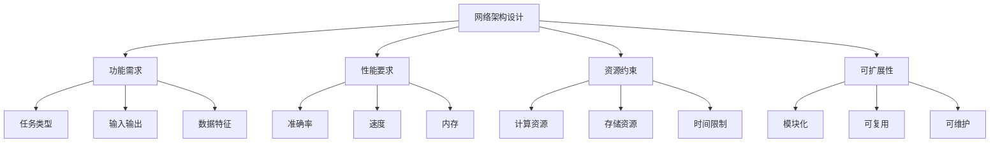
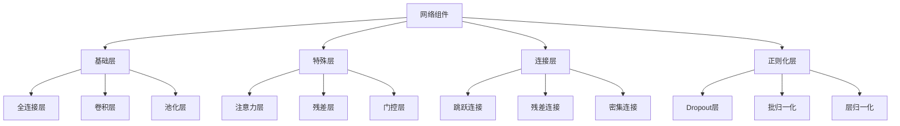

# 网络架构设计

## 🏗️ 网络架构基础

### 1. 架构设计原则

**设计原则：**


**架构类型：**
| 架构类型 | 特点 | 适用场景 | 代表模型 |
|----------|------|----------|----------|
| **前馈网络** | 单向传播 | 分类、回归 | MLP |
| **卷积网络** | 局部连接 | 图像处理 | CNN |
| **循环网络** | 时序建模 | 序列数据 | RNN |
| **注意力网络** | 全局依赖 | 序列到序列 | Transformer |
| **生成网络** | 数据生成 | 生成任务 | GAN |

### 2. 网络组件

**网络组件分类：**


## 🔧 基础网络架构

### 1. 多层感知机（MLP）

**MLP架构设计：**
```python
import numpy as np
import matplotlib.pyplot as plt

class MLPArchitecture:
    """多层感知机架构"""
    
    def __init__(self, input_size, hidden_sizes, output_size, activation='relu'):
        self.input_size = input_size
        self.hidden_sizes = hidden_sizes
        self.output_size = output_size
        self.activation = activation
        
        # 构建网络结构
        self.layers = [input_size] + hidden_sizes + [output_size]
        self.weights = []
        self.biases = []
        
        # 初始化权重和偏置
        for i in range(len(self.layers) - 1):
            w = np.random.randn(self.layers[i], self.layers[i+1]) * np.sqrt(2.0 / self.layers[i])
            b = np.zeros(self.layers[i+1])
            self.weights.append(w)
            self.biases.append(b)
    
    def forward(self, X):
        """前向传播"""
        activations = [X]
        
        for i in range(len(self.weights)):
            z = np.dot(activations[-1], self.weights[i]) + self.biases[i]
            
            if i == len(self.weights) - 1:  # 输出层
                a = self._softmax(z)
            else:  # 隐藏层
                a = self._apply_activation(z)
            
            activations.append(a)
        
        return activations
    
    def _apply_activation(self, z):
        """应用激活函数"""
        if self.activation == 'relu':
            return np.maximum(0, z)
        elif self.activation == 'sigmoid':
            return 1 / (1 + np.exp(-np.clip(z, -250, 250)))
        elif self.activation == 'tanh':
            return np.tanh(z)
        else:
            return z
    
    def _softmax(self, z):
        """Softmax激活函数"""
        exp_z = np.exp(z - np.max(z, axis=1, keepdims=True))
        return exp_z / np.sum(exp_z, axis=1, keepdims=True)
    
    def visualize_architecture(self):
        """可视化网络架构"""
        fig, ax = plt.subplots(1, 1, figsize=(12, 8))
        
        # 绘制网络结构
        layer_positions = np.linspace(0, 10, len(self.layers))
        
        for i, (pos, size) in enumerate(zip(layer_positions, self.layers)):
            # 绘制神经元
            y_positions = np.linspace(-size/2, size/2, size)
            for y in y_positions:
                circle = plt.Circle((pos, y), 0.3, color='lightblue', ec='black')
                ax.add_patch(circle)
            
            # 绘制连接
            if i < len(self.layers) - 1:
                next_pos = layer_positions[i+1]
                next_size = self.layers[i+1]
                next_y_positions = np.linspace(-next_size/2, next_size/2, next_size)
                
                for y1 in y_positions:
                    for y2 in next_y_positions:
                        ax.plot([pos + 0.3, next_pos - 0.3], [y1, y2], 'gray', alpha=0.3)
        
        # 添加标签
        for i, (pos, size) in enumerate(zip(layer_positions, self.layers)):
            if i == 0:
                ax.text(pos, -self.layers[0]/2 - 1, 'Input Layer', ha='center', fontsize=12)
            elif i == len(self.layers) - 1:
                ax.text(pos, -self.layers[-1]/2 - 1, 'Output Layer', ha='center', fontsize=12)
            else:
                ax.text(pos, -max(self.layers)/2 - 1, f'Hidden Layer {i}', ha='center', fontsize=12)
        
        ax.set_xlim(-1, 11)
        ax.set_ylim(-max(self.layers)/2 - 2, max(self.layers)/2 + 1)
        ax.set_aspect('equal')
        ax.axis('off')
        ax.set_title('MLP Architecture', fontsize=16)
        
        plt.tight_layout()
        plt.show()
    
    def analyze_architecture(self):
        """分析网络架构"""
        total_params = 0
        total_connections = 0
        
        print("网络架构分析：")
        print(f"输入层大小: {self.layers[0]}")
        
        for i in range(len(self.layers) - 1):
            layer_params = self.layers[i] * self.layers[i+1] + self.layers[i+1]
            layer_connections = self.layers[i] * self.layers[i+1]
            
            total_params += layer_params
            total_connections += layer_connections
            
            print(f"隐藏层 {i+1} 大小: {self.layers[i+1]}")
            print(f"  参数数量: {layer_params}")
            print(f"  连接数量: {layer_connections}")
        
        print(f"总参数数量: {total_params}")
        print(f"总连接数量: {total_connections}")
        print(f"激活函数: {self.activation}")
        
        return {
            'total_params': total_params,
            'total_connections': total_connections,
            'layers': self.layers
        }

# 测试MLP架构
def test_mlp_architecture():
    """测试MLP架构"""
    # 创建网络
    mlp = MLPArchitecture(input_size=784, hidden_sizes=[128, 64, 32], output_size=10, activation='relu')
    
    # 可视化架构
    mlp.visualize_architecture()
    
    # 分析架构
    analysis = mlp.analyze_architecture()
    
    return mlp, analysis

test_mlp_architecture()
```

### 2. 卷积神经网络（CNN）

**CNN架构设计：**
```python
class CNNArchitecture:
    """卷积神经网络架构"""
    
    def __init__(self, input_shape, conv_layers, fc_layers, output_size):
        self.input_shape = input_shape
        self.conv_layers = conv_layers  # [(filters, kernel_size, stride, padding), ...]
        self.fc_layers = fc_layers
        self.output_size = output_size
        
        # 计算特征图大小
        self.feature_map_sizes = self._calculate_feature_map_sizes()
        
        # 构建网络结构
        self.layers = []
        self._build_network()
    
    def _calculate_feature_map_sizes(self):
        """计算特征图大小"""
        sizes = [self.input_shape]
        current_size = self.input_shape
        
        for filters, kernel_size, stride, padding in self.conv_layers:
            # 卷积层
            if isinstance(current_size, tuple):
                h, w = current_size
            else:
                h = w = current_size
            
            # 计算输出大小
            h_out = (h + 2*padding - kernel_size) // stride + 1
            w_out = (w + 2*padding - kernel_size) // stride + 1
            
            # 池化层（假设2x2最大池化）
            h_out = h_out // 2
            w_out = w_out // 2
            
            current_size = (h_out, w_out)
            sizes.append(current_size)
        
        return sizes
    
    def _build_network(self):
        """构建网络结构"""
        # 输入层
        self.layers.append(('input', self.input_shape))
        
        # 卷积层
        for i, (filters, kernel_size, stride, padding) in enumerate(self.conv_layers):
            self.layers.append(('conv', filters, kernel_size, stride, padding))
            self.layers.append(('pool', 2, 2))  # 2x2最大池化
        
        # 全连接层
        for size in self.fc_layers:
            self.layers.append(('fc', size))
        
        # 输出层
        self.layers.append(('output', self.output_size))
    
    def visualize_architecture(self):
        """可视化CNN架构"""
        fig, ax = plt.subplots(1, 1, figsize=(15, 10))
        
        # 绘制网络结构
        layer_positions = np.linspace(0, 14, len(self.layers))
        
        for i, (pos, layer) in enumerate(zip(layer_positions, self.layers)):
            layer_type = layer[0]
            
            if layer_type == 'input':
                # 输入层
                h, w = layer[1]
                rect = plt.Rectangle((pos-0.5, -h/2), 1, h, color='lightgreen', ec='black')
                ax.add_patch(rect)
                ax.text(pos, -h/2 - 1, f'Input\n{h}x{w}', ha='center', fontsize=10)
            
            elif layer_type == 'conv':
                # 卷积层
                filters, kernel_size, stride, padding = layer[1:]
                h, w = self.feature_map_sizes[i//2 + 1]
                
                # 绘制多个特征图
                for j in range(min(filters, 8)):  # 最多显示8个特征图
                    y_offset = (j - min(filters, 8)/2) * (h + 0.5)
                    rect = plt.Rectangle((pos-0.5, y_offset - h/2), 1, h, 
                                       color='lightblue', ec='black', alpha=0.7)
                    ax.add_patch(rect)
                
                ax.text(pos, -h/2 - 2, f'Conv\n{filters} filters\n{kernel_size}x{kernel_size}', 
                       ha='center', fontsize=9)
            
            elif layer_type == 'pool':
                # 池化层
                h, w = self.feature_map_sizes[i//2 + 1]
                rect = plt.Rectangle((pos-0.5, -h/2), 1, h, color='lightyellow', ec='black')
                ax.add_patch(rect)
                ax.text(pos, -h/2 - 1, 'Pool\n2x2', ha='center', fontsize=10)
            
            elif layer_type == 'fc':
                # 全连接层
                size = layer[1]
                y_positions = np.linspace(-size/2, size/2, min(size, 20))
                for y in y_positions:
                    circle = plt.Circle((pos, y), 0.2, color='lightcoral', ec='black')
                    ax.add_patch(circle)
                ax.text(pos, -size/2 - 1, f'FC\n{size}', ha='center', fontsize=10)
            
            elif layer_type == 'output':
                # 输出层
                size = layer[1]
                y_positions = np.linspace(-size/2, size/2, size)
                for y in y_positions:
                    circle = plt.Circle((pos, y), 0.3, color='lightpink', ec='black')
                    ax.add_patch(circle)
                ax.text(pos, -size/2 - 1, f'Output\n{size}', ha='center', fontsize=10)
        
        ax.set_xlim(-1, 15)
        ax.set_ylim(-10, 10)
        ax.set_aspect('equal')
        ax.axis('off')
        ax.set_title('CNN Architecture', fontsize=16)
        
        plt.tight_layout()
        plt.show()
    
    def analyze_architecture(self):
        """分析CNN架构"""
        total_params = 0
        
        print("CNN架构分析：")
        print(f"输入形状: {self.input_shape}")
        
        # 分析卷积层
        for i, (filters, kernel_size, stride, padding) in enumerate(self.conv_layers):
            if i == 0:
                input_channels = self.input_shape[2] if len(self.input_shape) > 2 else 1
            else:
                input_channels = self.conv_layers[i-1][0]
            
            # 卷积层参数
            conv_params = input_channels * filters * kernel_size * kernel_size + filters
            total_params += conv_params
            
            print(f"卷积层 {i+1}:")
            print(f"  输入通道: {input_channels}")
            print(f"  输出通道: {filters}")
            print(f"  卷积核大小: {kernel_size}x{kernel_size}")
            print(f"  参数数量: {conv_params}")
        
        # 分析全连接层
        # 计算最后一个卷积层的输出大小
        last_conv_size = self.feature_map_sizes[-1]
        if isinstance(last_conv_size, tuple):
            fc_input_size = last_conv_size[0] * last_conv_size[1] * self.conv_layers[-1][0]
        else:
            fc_input_size = last_conv_size * self.conv_layers[-1][0]
        
        for i, fc_size in enumerate(self.fc_layers):
            if i == 0:
                input_size = fc_input_size
            else:
                input_size = self.fc_layers[i-1]
            
            fc_params = input_size * fc_size + fc_size
            total_params += fc_params
            
            print(f"全连接层 {i+1}:")
            print(f"  输入大小: {input_size}")
            print(f"  输出大小: {fc_size}")
            print(f"  参数数量: {fc_params}")
        
        # 输出层
        output_params = self.fc_layers[-1] * self.output_size + self.output_size
        total_params += output_params
        
        print(f"输出层:")
        print(f"  输入大小: {self.fc_layers[-1]}")
        print(f"  输出大小: {self.output_size}")
        print(f"  参数数量: {output_params}")
        
        print(f"总参数数量: {total_params}")
        
        return {
            'total_params': total_params,
            'conv_layers': len(self.conv_layers),
            'fc_layers': len(self.fc_layers)
        }

# 测试CNN架构
def test_cnn_architecture():
    """测试CNN架构"""
    # 创建网络
    cnn = CNNArchitecture(
        input_shape=(28, 28, 1),
        conv_layers=[(32, 3, 1, 1), (64, 3, 1, 1), (128, 3, 1, 1)],
        fc_layers=[512, 256],
        output_size=10
    )
    
    # 可视化架构
    cnn.visualize_architecture()
    
    # 分析架构
    analysis = cnn.analyze_architecture()
    
    return cnn, analysis

test_cnn_architecture()
```

### 3. 循环神经网络（RNN）

**RNN架构设计：**
```python
class RNNArchitecture:
    """循环神经网络架构"""
    
    def __init__(self, input_size, hidden_size, output_size, num_layers=1, rnn_type='LSTM'):
        self.input_size = input_size
        self.hidden_size = hidden_size
        self.output_size = output_size
        self.num_layers = num_layers
        self.rnn_type = rnn_type
        
        # 构建网络结构
        self.layers = []
        self._build_network()
    
    def _build_network(self):
        """构建网络结构"""
        # 输入层
        self.layers.append(('input', self.input_size))
        
        # RNN层
        for i in range(self.num_layers):
            self.layers.append((self.rnn_type.lower(), self.hidden_size))
        
        # 输出层
        self.layers.append(('output', self.output_size))
    
    def visualize_architecture(self, sequence_length=5):
        """可视化RNN架构"""
        fig, ax = plt.subplots(1, 1, figsize=(15, 10))
        
        # 绘制时间步
        time_positions = np.linspace(0, 12, sequence_length)
        
        for t, time_pos in enumerate(time_positions):
            # 输入层
            input_circle = plt.Circle((time_pos, 2), 0.3, color='lightgreen', ec='black')
            ax.add_patch(input_circle)
            ax.text(time_pos, 2, f'x{t}', ha='center', va='center', fontsize=10)
            
            # 隐藏层
            for layer in range(self.num_layers):
                hidden_circle = plt.Circle((time_pos, 0), 0.4, color='lightblue', ec='black')
                ax.add_patch(hidden_circle)
                ax.text(time_pos, 0, f'h{layer}\n{t}', ha='center', va='center', fontsize=9)
            
            # 输出层
            output_circle = plt.Circle((time_pos, -2), 0.3, color='lightcoral', ec='black')
            ax.add_patch(output_circle)
            ax.text(time_pos, -2, f'y{t}', ha='center', va='center', fontsize=10)
            
            # 连接线
            if t > 0:
                # 时间连接
                for layer in range(self.num_layers):
                    ax.plot([time_positions[t-1] + 0.4, time_pos - 0.4], [0, 0], 'red', linewidth=2)
            
            # 垂直连接
            ax.plot([time_pos, time_pos], [1.7, 0.4], 'black', linewidth=1)
            ax.plot([time_pos, time_pos], [-0.4, -1.7], 'black', linewidth=1)
        
        # 添加标签
        ax.text(6, 3, 'Input Sequence', ha='center', fontsize=12, weight='bold')
        ax.text(6, 1, f'{self.rnn_type} Layers', ha='center', fontsize=12, weight='bold')
        ax.text(6, -1, 'Output Sequence', ha='center', fontsize=12, weight='bold')
        
        ax.set_xlim(-1, 13)
        ax.set_ylim(-4, 4)
        ax.set_aspect('equal')
        ax.axis('off')
        ax.set_title(f'{self.rnn_type} Architecture', fontsize=16)
        
        plt.tight_layout()
        plt.show()
    
    def analyze_architecture(self):
        """分析RNN架构"""
        total_params = 0
        
        print(f"{self.rnn_type}架构分析：")
        print(f"输入大小: {self.input_size}")
        print(f"隐藏层大小: {self.hidden_size}")
        print(f"层数: {self.num_layers}")
        print(f"输出大小: {self.output_size}")
        
        # 分析RNN层参数
        for i in range(self.num_layers):
            if i == 0:
                input_size = self.input_size
            else:
                input_size = self.hidden_size
            
            if self.rnn_type == 'LSTM':
                # LSTM参数: 4 * (input_size + hidden_size + 1) * hidden_size
                lstm_params = 4 * (input_size + self.hidden_size + 1) * self.hidden_size
                total_params += lstm_params
                print(f"LSTM层 {i+1}: {lstm_params} 参数")
            elif self.rnn_type == 'GRU':
                # GRU参数: 3 * (input_size + hidden_size + 1) * hidden_size
                gru_params = 3 * (input_size + self.hidden_size + 1) * self.hidden_size
                total_params += gru_params
                print(f"GRU层 {i+1}: {gru_params} 参数")
            else:  # 普通RNN
                # RNN参数: (input_size + hidden_size + 1) * hidden_size
                rnn_params = (input_size + self.hidden_size + 1) * self.hidden_size
                total_params += rnn_params
                print(f"RNN层 {i+1}: {rnn_params} 参数")
        
        # 输出层参数
        output_params = self.hidden_size * self.output_size + self.output_size
        total_params += output_params
        
        print(f"输出层: {output_params} 参数")
        print(f"总参数数量: {total_params}")
        
        return {
            'total_params': total_params,
            'rnn_type': self.rnn_type,
            'num_layers': self.num_layers
        }

# 测试RNN架构
def test_rnn_architecture():
    """测试RNN架构"""
    # 创建LSTM网络
    lstm = RNNArchitecture(
        input_size=128,
        hidden_size=256,
        output_size=10,
        num_layers=2,
        rnn_type='LSTM'
    )
    
    # 可视化架构
    lstm.visualize_architecture(sequence_length=5)
    
    # 分析架构
    analysis = lstm.analyze_architecture()
    
    return lstm, analysis

test_rnn_architecture()
```

## 🔗 相关链接
- [[02-02-01-神经网络原理]] - 神经网络
- [[02-02-02-反向传播算法]] - 反向传播
- [[02-02-03-激活函数详解]] - 激活函数
- [[02-02-04-优化算法对比]] - 优化算法

## 💡 网络架构设计建议

**设计原则：**
- 🎯 **任务导向**：根据具体任务设计网络架构
- 📊 **数据特征**：考虑输入数据的特征和规模
- 🔍 **性能要求**：平衡准确率和计算效率
- ⚡ **资源约束**：考虑计算和存储资源限制

**实践建议：**
- 📝 **模块化设计**：使用模块化设计提高可维护性
- 💻 **渐进式构建**：从简单架构开始，逐步增加复杂度
- 📊 **性能监控**：监控网络性能和资源使用
- 🔍 **架构搜索**：使用自动化方法搜索最优架构

---
*📝 学习提示：网络架构设计是深度学习的重要环节，建议理解各种架构的特点，根据实际问题设计合适的网络结构*

