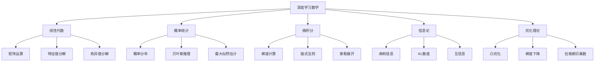

# 深度学习数学基础

## 🧮 深度学习数学框架

### 1. 数学基础体系

**深度学习数学框架：**


### 2. 核心数学概念

**深度学习中的数学概念：**
| 数学领域 | 核心概念 | 深度学习应用 | 重要性 |
|----------|----------|--------------|--------|
| **线性代数** | 矩阵运算、特征值 | 神经网络计算 | ⭐⭐⭐⭐⭐ |
| **概率统计** | 概率分布、贝叶斯 | 不确定性建模 | ⭐⭐⭐⭐⭐ |
| **微积分** | 梯度、链式法则 | 反向传播 | ⭐⭐⭐⭐⭐ |
| **信息论** | 熵、互信息 | 损失函数设计 | ⭐⭐⭐⭐ |
| **优化理论** | 凸优化、梯度下降 | 参数优化 | ⭐⭐⭐⭐⭐ |

## 📊 线性代数在深度学习中的应用

### 1. 矩阵运算

**神经网络中的矩阵运算：**
```python
import numpy as np
import matplotlib.pyplot as plt

class LinearAlgebraInDL:
    """深度学习中的线性代数"""
    
    def __init__(self):
        self.examples = {}
    
    def matrix_multiplication_in_neural_networks(self):
        """神经网络中的矩阵乘法"""
        # 前向传播: y = Wx + b
        # 其中 W 是权重矩阵，x 是输入向量，b 是偏置向量
        
        # 示例：单层神经网络
        input_size = 3
        hidden_size = 4
        output_size = 2
        
        # 权重矩阵
        W1 = np.random.randn(input_size, hidden_size) * 0.1
        W2 = np.random.randn(hidden_size, output_size) * 0.1
        
        # 偏置向量
        b1 = np.zeros(hidden_size)
        b2 = np.zeros(output_size)
        
        # 输入数据
        X = np.random.randn(5, input_size)  # 5个样本
        
        # 前向传播
        # 第一层
        Z1 = X @ W1 + b1  # 矩阵乘法
        A1 = np.maximum(0, Z1)  # ReLU激活
        
        # 第二层
        Z2 = A1 @ W2 + b2  # 矩阵乘法
        A2 = 1 / (1 + np.exp(-Z2))  # Sigmoid激活
        
        print("神经网络前向传播示例：")
        print(f"输入形状: {X.shape}")
        print(f"第一层输出形状: {A1.shape}")
        print(f"最终输出形状: {A2.shape}")
        
        # 可视化矩阵运算
        self._visualize_matrix_operations(X, W1, A1, W2, A2)
        
        return X, W1, A1, W2, A2
    
    def _visualize_matrix_operations(self, X, W1, A1, W2, A2):
        """可视化矩阵运算"""
        fig, axes = plt.subplots(2, 3, figsize=(15, 10))
        
        # 输入矩阵
        im1 = axes[0, 0].imshow(X, cmap='viridis', aspect='auto')
        axes[0, 0].set_title('Input X')
        axes[0, 0].set_xlabel('Features')
        axes[0, 0].set_ylabel('Samples')
        plt.colorbar(im1, ax=axes[0, 0])
        
        # 权重矩阵1
        im2 = axes[0, 1].imshow(W1, cmap='viridis', aspect='auto')
        axes[0, 1].set_title('Weight W1')
        axes[0, 1].set_xlabel('Hidden Units')
        axes[0, 1].set_ylabel('Input Features')
        plt.colorbar(im2, ax=axes[0, 1])
        
        # 隐藏层输出
        im3 = axes[0, 2].imshow(A1, cmap='viridis', aspect='auto')
        axes[0, 2].set_title('Hidden Layer A1')
        axes[0, 2].set_xlabel('Hidden Units')
        axes[0, 2].set_ylabel('Samples')
        plt.colorbar(im3, ax=axes[0, 2])
        
        # 权重矩阵2
        im4 = axes[1, 0].imshow(W2, cmap='viridis', aspect='auto')
        axes[1, 0].set_title('Weight W2')
        axes[1, 0].set_xlabel('Output Units')
        axes[1, 0].set_ylabel('Hidden Units')
        plt.colorbar(im4, ax=axes[1, 0])
        
        # 最终输出
        im5 = axes[1, 1].imshow(A2, cmap='viridis', aspect='auto')
        axes[1, 1].set_title('Output A2')
        axes[1, 1].set_xlabel('Output Units')
        axes[1, 1].set_ylabel('Samples')
        plt.colorbar(im5, ax=axes[1, 1])
        
        # 矩阵乘法示意图
        axes[1, 2].text(0.5, 0.5, 'X @ W1 = A1\nA1 @ W2 = A2', 
                       ha='center', va='center', fontsize=14, 
                       bbox=dict(boxstyle="round,pad=0.3", facecolor="lightblue"))
        axes[1, 2].set_xlim(0, 1)
        axes[1, 2].set_ylim(0, 1)
        axes[1, 2].axis('off')
        axes[1, 2].set_title('Matrix Operations')
        
        plt.tight_layout()
        plt.show()
    
    def eigenvalue_decomposition_in_pca(self):
        """特征值分解在PCA中的应用"""
        # 生成数据
        np.random.seed(42)
        n_samples = 1000
        n_features = 10
        
        # 创建相关数据
        X = np.random.randn(n_samples, n_features)
        # 添加相关性
        X[:, 1] = X[:, 0] + 0.5 * np.random.randn(n_samples)
        X[:, 2] = X[:, 0] - 0.3 * X[:, 1] + 0.2 * np.random.randn(n_samples)
        
        # 中心化数据
        X_centered = X - np.mean(X, axis=0)
        
        # 计算协方差矩阵
        cov_matrix = np.cov(X_centered.T)
        
        # 特征值分解
        eigenvalues, eigenvectors = np.linalg.eigh(cov_matrix)
        
        # 按特征值降序排列
        idx = np.argsort(eigenvalues)[::-1]
        eigenvalues = eigenvalues[idx]
        eigenvectors = eigenvectors[:, idx]
        
        # 选择前两个主成分
        principal_components = eigenvectors[:, :2]
        
        # 投影到主成分空间
        X_pca = X_centered @ principal_components
        
        # 可视化
        fig, axes = plt.subplots(2, 2, figsize=(12, 10))
        
        # 原始数据（前两个特征）
        axes[0, 0].scatter(X[:, 0], X[:, 1], alpha=0.6)
        axes[0, 0].set_xlabel('Feature 1')
        axes[0, 0].set_ylabel('Feature 2')
        axes[0, 0].set_title('Original Data')
        axes[0, 0].grid(True)
        
        # PCA结果
        axes[0, 1].scatter(X_pca[:, 0], X_pca[:, 1], alpha=0.6)
        axes[0, 1].set_xlabel('PC1')
        axes[0, 1].set_ylabel('PC2')
        axes[0, 1].set_title('PCA Result')
        axes[0, 1].grid(True)
        
        # 特征值
        axes[1, 0].bar(range(len(eigenvalues)), eigenvalues)
        axes[1, 0].set_xlabel('Component')
        axes[1, 0].set_ylabel('Eigenvalue')
        axes[1, 0].set_title('Eigenvalues')
        axes[1, 0].grid(True)
        
        # 解释方差比
        explained_variance_ratio = eigenvalues / np.sum(eigenvalues)
        axes[1, 1].bar(range(len(explained_variance_ratio)), explained_variance_ratio)
        axes[1, 1].set_xlabel('Component')
        axes[1, 1].set_ylabel('Explained Variance Ratio')
        axes[1, 1].set_title('Explained Variance Ratio')
        axes[1, 1].grid(True)
        
        plt.tight_layout()
        plt.show()
        
        print(f"前两个主成分解释方差比: {explained_variance_ratio[:2].sum():.3f}")
        
        return X_pca, eigenvalues, eigenvectors

# 测试线性代数应用
def test_linear_algebra():
    """测试线性代数在深度学习中的应用"""
    linalg = LinearAlgebraInDL()
    
    # 矩阵运算
    X, W1, A1, W2, A2 = linalg.matrix_multiplication_in_neural_networks()
    
    # 特征值分解
    X_pca, eigenvalues, eigenvectors = linalg.eigenvalue_decomposition_in_pca()
    
    return linalg

test_linear_algebra()
```

### 2. 奇异值分解（SVD）

**SVD在深度学习中的应用：**
```python
class SVDInDeepLearning:
    """深度学习中的奇异值分解"""
    
    def __init__(self):
        self.examples = {}
    
    def svd_in_matrix_factorization(self):
        """SVD在矩阵分解中的应用"""
        # 生成用户-物品评分矩阵
        np.random.seed(42)
        n_users = 100
        n_items = 50
        n_factors = 10
        
        # 创建低秩矩阵
        U = np.random.randn(n_users, n_factors)
        V = np.random.randn(n_factors, n_items)
        R = U @ V  # 真实评分矩阵
        
        # 添加噪声
        noise = np.random.normal(0, 0.1, R.shape)
        R_noisy = R + noise
        
        # 随机缺失一些评分
        mask = np.random.random(R_noisy.shape) > 0.3
        R_masked = R_noisy * mask
        
        # SVD分解
        U_svd, S, Vt_svd = np.linalg.svd(R_masked, full_matrices=False)
        
        # 选择前k个奇异值
        k = 10
        U_k = U_svd[:, :k]
        S_k = S[:k]
        Vt_k = Vt_svd[:k, :]
        
        # 重构矩阵
        R_reconstructed = U_k @ np.diag(S_k) @ Vt_k
        
        # 可视化
        fig, axes = plt.subplots(2, 2, figsize=(12, 10))
        
        # 原始矩阵
        im1 = axes[0, 0].imshow(R, cmap='viridis', aspect='auto')
        axes[0, 0].set_title('Original Matrix')
        axes[0, 0].set_xlabel('Items')
        axes[0, 0].set_ylabel('Users')
        plt.colorbar(im1, ax=axes[0, 0])
        
        # 带噪声的矩阵
        im2 = axes[0, 1].imshow(R_noisy, cmap='viridis', aspect='auto')
        axes[0, 1].set_title('Noisy Matrix')
        axes[0, 1].set_xlabel('Items')
        axes[0, 1].set_ylabel('Users')
        plt.colorbar(im2, ax=axes[0, 1])
        
        # 缺失数据的矩阵
        im3 = axes[1, 0].imshow(R_masked, cmap='viridis', aspect='auto')
        axes[1, 0].set_title('Matrix with Missing Data')
        axes[1, 0].set_xlabel('Items')
        axes[1, 0].set_ylabel('Users')
        plt.colorbar(im3, ax=axes[1, 0])
        
        # 重构矩阵
        im4 = axes[1, 1].imshow(R_reconstructed, cmap='viridis', aspect='auto')
        axes[1, 1].set_title('Reconstructed Matrix')
        axes[1, 1].set_xlabel('Items')
        axes[1, 1].set_ylabel('Users')
        plt.colorbar(im4, ax=axes[1, 1])
        
        plt.tight_layout()
        plt.show()
        
        # 计算重构误差
        reconstruction_error = np.mean((R - R_reconstructed)**2)
        print(f"重构误差: {reconstruction_error:.4f}")
        
        return R, R_reconstructed, S
    
    def svd_in_compression(self):
        """SVD在数据压缩中的应用"""
        # 加载图像数据
        from sklearn.datasets import load_digits
        
        digits = load_digits()
        X = digits.images[0]  # 使用第一个数字图像
        
        # SVD分解
        U, S, Vt = np.linalg.svd(X, full_matrices=False)
        
        # 不同压缩比的重构
        compression_ratios = [0.1, 0.3, 0.5, 0.7, 0.9]
        reconstructions = []
        
        for ratio in compression_ratios:
            k = int(len(S) * ratio)
            U_k = U[:, :k]
            S_k = S[:k]
            Vt_k = Vt[:k, :]
            
            X_reconstructed = U_k @ np.diag(S_k) @ Vt_k
            reconstructions.append(X_reconstructed)
        
        # 可视化
        fig, axes = plt.subplots(2, 3, figsize=(15, 10))
        
        # 原始图像
        axes[0, 0].imshow(X, cmap='gray')
        axes[0, 0].set_title('Original Image')
        axes[0, 0].axis('off')
        
        # 不同压缩比的重构
        for i, (ratio, reconstruction) in enumerate(zip(compression_ratios, reconstructions)):
            row = i // 3
            col = i % 3 + 1
            
            axes[row, col].imshow(reconstruction, cmap='gray')
            axes[row, col].set_title(f'Compression Ratio: {ratio:.1f}')
            axes[row, col].axis('off')
        
        plt.tight_layout()
        plt.show()
        
        # 计算压缩比和误差
        print("压缩比和重构误差：")
        for ratio, reconstruction in zip(compression_ratios, reconstructions):
            k = int(len(S) * ratio)
            compression_ratio = (k * (U.shape[0] + Vt.shape[1]) + k) / (U.shape[0] * Vt.shape[1])
            error = np.mean((X - reconstruction)**2)
            print(f"压缩比: {ratio:.1f}, 实际压缩比: {compression_ratio:.3f}, 误差: {error:.4f}")
        
        return X, reconstructions, S

# 测试SVD应用
def test_svd():
    """测试SVD在深度学习中的应用"""
    svd = SVDInDeepLearning()
    
    # 矩阵分解
    R, R_reconstructed, S1 = svd.svd_in_matrix_factorization()
    
    # 数据压缩
    X, reconstructions, S2 = svd.svd_in_compression()
    
    return svd

test_svd()
```

## 📈 概率统计在深度学习中的应用

### 1. 概率分布

**深度学习中的概率分布：**
```python
class ProbabilityInDeepLearning:
    """深度学习中的概率统计"""
    
    def __init__(self):
        self.distributions = {}
    
    def probability_distributions_in_dl(self):
        """深度学习中的概率分布"""
        # 1. 高斯分布 - 权重初始化
        mu, sigma = 0, 0.1
        weights_gaussian = np.random.normal(mu, sigma, 1000)
        
        # 2. 均匀分布 - 权重初始化
        weights_uniform = np.random.uniform(-0.1, 0.1, 1000)
        
        # 3. 伯努利分布 - Dropout
        dropout_mask = np.random.binomial(1, 0.5, 1000)
        
        # 4. 多项分布 - 分类输出
        probabilities = np.array([0.1, 0.2, 0.3, 0.4])
        categorical_samples = np.random.multinomial(100, probabilities)
        
        # 可视化
        fig, axes = plt.subplots(2, 2, figsize=(12, 10))
        
        # 高斯分布
        axes[0, 0].hist(weights_gaussian, bins=50, alpha=0.7, density=True)
        x = np.linspace(-0.5, 0.5, 100)
        y = (1/(sigma * np.sqrt(2 * np.pi))) * np.exp(-0.5 * ((x - mu) / sigma)**2)
        axes[0, 0].plot(x, y, 'r-', linewidth=2)
        axes[0, 0].set_title('Gaussian Distribution (Weight Initialization)')
        axes[0, 0].set_xlabel('Weight Value')
        axes[0, 0].set_ylabel('Density')
        axes[0, 0].grid(True)
        
        # 均匀分布
        axes[0, 1].hist(weights_uniform, bins=50, alpha=0.7, density=True)
        axes[0, 1].axhline(y=5, color='r', linewidth=2)  # 均匀分布密度
        axes[0, 1].set_title('Uniform Distribution (Weight Initialization)')
        axes[0, 1].set_xlabel('Weight Value')
        axes[0, 1].set_ylabel('Density')
        axes[0, 1].grid(True)
        
        # 伯努利分布
        axes[1, 0].hist(dropout_mask, bins=2, alpha=0.7, density=True)
        axes[1, 0].set_title('Bernoulli Distribution (Dropout)')
        axes[1, 0].set_xlabel('Dropout Mask')
        axes[1, 0].set_ylabel('Density')
        axes[1, 0].grid(True)
        
        # 多项分布
        axes[1, 1].bar(range(len(categorical_samples)), categorical_samples)
        axes[1, 1].set_title('Multinomial Distribution (Classification)')
        axes[1, 1].set_xlabel('Class')
        axes[1, 1].set_ylabel('Count')
        axes[1, 1].grid(True)
        
        plt.tight_layout()
        plt.show()
        
        return weights_gaussian, weights_uniform, dropout_mask, categorical_samples
    
    def bayesian_neural_networks(self):
        """贝叶斯神经网络"""
        # 贝叶斯神经网络中的不确定性
        np.random.seed(42)
        
        # 生成数据
        X = np.linspace(-3, 3, 100).reshape(-1, 1)
        y_true = np.sin(X.flatten()) + 0.1 * np.random.randn(100)
        
        # 多次采样得到不确定性
        n_samples = 100
        predictions = []
        
        for _ in range(n_samples):
            # 模拟权重不确定性
            w1 = np.random.normal(1.0, 0.1)
            w2 = np.random.normal(0.5, 0.05)
            b = np.random.normal(0.0, 0.1)
            
            # 预测
            y_pred = w1 * np.sin(X.flatten()) + w2 * X.flatten() + b
            predictions.append(y_pred)
        
        predictions = np.array(predictions)
        
        # 计算均值和标准差
        mean_pred = np.mean(predictions, axis=0)
        std_pred = np.std(predictions, axis=0)
        
        # 可视化
        plt.figure(figsize=(12, 8))
        
        # 数据点
        plt.scatter(X.flatten(), y_true, alpha=0.6, label='True Data')
        
        # 预测均值
        plt.plot(X.flatten(), mean_pred, 'r-', linewidth=2, label='Mean Prediction')
        
        # 不确定性区间
        plt.fill_between(X.flatten(), 
                        mean_pred - 2*std_pred, 
                        mean_pred + 2*std_pred, 
                        alpha=0.3, color='red', label='95% Confidence Interval')
        
        plt.xlabel('X')
        plt.ylabel('Y')
        plt.title('Bayesian Neural Network Uncertainty')
        plt.legend()
        plt.grid(True)
        plt.show()
        
        return X, y_true, predictions, mean_pred, std_pred

# 测试概率统计应用
def test_probability():
    """测试概率统计在深度学习中的应用"""
    prob = ProbabilityInDeepLearning()
    
    # 概率分布
    weights_gaussian, weights_uniform, dropout_mask, categorical_samples = prob.probability_distributions_in_dl()
    
    # 贝叶斯神经网络
    X, y_true, predictions, mean_pred, std_pred = prob.bayesian_neural_networks()
    
    return prob

test_probability()
```

## 🔗 相关链接
- [[01-02-01-线性代数基础]] - 线性代数
- [[01-02-02-概率论与统计学]] - 概率统计
- [[01-02-03-微积分基础]] - 微积分
- [[01-02-04-信息论基础]] - 信息论

## 💡 深度学习数学学习建议

**学习策略：**
- 🧮 **理解概念**：深入理解数学概念的本质
- 🔄 **建立联系**：建立数学概念与深度学习的联系
- 💻 **动手实践**：通过编程实践加深理解
- 📊 **可视化分析**：通过可视化理解数学概念

**实践建议：**
- 📝 **推导公式**：推导深度学习中的数学公式
- 🔍 **代码实现**：实现数学概念的代码
- 📊 **结果分析**：分析数学概念的应用效果
- 🎯 **问题解决**：用数学方法解决实际问题

---
*📝 学习提示：深度学习数学是理解深度学习的基础，建议深入理解各种数学概念，建立数学与深度学习的联系*

