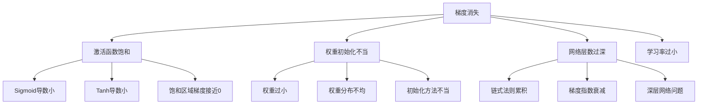
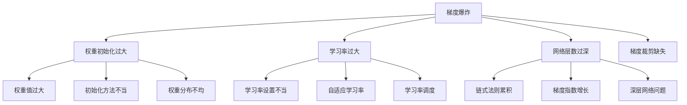

# 梯度消失与爆炸

## 🔍 梯度问题分析

### 1. 梯度消失问题

**梯度消失定义：**
> **梯度消失是指在深层神经网络中，梯度在反向传播过程中逐渐减小，导致浅层网络参数更新缓慢或停止更新的现象**

**梯度消失原因：**


**梯度消失检测：**
```python
import numpy as np
import matplotlib.pyplot as plt

class GradientVanishingAnalysis:
    """梯度消失问题分析"""
    
    def __init__(self, layers, activation='sigmoid'):
        self.layers = layers
        self.activation = activation
        self.weights = []
        self.biases = []
        
        # 初始化权重和偏置
        for i in range(len(layers) - 1):
            w = np.random.randn(layers[i], layers[i+1]) * 0.1
            b = np.zeros(layers[i+1])
            self.weights.append(w)
            self.biases.append(b)
    
    def forward(self, X):
        """前向传播"""
        activations = [X]
        net_inputs = []
        
        for i in range(len(self.weights)):
            z = np.dot(activations[-1], self.weights[i]) + self.biases[i]
            net_inputs.append(z)
            
            if i == len(self.weights) - 1:  # 输出层
                a = self._softmax(z)
            else:  # 隐藏层
                a = self._apply_activation(z)
            
            activations.append(a)
        
        return activations, net_inputs
    
    def backward(self, y_true, y_pred, activations, net_inputs):
        """反向传播"""
        m = y_true.shape[0]
        
        # 计算输出层误差
        error = y_pred - y_true
        
        # 存储梯度
        dW = []
        db = []
        gradients = []
        
        # 反向传播
        for i in range(len(self.weights) - 1, -1, -1):
            # 计算权重和偏置的梯度
            dW_i = np.dot(activations[i].T, error) / m
            db_i = np.sum(error, axis=0) / m
            
            dW.insert(0, dW_i)
            db.insert(0, db_i)
            
            # 计算梯度范数
            grad_norm = np.linalg.norm(dW_i)
            gradients.append(grad_norm)
            
            # 计算前一层的误差
            if i > 0:
                error = np.dot(error, self.weights[i].T)
                error *= self._activation_derivative(net_inputs[i-1])
        
        return dW, db, gradients
    
    def _apply_activation(self, z):
        """应用激活函数"""
        if self.activation == 'sigmoid':
            return 1 / (1 + np.exp(-np.clip(z, -250, 250)))
        elif self.activation == 'relu':
            return np.maximum(0, z)
        elif self.activation == 'tanh':
            return np.tanh(z)
        else:
            return z
    
    def _activation_derivative(self, z):
        """激活函数导数"""
        if self.activation == 'sigmoid':
            s = 1 / (1 + np.exp(-np.clip(z, -250, 250)))
            return s * (1 - s)
        elif self.activation == 'relu':
            return (z > 0).astype(float)
        elif self.activation == 'tanh':
            return 1 - np.tanh(z) ** 2
        else:
            return np.ones_like(z)
    
    def _softmax(self, z):
        """Softmax激活函数"""
        exp_z = np.exp(z - np.max(z, axis=1, keepdims=True))
        return exp_z / np.sum(exp_z, axis=1, keepdims=True)
    
    def analyze_gradient_flow(self, X, y):
        """分析梯度流"""
        # 前向传播
        activations, net_inputs = self.forward(X)
        y_pred = activations[-1]
        
        # 反向传播
        dW, db, gradients = self.backward(y, y_pred, activations, net_inputs)
        
        # 可视化梯度流
        fig, axes = plt.subplots(2, 2, figsize=(15, 10))
        
        # 梯度范数
        layer_names = [f'Layer {i+1}' for i in range(len(gradients))]
        axes[0, 0].bar(layer_names, gradients)
        axes[0, 0].set_title('Gradient Norms')
        axes[0, 0].set_ylabel('Gradient Norm')
        axes[0, 0].tick_params(axis='x', rotation=45)
        
        # 梯度分布
        for i, grad in enumerate(dW):
            axes[0, 1].hist(grad.flatten(), alpha=0.7, label=f'Layer {i+1}')
        axes[0, 1].set_title('Gradient Distributions')
        axes[0, 1].set_xlabel('Gradient Value')
        axes[0, 1].set_ylabel('Frequency')
        axes[0, 1].legend()
        
        # 权重分布
        for i, weight in enumerate(self.weights):
            axes[1, 0].hist(weight.flatten(), alpha=0.7, label=f'Layer {i+1}')
        axes[1, 0].set_title('Weight Distributions')
        axes[1, 0].set_xlabel('Weight Value')
        axes[1, 0].set_ylabel('Frequency')
        axes[1, 0].legend()
        
        # 激活值分布
        for i, activation in enumerate(activations[1:]):
            axes[1, 1].hist(activation.flatten(), alpha=0.7, label=f'Layer {i+1}')
        axes[1, 1].set_title('Activation Distributions')
        axes[1, 1].set_xlabel('Activation Value')
        axes[1, 1].set_ylabel('Frequency')
        axes[1, 1].legend()
        
        plt.tight_layout()
        plt.show()
        
        return gradients, dW, db
    
    def compare_activations(self, X, y):
        """比较不同激活函数的梯度流"""
        activations = ['sigmoid', 'relu', 'tanh']
        results = {}
        
        for activation in activations:
            # 创建网络
            gva = GradientVanishingAnalysis(self.layers, activation=activation)
            
            # 分析梯度流
            gradients, dW, db = gva.analyze_gradient_flow(X, y)
            results[activation] = {
                'gradients': gradients,
                'dW': dW,
                'db': db
            }
        
        # 比较结果
        fig, axes = plt.subplots(1, 2, figsize=(15, 5))
        
        # 梯度范数比较
        for activation, result in results.items():
            axes[0].plot(result['gradients'], 'o-', label=activation)
        axes[0].set_title('Gradient Norms Comparison')
        axes[0].set_xlabel('Layer')
        axes[0].set_ylabel('Gradient Norm')
        axes[0].legend()
        axes[0].grid(True)
        
        # 梯度方差比较
        for activation, result in results.items():
            variances = [np.var(grad) for grad in result['dW']]
            axes[1].plot(variances, 'o-', label=activation)
        axes[1].set_title('Gradient Variances Comparison')
        axes[1].set_xlabel('Layer')
        axes[1].set_ylabel('Gradient Variance')
        axes[1].legend()
        axes[1].grid(True)
        
        plt.tight_layout()
        plt.show()
        
        return results

# 测试梯度消失分析
def test_gradient_vanishing():
    """测试梯度消失分析"""
    # 生成数据
    np.random.seed(42)
    X = np.random.randn(1000, 2)
    y = (X[:, 0] + X[:, 1] > 0).astype(int)
    
    # 转换为one-hot编码
    y_onehot = np.zeros((len(y), 2))
    y_onehot[np.arange(len(y)), y] = 1
    
    # 创建深层网络
    gva = GradientVanishingAnalysis([2, 10, 10, 10, 2], activation='sigmoid')
    
    # 分析梯度流
    gradients, dW, db = gva.analyze_gradient_flow(X, y_onehot)
    
    # 比较不同激活函数
    results = gva.compare_activations(X, y_onehot)
    
    return gva, results

test_gradient_vanishing()
```

### 2. 梯度爆炸问题

**梯度爆炸定义：**
> **梯度爆炸是指在深层神经网络中，梯度在反向传播过程中逐渐增大，导致参数更新过大，网络训练不稳定的现象**

**梯度爆炸原因：**


**梯度爆炸检测：**
```python
class GradientExplodingAnalysis:
    """梯度爆炸问题分析"""
    
    def __init__(self, layers, activation='relu'):
        self.layers = layers
        self.activation = activation
        self.weights = []
        self.biases = []
        
        # 初始化权重和偏置（可能导致梯度爆炸）
        for i in range(len(layers) - 1):
            w = np.random.randn(layers[i], layers[i+1]) * 2.0  # 权重过大
            b = np.zeros(layers[i+1])
            self.weights.append(w)
            self.biases.append(b)
    
    def forward(self, X):
        """前向传播"""
        activations = [X]
        net_inputs = []
        
        for i in range(len(self.weights)):
            z = np.dot(activations[-1], self.weights[i]) + self.biases[i]
            net_inputs.append(z)
            
            if i == len(self.weights) - 1:  # 输出层
                a = self._softmax(z)
            else:  # 隐藏层
                a = self._apply_activation(z)
            
            activations.append(a)
        
        return activations, net_inputs
    
    def backward(self, y_true, y_pred, activations, net_inputs):
        """反向传播"""
        m = y_true.shape[0]
        
        # 计算输出层误差
        error = y_pred - y_true
        
        # 存储梯度
        dW = []
        db = []
        gradients = []
        
        # 反向传播
        for i in range(len(self.weights) - 1, -1, -1):
            # 计算权重和偏置的梯度
            dW_i = np.dot(activations[i].T, error) / m
            db_i = np.sum(error, axis=0) / m
            
            dW.insert(0, dW_i)
            db.insert(0, db_i)
            
            # 计算梯度范数
            grad_norm = np.linalg.norm(dW_i)
            gradients.append(grad_norm)
            
            # 计算前一层的误差
            if i > 0:
                error = np.dot(error, self.weights[i].T)
                error *= self._activation_derivative(net_inputs[i-1])
        
        return dW, db, gradients
    
    def _apply_activation(self, z):
        """应用激活函数"""
        if self.activation == 'sigmoid':
            return 1 / (1 + np.exp(-np.clip(z, -250, 250)))
        elif self.activation == 'relu':
            return np.maximum(0, z)
        elif self.activation == 'tanh':
            return np.tanh(z)
        else:
            return z
    
    def _activation_derivative(self, z):
        """激活函数导数"""
        if self.activation == 'sigmoid':
            s = 1 / (1 + np.exp(-np.clip(z, -250, 250)))
            return s * (1 - s)
        elif self.activation == 'relu':
            return (z > 0).astype(float)
        elif self.activation == 'tanh':
            return 1 - np.tanh(z) ** 2
        else:
            return np.ones_like(z)
    
    def _softmax(self, z):
        """Softmax激活函数"""
        exp_z = np.exp(z - np.max(z, axis=1, keepdims=True))
        return exp_z / np.sum(exp_z, axis=1, keepdims=True)
    
    def analyze_gradient_exploding(self, X, y):
        """分析梯度爆炸"""
        # 前向传播
        activations, net_inputs = self.forward(X)
        y_pred = activations[-1]
        
        # 反向传播
        dW, db, gradients = self.backward(y, y_pred, activations, net_inputs)
        
        # 可视化梯度爆炸
        fig, axes = plt.subplots(2, 2, figsize=(15, 10))
        
        # 梯度范数
        layer_names = [f'Layer {i+1}' for i in range(len(gradients))]
        axes[0, 0].bar(layer_names, gradients)
        axes[0, 0].set_title('Gradient Norms (Exploding)')
        axes[0, 0].set_ylabel('Gradient Norm')
        axes[0, 0].tick_params(axis='x', rotation=45)
        
        # 梯度分布
        for i, grad in enumerate(dW):
            axes[0, 1].hist(grad.flatten(), alpha=0.7, label=f'Layer {i+1}')
        axes[0, 1].set_title('Gradient Distributions (Exploding)')
        axes[0, 1].set_xlabel('Gradient Value')
        axes[0, 1].set_ylabel('Frequency')
        axes[0, 1].legend()
        
        # 权重分布
        for i, weight in enumerate(self.weights):
            axes[1, 0].hist(weight.flatten(), alpha=0.7, label=f'Layer {i+1}')
        axes[1, 0].set_title('Weight Distributions')
        axes[1, 0].set_xlabel('Weight Value')
        axes[1, 0].set_ylabel('Frequency')
        axes[1, 0].legend()
        
        # 激活值分布
        for i, activation in enumerate(activations[1:]):
            axes[1, 1].hist(activation.flatten(), alpha=0.7, label=f'Layer {i+1}')
        axes[1, 1].set_title('Activation Distributions')
        axes[1, 1].set_xlabel('Activation Value')
        axes[1, 1].set_ylabel('Frequency')
        axes[1, 1].legend()
        
        plt.tight_layout()
        plt.show()
        
        return gradients, dW, db
    
    def gradient_clipping(self, gradients, clip_value=1.0):
        """梯度裁剪"""
        clipped_gradients = []
        
        for grad in gradients:
            # 计算梯度范数
            grad_norm = np.linalg.norm(grad)
            
            # 如果梯度范数超过阈值，进行裁剪
            if grad_norm > clip_value:
                clipped_grad = grad * (clip_value / grad_norm)
            else:
                clipped_grad = grad
            
            clipped_gradients.append(clipped_grad)
        
        return clipped_gradients
    
    def compare_with_clipping(self, X, y):
        """比较梯度裁剪效果"""
        # 前向传播
        activations, net_inputs = self.forward(X)
        y_pred = activations[-1]
        
        # 反向传播
        dW, db, gradients = self.backward(y, y_pred, activations, net_inputs)
        
        # 梯度裁剪
        clipped_dW = self.gradient_clipping(dW, clip_value=1.0)
        
        # 可视化比较
        fig, axes = plt.subplots(1, 2, figsize=(15, 5))
        
        # 原始梯度范数
        layer_names = [f'Layer {i+1}' for i in range(len(gradients))]
        axes[0].bar(layer_names, gradients)
        axes[0].set_title('Original Gradient Norms')
        axes[0].set_ylabel('Gradient Norm')
        axes[0].tick_params(axis='x', rotation=45)
        
        # 裁剪后梯度范数
        clipped_gradients = [np.linalg.norm(grad) for grad in clipped_dW]
        axes[1].bar(layer_names, clipped_gradients)
        axes[1].set_title('Clipped Gradient Norms')
        axes[1].set_ylabel('Gradient Norm')
        axes[1].tick_params(axis='x', rotation=45)
        
        plt.tight_layout()
        plt.show()
        
        return gradients, clipped_gradients

# 测试梯度爆炸分析
def test_gradient_exploding():
    """测试梯度爆炸分析"""
    # 生成数据
    np.random.seed(42)
    X = np.random.randn(1000, 2)
    y = (X[:, 0] + X[:, 1] > 0).astype(int)
    
    # 转换为one-hot编码
    y_onehot = np.zeros((len(y), 2))
    y_onehot[np.arange(len(y)), y] = 1
    
    # 创建深层网络
    gea = GradientExplodingAnalysis([2, 10, 10, 10, 2], activation='relu')
    
    # 分析梯度爆炸
    gradients, dW, db = gea.analyze_gradient_exploding(X, y_onehot)
    
    # 比较梯度裁剪效果
    original_gradients, clipped_gradients = gea.compare_with_clipping(X, y_onehot)
    
    return gea

test_gradient_exploding()
```

## 🔧 解决方案

### 1. 梯度消失解决方案

**解决方案：**
```python
class GradientVanishingSolutions:
    """梯度消失解决方案"""
    
    def __init__(self):
        self.solutions = {}
    
    def weight_initialization_solutions(self):
        """权重初始化解决方案"""
        # 1. Xavier初始化
        def xavier_init(fan_in, fan_out):
            return np.random.randn(fan_in, fan_out) * np.sqrt(2.0 / (fan_in + fan_out))
        
        # 2. He初始化
        def he_init(fan_in, fan_out):
            return np.random.randn(fan_in, fan_out) * np.sqrt(2.0 / fan_in)
        
        # 3. 随机初始化
        def random_init(fan_in, fan_out):
            return np.random.randn(fan_in, fan_out) * 0.1
        
        # 比较不同初始化方法
        fan_in, fan_out = 100, 50
        n_samples = 1000
        
        xavier_weights = xavier_init(fan_in, fan_out)
        he_weights = he_init(fan_in, fan_out)
        random_weights = random_init(fan_in, fan_out)
        
        # 可视化
        fig, axes = plt.subplots(1, 3, figsize=(15, 5))
        
        axes[0].hist(xavier_weights.flatten(), bins=50, alpha=0.7)
        axes[0].set_title('Xavier Initialization')
        axes[0].set_xlabel('Weight Value')
        axes[0].set_ylabel('Frequency')
        axes[0].grid(True)
        
        axes[1].hist(he_weights.flatten(), bins=50, alpha=0.7)
        axes[1].set_title('He Initialization')
        axes[1].set_xlabel('Weight Value')
        axes[1].set_ylabel('Frequency')
        axes[1].grid(True)
        
        axes[2].hist(random_weights.flatten(), bins=50, alpha=0.7)
        axes[2].set_title('Random Initialization')
        axes[2].set_xlabel('Weight Value')
        axes[2].set_ylabel('Frequency')
        axes[2].grid(True)
        
        plt.tight_layout()
        plt.show()
        
        return xavier_weights, he_weights, random_weights
    
    def activation_function_solutions(self):
        """激活函数解决方案"""
        # 比较不同激活函数的梯度特性
        x = np.linspace(-5, 5, 100)
        
        # 激活函数
        sigmoid = 1 / (1 + np.exp(-x))
        relu = np.maximum(0, x)
        tanh = np.tanh(x)
        leaky_relu = np.where(x > 0, x, 0.01 * x)
        
        # 导数
        sigmoid_derivative = sigmoid * (1 - sigmoid)
        relu_derivative = (x > 0).astype(float)
        tanh_derivative = 1 - tanh ** 2
        leaky_relu_derivative = np.where(x > 0, 1, 0.01)
        
        # 可视化
        fig, axes = plt.subplots(2, 2, figsize=(12, 10))
        
        # 激活函数
        axes[0, 0].plot(x, sigmoid, 'b-', label='Sigmoid')
        axes[0, 0].plot(x, relu, 'r-', label='ReLU')
        axes[0, 0].plot(x, tanh, 'g-', label='Tanh')
        axes[0, 0].plot(x, leaky_relu, 'm-', label='Leaky ReLU')
        axes[0, 0].set_title('Activation Functions')
        axes[0, 0].set_xlabel('x')
        axes[0, 0].set_ylabel('f(x)')
        axes[0, 0].legend()
        axes[0, 0].grid(True)
        
        # 导数
        axes[0, 1].plot(x, sigmoid_derivative, 'b-', label='Sigmoid')
        axes[0, 1].plot(x, relu_derivative, 'r-', label='ReLU')
        axes[0, 1].plot(x, tanh_derivative, 'g-', label='Tanh')
        axes[0, 1].plot(x, leaky_relu_derivative, 'm-', label='Leaky ReLU')
        axes[0, 1].set_title('Activation Function Derivatives')
        axes[0, 1].set_xlabel('x')
        axes[0, 1].set_ylabel("f'(x)")
        axes[0, 1].legend()
        axes[0, 1].grid(True)
        
        # 梯度范围比较
        activations = ['Sigmoid', 'ReLU', 'Tanh', 'Leaky ReLU']
        gradient_ranges = [
            sigmoid_derivative.max() - sigmoid_derivative.min(),
            relu_derivative.max() - relu_derivative.min(),
            tanh_derivative.max() - tanh_derivative.min(),
            leaky_relu_derivative.max() - leaky_relu_derivative.min()
        ]
        
        axes[1, 0].bar(activations, gradient_ranges)
        axes[1, 0].set_title('Gradient Ranges')
        axes[1, 0].set_ylabel('Gradient Range')
        axes[1, 0].tick_params(axis='x', rotation=45)
        
        # 梯度消失比例
        vanishing_ratios = [
            np.sum(sigmoid_derivative < 0.1) / len(sigmoid_derivative),
            np.sum(relu_derivative < 0.1) / len(relu_derivative),
            np.sum(tanh_derivative < 0.1) / len(tanh_derivative),
            np.sum(leaky_relu_derivative < 0.1) / len(leaky_relu_derivative)
        ]
        
        axes[1, 1].bar(activations, vanishing_ratios)
        axes[1, 1].set_title('Gradient Vanishing Ratios')
        axes[1, 1].set_ylabel('Vanishing Ratio')
        axes[1, 1].tick_params(axis='x', rotation=45)
        
        plt.tight_layout()
        plt.show()
        
        return activations, gradient_ranges, vanishing_ratios
    
    def residual_connections(self):
        """残差连接解决方案"""
        # 残差连接：y = F(x) + x
        # 其中 F(x) 是残差函数，x 是跳跃连接
        
        def residual_block(x, weights, activation='relu'):
            """残差块"""
            # 残差函数
            residual = x @ weights[0]
            if activation == 'relu':
                residual = np.maximum(0, residual)
            
            # 跳跃连接
            output = residual + x
            
            return output
        
        # 生成数据
        np.random.seed(42)
        X = np.random.randn(100, 10)
        
        # 权重
        W = np.random.randn(10, 10) * 0.1
        
        # 普通网络
        normal_output = X @ W
        normal_output = np.maximum(0, normal_output)
        
        # 残差网络
        residual_output = residual_block(X, [W], activation='relu')
        
        # 可视化
        fig, axes = plt.subplots(1, 2, figsize=(12, 5))
        
        # 普通网络输出
        axes[0].hist(normal_output.flatten(), bins=50, alpha=0.7)
        axes[0].set_title('Normal Network Output')
        axes[0].set_xlabel('Output Value')
        axes[0].set_ylabel('Frequency')
        axes[0].grid(True)
        
        # 残差网络输出
        axes[1].hist(residual_output.flatten(), bins=50, alpha=0.7)
        axes[1].set_title('Residual Network Output')
        axes[1].set_xlabel('Output Value')
        axes[1].set_ylabel('Frequency')
        axes[1].grid(True)
        
        plt.tight_layout()
        plt.show()
        
        return normal_output, residual_output

# 测试梯度消失解决方案
def test_gradient_vanishing_solutions():
    """测试梯度消失解决方案"""
    gvs = GradientVanishingSolutions()
    
    # 权重初始化解决方案
    xavier_weights, he_weights, random_weights = gvs.weight_initialization_solutions()
    
    # 激活函数解决方案
    activations, gradient_ranges, vanishing_ratios = gvs.activation_function_solutions()
    
    # 残差连接解决方案
    normal_output, residual_output = gvs.residual_connections()
    
    return gvs

test_gradient_vanishing_solutions()
```

## 🔗 相关链接
- [[02-02-01-神经网络原理]] - 神经网络
- [[02-02-02-反向传播算法]] - 反向传播
- [[02-02-03-激活函数详解]] - 激活函数
- [[02-02-04-优化算法对比]] - 优化算法

## 💡 梯度问题解决建议

**解决策略：**
- 🎯 **问题诊断**：首先诊断是梯度消失还是梯度爆炸
- 📊 **权重初始化**：使用合适的权重初始化方法
- 🔍 **激活函数**：选择非饱和激活函数
- ⚡ **网络结构**：使用残差连接或跳跃连接

**实践建议：**
- 📝 **监控梯度**：实时监控梯度范数和分布
- 💻 **梯度裁剪**：使用梯度裁剪防止梯度爆炸
- 📊 **批量归一化**：使用批量归一化稳定训练
- 🔍 **架构设计**：设计合适的网络架构

---
*📝 学习提示：梯度消失和爆炸是深度学习中的常见问题，建议理解问题原因，掌握解决方案，在实践中避免这些问题*

