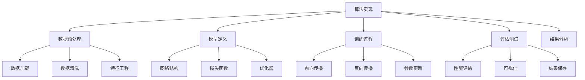

# 经典算法实现

## 🔧 算法实现基础

### 1. 算法实现框架

**实现框架：**


### 2. 实现原则

**实现原则：**
- 🎯 **模块化设计**：将算法分解为独立的模块
- 📊 **可扩展性**：设计易于扩展的接口
- 🔍 **可读性**：代码清晰易懂
- ⚡ **效率性**：优化计算效率

## 📊 监督学习算法实现

### 1. 线性回归

**线性回归实现：**
```python
import numpy as np
import matplotlib.pyplot as plt
from sklearn.datasets import make_regression
from sklearn.model_selection import train_test_split
from sklearn.metrics import mean_squared_error, r2_score

class LinearRegression:
    """线性回归算法实现"""
    
    def __init__(self, learning_rate=0.01, max_iter=1000, tol=1e-6):
        self.learning_rate = learning_rate
        self.max_iter = max_iter
        self.tol = tol
        self.weights = None
        self.bias = None
        self.loss_history = []
    
    def fit(self, X, y):
        """训练模型"""
        # 初始化参数
        n_samples, n_features = X.shape
        self.weights = np.random.randn(n_features) * 0.01
        self.bias = 0.0
        
        # 梯度下降
        for i in range(self.max_iter):
            # 前向传播
            y_pred = self.predict(X)
            
            # 计算损失
            loss = self._compute_loss(y, y_pred)
            self.loss_history.append(loss)
            
            # 计算梯度
            dw = (1/n_samples) * np.dot(X.T, (y_pred - y))
            db = (1/n_samples) * np.sum(y_pred - y)
            
            # 更新参数
            self.weights -= self.learning_rate * dw
            self.bias -= self.learning_rate * db
            
            # 检查收敛
            if i > 0 and abs(self.loss_history[-1] - self.loss_history[-2]) < self.tol:
                print(f"收敛于第 {i+1} 次迭代")
                break
        
        return self
    
    def predict(self, X):
        """预测"""
        return np.dot(X, self.weights) + self.bias
    
    def _compute_loss(self, y_true, y_pred):
        """计算损失"""
        return np.mean((y_true - y_pred) ** 2)
    
    def score(self, X, y):
        """计算R²分数"""
        y_pred = self.predict(X)
        return r2_score(y, y_pred)
    
    def visualize_training(self):
        """可视化训练过程"""
        plt.figure(figsize=(10, 6))
        plt.plot(self.loss_history)
        plt.xlabel('Iteration')
        plt.ylabel('Loss')
        plt.title('Linear Regression Training')
        plt.grid(True)
        plt.show()
    
    def visualize_results(self, X, y):
        """可视化结果"""
        y_pred = self.predict(X)
        
        plt.figure(figsize=(12, 5))
        
        # 预测vs真实值
        plt.subplot(1, 2, 1)
        plt.scatter(y, y_pred, alpha=0.6)
        plt.plot([y.min(), y.max()], [y.min(), y.max()], 'r--', linewidth=2)
        plt.xlabel('True Values')
        plt.ylabel('Predicted Values')
        plt.title('True vs Predicted')
        plt.grid(True)
        
        # 残差图
        plt.subplot(1, 2, 2)
        residuals = y - y_pred
        plt.scatter(y_pred, residuals, alpha=0.6)
        plt.axhline(y=0, color='r', linestyle='--', linewidth=2)
        plt.xlabel('Predicted Values')
        plt.ylabel('Residuals')
        plt.title('Residual Plot')
        plt.grid(True)
        
        plt.tight_layout()
        plt.show()

# 测试线性回归
def test_linear_regression():
    """测试线性回归"""
    # 生成数据
    X, y = make_regression(n_samples=1000, n_features=1, noise=10, random_state=42)
    X_train, X_test, y_train, y_test = train_test_split(X, y, test_size=0.2, random_state=42)
    
    # 训练模型
    lr = LinearRegression(learning_rate=0.01, max_iter=1000)
    lr.fit(X_train, y_train)
    
    # 评估模型
    train_score = lr.score(X_train, y_train)
    test_score = lr.score(X_test, y_test)
    
    print(f"训练集R²分数: {train_score:.4f}")
    print(f"测试集R²分数: {test_score:.4f}")
    
    # 可视化
    lr.visualize_training()
    lr.visualize_results(X_test, y_test)
    
    return lr

test_linear_regression()
```

### 2. 逻辑回归

**逻辑回归实现：**
```python
class LogisticRegression:
    """逻辑回归算法实现"""
    
    def __init__(self, learning_rate=0.01, max_iter=1000, tol=1e-6):
        self.learning_rate = learning_rate
        self.max_iter = max_iter
        self.tol = tol
        self.weights = None
        self.bias = None
        self.loss_history = []
    
    def fit(self, X, y):
        """训练模型"""
        # 初始化参数
        n_samples, n_features = X.shape
        self.weights = np.random.randn(n_features) * 0.01
        self.bias = 0.0
        
        # 梯度下降
        for i in range(self.max_iter):
            # 前向传播
            y_pred = self.predict_proba(X)
            
            # 计算损失
            loss = self._compute_loss(y, y_pred)
            self.loss_history.append(loss)
            
            # 计算梯度
            dw = (1/n_samples) * np.dot(X.T, (y_pred - y))
            db = (1/n_samples) * np.sum(y_pred - y)
            
            # 更新参数
            self.weights -= self.learning_rate * dw
            self.bias -= self.learning_rate * db
            
            # 检查收敛
            if i > 0 and abs(self.loss_history[-1] - self.loss_history[-2]) < self.tol:
                print(f"收敛于第 {i+1} 次迭代")
                break
        
        return self
    
    def predict_proba(self, X):
        """预测概率"""
        z = np.dot(X, self.weights) + self.bias
        return self._sigmoid(z)
    
    def predict(self, X):
        """预测类别"""
        probabilities = self.predict_proba(X)
        return (probabilities >= 0.5).astype(int)
    
    def _sigmoid(self, z):
        """Sigmoid函数"""
        return 1 / (1 + np.exp(-np.clip(z, -250, 250)))
    
    def _compute_loss(self, y_true, y_pred):
        """计算损失"""
        return -np.mean(y_true * np.log(y_pred + 1e-15) + (1 - y_true) * np.log(1 - y_pred + 1e-15))
    
    def score(self, X, y):
        """计算准确率"""
        y_pred = self.predict(X)
        return np.mean(y_pred == y)
    
    def visualize_training(self):
        """可视化训练过程"""
        plt.figure(figsize=(10, 6))
        plt.plot(self.loss_history)
        plt.xlabel('Iteration')
        plt.ylabel('Loss')
        plt.title('Logistic Regression Training')
        plt.grid(True)
        plt.show()
    
    def visualize_decision_boundary(self, X, y):
        """可视化决策边界"""
        # 创建网格
        h = 0.02
        x_min, x_max = X[:, 0].min() - 1, X[:, 0].max() + 1
        y_min, y_max = X[:, 1].min() - 1, X[:, 1].max() + 1
        xx, yy = np.meshgrid(np.arange(x_min, x_max, h),
                           np.arange(y_min, y_max, h))
        
        # 预测网格点
        Z = self.predict_proba(np.c_[xx.ravel(), yy.ravel()])
        Z = Z.reshape(xx.shape)
        
        # 可视化
        plt.figure(figsize=(10, 8))
        plt.contourf(xx, yy, Z, alpha=0.8, cmap='viridis')
        plt.scatter(X[:, 0], X[:, 1], c=y, cmap='viridis', edgecolors='k')
        plt.xlabel('Feature 1')
        plt.ylabel('Feature 2')
        plt.title('Logistic Regression Decision Boundary')
        plt.colorbar()
        plt.show()

# 测试逻辑回归
def test_logistic_regression():
    """测试逻辑回归"""
    # 生成数据
    from sklearn.datasets import make_classification
    X, y = make_classification(n_samples=1000, n_features=2, n_redundant=0, n_informative=2, random_state=42)
    X_train, X_test, y_train, y_test = train_test_split(X, y, test_size=0.2, random_state=42)
    
    # 训练模型
    lr = LogisticRegression(learning_rate=0.01, max_iter=1000)
    lr.fit(X_train, y_train)
    
    # 评估模型
    train_score = lr.score(X_train, y_train)
    test_score = lr.score(X_test, y_test)
    
    print(f"训练集准确率: {train_score:.4f}")
    print(f"测试集准确率: {test_score:.4f}")
    
    # 可视化
    lr.visualize_training()
    lr.visualize_decision_boundary(X_test, y_test)
    
    return lr

test_logistic_regression()
```

### 3. 决策树

**决策树实现：**
```python
class DecisionTree:
    """决策树算法实现"""
    
    def __init__(self, max_depth=None, min_samples_split=2, min_samples_leaf=1):
        self.max_depth = max_depth
        self.min_samples_split = min_samples_split
        self.min_samples_leaf = min_samples_leaf
        self.tree = None
    
    def fit(self, X, y):
        """训练模型"""
        self.tree = self._build_tree(X, y, depth=0)
        return self
    
    def predict(self, X):
        """预测"""
        predictions = []
        for x in X:
            predictions.append(self._predict_sample(x, self.tree))
        return np.array(predictions)
    
    def _build_tree(self, X, y, depth):
        """构建决策树"""
        # 停止条件
        if (self.max_depth is not None and depth >= self.max_depth) or \
           len(y) < self.min_samples_split or \
           len(np.unique(y)) == 1:
            return {'leaf': True, 'class': np.bincount(y).argmax()}
        
        # 找到最佳分割
        best_feature, best_threshold, best_gain = self._find_best_split(X, y)
        
        if best_gain == 0:
            return {'leaf': True, 'class': np.bincount(y).argmax()}
        
        # 分割数据
        left_mask = X[:, best_feature] <= best_threshold
        right_mask = ~left_mask
        
        # 递归构建子树
        left_tree = self._build_tree(X[left_mask], y[left_mask], depth + 1)
        right_tree = self._build_tree(X[right_mask], y[right_mask], depth + 1)
        
        return {
            'leaf': False,
            'feature': best_feature,
            'threshold': best_threshold,
            'left': left_tree,
            'right': right_tree
        }
    
    def _find_best_split(self, X, y):
        """找到最佳分割点"""
        best_gain = 0
        best_feature = None
        best_threshold = None
        
        for feature_idx in range(X.shape[1]):
            thresholds = np.unique(X[:, feature_idx])
            for threshold in thresholds:
                gain = self._information_gain(X, y, feature_idx, threshold)
                if gain > best_gain:
                    best_gain = gain
                    best_feature = feature_idx
                    best_threshold = threshold
        
        return best_feature, best_threshold, best_gain
    
    def _information_gain(self, X, y, feature_idx, threshold):
        """计算信息增益"""
        # 分割数据
        left_mask = X[:, feature_idx] <= threshold
        right_mask = ~left_mask
        
        if np.sum(left_mask) == 0 or np.sum(right_mask) == 0:
            return 0
        
        # 计算信息增益
        parent_entropy = self._entropy(y)
        left_entropy = self._entropy(y[left_mask])
        right_entropy = self._entropy(y[right_mask])
        
        left_weight = np.sum(left_mask) / len(y)
        right_weight = np.sum(right_mask) / len(y)
        
        child_entropy = left_weight * left_entropy + right_weight * right_entropy
        return parent_entropy - child_entropy
    
    def _entropy(self, y):
        """计算熵"""
        if len(y) == 0:
            return 0
        counts = np.bincount(y)
        probabilities = counts / len(y)
        return -np.sum(probabilities * np.log2(probabilities + 1e-15))
    
    def _predict_sample(self, x, tree):
        """预测单个样本"""
        if tree['leaf']:
            return tree['class']
        
        if x[tree['feature']] <= tree['threshold']:
            return self._predict_sample(x, tree['left'])
        else:
            return self._predict_sample(x, tree['right'])
    
    def visualize_tree(self, feature_names=None):
        """可视化决策树"""
        if feature_names is None:
            feature_names = [f'Feature {i}' for i in range(10)]
        
        def plot_node(node, x, y, dx, dy):
            if node['leaf']:
                plt.text(x, y, f'Class: {node["class"]}', ha='center', va='center',
                        bbox=dict(boxstyle="round,pad=0.3", facecolor="lightgreen"))
            else:
                plt.text(x, y, f'{feature_names[node["feature"]]}\n<= {node["threshold"]:.2f}', 
                        ha='center', va='center',
                        bbox=dict(boxstyle="round,pad=0.3", facecolor="lightblue"))
                
                # 左子树
                if not node['left']['leaf'] or not node['right']['leaf']:
                    plt.plot([x, x-dx], [y, y-dy], 'k-')
                    plot_node(node['left'], x-dx, y-dy, dx/2, dy)
                
                # 右子树
                if not node['left']['leaf'] or not node['right']['leaf']:
                    plt.plot([x, x+dx], [y, y-dy], 'k-')
                    plot_node(node['right'], x+dx, y-dy, dx/2, dy)
        
        plt.figure(figsize=(12, 8))
        plot_node(self.tree, 0, 0, 2, 1)
        plt.xlim(-4, 4)
        plt.ylim(-4, 1)
        plt.axis('off')
        plt.title('Decision Tree')
        plt.show()

# 测试决策树
def test_decision_tree():
    """测试决策树"""
    # 生成数据
    from sklearn.datasets import make_classification
    X, y = make_classification(n_samples=1000, n_features=2, n_redundant=0, n_informative=2, random_state=42)
    X_train, X_test, y_train, y_test = train_test_split(X, y, test_size=0.2, random_state=42)
    
    # 训练模型
    dt = DecisionTree(max_depth=5, min_samples_split=10)
    dt.fit(X_train, y_train)
    
    # 评估模型
    train_score = np.mean(dt.predict(X_train) == y_train)
    test_score = np.mean(dt.predict(X_test) == y_test)
    
    print(f"训练集准确率: {train_score:.4f}")
    print(f"测试集准确率: {test_score:.4f}")
    
    # 可视化
    dt.visualize_tree(['Feature 1', 'Feature 2'])
    
    return dt

test_decision_tree()
```

## 🔍 无监督学习算法实现

### 1. K-means聚类

**K-means实现：**
```python
class KMeans:
    """K-means聚类算法实现"""
    
    def __init__(self, k=3, max_iter=100, tol=1e-4, random_state=42):
        self.k = k
        self.max_iter = max_iter
        self.tol = tol
        self.random_state = random_state
        self.centroids = None
        self.labels = None
        self.inertia_history = []
    
    def fit(self, X):
        """训练模型"""
        np.random.seed(self.random_state)
        n_samples, n_features = X.shape
        
        # 初始化聚类中心
        self.centroids = X[np.random.choice(n_samples, self.k, replace=False)]
        
        for i in range(self.max_iter):
            # 分配样本到最近的聚类中心
            self.labels = self._assign_clusters(X)
            
            # 计算惯性
            inertia = self._compute_inertia(X)
            self.inertia_history.append(inertia)
            
            # 更新聚类中心
            new_centroids = self._update_centroids(X)
            
            # 检查收敛
            if np.allclose(self.centroids, new_centroids, atol=self.tol):
                print(f"收敛于第 {i+1} 次迭代")
                break
            
            self.centroids = new_centroids
        
        return self
    
    def predict(self, X):
        """预测聚类标签"""
        return self._assign_clusters(X)
    
    def _assign_clusters(self, X):
        """分配样本到聚类"""
        distances = np.sqrt(((X - self.centroids[:, np.newaxis])**2).sum(axis=2))
        return np.argmin(distances, axis=0)
    
    def _update_centroids(self, X):
        """更新聚类中心"""
        centroids = np.zeros((self.k, X.shape[1]))
        for i in range(self.k):
            centroids[i] = X[self.labels == i].mean(axis=0)
        return centroids
    
    def _compute_inertia(self, X):
        """计算惯性"""
        inertia = 0
        for i in range(self.k):
            cluster_points = X[self.labels == i]
            if len(cluster_points) > 0:
                inertia += np.sum((cluster_points - self.centroids[i])**2)
        return inertia
    
    def visualize_clustering(self, X):
        """可视化聚类结果"""
        plt.figure(figsize=(15, 5))
        
        # 原始数据
        plt.subplot(1, 3, 1)
        plt.scatter(X[:, 0], X[:, 1], alpha=0.6)
        plt.title('Original Data')
        plt.xlabel('Feature 1')
        plt.ylabel('Feature 2')
        plt.grid(True)
        
        # 聚类结果
        plt.subplot(1, 3, 2)
        colors = ['red', 'blue', 'green', 'orange', 'purple']
        for i in range(self.k):
            cluster_points = X[self.labels == i]
            plt.scatter(cluster_points[:, 0], cluster_points[:, 1], 
                       c=colors[i % len(colors)], alpha=0.6, label=f'Cluster {i}')
        plt.scatter(self.centroids[:, 0], self.centroids[:, 1], 
                   c='black', marker='x', s=200, linewidths=3, label='Centroids')
        plt.title('K-means Clustering')
        plt.xlabel('Feature 1')
        plt.ylabel('Feature 2')
        plt.legend()
        plt.grid(True)
        
        # 惯性变化
        plt.subplot(1, 3, 3)
        plt.plot(self.inertia_history)
        plt.xlabel('Iteration')
        plt.ylabel('Inertia')
        plt.title('Inertia Convergence')
        plt.grid(True)
        
        plt.tight_layout()
        plt.show()
    
    def silhouette_score(self, X):
        """计算轮廓系数"""
        from sklearn.metrics import silhouette_score
        return silhouette_score(X, self.labels)

# 测试K-means
def test_kmeans():
    """测试K-means"""
    # 生成数据
    from sklearn.datasets import make_blobs
    X, y_true = make_blobs(n_samples=1000, centers=3, cluster_std=1.0, random_state=42)
    
    # 训练模型
    kmeans = KMeans(k=3, max_iter=100)
    kmeans.fit(X)
    
    # 评估模型
    silhouette = kmeans.silhouette_score(X)
    print(f"轮廓系数: {silhouette:.4f}")
    
    # 可视化
    kmeans.visualize_clustering(X)
    
    return kmeans

test_kmeans()
```

### 2. 主成分分析（PCA）

**PCA实现：**
```python
class PCA:
    """主成分分析算法实现"""
    
    def __init__(self, n_components=None):
        self.n_components = n_components
        self.components = None
        self.mean = None
        self.explained_variance_ratio = None
    
    def fit(self, X):
        """训练模型"""
        # 中心化数据
        self.mean = np.mean(X, axis=0)
        X_centered = X - self.mean
        
        # 计算协方差矩阵
        cov_matrix = np.cov(X_centered.T)
        
        # 特征值分解
        eigenvalues, eigenvectors = np.linalg.eigh(cov_matrix)
        
        # 按特征值降序排列
        idx = np.argsort(eigenvalues)[::-1]
        eigenvalues = eigenvalues[idx]
        eigenvectors = eigenvectors[:, idx]
        
        # 选择主成分
        if self.n_components is None:
            self.n_components = X.shape[1]
        
        self.components = eigenvectors[:, :self.n_components]
        
        # 计算解释方差比
        total_variance = np.sum(eigenvalues)
        self.explained_variance_ratio = eigenvalues[:self.n_components] / total_variance
        
        return self
    
    def transform(self, X):
        """降维变换"""
        X_centered = X - self.mean
        return X_centered @ self.components
    
    def fit_transform(self, X):
        """训练并变换"""
        self.fit(X)
        return self.transform(X)
    
    def inverse_transform(self, X_transformed):
        """逆变换"""
        return X_transformed @ self.components.T + self.mean
    
    def visualize_pca(self, X, y=None):
        """可视化PCA结果"""
        # 降维
        X_pca = self.fit_transform(X)
        
        plt.figure(figsize=(15, 5))
        
        # 原始数据（前两个特征）
        plt.subplot(1, 3, 1)
        if y is not None:
            plt.scatter(X[:, 0], X[:, 1], c=y, cmap='viridis', alpha=0.6)
        else:
            plt.scatter(X[:, 0], X[:, 1], alpha=0.6)
        plt.xlabel('Feature 1')
        plt.ylabel('Feature 2')
        plt.title('Original Data')
        plt.grid(True)
        
        # PCA结果
        plt.subplot(1, 3, 2)
        if y is not None:
            plt.scatter(X_pca[:, 0], X_pca[:, 1], c=y, cmap='viridis', alpha=0.6)
        else:
            plt.scatter(X_pca[:, 0], X_pca[:, 1], alpha=0.6)
        plt.xlabel('PC1')
        plt.ylabel('PC2')
        plt.title('PCA Result')
        plt.grid(True)
        
        # 解释方差比
        plt.subplot(1, 3, 3)
        plt.bar(range(len(self.explained_variance_ratio)), self.explained_variance_ratio)
        plt.xlabel('Principal Component')
        plt.ylabel('Explained Variance Ratio')
        plt.title('Explained Variance Ratio')
        plt.grid(True)
        
        plt.tight_layout()
        plt.show()
        
        return X_pca

# 测试PCA
def test_pca():
    """测试PCA"""
    # 生成数据
    from sklearn.datasets import make_classification
    X, y = make_classification(n_samples=1000, n_features=10, n_informative=5, random_state=42)
    
    # 训练模型
    pca = PCA(n_components=2)
    X_pca = pca.visualize_pca(X, y)
    
    # 计算解释方差比
    print(f"前两个主成分解释方差比: {pca.explained_variance_ratio[:2].sum():.3f}")
    
    return pca

test_pca()
```

## 🔗 相关链接
- [[02-01-01-监督学习原理]] - 监督学习
- [[02-01-02-无监督学习原理]] - 无监督学习
- [[02-01-04-模型评估方法]] - 模型评估
- [[02-01-06-机器学习算法对比]] - 算法对比

## 💡 算法实现建议

**实现策略：**
- 🎯 **理解原理**：深入理解算法的数学原理
- 📊 **模块化设计**：将算法分解为独立的模块
- 🔍 **测试验证**：编写测试用例验证实现
- ⚡ **性能优化**：优化算法的计算效率

**实践建议：**
- 📝 **代码注释**：添加详细的代码注释
- 💻 **单元测试**：编写单元测试验证功能
- 📊 **性能分析**：分析算法的时间和空间复杂度
- 🔍 **结果可视化**：可视化算法的运行结果

---
*📝 学习提示：算法实现是理解算法的重要方式，建议从简单算法开始，逐步实现复杂的算法，通过实践加深理解*


