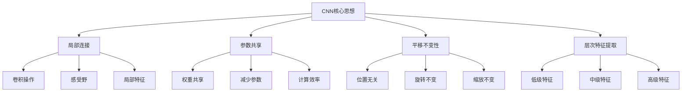
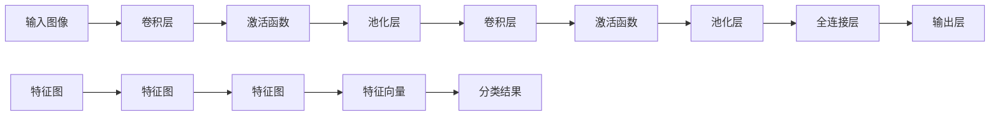

# CNN卷积神经网络

## 🖼️ CNN基础概念

### 1. CNN核心思想

**CNN定义：**
> **卷积神经网络是一种专门用于处理具有网格结构数据的深度学习模型，特别适用于图像处理任务**

**CNN核心思想：**


### 2. CNN架构组成

**CNN架构：**


## 🔧 CNN核心组件

### 1. 卷积层

**卷积操作：**
```python
import numpy as np
import matplotlib.pyplot as plt
from scipy import signal

class ConvolutionalLayer:
    """卷积层实现"""
    
    def __init__(self, input_channels, output_channels, kernel_size, stride=1, padding=0):
        self.input_channels = input_channels
        self.output_channels = output_channels
        self.kernel_size = kernel_size
        self.stride = stride
        self.padding = padding
        
        # 初始化卷积核
        self.kernels = np.random.randn(output_channels, input_channels, kernel_size, kernel_size) * 0.1
        self.biases = np.zeros(output_channels)
        
        # 存储中间结果
        self.input = None
        self.output = None
    
    def forward(self, X):
        """前向传播"""
        self.input = X
        batch_size, input_channels, input_height, input_width = X.shape
        
        # 计算输出尺寸
        output_height = (input_height + 2*self.padding - self.kernel_size) // self.stride + 1
        output_width = (input_width + 2*self.padding - self.kernel_size) // self.stride + 1
        
        # 初始化输出
        self.output = np.zeros((batch_size, self.output_channels, output_height, output_width))
        
        # 添加填充
        if self.padding > 0:
            X_padded = np.pad(X, ((0, 0), (0, 0), (self.padding, self.padding), (self.padding, self.padding)), mode='constant')
        else:
            X_padded = X
        
        # 卷积操作
        for b in range(batch_size):
            for oc in range(self.output_channels):
                for ic in range(self.input_channels):
                    for oh in range(output_height):
                        for ow in range(output_width):
                            # 计算卷积窗口
                            h_start = oh * self.stride
                            h_end = h_start + self.kernel_size
                            w_start = ow * self.stride
                            w_end = w_start + self.kernel_size
                            
                            # 卷积计算
                            window = X_padded[b, ic, h_start:h_end, w_start:w_end]
                            self.output[b, oc, oh, ow] += np.sum(window * self.kernels[oc, ic])
                
                # 添加偏置
                self.output[b, oc] += self.biases[oc]
        
        return self.output
    
    def backward(self, d_output, learning_rate=0.01):
        """反向传播"""
        batch_size, input_channels, input_height, input_width = self.input.shape
        d_input = np.zeros_like(self.input)
        d_kernels = np.zeros_like(self.kernels)
        d_biases = np.zeros_like(self.biases)
        
        # 添加填充
        if self.padding > 0:
            input_padded = np.pad(self.input, ((0, 0), (0, 0), (self.padding, self.padding), (self.padding, self.padding)), mode='constant')
            d_input_padded = np.pad(d_input, ((0, 0), (0, 0), (self.padding, self.padding), (self.padding, self.padding)), mode='constant')
        else:
            input_padded = self.input
            d_input_padded = d_input
        
        # 计算梯度
        for b in range(batch_size):
            for oc in range(self.output_channels):
                for ic in range(self.input_channels):
                    for oh in range(d_output.shape[2]):
                        for ow in range(d_output.shape[3]):
                            # 计算卷积窗口
                            h_start = oh * self.stride
                            h_end = h_start + self.kernel_size
                            w_start = ow * self.stride
                            w_end = w_start + self.kernel_size
                            
                            # 计算梯度
                            window = input_padded[b, ic, h_start:h_end, w_start:w_end]
                            d_kernels[oc, ic] += d_output[b, oc, oh, ow] * window
                            d_input_padded[b, ic, h_start:h_end, w_start:w_end] += d_output[b, oc, oh, ow] * self.kernels[oc, ic]
                
                # 计算偏置梯度
                d_biases[oc] += np.sum(d_output[b, oc])
        
        # 移除填充
        if self.padding > 0:
            d_input = d_input_padded[:, :, self.padding:-self.padding, self.padding:-self.padding]
        else:
            d_input = d_input_padded
        
        # 更新参数
        self.kernels -= learning_rate * d_kernels / batch_size
        self.biases -= learning_rate * d_biases / batch_size
        
        return d_input
    
    def visualize_convolution(self, input_image, kernel):
        """可视化卷积操作"""
        # 执行卷积
        output = signal.convolve2d(input_image, kernel, mode='valid')
        
        # 可视化
        fig, axes = plt.subplots(1, 3, figsize=(15, 5))
        
        # 输入图像
        axes[0].imshow(input_image, cmap='gray')
        axes[0].set_title('Input Image')
        axes[0].axis('off')
        
        # 卷积核
        axes[1].imshow(kernel, cmap='gray')
        axes[1].set_title('Convolution Kernel')
        axes[1].axis('off')
        
        # 输出特征图
        axes[2].imshow(output, cmap='gray')
        axes[2].set_title('Output Feature Map')
        axes[2].axis('off')
        
        plt.tight_layout()
        plt.show()
        
        return output

# 测试卷积层
def test_convolutional_layer():
    """测试卷积层"""
    # 创建输入数据
    batch_size = 1
    input_channels = 1
    input_height = 28
    input_width = 28
    
    X = np.random.randn(batch_size, input_channels, input_height, input_width)
    
    # 创建卷积层
    conv_layer = ConvolutionalLayer(input_channels=1, output_channels=32, kernel_size=3, stride=1, padding=1)
    
    # 前向传播
    output = conv_layer.forward(X)
    
    print(f"输入形状: {X.shape}")
    print(f"输出形状: {output.shape}")
    
    # 可视化卷积操作
    input_image = X[0, 0]
    kernel = conv_layer.kernels[0, 0]
    conv_layer.visualize_convolution(input_image, kernel)
    
    return conv_layer

test_convolutional_layer()
```

### 2. 池化层

**池化操作：**
```python
class PoolingLayer:
    """池化层实现"""
    
    def __init__(self, pool_size=2, stride=2, mode='max'):
        self.pool_size = pool_size
        self.stride = stride
        self.mode = mode
        self.input = None
        self.output = None
        self.mask = None
    
    def forward(self, X):
        """前向传播"""
        self.input = X
        batch_size, channels, input_height, input_width = X.shape
        
        # 计算输出尺寸
        output_height = (input_height - self.pool_size) // self.stride + 1
        output_width = (input_width - self.pool_size) // self.stride + 1
        
        # 初始化输出
        self.output = np.zeros((batch_size, channels, output_height, output_width))
        self.mask = np.zeros_like(X)
        
        # 池化操作
        for b in range(batch_size):
            for c in range(channels):
                for oh in range(output_height):
                    for ow in range(output_width):
                        # 计算池化窗口
                        h_start = oh * self.stride
                        h_end = h_start + self.pool_size
                        w_start = ow * self.stride
                        w_end = w_start + self.pool_size
                        
                        # 池化窗口
                        window = X[b, c, h_start:h_end, w_start:w_end]
                        
                        if self.mode == 'max':
                            # 最大池化
                            self.output[b, c, oh, ow] = np.max(window)
                            # 记录最大值位置
                            max_idx = np.unravel_index(np.argmax(window), window.shape)
                            self.mask[b, c, h_start + max_idx[0], w_start + max_idx[1]] = 1
                        
                        elif self.mode == 'average':
                            # 平均池化
                            self.output[b, c, oh, ow] = np.mean(window)
                            # 平均池化的梯度是均匀分布的
                            self.mask[b, c, h_start:h_end, w_start:w_end] = 1.0 / (self.pool_size * self.pool_size)
        
        return self.output
    
    def backward(self, d_output):
        """反向传播"""
        d_input = np.zeros_like(self.input)
        
        batch_size, channels, output_height, output_width = d_output.shape
        
        # 反向传播
        for b in range(batch_size):
            for c in range(channels):
                for oh in range(output_height):
                    for ow in range(output_width):
                        # 计算池化窗口
                        h_start = oh * self.stride
                        h_end = h_start + self.pool_size
                        w_start = ow * self.stride
                        w_end = w_start + self.pool_size
                        
                        # 计算梯度
                        if self.mode == 'max':
                            # 最大池化的梯度只传递给最大值位置
                            d_input[b, c, h_start:h_end, w_start:w_end] += d_output[b, c, oh, ow] * self.mask[b, c, h_start:h_end, w_start:w_end]
                        
                        elif self.mode == 'average':
                            # 平均池化的梯度均匀分布
                            d_input[b, c, h_start:h_end, w_start:w_end] += d_output[b, c, oh, ow] * self.mask[b, c, h_start:h_end, w_start:w_end]
        
        return d_input
    
    def visualize_pooling(self, input_image):
        """可视化池化操作"""
        # 执行池化
        output = self.forward(input_image.reshape(1, 1, *input_image.shape))
        output = output[0, 0]
        
        # 可视化
        fig, axes = plt.subplots(1, 2, figsize=(12, 5))
        
        # 输入图像
        axes[0].imshow(input_image, cmap='gray')
        axes[0].set_title('Input Image')
        axes[0].axis('off')
        
        # 池化结果
        axes[1].imshow(output, cmap='gray')
        axes[1].set_title(f'{self.mode.capitalize()} Pooling Result')
        axes[1].axis('off')
        
        plt.tight_layout()
        plt.show()
        
        return output

# 测试池化层
def test_pooling_layer():
    """测试池化层"""
    # 创建输入数据
    input_image = np.random.randn(8, 8)
    
    # 创建池化层
    max_pool = PoolingLayer(pool_size=2, stride=2, mode='max')
    avg_pool = PoolingLayer(pool_size=2, stride=2, mode='average')
    
    # 可视化池化操作
    max_output = max_pool.visualize_pooling(input_image)
    avg_output = avg_pool.visualize_pooling(input_image)
    
    print(f"输入形状: {input_image.shape}")
    print(f"最大池化输出形状: {max_output.shape}")
    print(f"平均池化输出形状: {avg_output.shape}")
    
    return max_pool, avg_pool

test_pooling_layer()
```

### 3. 完整CNN实现

**完整CNN网络：**
```python
class ConvolutionalNeuralNetwork:
    """完整CNN网络实现"""
    
    def __init__(self, input_shape, num_classes):
        self.input_shape = input_shape
        self.num_classes = num_classes
        self.layers = []
        self.loss_history = []
        
        # 构建网络
        self._build_network()
    
    def _build_network(self):
        """构建网络"""
        # 卷积层1
        self.layers.append(ConvolutionalLayer(input_channels=1, output_channels=32, kernel_size=3, stride=1, padding=1))
        
        # 池化层1
        self.layers.append(PoolingLayer(pool_size=2, stride=2, mode='max'))
        
        # 卷积层2
        self.layers.append(ConvolutionalLayer(input_channels=32, output_channels=64, kernel_size=3, stride=1, padding=1))
        
        # 池化层2
        self.layers.append(PoolingLayer(pool_size=2, stride=2, mode='max'))
        
        # 全连接层
        self.layers.append(DenseLayer(input_size=64 * 7 * 7, output_size=128))
        self.layers.append(DenseLayer(input_size=128, output_size=self.num_classes))
    
    def forward(self, X):
        """前向传播"""
        output = X
        
        for layer in self.layers:
            if isinstance(layer, ConvolutionalLayer):
                output = layer.forward(output)
            elif isinstance(layer, PoolingLayer):
                output = layer.forward(output)
            elif isinstance(layer, DenseLayer):
                # 展平特征图
                if len(output.shape) > 2:
                    output = output.reshape(output.shape[0], -1)
                output = layer.forward(output)
        
        return output
    
    def backward(self, y_true, y_pred, learning_rate=0.01):
        """反向传播"""
        # 计算输出层梯度
        error = y_pred - y_true
        
        # 反向传播
        for layer in reversed(self.layers):
            if isinstance(layer, DenseLayer):
                error = layer.backward(error, learning_rate)
            elif isinstance(layer, PoolingLayer):
                error = layer.backward(error)
            elif isinstance(layer, ConvolutionalLayer):
                error = layer.backward(error, learning_rate)
        
        return error
    
    def train(self, X, y, epochs=10, batch_size=32, learning_rate=0.01):
        """训练网络"""
        for epoch in range(epochs):
            epoch_loss = 0
            
            # 批量训练
            for i in range(0, len(X), batch_size):
                X_batch = X[i:i+batch_size]
                y_batch = y[i:i+batch_size]
                
                # 前向传播
                y_pred = self.forward(X_batch)
                
                # 计算损失
                loss = self._cross_entropy_loss(y_batch, y_pred)
                epoch_loss += loss
                
                # 反向传播
                self.backward(y_batch, y_pred, learning_rate)
            
            self.loss_history.append(epoch_loss / (len(X) // batch_size))
            
            if epoch % 1 == 0:
                print(f"Epoch {epoch}, Loss: {self.loss_history[-1]:.4f}")
    
    def _cross_entropy_loss(self, y_true, y_pred):
        """交叉熵损失"""
        return -np.mean(np.sum(y_true * np.log(y_pred + 1e-15), axis=1))
    
    def predict(self, X):
        """预测"""
        y_pred = self.forward(X)
        return np.argmax(y_pred, axis=1)
    
    def visualize_training(self):
        """可视化训练过程"""
        plt.figure(figsize=(10, 6))
        plt.plot(self.loss_history)
        plt.xlabel('Epoch')
        plt.ylabel('Loss')
        plt.title('CNN Training Loss')
        plt.grid(True)
        plt.show()
    
    def visualize_features(self, X, layer_idx=0):
        """可视化特征图"""
        # 前向传播到指定层
        output = X
        for i in range(layer_idx + 1):
            if isinstance(self.layers[i], ConvolutionalLayer):
                output = self.layers[i].forward(output)
            elif isinstance(self.layers[i], PoolingLayer):
                output = self.layers[i].forward(output)
        
        # 可视化特征图
        fig, axes = plt.subplots(4, 8, figsize=(16, 8))
        
        for i in range(4):
            for j in range(8):
                if i * 8 + j < output.shape[1]:
                    axes[i, j].imshow(output[0, i * 8 + j], cmap='viridis')
                    axes[i, j].axis('off')
                else:
                    axes[i, j].axis('off')
        
        plt.suptitle(f'Feature Maps at Layer {layer_idx}')
        plt.tight_layout()
        plt.show()

# 测试完整CNN
def test_cnn():
    """测试完整CNN"""
    # 生成数据
    from sklearn.datasets import make_classification
    X, y = make_classification(n_samples=1000, n_features=784, n_classes=10, random_state=42)
    
    # 重塑为图像格式
    X = X.reshape(-1, 1, 28, 28)
    
    # 转换为one-hot编码
    y_onehot = np.zeros((len(y), 10))
    y_onehot[np.arange(len(y)), y] = 1
    
    # 创建CNN
    cnn = ConvolutionalNeuralNetwork(input_shape=(1, 28, 28), num_classes=10)
    
    # 训练网络
    cnn.train(X, y_onehot, epochs=10, batch_size=32, learning_rate=0.01)
    
    # 可视化训练过程
    cnn.visualize_training()
    
    # 可视化特征图
    cnn.visualize_features(X[:1], layer_idx=0)
    
    return cnn

test_cnn()
```

## 🔗 相关链接
- [[02-02-01-神经网络原理]] - 神经网络
- [[02-02-02-反向传播算法]] - 反向传播
- [[02-02-05-网络架构设计]] - 网络架构
- [[03-01-01-图像处理基础]] - 图像处理

## 💡 CNN学习建议

**学习策略：**
- 🖼️ **理解卷积**：深入理解卷积操作的原理
- 📊 **可视化分析**：通过可视化理解特征提取过程
- 🔍 **参数调优**：学习如何调优CNN参数
- ⚡ **架构设计**：掌握CNN架构设计原则

**实践建议：**
- 📝 **动手实现**：从零开始实现CNN组件
- 💻 **图像处理**：在实际图像数据上训练CNN
- 📊 **特征分析**：分析CNN提取的特征
- 🔍 **性能优化**：优化CNN的训练和推理性能

---
*📝 学习提示：CNN是图像处理的重要工具，建议深入理解卷积原理，通过实践掌握CNN的设计和训练*

