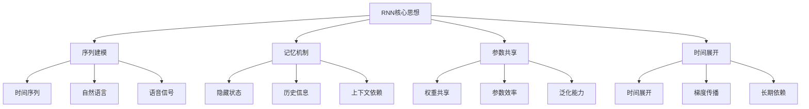
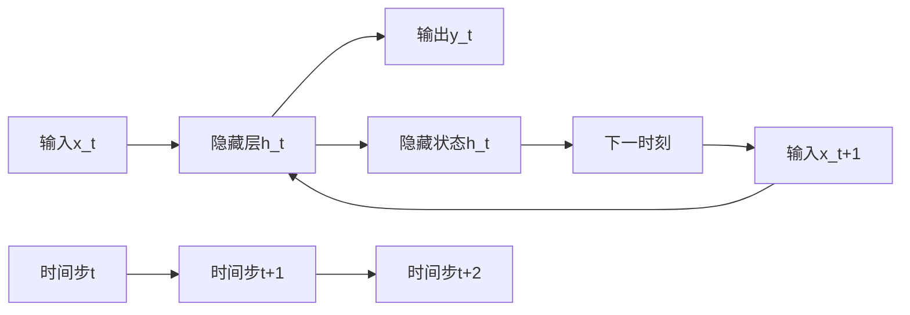

# RNN循环神经网络

## 🔄 RNN基础概念

### 1. RNN核心思想

**RNN定义：**
> **循环神经网络是一种具有记忆能力的神经网络，能够处理序列数据，通过隐藏状态传递历史信息**

**RNN核心思想：**


### 2. RNN架构

**RNN架构：**


## 🔧 RNN核心组件

### 1. 基础RNN

**基础RNN实现：**
```python
import numpy as np
import matplotlib.pyplot as plt

class BasicRNN:
    """基础RNN实现"""
    
    def __init__(self, input_size, hidden_size, output_size):
        self.input_size = input_size
        self.hidden_size = hidden_size
        self.output_size = output_size
        
        # 初始化权重
        self.W_xh = np.random.randn(input_size, hidden_size) * 0.1
        self.W_hh = np.random.randn(hidden_size, hidden_size) * 0.1
        self.W_hy = np.random.randn(hidden_size, output_size) * 0.1
        
        # 初始化偏置
        self.b_h = np.zeros(hidden_size)
        self.b_y = np.zeros(output_size)
        
        # 存储中间结果
        self.hidden_states = []
        self.outputs = []
    
    def forward(self, X):
        """前向传播"""
        sequence_length, batch_size, input_size = X.shape
        self.hidden_states = []
        self.outputs = []
        
        # 初始化隐藏状态
        h = np.zeros((batch_size, self.hidden_size))
        
        for t in range(sequence_length):
            # 计算隐藏状态
            h = np.tanh(np.dot(X[t], self.W_xh) + np.dot(h, self.W_hh) + self.b_h)
            self.hidden_states.append(h)
            
            # 计算输出
            y = np.dot(h, self.W_hy) + self.b_y
            self.outputs.append(y)
        
        return np.array(self.outputs)
    
    def backward(self, X, y_true, y_pred, learning_rate=0.01):
        """反向传播"""
        sequence_length, batch_size, input_size = X.shape
        
        # 初始化梯度
        dW_xh = np.zeros_like(self.W_xh)
        dW_hh = np.zeros_like(self.W_hh)
        dW_hy = np.zeros_like(self.W_hy)
        db_h = np.zeros_like(self.b_h)
        db_y = np.zeros_like(self.b_y)
        
        # 初始化隐藏状态梯度
        dh_next = np.zeros((batch_size, self.hidden_size))
        
        # 反向传播
        for t in reversed(range(sequence_length)):
            # 计算输出层梯度
            dy = y_pred[t] - y_true[t]
            dW_hy += np.dot(self.hidden_states[t].T, dy)
            db_y += np.sum(dy, axis=0)
            
            # 计算隐藏层梯度
            dh = np.dot(dy, self.W_hy.T) + dh_next
            dh_raw = dh * (1 - self.hidden_states[t]**2)  # tanh导数
            
            # 计算权重梯度
            dW_xh += np.dot(X[t].T, dh_raw)
            dW_hh += np.dot(self.hidden_states[t-1].T, dh_raw) if t > 0 else np.dot(np.zeros((batch_size, self.hidden_size)).T, dh_raw)
            db_h += np.sum(dh_raw, axis=0)
            
            # 更新隐藏状态梯度
            dh_next = np.dot(dh_raw, self.W_hh.T)
        
        # 更新参数
        self.W_xh -= learning_rate * dW_xh
        self.W_hh -= learning_rate * dW_hh
        self.W_hy -= learning_rate * dW_hy
        self.b_h -= learning_rate * db_h
        self.b_y -= learning_rate * db_y
    
    def train(self, X, y, epochs=100, learning_rate=0.01):
        """训练网络"""
        losses = []
        
        for epoch in range(epochs):
            # 前向传播
            y_pred = self.forward(X)
            
            # 计算损失
            loss = self._compute_loss(y, y_pred)
            losses.append(loss)
            
            # 反向传播
            self.backward(X, y, y_pred, learning_rate)
            
            if epoch % 10 == 0:
                print(f"Epoch {epoch}, Loss: {loss:.4f}")
        
        return losses
    
    def _compute_loss(self, y_true, y_pred):
        """计算损失"""
        return np.mean((y_true - y_pred)**2)
    
    def visualize_hidden_states(self, X):
        """可视化隐藏状态"""
        # 前向传播
        y_pred = self.forward(X)
        
        # 可视化隐藏状态
        fig, axes = plt.subplots(2, 2, figsize=(12, 10))
        
        # 隐藏状态变化
        hidden_states = np.array(self.hidden_states)
        axes[0, 0].plot(hidden_states[:, 0, :5].T)
        axes[0, 0].set_title('Hidden State Evolution')
        axes[0, 0].set_xlabel('Time Step')
        axes[0, 0].set_ylabel('Hidden State Value')
        axes[0, 0].grid(True)
        
        # 隐藏状态分布
        axes[0, 1].hist(hidden_states.flatten(), bins=50, alpha=0.7)
        axes[0, 1].set_title('Hidden State Distribution')
        axes[0, 1].set_xlabel('Hidden State Value')
        axes[0, 1].set_ylabel('Frequency')
        axes[0, 1].grid(True)
        
        # 输出变化
        outputs = np.array(self.outputs)
        axes[1, 0].plot(outputs[:, 0, :].T)
        axes[1, 0].set_title('Output Evolution')
        axes[1, 0].set_xlabel('Time Step')
        axes[1, 0].set_ylabel('Output Value')
        axes[1, 0].grid(True)
        
        # 输出分布
        axes[1, 1].hist(outputs.flatten(), bins=50, alpha=0.7)
        axes[1, 1].set_title('Output Distribution')
        axes[1, 1].set_xlabel('Output Value')
        axes[1, 1].set_ylabel('Frequency')
        axes[1, 1].grid(True)
        
        plt.tight_layout()
        plt.show()
        
        return hidden_states, outputs

# 测试基础RNN
def test_basic_rnn():
    """测试基础RNN"""
    # 生成序列数据
    sequence_length = 10
    batch_size = 1
    input_size = 1
    
    # 生成正弦波序列
    t = np.linspace(0, 4*np.pi, sequence_length)
    X = np.sin(t).reshape(sequence_length, batch_size, input_size)
    y = np.sin(t + 0.1).reshape(sequence_length, batch_size, input_size)
    
    # 创建RNN
    rnn = BasicRNN(input_size=1, hidden_size=10, output_size=1)
    
    # 训练网络
    losses = rnn.train(X, y, epochs=100, learning_rate=0.01)
    
    # 可视化训练过程
    plt.figure(figsize=(10, 6))
    plt.plot(losses)
    plt.xlabel('Epoch')
    plt.ylabel('Loss')
    plt.title('RNN Training Loss')
    plt.grid(True)
    plt.show()
    
    # 可视化隐藏状态
    hidden_states, outputs = rnn.visualize_hidden_states(X)
    
    return rnn

test_basic_rnn()
```

### 2. LSTM长短期记忆网络

**LSTM实现：**
```python
class LSTM:
    """LSTM长短期记忆网络"""
    
    def __init__(self, input_size, hidden_size, output_size):
        self.input_size = input_size
        self.hidden_size = hidden_size
        self.output_size = output_size
        
        # 初始化权重
        self.W_f = np.random.randn(input_size + hidden_size, hidden_size) * 0.1
        self.W_i = np.random.randn(input_size + hidden_size, hidden_size) * 0.1
        self.W_c = np.random.randn(input_size + hidden_size, hidden_size) * 0.1
        self.W_o = np.random.randn(input_size + hidden_size, hidden_size) * 0.1
        self.W_y = np.random.randn(hidden_size, output_size) * 0.1
        
        # 初始化偏置
        self.b_f = np.zeros(hidden_size)
        self.b_i = np.zeros(hidden_size)
        self.b_c = np.zeros(hidden_size)
        self.b_o = np.zeros(hidden_size)
        self.b_y = np.zeros(output_size)
        
        # 存储中间结果
        self.hidden_states = []
        self.cell_states = []
        self.outputs = []
    
    def forward(self, X):
        """前向传播"""
        sequence_length, batch_size, input_size = X.shape
        self.hidden_states = []
        self.cell_states = []
        self.outputs = []
        
        # 初始化隐藏状态和细胞状态
        h = np.zeros((batch_size, self.hidden_size))
        c = np.zeros((batch_size, self.hidden_size))
        
        for t in range(sequence_length):
            # 拼接输入和隐藏状态
            xh = np.concatenate([X[t], h], axis=1)
            
            # 计算门控
            f_t = self._sigmoid(np.dot(xh, self.W_f) + self.b_f)  # 遗忘门
            i_t = self._sigmoid(np.dot(xh, self.W_i) + self.b_i)  # 输入门
            c_tilde = np.tanh(np.dot(xh, self.W_c) + self.b_c)    # 候选值
            o_t = self._sigmoid(np.dot(xh, self.W_o) + self.b_o)  # 输出门
            
            # 更新细胞状态
            c = f_t * c + i_t * c_tilde
            
            # 更新隐藏状态
            h = o_t * np.tanh(c)
            
            # 计算输出
            y = np.dot(h, self.W_y) + self.b_y
            
            # 存储中间结果
            self.hidden_states.append(h)
            self.cell_states.append(c)
            self.outputs.append(y)
        
        return np.array(self.outputs)
    
    def _sigmoid(self, x):
        """Sigmoid函数"""
        return 1 / (1 + np.exp(-np.clip(x, -250, 250)))
    
    def visualize_lstm_gates(self, X):
        """可视化LSTM门控"""
        # 前向传播
        y_pred = self.forward(X)
        
        # 可视化门控
        fig, axes = plt.subplots(2, 2, figsize=(12, 10))
        
        # 隐藏状态变化
        hidden_states = np.array(self.hidden_states)
        axes[0, 0].plot(hidden_states[:, 0, :5].T)
        axes[0, 0].set_title('Hidden State Evolution')
        axes[0, 0].set_xlabel('Time Step')
        axes[0, 0].set_ylabel('Hidden State Value')
        axes[0, 0].grid(True)
        
        # 细胞状态变化
        cell_states = np.array(self.cell_states)
        axes[0, 1].plot(cell_states[:, 0, :5].T)
        axes[0, 1].set_title('Cell State Evolution')
        axes[0, 1].set_xlabel('Time Step')
        axes[0, 1].set_ylabel('Cell State Value')
        axes[0, 1].grid(True)
        
        # 输出变化
        outputs = np.array(self.outputs)
        axes[1, 0].plot(outputs[:, 0, :].T)
        axes[1, 0].set_title('Output Evolution')
        axes[1, 0].set_xlabel('Time Step')
        axes[1, 0].set_ylabel('Output Value')
        axes[1, 0].grid(True)
        
        # 门控值分布
        gates = np.concatenate([hidden_states, cell_states], axis=2)
        axes[1, 1].hist(gates.flatten(), bins=50, alpha=0.7)
        axes[1, 1].set_title('Gate Values Distribution')
        axes[1, 1].set_xlabel('Gate Value')
        axes[1, 1].set_ylabel('Frequency')
        axes[1, 1].grid(True)
        
        plt.tight_layout()
        plt.show()
        
        return hidden_states, cell_states, outputs

# 测试LSTM
def test_lstm():
    """测试LSTM"""
    # 生成序列数据
    sequence_length = 20
    batch_size = 1
    input_size = 1
    
    # 生成复杂序列
    t = np.linspace(0, 8*np.pi, sequence_length)
    X = np.sin(t) + 0.5*np.sin(3*t)
    X = X.reshape(sequence_length, batch_size, input_size)
    y = np.sin(t + 0.1) + 0.5*np.sin(3*(t + 0.1))
    y = y.reshape(sequence_length, batch_size, input_size)
    
    # 创建LSTM
    lstm = LSTM(input_size=1, hidden_size=20, output_size=1)
    
    # 训练网络
    for epoch in range(100):
        y_pred = lstm.forward(X)
        loss = np.mean((y - y_pred)**2)
        
        if epoch % 10 == 0:
            print(f"Epoch {epoch}, Loss: {loss:.4f}")
    
    # 可视化LSTM门控
    hidden_states, cell_states, outputs = lstm.visualize_lstm_gates(X)
    
    return lstm

test_lstm()
```

### 3. GRU门控循环单元

**GRU实现：**
```python
class GRU:
    """GRU门控循环单元"""
    
    def __init__(self, input_size, hidden_size, output_size):
        self.input_size = input_size
        self.hidden_size = hidden_size
        self.output_size = output_size
        
        # 初始化权重
        self.W_z = np.random.randn(input_size + hidden_size, hidden_size) * 0.1
        self.W_r = np.random.randn(input_size + hidden_size, hidden_size) * 0.1
        self.W_h = np.random.randn(input_size + hidden_size, hidden_size) * 0.1
        self.W_y = np.random.randn(hidden_size, output_size) * 0.1
        
        # 初始化偏置
        self.b_z = np.zeros(hidden_size)
        self.b_r = np.zeros(hidden_size)
        self.b_h = np.zeros(hidden_size)
        self.b_y = np.zeros(output_size)
        
        # 存储中间结果
        self.hidden_states = []
        self.outputs = []
    
    def forward(self, X):
        """前向传播"""
        sequence_length, batch_size, input_size = X.shape
        self.hidden_states = []
        self.outputs = []
        
        # 初始化隐藏状态
        h = np.zeros((batch_size, self.hidden_size))
        
        for t in range(sequence_length):
            # 拼接输入和隐藏状态
            xh = np.concatenate([X[t], h], axis=1)
            
            # 计算门控
            z_t = self._sigmoid(np.dot(xh, self.W_z) + self.b_z)  # 更新门
            r_t = self._sigmoid(np.dot(xh, self.W_r) + self.b_r)  # 重置门
            
            # 计算候选隐藏状态
            xh_reset = np.concatenate([X[t], r_t * h], axis=1)
            h_tilde = np.tanh(np.dot(xh_reset, self.W_h) + self.b_h)
            
            # 更新隐藏状态
            h = (1 - z_t) * h + z_t * h_tilde
            
            # 计算输出
            y = np.dot(h, self.W_y) + self.b_y
            
            # 存储中间结果
            self.hidden_states.append(h)
            self.outputs.append(y)
        
        return np.array(self.outputs)
    
    def _sigmoid(self, x):
        """Sigmoid函数"""
        return 1 / (1 + np.exp(-np.clip(x, -250, 250)))
    
    def visualize_gru_gates(self, X):
        """可视化GRU门控"""
        # 前向传播
        y_pred = self.forward(X)
        
        # 可视化门控
        fig, axes = plt.subplots(2, 2, figsize=(12, 10))
        
        # 隐藏状态变化
        hidden_states = np.array(self.hidden_states)
        axes[0, 0].plot(hidden_states[:, 0, :5].T)
        axes[0, 0].set_title('Hidden State Evolution')
        axes[0, 0].set_xlabel('Time Step')
        axes[0, 0].set_ylabel('Hidden State Value')
        axes[0, 0].grid(True)
        
        # 输出变化
        outputs = np.array(self.outputs)
        axes[0, 1].plot(outputs[:, 0, :].T)
        axes[0, 1].set_title('Output Evolution')
        axes[0, 1].set_xlabel('Time Step')
        axes[0, 1].set_ylabel('Output Value')
        axes[0, 1].grid(True)
        
        # 隐藏状态分布
        axes[1, 0].hist(hidden_states.flatten(), bins=50, alpha=0.7)
        axes[1, 0].set_title('Hidden State Distribution')
        axes[1, 0].set_xlabel('Hidden State Value')
        axes[1, 0].set_ylabel('Frequency')
        axes[1, 0].grid(True)
        
        # 输出分布
        axes[1, 1].hist(outputs.flatten(), bins=50, alpha=0.7)
        axes[1, 1].set_title('Output Distribution')
        axes[1, 1].set_xlabel('Output Value')
        axes[1, 1].set_ylabel('Frequency')
        axes[1, 1].grid(True)
        
        plt.tight_layout()
        plt.show()
        
        return hidden_states, outputs

# 测试GRU
def test_gru():
    """测试GRU"""
    # 生成序列数据
    sequence_length = 15
    batch_size = 1
    input_size = 1
    
    # 生成序列
    t = np.linspace(0, 6*np.pi, sequence_length)
    X = np.sin(t) + 0.3*np.random.randn(sequence_length)
    X = X.reshape(sequence_length, batch_size, input_size)
    y = np.sin(t + 0.1) + 0.3*np.random.randn(sequence_length)
    y = y.reshape(sequence_length, batch_size, input_size)
    
    # 创建GRU
    gru = GRU(input_size=1, hidden_size=15, output_size=1)
    
    # 训练网络
    for epoch in range(100):
        y_pred = gru.forward(X)
        loss = np.mean((y - y_pred)**2)
        
        if epoch % 10 == 0:
            print(f"Epoch {epoch}, Loss: {loss:.4f}")
    
    # 可视化GRU门控
    hidden_states, outputs = gru.visualize_gru_gates(X)
    
    return gru

test_gru()
```

## 🔗 相关链接
- [[02-02-01-神经网络原理]] - 神经网络
- [[02-02-02-反向传播算法]] - 反向传播
- [[02-02-07-梯度消失与爆炸]] - 梯度问题
- [[03-02-01-文本预处理技术]] - 文本处理

## 💡 RNN学习建议

**学习策略：**
- 🔄 **理解序列**：深入理解序列数据的特性
- 📊 **可视化分析**：通过可视化理解RNN的工作过程
- 🔍 **门控机制**：理解LSTM和GRU的门控机制
- ⚡ **长期依赖**：掌握处理长期依赖的方法

**实践建议：**
- 📝 **序列建模**：在实际序列数据上训练RNN
- 💻 **文本处理**：在自然语言处理任务中应用RNN
- 📊 **时间序列**：在时间序列预测中使用RNN
- 🔍 **性能优化**：优化RNN的训练和推理性能

---
*📝 学习提示：RNN是序列建模的重要工具，建议深入理解序列特性，通过实践掌握RNN的设计和训练*

