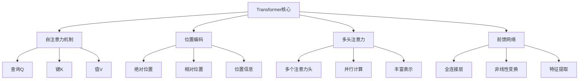
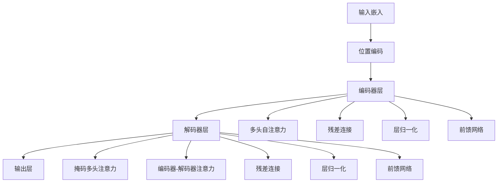

# Transformer架构

## 🚀 Transformer基础

### 1. Transformer核心思想

**Transformer定义：**
> **Transformer是一种基于注意力机制的神经网络架构，完全基于注意力机制，无需循环或卷积结构**

**Transformer核心思想：**


### 2. Transformer架构

**Transformer架构：**


## 🔧 Transformer核心组件

### 1. 自注意力机制

**自注意力实现：**
```python
import numpy as np
import matplotlib.pyplot as plt

class SelfAttention:
    """自注意力机制实现"""
    
    def __init__(self, d_model, d_k, d_v):
        self.d_model = d_model
        self.d_k = d_k
        self.d_v = d_v
        
        # 初始化权重矩阵
        self.W_q = np.random.randn(d_model, d_k) * 0.1
        self.W_k = np.random.randn(d_model, d_k) * 0.1
        self.W_v = np.random.randn(d_model, d_v) * 0.1
        
        # 存储中间结果
        self.Q = None
        self.K = None
        self.V = None
        self.attention_weights = None
    
    def forward(self, X):
        """前向传播"""
        batch_size, seq_len, d_model = X.shape
        
        # 计算Q, K, V
        self.Q = np.dot(X, self.W_q)  # (batch_size, seq_len, d_k)
        self.K = np.dot(X, self.W_k)  # (batch_size, seq_len, d_k)
        self.V = np.dot(X, self.W_v)  # (batch_size, seq_len, d_v)
        
        # 计算注意力分数
        scores = np.dot(self.Q, self.K.transpose(0, 2, 1)) / np.sqrt(self.d_k)
        
        # 应用softmax
        self.attention_weights = self._softmax(scores, axis=-1)
        
        # 计算输出
        output = np.dot(self.attention_weights, self.V)
        
        return output
    
    def _softmax(self, x, axis=-1):
        """Softmax函数"""
        exp_x = np.exp(x - np.max(x, axis=axis, keepdims=True))
        return exp_x / np.sum(exp_x, axis=axis, keepdims=True)
    
    def visualize_attention(self, X, head_idx=0):
        """可视化注意力权重"""
        # 前向传播
        output = self.forward(X)
        
        # 可视化注意力权重
        plt.figure(figsize=(10, 8))
        
        # 注意力权重热力图
        attention_weights = self.attention_weights[0]  # 取第一个样本
        plt.imshow(attention_weights, cmap='Blues', aspect='auto')
        plt.colorbar()
        plt.title('Self-Attention Weights')
        plt.xlabel('Key Position')
        plt.ylabel('Query Position')
        
        # 添加文本标注
        for i in range(attention_weights.shape[0]):
            for j in range(attention_weights.shape[1]):
                plt.text(j, i, f'{attention_weights[i, j]:.2f}', 
                        ha='center', va='center', color='red')
        
        plt.tight_layout()
        plt.show()
        
        return attention_weights
    
    def analyze_attention_patterns(self, X):
        """分析注意力模式"""
        # 前向传播
        output = self.forward(X)
        
        # 分析注意力模式
        attention_weights = self.attention_weights[0]
        
        # 计算注意力统计
        mean_attention = np.mean(attention_weights, axis=0)
        max_attention = np.max(attention_weights, axis=0)
        entropy = -np.sum(attention_weights * np.log(attention_weights + 1e-15), axis=1)
        
        # 可视化
        fig, axes = plt.subplots(2, 2, figsize=(12, 10))
        
        # 平均注意力
        axes[0, 0].bar(range(len(mean_attention)), mean_attention)
        axes[0, 0].set_title('Mean Attention')
        axes[0, 0].set_xlabel('Position')
        axes[0, 0].set_ylabel('Attention Weight')
        axes[0, 0].grid(True)
        
        # 最大注意力
        axes[0, 1].bar(range(len(max_attention)), max_attention)
        axes[0, 1].set_title('Max Attention')
        axes[0, 1].set_xlabel('Position')
        axes[0, 1].set_ylabel('Attention Weight')
        axes[0, 1].grid(True)
        
        # 注意力熵
        axes[1, 0].bar(range(len(entropy)), entropy)
        axes[1, 0].set_title('Attention Entropy')
        axes[1, 0].set_xlabel('Position')
        axes[1, 0].set_ylabel('Entropy')
        axes[1, 0].grid(True)
        
        # 注意力权重分布
        axes[1, 1].hist(attention_weights.flatten(), bins=50, alpha=0.7)
        axes[1, 1].set_title('Attention Weights Distribution')
        axes[1, 1].set_xlabel('Attention Weight')
        axes[1, 1].set_ylabel('Frequency')
        axes[1, 1].grid(True)
        
        plt.tight_layout()
        plt.show()
        
        return mean_attention, max_attention, entropy

# 测试自注意力
def test_self_attention():
    """测试自注意力机制"""
    # 生成输入数据
    batch_size = 1
    seq_len = 10
    d_model = 64
    
    X = np.random.randn(batch_size, seq_len, d_model)
    
    # 创建自注意力层
    self_attention = SelfAttention(d_model=64, d_k=64, d_v=64)
    
    # 前向传播
    output = self_attention.forward(X)
    
    print(f"输入形状: {X.shape}")
    print(f"输出形状: {output.shape}")
    
    # 可视化注意力
    attention_weights = self_attention.visualize_attention(X)
    
    # 分析注意力模式
    mean_attention, max_attention, entropy = self_attention.analyze_attention_patterns(X)
    
    return self_attention

test_self_attention()
```

### 2. 多头注意力

**多头注意力实现：**
```python
class MultiHeadAttention:
    """多头注意力机制"""
    
    def __init__(self, d_model, num_heads):
        self.d_model = d_model
        self.num_heads = num_heads
        self.d_k = d_model // num_heads
        self.d_v = d_model // num_heads
        
        # 初始化权重矩阵
        self.W_q = np.random.randn(d_model, d_model) * 0.1
        self.W_k = np.random.randn(d_model, d_model) * 0.1
        self.W_v = np.random.randn(d_model, d_model) * 0.1
        self.W_o = np.random.randn(d_model, d_model) * 0.1
        
        # 存储中间结果
        self.attention_weights = []
        self.outputs = []
    
    def forward(self, X):
        """前向传播"""
        batch_size, seq_len, d_model = X.shape
        
        # 计算Q, K, V
        Q = np.dot(X, self.W_q)
        K = np.dot(X, self.W_k)
        V = np.dot(X, self.W_v)
        
        # 重塑为多头形式
        Q = Q.reshape(batch_size, seq_len, self.num_heads, self.d_k).transpose(0, 2, 1, 3)
        K = K.reshape(batch_size, seq_len, self.num_heads, self.d_k).transpose(0, 2, 1, 3)
        V = V.reshape(batch_size, seq_len, self.num_heads, self.d_v).transpose(0, 2, 1, 3)
        
        # 计算注意力
        attention_outputs = []
        self.attention_weights = []
        
        for h in range(self.num_heads):
            # 计算注意力分数
            scores = np.dot(Q[:, h], K[:, h].transpose(0, 2, 1)) / np.sqrt(self.d_k)
            
            # 应用softmax
            attention_weights = self._softmax(scores, axis=-1)
            self.attention_weights.append(attention_weights)
            
            # 计算输出
            attention_output = np.dot(attention_weights, V[:, h])
            attention_outputs.append(attention_output)
        
        # 拼接多头输出
        multi_head_output = np.concatenate(attention_outputs, axis=-1)
        
        # 线性变换
        output = np.dot(multi_head_output, self.W_o)
        
        return output
    
    def _softmax(self, x, axis=-1):
        """Softmax函数"""
        exp_x = np.exp(x - np.max(x, axis=axis, keepdims=True))
        return exp_x / np.sum(exp_x, axis=axis, keepdims=True)
    
    def visualize_multi_head_attention(self, X):
        """可视化多头注意力"""
        # 前向传播
        output = self.forward(X)
        
        # 可视化每个注意力头
        fig, axes = plt.subplots(2, self.num_heads//2, figsize=(15, 10))
        
        for h in range(self.num_heads):
            row = h // (self.num_heads//2)
            col = h % (self.num_heads//2)
            
            attention_weights = self.attention_weights[h][0]  # 取第一个样本
            im = axes[row, col].imshow(attention_weights, cmap='Blues', aspect='auto')
            axes[row, col].set_title(f'Head {h+1}')
            axes[row, col].set_xlabel('Key Position')
            axes[row, col].set_ylabel('Query Position')
            plt.colorbar(im, ax=axes[row, col])
        
        plt.tight_layout()
        plt.show()
        
        return self.attention_weights
    
    def analyze_head_diversity(self, X):
        """分析注意力头多样性"""
        # 前向传播
        output = self.forward(X)
        
        # 计算注意力头之间的相似性
        similarities = np.zeros((self.num_heads, self.num_heads))
        
        for i in range(self.num_heads):
            for j in range(self.num_heads):
                # 计算余弦相似性
                attention_i = self.attention_weights[i][0].flatten()
                attention_j = self.attention_weights[j][0].flatten()
                
                similarity = np.dot(attention_i, attention_j) / (np.linalg.norm(attention_i) * np.linalg.norm(attention_j))
                similarities[i, j] = similarity
        
        # 可视化相似性矩阵
        plt.figure(figsize=(10, 8))
        plt.imshow(similarities, cmap='RdBu', aspect='auto')
        plt.colorbar()
        plt.title('Attention Head Similarity')
        plt.xlabel('Head')
        plt.ylabel('Head')
        
        # 添加文本标注
        for i in range(self.num_heads):
            for j in range(self.num_heads):
                plt.text(j, i, f'{similarities[i, j]:.2f}', 
                        ha='center', va='center', color='black')
        
        plt.tight_layout()
        plt.show()
        
        return similarities

# 测试多头注意力
def test_multi_head_attention():
    """测试多头注意力"""
    # 生成输入数据
    batch_size = 1
    seq_len = 8
    d_model = 64
    
    X = np.random.randn(batch_size, seq_len, d_model)
    
    # 创建多头注意力层
    mha = MultiHeadAttention(d_model=64, num_heads=8)
    
    # 前向传播
    output = mha.forward(X)
    
    print(f"输入形状: {X.shape}")
    print(f"输出形状: {output.shape}")
    
    # 可视化多头注意力
    attention_weights = mha.visualize_multi_head_attention(X)
    
    # 分析注意力头多样性
    similarities = mha.analyze_head_diversity(X)
    
    return mha

test_multi_head_attention()
```

### 3. 位置编码

**位置编码实现：**
```python
class PositionalEncoding:
    """位置编码实现"""
    
    def __init__(self, d_model, max_seq_len=1000):
        self.d_model = d_model
        self.max_seq_len = max_seq_len
        
        # 生成位置编码
        self.positional_encoding = self._generate_positional_encoding()
    
    def _generate_positional_encoding(self):
        """生成位置编码"""
        pe = np.zeros((self.max_seq_len, self.d_model))
        
        for pos in range(self.max_seq_len):
            for i in range(0, self.d_model, 2):
                pe[pos, i] = np.sin(pos / (10000 ** (2 * i / self.d_model)))
                if i + 1 < self.d_model:
                    pe[pos, i + 1] = np.cos(pos / (10000 ** (2 * (i + 1) / self.d_model)))
        
        return pe
    
    def forward(self, X):
        """添加位置编码"""
        seq_len = X.shape[1]
        return X + self.positional_encoding[:seq_len]
    
    def visualize_positional_encoding(self):
        """可视化位置编码"""
        plt.figure(figsize=(12, 8))
        
        # 位置编码热力图
        plt.imshow(self.positional_encoding[:50].T, cmap='RdBu', aspect='auto')
        plt.colorbar()
        plt.title('Positional Encoding')
        plt.xlabel('Position')
        plt.ylabel('Dimension')
        
        plt.tight_layout()
        plt.show()
        
        # 位置编码曲线
        plt.figure(figsize=(12, 8))
        
        for i in range(0, min(64, self.d_model), 8):
            plt.plot(self.positional_encoding[:100, i], label=f'Dimension {i}')
        
        plt.xlabel('Position')
        plt.ylabel('Encoding Value')
        plt.title('Positional Encoding Curves')
        plt.legend()
        plt.grid(True)
        plt.show()
    
    def analyze_positional_encoding(self):
        """分析位置编码"""
        # 计算位置编码的统计特性
        mean_encoding = np.mean(self.positional_encoding, axis=0)
        std_encoding = np.std(self.positional_encoding, axis=0)
        max_encoding = np.max(self.positional_encoding, axis=0)
        min_encoding = np.min(self.positional_encoding, axis=0)
        
        # 可视化
        fig, axes = plt.subplots(2, 2, figsize=(12, 10))
        
        # 均值
        axes[0, 0].plot(mean_encoding)
        axes[0, 0].set_title('Mean Encoding')
        axes[0, 0].set_xlabel('Dimension')
        axes[0, 0].set_ylabel('Mean Value')
        axes[0, 0].grid(True)
        
        # 标准差
        axes[0, 1].plot(std_encoding)
        axes[0, 1].set_title('Std Encoding')
        axes[0, 1].set_xlabel('Dimension')
        axes[0, 1].set_ylabel('Std Value')
        axes[0, 1].grid(True)
        
        # 最大值
        axes[1, 0].plot(max_encoding)
        axes[1, 0].set_title('Max Encoding')
        axes[1, 0].set_xlabel('Dimension')
        axes[1, 0].set_ylabel('Max Value')
        axes[1, 0].grid(True)
        
        # 最小值
        axes[1, 1].plot(min_encoding)
        axes[1, 1].set_title('Min Encoding')
        axes[1, 1].set_xlabel('Dimension')
        axes[1, 1].set_ylabel('Min Value')
        axes[1, 1].grid(True)
        
        plt.tight_layout()
        plt.show()
        
        return mean_encoding, std_encoding, max_encoding, min_encoding

# 测试位置编码
def test_positional_encoding():
    """测试位置编码"""
    # 创建位置编码
    pe = PositionalEncoding(d_model=64, max_seq_len=1000)
    
    # 可视化位置编码
    pe.visualize_positional_encoding()
    
    # 分析位置编码
    mean_encoding, std_encoding, max_encoding, min_encoding = pe.analyze_positional_encoding()
    
    return pe

test_positional_encoding()
```

## 🔗 相关链接
- [[02-02-01-神经网络原理]] - 神经网络
- [[02-02-02-反向传播算法]] - 反向传播
- [[02-03-03-RNN循环神经网络]] - RNN
- [[03-02-03-语言模型发展]] - 语言模型

## 💡 Transformer学习建议

**学习策略：**
- 🚀 **理解注意力**：深入理解注意力机制的原理
- 📊 **可视化分析**：通过可视化理解注意力模式
- 🔍 **架构设计**：掌握Transformer的架构设计
- ⚡ **应用实践**：在实际任务中应用Transformer

**实践建议：**
- 📝 **动手实现**：从零开始实现Transformer组件
- 💻 **文本处理**：在自然语言处理任务中使用Transformer
- 📊 **注意力分析**：分析注意力权重的模式和含义
- 🔍 **性能优化**：优化Transformer的训练和推理性能

---
*📝 学习提示：Transformer是自然语言处理的重要工具，建议深入理解注意力机制，通过实践掌握Transformer的设计和应用*


