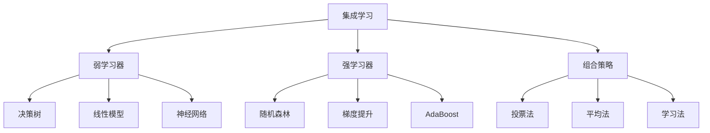

# 集成学习方法

## 🔗 集成学习基础

### 1. 集成学习概念

**集成学习定义：**
> **集成学习是通过组合多个学习器来提高预测性能的机器学习方法**

**集成学习原理：**


### 2. 集成学习类型

**集成学习分类：**

| 类型 | 方法 | 特点 | 代表算法 |
|------|------|------|----------|
| **Bagging** | 并行训练 | 减少方差 | 随机森林 |
| **Boosting** | 串行训练 | 减少偏差 | AdaBoost, GBDT |
| **Stacking** | 元学习 | 学习组合 | Stacking |
| **Blending** | 简单组合 | 简单有效 | Blending |

## 🔧 经典集成算法

### 1. 随机森林

**随机森林实现：**
```python
import numpy as np
import matplotlib.pyplot as plt
from sklearn.tree import DecisionTreeClassifier
from sklearn.model_selection import train_test_split
from sklearn.metrics import accuracy_score, classification_report

class RandomForest:
    """随机森林实现"""
    
    def __init__(self, n_estimators=100, max_depth=None, min_samples_split=2, 
                 min_samples_leaf=1, max_features='sqrt', random_state=42):
        self.n_estimators = n_estimators
        self.max_depth = max_depth
        self.min_samples_split = min_samples_split
        self.min_samples_leaf = min_samples_leaf
        self.max_features = max_features
        self.random_state = random_state
        self.trees = []
        self.feature_importances = None
    
    def fit(self, X, y):
        """训练随机森林"""
        np.random.seed(self.random_state)
        n_samples, n_features = X.shape
        
        # 确定特征数量
        if self.max_features == 'sqrt':
            max_features = int(np.sqrt(n_features))
        elif self.max_features == 'log2':
            max_features = int(np.log2(n_features))
        else:
            max_features = self.max_features
        
        # 训练多个决策树
        for i in range(self.n_estimators):
            # 随机采样
            bootstrap_indices = np.random.choice(n_samples, n_samples, replace=True)
            X_bootstrap = X[bootstrap_indices]
            y_bootstrap = y[bootstrap_indices]
            
            # 随机特征选择
            feature_indices = np.random.choice(n_features, max_features, replace=False)
            X_bootstrap = X_bootstrap[:, feature_indices]
            
            # 训练决策树
            tree = DecisionTreeClassifier(
                max_depth=self.max_depth,
                min_samples_split=self.min_samples_split,
                min_samples_leaf=self.min_samples_leaf,
                random_state=self.random_state + i
            )
            tree.fit(X_bootstrap, y_bootstrap)
            
            # 存储树和特征索引
            self.trees.append((tree, feature_indices))
        
        # 计算特征重要性
        self._calculate_feature_importances(X.shape[1])
        
        return self
    
    def predict(self, X):
        """预测"""
        predictions = []
        
        for tree, feature_indices in self.trees:
            X_subset = X[:, feature_indices]
            pred = tree.predict(X_subset)
            predictions.append(pred)
        
        # 投票
        predictions = np.array(predictions)
        final_predictions = []
        
        for i in range(X.shape[0]):
            votes = predictions[:, i]
            unique, counts = np.unique(votes, return_counts=True)
            final_predictions.append(unique[np.argmax(counts)])
        
        return np.array(final_predictions)
    
    def predict_proba(self, X):
        """预测概率"""
        probabilities = []
        
        for tree, feature_indices in self.trees:
            X_subset = X[:, feature_indices]
            prob = tree.predict_proba(X_subset)
            probabilities.append(prob)
        
        # 平均概率
        probabilities = np.array(probabilities)
        return np.mean(probabilities, axis=0)
    
    def _calculate_feature_importances(self, n_features):
        """计算特征重要性"""
        self.feature_importances = np.zeros(n_features)
        
        for tree, feature_indices in self.trees:
            tree_importances = tree.feature_importances_
            for i, feature_idx in enumerate(feature_indices):
                self.feature_importances[feature_idx] += tree_importances[i]
        
        # 归一化
        self.feature_importances /= self.n_estimators
    
    def visualize_feature_importances(self, feature_names=None):
        """可视化特征重要性"""
        if feature_names is None:
            feature_names = [f'Feature {i}' for i in range(len(self.feature_importances))]
        
        # 排序特征重要性
        indices = np.argsort(self.feature_importances)[::-1]
        
        plt.figure(figsize=(10, 8))
        plt.barh(range(len(self.feature_importances)), self.feature_importances[indices])
        plt.yticks(range(len(self.feature_importances)), [feature_names[i] for i in indices])
        plt.xlabel('Feature Importance')
        plt.title('Random Forest Feature Importances')
        plt.grid(True)
        plt.show()
    
    def analyze_tree_diversity(self, X):
        """分析树的多样性"""
        predictions = []
        
        for tree, feature_indices in self.trees:
            X_subset = X[:, feature_indices]
            pred = tree.predict(X_subset)
            predictions.append(pred)
        
        predictions = np.array(predictions)
        
        # 计算树之间的相似性
        similarities = np.zeros((self.n_estimators, self.n_estimators))
        
        for i in range(self.n_estimators):
            for j in range(self.n_estimators):
                similarity = np.mean(predictions[i] == predictions[j])
                similarities[i, j] = similarity
        
        # 可视化相似性矩阵
        plt.figure(figsize=(10, 8))
        plt.imshow(similarities, cmap='Blues', aspect='auto')
        plt.colorbar()
        plt.title('Tree Similarity Matrix')
        plt.xlabel('Tree Index')
        plt.ylabel('Tree Index')
        plt.show()
        
        return similarities

# 测试随机森林
def test_random_forest():
    """测试随机森林"""
    # 生成数据
    from sklearn.datasets import make_classification
    X, y = make_classification(n_samples=1000, n_features=20, n_informative=10, random_state=42)
    X_train, X_test, y_train, y_test = train_test_split(X, y, test_size=0.2, random_state=42)
    
    # 训练随机森林
    rf = RandomForest(n_estimators=100, max_depth=10, random_state=42)
    rf.fit(X_train, y_train)
    
    # 预测
    y_pred = rf.predict(X_test)
    accuracy = accuracy_score(y_test, y_pred)
    
    print(f"随机森林准确率: {accuracy:.4f}")
    
    # 可视化特征重要性
    rf.visualize_feature_importances()
    
    # 分析树的多样性
    similarities = rf.analyze_tree_diversity(X_test)
    
    return rf

test_random_forest()
```

### 2. AdaBoost

**AdaBoost实现：**
```python
class AdaBoost:
    """AdaBoost实现"""
    
    def __init__(self, n_estimators=50, learning_rate=1.0, random_state=42):
        self.n_estimators = n_estimators
        self.learning_rate = learning_rate
        self.random_state = random_state
        self.estimators = []
        self.estimator_weights = []
        self.estimator_errors = []
    
    def fit(self, X, y):
        """训练AdaBoost"""
        np.random.seed(self.random_state)
        n_samples = X.shape[0]
        
        # 初始化样本权重
        sample_weights = np.ones(n_samples) / n_samples
        
        for i in range(self.n_estimators):
            # 训练弱学习器
            estimator = DecisionTreeClassifier(max_depth=1, random_state=self.random_state + i)
            estimator.fit(X, y, sample_weight=sample_weights)
            
            # 预测
            y_pred = estimator.predict(X)
            
            # 计算错误率
            error = np.sum(sample_weights * (y_pred != y))
            
            # 计算估计器权重
            estimator_weight = self.learning_rate * np.log((1 - error) / (error + 1e-15))
            
            # 更新样本权重
            sample_weights *= np.exp(estimator_weight * (y_pred != y))
            sample_weights /= np.sum(sample_weights)
            
            # 存储结果
            self.estimators.append(estimator)
            self.estimator_weights.append(estimator_weight)
            self.estimator_errors.append(error)
            
            # 早停条件
            if error >= 0.5:
                break
        
        return self
    
    def predict(self, X):
        """预测"""
        predictions = np.zeros(X.shape[0])
        
        for estimator, weight in zip(self.estimators, self.estimator_weights):
            pred = estimator.predict(X)
            predictions += weight * pred
        
        return np.sign(predictions)
    
    def predict_proba(self, X):
        """预测概率"""
        predictions = np.zeros(X.shape[0])
        
        for estimator, weight in zip(self.estimators, self.estimator_weights):
            pred = estimator.predict(X)
            predictions += weight * pred
        
        # 转换为概率
        probabilities = 1 / (1 + np.exp(-predictions))
        return np.column_stack([1 - probabilities, probabilities])
    
    def visualize_boosting_process(self, X, y):
        """可视化Boosting过程"""
        # 训练过程
        errors = []
        weights = []
        
        for i in range(self.n_estimators):
            if i < len(self.estimator_errors):
                errors.append(self.estimator_errors[i])
                weights.append(self.estimator_weights[i])
        
        # 可视化
        fig, axes = plt.subplots(2, 2, figsize=(12, 10))
        
        # 错误率变化
        axes[0, 0].plot(errors)
        axes[0, 0].set_title('Estimator Error Rate')
        axes[0, 0].set_xlabel('Estimator')
        axes[0, 0].set_ylabel('Error Rate')
        axes[0, 0].grid(True)
        
        # 估计器权重
        axes[0, 1].plot(weights)
        axes[0, 1].set_title('Estimator Weights')
        axes[0, 1].set_xlabel('Estimator')
        axes[0, 1].set_ylabel('Weight')
        axes[0, 1].grid(True)
        
        # 累积错误率
        cumulative_errors = np.cumsum(errors)
        axes[1, 0].plot(cumulative_errors)
        axes[1, 0].set_title('Cumulative Error')
        axes[1, 0].set_xlabel('Estimator')
        axes[1, 0].set_ylabel('Cumulative Error')
        axes[1, 0].grid(True)
        
        # 权重分布
        axes[1, 1].hist(weights, bins=20, alpha=0.7)
        axes[1, 1].set_title('Weight Distribution')
        axes[1, 1].set_xlabel('Weight')
        axes[1, 1].set_ylabel('Frequency')
        axes[1, 1].grid(True)
        
        plt.tight_layout()
        plt.show()
        
        return errors, weights

# 测试AdaBoost
def test_adaboost():
    """测试AdaBoost"""
    # 生成数据
    from sklearn.datasets import make_classification
    X, y = make_classification(n_samples=1000, n_features=2, n_redundant=0, n_informative=2, random_state=42)
    y = 2 * y - 1  # 转换为-1和1
    X_train, X_test, y_train, y_test = train_test_split(X, y, test_size=0.2, random_state=42)
    
    # 训练AdaBoost
    adaboost = AdaBoost(n_estimators=50, learning_rate=1.0, random_state=42)
    adaboost.fit(X_train, y_train)
    
    # 预测
    y_pred = adaboost.predict(X_test)
    accuracy = accuracy_score(y_test, y_pred)
    
    print(f"AdaBoost准确率: {accuracy:.4f}")
    
    # 可视化Boosting过程
    errors, weights = adaboost.visualize_boosting_process(X_test, y_test)
    
    return adaboost

test_adaboost()
```

### 3. 梯度提升

**梯度提升实现：**
```python
class GradientBoosting:
    """梯度提升实现"""
    
    def __init__(self, n_estimators=100, learning_rate=0.1, max_depth=3, random_state=42):
        self.n_estimators = n_estimators
        self.learning_rate = learning_rate
        self.max_depth = max_depth
        self.random_state = random_state
        self.estimators = []
        self.loss_history = []
    
    def fit(self, X, y):
        """训练梯度提升"""
        np.random.seed(self.random_state)
        n_samples = X.shape[0]
        
        # 初始化预测值
        f0 = np.mean(y)
        predictions = np.full(n_samples, f0)
        
        for i in range(self.n_estimators):
            # 计算负梯度（残差）
            residuals = y - predictions
            
            # 训练回归树
            tree = DecisionTreeRegressor(max_depth=self.max_depth, random_state=self.random_state + i)
            tree.fit(X, residuals)
            
            # 更新预测值
            tree_predictions = tree.predict(X)
            predictions += self.learning_rate * tree_predictions
            
            # 存储估计器
            self.estimators.append(tree)
            
            # 计算损失
            loss = np.mean((y - predictions)**2)
            self.loss_history.append(loss)
            
            # 早停条件
            if loss < 1e-6:
                break
        
        return self
    
    def predict(self, X):
        """预测"""
        predictions = np.full(X.shape[0], np.mean(self.loss_history[0]) if self.loss_history else 0)
        
        for tree in self.estimators:
            predictions += self.learning_rate * tree.predict(X)
        
        return predictions
    
    def visualize_boosting_process(self, X, y):
        """可视化Boosting过程"""
        # 训练过程
        losses = self.loss_history
        
        # 可视化
        fig, axes = plt.subplots(2, 2, figsize=(12, 10))
        
        # 损失函数变化
        axes[0, 0].plot(losses)
        axes[0, 0].set_title('Loss Function')
        axes[0, 0].set_xlabel('Iteration')
        axes[0, 0].set_ylabel('Loss')
        axes[0, 0].grid(True)
        
        # 损失函数对数尺度
        axes[0, 1].semilogy(losses)
        axes[0, 1].set_title('Loss Function (Log Scale)')
        axes[0, 1].set_xlabel('Iteration')
        axes[0, 1].set_ylabel('Loss (Log Scale)')
        axes[0, 1].grid(True)
        
        # 预测值变化
        predictions_history = []
        f0 = np.mean(y)
        predictions = np.full(X.shape[0], f0)
        
        for tree in self.estimators:
            predictions += self.learning_rate * tree.predict(X)
            predictions_history.append(predictions.copy())
        
        predictions_history = np.array(predictions_history)
        
        # 显示前几个样本的预测值变化
        for i in range(min(5, X.shape[0])):
            axes[1, 0].plot(predictions_history[:, i], label=f'Sample {i}')
        axes[1, 0].set_title('Prediction Evolution')
        axes[1, 0].set_xlabel('Iteration')
        axes[1, 0].set_ylabel('Prediction')
        axes[1, 0].legend()
        axes[1, 0].grid(True)
        
        # 最终预测vs真实值
        final_predictions = self.predict(X)
        axes[1, 1].scatter(y, final_predictions, alpha=0.6)
        axes[1, 1].plot([y.min(), y.max()], [y.min(), y.max()], 'r--', linewidth=2)
        axes[1, 1].set_title('Final Predictions vs True Values')
        axes[1, 1].set_xlabel('True Values')
        axes[1, 1].set_ylabel('Predicted Values')
        axes[1, 1].grid(True)
        
        plt.tight_layout()
        plt.show()
        
        return losses, predictions_history

# 测试梯度提升
def test_gradient_boosting():
    """测试梯度提升"""
    # 生成数据
    from sklearn.datasets import make_regression
    X, y = make_regression(n_samples=1000, n_features=10, noise=10, random_state=42)
    X_train, X_test, y_train, y_test = train_test_split(X, y, test_size=0.2, random_state=42)
    
    # 训练梯度提升
    gb = GradientBoosting(n_estimators=100, learning_rate=0.1, max_depth=3, random_state=42)
    gb.fit(X_train, y_train)
    
    # 预测
    y_pred = gb.predict(X_test)
    mse = np.mean((y_test - y_pred)**2)
    
    print(f"梯度提升MSE: {mse:.4f}")
    
    # 可视化Boosting过程
    losses, predictions_history = gb.visualize_boosting_process(X_test, y_test)
    
    return gb

test_gradient_boosting()
```

## 🔗 相关链接
- [[02-01-01-监督学习原理]] - 监督学习
- [[02-01-04-模型评估方法]] - 模型评估
- [[02-01-06-机器学习算法对比]] - 算法对比
- [[02-03-01-经典算法实现]] - 算法实现

## 💡 集成学习建议

**学习策略：**
- 🔗 **理解原理**：深入理解集成学习的原理
- 📊 **比较方法**：比较不同集成方法的特点
- 🔍 **参数调优**：学习如何调优集成学习参数
- ⚡ **应用实践**：在实际问题中应用集成学习

**实践建议：**
- 📝 **动手实现**：从零开始实现集成学习算法
- 💻 **数据实验**：在不同数据集上测试集成方法
- 📊 **性能分析**：分析集成学习的性能提升
- 🔍 **问题诊断**：诊断集成学习中的问题

---
*📝 学习提示：集成学习是提高模型性能的重要方法，建议理解各种集成方法的原理，通过实践掌握集成学习的应用*

