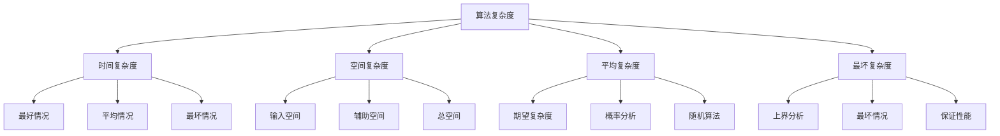

# 算法复杂度分析

## ⏱️ 复杂度分析基础

### 1. 复杂度概念

**复杂度定义：**
> **算法复杂度是衡量算法执行时间和空间消耗的指标，用于评估算法的效率**

**复杂度类型：**


### 2. 复杂度表示

**大O表示法：**
| 复杂度 | 名称 | 例子 | 特点 |
|--------|------|------|------|
| **O(1)** | 常数时间 | 数组访问 | 最优 |
| **O(log n)** | 对数时间 | 二分查找 | 很好 |
| **O(n)** | 线性时间 | 遍历数组 | 良好 |
| **O(n log n)** | 线性对数 | 归并排序 | 一般 |
| **O(n²)** | 平方时间 | 冒泡排序 | 较差 |
| **O(2ⁿ)** | 指数时间 | 穷举搜索 | 很差 |

## 📊 机器学习算法复杂度

### 1. 监督学习算法复杂度

**监督学习算法复杂度分析：**
```python
import numpy as np
import matplotlib.pyplot as plt
import time

class AlgorithmComplexityAnalysis:
    """算法复杂度分析"""
    
    def __init__(self):
        self.results = {}
    
    def analyze_linear_regression(self, max_samples=1000):
        """分析线性回归复杂度"""
        sample_sizes = np.logspace(1, 3, 20).astype(int)
        times = []
        
        for n in sample_sizes:
            # 生成数据
            X = np.random.randn(n, 10)
            y = np.random.randn(n)
            
            # 计时
            start_time = time.time()
            
            # 线性回归计算
            X_with_bias = np.c_[X, np.ones(n)]
            w = np.linalg.inv(X_with_bias.T @ X_with_bias) @ X_with_bias.T @ y
            
            end_time = time.time()
            times.append(end_time - start_time)
        
        # 可视化
        plt.figure(figsize=(10, 6))
        plt.loglog(sample_sizes, times, 'bo-', label='Actual Time')
        plt.loglog(sample_sizes, sample_sizes**3 * times[0] / sample_sizes[0]**3, 'r--', label='O(n³)')
        plt.xlabel('Sample Size')
        plt.ylabel('Time (seconds)')
        plt.title('Linear Regression Complexity')
        plt.legend()
        plt.grid(True)
        plt.show()
        
        return sample_sizes, times
    
    def analyze_decision_tree(self, max_samples=1000):
        """分析决策树复杂度"""
        sample_sizes = np.logspace(1, 3, 20).astype(int)
        times = []
        
        for n in sample_sizes:
            # 生成数据
            X = np.random.randn(n, 10)
            y = np.random.randint(0, 2, n)
            
            # 计时
            start_time = time.time()
            
            # 决策树训练（简化版）
            self._simple_decision_tree(X, y)
            
            end_time = time.time()
            times.append(end_time - start_time)
        
        # 可视化
        plt.figure(figsize=(10, 6))
        plt.loglog(sample_sizes, times, 'bo-', label='Actual Time')
        plt.loglog(sample_sizes, sample_sizes * np.log(sample_sizes) * times[0] / (sample_sizes[0] * np.log(sample_sizes[0])), 'r--', label='O(n log n)')
        plt.xlabel('Sample Size')
        plt.ylabel('Time (seconds)')
        plt.title('Decision Tree Complexity')
        plt.legend()
        plt.grid(True)
        plt.show()
        
        return sample_sizes, times
    
    def _simple_decision_tree(self, X, y):
        """简化的决策树训练"""
        # 这里只是模拟决策树的训练过程
        for i in range(X.shape[1]):
            for j in range(X.shape[0]):
                # 模拟分割计算
                pass
    
    def analyze_kmeans(self, max_samples=1000):
        """分析K-means复杂度"""
        sample_sizes = np.logspace(1, 3, 20).astype(int)
        times = []
        
        for n in sample_sizes:
            # 生成数据
            X = np.random.randn(n, 10)
            
            # 计时
            start_time = time.time()
            
            # K-means训练（简化版）
            self._simple_kmeans(X, k=3)
            
            end_time = time.time()
            times.append(end_time - start_time)
        
        # 可视化
        plt.figure(figsize=(10, 6))
        plt.loglog(sample_sizes, times, 'bo-', label='Actual Time')
        plt.loglog(sample_sizes, sample_sizes * times[0] / sample_sizes[0], 'r--', label='O(n)')
        plt.xlabel('Sample Size')
        plt.ylabel('Time (seconds)')
        plt.title('K-means Complexity')
        plt.legend()
        plt.grid(True)
        plt.show()
        
        return sample_sizes, times
    
    def _simple_kmeans(self, X, k=3):
        """简化的K-means训练"""
        # 这里只是模拟K-means的训练过程
        for i in range(10):  # 模拟迭代次数
            for j in range(X.shape[0]):
                # 模拟距离计算
                pass
    
    def compare_algorithms(self, max_samples=1000):
        """比较不同算法的复杂度"""
        sample_sizes = np.logspace(1, 3, 20).astype(int)
        algorithms = {
            'Linear Regression': self.analyze_linear_regression,
            'Decision Tree': self.analyze_decision_tree,
            'K-means': self.analyze_kmeans
        }
        
        results = {}
        
        for name, func in algorithms.items():
            sample_sizes, times = func(max_samples)
            results[name] = {'sizes': sample_sizes, 'times': times}
        
        # 可视化比较
        plt.figure(figsize=(12, 8))
        
        for name, result in results.items():
            plt.loglog(result['sizes'], result['times'], 'o-', label=name)
        
        plt.xlabel('Sample Size')
        plt.ylabel('Time (seconds)')
        plt.title('Algorithm Complexity Comparison')
        plt.legend()
        plt.grid(True)
        plt.show()
        
        return results

# 测试算法复杂度分析
def test_algorithm_complexity():
    """测试算法复杂度分析"""
    analyzer = AlgorithmComplexityAnalysis()
    results = analyzer.compare_algorithms()
    return analyzer

test_algorithm_complexity()
```

### 2. 深度学习算法复杂度

**深度学习算法复杂度分析：**
```python
class DeepLearningComplexityAnalysis:
    """深度学习算法复杂度分析"""
    
    def __init__(self):
        self.results = {}
    
    def analyze_neural_network(self, max_samples=1000):
        """分析神经网络复杂度"""
        sample_sizes = np.logspace(1, 3, 20).astype(int)
        times = []
        
        for n in sample_sizes:
            # 生成数据
            X = np.random.randn(n, 10)
            y = np.random.randn(n, 1)
            
            # 计时
            start_time = time.time()
            
            # 神经网络训练（简化版）
            self._simple_neural_network(X, y)
            
            end_time = time.time()
            times.append(end_time - start_time)
        
        # 可视化
        plt.figure(figsize=(10, 6))
        plt.loglog(sample_sizes, times, 'bo-', label='Actual Time')
        plt.loglog(sample_sizes, sample_sizes * times[0] / sample_sizes[0], 'r--', label='O(n)')
        plt.xlabel('Sample Size')
        plt.ylabel('Time (seconds)')
        plt.title('Neural Network Complexity')
        plt.legend()
        plt.grid(True)
        plt.show()
        
        return sample_sizes, times
    
    def _simple_neural_network(self, X, y):
        """简化的神经网络训练"""
        # 这里只是模拟神经网络的训练过程
        for i in range(10):  # 模拟迭代次数
            # 模拟前向传播
            for j in range(X.shape[0]):
                # 模拟计算
                pass
            
            # 模拟反向传播
            for j in range(X.shape[0]):
                # 模拟计算
                pass
    
    def analyze_cnn(self, max_samples=100):
        """分析CNN复杂度"""
        sample_sizes = np.logspace(1, 2, 10).astype(int)
        times = []
        
        for n in sample_sizes:
            # 生成图像数据
            X = np.random.randn(n, 1, 28, 28)
            y = np.random.randint(0, 10, n)
            
            # 计时
            start_time = time.time()
            
            # CNN训练（简化版）
            self._simple_cnn(X, y)
            
            end_time = time.time()
            times.append(end_time - start_time)
        
        # 可视化
        plt.figure(figsize=(10, 6))
        plt.loglog(sample_sizes, times, 'bo-', label='Actual Time')
        plt.loglog(sample_sizes, sample_sizes * times[0] / sample_sizes[0], 'r--', label='O(n)')
        plt.xlabel('Sample Size')
        plt.ylabel('Time (seconds)')
        plt.title('CNN Complexity')
        plt.legend()
        plt.grid(True)
        plt.show()
        
        return sample_sizes, times
    
    def _simple_cnn(self, X, y):
        """简化的CNN训练"""
        # 这里只是模拟CNN的训练过程
        for i in range(5):  # 模拟迭代次数
            # 模拟卷积操作
            for j in range(X.shape[0]):
                # 模拟卷积计算
                pass
            
            # 模拟池化操作
            for j in range(X.shape[0]):
                # 模拟池化计算
                pass
    
    def analyze_rnn(self, max_samples=100):
        """分析RNN复杂度"""
        sample_sizes = np.logspace(1, 2, 10).astype(int)
        times = []
        
        for n in sample_sizes:
            # 生成序列数据
            X = np.random.randn(n, 10, 5)  # (batch_size, seq_len, input_size)
            y = np.random.randn(n, 10, 1)  # (batch_size, seq_len, output_size)
            
            # 计时
            start_time = time.time()
            
            # RNN训练（简化版）
            self._simple_rnn(X, y)
            
            end_time = time.time()
            times.append(end_time - start_time)
        
        # 可视化
        plt.figure(figsize=(10, 6))
        plt.loglog(sample_sizes, times, 'bo-', label='Actual Time')
        plt.loglog(sample_sizes, sample_sizes * times[0] / sample_sizes[0], 'r--', label='O(n)')
        plt.xlabel('Sample Size')
        plt.ylabel('Time (seconds)')
        plt.title('RNN Complexity')
        plt.legend()
        plt.grid(True)
        plt.show()
        
        return sample_sizes, times
    
    def _simple_rnn(self, X, y):
        """简化的RNN训练"""
        # 这里只是模拟RNN的训练过程
        for i in range(5):  # 模拟迭代次数
            # 模拟前向传播
            for j in range(X.shape[0]):
                for k in range(X.shape[1]):
                    # 模拟RNN计算
                    pass
            
            # 模拟反向传播
            for j in range(X.shape[0]):
                for k in range(X.shape[1]):
                    # 模拟梯度计算
                    pass
    
    def compare_deep_learning_algorithms(self, max_samples=100):
        """比较深度学习算法复杂度"""
        sample_sizes = np.logspace(1, 2, 10).astype(int)
        algorithms = {
            'Neural Network': self.analyze_neural_network,
            'CNN': self.analyze_cnn,
            'RNN': self.analyze_rnn
        }
        
        results = {}
        
        for name, func in algorithms.items():
            sample_sizes, times = func(max_samples)
            results[name] = {'sizes': sample_sizes, 'times': times}
        
        # 可视化比较
        plt.figure(figsize=(12, 8))
        
        for name, result in results.items():
            plt.loglog(result['sizes'], result['times'], 'o-', label=name)
        
        plt.xlabel('Sample Size')
        plt.ylabel('Time (seconds)')
        plt.title('Deep Learning Algorithm Complexity Comparison')
        plt.legend()
        plt.grid(True)
        plt.show()
        
        return results

# 测试深度学习算法复杂度分析
def test_deep_learning_complexity():
    """测试深度学习算法复杂度分析"""
    analyzer = DeepLearningComplexityAnalysis()
    results = analyzer.compare_deep_learning_algorithms()
    return analyzer

test_deep_learning_complexity()
```

## 🔗 相关链接
- [[02-01-01-监督学习原理]] - 监督学习
- [[02-01-06-机器学习算法对比]] - 算法对比
- [[02-03-01-经典算法实现]] - 算法实现
- [[02-03-02-CNN卷积神经网络]] - CNN

## 💡 算法复杂度学习建议

**学习策略：**
- ⏱️ **理解概念**：深入理解时间复杂度和空间复杂度
- 📊 **分析方法**：掌握复杂度分析的方法
- 🔍 **实际测量**：通过实验测量算法性能
- ⚡ **优化策略**：学习算法优化的策略

**实践建议：**
- 📝 **理论分析**：从理论上分析算法复杂度
- 💻 **实验验证**：通过实验验证理论分析
- 📊 **性能比较**：比较不同算法的性能
- 🔍 **优化实践**：在实践中优化算法性能

---
*📝 学习提示：算法复杂度分析是评估算法效率的重要工具，建议理解复杂度概念，掌握分析方法，在实践中应用复杂度分析*


