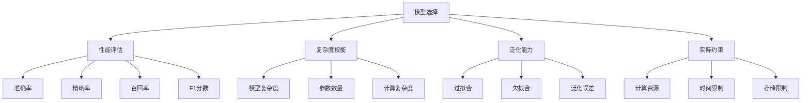

# 模型选择策略

## 🎯 模型选择基础

### 1. 模型选择概念

**模型选择定义：**
> **模型选择是在多个候选模型中选择最佳模型的过程，需要考虑模型的性能、复杂度和泛化能力**

**模型选择原则：**


### 2. 模型选择方法

**模型选择方法：**
| 方法 | 特点 | 适用场景 | 优缺点 |
|------|------|----------|--------|
| **交叉验证** | 数据分割 | 小数据集 | 准确但计算量大 |
| **留一法** | 单样本测试 | 小数据集 | 最准确但最慢 |
| **自助法** | 重采样 | 中等数据集 | 平衡准确性和效率 |
| **信息准则** | 理论准则 | 大数据集 | 快速但可能不准确 |

## 🔧 模型选择实现

### 1. 交叉验证

**交叉验证实现：**
```python
import numpy as np
import matplotlib.pyplot as plt
from sklearn.model_selection import KFold, StratifiedKFold
from sklearn.linear_model import LinearRegression, LogisticRegression
from sklearn.tree import DecisionTreeClassifier
from sklearn.ensemble import RandomForestClassifier
from sklearn.svm import SVC
from sklearn.metrics import accuracy_score, mean_squared_error

class ModelSelection:
    """模型选择实现"""
    
    def __init__(self, cv_folds=5):
        self.cv_folds = cv_folds
        self.models = {}
        self.cv_scores = {}
    
    def add_model(self, name, model):
        """添加模型"""
        self.models[name] = model
    
    def cross_validate(self, X, y, task_type='classification'):
        """交叉验证"""
        if task_type == 'classification':
            kf = StratifiedKFold(n_splits=self.cv_folds, shuffle=True, random_state=42)
            scoring_metric = accuracy_score
        else:
            kf = KFold(n_splits=self.cv_folds, shuffle=True, random_state=42)
            scoring_metric = mean_squared_error
        
        results = {}
        
        for name, model in self.models.items():
            scores = []
            
            for train_idx, val_idx in kf.split(X, y):
                X_train, X_val = X[train_idx], X[val_idx]
                y_train, y_val = y[train_idx], y[val_idx]
                
                # 训练模型
                model.fit(X_train, y_train)
                
                # 预测
                y_pred = model.predict(X_val)
                
                # 计算分数
                if task_type == 'classification':
                    score = scoring_metric(y_val, y_pred)
                else:
                    score = scoring_metric(y_val, y_pred)
                
                scores.append(score)
            
            results[name] = {
                'mean_score': np.mean(scores),
                'std_score': np.std(scores),
                'scores': scores
            }
        
        self.cv_scores = results
        return results
    
    def visualize_cv_results(self):
        """可视化交叉验证结果"""
        names = list(self.cv_scores.keys())
        means = [self.cv_scores[name]['mean_score'] for name in names]
        stds = [self.cv_scores[name]['std_score'] for name in names]
        
        plt.figure(figsize=(12, 8))
        
        # 平均分数
        plt.subplot(2, 2, 1)
        plt.bar(names, means, yerr=stds, capsize=5)
        plt.title('Cross Validation Mean Scores')
        plt.ylabel('Score')
        plt.tick_params(axis='x', rotation=45)
        plt.grid(True)
        
        # 分数分布
        plt.subplot(2, 2, 2)
        for name, result in self.cv_scores.items():
            plt.hist(result['scores'], alpha=0.7, label=name)
        plt.title('Score Distributions')
        plt.xlabel('Score')
        plt.ylabel('Frequency')
        plt.legend()
        plt.grid(True)
        
        # 分数箱线图
        plt.subplot(2, 2, 3)
        scores_data = [result['scores'] for result in self.cv_scores.values()]
        plt.boxplot(scores_data, labels=names)
        plt.title('Score Boxplots')
        plt.ylabel('Score')
        plt.tick_params(axis='x', rotation=45)
        plt.grid(True)
        
        # 分数变化
        plt.subplot(2, 2, 4)
        for name, result in self.cv_scores.items():
            plt.plot(result['scores'], 'o-', label=name)
        plt.title('Score Variations')
        plt.xlabel('Fold')
        plt.ylabel('Score')
        plt.legend()
        plt.grid(True)
        
        plt.tight_layout()
        plt.show()
    
    def select_best_model(self, metric='mean_score'):
        """选择最佳模型"""
        if metric == 'mean_score':
            best_model = max(self.cv_scores, key=lambda x: self.cv_scores[x]['mean_score'])
        elif metric == 'mean_score_minus_std':
            best_model = max(self.cv_scores, key=lambda x: self.cv_scores[x]['mean_score'] - self.cv_scores[x]['std_score'])
        else:
            best_model = max(self.cv_scores, key=lambda x: self.cv_scores[x]['mean_score'])
        
        return best_model, self.cv_scores[best_model]

# 测试模型选择
def test_model_selection():
    """测试模型选择"""
    # 生成数据
    from sklearn.datasets import make_classification
    X, y = make_classification(n_samples=1000, n_features=20, n_informative=10, random_state=42)
    
    # 创建模型选择器
    ms = ModelSelection(cv_folds=5)
    
    # 添加模型
    ms.add_model('Logistic Regression', LogisticRegression(random_state=42))
    ms.add_model('Decision Tree', DecisionTreeClassifier(random_state=42))
    ms.add_model('Random Forest', RandomForestClassifier(random_state=42))
    ms.add_model('SVM', SVC(random_state=42))
    
    # 交叉验证
    results = ms.cross_validate(X, y, task_type='classification')
    
    # 可视化结果
    ms.visualize_cv_results()
    
    # 选择最佳模型
    best_model, best_score = ms.select_best_model()
    print(f"最佳模型: {best_model}")
    print(f"最佳分数: {best_score}")
    
    return ms

test_model_selection()
```

### 2. 信息准则

**信息准则实现：**
```python
class InformationCriterion:
    """信息准则实现"""
    
    def __init__(self):
        self.models = {}
        self.ic_scores = {}
    
    def add_model(self, name, model, n_params):
        """添加模型"""
        self.models[name] = {'model': model, 'n_params': n_params}
    
    def calculate_aic(self, X, y, task_type='classification'):
        """计算AIC"""
        results = {}
        
        for name, model_info in self.models.items():
            model = model_info['model']
            n_params = model_info['n_params']
            
            # 训练模型
            model.fit(X, y)
            
            # 预测
            if task_type == 'classification':
                y_pred = model.predict_proba(X)
                # 计算对数似然
                log_likelihood = np.sum(np.log(y_pred[np.arange(len(y)), y] + 1e-15))
            else:
                y_pred = model.predict(X)
                # 计算对数似然（假设高斯分布）
                mse = np.mean((y - y_pred)**2)
                log_likelihood = -len(y) * np.log(2 * np.pi * mse) / 2
            
            # 计算AIC
            aic = 2 * n_params - 2 * log_likelihood
            results[name] = aic
        
        return results
    
    def calculate_bic(self, X, y, task_type='classification'):
        """计算BIC"""
        results = {}
        n_samples = len(y)
        
        for name, model_info in self.models.items():
            model = model_info['model']
            n_params = model_info['n_params']
            
            # 训练模型
            model.fit(X, y)
            
            # 预测
            if task_type == 'classification':
                y_pred = model.predict_proba(X)
                # 计算对数似然
                log_likelihood = np.sum(np.log(y_pred[np.arange(len(y)), y] + 1e-15))
            else:
                y_pred = model.predict(X)
                # 计算对数似然（假设高斯分布）
                mse = np.mean((y - y_pred)**2)
                log_likelihood = -len(y) * np.log(2 * np.pi * mse) / 2
            
            # 计算BIC
            bic = np.log(n_samples) * n_params - 2 * log_likelihood
            results[name] = bic
        
        return results
    
    def visualize_information_criteria(self, X, y, task_type='classification'):
        """可视化信息准则"""
        # 计算AIC和BIC
        aic_scores = self.calculate_aic(X, y, task_type)
        bic_scores = self.calculate_bic(X, y, task_type)
        
        # 可视化
        fig, axes = plt.subplots(1, 2, figsize=(15, 6))
        
        names = list(aic_scores.keys())
        aic_values = list(aic_scores.values())
        bic_values = list(bic_scores.values())
        
        # AIC分数
        axes[0].bar(names, aic_values)
        axes[0].set_title('AIC Scores')
        axes[0].set_ylabel('AIC')
        axes[0].tick_params(axis='x', rotation=45)
        axes[0].grid(True)
        
        # BIC分数
        axes[1].bar(names, bic_values)
        axes[1].set_title('BIC Scores')
        axes[1].set_ylabel('BIC')
        axes[1].tick_params(axis='x', rotation=45)
        axes[1].grid(True)
        
        plt.tight_layout()
        plt.show()
        
        return aic_scores, bic_scores

# 测试信息准则
def test_information_criterion():
    """测试信息准则"""
    # 生成数据
    from sklearn.datasets import make_classification
    X, y = make_classification(n_samples=1000, n_features=10, n_informative=5, random_state=42)
    
    # 创建信息准则分析器
    ic = InformationCriterion()
    
    # 添加模型
    ic.add_model('Logistic Regression', LogisticRegression(random_state=42), n_params=11)
    ic.add_model('Decision Tree', DecisionTreeClassifier(random_state=42), n_params=20)
    ic.add_model('Random Forest', RandomForestClassifier(n_estimators=10, random_state=42), n_params=200)
    
    # 可视化信息准则
    aic_scores, bic_scores = ic.visualize_information_criteria(X, y, task_type='classification')
    
    print("AIC分数:")
    for name, score in aic_scores.items():
        print(f"{name}: {score:.2f}")
    
    print("\nBIC分数:")
    for name, score in bic_scores.items():
        print(f"{name}: {score:.2f}")
    
    return ic

test_information_criterion()
```

### 3. 模型复杂度分析

**模型复杂度分析：**
```python
class ModelComplexityAnalysis:
    """模型复杂度分析"""
    
    def __init__(self):
        self.models = {}
        self.complexity_scores = {}
    
    def add_model(self, name, model, complexity_type='parametric'):
        """添加模型"""
        self.models[name] = {'model': model, 'complexity_type': complexity_type}
    
    def analyze_complexity(self, X, y):
        """分析模型复杂度"""
        results = {}
        
        for name, model_info in self.models.items():
            model = model_info['model']
            complexity_type = model_info['complexity_type']
            
            # 训练模型
            model.fit(X, y)
            
            # 计算复杂度指标
            if complexity_type == 'parametric':
                # 参数复杂度
                if hasattr(model, 'coef_'):
                    n_params = model.coef_.size + (1 if hasattr(model, 'intercept_') else 0)
                elif hasattr(model, 'n_features_in_'):
                    n_params = model.n_features_in_
                else:
                    n_params = 100  # 默认值
                
                complexity_score = n_params
            
            elif complexity_type == 'non_parametric':
                # 非参数复杂度
                if hasattr(model, 'n_support_'):
                    complexity_score = model.n_support_
                else:
                    complexity_score = len(X)  # 默认值
            
            else:
                complexity_score = 100  # 默认值
            
            results[name] = complexity_score
        
        self.complexity_scores = results
        return results
    
    def visualize_complexity_vs_performance(self, X, y, task_type='classification'):
        """可视化复杂度vs性能"""
        # 分析复杂度
        complexity_scores = self.analyze_complexity(X, y)
        
        # 计算性能
        performance_scores = {}
        
        for name, model_info in self.models.items():
            model = model_info['model']
            
            # 训练模型
            model.fit(X, y)
            
            # 预测
            y_pred = model.predict(X)
            
            # 计算性能
            if task_type == 'classification':
                performance = accuracy_score(y, y_pred)
            else:
                performance = -mean_squared_error(y, y_pred)  # 负MSE，越大越好
            
            performance_scores[name] = performance
        
        # 可视化
        plt.figure(figsize=(12, 8))
        
        names = list(complexity_scores.keys())
        complexities = list(complexity_scores.values())
        performances = list(performance_scores.values())
        
        # 散点图
        plt.scatter(complexities, performances, s=100, alpha=0.7)
        
        # 添加标签
        for i, name in enumerate(names):
            plt.annotate(name, (complexities[i], performances[i]), 
                        xytext=(5, 5), textcoords='offset points')
        
        plt.xlabel('Model Complexity')
        plt.ylabel('Performance')
        plt.title('Model Complexity vs Performance')
        plt.grid(True)
        plt.show()
        
        return complexity_scores, performance_scores
    
    def pareto_frontier_analysis(self, X, y, task_type='classification'):
        """帕累托前沿分析"""
        # 分析复杂度和性能
        complexity_scores, performance_scores = self.visualize_complexity_vs_performance(X, y, task_type)
        
        # 计算帕累托前沿
        names = list(complexity_scores.keys())
        complexities = np.array(list(complexity_scores.values()))
        performances = np.array(list(performance_scores.values()))
        
        # 找到帕累托最优解
        pareto_indices = []
        
        for i in range(len(names)):
            is_pareto = True
            for j in range(len(names)):
                if i != j:
                    # 检查是否被支配
                    if (complexities[j] <= complexities[i] and performances[j] >= performances[i]) and \
                       (complexities[j] < complexities[i] or performances[j] > performances[i]):
                        is_pareto = False
                        break
            
            if is_pareto:
                pareto_indices.append(i)
        
        # 可视化帕累托前沿
        plt.figure(figsize=(12, 8))
        
        # 所有点
        plt.scatter(complexities, performances, s=100, alpha=0.7, label='All Models')
        
        # 帕累托前沿
        pareto_complexities = complexities[pareto_indices]
        pareto_performances = performances[pareto_indices]
        plt.scatter(pareto_complexities, pareto_performances, s=200, alpha=0.9, 
                   color='red', label='Pareto Frontier')
        
        # 添加标签
        for i, name in enumerate(names):
            plt.annotate(name, (complexities[i], performances[i]), 
                        xytext=(5, 5), textcoords='offset points')
        
        plt.xlabel('Model Complexity')
        plt.ylabel('Performance')
        plt.title('Pareto Frontier Analysis')
        plt.legend()
        plt.grid(True)
        plt.show()
        
        return pareto_indices, pareto_complexities, pareto_performances

# 测试模型复杂度分析
def test_model_complexity_analysis():
    """测试模型复杂度分析"""
    # 生成数据
    from sklearn.datasets import make_classification
    X, y = make_classification(n_samples=1000, n_features=10, n_informative=5, random_state=42)
    
    # 创建模型复杂度分析器
    mca = ModelComplexityAnalysis()
    
    # 添加模型
    mca.add_model('Logistic Regression', LogisticRegression(random_state=42), 'parametric')
    mca.add_model('Decision Tree', DecisionTreeClassifier(random_state=42), 'non_parametric')
    mca.add_model('Random Forest', RandomForestClassifier(n_estimators=10, random_state=42), 'parametric')
    mca.add_model('SVM', SVC(random_state=42), 'non_parametric')
    
    # 分析复杂度vs性能
    complexity_scores, performance_scores = mca.visualize_complexity_vs_performance(X, y, task_type='classification')
    
    # 帕累托前沿分析
    pareto_indices, pareto_complexities, pareto_performances = mca.pareto_frontier_analysis(X, y, task_type='classification')
    
    return mca

test_model_complexity_analysis()
```

## 🔗 相关链接
- [[02-01-04-模型评估方法]] - 模型评估
- [[02-01-06-机器学习算法对比]] - 算法对比
- [[02-03-01-经典算法实现]] - 算法实现
- [[02-03-06-算法复杂度分析]] - 复杂度分析

## 💡 模型选择建议

**选择策略：**
- 🎯 **问题导向**：根据具体问题选择模型
- 📊 **性能评估**：使用多种评估方法
- 🔍 **复杂度权衡**：平衡模型复杂度和性能
- ⚡ **实际约束**：考虑实际应用约束

**实践建议：**
- 📝 **多模型比较**：比较多个候选模型
- 💻 **交叉验证**：使用交叉验证评估模型
- 📊 **可视化分析**：可视化模型选择过程
- 🔍 **持续优化**：根据结果持续优化模型选择

---
*📝 学习提示：模型选择是机器学习的重要环节，建议掌握各种选择方法，根据实际问题选择最合适的模型*


