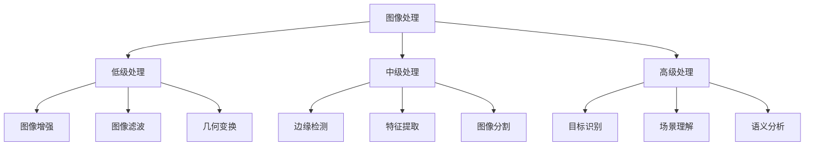

# 图像处理基础

## 🎯 核心概念

### 图像处理定义
> **图像处理是对数字图像进行各种操作和分析的技术，是计算机视觉的基础**

**图像处理层次：**


## 📊 数字图像基础

### 1. 图像表示

**像素与分辨率：**
```python
import numpy as np
import matplotlib.pyplot as plt
from PIL import Image

class ImageBasics:
    """图像基础操作"""
    
    def __init__(self):
        self.image_types = {
            'grayscale': '单通道灰度图',
            'rgb': '三通道彩色图',
            'rgba': '四通道带透明度',
            'binary': '二值图像'
        }
    
    def create_sample_images(self):
        """创建示例图像"""
        # 灰度图像
        gray_image = np.random.randint(0, 256, (100, 100), dtype=np.uint8)
        
        # RGB图像
        rgb_image = np.random.randint(0, 256, (100, 100, 3), dtype=np.uint8)
        
        # 二值图像
        binary_image = np.random.choice([0, 255], (100, 100), dtype=np.uint8)
        
        return gray_image, rgb_image, binary_image
    
    def analyze_image_properties(self, image):
        """分析图像属性"""
        properties = {
            'shape': image.shape,
            'dtype': image.dtype,
            'min_value': np.min(image),
            'max_value': np.max(image),
            'mean_value': np.mean(image),
            'std_value': np.std(image)
        }
        return properties
    
    def visualize_image_channels(self, rgb_image):
        """可视化RGB通道"""
        fig, axes = plt.subplots(2, 2, figsize=(10, 10))
        
        # 原图
        axes[0, 0].imshow(rgb_image)
        axes[0, 0].set_title('Original RGB Image')
        axes[0, 0].axis('off')
        
        # R通道
        axes[0, 1].imshow(rgb_image[:, :, 0], cmap='Reds')
        axes[0, 1].set_title('Red Channel')
        axes[0, 1].axis('off')
        
        # G通道
        axes[1, 0].imshow(rgb_image[:, :, 1], cmap='Greens')
        axes[1, 0].set_title('Green Channel')
        axes[1, 0].axis('off')
        
        # B通道
        axes[1, 1].imshow(rgb_image[:, :, 2], cmap='Blues')
        axes[1, 1].set_title('Blue Channel')
        axes[1, 1].axis('off')
        
        plt.tight_layout()
        plt.show()

# 测试图像基础
def test_image_basics():
    """测试图像基础功能"""
    ib = ImageBasics()
    
    # 创建示例图像
    gray, rgb, binary = ib.create_sample_images()
    
    # 分析图像属性
    print("灰度图像属性:", ib.analyze_image_properties(gray))
    print("RGB图像属性:", ib.analyze_image_properties(rgb))
    print("二值图像属性:", ib.analyze_image_properties(binary))
    
    # 可视化RGB通道
    ib.visualize_image_channels(rgb)
    
    return ib

test_image_basics()
```

### 2. 颜色空间

**颜色空间转换：**
```python
import cv2
from sklearn.cluster import KMeans

class ColorSpaces:
    """颜色空间处理"""
    
    def __init__(self):
        self.color_spaces = {
            'RGB': '红绿蓝',
            'HSV': '色调饱和度明度',
            'LAB': '亮度a*b*',
            'YUV': '亮度色度',
            'GRAY': '灰度'
        }
    
    def convert_color_space(self, image, from_space='RGB', to_space='HSV'):
        """颜色空间转换"""
        if from_space == 'RGB' and to_space == 'HSV':
            return cv2.cvtColor(image, cv2.COLOR_RGB2HSV)
        elif from_space == 'RGB' and to_space == 'LAB':
            return cv2.cvtColor(image, cv2.COLOR_RGB2LAB)
        elif from_space == 'RGB' and to_space == 'GRAY':
            return cv2.cvtColor(image, cv2.COLOR_RGB2GRAY)
        else:
            return image
    
    def visualize_color_spaces(self, rgb_image):
        """可视化不同颜色空间"""
        # 转换到不同颜色空间
        hsv_image = self.convert_color_space(rgb_image, 'RGB', 'HSV')
        lab_image = self.convert_color_space(rgb_image, 'RGB', 'LAB')
        gray_image = self.convert_color_space(rgb_image, 'RGB', 'GRAY')
        
        fig, axes = plt.subplots(2, 2, figsize=(12, 10))
        
        # RGB
        axes[0, 0].imshow(rgb_image)
        axes[0, 0].set_title('RGB Color Space')
        axes[0, 0].axis('off')
        
        # HSV
        axes[0, 1].imshow(hsv_image)
        axes[0, 1].set_title('HSV Color Space')
        axes[0, 1].axis('off')
        
        # LAB
        axes[1, 0].imshow(lab_image)
        axes[1, 0].set_title('LAB Color Space')
        axes[1, 0].axis('off')
        
        # GRAY
        axes[1, 1].imshow(gray_image, cmap='gray')
        axes[1, 1].set_title('Grayscale')
        axes[1, 1].axis('off')
        
        plt.tight_layout()
        plt.show()
    
    def color_quantization(self, image, n_colors=8):
        """颜色量化"""
        # 重塑图像为像素列表
        pixels = image.reshape(-1, 3)
        
        # K-means聚类
        kmeans = KMeans(n_clusters=n_colors, random_state=42)
        kmeans.fit(pixels)
        
        # 获取量化后的颜色
        quantized_pixels = kmeans.cluster_centers_[kmeans.labels_]
        quantized_image = quantized_pixels.reshape(image.shape)
        
        return quantized_image.astype(np.uint8), kmeans.cluster_centers_

# 测试颜色空间
def test_color_spaces():
    """测试颜色空间功能"""
    cs = ColorSpaces()
    
    # 创建测试图像
    test_image = np.random.randint(0, 256, (100, 100, 3), dtype=np.uint8)
    
    # 可视化颜色空间
    cs.visualize_color_spaces(test_image)
    
    # 颜色量化
    quantized, centers = cs.color_quantization(test_image, n_colors=4)
    
    return cs

test_color_spaces()
```

## 🔧 图像增强技术

### 1. 直方图处理

**直方图均衡化：**
```python
class HistogramProcessing:
    """直方图处理"""
    
    def __init__(self):
        self.histogram_methods = {
            'equalization': '直方图均衡化',
            'matching': '直方图匹配',
            'stretching': '直方图拉伸',
            'clipping': '直方图裁剪'
        }
    
    def compute_histogram(self, image):
        """计算直方图"""
        if len(image.shape) == 3:
            # 彩色图像
            hist_r = cv2.calcHist([image], [0], None, [256], [0, 256])
            hist_g = cv2.calcHist([image], [1], None, [256], [0, 256])
            hist_b = cv2.calcHist([image], [2], None, [256], [0, 256])
            return hist_r, hist_g, hist_b
        else:
            # 灰度图像
            return cv2.calcHist([image], [0], None, [256], [0, 256])
    
    def histogram_equalization(self, image):
        """直方图均衡化"""
        if len(image.shape) == 3:
            # 转换到LAB颜色空间
            lab = cv2.cvtColor(image, cv2.COLOR_RGB2LAB)
            # 只对L通道进行均衡化
            lab[:, :, 0] = cv2.equalizeHist(lab[:, :, 0])
            return cv2.cvtColor(lab, cv2.COLOR_LAB2RGB)
        else:
            return cv2.equalizeHist(image)
    
    def histogram_matching(self, source, target):
        """直方图匹配"""
        # 计算源图像和目标图像的累积分布函数
        source_hist, _ = np.histogram(source.flatten(), 256, [0, 256])
        target_hist, _ = np.histogram(target.flatten(), 256, [0, 256])
        
        source_cdf = source_hist.cumsum()
        target_cdf = target_hist.cumsum()
        
        # 归一化
        source_cdf = source_cdf / source_cdf[-1]
        target_cdf = target_cdf / target_cdf[-1]
        
        # 创建映射表
        mapping = np.zeros(256, dtype=np.uint8)
        for i in range(256):
            # 找到最接近的累积概率
            diff = np.abs(source_cdf[i] - target_cdf)
            mapping[i] = np.argmin(diff)
        
        return mapping[source]
    
    def visualize_histogram_comparison(self, original, enhanced):
        """可视化直方图对比"""
        fig, axes = plt.subplots(2, 2, figsize=(15, 10))
        
        # 原图
        axes[0, 0].imshow(original)
        axes[0, 0].set_title('Original Image')
        axes[0, 0].axis('off')
        
        # 增强后图像
        axes[0, 1].imshow(enhanced)
        axes[0, 1].set_title('Enhanced Image')
        axes[0, 1].axis('off')
        
        # 原图直方图
        hist_orig = self.compute_histogram(original)
        if isinstance(hist_orig, tuple):
            axes[1, 0].plot(hist_orig[0], color='red', alpha=0.7)
            axes[1, 0].plot(hist_orig[1], color='green', alpha=0.7)
            axes[1, 0].plot(hist_orig[2], color='blue', alpha=0.7)
        else:
            axes[1, 0].plot(hist_orig)
        axes[1, 0].set_title('Original Histogram')
        axes[1, 0].set_xlabel('Pixel Value')
        axes[1, 0].set_ylabel('Frequency')
        
        # 增强后直方图
        hist_enh = self.compute_histogram(enhanced)
        if isinstance(hist_enh, tuple):
            axes[1, 1].plot(hist_enh[0], color='red', alpha=0.7)
            axes[1, 1].plot(hist_enh[1], color='green', alpha=0.7)
            axes[1, 1].plot(hist_enh[2], color='blue', alpha=0.7)
        else:
            axes[1, 1].plot(hist_enh)
        axes[1, 1].set_title('Enhanced Histogram')
        axes[1, 1].set_xlabel('Pixel Value')
        axes[1, 1].set_ylabel('Frequency')
        
        plt.tight_layout()
        plt.show()

# 测试直方图处理
def test_histogram_processing():
    """测试直方图处理功能"""
    hp = HistogramProcessing()
    
    # 创建测试图像
    test_image = np.random.randint(0, 256, (200, 200, 3), dtype=np.uint8)
    
    # 直方图均衡化
    enhanced = hp.histogram_equalization(test_image)
    
    # 可视化对比
    hp.visualize_histogram_comparison(test_image, enhanced)
    
    return hp

test_histogram_processing()
```

### 2. 空间滤波

**滤波技术：**
```python
from scipy import ndimage
from scipy.ndimage import gaussian_filter, median_filter

class SpatialFiltering:
    """空间滤波"""
    
    def __init__(self):
        self.filter_types = {
            'gaussian': '高斯滤波',
            'median': '中值滤波',
            'bilateral': '双边滤波',
            'sobel': 'Sobel边缘检测',
            'laplacian': '拉普拉斯算子'
        }
    
    def gaussian_filter(self, image, sigma=1.0):
        """高斯滤波"""
        return gaussian_filter(image, sigma=sigma)
    
    def median_filter(self, image, size=3):
        """中值滤波"""
        return median_filter(image, size=size)
    
    def bilateral_filter(self, image, d=9, sigma_color=75, sigma_space=75):
        """双边滤波"""
        return cv2.bilateralFilter(image, d, sigma_color, sigma_space)
    
    def sobel_edge_detection(self, image):
        """Sobel边缘检测"""
        # 转换为灰度图
        if len(image.shape) == 3:
            gray = cv2.cvtColor(image, cv2.COLOR_RGB2GRAY)
        else:
            gray = image
        
        # Sobel算子
        sobelx = cv2.Sobel(gray, cv2.CV_64F, 1, 0, ksize=3)
        sobely = cv2.Sobel(gray, cv2.CV_64F, 0, 1, ksize=3)
        
        # 计算梯度幅值
        magnitude = np.sqrt(sobelx**2 + sobely**2)
        
        return sobelx, sobely, magnitude
    
    def laplacian_filter(self, image):
        """拉普拉斯滤波"""
        if len(image.shape) == 3:
            gray = cv2.cvtColor(image, cv2.COLOR_RGB2GRAY)
        else:
            gray = image
        
        return cv2.Laplacian(gray, cv2.CV_64F)
    
    def create_custom_kernels(self):
        """创建自定义卷积核"""
        kernels = {
            'sharpen': np.array([[-1, -1, -1],
                                [-1,  9, -1],
                                [-1, -1, -1]]),
            'emboss': np.array([[-2, -1,  0],
                               [-1,  1,  1],
                               [ 0,  1,  2]]),
            'outline': np.array([[-1, -1, -1],
                                [-1,  8, -1],
                                [-1, -1, -1]]),
            'blur': np.array([[1, 1, 1],
                             [1, 1, 1],
                             [1, 1, 1]]) / 9
        }
        return kernels
    
    def apply_custom_filter(self, image, kernel):
        """应用自定义滤波器"""
        if len(image.shape) == 3:
            # 对每个通道分别处理
            filtered = np.zeros_like(image)
            for i in range(3):
                filtered[:, :, i] = cv2.filter2D(image[:, :, i], -1, kernel)
            return filtered
        else:
            return cv2.filter2D(image, -1, kernel)
    
    def visualize_filtering_results(self, image):
        """可视化滤波结果"""
        # 应用不同滤波器
        gaussian = self.gaussian_filter(image, sigma=2.0)
        median = self.median_filter(image, size=5)
        bilateral = self.bilateral_filter(image)
        sobelx, sobely, sobel_mag = self.sobel_edge_detection(image)
        laplacian = self.laplacian_filter(image)
        
        # 自定义滤波器
        kernels = self.create_custom_kernels()
        sharpen = self.apply_custom_filter(image, kernels['sharpen'])
        emboss = self.apply_custom_filter(image, kernels['emboss'])
        
        fig, axes = plt.subplots(3, 3, figsize=(15, 15))
        
        # 原图
        axes[0, 0].imshow(image)
        axes[0, 0].set_title('Original')
        axes[0, 0].axis('off')
        
        # 高斯滤波
        axes[0, 1].imshow(gaussian)
        axes[0, 1].set_title('Gaussian Filter')
        axes[0, 1].axis('off')
        
        # 中值滤波
        axes[0, 2].imshow(median)
        axes[0, 2].set_title('Median Filter')
        axes[0, 2].axis('off')
        
        # 双边滤波
        axes[1, 0].imshow(bilateral)
        axes[1, 0].set_title('Bilateral Filter')
        axes[1, 0].axis('off')
        
        # Sobel边缘检测
        axes[1, 1].imshow(sobel_mag, cmap='gray')
        axes[1, 1].set_title('Sobel Edge Detection')
        axes[1, 1].axis('off')
        
        # 拉普拉斯滤波
        axes[1, 2].imshow(laplacian, cmap='gray')
        axes[1, 2].set_title('Laplacian Filter')
        axes[1, 2].axis('off')
        
        # 锐化
        axes[2, 0].imshow(sharpen)
        axes[2, 0].set_title('Sharpen Filter')
        axes[2, 0].axis('off')
        
        # 浮雕
        axes[2, 1].imshow(emboss)
        axes[2, 1].set_title('Emboss Filter')
        axes[2, 1].axis('off')
        
        # 空白
        axes[2, 2].axis('off')
        
        plt.tight_layout()
        plt.show()

# 测试空间滤波
def test_spatial_filtering():
    """测试空间滤波功能"""
    sf = SpatialFiltering()
    
    # 创建测试图像
    test_image = np.random.randint(0, 256, (150, 150, 3), dtype=np.uint8)
    
    # 可视化滤波结果
    sf.visualize_filtering_results(test_image)
    
    return sf

test_spatial_filtering()
```

## 🎯 几何变换

### 1. 基本变换

**几何变换操作：**
```python
class GeometricTransforms:
    """几何变换"""
    
    def __init__(self):
        self.transform_types = {
            'translation': '平移',
            'rotation': '旋转',
            'scaling': '缩放',
            'shearing': '剪切',
            'reflection': '反射'
        }
    
    def translation(self, image, tx, ty):
        """平移变换"""
        rows, cols = image.shape[:2]
        M = np.float32([[1, 0, tx], [0, 1, ty]])
        return cv2.warpAffine(image, M, (cols, rows))
    
    def rotation(self, image, angle, center=None):
        """旋转变换"""
        rows, cols = image.shape[:2]
        if center is None:
            center = (cols//2, rows//2)
        
        M = cv2.getRotationMatrix2D(center, angle, 1.0)
        return cv2.warpAffine(image, M, (cols, rows))
    
    def scaling(self, image, fx, fy):
        """缩放变换"""
        return cv2.resize(image, None, fx=fx, fy=fy, interpolation=cv2.INTER_LINEAR)
    
    def shearing(self, image, shear_x, shear_y):
        """剪切变换"""
        rows, cols = image.shape[:2]
        M = np.float32([[1, shear_x, 0], [shear_y, 1, 0]])
        return cv2.warpAffine(image, M, (cols, rows))
    
    def reflection(self, image, axis='horizontal'):
        """反射变换"""
        if axis == 'horizontal':
            return cv2.flip(image, 1)
        elif axis == 'vertical':
            return cv2.flip(image, 0)
        else:
            return cv2.flip(image, -1)
    
    def perspective_transform(self, image, src_points, dst_points):
        """透视变换"""
        M = cv2.getPerspectiveTransform(src_points, dst_points)
        rows, cols = image.shape[:2]
        return cv2.warpPerspective(image, M, (cols, rows))
    
    def visualize_transforms(self, image):
        """可视化各种变换"""
        fig, axes = plt.subplots(3, 3, figsize=(15, 15))
        
        # 原图
        axes[0, 0].imshow(image)
        axes[0, 0].set_title('Original')
        axes[0, 0].axis('off')
        
        # 平移
        translated = self.translation(image, 50, 30)
        axes[0, 1].imshow(translated)
        axes[0, 1].set_title('Translation')
        axes[0, 1].axis('off')
        
        # 旋转
        rotated = self.rotation(image, 45)
        axes[0, 2].imshow(rotated)
        axes[0, 2].set_title('Rotation (45°)')
        axes[0, 2].axis('off')
        
        # 缩放
        scaled = self.scaling(image, 0.5, 0.5)
        axes[1, 0].imshow(scaled)
        axes[1, 0].set_title('Scaling (0.5x)')
        axes[1, 0].axis('off')
        
        # 剪切
        sheared = self.shearing(image, 0.2, 0.1)
        axes[1, 1].imshow(sheared)
        axes[1, 1].set_title('Shearing')
        axes[1, 1].axis('off')
        
        # 水平反射
        h_reflected = self.reflection(image, 'horizontal')
        axes[1, 2].imshow(h_reflected)
        axes[1, 2].set_title('Horizontal Reflection')
        axes[1, 2].axis('off')
        
        # 垂直反射
        v_reflected = self.reflection(image, 'vertical')
        axes[2, 0].imshow(v_reflected)
        axes[2, 0].set_title('Vertical Reflection')
        axes[2, 0].axis('off')
        
        # 透视变换
        rows, cols = image.shape[:2]
        src_pts = np.float32([[0, 0], [cols-1, 0], [cols-1, rows-1], [0, rows-1]])
        dst_pts = np.float32([[50, 50], [cols-100, 50], [cols-50, rows-50], [100, rows-50]])
        perspective = self.perspective_transform(image, src_pts, dst_pts)
        axes[2, 1].imshow(perspective)
        axes[2, 1].set_title('Perspective Transform')
        axes[2, 1].axis('off')
        
        # 空白
        axes[2, 2].axis('off')
        
        plt.tight_layout()
        plt.show()

# 测试几何变换
def test_geometric_transforms():
    """测试几何变换功能"""
    gt = GeometricTransforms()
    
    # 创建测试图像
    test_image = np.random.randint(0, 256, (200, 200, 3), dtype=np.uint8)
    
    # 可视化变换结果
    gt.visualize_transforms(test_image)
    
    return gt

test_geometric_transforms()
```

## 🔗 相关链接
- [[01-02-01-线性代数基础]] - 矩阵运算基础
- [[01-03-01-Python基础语法]] - Python编程基础
- [[01-03-02-NumPy数据处理]] - NumPy数组操作
- [[03-01-02-目标检测算法]] - 目标检测技术
- [[03-01-03-图像分割技术]] - 图像分割方法

## 💡 费曼学习法应用

**概念理解**：图像处理就像"修图软件"，通过各种技术改善图像质量，提取有用信息。就像摄影师后期处理照片一样。

**实践建议**：
- 🎯 **从基础开始**：先理解像素、颜色空间等基本概念
- 🔧 **动手实践**：多写代码，观察不同处理效果
- 📊 **对比分析**：比较不同算法的处理结果
- 🎨 **创新应用**：尝试组合不同技术解决实际问题

**刻意练习**：
- 💻 **编程实现**：亲手实现各种图像处理算法
- 📈 **参数调优**：调整参数观察效果变化
- 🔍 **问题解决**：针对具体问题选择合适的技术
- 📝 **总结归纳**：整理不同技术的适用场景

---
*📝 学习提示：图像处理是计算机视觉的基础，建议多动手实践，理解每种技术的原理和适用场景*
