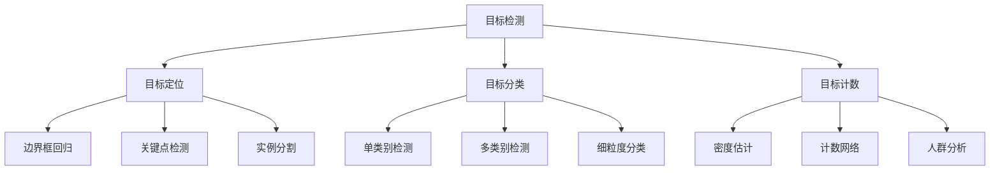

# 目标检测算法

## 🎯 核心概念

### 目标检测定义
> **目标检测是在图像中定位和识别多个目标的技术，需要同时完成分类和定位任务**

**目标检测任务：**


## 📊 传统目标检测方法

### 1. 滑动窗口检测

**滑动窗口原理：**
```python
import numpy as np
import matplotlib.pyplot as plt
from sklearn.svm import SVC
from sklearn.feature_extraction.image import extract_patches_2d

class SlidingWindowDetector:
    """滑动窗口目标检测器"""
    
    def __init__(self, window_size=(64, 64), step_size=32):
        self.window_size = window_size
        self.step_size = step_size
        self.classifier = None
        self.feature_extractor = None
    
    def extract_hog_features(self, image):
        """提取HOG特征"""
        from skimage.feature import hog
        
        # 转换为灰度图
        if len(image.shape) == 3:
            gray = cv2.cvtColor(image, cv2.COLOR_RGB2GRAY)
        else:
            gray = image
        
        # 提取HOG特征
        features = hog(gray, orientations=9, pixels_per_cell=(8, 8),
                      cells_per_block=(2, 2), visualize=False)
        return features
    
    def train_classifier(self, positive_samples, negative_samples):
        """训练分类器"""
        # 提取正样本特征
        positive_features = []
        for sample in positive_samples:
            features = self.extract_hog_features(sample)
            positive_features.append(features)
        
        # 提取负样本特征
        negative_features = []
        for sample in negative_samples:
            features = self.extract_hog_features(sample)
            negative_features.append(features)
        
        # 合并特征和标签
        X = np.vstack([positive_features, negative_features])
        y = np.hstack([np.ones(len(positive_features)), 
                      np.zeros(len(negative_features))])
        
        # 训练SVM分类器
        self.classifier = SVC(kernel='linear', probability=True)
        self.classifier.fit(X, y)
        
        return self.classifier
    
    def sliding_window(self, image):
        """滑动窗口检测"""
        h, w = image.shape[:2]
        detections = []
        
        # 多尺度检测
        scales = [0.5, 1.0, 1.5, 2.0]
        
        for scale in scales:
            # 缩放图像
            scaled_image = cv2.resize(image, (int(w*scale), int(h*scale)))
            scaled_h, scaled_w = scaled_image.shape[:2]
            
            # 滑动窗口
            for y in range(0, scaled_h - self.window_size[1], self.step_size):
                for x in range(0, scaled_w - self.window_size[0], self.step_size):
                    # 提取窗口
                    window = scaled_image[y:y+self.window_size[1], 
                                        x:x+self.window_size[0]]
                    
                    # 提取特征
                    features = self.extract_hog_features(window)
                    
                    # 分类
                    if self.classifier is not None:
                        prob = self.classifier.predict_proba([features])[0][1]
                        
                        if prob > 0.5:  # 阈值
                            # 转换回原图坐标
                            orig_x = int(x / scale)
                            orig_y = int(y / scale)
                            orig_w = int(self.window_size[0] / scale)
                            orig_h = int(self.window_size[1] / scale)
                            
                            detections.append({
                                'bbox': (orig_x, orig_y, orig_w, orig_h),
                                'confidence': prob,
                                'scale': scale
                            })
        
        return detections
    
    def non_max_suppression(self, detections, overlap_threshold=0.3):
        """非极大值抑制"""
        if len(detections) == 0:
            return []
        
        # 按置信度排序
        detections = sorted(detections, key=lambda x: x['confidence'], reverse=True)
        
        # 计算IoU
        def calculate_iou(box1, box2):
            x1, y1, w1, h1 = box1
            x2, y2, w2, h2 = box2
            
            # 计算交集
            xi1 = max(x1, x2)
            yi1 = max(y1, y2)
            xi2 = min(x1 + w1, x2 + w2)
            yi2 = min(y1 + h1, y2 + h2)
            
            if xi2 <= xi1 or yi2 <= yi1:
                return 0
            
            inter_area = (xi2 - xi1) * (yi2 - yi1)
            box1_area = w1 * h1
            box2_area = w2 * h2
            union_area = box1_area + box2_area - inter_area
            
            return inter_area / union_area
        
        # NMS算法
        keep = []
        while detections:
            # 选择置信度最高的检测
            best = detections.pop(0)
            keep.append(best)
            
            # 移除与当前检测重叠度高的检测
            detections = [det for det in detections 
                         if calculate_iou(best['bbox'], det['bbox']) < overlap_threshold]
        
        return keep
    
    def visualize_detections(self, image, detections):
        """可视化检测结果"""
        fig, ax = plt.subplots(1, 1, figsize=(12, 8))
        ax.imshow(image)
        
        for det in detections:
            x, y, w, h = det['bbox']
            confidence = det['confidence']
            
            # 绘制边界框
            rect = plt.Rectangle((x, y), w, h, fill=False, 
                               color='red', linewidth=2)
            ax.add_patch(rect)
            
            # 添加置信度标签
            ax.text(x, y-5, f'{confidence:.2f}', 
                   color='red', fontsize=10, fontweight='bold')
        
        ax.set_title('Object Detection Results')
        ax.axis('off')
        plt.tight_layout()
        plt.show()

# 测试滑动窗口检测器
def test_sliding_window_detector():
    """测试滑动窗口检测器"""
    detector = SlidingWindowDetector(window_size=(64, 64), step_size=32)
    
    # 创建模拟数据
    positive_samples = [np.random.randint(0, 256, (64, 64, 3), dtype=np.uint8) 
                       for _ in range(50)]
    negative_samples = [np.random.randint(0, 256, (64, 64, 3), dtype=np.uint8) 
                       for _ in range(100)]
    
    # 训练分类器
    detector.train_classifier(positive_samples, negative_samples)
    
    # 测试图像
    test_image = np.random.randint(0, 256, (300, 400, 3), dtype=np.uint8)
    
    # 检测
    detections = detector.sliding_window(test_image)
    
    # NMS
    final_detections = detector.non_max_suppression(detections)
    
    # 可视化
    detector.visualize_detections(test_image, final_detections)
    
    return detector

test_sliding_window_detector()
```

### 2. 选择性搜索

**区域提议生成：**
```python
import skimage.segmentation as seg
from skimage import measure

class SelectiveSearch:
    """选择性搜索算法"""
    
    def __init__(self):
        self.segmentation_methods = ['felzenszwalb', 'slic', 'quickshift', 'watershed']
    
    def felzenszwalb_segmentation(self, image, scale=100, sigma=0.5, min_size=50):
        """Felzenszwalb分割"""
        segments = seg.felzenszwalb(image, scale=scale, sigma=sigma, min_size=min_size)
        return segments
    
    def slic_segmentation(self, image, n_segments=100, compactness=10):
        """SLIC超像素分割"""
        segments = seg.slic(image, n_segments=n_segments, compactness=compactness)
        return segments
    
    def generate_region_proposals(self, image, method='felzenszwalb'):
        """生成区域提议"""
        if method == 'felzenszwalb':
            segments = self.felzenszwalb_segmentation(image)
        elif method == 'slic':
            segments = self.slic_segmentation(image)
        else:
            segments = self.felzenszwalb_segmentation(image)
        
        # 计算每个区域的边界框
        proposals = []
        for region_id in np.unique(segments):
            mask = segments == region_id
            props = measure.regionprops(mask.astype(int))
            
            if props:
                prop = props[0]
                bbox = prop.bbox  # (min_row, min_col, max_row, max_col)
                
                # 转换为 (x, y, w, h) 格式
                x, y, w, h = bbox[1], bbox[0], bbox[3]-bbox[1], bbox[2]-bbox[0]
                
                proposals.append({
                    'bbox': (x, y, w, h),
                    'area': prop.area,
                    'perimeter': prop.perimeter,
                    'eccentricity': prop.eccentricity,
                    'solidity': prop.solidity
                })
        
        return proposals, segments
    
    def hierarchical_merging(self, proposals, image):
        """层次合并"""
        # 计算区域间的相似度
        def calculate_similarity(prop1, prop2):
            # 颜色相似度
            color_sim = 1.0 / (1.0 + abs(prop1.get('color', 0) - prop2.get('color', 0)))
            
            # 纹理相似度
            texture_sim = 1.0 / (1.0 + abs(prop1.get('texture', 0) - prop2.get('texture', 0)))
            
            # 大小相似度
            size_sim = 1.0 / (1.0 + abs(prop1['area'] - prop2['area']) / max(prop1['area'], prop2['area']))
            
            # 形状相似度
            shape_sim = 1.0 / (1.0 + abs(prop1['eccentricity'] - prop2['eccentricity']))
            
            return color_sim + texture_sim + size_sim + shape_sim
        
        # 简化的合并过程
        merged_proposals = proposals.copy()
        
        # 按面积排序
        merged_proposals.sort(key=lambda x: x['area'], reverse=True)
        
        # 返回前N个提议
        return merged_proposals[:100]
    
    def visualize_segmentation(self, image, segments):
        """可视化分割结果"""
        fig, axes = plt.subplots(1, 2, figsize=(15, 6))
        
        # 原图
        axes[0].imshow(image)
        axes[0].set_title('Original Image')
        axes[0].axis('off')
        
        # 分割结果
        axes[1].imshow(segments, cmap='nipy_spectral')
        axes[1].set_title('Segmentation Result')
        axes[1].axis('off')
        
        plt.tight_layout()
        plt.show()
    
    def visualize_proposals(self, image, proposals):
        """可视化区域提议"""
        fig, ax = plt.subplots(1, 1, figsize=(12, 8))
        ax.imshow(image)
        
        # 绘制前20个提议
        for i, prop in enumerate(proposals[:20]):
            x, y, w, h = prop['bbox']
            
            # 绘制边界框
            rect = plt.Rectangle((x, y), w, h, fill=False, 
                               color='red', linewidth=1, alpha=0.7)
            ax.add_patch(rect)
            
            # 添加标签
            ax.text(x, y-5, f'R{i}', color='red', fontsize=8)
        
        ax.set_title('Region Proposals')
        ax.axis('off')
        plt.tight_layout()
        plt.show()

# 测试选择性搜索
def test_selective_search():
    """测试选择性搜索"""
    ss = SelectiveSearch()
    
    # 创建测试图像
    test_image = np.random.randint(0, 256, (200, 300, 3), dtype=np.uint8)
    
    # 生成区域提议
    proposals, segments = ss.generate_region_proposals(test_image)
    
    # 层次合并
    final_proposals = ss.hierarchical_merging(proposals, test_image)
    
    # 可视化
    ss.visualize_segmentation(test_image, segments)
    ss.visualize_proposals(test_image, final_proposals)
    
    return ss

test_selective_search()
```

## 🚀 深度学习目标检测

### 1. R-CNN系列

**R-CNN架构：**
```python
import torch
import torch.nn as nn
import torchvision.models as models
from torchvision import transforms

class RCNN:
    """R-CNN目标检测器"""
    
    def __init__(self, num_classes=21):
        self.num_classes = num_classes
        self.backbone = None
        self.classifier = None
        self.bbox_regressor = None
    
    def build_backbone(self):
        """构建特征提取网络"""
        # 使用预训练的VGG16
        vgg = models.vgg16(pretrained=True)
        # 移除最后的分类层
        self.backbone = nn.Sequential(*list(vgg.features.children()))
        return self.backbone
    
    def build_classifier(self, input_size=4096):
        """构建分类器"""
        self.classifier = nn.Sequential(
            nn.Linear(input_size, 4096),
            nn.ReLU(inplace=True),
            nn.Dropout(0.5),
            nn.Linear(4096, 4096),
            nn.ReLU(inplace=True),
            nn.Dropout(0.5),
            nn.Linear(4096, self.num_classes)
        )
        return self.classifier
    
    def build_bbox_regressor(self, input_size=4096):
        """构建边界框回归器"""
        self.bbox_regressor = nn.Sequential(
            nn.Linear(input_size, 4096),
            nn.ReLU(inplace=True),
            nn.Dropout(0.5),
            nn.Linear(4096, 4096),
            nn.ReLU(inplace=True),
            nn.Dropout(0.5),
            nn.Linear(4096, 4)  # (x, y, w, h)
        )
        return self.bbox_regressor
    
    def extract_features(self, image_patches):
        """提取特征"""
        if self.backbone is None:
            self.build_backbone()
        
        # 预处理
        transform = transforms.Compose([
            transforms.ToPILImage(),
            transforms.Resize((224, 224)),
            transforms.ToTensor(),
            transforms.Normalize(mean=[0.485, 0.456, 0.406], 
                               std=[0.229, 0.224, 0.225])
        ])
        
        features = []
        for patch in image_patches:
            # 转换为PIL图像
            if isinstance(patch, np.ndarray):
                patch = patch.astype(np.uint8)
            
            # 应用变换
            patch_tensor = transform(patch)
            patch_tensor = patch_tensor.unsqueeze(0)  # 添加batch维度
            
            # 提取特征
            with torch.no_grad():
                feature = self.backbone(patch_tensor)
                feature = feature.view(feature.size(0), -1)  # 展平
                features.append(feature)
        
        return torch.cat(features, dim=0)
    
    def predict(self, image_patches):
        """预测"""
        if self.classifier is None:
            self.build_classifier()
        if self.bbox_regressor is None:
            self.build_bbox_regressor()
        
        # 提取特征
        features = self.extract_features(image_patches)
        
        # 分类
        class_scores = self.classifier(features)
        class_probs = torch.softmax(class_scores, dim=1)
        
        # 边界框回归
        bbox_deltas = self.bbox_regressor(features)
        
        return class_probs, bbox_deltas

class FastRCNN:
    """Fast R-CNN目标检测器"""
    
    def __init__(self, num_classes=21):
        self.num_classes = num_classes
        self.backbone = None
        self.roi_pooling = None
        self.classifier = None
        self.bbox_regressor = None
    
    def build_roi_pooling(self, output_size=7):
        """构建ROI池化层"""
        self.roi_pooling = nn.AdaptiveAvgPool2d(output_size)
        return self.roi_pooling
    
    def build_classifier(self, input_size=25088):
        """构建分类器"""
        self.classifier = nn.Sequential(
            nn.Linear(input_size, 4096),
            nn.ReLU(inplace=True),
            nn.Dropout(0.5),
            nn.Linear(4096, 4096),
            nn.ReLU(inplace=True),
            nn.Dropout(0.5),
            nn.Linear(4096, self.num_classes)
        )
        return self.classifier
    
    def build_bbox_regressor(self, input_size=25088):
        """构建边界框回归器"""
        self.bbox_regressor = nn.Sequential(
            nn.Linear(input_size, 4096),
            nn.ReLU(inplace=True),
            nn.Dropout(0.5),
            nn.Linear(4096, 4096),
            nn.ReLU(inplace=True),
            nn.Dropout(0.5),
            nn.Linear(4096, 4 * self.num_classes)  # 每个类别4个坐标
        )
        return self.bbox_regressor
    
    def roi_pool(self, feature_map, rois):
        """ROI池化"""
        if self.roi_pooling is None:
            self.build_roi_pooling()
        
        # 简化的ROI池化实现
        pooled_features = []
        for roi in rois:
            x, y, w, h = roi
            # 提取ROI区域
            roi_feature = feature_map[:, :, y:y+h, x:x+w]
            # 池化
            pooled = self.roi_pooling(roi_feature)
            pooled_features.append(pooled)
        
        return torch.cat(pooled_features, dim=0)

class FasterRCNN:
    """Faster R-CNN目标检测器"""
    
    def __init__(self, num_classes=21):
        self.num_classes = num_classes
        self.backbone = None
        self.rpn = None
        self.roi_head = None
    
    def build_rpn(self, in_channels=512, anchor_scales=[8, 16, 32]):
        """构建区域提议网络"""
        self.rpn = nn.Sequential(
            nn.Conv2d(in_channels, 512, 3, padding=1),
            nn.ReLU(inplace=True),
            nn.Conv2d(512, len(anchor_scales) * 2, 1),  # 2k scores (object/not object)
            nn.Conv2d(512, len(anchor_scales) * 4, 1)   # 4k coordinates
        )
        return self.rpn
    
    def generate_anchors(self, feature_map_size, anchor_scales=[8, 16, 32]):
        """生成锚点"""
        anchors = []
        h, w = feature_map_size
        
        for scale in anchor_scales:
            for y in range(h):
                for x in range(w):
                    # 生成不同比例的锚点
                    for ratio in [0.5, 1.0, 2.0]:
                        anchor_w = scale * np.sqrt(ratio)
                        anchor_h = scale / np.sqrt(ratio)
                        
                        anchor_x = x * 16 - anchor_w / 2  # 假设下采样16倍
                        anchor_y = y * 16 - anchor_h / 2
                        
                        anchors.append([anchor_x, anchor_y, anchor_w, anchor_h])
        
        return np.array(anchors)
    
    def predict(self, image):
        """预测"""
        # 特征提取
        if self.backbone is None:
            self.build_backbone()
        
        features = self.backbone(image)
        
        # RPN预测
        if self.rpn is None:
            self.build_rpn()
        
        rpn_output = self.rpn(features)
        
        # 生成锚点
        anchors = self.generate_anchors(features.shape[-2:])
        
        return features, rpn_output, anchors

# 测试R-CNN系列
def test_rcnn_series():
    """测试R-CNN系列"""
    # R-CNN
    rcnn = RCNN(num_classes=21)
    rcnn.build_backbone()
    rcnn.build_classifier()
    rcnn.build_bbox_regressor()
    
    # Fast R-CNN
    fast_rcnn = FastRCNN(num_classes=21)
    fast_rcnn.build_roi_pooling()
    fast_rcnn.build_classifier()
    fast_rcnn.build_bbox_regressor()
    
    # Faster R-CNN
    faster_rcnn = FasterRCNN(num_classes=21)
    faster_rcnn.build_rpn()
    
    print("R-CNN系列模型构建完成")
    
    return rcnn, fast_rcnn, faster_rcnn

test_rcnn_series()
```

### 2. YOLO系列

**YOLO架构：**
```python
class YOLO:
    """YOLO目标检测器"""
    
    def __init__(self, grid_size=7, num_boxes=2, num_classes=20):
        self.grid_size = grid_size
        self.num_boxes = num_boxes
        self.num_classes = num_classes
        self.backbone = None
        self.detection_head = None
    
    def build_backbone(self):
        """构建特征提取网络"""
        self.backbone = nn.Sequential(
            # 第一个卷积块
            nn.Conv2d(3, 64, 7, stride=2, padding=3),
            nn.BatchNorm2d(64),
            nn.LeakyReLU(0.1, inplace=True),
            nn.MaxPool2d(2, stride=2),
            
            # 第二个卷积块
            nn.Conv2d(64, 192, 3, padding=1),
            nn.BatchNorm2d(192),
            nn.LeakyReLU(0.1, inplace=True),
            nn.MaxPool2d(2, stride=2),
            
            # 第三个卷积块
            nn.Conv2d(192, 128, 1),
            nn.Conv2d(128, 256, 3, padding=1),
            nn.Conv2d(256, 256, 1),
            nn.Conv2d(256, 512, 3, padding=1),
            nn.BatchNorm2d(512),
            nn.LeakyReLU(0.1, inplace=True),
            nn.MaxPool2d(2, stride=2),
            
            # 第四个卷积块
            nn.Conv2d(512, 256, 1),
            nn.Conv2d(256, 512, 3, padding=1),
            nn.Conv2d(512, 256, 1),
            nn.Conv2d(256, 512, 3, padding=1),
            nn.Conv2d(512, 256, 1),
            nn.Conv2d(256, 512, 3, padding=1),
            nn.Conv2d(512, 256, 1),
            nn.Conv2d(256, 512, 3, padding=1),
            nn.Conv2d(512, 512, 1),
            nn.Conv2d(512, 1024, 3, padding=1),
            nn.BatchNorm2d(1024),
            nn.LeakyReLU(0.1, inplace=True),
            nn.MaxPool2d(2, stride=2),
            
            # 第五个卷积块
            nn.Conv2d(1024, 512, 1),
            nn.Conv2d(512, 1024, 3, padding=1),
            nn.Conv2d(1024, 512, 1),
            nn.Conv2d(512, 1024, 3, padding=1),
            nn.Conv2d(1024, 1024, 3, padding=1),
            nn.Conv2d(1024, 1024, 3, stride=2, padding=1),
            
            # 第六个卷积块
            nn.Conv2d(1024, 1024, 3, padding=1),
            nn.Conv2d(1024, 1024, 3, padding=1)
        )
        return self.backbone
    
    def build_detection_head(self):
        """构建检测头"""
        # 输出维度：grid_size * grid_size * (num_boxes * 5 + num_classes)
        output_dim = self.grid_size * self.grid_size * (self.num_boxes * 5 + self.num_classes)
        
        self.detection_head = nn.Sequential(
            nn.Flatten(),
            nn.Linear(1024 * self.grid_size * self.grid_size, 4096),
            nn.LeakyReLU(0.1, inplace=True),
            nn.Dropout(0.5),
            nn.Linear(4096, output_dim)
        )
        return self.detection_head
    
    def forward(self, x):
        """前向传播"""
        if self.backbone is None:
            self.build_backbone()
        if self.detection_head is None:
            self.build_detection_head()
        
        # 特征提取
        features = self.backbone(x)
        
        # 检测预测
        predictions = self.detection_head(features)
        
        # 重塑输出
        batch_size = x.size(0)
        predictions = predictions.view(batch_size, self.grid_size, self.grid_size, 
                                     self.num_boxes * 5 + self.num_classes)
        
        return predictions
    
    def decode_predictions(self, predictions, confidence_threshold=0.5):
        """解码预测结果"""
        batch_size, grid_h, grid_w, _ = predictions.shape
        detections = []
        
        for b in range(batch_size):
            batch_detections = []
            
            for i in range(grid_h):
                for j in range(grid_w):
                    # 提取预测值
                    pred = predictions[b, i, j]
                    
                    # 类别概率
                    class_probs = pred[self.num_boxes * 5:]
                    class_probs = torch.softmax(class_probs, dim=0)
                    
                    # 每个边界框的预测
                    for box_idx in range(self.num_boxes):
                        # 边界框参数
                        box_start = box_idx * 5
                        x = pred[box_start]
                        y = pred[box_start + 1]
                        w = pred[box_start + 2]
                        h = pred[box_start + 3]
                        confidence = torch.sigmoid(pred[box_start + 4])
                        
                        if confidence > confidence_threshold:
                            # 转换到图像坐标
                            img_x = (j + x) * (448 / grid_w)  # 假设输入图像448x448
                            img_y = (i + y) * (448 / grid_h)
                            img_w = w * 448
                            img_h = h * 448
                            
                            # 找到最可能的类别
                            class_id = torch.argmax(class_probs)
                            class_prob = class_probs[class_id]
                            
                            # 最终置信度
                            final_confidence = confidence * class_prob
                            
                            if final_confidence > confidence_threshold:
                                batch_detections.append({
                                    'bbox': (img_x, img_y, img_w, img_h),
                                    'confidence': final_confidence.item(),
                                    'class_id': class_id.item(),
                                    'class_prob': class_prob.item()
                                })
            
            detections.append(batch_detections)
        
        return detections

class YOLOv2:
    """YOLOv2目标检测器"""
    
    def __init__(self, grid_size=13, num_anchors=5, num_classes=20):
        self.grid_size = grid_size
        self.num_anchors = num_anchors
        self.num_classes = num_classes
        self.anchors = None
        self.backbone = None
        self.detection_head = None
    
    def build_darknet19_backbone(self):
        """构建Darknet-19骨干网络"""
        self.backbone = nn.Sequential(
            # 第一个卷积块
            nn.Conv2d(3, 32, 3, padding=1),
            nn.BatchNorm2d(32),
            nn.LeakyReLU(0.1, inplace=True),
            nn.MaxPool2d(2, stride=2),
            
            # 第二个卷积块
            nn.Conv2d(32, 64, 3, padding=1),
            nn.BatchNorm2d(64),
            nn.LeakyReLU(0.1, inplace=True),
            nn.MaxPool2d(2, stride=2),
            
            # 第三个卷积块
            nn.Conv2d(64, 128, 3, padding=1),
            nn.BatchNorm2d(128),
            nn.LeakyReLU(0.1, inplace=True),
            nn.Conv2d(128, 64, 1),
            nn.Conv2d(64, 128, 3, padding=1),
            nn.BatchNorm2d(128),
            nn.LeakyReLU(0.1, inplace=True),
            nn.MaxPool2d(2, stride=2),
            
            # 第四个卷积块
            nn.Conv2d(128, 256, 3, padding=1),
            nn.BatchNorm2d(256),
            nn.LeakyReLU(0.1, inplace=True),
            nn.Conv2d(256, 128, 1),
            nn.Conv2d(128, 256, 3, padding=1),
            nn.BatchNorm2d(256),
            nn.LeakyReLU(0.1, inplace=True),
            nn.MaxPool2d(2, stride=2),
            
            # 第五个卷积块
            nn.Conv2d(256, 512, 3, padding=1),
            nn.BatchNorm2d(512),
            nn.LeakyReLU(0.1, inplace=True),
            nn.Conv2d(512, 256, 1),
            nn.Conv2d(256, 512, 3, padding=1),
            nn.BatchNorm2d(512),
            nn.LeakyReLU(0.1, inplace=True),
            nn.Conv2d(512, 256, 1),
            nn.Conv2d(256, 512, 3, padding=1),
            nn.BatchNorm2d(512),
            nn.LeakyReLU(0.1, inplace=True),
            nn.MaxPool2d(2, stride=2),
            
            # 第六个卷积块
            nn.Conv2d(512, 1024, 3, padding=1),
            nn.BatchNorm2d(1024),
            nn.LeakyReLU(0.1, inplace=True),
            nn.Conv2d(1024, 512, 1),
            nn.Conv2d(512, 1024, 3, padding=1),
            nn.BatchNorm2d(1024),
            nn.LeakyReLU(0.1, inplace=True),
            nn.Conv2d(1024, 512, 1),
            nn.Conv2d(512, 1024, 3, padding=1),
            nn.BatchNorm2d(1024),
            nn.LeakyReLU(0.1, inplace=True)
        )
        return self.backbone
    
    def build_detection_head(self):
        """构建检测头"""
        # 输出维度：grid_size * grid_size * num_anchors * (5 + num_classes)
        output_dim = self.grid_size * self.grid_size * self.num_anchors * (5 + self.num_classes)
        
        self.detection_head = nn.Sequential(
            nn.Conv2d(1024, 1024, 3, padding=1),
            nn.BatchNorm2d(1024),
            nn.LeakyReLU(0.1, inplace=True),
            nn.Conv2d(1024, 1024, 3, padding=1),
            nn.BatchNorm2d(1024),
            nn.LeakyReLU(0.1, inplace=True),
            nn.Conv2d(1024, output_dim, 1)
        )
        return self.detection_head
    
    def set_anchors(self, anchors):
        """设置锚点"""
        self.anchors = anchors
    
    def forward(self, x):
        """前向传播"""
        if self.backbone is None:
            self.build_darknet19_backbone()
        if self.detection_head is None:
            self.build_detection_head()
        
        # 特征提取
        features = self.backbone(x)
        
        # 检测预测
        predictions = self.detection_head(features)
        
        # 重塑输出
        batch_size = x.size(0)
        predictions = predictions.view(batch_size, self.grid_size, self.grid_size, 
                                     self.num_anchors, 5 + self.num_classes)
        
        return predictions

# 测试YOLO系列
def test_yolo_series():
    """测试YOLO系列"""
    # YOLO v1
    yolo = YOLO(grid_size=7, num_boxes=2, num_classes=20)
    yolo.build_backbone()
    yolo.build_detection_head()
    
    # YOLO v2
    yolo_v2 = YOLOv2(grid_size=13, num_anchors=5, num_classes=20)
    yolo_v2.build_darknet19_backbone()
    yolo_v2.build_detection_head()
    
    print("YOLO系列模型构建完成")
    
    return yolo, yolo_v2

test_yolo_series()
```

## 📈 评估指标

### 1. 检测精度指标

**评估指标计算：**
```python
class DetectionMetrics:
    """目标检测评估指标"""
    
    def __init__(self):
        self.metrics = {
            'precision': '精确率',
            'recall': '召回率',
            'f1_score': 'F1分数',
            'ap': '平均精度',
            'map': '平均精度均值',
            'iou': '交并比'
        }
    
    def calculate_iou(self, box1, box2):
        """计算IoU"""
        x1, y1, w1, h1 = box1
        x2, y2, w2, h2 = box2
        
        # 计算交集
        xi1 = max(x1, x2)
        yi1 = max(y1, y2)
        xi2 = min(x1 + w1, x2 + w2)
        yi2 = min(y1 + h1, y2 + h2)
        
        if xi2 <= xi1 or yi2 <= yi1:
            return 0.0
        
        inter_area = (xi2 - xi1) * (yi2 - yi1)
        box1_area = w1 * h1
        box2_area = w2 * h2
        union_area = box1_area + box2_area - inter_area
        
        return inter_area / union_area
    
    def calculate_precision_recall(self, predictions, ground_truths, iou_threshold=0.5):
        """计算精确率和召回率"""
        # 匹配预测和真实框
        matched_predictions = []
        matched_ground_truths = []
        
        for pred in predictions:
            best_iou = 0
            best_gt = None
            
            for gt in ground_truths:
                iou = self.calculate_iou(pred['bbox'], gt['bbox'])
                if iou > best_iou and iou >= iou_threshold:
                    best_iou = iou
                    best_gt = gt
            
            if best_gt is not None:
                matched_predictions.append(pred)
                matched_ground_truths.append(best_gt)
        
        # 计算指标
        tp = len(matched_predictions)  # 真正例
        fp = len(predictions) - tp     # 假正例
        fn = len(ground_truths) - tp   # 假负例
        
        precision = tp / (tp + fp) if (tp + fp) > 0 else 0
        recall = tp / (tp + fn) if (tp + fn) > 0 else 0
        
        return precision, recall, tp, fp, fn
    
    def calculate_ap(self, predictions, ground_truths, iou_threshold=0.5):
        """计算平均精度(AP)"""
        # 按置信度排序
        predictions = sorted(predictions, key=lambda x: x['confidence'], reverse=True)
        
        # 计算每个置信度阈值下的精确率和召回率
        precisions = []
        recalls = []
        
        for i in range(len(predictions)):
            sub_predictions = predictions[:i+1]
            precision, recall, _, _, _ = self.calculate_precision_recall(
                sub_predictions, ground_truths, iou_threshold)
            precisions.append(precision)
            recalls.append(recall)
        
        # 计算AP (使用11点插值)
        ap = 0
        for t in np.arange(0, 1.1, 0.1):
            if np.sum(np.array(recalls) >= t) == 0:
                p = 0
            else:
                p = np.max(np.array(precisions)[np.array(recalls) >= t])
            ap += p / 11
        
        return ap, precisions, recalls
    
    def calculate_map(self, all_predictions, all_ground_truths, iou_threshold=0.5):
        """计算平均精度均值(mAP)"""
        aps = []
        
        for predictions, ground_truths in zip(all_predictions, all_ground_truths):
            ap, _, _ = self.calculate_ap(predictions, ground_truths, iou_threshold)
            aps.append(ap)
        
        return np.mean(aps)
    
    def visualize_pr_curve(self, precisions, recalls, ap):
        """可视化PR曲线"""
        plt.figure(figsize=(10, 8))
        plt.plot(recalls, precisions, 'b-', linewidth=2, label=f'AP = {ap:.3f}')
        plt.xlabel('Recall')
        plt.ylabel('Precision')
        plt.title('Precision-Recall Curve')
        plt.grid(True)
        plt.legend()
        plt.xlim([0, 1])
        plt.ylim([0, 1])
        plt.show()
    
    def evaluate_detector(self, predictions, ground_truths, iou_threshold=0.5):
        """评估检测器"""
        # 计算基本指标
        precision, recall, tp, fp, fn = self.calculate_precision_recall(
            predictions, ground_truths, iou_threshold)
        
        # 计算F1分数
        f1 = 2 * precision * recall / (precision + recall) if (precision + recall) > 0 else 0
        
        # 计算AP
        ap, precisions, recalls = self.calculate_ap(predictions, ground_truths, iou_threshold)
        
        # 可视化PR曲线
        self.visualize_pr_curve(precisions, recalls, ap)
        
        results = {
            'precision': precision,
            'recall': recall,
            'f1_score': f1,
            'ap': ap,
            'tp': tp,
            'fp': fp,
            'fn': fn
        }
        
        return results

# 测试评估指标
def test_detection_metrics():
    """测试检测评估指标"""
    metrics = DetectionMetrics()
    
    # 模拟预测结果
    predictions = [
        {'bbox': (100, 100, 50, 50), 'confidence': 0.9, 'class_id': 1},
        {'bbox': (200, 200, 60, 60), 'confidence': 0.8, 'class_id': 1},
        {'bbox': (300, 300, 40, 40), 'confidence': 0.7, 'class_id': 2}
    ]
    
    # 模拟真实标注
    ground_truths = [
        {'bbox': (105, 105, 45, 45), 'class_id': 1},
        {'bbox': (195, 195, 55, 55), 'class_id': 1},
        {'bbox': (400, 400, 50, 50), 'class_id': 2}
    ]
    
    # 评估
    results = metrics.evaluate_detector(predictions, ground_truths)
    
    print("评估结果:")
    for metric, value in results.items():
        print(f"{metric}: {value:.3f}")
    
    return metrics

test_detection_metrics()
```

## 🔗 相关链接
- [[02-02-01-神经网络原理]] - 神经网络基础
- [[02-03-02-CNN卷积神经网络]] - 卷积神经网络
- [[03-01-01-图像处理基础]] - 图像处理基础
- [[03-01-03-图像分割技术]] - 图像分割技术
- [[03-01-04-人脸识别系统]] - 人脸识别应用

## 💡 费曼学习法应用

**概念理解**：目标检测就像"找东西"，不仅要找到目标在哪里（定位），还要知道是什么（分类）。就像在照片中找特定的人或物体一样。

**实践建议**：
- 🎯 **理解任务**：明确目标检测的两个核心任务：定位和分类
- 🔧 **掌握算法**：从传统方法到深度学习方法，理解每种算法的优缺点
- 📊 **评估性能**：学会使用mAP、IoU等指标评估模型性能
- 🚀 **实际应用**：在具体项目中应用目标检测技术

**刻意练习**：
- 💻 **实现算法**：亲手实现经典的目标检测算法
- 📈 **调优参数**：调整网络结构和超参数提升性能
- 🔍 **分析结果**：分析检测结果，理解失败原因
- 📝 **总结对比**：对比不同算法的性能和适用场景

---
*📝 学习提示：目标检测是计算机视觉的核心任务，建议多实践不同算法，理解其原理和适用场景*
