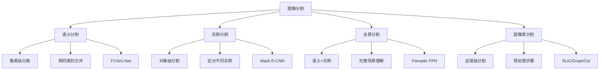

# 图像分割技术

## 🎯 核心概念

### 图像分割定义
> **图像分割是将图像分割成多个区域或对象的技术，每个区域具有相似的特征**

**分割任务类型：**


## 📊 传统分割方法

### 1. 基于阈值的分割

**阈值分割技术：**
```python
import numpy as np
import matplotlib.pyplot as plt
from skimage import filters, morphology
from skimage.segmentation import watershed
from scipy import ndimage

class ThresholdSegmentation:
    """基于阈值的分割"""
    
    def __init__(self):
        self.threshold_methods = {
            'otsu': '大津法',
            'triangle': '三角形法',
            'yen': 'Yen法',
            'li': 'Li法',
            'isodata': 'ISODATA法'
        }
    
    def otsu_threshold(self, image):
        """大津阈值分割"""
        threshold = filters.threshold_otsu(image)
        binary = image > threshold
        return binary, threshold
    
    def triangle_threshold(self, image):
        """三角形阈值分割"""
        threshold = filters.threshold_triangle(image)
        binary = image > threshold
        return binary, threshold
    
    def yen_threshold(self, image):
        """Yen阈值分割"""
        threshold = filters.threshold_yen(image)
        binary = image > threshold
        return binary, threshold
    
    def li_threshold(self, image):
        """Li阈值分割"""
        threshold = filters.threshold_li(image)
        binary = image > threshold
        return binary, threshold
    
    def isodata_threshold(self, image):
        """ISODATA阈值分割"""
        threshold = filters.threshold_isodata(image)
        binary = image > threshold
        return binary, threshold
    
    def adaptive_threshold(self, image, block_size=11, c=2):
        """自适应阈值分割"""
        from skimage.filters import threshold_local
        
        # 计算局部阈值
        local_thresh = threshold_local(image, block_size, offset=c)
        binary = image > local_thresh
        return binary, local_thresh
    
    def multi_threshold(self, image, n_thresholds=3):
        """多阈值分割"""
        # 计算多个阈值
        thresholds = []
        hist, bin_edges = np.histogram(image, bins=256, range=(0, 256))
        
        # 简化的多阈值计算
        for i in range(n_thresholds):
            threshold = filters.threshold_otsu(image)
            thresholds.append(threshold)
            # 更新图像范围
            image = image[image > threshold]
            if len(image) == 0:
                break
        
        # 应用多阈值
        segmented = np.zeros_like(image)
        for i, thresh in enumerate(thresholds):
            segmented[image > thresh] = i + 1
        
        return segmented, thresholds
    
    def visualize_threshold_results(self, image):
        """可视化阈值分割结果"""
        fig, axes = plt.subplots(2, 3, figsize=(15, 10))
        
        # 原图
        axes[0, 0].imshow(image, cmap='gray')
        axes[0, 0].set_title('Original Image')
        axes[0, 0].axis('off')
        
        # 大津法
        otsu_binary, otsu_thresh = self.otsu_threshold(image)
        axes[0, 1].imshow(otsu_binary, cmap='gray')
        axes[0, 1].set_title(f'Otsu (T={otsu_thresh:.1f})')
        axes[0, 1].axis('off')
        
        # 三角形法
        triangle_binary, triangle_thresh = self.triangle_threshold(image)
        axes[0, 2].imshow(triangle_binary, cmap='gray')
        axes[0, 2].set_title(f'Triangle (T={triangle_thresh:.1f})')
        axes[0, 2].axis('off')
        
        # Yen法
        yen_binary, yen_thresh = self.yen_threshold(image)
        axes[1, 0].imshow(yen_binary, cmap='gray')
        axes[1, 0].set_title(f'Yen (T={yen_thresh:.1f})')
        axes[1, 0].axis('off')
        
        # Li法
        li_binary, li_thresh = self.li_threshold(image)
        axes[1, 1].imshow(li_binary, cmap='gray')
        axes[1, 1].set_title(f'Li (T={li_thresh:.1f})')
        axes[1, 1].axis('off')
        
        # 自适应阈值
        adaptive_binary, adaptive_thresh = self.adaptive_threshold(image)
        axes[1, 2].imshow(adaptive_binary, cmap='gray')
        axes[1, 2].set_title('Adaptive Threshold')
        axes[1, 2].axis('off')
        
        plt.tight_layout()
        plt.show()

# 测试阈值分割
def test_threshold_segmentation():
    """测试阈值分割"""
    ts = ThresholdSegmentation()
    
    # 创建测试图像
    test_image = np.random.randint(0, 256, (200, 200), dtype=np.uint8)
    
    # 可视化结果
    ts.visualize_threshold_results(test_image)
    
    return ts

test_threshold_segmentation()
```

### 2. 基于区域的分割

**区域生长和分裂合并：**
```python
class RegionBasedSegmentation:
    """基于区域的分割"""
    
    def __init__(self):
        self.segmentation_methods = {
            'region_growing': '区域生长',
            'split_merge': '分裂合并',
            'watershed': '分水岭',
            'mean_shift': '均值漂移'
        }
    
    def region_growing(self, image, seed_points, threshold=10):
        """区域生长算法"""
        h, w = image.shape
        segmented = np.zeros((h, w), dtype=np.uint8)
        
        # 创建队列
        from collections import deque
        queue = deque()
        
        # 初始化种子点
        for seed in seed_points:
            queue.append(seed)
            segmented[seed[0], seed[1]] = 1
        
        # 8邻域
        neighbors = [(-1, -1), (-1, 0), (-1, 1),
                    (0, -1),           (0, 1),
                    (1, -1),  (1, 0),  (1, 1)]
        
        while queue:
            current = queue.popleft()
            cy, cx = current
            
            for dy, dx in neighbors:
                ny, nx = cy + dy, cx + dx
                
                # 边界检查
                if 0 <= ny < h and 0 <= nx < w:
                    # 未访问且相似
                    if segmented[ny, nx] == 0:
                        if abs(int(image[ny, nx]) - int(image[cy, cx])) <= threshold:
                            segmented[ny, nx] = 1
                            queue.append((ny, nx))
        
        return segmented
    
    def split_merge(self, image, min_size=4):
        """分裂合并算法"""
        h, w = image.shape
        
        def should_split(region):
            """判断是否应该分裂"""
            if region.shape[0] * region.shape[1] < min_size:
                return False
            
            # 计算方差
            variance = np.var(region)
            return variance > 100  # 阈值
        
        def split_region(region):
            """分裂区域"""
            h, w = region.shape
            if h <= 1 or w <= 1:
                return [region]
            
            # 垂直分割
            if h > w:
                mid = h // 2
                return [region[:mid, :], region[mid:, :]]
            else:
                mid = w // 2
                return [region[:, :mid], region[:, mid:]]
        
        def should_merge(region1, region2):
            """判断是否应该合并"""
            # 计算均值差异
            mean1 = np.mean(region1)
            mean2 = np.mean(region2)
            return abs(mean1 - mean2) < 20  # 阈值
        
        # 初始化为整个图像
        regions = [image]
        
        # 分裂阶段
        while True:
            new_regions = []
            split_occurred = False
            
            for region in regions:
                if should_split(region):
                    sub_regions = split_region(region)
                    new_regions.extend(sub_regions)
                    split_occurred = True
                else:
                    new_regions.append(region)
            
            if not split_occurred:
                break
            regions = new_regions
        
        # 合并阶段
        merged_regions = []
        used = [False] * len(regions)
        
        for i, region1 in enumerate(regions):
            if used[i]:
                continue
            
            current_region = region1.copy()
            used[i] = True
            
            for j, region2 in enumerate(regions[i+1:], i+1):
                if used[j]:
                    continue
                
                if should_merge(region1, region2):
                    current_region = np.concatenate([current_region, region2])
                    used[j] = True
            
            merged_regions.append(current_region)
        
        return merged_regions
    
    def watershed_segmentation(self, image):
        """分水岭分割"""
        from skimage.feature import peak_local_maxima
        from skimage.morphology import disk
        
        # 计算梯度
        gradient = filters.sobel(image)
        
        # 寻找局部最大值作为种子
        local_maxima = peak_local_maxima(-gradient, min_distance=10, threshold_abs=0.3)
        
        # 创建标记
        markers = np.zeros_like(image, dtype=np.int32)
        for i, (y, x) in enumerate(zip(local_maxima[0], local_maxima[1])):
            markers[y, x] = i + 1
        
        # 分水岭分割
        labels = watershed(gradient, markers)
        
        return labels, gradient
    
    def mean_shift_segmentation(self, image, spatial_radius=3, color_radius=20, min_density=50):
        """均值漂移分割"""
        from sklearn.cluster import MeanShift
        
        h, w = image.shape
        # 创建空间-颜色特征
        y_coords, x_coords = np.meshgrid(np.arange(h), np.arange(w), indexing='ij')
        
        # 特征矩阵: [x, y, intensity]
        features = np.column_stack([
            x_coords.ravel(),
            y_coords.ravel(),
            image.ravel()
        ])
        
        # 归一化
        features = features.astype(np.float32)
        features[:, 0] /= w  # 归一化x坐标
        features[:, 1] /= h  # 归一化y坐标
        features[:, 2] /= 255  # 归一化强度
        
        # 均值漂移聚类
        ms = MeanShift(bandwidth=0.1, min_bin_freq=min_density)
        labels = ms.fit_predict(features)
        
        # 重塑为图像
        segmented = labels.reshape(h, w)
        
        return segmented
    
    def visualize_region_segmentation(self, image):
        """可视化区域分割结果"""
        fig, axes = plt.subplots(2, 2, figsize=(12, 10))
        
        # 原图
        axes[0, 0].imshow(image, cmap='gray')
        axes[0, 0].set_title('Original Image')
        axes[0, 0].axis('off')
        
        # 区域生长
        seed_points = [(50, 50), (150, 150)]  # 种子点
        region_grown = self.region_growing(image, seed_points)
        axes[0, 1].imshow(region_grown, cmap='viridis')
        axes[0, 1].set_title('Region Growing')
        axes[0, 1].axis('off')
        
        # 分水岭分割
        watershed_labels, gradient = self.watershed_segmentation(image)
        axes[1, 0].imshow(watershed_labels, cmap='nipy_spectral')
        axes[1, 0].set_title('Watershed Segmentation')
        axes[1, 0].axis('off')
        
        # 均值漂移
        mean_shift_labels = self.mean_shift_segmentation(image)
        axes[1, 1].imshow(mean_shift_labels, cmap='nipy_spectral')
        axes[1, 1].set_title('Mean Shift Segmentation')
        axes[1, 1].axis('off')
        
        plt.tight_layout()
        plt.show()

# 测试区域分割
def test_region_segmentation():
    """测试区域分割"""
    rbs = RegionBasedSegmentation()
    
    # 创建测试图像
    test_image = np.random.randint(0, 256, (200, 200), dtype=np.uint8)
    
    # 可视化结果
    rbs.visualize_region_segmentation(test_image)
    
    return rbs

test_region_segmentation()
```

### 3. 基于边缘的分割

**边缘检测和连接：**
```python
class EdgeBasedSegmentation:
    """基于边缘的分割"""
    
    def __init__(self):
        self.edge_detectors = {
            'canny': 'Canny边缘检测',
            'sobel': 'Sobel边缘检测',
            'laplacian': '拉普拉斯边缘检测',
            'roberts': 'Roberts边缘检测',
            'prewitt': 'Prewitt边缘检测'
        }
    
    def canny_edge_detection(self, image, low_threshold=50, high_threshold=150):
        """Canny边缘检测"""
        from skimage.feature import canny
        
        edges = canny(image, low_threshold=low_threshold, high_threshold=high_threshold)
        return edges
    
    def sobel_edge_detection(self, image):
        """Sobel边缘检测"""
        from skimage.filters import sobel
        
        edges = sobel(image)
        return edges
    
    def laplacian_edge_detection(self, image):
        """拉普拉斯边缘检测"""
        from skimage.filters import laplace
        
        edges = laplace(image)
        return edges
    
    def roberts_edge_detection(self, image):
        """Roberts边缘检测"""
        from skimage.filters import roberts
        
        edges = roberts(image)
        return edges
    
    def prewitt_edge_detection(self, image):
        """Prewitt边缘检测"""
        from skimage.filters import prewitt
        
        edges = prewitt(image)
        return edges
    
    def edge_linking(self, edges, min_length=10):
        """边缘连接"""
        from skimage.morphology import skeletonize, remove_small_objects
        
        # 骨架化
        skeleton = skeletonize(edges)
        
        # 移除小对象
        cleaned = remove_small_objects(skeleton, min_size=min_length)
        
        return cleaned
    
    def active_contours(self, image, initial_contour, alpha=0.015, beta=10, gamma=0.001):
        """主动轮廓模型"""
        from skimage.segmentation import active_contour
        
        # 简化的主动轮廓
        snake = active_contour(image, initial_contour, alpha=alpha, beta=beta, gamma=gamma)
        return snake
    
    def graph_cut_segmentation(self, image, foreground_seeds, background_seeds):
        """图割分割"""
        from skimage.segmentation import random_walker
        
        # 创建标记图像
        markers = np.zeros(image.shape, dtype=np.uint8)
        markers[foreground_seeds] = 1
        markers[background_seeds] = 2
        
        # 随机游走分割
        labels = random_walker(image, markers, beta=10, mode='bf')
        
        return labels
    
    def visualize_edge_segmentation(self, image):
        """可视化边缘分割结果"""
        fig, axes = plt.subplots(2, 3, figsize=(15, 10))
        
        # 原图
        axes[0, 0].imshow(image, cmap='gray')
        axes[0, 0].set_title('Original Image')
        axes[0, 0].axis('off')
        
        # Canny边缘检测
        canny_edges = self.canny_edge_detection(image)
        axes[0, 1].imshow(canny_edges, cmap='gray')
        axes[0, 1].set_title('Canny Edge Detection')
        axes[0, 1].axis('off')
        
        # Sobel边缘检测
        sobel_edges = self.sobel_edge_detection(image)
        axes[0, 2].imshow(sobel_edges, cmap='gray')
        axes[0, 2].set_title('Sobel Edge Detection')
        axes[0, 2].axis('off')
        
        # 拉普拉斯边缘检测
        laplacian_edges = self.laplacian_edge_detection(image)
        axes[1, 0].imshow(laplacian_edges, cmap='gray')
        axes[1, 0].set_title('Laplacian Edge Detection')
        axes[1, 0].axis('off')
        
        # Roberts边缘检测
        roberts_edges = self.roberts_edge_detection(image)
        axes[1, 1].imshow(roberts_edges, cmap='gray')
        axes[1, 1].set_title('Roberts Edge Detection')
        axes[1, 1].axis('off')
        
        # 边缘连接
        linked_edges = self.edge_linking(canny_edges)
        axes[1, 2].imshow(linked_edges, cmap='gray')
        axes[1, 2].set_title('Edge Linking')
        axes[1, 2].axis('off')
        
        plt.tight_layout()
        plt.show()

# 测试边缘分割
def test_edge_segmentation():
    """测试边缘分割"""
    ebs = EdgeBasedSegmentation()
    
    # 创建测试图像
    test_image = np.random.randint(0, 256, (200, 200), dtype=np.uint8)
    
    # 可视化结果
    ebs.visualize_edge_segmentation(test_image)
    
    return ebs

test_edge_segmentation()
```

## 🚀 深度学习分割方法

### 1. 全卷积网络(FCN)

**FCN架构：**
```python
import torch
import torch.nn as nn
import torch.nn.functional as F

class FCN(nn.Module):
    """全卷积网络"""
    
    def __init__(self, num_classes=21):
        super(FCN, self).__init__()
        self.num_classes = num_classes
        
        # 编码器 (基于VGG16)
        self.conv1_1 = nn.Conv2d(3, 64, 3, padding=1)
        self.conv1_2 = nn.Conv2d(64, 64, 3, padding=1)
        self.pool1 = nn.MaxPool2d(2, stride=2)
        
        self.conv2_1 = nn.Conv2d(64, 128, 3, padding=1)
        self.conv2_2 = nn.Conv2d(128, 128, 3, padding=1)
        self.pool2 = nn.MaxPool2d(2, stride=2)
        
        self.conv3_1 = nn.Conv2d(128, 256, 3, padding=1)
        self.conv3_2 = nn.Conv2d(256, 256, 3, padding=1)
        self.conv3_3 = nn.Conv2d(256, 256, 3, padding=1)
        self.pool3 = nn.MaxPool2d(2, stride=2)
        
        self.conv4_1 = nn.Conv2d(256, 512, 3, padding=1)
        self.conv4_2 = nn.Conv2d(512, 512, 3, padding=1)
        self.conv4_3 = nn.Conv2d(512, 512, 3, padding=1)
        self.pool4 = nn.MaxPool2d(2, stride=2)
        
        self.conv5_1 = nn.Conv2d(512, 512, 3, padding=1)
        self.conv5_2 = nn.Conv2d(512, 512, 3, padding=1)
        self.conv5_3 = nn.Conv2d(512, 512, 3, padding=1)
        self.pool5 = nn.MaxPool2d(2, stride=2)
        
        # 解码器
        self.fc6 = nn.Conv2d(512, 4096, 7)
        self.fc7 = nn.Conv2d(4096, 4096, 1)
        self.score_fr = nn.Conv2d(4096, num_classes, 1)
        
        # 上采样层
        self.upscore2 = nn.ConvTranspose2d(num_classes, num_classes, 4, stride=2, bias=False)
        self.upscore4 = nn.ConvTranspose2d(num_classes, num_classes, 4, stride=2, bias=False)
        self.upscore8 = nn.ConvTranspose2d(num_classes, num_classes, 16, stride=8, bias=False)
        
        # 跳跃连接
        self.score_pool4 = nn.Conv2d(512, num_classes, 1)
        self.score_pool3 = nn.Conv2d(256, num_classes, 1)
        
    def forward(self, x):
        # 编码器
        x = F.relu(self.conv1_1(x))
        x = F.relu(self.conv1_2(x))
        x = self.pool1(x)
        
        x = F.relu(self.conv2_1(x))
        x = F.relu(self.conv2_2(x))
        x = self.pool2(x)
        
        x = F.relu(self.conv3_1(x))
        x = F.relu(self.conv3_2(x))
        x = F.relu(self.conv3_3(x))
        pool3 = x
        x = self.pool3(x)
        
        x = F.relu(self.conv4_1(x))
        x = F.relu(self.conv4_2(x))
        x = F.relu(self.conv4_3(x))
        pool4 = x
        x = self.pool4(x)
        
        x = F.relu(self.conv5_1(x))
        x = F.relu(self.conv5_2(x))
        x = F.relu(self.conv5_3(x))
        x = self.pool5(x)
        
        # 全连接层
        x = F.relu(self.fc6(x))
        x = F.dropout(x, training=self.training)
        x = F.relu(self.fc7(x))
        x = F.dropout(x, training=self.training)
        x = self.score_fr(x)
        
        # 上采样
        x = self.upscore2(x)
        upscore2 = x
        
        # 跳跃连接
        score_pool4 = self.score_pool4(pool4)
        score_pool4 = score_pool4[:, :, 5:5+upscore2.size()[2], 5:5+upscore2.size()[3]]
        x = upscore2 + score_pool4
        
        x = self.upscore4(x)
        upscore4 = x
        
        score_pool3 = self.score_pool3(pool3)
        score_pool3 = score_pool3[:, :, 9:9+upscore4.size()[2], 9:9+upscore4.size()[3]]
        x = upscore4 + score_pool3
        
        x = self.upscore8(x)
        x = x[:, :, 31:31+x.size()[2], 31:31+x.size()[3]]
        
        return x

class FCN32s(FCN):
    """FCN-32s"""
    def __init__(self, num_classes=21):
        super(FCN32s, self).__init__(num_classes)
        # 只使用32倍上采样
        self.upscore32 = nn.ConvTranspose2d(num_classes, num_classes, 64, stride=32, bias=False)
    
    def forward(self, x):
        # 编码器部分
        x = F.relu(self.conv1_1(x))
        x = F.relu(self.conv1_2(x))
        x = self.pool1(x)
        
        x = F.relu(self.conv2_1(x))
        x = F.relu(self.conv2_2(x))
        x = self.pool2(x)
        
        x = F.relu(self.conv3_1(x))
        x = F.relu(self.conv3_2(x))
        x = F.relu(self.conv3_3(x))
        x = self.pool3(x)
        
        x = F.relu(self.conv4_1(x))
        x = F.relu(self.conv4_2(x))
        x = F.relu(self.conv4_3(x))
        x = self.pool4(x)
        
        x = F.relu(self.conv5_1(x))
        x = F.relu(self.conv5_2(x))
        x = F.relu(self.conv5_3(x))
        x = self.pool5(x)
        
        # 全连接层
        x = F.relu(self.fc6(x))
        x = F.dropout(x, training=self.training)
        x = F.relu(self.fc7(x))
        x = F.dropout(x, training=self.training)
        x = self.score_fr(x)
        
        # 32倍上采样
        x = self.upscore32(x)
        
        return x

# 测试FCN
def test_fcn():
    """测试FCN"""
    # FCN-32s
    fcn32s = FCN32s(num_classes=21)
    
    # FCN-16s
    fcn16s = FCN(num_classes=21)
    
    # 测试输入
    x = torch.randn(1, 3, 224, 224)
    
    # 前向传播
    output32s = fcn32s(x)
    output16s = fcn16s(x)
    
    print(f"FCN-32s output shape: {output32s.shape}")
    print(f"FCN-16s output shape: {output16s.shape}")
    
    return fcn32s, fcn16s

test_fcn()
```

### 2. U-Net架构

**U-Net网络：**
```python
class UNet(nn.Module):
    """U-Net网络"""
    
    def __init__(self, in_channels=3, out_channels=1, features=[64, 128, 256, 512]):
        super(UNet, self).__init__()
        self.features = features
        
        # 编码器
        self.encoder = nn.ModuleList()
        self.pool = nn.MaxPool2d(kernel_size=2, stride=2)
        
        for feature in features:
            self.encoder.append(self._make_double_conv(in_channels, feature))
            in_channels = feature
        
        # 瓶颈层
        self.bottleneck = self._make_double_conv(features[-1], features[-1] * 2)
        
        # 解码器
        self.decoder = nn.ModuleList()
        for feature in reversed(features):
            self.decoder.append(nn.ConvTranspose2d(feature * 2, feature, kernel_size=2, stride=2))
            self.decoder.append(self._make_double_conv(feature * 2, feature))
        
        # 最终输出层
        self.final_conv = nn.Conv2d(features[0], out_channels, kernel_size=1)
    
    def _make_double_conv(self, in_channels, out_channels):
        """创建双卷积块"""
        return nn.Sequential(
            nn.Conv2d(in_channels, out_channels, 3, 1, 1, bias=False),
            nn.BatchNorm2d(out_channels),
            nn.ReLU(inplace=True),
            nn.Conv2d(out_channels, out_channels, 3, 1, 1, bias=False),
            nn.BatchNorm2d(out_channels),
            nn.ReLU(inplace=True)
        )
    
    def forward(self, x):
        # 编码器
        skip_connections = []
        
        for encoder in self.encoder:
            x = encoder(x)
            skip_connections.append(x)
            x = self.pool(x)
        
        # 瓶颈层
        x = self.bottleneck(x)
        skip_connections = skip_connections[::-1]  # 反转
        
        # 解码器
        for idx in range(0, len(self.decoder), 2):
            x = self.decoder[idx](x)  # 上采样
            skip_connection = skip_connections[idx // 2]
            
            # 调整尺寸
            if x.shape != skip_connection.shape:
                x = F.interpolate(x, size=skip_connection.shape[2:], mode='bilinear', align_corners=False)
            
            concat_skip = torch.cat((skip_connection, x), dim=1)
            x = self.decoder[idx + 1](concat_skip)  # 双卷积
        
        # 最终输出
        x = self.final_conv(x)
        return x

class AttentionUNet(nn.Module):
    """注意力U-Net"""
    
    def __init__(self, in_channels=3, out_channels=1, features=[64, 128, 256, 512]):
        super(AttentionUNet, self).__init__()
        self.features = features
        
        # 编码器
        self.encoder = nn.ModuleList()
        self.pool = nn.MaxPool2d(kernel_size=2, stride=2)
        
        for feature in features:
            self.encoder.append(self._make_double_conv(in_channels, feature))
            in_channels = feature
        
        # 瓶颈层
        self.bottleneck = self._make_double_conv(features[-1], features[-1] * 2)
        
        # 解码器
        self.decoder = nn.ModuleList()
        self.attention_gates = nn.ModuleList()
        
        for feature in reversed(features):
            self.decoder.append(nn.ConvTranspose2d(feature * 2, feature, kernel_size=2, stride=2))
            self.attention_gates.append(AttentionGate(feature, feature))
            self.decoder.append(self._make_double_conv(feature * 2, feature))
        
        # 最终输出层
        self.final_conv = nn.Conv2d(features[0], out_channels, kernel_size=1)
    
    def _make_double_conv(self, in_channels, out_channels):
        """创建双卷积块"""
        return nn.Sequential(
            nn.Conv2d(in_channels, out_channels, 3, 1, 1, bias=False),
            nn.BatchNorm2d(out_channels),
            nn.ReLU(inplace=True),
            nn.Conv2d(out_channels, out_channels, 3, 1, 1, bias=False),
            nn.BatchNorm2d(out_channels),
            nn.ReLU(inplace=True)
        )
    
    def forward(self, x):
        # 编码器
        skip_connections = []
        
        for encoder in self.encoder:
            x = encoder(x)
            skip_connections.append(x)
            x = self.pool(x)
        
        # 瓶颈层
        x = self.bottleneck(x)
        skip_connections = skip_connections[::-1]  # 反转
        
        # 解码器
        for idx in range(0, len(self.decoder), 2):
            x = self.decoder[idx](x)  # 上采样
            skip_connection = skip_connections[idx // 2]
            
            # 注意力门
            attention = self.attention_gates[idx // 2](x, skip_connection)
            skip_connection = skip_connection * attention
            
            # 调整尺寸
            if x.shape != skip_connection.shape:
                x = F.interpolate(x, size=skip_connection.shape[2:], mode='bilinear', align_corners=False)
            
            concat_skip = torch.cat((skip_connection, x), dim=1)
            x = self.decoder[idx + 1](concat_skip)  # 双卷积
        
        # 最终输出
        x = self.final_conv(x)
        return x

class AttentionGate(nn.Module):
    """注意力门"""
    
    def __init__(self, F_g, F_l, F_int):
        super(AttentionGate, self).__init__()
        self.W_g = nn.Sequential(
            nn.Conv2d(F_g, F_int, kernel_size=1, stride=1, padding=0, bias=True),
            nn.BatchNorm2d(F_int)
        )
        
        self.W_x = nn.Sequential(
            nn.Conv2d(F_l, F_int, kernel_size=1, stride=1, padding=0, bias=True),
            nn.BatchNorm2d(F_int)
        )
        
        self.psi = nn.Sequential(
            nn.Conv2d(F_int, 1, kernel_size=1, stride=1, padding=0, bias=True),
            nn.BatchNorm2d(1),
            nn.Sigmoid()
        )
        
        self.relu = nn.ReLU(inplace=True)
    
    def forward(self, g, x):
        g1 = self.W_g(g)
        x1 = self.W_x(x)
        psi = self.relu(g1 + x1)
        psi = self.psi(psi)
        
        return x * psi

# 测试U-Net
def test_unet():
    """测试U-Net"""
    # 标准U-Net
    unet = UNet(in_channels=3, out_channels=1)
    
    # 注意力U-Net
    attention_unet = AttentionUNet(in_channels=3, out_channels=1)
    
    # 测试输入
    x = torch.randn(1, 3, 224, 224)
    
    # 前向传播
    output1 = unet(x)
    output2 = attention_unet(x)
    
    print(f"U-Net output shape: {output1.shape}")
    print(f"Attention U-Net output shape: {output2.shape}")
    
    return unet, attention_unet

test_unet()
```

### 3. DeepLab系列

**DeepLab架构：**
```python
class DeepLabV3(nn.Module):
    """DeepLabV3网络"""
    
    def __init__(self, num_classes=21, backbone='resnet50'):
        super(DeepLabV3, self).__init__()
        self.num_classes = num_classes
        
        # 骨干网络
        if backbone == 'resnet50':
            self.backbone = self._make_resnet50_backbone()
            self.aspp = ASPP(2048, 256)
        elif backbone == 'resnet101':
            self.backbone = self._make_resnet101_backbone()
            self.aspp = ASPP(2048, 256)
        
        # 分类器
        self.classifier = nn.Sequential(
            nn.Conv2d(256, 256, 3, padding=1, bias=False),
            nn.BatchNorm2d(256),
            nn.ReLU(inplace=True),
            nn.Dropout(0.1),
            nn.Conv2d(256, num_classes, 1)
        )
    
    def _make_resnet50_backbone(self):
        """构建ResNet50骨干网络"""
        import torchvision.models as models
        
        resnet = models.resnet50(pretrained=True)
        # 移除最后的全连接层和平均池化层
        backbone = nn.Sequential(
            resnet.conv1,
            resnet.bn1,
            resnet.relu,
            resnet.maxpool,
            resnet.layer1,
            resnet.layer2,
            resnet.layer3,
            resnet.layer4
        )
        return backbone
    
    def _make_resnet101_backbone(self):
        """构建ResNet101骨干网络"""
        import torchvision.models as models
        
        resnet = models.resnet101(pretrained=True)
        # 移除最后的全连接层和平均池化层
        backbone = nn.Sequential(
            resnet.conv1,
            resnet.bn1,
            resnet.relu,
            resnet.maxpool,
            resnet.layer1,
            resnet.layer2,
            resnet.layer3,
            resnet.layer4
        )
        return backbone
    
    def forward(self, x):
        # 特征提取
        features = self.backbone(x)
        
        # ASPP
        aspp_features = self.aspp(features)
        
        # 分类
        output = self.classifier(aspp_features)
        
        # 上采样到原图尺寸
        output = F.interpolate(output, size=x.size()[2:], mode='bilinear', align_corners=False)
        
        return output

class ASPP(nn.Module):
    """Atrous Spatial Pyramid Pooling"""
    
    def __init__(self, in_channels, out_channels):
        super(ASPP, self).__init__()
        
        # 1x1卷积
        self.conv1x1 = nn.Sequential(
            nn.Conv2d(in_channels, out_channels, 1, bias=False),
            nn.BatchNorm2d(out_channels),
            nn.ReLU(inplace=True)
        )
        
        # 3x3卷积，不同膨胀率
        self.conv3x3_1 = nn.Sequential(
            nn.Conv2d(in_channels, out_channels, 3, padding=6, dilation=6, bias=False),
            nn.BatchNorm2d(out_channels),
            nn.ReLU(inplace=True)
        )
        
        self.conv3x3_2 = nn.Sequential(
            nn.Conv2d(in_channels, out_channels, 3, padding=12, dilation=12, bias=False),
            nn.BatchNorm2d(out_channels),
            nn.ReLU(inplace=True)
        )
        
        self.conv3x3_3 = nn.Sequential(
            nn.Conv2d(in_channels, out_channels, 3, padding=18, dilation=18, bias=False),
            nn.BatchNorm2d(out_channels),
            nn.ReLU(inplace=True)
        )
        
        # 全局平均池化
        self.global_avg_pool = nn.Sequential(
            nn.AdaptiveAvgPool2d(1),
            nn.Conv2d(in_channels, out_channels, 1, bias=False),
            nn.BatchNorm2d(out_channels),
            nn.ReLU(inplace=True)
        )
        
        # 融合层
        self.fusion = nn.Sequential(
            nn.Conv2d(out_channels * 5, out_channels, 1, bias=False),
            nn.BatchNorm2d(out_channels),
            nn.ReLU(inplace=True),
            nn.Dropout(0.1)
        )
    
    def forward(self, x):
        # 不同尺度的特征
        feat1x1 = self.conv1x1(x)
        feat3x3_1 = self.conv3x3_1(x)
        feat3x3_2 = self.conv3x3_2(x)
        feat3x3_3 = self.conv3x3_3(x)
        
        # 全局平均池化
        global_feat = self.global_avg_pool(x)
        global_feat = F.interpolate(global_feat, size=x.size()[2:], mode='bilinear', align_corners=False)
        
        # 融合所有特征
        concat_feat = torch.cat([feat1x1, feat3x3_1, feat3x3_2, feat3x3_3, global_feat], dim=1)
        output = self.fusion(concat_feat)
        
        return output

class DeepLabV3Plus(nn.Module):
    """DeepLabV3+网络"""
    
    def __init__(self, num_classes=21, backbone='resnet50'):
        super(DeepLabV3Plus, self).__init__()
        self.num_classes = num_classes
        
        # 骨干网络
        if backbone == 'resnet50':
            self.backbone = self._make_resnet50_backbone()
            self.aspp = ASPP(2048, 256)
        elif backbone == 'resnet101':
            self.backbone = self._make_resnet101_backbone()
            self.aspp = ASPP(2048, 256)
        
        # 解码器
        self.decoder = Decoder(256, 256, num_classes)
    
    def _make_resnet50_backbone(self):
        """构建ResNet50骨干网络"""
        import torchvision.models as models
        
        resnet = models.resnet50(pretrained=True)
        # 移除最后的全连接层和平均池化层
        backbone = nn.Sequential(
            resnet.conv1,
            resnet.bn1,
            resnet.relu,
            resnet.maxpool,
            resnet.layer1,
            resnet.layer2,
            resnet.layer3,
            resnet.layer4
        )
        return backbone
    
    def _make_resnet101_backbone(self):
        """构建ResNet101骨干网络"""
        import torchvision.models as models
        
        resnet = models.resnet101(pretrained=True)
        # 移除最后的全连接层和平均池化层
        backbone = nn.Sequential(
            resnet.conv1,
            resnet.bn1,
            resnet.relu,
            resnet.maxpool,
            resnet.layer1,
            resnet.layer2,
            resnet.layer3,
            resnet.layer4
        )
        return backbone
    
    def forward(self, x):
        # 特征提取
        features = self.backbone(x)
        
        # ASPP
        aspp_features = self.aspp(features)
        
        # 解码器
        output = self.decoder(aspp_features, features)
        
        # 上采样到原图尺寸
        output = F.interpolate(output, size=x.size()[2:], mode='bilinear', align_corners=False)
        
        return output

class Decoder(nn.Module):
    """解码器"""
    
    def __init__(self, low_level_channels, decoder_channels, num_classes):
        super(Decoder, self).__init__()
        
        # 低级别特征处理
        self.low_level_conv = nn.Sequential(
            nn.Conv2d(low_level_channels, 48, 1, bias=False),
            nn.BatchNorm2d(48),
            nn.ReLU(inplace=True)
        )
        
        # 解码器
        self.decoder = nn.Sequential(
            nn.Conv2d(decoder_channels + 48, decoder_channels, 3, padding=1, bias=False),
            nn.BatchNorm2d(decoder_channels),
            nn.ReLU(inplace=True),
            nn.Dropout(0.1),
            nn.Conv2d(decoder_channels, decoder_channels, 3, padding=1, bias=False),
            nn.BatchNorm2d(decoder_channels),
            nn.ReLU(inplace=True),
            nn.Dropout(0.1),
            nn.Conv2d(decoder_channels, num_classes, 1)
        )
    
    def forward(self, aspp_features, low_level_features):
        # 上采样ASPP特征
        aspp_features = F.interpolate(aspp_features, size=low_level_features.size()[2:], 
                                    mode='bilinear', align_corners=False)
        
        # 处理低级别特征
        low_level_features = self.low_level_conv(low_level_features)
        
        # 融合特征
        concat_features = torch.cat([aspp_features, low_level_features], dim=1)
        
        # 解码
        output = self.decoder(concat_features)
        
        return output

# 测试DeepLab
def test_deeplab():
    """测试DeepLab"""
    # DeepLabV3
    deeplabv3 = DeepLabV3(num_classes=21, backbone='resnet50')
    
    # DeepLabV3+
    deeplabv3plus = DeepLabV3Plus(num_classes=21, backbone='resnet50')
    
    # 测试输入
    x = torch.randn(1, 3, 224, 224)
    
    # 前向传播
    output1 = deeplabv3(x)
    output2 = deeplabv3plus(x)
    
    print(f"DeepLabV3 output shape: {output1.shape}")
    print(f"DeepLabV3+ output shape: {output2.shape}")
    
    return deeplabv3, deeplabv3plus

test_deeplab()
```

## 📈 分割评估指标

### 1. 分割精度指标

**评估指标计算：**
```python
class SegmentationMetrics:
    """图像分割评估指标"""
    
    def __init__(self):
        self.metrics = {
            'pixel_accuracy': '像素准确率',
            'mean_accuracy': '平均准确率',
            'mean_iou': '平均IoU',
            'frequency_weighted_iou': '频率加权IoU',
            'dice_coefficient': 'Dice系数',
            'hausdorff_distance': 'Hausdorff距离'
        }
    
    def pixel_accuracy(self, pred, target):
        """像素准确率"""
        correct = (pred == target).sum()
        total = target.numel()
        return correct.float() / total
    
    def mean_accuracy(self, pred, target, num_classes):
        """平均准确率"""
        accuracies = []
        
        for i in range(num_classes):
            mask = (target == i)
            if mask.sum() > 0:
                accuracy = (pred[mask] == i).float().mean()
                accuracies.append(accuracy)
        
        return torch.tensor(accuracies).mean()
    
    def mean_iou(self, pred, target, num_classes):
        """平均IoU"""
        ious = []
        
        for i in range(num_classes):
            pred_i = (pred == i)
            target_i = (target == i)
            
            intersection = (pred_i & target_i).sum().float()
            union = (pred_i | target_i).sum().float()
            
            if union > 0:
                iou = intersection / union
                ious.append(iou)
        
        return torch.tensor(ious).mean()
    
    def frequency_weighted_iou(self, pred, target, num_classes):
        """频率加权IoU"""
        ious = []
        frequencies = []
        
        for i in range(num_classes):
            pred_i = (pred == i)
            target_i = (target == i)
            
            intersection = (pred_i & target_i).sum().float()
            union = (pred_i | target_i).sum().float()
            frequency = target_i.sum().float()
            
            if union > 0:
                iou = intersection / union
                ious.append(iou)
                frequencies.append(frequency)
        
        if frequencies:
            frequencies = torch.tensor(frequencies)
            ious = torch.tensor(ious)
            return (frequencies * ious).sum() / frequencies.sum()
        else:
            return torch.tensor(0.0)
    
    def dice_coefficient(self, pred, target, num_classes):
        """Dice系数"""
        dices = []
        
        for i in range(num_classes):
            pred_i = (pred == i)
            target_i = (target == i)
            
            intersection = (pred_i & target_i).sum().float()
            total = pred_i.sum().float() + target_i.sum().float()
            
            if total > 0:
                dice = 2 * intersection / total
                dices.append(dice)
        
        return torch.tensor(dices).mean()
    
    def hausdorff_distance(self, pred, target, num_classes):
        """Hausdorff距离"""
        from scipy.spatial.distance import directed_hausdorff
        
        distances = []
        
        for i in range(num_classes):
            pred_i = (pred == i).cpu().numpy()
            target_i = (target == i).cpu().numpy()
            
            if pred_i.sum() > 0 and target_i.sum() > 0:
                # 找到边界点
                pred_points = np.column_stack(np.where(pred_i))
                target_points = np.column_stack(np.where(target_i))
                
                # 计算Hausdorff距离
                dist1 = directed_hausdorff(pred_points, target_points)[0]
                dist2 = directed_hausdorff(target_points, pred_points)[0]
                hausdorff_dist = max(dist1, dist2)
                
                distances.append(hausdorff_dist)
        
        return np.mean(distances) if distances else 0.0
    
    def evaluate_segmentation(self, pred, target, num_classes):
        """评估分割结果"""
        results = {}
        
        results['pixel_accuracy'] = self.pixel_accuracy(pred, target)
        results['mean_accuracy'] = self.mean_accuracy(pred, target, num_classes)
        results['mean_iou'] = self.mean_iou(pred, target, num_classes)
        results['frequency_weighted_iou'] = self.frequency_weighted_iou(pred, target, num_classes)
        results['dice_coefficient'] = self.dice_coefficient(pred, target, num_classes)
        results['hausdorff_distance'] = self.hausdorff_distance(pred, target, num_classes)
        
        return results
    
    def visualize_metrics(self, results):
        """可视化评估指标"""
        metrics = list(results.keys())
        values = [results[metric].item() if torch.is_tensor(results[metric]) else results[metric] 
                 for metric in metrics]
        
        plt.figure(figsize=(12, 6))
        bars = plt.bar(metrics, values)
        plt.title('Segmentation Metrics')
        plt.ylabel('Score')
        plt.xticks(rotation=45)
        plt.ylim(0, 1)
        
        # 添加数值标签
        for bar, value in zip(bars, values):
            plt.text(bar.get_x() + bar.get_width()/2, bar.get_height() + 0.01, 
                    f'{value:.3f}', ha='center', va='bottom')
        
        plt.tight_layout()
        plt.show()

# 测试分割评估指标
def test_segmentation_metrics():
    """测试分割评估指标"""
    metrics = SegmentationMetrics()
    
    # 模拟预测和真实标签
    pred = torch.randint(0, 3, (224, 224))
    target = torch.randint(0, 3, (224, 224))
    num_classes = 3
    
    # 评估
    results = metrics.evaluate_segmentation(pred, target, num_classes)
    
    # 可视化
    metrics.visualize_metrics(results)
    
    print("评估结果:")
    for metric, value in results.items():
        print(f"{metric}: {value:.3f}")
    
    return metrics

test_segmentation_metrics()
```

## 🔗 相关链接
- [[02-02-01-神经网络原理]] - 神经网络基础
- [[02-03-02-CNN卷积神经网络]] - 卷积神经网络
- [[03-01-01-图像处理基础]] - 图像处理基础
- [[03-01-02-目标检测算法]] - 目标检测技术
- [[03-01-04-人脸识别系统]] - 人脸识别应用

## 💡 费曼学习法应用

**概念理解**：图像分割就像"填色游戏"，把图像分成不同的区域，每个区域用不同颜色表示。就像给黑白线稿上色一样，需要准确识别边界。

**实践建议**：
- 🎯 **理解任务**：明确不同分割任务的区别：语义分割、实例分割、全景分割
- 🔧 **掌握方法**：从传统方法到深度学习方法，理解每种方法的优缺点
- 📊 **评估性能**：学会使用IoU、Dice系数等指标评估分割质量
- 🚀 **实际应用**：在具体项目中应用图像分割技术

**刻意练习**：
- 💻 **实现算法**：亲手实现经典的分割算法
- 📈 **调优参数**：调整网络结构和超参数提升性能
- 🔍 **分析结果**：分析分割结果，理解失败原因
- 📝 **总结对比**：对比不同算法的性能和适用场景

---
*📝 学习提示：图像分割是计算机视觉的重要任务，建议多实践不同算法，理解其原理和适用场景*
