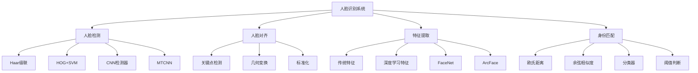

# 人脸识别系统

## 🎯 核心概念

### 人脸识别定义
> **人脸识别是基于人脸特征进行身份识别和验证的技术，包括人脸检测、特征提取和身份匹配**

**人脸识别系统架构：**


## 📊 人脸检测技术

### 1. 传统检测方法

**Haar级联检测器：**
```python
import cv2
import numpy as np
import matplotlib.pyplot as plt
from sklearn.svm import SVC
from sklearn.decomposition import PCA
import dlib

class HaarCascadeDetector:
    """Haar级联人脸检测器"""
    
    def __init__(self):
        self.face_cascade = cv2.CascadeClassifier(cv2.data.haarcascades + 'haarcascade_frontalface_default.xml')
        self.eye_cascade = cv2.CascadeClassifier(cv2.data.haarcascades + 'haarcascade_eye.xml')
        self.smile_cascade = cv2.CascadeClassifier(cv2.data.haarcascades + 'haarcascade_smile.xml')
    
    def detect_faces(self, image, scale_factor=1.1, min_neighbors=5, min_size=(30, 30)):
        """检测人脸"""
        gray = cv2.cvtColor(image, cv2.COLOR_BGR2GRAY) if len(image.shape) == 3 else image
        
        faces = self.face_cascade.detectMultiScale(
            gray, 
            scaleFactor=scale_factor,
            minNeighbors=min_neighbors,
            minSize=min_size
        )
        
        return faces
    
    def detect_eyes(self, image, faces):
        """检测眼睛"""
        gray = cv2.cvtColor(image, cv2.COLOR_BGR2GRAY) if len(image.shape) == 3 else image
        eyes = []
        
        for (x, y, w, h) in faces:
            roi_gray = gray[y:y+h, x:x+w]
            roi_color = image[y:y+h, x:x+w]
            
            detected_eyes = self.eye_cascade.detectMultiScale(roi_gray)
            for (ex, ey, ew, eh) in detected_eyes:
                eyes.append((x + ex, y + ey, ew, eh))
        
        return eyes
    
    def detect_smiles(self, image, faces):
        """检测微笑"""
        gray = cv2.cvtColor(image, cv2.COLOR_BGR2GRAY) if len(image.shape) == 3 else image
        smiles = []
        
        for (x, y, w, h) in faces:
            roi_gray = gray[y:y+h, x:x+w]
            
            detected_smiles = self.smile_cascade.detectMultiScale(
                roi_gray, 
                scaleFactor=1.7, 
                minNeighbors=22, 
                minSize=(25, 25)
            )
            for (sx, sy, sw, sh) in detected_smiles:
                smiles.append((x + sx, y + sy, sw, sh))
        
        return smiles
    
    def visualize_detection(self, image, faces, eyes=None, smiles=None):
        """可视化检测结果"""
        result_image = image.copy()
        
        # 绘制人脸框
        for (x, y, w, h) in faces:
            cv2.rectangle(result_image, (x, y), (x+w, y+h), (255, 0, 0), 2)
            cv2.putText(result_image, 'Face', (x, y-10), cv2.FONT_HERSHEY_SIMPLEX, 0.5, (255, 0, 0), 2)
        
        # 绘制眼睛框
        if eyes:
            for (x, y, w, h) in eyes:
                cv2.rectangle(result_image, (x, y), (x+w, y+h), (0, 255, 0), 2)
                cv2.putText(result_image, 'Eye', (x, y-10), cv2.FONT_HERSHEY_SIMPLEX, 0.5, (0, 255, 0), 2)
        
        # 绘制微笑框
        if smiles:
            for (x, y, w, h) in smiles:
                cv2.rectangle(result_image, (x, y), (x+w, y+h), (0, 0, 255), 2)
                cv2.putText(result_image, 'Smile', (x, y-10), cv2.FONT_HERSHEY_SIMPLEX, 0.5, (0, 0, 255), 2)
        
        return result_image

class HOGFaceDetector:
    """HOG特征人脸检测器"""
    
    def __init__(self):
        self.hog = cv2.HOGDescriptor()
        self.hog.setSVMDetector(cv2.HOGDescriptor_getDefaultPeopleDetector())
    
    def extract_hog_features(self, image):
        """提取HOG特征"""
        gray = cv2.cvtColor(image, cv2.COLOR_BGR2GRAY) if len(image.shape) == 3 else image
        
        # 计算HOG特征
        features = self.hog.compute(gray)
        return features.flatten()
    
    def detect_faces_hog(self, image, win_stride=(8, 8), padding=(32, 32), scale=1.05):
        """使用HOG检测人脸"""
        gray = cv2.cvtColor(image, cv2.COLOR_BGR2GRAY) if len(image.shape) == 3 else image
        
        # 检测
        (rects, weights) = self.hog.detectMultiScale(
            gray, 
            winStride=win_stride,
            padding=padding,
            scale=scale
        )
        
        return rects, weights
    
    def train_face_detector(self, positive_samples, negative_samples):
        """训练人脸检测器"""
        # 提取正样本特征
        positive_features = []
        for sample in positive_samples:
            features = self.extract_hog_features(sample)
            positive_features.append(features)
        
        # 提取负样本特征
        negative_features = []
        for sample in negative_samples:
            features = self.extract_hog_features(sample)
            negative_features.append(features)
        
        # 合并特征和标签
        X = np.vstack([positive_features, negative_features])
        y = np.hstack([np.ones(len(positive_features)), np.zeros(len(negative_features))])
        
        # 训练SVM
        svm = SVC(kernel='linear', probability=True)
        svm.fit(X, y)
        
        return svm

# 测试传统检测方法
def test_traditional_detection():
    """测试传统检测方法"""
    # Haar级联检测器
    haar_detector = HaarCascadeDetector()
    
    # HOG检测器
    hog_detector = HOGFaceDetector()
    
    # 创建测试图像
    test_image = np.random.randint(0, 256, (300, 400, 3), dtype=np.uint8)
    
    # Haar检测
    faces = haar_detector.detect_faces(test_image)
    eyes = haar_detector.detect_eyes(test_image, faces)
    smiles = haar_detector.detect_smiles(test_image, faces)
    
    # 可视化
    result = haar_detector.visualize_detection(test_image, faces, eyes, smiles)
    
    plt.figure(figsize=(12, 8))
    plt.subplot(1, 2, 1)
    plt.imshow(cv2.cvtColor(test_image, cv2.COLOR_BGR2RGB))
    plt.title('Original Image')
    plt.axis('off')
    
    plt.subplot(1, 2, 2)
    plt.imshow(cv2.cvtColor(result, cv2.COLOR_BGR2RGB))
    plt.title('Face Detection Result')
    plt.axis('off')
    
    plt.tight_layout()
    plt.show()
    
    return haar_detector, hog_detector

test_traditional_detection()
```

### 2. 深度学习检测方法

**MTCNN检测器：**
```python
import torch
import torch.nn as nn
import torch.nn.functional as F
from torchvision import transforms

class PNet(nn.Module):
    """P-Net: Proposal Network"""
    
    def __init__(self):
        super(PNet, self).__init__()
        self.conv1 = nn.Conv2d(3, 10, 3, 1)
        self.prelu1 = nn.PReLU(10)
        self.pool1 = nn.MaxPool2d(2, 2)
        
        self.conv2 = nn.Conv2d(10, 16, 3, 1)
        self.prelu2 = nn.PReLU(16)
        
        self.conv3 = nn.Conv2d(16, 32, 3, 1)
        self.prelu3 = nn.PReLU(32)
        
        # 分类分支
        self.conv4_1 = nn.Conv2d(32, 2, 1, 1)
        self.softmax4_1 = nn.Softmax(dim=1)
        
        # 回归分支
        self.conv4_2 = nn.Conv2d(32, 4, 1, 1)
        
        # 关键点分支
        self.conv4_3 = nn.Conv2d(32, 10, 1, 1)
    
    def forward(self, x):
        x = self.prelu1(self.conv1(x))
        x = self.pool1(x)
        x = self.prelu2(self.conv2(x))
        x = self.prelu3(self.conv3(x))
        
        # 分类
        cls = self.softmax4_1(self.conv4_1(x))
        
        # 回归
        bbox = self.conv4_2(x)
        
        # 关键点
        landmark = self.conv4_3(x)
        
        return cls, bbox, landmark

class RNet(nn.Module):
    """R-Net: Refine Network"""
    
    def __init__(self):
        super(RNet, self).__init__()
        self.conv1 = nn.Conv2d(3, 28, 3, 1)
        self.prelu1 = nn.PReLU(28)
        self.pool1 = nn.MaxPool2d(3, 2)
        
        self.conv2 = nn.Conv2d(28, 48, 3, 1)
        self.prelu2 = nn.PReLU(48)
        self.pool2 = nn.MaxPool2d(3, 2)
        
        self.conv3 = nn.Conv2d(48, 64, 2, 1)
        self.prelu3 = nn.PReLU(64)
        
        self.fc4 = nn.Linear(64 * 2 * 2, 128)
        self.prelu4 = nn.PReLU(128)
        
        # 分类分支
        self.fc5_1 = nn.Linear(128, 2)
        self.softmax5_1 = nn.Softmax(dim=1)
        
        # 回归分支
        self.fc5_2 = nn.Linear(128, 4)
        
        # 关键点分支
        self.fc5_3 = nn.Linear(128, 10)
    
    def forward(self, x):
        x = self.prelu1(self.conv1(x))
        x = self.pool1(x)
        x = self.prelu2(self.conv2(x))
        x = self.pool2(x)
        x = self.prelu3(self.conv3(x))
        x = x.view(x.size(0), -1)
        x = self.prelu4(self.fc4(x))
        
        # 分类
        cls = self.softmax5_1(self.fc5_1(x))
        
        # 回归
        bbox = self.fc5_2(x)
        
        # 关键点
        landmark = self.fc5_3(x)
        
        return cls, bbox, landmark

class ONet(nn.Module):
    """O-Net: Output Network"""
    
    def __init__(self):
        super(ONet, self).__init__()
        self.conv1 = nn.Conv2d(3, 32, 3, 1)
        self.prelu1 = nn.PReLU(32)
        self.pool1 = nn.MaxPool2d(3, 2)
        
        self.conv2 = nn.Conv2d(32, 64, 3, 1)
        self.prelu2 = nn.PReLU(64)
        self.pool2 = nn.MaxPool2d(3, 2)
        
        self.conv3 = nn.Conv2d(64, 64, 3, 1)
        self.prelu3 = nn.PReLU(64)
        self.pool3 = nn.MaxPool2d(2, 2)
        
        self.conv4 = nn.Conv2d(64, 128, 2, 1)
        self.prelu4 = nn.PReLU(128)
        
        self.fc5 = nn.Linear(128 * 2 * 2, 256)
        self.prelu5 = nn.PReLU(256)
        
        # 分类分支
        self.fc6_1 = nn.Linear(256, 2)
        self.softmax6_1 = nn.Softmax(dim=1)
        
        # 回归分支
        self.fc6_2 = nn.Linear(256, 4)
        
        # 关键点分支
        self.fc6_3 = nn.Linear(256, 10)
    
    def forward(self, x):
        x = self.prelu1(self.conv1(x))
        x = self.pool1(x)
        x = self.prelu2(self.conv2(x))
        x = self.pool2(x)
        x = self.prelu3(self.conv3(x))
        x = self.pool3(x)
        x = self.prelu4(self.conv4(x))
        x = x.view(x.size(0), -1)
        x = self.prelu5(self.fc5(x))
        
        # 分类
        cls = self.softmax6_1(self.fc6_1(x))
        
        # 回归
        bbox = self.fc6_2(x)
        
        # 关键点
        landmark = self.fc6_3(x)
        
        return cls, bbox, landmark

class MTCNN:
    """MTCNN人脸检测器"""
    
    def __init__(self, device='cpu'):
        self.device = device
        self.pnet = PNet().to(device)
        self.rnet = RNet().to(device)
        self.onet = ONet().to(device)
        
        # 图像金字塔参数
        self.min_face_size = 20
        self.scale_factor = 0.709
        self.thresholds = [0.6, 0.7, 0.7]
    
    def detect_faces(self, image):
        """检测人脸"""
        # 图像预处理
        if len(image.shape) == 3:
            image = cv2.cvtColor(image, cv2.COLOR_BGR2RGB)
        
        # 构建图像金字塔
        scales = self._get_scales(image)
        
        # P-Net检测
        pnet_boxes = self._pnet_detect(image, scales)
        
        # NMS
        pnet_boxes = self._nms(pnet_boxes, 0.5)
        
        # R-Net检测
        rnet_boxes = self._rnet_detect(image, pnet_boxes)
        
        # NMS
        rnet_boxes = self._nms(rnet_boxes, 0.7)
        
        # O-Net检测
        onet_boxes = self._onet_detect(image, rnet_boxes)
        
        # NMS
        final_boxes = self._nms(onet_boxes, 0.7)
        
        return final_boxes
    
    def _get_scales(self, image):
        """获取图像金字塔尺度"""
        h, w = image.shape[:2]
        scales = []
        scale = 1.0
        
        while min(h, w) * scale > self.min_face_size:
            scales.append(scale)
            scale *= self.scale_factor
        
        return scales
    
    def _pnet_detect(self, image, scales):
        """P-Net检测"""
        boxes = []
        
        for scale in scales:
            # 缩放图像
            scaled_image = cv2.resize(image, (int(image.shape[1] * scale), int(image.shape[0] * scale)))
            
            # 转换为tensor
            tensor_image = transforms.ToTensor()(scaled_image).unsqueeze(0).to(self.device)
            
            # P-Net前向传播
            with torch.no_grad():
                cls, bbox, _ = self.pnet(tensor_image)
            
            # 处理输出
            cls = cls.cpu().numpy()[0, 1]  # 人脸概率
            bbox = bbox.cpu().numpy()[0]
            
            # 找到人脸区域
            face_indices = np.where(cls > self.thresholds[0])
            
            for i in range(len(face_indices[0])):
                y, x = face_indices[0][i], face_indices[1][i]
                
                # 计算原图坐标
                x1 = int(x * 2 / scale)
                y1 = int(y * 2 / scale)
                x2 = int((x + 12) * 2 / scale)
                y2 = int((y + 12) * 2 / scale)
                
                # 边界框回归
                dx1, dy1, dx2, dy2 = bbox[:, y, x]
                x1 += dx1 * 12 / scale
                y1 += dy1 * 12 / scale
                x2 += dx2 * 12 / scale
                y2 += dy2 * 12 / scale
                
                boxes.append([x1, y1, x2, y2, cls[y, x]])
        
        return np.array(boxes)
    
    def _rnet_detect(self, image, boxes):
        """R-Net检测"""
        if len(boxes) == 0:
            return boxes
        
        # 裁剪人脸区域
        faces = []
        for box in boxes:
            x1, y1, x2, y2 = map(int, box[:4])
            face = image[y1:y2, x1:x2]
            face = cv2.resize(face, (24, 24))
            faces.append(face)
        
        # 转换为tensor
        tensor_faces = torch.stack([transforms.ToTensor()(face) for face in faces]).to(self.device)
        
        # R-Net前向传播
        with torch.no_grad():
            cls, bbox, _ = self.rnet(tensor_faces)
        
        # 处理输出
        cls = cls.cpu().numpy()[:, 1]  # 人脸概率
        bbox = bbox.cpu().numpy()
        
        # 筛选
        keep_indices = np.where(cls > self.thresholds[1])[0]
        
        refined_boxes = []
        for i in keep_indices:
            x1, y1, x2, y2 = boxes[i][:4]
            dx1, dy1, dx2, dy2 = bbox[i]
            
            # 边界框回归
            w = x2 - x1
            h = y2 - y1
            x1 += dx1 * w
            y1 += dy1 * h
            x2 += dx2 * w
            y2 += dy2 * h
            
            refined_boxes.append([x1, y1, x2, y2, cls[i]])
        
        return np.array(refined_boxes)
    
    def _onet_detect(self, image, boxes):
        """O-Net检测"""
        if len(boxes) == 0:
            return boxes
        
        # 裁剪人脸区域
        faces = []
        for box in boxes:
            x1, y1, x2, y2 = map(int, box[:4])
            face = image[y1:y2, x1:x2]
            face = cv2.resize(face, (48, 48))
            faces.append(face)
        
        # 转换为tensor
        tensor_faces = torch.stack([transforms.ToTensor()(face) for face in faces]).to(self.device)
        
        # O-Net前向传播
        with torch.no_grad():
            cls, bbox, landmark = self.onet(tensor_faces)
        
        # 处理输出
        cls = cls.cpu().numpy()[:, 1]  # 人脸概率
        bbox = bbox.cpu().numpy()
        landmark = landmark.cpu().numpy()
        
        # 筛选
        keep_indices = np.where(cls > self.thresholds[2])[0]
        
        final_boxes = []
        for i in keep_indices:
            x1, y1, x2, y2 = boxes[i][:4]
            dx1, dy1, dx2, dy2 = bbox[i]
            
            # 边界框回归
            w = x2 - x1
            h = y2 - y1
            x1 += dx1 * w
            y1 += dy1 * h
            x2 += dx2 * w
            y2 += dy2 * h
            
            # 关键点
            landmarks = landmark[i].reshape(5, 2)
            landmarks[:, 0] = landmarks[:, 0] * w + x1
            landmarks[:, 1] = landmarks[:, 1] * h + y1
            
            final_boxes.append([x1, y1, x2, y2, cls[i], landmarks])
        
        return np.array(final_boxes, dtype=object)
    
    def _nms(self, boxes, threshold):
        """非极大值抑制"""
        if len(boxes) == 0:
            return boxes
        
        # 按置信度排序
        indices = np.argsort(boxes[:, 4])[::-1]
        keep = []
        
        while len(indices) > 0:
            current = indices[0]
            keep.append(current)
            
            if len(indices) == 1:
                break
            
            # 计算IoU
            current_box = boxes[current]
            other_boxes = boxes[indices[1:]]
            
            ious = self._calculate_iou(current_box, other_boxes)
            
            # 保留IoU小于阈值的框
            indices = indices[1:][ious < threshold]
        
        return boxes[keep]
    
    def _calculate_iou(self, box1, boxes2):
        """计算IoU"""
        x1 = np.maximum(box1[0], boxes2[:, 0])
        y1 = np.maximum(box1[1], boxes2[:, 1])
        x2 = np.minimum(box1[2], boxes2[:, 2])
        y2 = np.minimum(box1[3], boxes2[:, 3])
        
        intersection = np.maximum(0, x2 - x1) * np.maximum(0, y2 - y1)
        area1 = (box1[2] - box1[0]) * (box1[3] - box1[1])
        area2 = (boxes2[:, 2] - boxes2[:, 0]) * (boxes2[:, 3] - boxes2[:, 1])
        union = area1 + area2 - intersection
        
        return intersection / union

# 测试MTCNN
def test_mtcnn():
    """测试MTCNN"""
    mtcnn = MTCNN(device='cpu')
    
    # 创建测试图像
    test_image = np.random.randint(0, 256, (300, 400, 3), dtype=np.uint8)
    
    # 检测人脸
    faces = mtcnn.detect_faces(test_image)
    
    print(f"检测到 {len(faces)} 个人脸")
    
    return mtcnn

test_mtcnn()
```

## 🔧 人脸特征提取

### 1. 传统特征方法

**LBP特征提取：**
```python
from skimage.feature import local_binary_pattern
from sklearn.svm import SVC
from sklearn.preprocessing import StandardScaler

class LBPFeatureExtractor:
    """LBP特征提取器"""
    
    def __init__(self, radius=1, n_points=8):
        self.radius = radius
        self.n_points = n_points
    
    def extract_lbp_features(self, image):
        """提取LBP特征"""
        gray = cv2.cvtColor(image, cv2.COLOR_BGR2GRAY) if len(image.shape) == 3 else image
        
        # 计算LBP
        lbp = local_binary_pattern(gray, self.n_points, self.radius, method='uniform')
        
        # 计算直方图
        hist, _ = np.histogram(lbp.ravel(), bins=self.n_points + 2, range=(0, self.n_points + 2))
        
        # 归一化
        hist = hist.astype(float)
        hist /= (hist.sum() + 1e-7)
        
        return hist
    
    def extract_multiscale_lbp(self, image, radii=[1, 2, 3]):
        """提取多尺度LBP特征"""
        features = []
        
        for radius in radii:
            lbp_features = self.extract_lbp_features(image)
            features.extend(lbp_features)
        
        return np.array(features)

class HOGFeatureExtractor:
    """HOG特征提取器"""
    
    def __init__(self, orientations=9, pixels_per_cell=(8, 8), cells_per_block=(2, 2)):
        self.orientations = orientations
        self.pixels_per_cell = pixels_per_cell
        self.cells_per_block = cells_per_block
    
    def extract_hog_features(self, image):
        """提取HOG特征"""
        from skimage.feature import hog
        
        gray = cv2.cvtColor(image, cv2.COLOR_BGR2GRAY) if len(image.shape) == 3 else image
        
        # 计算HOG特征
        features = hog(gray, orientations=self.orientations, 
                      pixels_per_cell=self.pixels_per_cell,
                      cells_per_block=self.cells_per_block,
                      visualize=False)
        
        return features

class Eigenfaces:
    """特征脸方法"""
    
    def __init__(self, n_components=100):
        self.n_components = n_components
        self.pca = PCA(n_components=n_components)
        self.mean_face = None
        self.eigenfaces = None
    
    def fit(self, face_images):
        """训练特征脸模型"""
        # 将图像展平
        flattened_images = []
        for image in face_images:
            gray = cv2.cvtColor(image, cv2.COLOR_BGR2GRAY) if len(image.shape) == 3 else image
            flattened_images.append(gray.flatten())
        
        flattened_images = np.array(flattened_images)
        
        # 计算平均脸
        self.mean_face = np.mean(flattened_images, axis=0)
        
        # 中心化
        centered_images = flattened_images - self.mean_face
        
        # PCA
        self.pca.fit(centered_images)
        self.eigenfaces = self.pca.components_
        
        return self
    
    def transform(self, face_images):
        """提取特征"""
        flattened_images = []
        for image in face_images:
            gray = cv2.cvtColor(image, cv2.COLOR_BGR2GRAY) if len(image.shape) == 3 else image
            flattened_images.append(gray.flatten())
        
        flattened_images = np.array(flattened_images)
        
        # 中心化
        centered_images = flattened_images - self.mean_face
        
        # 投影到特征空间
        features = self.pca.transform(centered_images)
        
        return features
    
    def reconstruct(self, features):
        """重构人脸"""
        # 投影回原空间
        reconstructed = self.pca.inverse_transform(features)
        
        # 加上平均脸
        reconstructed += self.mean_face
        
        return reconstructed
    
    def visualize_eigenfaces(self, image_shape, n_eigenfaces=16):
        """可视化特征脸"""
        fig, axes = plt.subplots(4, 4, figsize=(12, 12))
        
        for i in range(min(n_eigenfaces, self.n_components)):
            row = i // 4
            col = i % 4
            
            eigenface = self.eigenfaces[i].reshape(image_shape)
            axes[row, col].imshow(eigenface, cmap='gray')
            axes[row, col].set_title(f'Eigenface {i+1}')
            axes[row, col].axis('off')
        
        plt.tight_layout()
        plt.show()

# 测试传统特征提取
def test_traditional_features():
    """测试传统特征提取"""
    # LBP特征提取器
    lbp_extractor = LBPFeatureExtractor(radius=1, n_points=8)
    
    # HOG特征提取器
    hog_extractor = HOGFeatureExtractor()
    
    # 特征脸
    eigenfaces = Eigenfaces(n_components=50)
    
    # 创建测试数据
    test_images = [np.random.randint(0, 256, (64, 64, 3), dtype=np.uint8) for _ in range(100)]
    
    # 提取特征
    lbp_features = [lbp_extractor.extract_lbp_features(img) for img in test_images]
    hog_features = [hog_extractor.extract_hog_features(img) for img in test_images]
    
    # 训练特征脸
    eigenfaces.fit(test_images)
    eigenface_features = eigenfaces.transform(test_images)
    
    print(f"LBP特征维度: {len(lbp_features[0])}")
    print(f"HOG特征维度: {len(hog_features[0])}")
    print(f"特征脸维度: {eigenface_features.shape[1]}")
    
    return lbp_extractor, hog_extractor, eigenfaces

test_traditional_features()
```

### 2. 深度学习特征方法

**FaceNet架构：**
```python
class FaceNet(nn.Module):
    """FaceNet网络"""
    
    def __init__(self, embedding_size=128, num_classes=1000):
        super(FaceNet, self).__init__()
        self.embedding_size = embedding_size
        
        # 骨干网络 (Inception-ResNet)
        self.backbone = self._make_inception_resnet()
        
        # 嵌入层
        self.embedding = nn.Linear(1792, embedding_size)
        
        # 分类层
        self.classifier = nn.Linear(embedding_size, num_classes)
    
    def _make_inception_resnet(self):
        """构建Inception-ResNet骨干网络"""
        return nn.Sequential(
            # Stem
            nn.Conv2d(3, 32, 3, 2, 1),
            nn.BatchNorm2d(32),
            nn.ReLU(inplace=True),
            nn.Conv2d(32, 32, 3, 1, 1),
            nn.BatchNorm2d(32),
            nn.ReLU(inplace=True),
            nn.Conv2d(32, 64, 3, 1, 1),
            nn.BatchNorm2d(64),
            nn.ReLU(inplace=True),
            nn.MaxPool2d(3, 2, 1),
            
            # Inception-ResNet-A
            self._make_inception_resnet_a(64, 32),
            self._make_inception_resnet_a(256, 32),
            self._make_inception_resnet_a(256, 32),
            self._make_inception_resnet_a(256, 32),
            self._make_inception_resnet_a(256, 32),
            
            # Reduction-A
            self._make_reduction_a(256, 192),
            
            # Inception-ResNet-B
            self._make_inception_resnet_b(896, 128),
            self._make_inception_resnet_b(1152, 128),
            self._make_inception_resnet_b(1152, 128),
            self._make_inception_resnet_b(1152, 128),
            self._make_inception_resnet_b(1152, 128),
            self._make_inception_resnet_b(1152, 128),
            self._make_inception_resnet_b(1152, 128),
            self._make_inception_resnet_b(1152, 128),
            self._make_inception_resnet_b(1152, 128),
            self._make_inception_resnet_b(1152, 128),
            
            # Reduction-B
            self._make_reduction_b(1152),
            
            # Inception-ResNet-C
            self._make_inception_resnet_c(2144, 192),
            self._make_inception_resnet_c(2080, 192),
            self._make_inception_resnet_c(2080, 192),
            self._make_inception_resnet_c(2080, 192),
            self._make_inception_resnet_c(2080, 192),
            
            # 全局平均池化
            nn.AdaptiveAvgPool2d(1)
        )
    
    def _make_inception_resnet_a(self, in_channels, scale_channels):
        """构建Inception-ResNet-A块"""
        return InceptionResNetA(in_channels, scale_channels)
    
    def _make_inception_resnet_b(self, in_channels, scale_channels):
        """构建Inception-ResNet-B块"""
        return InceptionResNetB(in_channels, scale_channels)
    
    def _make_inception_resnet_c(self, in_channels, scale_channels):
        """构建Inception-ResNet-C块"""
        return InceptionResNetC(in_channels, scale_channels)
    
    def _make_reduction_a(self, in_channels, k, l, m, n):
        """构建Reduction-A块"""
        return ReductionA(in_channels, k, l, m, n)
    
    def _make_reduction_b(self, in_channels):
        """构建Reduction-B块"""
        return ReductionB(in_channels)
    
    def forward(self, x, return_embedding=True):
        # 特征提取
        features = self.backbone(x)
        features = features.view(features.size(0), -1)
        
        # 嵌入
        embedding = self.embedding(features)
        embedding = F.normalize(embedding, p=2, dim=1)
        
        if return_embedding:
            return embedding
        
        # 分类
        logits = self.classifier(embedding)
        return logits

class InceptionResNetA(nn.Module):
    """Inception-ResNet-A块"""
    
    def __init__(self, in_channels, scale_channels):
        super(InceptionResNetA, self).__init__()
        self.scale_channels = scale_channels
        
        self.branch1 = nn.Conv2d(in_channels, 32, 1)
        
        self.branch2 = nn.Sequential(
            nn.Conv2d(in_channels, 32, 1),
            nn.Conv2d(32, 32, 3, padding=1)
        )
        
        self.branch3 = nn.Sequential(
            nn.Conv2d(in_channels, 32, 1),
            nn.Conv2d(32, 48, 3, padding=1),
            nn.Conv2d(48, 64, 3, padding=1)
        )
        
        self.conv = nn.Conv2d(128, in_channels, 1)
        self.relu = nn.ReLU(inplace=True)
    
    def forward(self, x):
        branch1 = self.branch1(x)
        branch2 = self.branch2(x)
        branch3 = self.branch3(x)
        
        branches = torch.cat([branch1, branch2, branch3], dim=1)
        branches = self.conv(branches)
        
        return self.relu(x + branches)

class InceptionResNetB(nn.Module):
    """Inception-ResNet-B块"""
    
    def __init__(self, in_channels, scale_channels):
        super(InceptionResNetB, self).__init__()
        self.scale_channels = scale_channels
        
        self.branch1 = nn.Conv2d(in_channels, 192, 1)
        
        self.branch2 = nn.Sequential(
            nn.Conv2d(in_channels, 128, 1),
            nn.Conv2d(128, 160, (1, 7), padding=(0, 3)),
            nn.Conv2d(160, 192, (7, 1), padding=(3, 0))
        )
        
        self.conv = nn.Conv2d(384, in_channels, 1)
        self.relu = nn.ReLU(inplace=True)
    
    def forward(self, x):
        branch1 = self.branch1(x)
        branch2 = self.branch2(x)
        
        branches = torch.cat([branch1, branch2], dim=1)
        branches = self.conv(branches)
        
        return self.relu(x + branches)

class InceptionResNetC(nn.Module):
    """Inception-ResNet-C块"""
    
    def __init__(self, in_channels, scale_channels):
        super(InceptionResNetC, self).__init__()
        self.scale_channels = scale_channels
        
        self.branch1 = nn.Conv2d(in_channels, 192, 1)
        
        self.branch2 = nn.Sequential(
            nn.Conv2d(in_channels, 192, 1),
            nn.Conv2d(192, 224, (1, 3), padding=(0, 1)),
            nn.Conv2d(224, 256, (3, 1), padding=(1, 0))
        )
        
        self.conv = nn.Conv2d(448, in_channels, 1)
        self.relu = nn.ReLU(inplace=True)
    
    def forward(self, x):
        branch1 = self.branch1(x)
        branch2 = self.branch2(x)
        
        branches = torch.cat([branch1, branch2], dim=1)
        branches = self.conv(branches)
        
        return self.relu(x + branches)

class ReductionA(nn.Module):
    """Reduction-A块"""
    
    def __init__(self, in_channels, k, l, m, n):
        super(ReductionA, self).__init__()
        
        self.branch1 = nn.MaxPool2d(3, 2, 1)
        
        self.branch2 = nn.Conv2d(in_channels, n, 3, 2, 1)
        
        self.branch3 = nn.Sequential(
            nn.Conv2d(in_channels, k, 1),
            nn.Conv2d(k, l, 3, padding=1),
            nn.Conv2d(l, m, 3, 2, 1)
        )
    
    def forward(self, x):
        branch1 = self.branch1(x)
        branch2 = self.branch2(x)
        branch3 = self.branch3(x)
        
        return torch.cat([branch1, branch2, branch3], dim=1)

class ReductionB(nn.Module):
    """Reduction-B块"""
    
    def __init__(self, in_channels):
        super(ReductionB, self).__init__()
        
        self.branch1 = nn.MaxPool2d(3, 2, 1)
        
        self.branch2 = nn.Sequential(
            nn.Conv2d(in_channels, 256, 1),
            nn.Conv2d(256, 384, 3, 2, 1)
        )
        
        self.branch3 = nn.Sequential(
            nn.Conv2d(in_channels, 256, 1),
            nn.Conv2d(256, 288, 3, 2, 1)
        )
        
        self.branch4 = nn.Sequential(
            nn.Conv2d(in_channels, 256, 1),
            nn.Conv2d(256, 288, 3, padding=1),
            nn.Conv2d(288, 320, 3, 2, 1)
        )
    
    def forward(self, x):
        branch1 = self.branch1(x)
        branch2 = self.branch2(x)
        branch3 = self.branch3(x)
        branch4 = self.branch4(x)
        
        return torch.cat([branch1, branch2, branch3, branch4], dim=1)

class TripletLoss(nn.Module):
    """三元组损失"""
    
    def __init__(self, margin=0.5):
        super(TripletLoss, self).__init__()
        self.margin = margin
    
    def forward(self, anchor, positive, negative):
        # 计算距离
        pos_dist = F.pairwise_distance(anchor, positive, p=2)
        neg_dist = F.pairwise_distance(anchor, negative, p=2)
        
        # 三元组损失
        loss = F.relu(pos_dist - neg_dist + self.margin)
        
        return loss.mean()

# 测试FaceNet
def test_facenet():
    """测试FaceNet"""
    facenet = FaceNet(embedding_size=128, num_classes=1000)
    
    # 测试输入
    x = torch.randn(2, 3, 160, 160)
    
    # 前向传播
    embedding = facenet(x, return_embedding=True)
    logits = facenet(x, return_embedding=False)
    
    print(f"嵌入维度: {embedding.shape}")
    print(f"分类输出维度: {logits.shape}")
    
    return facenet

test_facenet()
```

## 🎯 人脸识别系统

### 1. 完整识别系统

**人脸识别系统实现：**
```python
class FaceRecognitionSystem:
    """完整的人脸识别系统"""
    
    def __init__(self, detector_type='haar', feature_extractor='facenet'):
        self.detector_type = detector_type
        self.feature_extractor = feature_extractor
        
        # 初始化检测器
        if detector_type == 'haar':
            self.detector = HaarCascadeDetector()
        elif detector_type == 'mtcnn':
            self.detector = MTCNN()
        
        # 初始化特征提取器
        if feature_extractor == 'lbp':
            self.extractor = LBPFeatureExtractor()
        elif feature_extractor == 'hog':
            self.extractor = HOGFeatureExtractor()
        elif feature_extractor == 'eigenfaces':
            self.extractor = Eigenfaces()
        elif feature_extractor == 'facenet':
            self.extractor = FaceNet()
        
        # 人脸数据库
        self.face_database = {}
        self.face_embeddings = {}
        self.face_labels = []
        
        # 识别阈值
        self.recognition_threshold = 0.6
    
    def register_face(self, image, person_id, person_name):
        """注册人脸"""
        # 检测人脸
        faces = self.detector.detect_faces(image)
        
        if len(faces) == 0:
            return False, "未检测到人脸"
        
        # 使用第一个人脸
        face = faces[0]
        x, y, w, h = face[:4]
        face_roi = image[y:y+h, x:x+w]
        
        # 提取特征
        if self.feature_extractor == 'facenet':
            # 预处理
            face_roi = cv2.resize(face_roi, (160, 160))
            face_tensor = transforms.ToTensor()(face_roi).unsqueeze(0)
            
            # 提取嵌入
            with torch.no_grad():
                embedding = self.extractor(face_tensor, return_embedding=True)
                embedding = embedding.cpu().numpy().flatten()
        else:
            embedding = self.extractor.extract_features(face_roi)
        
        # 存储到数据库
        if person_id not in self.face_database:
            self.face_database[person_id] = {
                'name': person_name,
                'embeddings': [],
                'images': []
            }
        
        self.face_database[person_id]['embeddings'].append(embedding)
        self.face_database[person_id]['images'].append(face_roi)
        
        return True, f"成功注册 {person_name}"
    
    def recognize_face(self, image):
        """识别人脸"""
        # 检测人脸
        faces = self.detector.detect_faces(image)
        
        if len(faces) == 0:
            return [], "未检测到人脸"
        
        results = []
        
        for face in faces:
            x, y, w, h = face[:4]
            face_roi = image[y:y+h, x:x+w]
            
            # 提取特征
            if self.feature_extractor == 'facenet':
                # 预处理
                face_roi = cv2.resize(face_roi, (160, 160))
                face_tensor = transforms.ToTensor()(face_roi).unsqueeze(0)
                
                # 提取嵌入
                with torch.no_grad():
                    embedding = self.extractor(face_tensor, return_embedding=True)
                    embedding = embedding.cpu().numpy().flatten()
            else:
                embedding = self.extractor.extract_features(face_roi)
            
            # 与数据库中的特征比较
            best_match = None
            best_distance = float('inf')
            
            for person_id, person_data in self.face_database.items():
                for stored_embedding in person_data['embeddings']:
                    # 计算距离
                    if self.feature_extractor == 'facenet':
                        distance = np.linalg.norm(embedding - stored_embedding)
                    else:
                        distance = np.linalg.norm(embedding - stored_embedding)
                    
                    if distance < best_distance:
                        best_distance = distance
                        best_match = {
                            'person_id': person_id,
                            'name': person_data['name'],
                            'distance': distance,
                            'bbox': (x, y, w, h)
                        }
            
            # 判断是否识别成功
            if best_match and best_distance < self.recognition_threshold:
                results.append(best_match)
            else:
                results.append({
                    'person_id': 'unknown',
                    'name': 'Unknown',
                    'distance': best_distance,
                    'bbox': (x, y, w, h)
                })
        
        return results, "识别完成"
    
    def verify_face(self, image, person_id):
        """人脸验证"""
        # 检测人脸
        faces = self.detector.detect_faces(image)
        
        if len(faces) == 0:
            return False, "未检测到人脸"
        
        if person_id not in self.face_database:
            return False, "该人员未注册"
        
        # 使用第一个人脸
        face = faces[0]
        x, y, w, h = face[:4]
        face_roi = image[y:y+h, x:x+w]
        
        # 提取特征
        if self.feature_extractor == 'facenet':
            face_roi = cv2.resize(face_roi, (160, 160))
            face_tensor = transforms.ToTensor()(face_roi).unsqueeze(0)
            
            with torch.no_grad():
                embedding = self.extractor(face_tensor, return_embedding=True)
                embedding = embedding.cpu().numpy().flatten()
        else:
            embedding = self.extractor.extract_features(face_roi)
        
        # 与注册的特征比较
        min_distance = float('inf')
        for stored_embedding in self.face_database[person_id]['embeddings']:
            distance = np.linalg.norm(embedding - stored_embedding)
            min_distance = min(min_distance, distance)
        
        # 判断验证结果
        is_verified = min_distance < self.recognition_threshold
        confidence = 1.0 - min_distance
        
        return is_verified, f"验证结果: {'通过' if is_verified else '失败'}, 置信度: {confidence:.3f}"
    
    def visualize_recognition(self, image, results):
        """可视化识别结果"""
        result_image = image.copy()
        
        for result in results:
            x, y, w, h = result['bbox']
            name = result['name']
            distance = result['distance']
            
            # 绘制边界框
            color = (0, 255, 0) if name != 'Unknown' else (0, 0, 255)
            cv2.rectangle(result_image, (x, y), (x+w, y+h), color, 2)
            
            # 添加标签
            label = f"{name} ({distance:.3f})"
            cv2.putText(result_image, label, (x, y-10), cv2.FONT_HERSHEY_SIMPLEX, 0.5, color, 2)
        
        return result_image
    
    def get_database_info(self):
        """获取数据库信息"""
        info = {
            'total_persons': len(self.face_database),
            'total_faces': sum(len(person_data['embeddings']) for person_data in self.face_database.values()),
            'persons': list(self.face_database.keys())
        }
        return info

# 测试人脸识别系统
def test_face_recognition_system():
    """测试人脸识别系统"""
    # 创建识别系统
    system = FaceRecognitionSystem(detector_type='haar', feature_extractor='lbp')
    
    # 创建测试数据
    test_images = [np.random.randint(0, 256, (200, 200, 3), dtype=np.uint8) for _ in range(10)]
    
    # 注册人脸
    for i, image in enumerate(test_images[:5]):
        success, message = system.register_face(image, f"person_{i}", f"Person {i}")
        print(f"注册 {i}: {message}")
    
    # 识别人脸
    for i, image in enumerate(test_images[5:]):
        results, message = system.recognize_face(image)
        print(f"识别 {i}: {message}")
        for result in results:
            print(f"  - {result['name']}: {result['distance']:.3f}")
    
    # 获取数据库信息
    info = system.get_database_info()
    print(f"数据库信息: {info}")
    
    return system

test_face_recognition_system()
```

## 📈 性能评估

### 1. 评估指标

**识别性能评估：**
```python
class FaceRecognitionEvaluator:
    """人脸识别性能评估器"""
    
    def __init__(self):
        self.metrics = {
            'accuracy': '准确率',
            'precision': '精确率',
            'recall': '召回率',
            'f1_score': 'F1分数',
            'eer': '等错误率',
            'auc': 'AUC值'
        }
    
    def evaluate_identification(self, predictions, ground_truths, k=1):
        """评估身份识别性能"""
        correct = 0
        total = len(predictions)
        
        for pred, gt in zip(predictions, ground_truths):
            if k == 1:
                # Top-1准确率
                if pred[0]['person_id'] == gt:
                    correct += 1
            else:
                # Top-k准确率
                top_k_preds = [p['person_id'] for p in pred[:k]]
                if gt in top_k_preds:
                    correct += 1
        
        accuracy = correct / total
        return accuracy
    
    def evaluate_verification(self, scores, labels, thresholds):
        """评估人脸验证性能"""
        results = {}
        
        for threshold in thresholds:
            predictions = (scores >= threshold).astype(int)
            
            # 计算混淆矩阵
            tp = np.sum((predictions == 1) & (labels == 1))
            fp = np.sum((predictions == 1) & (labels == 0))
            tn = np.sum((predictions == 0) & (labels == 0))
            fn = np.sum((predictions == 0) & (labels == 1))
            
            # 计算指标
            precision = tp / (tp + fp) if (tp + fp) > 0 else 0
            recall = tp / (tp + fn) if (tp + fn) > 0 else 0
            f1 = 2 * precision * recall / (precision + recall) if (precision + recall) > 0 else 0
            
            results[threshold] = {
                'precision': precision,
                'recall': recall,
                'f1_score': f1,
                'tp': tp,
                'fp': fp,
                'tn': tn,
                'fn': fn
            }
        
        return results
    
    def calculate_eer(self, scores, labels):
        """计算等错误率(EER)"""
        from sklearn.metrics import roc_curve
        
        # 计算ROC曲线
        fpr, tpr, thresholds = roc_curve(labels, scores)
        
        # 找到EER点
        fnr = 1 - tpr
        eer_threshold = thresholds[np.nanargmin(np.absolute((fnr - fpr)))]
        eer = fpr[np.nanargmin(np.absolute((fnr - fpr)))]
        
        return eer, eer_threshold
    
    def calculate_auc(self, scores, labels):
        """计算AUC值"""
        from sklearn.metrics import roc_auc_score
        
        auc = roc_auc_score(labels, scores)
        return auc
    
    def plot_roc_curve(self, scores, labels):
        """绘制ROC曲线"""
        from sklearn.metrics import roc_curve, auc
        
        fpr, tpr, _ = roc_curve(labels, scores)
        roc_auc = auc(fpr, tpr)
        
        plt.figure(figsize=(8, 6))
        plt.plot(fpr, tpr, color='darkorange', lw=2, label=f'ROC curve (AUC = {roc_auc:.2f})')
        plt.plot([0, 1], [0, 1], color='navy', lw=2, linestyle='--')
        plt.xlim([0.0, 1.0])
        plt.ylim([0.0, 1.05])
        plt.xlabel('False Positive Rate')
        plt.ylabel('True Positive Rate')
        plt.title('Receiver Operating Characteristic (ROC) Curve')
        plt.legend(loc="lower right")
        plt.grid(True)
        plt.show()
        
        return roc_auc
    
    def plot_precision_recall_curve(self, scores, labels):
        """绘制精确率-召回率曲线"""
        from sklearn.metrics import precision_recall_curve, average_precision_score
        
        precision, recall, _ = precision_recall_curve(labels, scores)
        ap = average_precision_score(labels, scores)
        
        plt.figure(figsize=(8, 6))
        plt.plot(recall, precision, color='darkorange', lw=2, label=f'PR curve (AP = {ap:.2f})')
        plt.xlim([0.0, 1.0])
        plt.ylim([0.0, 1.05])
        plt.xlabel('Recall')
        plt.ylabel('Precision')
        plt.title('Precision-Recall Curve')
        plt.legend(loc="lower left")
        plt.grid(True)
        plt.show()
        
        return ap

# 测试评估器
def test_evaluator():
    """测试评估器"""
    evaluator = FaceRecognitionEvaluator()
    
    # 模拟数据
    scores = np.random.rand(1000)
    labels = np.random.randint(0, 2, 1000)
    
    # 计算EER
    eer, eer_threshold = evaluator.calculate_eer(scores, labels)
    print(f"EER: {eer:.3f}, Threshold: {eer_threshold:.3f}")
    
    # 计算AUC
    auc = evaluator.calculate_auc(scores, labels)
    print(f"AUC: {auc:.3f}")
    
    # 绘制曲线
    evaluator.plot_roc_curve(scores, labels)
    evaluator.plot_precision_recall_curve(scores, labels)
    
    return evaluator

test_evaluator()
```

## 🔗 相关链接
- [[02-02-01-神经网络原理]] - 神经网络基础
- [[02-03-02-CNN卷积神经网络]] - 卷积神经网络
- [[03-01-01-图像处理基础]] - 图像处理基础
- [[03-01-02-目标检测算法]] - 目标检测技术
- [[03-01-03-图像分割技术]] - 图像分割技术

## 💡 费曼学习法应用

**概念理解**：人脸识别就像"认人"，需要先找到人脸（检测），然后提取特征（特征提取），最后判断是谁（识别）。就像人类认人的过程一样。

**实践建议**：
- 🎯 **理解流程**：掌握人脸识别的完整流程：检测→对齐→特征提取→匹配
- 🔧 **掌握技术**：从传统方法到深度学习方法，理解每种技术的优缺点
- 📊 **评估性能**：学会使用准确率、EER、AUC等指标评估系统性能
- 🚀 **实际应用**：在具体项目中应用人脸识别技术

**刻意练习**：
- 💻 **实现系统**：亲手实现完整的人脸识别系统
- 📈 **调优参数**：调整检测和识别参数提升性能
- 🔍 **分析结果**：分析识别结果，理解失败原因
- 📝 **总结对比**：对比不同算法的性能和适用场景

---
*📝 学习提示：人脸识别是计算机视觉的重要应用，建议多实践不同算法，理解其原理和适用场景*
