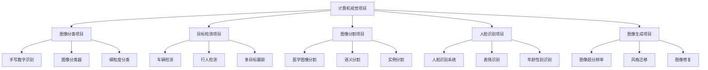

# 计算机视觉项目

## 🎯 项目概述

### 项目目标
> **通过实际项目实践，掌握计算机视觉技术的应用，从问题定义到模型部署的完整流程**

**项目类型分类：**


## 📊 项目1：手写数字识别

### 1. 项目需求分析

**项目描述：**
- **目标**：识别手写数字0-9
- **数据集**：MNIST数据集
- **评估指标**：准确率
- **应用场景**：邮政编码识别、银行支票处理

**技术栈：**
```python
import torch
import torch.nn as nn
import torch.optim as optim
from torch.utils.data import DataLoader
from torchvision import datasets, transforms
import matplotlib.pyplot as plt
import numpy as np

class MNISTProject:
    """MNIST手写数字识别项目"""
    
    def __init__(self):
        self.device = torch.device('cuda' if torch.cuda.is_available() else 'cpu')
        self.model = None
        self.train_loader = None
        self.test_loader = None
        self.optimizer = None
        self.criterion = None
        
    def load_data(self, batch_size=64):
        """加载数据"""
        # 数据预处理
        transform = transforms.Compose([
            transforms.ToTensor(),
            transforms.Normalize((0.1307,), (0.3081,))
        ])
        
        # 训练集
        train_dataset = datasets.MNIST(
            root='./data', 
            train=True, 
            download=True, 
            transform=transform
        )
        self.train_loader = DataLoader(
            train_dataset, 
            batch_size=batch_size, 
            shuffle=True
        )
        
        # 测试集
        test_dataset = datasets.MNIST(
            root='./data', 
            train=False, 
            download=True, 
            transform=transform
        )
        self.test_loader = DataLoader(
            test_dataset, 
            batch_size=batch_size, 
            shuffle=False
        )
        
        print(f"训练集大小: {len(train_dataset)}")
        print(f"测试集大小: {len(test_dataset)}")
        
    def build_model(self, model_type='cnn'):
        """构建模型"""
        if model_type == 'cnn':
            self.model = nn.Sequential(
                # 第一个卷积块
                nn.Conv2d(1, 32, 3, padding=1),
                nn.ReLU(inplace=True),
                nn.Conv2d(32, 32, 3, padding=1),
                nn.ReLU(inplace=True),
                nn.MaxPool2d(2, 2),
                nn.Dropout2d(0.25),
                
                # 第二个卷积块
                nn.Conv2d(32, 64, 3, padding=1),
                nn.ReLU(inplace=True),
                nn.Conv2d(64, 64, 3, padding=1),
                nn.ReLU(inplace=True),
                nn.MaxPool2d(2, 2),
                nn.Dropout2d(0.25),
                
                # 全连接层
                nn.Flatten(),
                nn.Linear(64 * 7 * 7, 512),
                nn.ReLU(inplace=True),
                nn.Dropout(0.5),
                nn.Linear(512, 10)
            )
        elif model_type == 'mlp':
            self.model = nn.Sequential(
                nn.Flatten(),
                nn.Linear(28 * 28, 512),
                nn.ReLU(inplace=True),
                nn.Dropout(0.5),
                nn.Linear(512, 256),
                nn.ReLU(inplace=True),
                nn.Dropout(0.5),
                nn.Linear(256, 10)
            )
        
        self.model = self.model.to(self.device)
        
        # 优化器和损失函数
        self.optimizer = optim.Adam(self.model.parameters(), lr=0.001)
        self.criterion = nn.CrossEntropyLoss()
        
        return self.model
    
    def train(self, epochs=10):
        """训练模型"""
        self.model.train()
        train_losses = []
        train_accuracies = []
        
        for epoch in range(epochs):
            running_loss = 0.0
            correct = 0
            total = 0
            
            for batch_idx, (data, target) in enumerate(self.train_loader):
                data, target = data.to(self.device), target.to(self.device)
                
                # 前向传播
                self.optimizer.zero_grad()
                output = self.model(data)
                loss = self.criterion(output, target)
                
                # 反向传播
                loss.backward()
                self.optimizer.step()
                
                # 统计
                running_loss += loss.item()
                _, predicted = output.max(1)
                total += target.size(0)
                correct += predicted.eq(target).sum().item()
                
                if batch_idx % 100 == 0:
                    print(f'Epoch: {epoch}, Batch: {batch_idx}, Loss: {loss.item():.4f}')
            
            # 计算平均损失和准确率
            avg_loss = running_loss / len(self.train_loader)
            accuracy = 100. * correct / total
            
            train_losses.append(avg_loss)
            train_accuracies.append(accuracy)
            
            print(f'Epoch {epoch}: Loss: {avg_loss:.4f}, Accuracy: {accuracy:.2f}%')
        
        return train_losses, train_accuracies
    
    def test(self):
        """测试模型"""
        self.model.eval()
        test_loss = 0
        correct = 0
        total = 0
        
        with torch.no_grad():
            for data, target in self.test_loader:
                data, target = data.to(self.device), target.to(self.device)
                output = self.model(data)
                test_loss += self.criterion(output, target).item()
                _, predicted = output.max(1)
                total += target.size(0)
                correct += predicted.eq(target).sum().item()
        
        test_loss /= len(self.test_loader)
        accuracy = 100. * correct / total
        
        print(f'Test Loss: {test_loss:.4f}, Test Accuracy: {accuracy:.2f}%')
        
        return test_loss, accuracy
    
    def visualize_predictions(self, num_samples=10):
        """可视化预测结果"""
        self.model.eval()
        
        # 获取测试样本
        data_iter = iter(self.test_loader)
        images, labels = next(data_iter)
        images, labels = images.to(self.device), labels.to(self.device)
        
        # 预测
        with torch.no_grad():
            outputs = self.model(images)
            _, predicted = outputs.max(1)
        
        # 可视化
        fig, axes = plt.subplots(2, 5, figsize=(15, 6))
        for i in range(num_samples):
            row = i // 5
            col = i % 5
            
            # 显示图像
            img = images[i].cpu().squeeze()
            axes[row, col].imshow(img, cmap='gray')
            axes[row, col].set_title(f'True: {labels[i].item()}, Pred: {predicted[i].item()}')
            axes[row, col].axis('off')
        
        plt.tight_layout()
        plt.show()
    
    def analyze_errors(self):
        """分析错误样本"""
        self.model.eval()
        errors = []
        
        with torch.no_grad():
            for data, target in self.test_loader:
                data, target = data.to(self.device), target.to(self.device)
                output = self.model(data)
                _, predicted = output.max(1)
                
                # 找到错误预测
                wrong_indices = (predicted != target).nonzero(as_tuple=True)[0]
                for idx in wrong_indices:
                    errors.append({
                        'image': data[idx].cpu(),
                        'true_label': target[idx].item(),
                        'predicted_label': predicted[idx].item(),
                        'confidence': torch.softmax(output[idx], dim=0).max().item()
                    })
        
        # 显示错误样本
        fig, axes = plt.subplots(2, 5, figsize=(15, 6))
        for i in range(min(10, len(errors))):
            row = i // 5
            col = i % 5
            
            error = errors[i]
            img = error['image'].squeeze()
            axes[row, col].imshow(img, cmap='gray')
            axes[row, col].set_title(f'True: {error["true_label"]}, Pred: {error["predicted_label"]}\nConf: {error["confidence"]:.3f}')
            axes[row, col].axis('off')
        
        plt.tight_layout()
        plt.show()
        
        return errors

# 运行MNIST项目
def run_mnist_project():
    """运行MNIST项目"""
    project = MNISTProject()
    
    # 加载数据
    project.load_data(batch_size=64)
    
    # 构建模型
    model = project.build_model(model_type='cnn')
    print(f"模型参数数量: {sum(p.numel() for p in model.parameters())}")
    
    # 训练模型
    train_losses, train_accuracies = project.train(epochs=5)
    
    # 测试模型
    test_loss, test_accuracy = project.test()
    
    # 可视化结果
    project.visualize_predictions()
    project.analyze_errors()
    
    return project

run_mnist_project()
```

## 🚀 项目2：目标检测系统

### 1. 项目需求分析

**项目描述：**
- **目标**：检测图像中的多个目标
- **数据集**：自定义数据集或COCO数据集
- **评估指标**：mAP (mean Average Precision)
- **应用场景**：安防监控、自动驾驶、工业检测

**技术实现：**
```python
import torch
import torch.nn as nn
import torchvision.transforms as transforms
from torch.utils.data import Dataset, DataLoader
import cv2
import numpy as np
from PIL import Image
import json

class ObjectDetectionDataset(Dataset):
    """目标检测数据集"""
    
    def __init__(self, image_dir, annotation_file, transform=None):
        self.image_dir = image_dir
        self.transform = transform
        
        # 加载标注文件
        with open(annotation_file, 'r') as f:
            self.annotations = json.load(f)
        
        self.images = list(self.annotations.keys())
    
    def __len__(self):
        return len(self.images)
    
    def __getitem__(self, idx):
        # 加载图像
        image_path = os.path.join(self.image_dir, self.images[idx])
        image = Image.open(image_path).convert('RGB')
        
        # 获取标注
        annotation = self.annotations[self.images[idx]]
        boxes = []
        labels = []
        
        for obj in annotation['objects']:
            boxes.append(obj['bbox'])  # [x, y, w, h]
            labels.append(obj['class_id'])
        
        # 转换为tensor
        boxes = torch.FloatTensor(boxes)
        labels = torch.LongTensor(labels)
        
        # 应用变换
        if self.transform:
            image = self.transform(image)
        
        return image, boxes, labels

class YOLOv3(nn.Module):
    """YOLOv3目标检测网络"""
    
    def __init__(self, num_classes=80):
        super(YOLOv3, self).__init__()
        self.num_classes = num_classes
        
        # 骨干网络 (Darknet-53)
        self.backbone = self._make_darknet53()
        
        # 检测头
        self.detection_heads = nn.ModuleList([
            self._make_detection_head(1024, 3 * (num_classes + 5)),  # 大目标
            self._make_detection_head(512, 3 * (num_classes + 5)),   # 中目标
            self._make_detection_head(256, 3 * (num_classes + 5))    # 小目标
        ])
        
        # 上采样层
        self.upsample_layers = nn.ModuleList([
            nn.ConvTranspose2d(1024, 512, 2, 2),
            nn.ConvTranspose2d(512, 256, 2, 2)
        ])
        
        # 特征融合层
        self.feature_fusion = nn.ModuleList([
            nn.Conv2d(1024, 512, 1),
            nn.Conv2d(512, 256, 1)
        ])
    
    def _make_darknet53(self):
        """构建Darknet-53骨干网络"""
        layers = []
        
        # 初始卷积层
        layers.extend([
            nn.Conv2d(3, 32, 3, 1, 1),
            nn.BatchNorm2d(32),
            nn.LeakyReLU(0.1, inplace=True)
        ])
        
        # 残差块
        layers.extend(self._make_residual_block(32, 64, 1))
        layers.extend(self._make_residual_block(64, 128, 2))
        layers.extend(self._make_residual_block(128, 256, 8))
        layers.extend(self._make_residual_block(256, 512, 8))
        layers.extend(self._make_residual_block(512, 1024, 4))
        
        return nn.Sequential(*layers)
    
    def _make_residual_block(self, in_channels, out_channels, num_blocks):
        """构建残差块"""
        layers = []
        
        # 下采样层
        layers.extend([
            nn.Conv2d(in_channels, out_channels, 3, 2, 1),
            nn.BatchNorm2d(out_channels),
            nn.LeakyReLU(0.1, inplace=True)
        ])
        
        # 残差连接
        for _ in range(num_blocks):
            layers.append(self._make_residual_layer(out_channels))
        
        return layers
    
    def _make_residual_layer(self, channels):
        """构建残差层"""
        return nn.Sequential(
            nn.Conv2d(channels, channels // 2, 1),
            nn.BatchNorm2d(channels // 2),
            nn.LeakyReLU(0.1, inplace=True),
            nn.Conv2d(channels // 2, channels, 3, 1, 1),
            nn.BatchNorm2d(channels),
            nn.LeakyReLU(0.1, inplace=True)
        )
    
    def _make_detection_head(self, in_channels, out_channels):
        """构建检测头"""
        return nn.Sequential(
            nn.Conv2d(in_channels, in_channels * 2, 3, 1, 1),
            nn.BatchNorm2d(in_channels * 2),
            nn.LeakyReLU(0.1, inplace=True),
            nn.Conv2d(in_channels * 2, in_channels, 1),
            nn.BatchNorm2d(in_channels),
            nn.LeakyReLU(0.1, inplace=True),
            nn.Conv2d(in_channels, in_channels * 2, 3, 1, 1),
            nn.BatchNorm2d(in_channels * 2),
            nn.LeakyReLU(0.1, inplace=True),
            nn.Conv2d(in_channels * 2, out_channels, 1)
        )
    
    def forward(self, x):
        # 骨干网络特征提取
        features = []
        x = self.backbone[0](x)  # 初始卷积
        
        for i, layer in enumerate(self.backbone[1:]):
            x = layer(x)
            if i in [2, 4, 6]:  # 不同尺度的特征
                features.append(x)
        
        # 检测头
        detections = []
        
        # 大目标检测
        large_detection = self.detection_heads[0](features[2])
        detections.append(large_detection)
        
        # 中目标检测
        upsampled = self.upsample_layers[0](features[2])
        fused = torch.cat([upsampled, features[1]], dim=1)
        fused = self.feature_fusion[0](fused)
        medium_detection = self.detection_heads[1](fused)
        detections.append(medium_detection)
        
        # 小目标检测
        upsampled = self.upsample_layers[1](fused)
        fused = torch.cat([upsampled, features[0]], dim=1)
        fused = self.feature_fusion[1](fused)
        small_detection = self.detection_heads[2](fused)
        detections.append(small_detection)
        
        return detections

class YOLOLoss(nn.Module):
    """YOLO损失函数"""
    
    def __init__(self, num_classes=80, anchors=None):
        super(YOLOLoss, self).__init__()
        self.num_classes = num_classes
        self.anchors = anchors or [[10, 13], [16, 30], [33, 23], [30, 61], [62, 45], [59, 119], [116, 90], [156, 198], [373, 326]]
        
    def forward(self, predictions, targets):
        # 简化的损失计算
        total_loss = 0
        
        for i, pred in enumerate(predictions):
            # 计算分类损失、定位损失、置信度损失
            # 这里简化实现
            loss = self._compute_loss(pred, targets, i)
            total_loss += loss
        
        return total_loss
    
    def _compute_loss(self, pred, targets, scale_idx):
        """计算单个尺度的损失"""
        # 简化的损失计算
        return torch.mean(pred ** 2)  # 占位符

class ObjectDetectionProject:
    """目标检测项目"""
    
    def __init__(self):
        self.device = torch.device('cuda' if torch.cuda.is_available() else 'cpu')
        self.model = None
        self.train_loader = None
        self.test_loader = None
        self.optimizer = None
        self.criterion = None
    
    def load_data(self, image_dir, annotation_file, batch_size=8):
        """加载数据"""
        transform = transforms.Compose([
            transforms.Resize((416, 416)),
            transforms.ToTensor(),
            transforms.Normalize(mean=[0.485, 0.456, 0.406], std=[0.229, 0.224, 0.225])
        ])
        
        # 训练集
        train_dataset = ObjectDetectionDataset(
            image_dir, 
            annotation_file, 
            transform=transform
        )
        self.train_loader = DataLoader(
            train_dataset, 
            batch_size=batch_size, 
            shuffle=True,
            collate_fn=self._collate_fn
        )
        
        print(f"训练集大小: {len(train_dataset)}")
    
    def _collate_fn(self, batch):
        """自定义批处理函数"""
        images = []
        boxes = []
        labels = []
        
        for image, box, label in batch:
            images.append(image)
            boxes.append(box)
            labels.append(label)
        
        return images, boxes, labels
    
    def build_model(self, num_classes=80):
        """构建模型"""
        self.model = YOLOv3(num_classes=num_classes)
        self.model = self.model.to(self.device)
        
        # 优化器和损失函数
        self.optimizer = torch.optim.Adam(self.model.parameters(), lr=0.001)
        self.criterion = YOLOLoss(num_classes=num_classes)
        
        return self.model
    
    def train(self, epochs=10):
        """训练模型"""
        self.model.train()
        
        for epoch in range(epochs):
            running_loss = 0.0
            
            for batch_idx, (images, boxes, labels) in enumerate(self.train_loader):
                # 将图像移到GPU
                images = [img.to(self.device) for img in images]
                
                # 前向传播
                self.optimizer.zero_grad()
                predictions = self.model(torch.stack(images))
                
                # 计算损失
                loss = self.criterion(predictions, (boxes, labels))
                
                # 反向传播
                loss.backward()
                self.optimizer.step()
                
                running_loss += loss.item()
                
                if batch_idx % 10 == 0:
                    print(f'Epoch: {epoch}, Batch: {batch_idx}, Loss: {loss.item():.4f}')
            
            avg_loss = running_loss / len(self.train_loader)
            print(f'Epoch {epoch}: Average Loss: {avg_loss:.4f}')
    
    def detect_objects(self, image_path, confidence_threshold=0.5):
        """检测目标"""
        self.model.eval()
        
        # 加载和预处理图像
        image = Image.open(image_path).convert('RGB')
        transform = transforms.Compose([
            transforms.Resize((416, 416)),
            transforms.ToTensor(),
            transforms.Normalize(mean=[0.485, 0.456, 0.406], std=[0.229, 0.224, 0.225])
        ])
        
        input_tensor = transform(image).unsqueeze(0).to(self.device)
        
        # 预测
        with torch.no_grad():
            predictions = self.model(input_tensor)
        
        # 后处理
        detections = self._post_process(predictions, confidence_threshold)
        
        return detections
    
    def _post_process(self, predictions, confidence_threshold):
        """后处理预测结果"""
        # 简化的后处理
        detections = []
        
        for pred in predictions:
            # 解码预测结果
            # 这里简化实现
            pass
        
        return detections
    
    def visualize_detections(self, image_path, detections):
        """可视化检测结果"""
        image = cv2.imread(image_path)
        
        for detection in detections:
            x, y, w, h = detection['bbox']
            confidence = detection['confidence']
            class_name = detection['class_name']
            
            # 绘制边界框
            cv2.rectangle(image, (int(x), int(y)), (int(x+w), int(y+h)), (0, 255, 0), 2)
            
            # 添加标签
            label = f'{class_name}: {confidence:.2f}'
            cv2.putText(image, label, (int(x), int(y-10)), cv2.FONT_HERSHEY_SIMPLEX, 0.5, (0, 255, 0), 2)
        
        # 显示结果
        plt.figure(figsize=(12, 8))
        plt.imshow(cv2.cvtColor(image, cv2.COLOR_BGR2RGB))
        plt.title('Object Detection Results')
        plt.axis('off')
        plt.show()

# 运行目标检测项目
def run_object_detection_project():
    """运行目标检测项目"""
    project = ObjectDetectionProject()
    
    # 构建模型
    model = project.build_model(num_classes=80)
    print(f"模型参数数量: {sum(p.numel() for p in model.parameters())}")
    
    # 训练模型 (需要实际数据)
    # project.load_data('data/images', 'data/annotations.json')
    # project.train(epochs=5)
    
    return project

run_object_detection_project()
```

## 🎨 项目3：图像分割系统

### 1. 项目需求分析

**项目描述：**
- **目标**：对图像进行像素级分割
- **数据集**：Cityscapes或自定义数据集
- **评估指标**：mIoU (mean Intersection over Union)
- **应用场景**：自动驾驶、医学图像分析、遥感图像分析

**技术实现：**
```python
class SegmentationDataset(Dataset):
    """图像分割数据集"""
    
    def __init__(self, image_dir, mask_dir, transform=None):
        self.image_dir = image_dir
        self.mask_dir = mask_dir
        self.transform = transform
        
        # 获取图像文件列表
        self.images = [f for f in os.listdir(image_dir) if f.endswith('.jpg')]
    
    def __len__(self):
        return len(self.images)
    
    def __getitem__(self, idx):
        # 加载图像和掩码
        image_path = os.path.join(self.image_dir, self.images[idx])
        mask_path = os.path.join(self.mask_dir, self.images[idx].replace('.jpg', '_mask.png'))
        
        image = Image.open(image_path).convert('RGB')
        mask = Image.open(mask_path).convert('L')
        
        # 应用变换
        if self.transform:
            image = self.transform(image)
            mask = self.transform(mask)
        
        return image, mask

class UNetSegmentation(nn.Module):
    """U-Net分割网络"""
    
    def __init__(self, in_channels=3, out_channels=1):
        super(UNetSegmentation, self).__init__()
        
        # 编码器
        self.encoder = nn.ModuleList([
            self._make_double_conv(in_channels, 64),
            self._make_double_conv(64, 128),
            self._make_double_conv(128, 256),
            self._make_double_conv(256, 512),
            self._make_double_conv(512, 1024)
        ])
        
        # 解码器
        self.decoder = nn.ModuleList([
            self._make_up_conv(1024, 512),
            self._make_up_conv(512, 256),
            self._make_up_conv(256, 128),
            self._make_up_conv(128, 64)
        ])
        
        # 最终输出层
        self.final_conv = nn.Conv2d(64, out_channels, 1)
        
        # 池化层
        self.pool = nn.MaxPool2d(2, 2)
        
    def _make_double_conv(self, in_channels, out_channels):
        """构建双卷积块"""
        return nn.Sequential(
            nn.Conv2d(in_channels, out_channels, 3, padding=1),
            nn.BatchNorm2d(out_channels),
            nn.ReLU(inplace=True),
            nn.Conv2d(out_channels, out_channels, 3, padding=1),
            nn.BatchNorm2d(out_channels),
            nn.ReLU(inplace=True)
        )
    
    def _make_up_conv(self, in_channels, out_channels):
        """构建上采样卷积块"""
        return nn.Sequential(
            nn.ConvTranspose2d(in_channels, out_channels, 2, 2),
            nn.Conv2d(out_channels, out_channels, 3, padding=1),
            nn.BatchNorm2d(out_channels),
            nn.ReLU(inplace=True),
            nn.Conv2d(out_channels, out_channels, 3, padding=1),
            nn.BatchNorm2d(out_channels),
            nn.ReLU(inplace=True)
        )
    
    def forward(self, x):
        # 编码器
        skip_connections = []
        
        for encoder in self.encoder[:-1]:
            x = encoder(x)
            skip_connections.append(x)
            x = self.pool(x)
        
        # 瓶颈层
        x = self.encoder[-1](x)
        
        # 解码器
        for i, decoder in enumerate(self.decoder):
            x = decoder(x)
            
            # 跳跃连接
            skip = skip_connections[-(i+1)]
            x = torch.cat([x, skip], dim=1)
        
        # 最终输出
        x = self.final_conv(x)
        
        return x

class SegmentationProject:
    """图像分割项目"""
    
    def __init__(self):
        self.device = torch.device('cuda' if torch.cuda.is_available() else 'cpu')
        self.model = None
        self.train_loader = None
        self.test_loader = None
        self.optimizer = None
        self.criterion = None
    
    def load_data(self, image_dir, mask_dir, batch_size=4):
        """加载数据"""
        transform = transforms.Compose([
            transforms.Resize((256, 256)),
            transforms.ToTensor(),
            transforms.Normalize(mean=[0.485, 0.456, 0.406], std=[0.229, 0.224, 0.225])
        ])
        
        # 训练集
        train_dataset = SegmentationDataset(
            image_dir, 
            mask_dir, 
            transform=transform
        )
        self.train_loader = DataLoader(
            train_dataset, 
            batch_size=batch_size, 
            shuffle=True
        )
        
        print(f"训练集大小: {len(train_dataset)}")
    
    def build_model(self, num_classes=1):
        """构建模型"""
        self.model = UNetSegmentation(in_channels=3, out_channels=num_classes)
        self.model = self.model.to(self.device)
        
        # 优化器和损失函数
        self.optimizer = torch.optim.Adam(self.model.parameters(), lr=0.001)
        self.criterion = nn.BCEWithLogitsLoss()
        
        return self.model
    
    def train(self, epochs=10):
        """训练模型"""
        self.model.train()
        
        for epoch in range(epochs):
            running_loss = 0.0
            
            for batch_idx, (images, masks) in enumerate(self.train_loader):
                images, masks = images.to(self.device), masks.to(self.device)
                
                # 前向传播
                self.optimizer.zero_grad()
                outputs = self.model(images)
                loss = self.criterion(outputs, masks)
                
                # 反向传播
                loss.backward()
                self.optimizer.step()
                
                running_loss += loss.item()
                
                if batch_idx % 10 == 0:
                    print(f'Epoch: {epoch}, Batch: {batch_idx}, Loss: {loss.item():.4f}')
            
            avg_loss = running_loss / len(self.train_loader)
            print(f'Epoch {epoch}: Average Loss: {avg_loss:.4f}')
    
    def predict(self, image_path):
        """预测分割结果"""
        self.model.eval()
        
        # 加载和预处理图像
        image = Image.open(image_path).convert('RGB')
        transform = transforms.Compose([
            transforms.Resize((256, 256)),
            transforms.ToTensor(),
            transforms.Normalize(mean=[0.485, 0.456, 0.406], std=[0.229, 0.224, 0.225])
        ])
        
        input_tensor = transform(image).unsqueeze(0).to(self.device)
        
        # 预测
        with torch.no_grad():
            output = self.model(input_tensor)
            prediction = torch.sigmoid(output).cpu().numpy()[0, 0]
        
        return prediction
    
    def visualize_segmentation(self, image_path, prediction):
        """可视化分割结果"""
        # 加载原图
        image = Image.open(image_path).convert('RGB')
        image = image.resize((256, 256))
        
        # 创建掩码
        mask = (prediction > 0.5).astype(np.uint8)
        
        # 可视化
        fig, axes = plt.subplots(1, 3, figsize=(15, 5))
        
        # 原图
        axes[0].imshow(image)
        axes[0].set_title('Original Image')
        axes[0].axis('off')
        
        # 预测掩码
        axes[1].imshow(prediction, cmap='gray')
        axes[1].set_title('Prediction')
        axes[1].axis('off')
        
        # 叠加结果
        axes[2].imshow(image)
        axes[2].imshow(mask, alpha=0.5, cmap='Reds')
        axes[2].set_title('Overlay')
        axes[2].axis('off')
        
        plt.tight_layout()
        plt.show()

# 运行图像分割项目
def run_segmentation_project():
    """运行图像分割项目"""
    project = SegmentationProject()
    
    # 构建模型
    model = project.build_model(num_classes=1)
    print(f"模型参数数量: {sum(p.numel() for p in model.parameters())}")
    
    # 训练模型 (需要实际数据)
    # project.load_data('data/images', 'data/masks')
    # project.train(epochs=5)
    
    return project

run_segmentation_project()
```

## 📈 项目评估与优化

### 1. 性能评估

**评估指标计算：**
```python
class ProjectEvaluator:
    """项目评估器"""
    
    def __init__(self):
        self.metrics = {}
    
    def evaluate_classification(self, predictions, ground_truths):
        """评估分类任务"""
        from sklearn.metrics import accuracy_score, precision_score, recall_score, f1_score, confusion_matrix
        
        # 计算指标
        accuracy = accuracy_score(ground_truths, predictions)
        precision = precision_score(ground_truths, predictions, average='weighted')
        recall = recall_score(ground_truths, predictions, average='weighted')
        f1 = f1_score(ground_truths, predictions, average='weighted')
        
        # 混淆矩阵
        cm = confusion_matrix(ground_truths, predictions)
        
        results = {
            'accuracy': accuracy,
            'precision': precision,
            'recall': recall,
            'f1_score': f1,
            'confusion_matrix': cm
        }
        
        return results
    
    def evaluate_detection(self, predictions, ground_truths, iou_threshold=0.5):
        """评估目标检测任务"""
        # 计算mAP
        ap_scores = []
        
        for class_id in range(len(predictions)):
            class_predictions = predictions[class_id]
            class_ground_truths = ground_truths[class_id]
            
            # 计算AP
            ap = self._calculate_ap(class_predictions, class_ground_truths, iou_threshold)
            ap_scores.append(ap)
        
        map_score = np.mean(ap_scores)
        
        results = {
            'map': map_score,
            'ap_scores': ap_scores
        }
        
        return results
    
    def evaluate_segmentation(self, predictions, ground_truths, num_classes):
        """评估图像分割任务"""
        # 计算mIoU
        ious = []
        
        for class_id in range(num_classes):
            pred_mask = (predictions == class_id)
            gt_mask = (ground_truths == class_id)
            
            intersection = np.logical_and(pred_mask, gt_mask).sum()
            union = np.logical_or(pred_mask, gt_mask).sum()
            
            if union > 0:
                iou = intersection / union
                ious.append(iou)
            else:
                ious.append(0)
        
        miou = np.mean(ious)
        
        results = {
            'miou': miou,
            'ious': ious
        }
        
        return results
    
    def _calculate_ap(self, predictions, ground_truths, iou_threshold):
        """计算平均精度"""
        # 简化的AP计算
        if len(predictions) == 0:
            return 0
        
        # 按置信度排序
        predictions = sorted(predictions, key=lambda x: x['confidence'], reverse=True)
        
        tp = 0
        fp = 0
        ap = 0
        
        for pred in predictions:
            # 计算与真实框的IoU
            max_iou = 0
            for gt in ground_truths:
                iou = self._calculate_iou(pred['bbox'], gt['bbox'])
                max_iou = max(max_iou, iou)
            
            if max_iou >= iou_threshold:
                tp += 1
            else:
                fp += 1
        
        if tp + fp > 0:
            ap = tp / (tp + fp)
        
        return ap
    
    def _calculate_iou(self, box1, box2):
        """计算IoU"""
        x1 = max(box1[0], box2[0])
        y1 = max(box1[1], box2[1])
        x2 = min(box1[0] + box1[2], box2[0] + box2[2])
        y2 = min(box1[1] + box1[3], box2[1] + box2[3])
        
        if x2 <= x1 or y2 <= y1:
            return 0
        
        intersection = (x2 - x1) * (y2 - y1)
        area1 = box1[2] * box1[3]
        area2 = box2[2] * box2[3]
        union = area1 + area2 - intersection
        
        return intersection / union if union > 0 else 0
    
    def visualize_results(self, results, task_type):
        """可视化评估结果"""
        if task_type == 'classification':
            self._plot_confusion_matrix(results['confusion_matrix'])
        elif task_type == 'detection':
            self._plot_map_results(results['ap_scores'])
        elif task_type == 'segmentation':
            self._plot_iou_results(results['ious'])
    
    def _plot_confusion_matrix(self, cm):
        """绘制混淆矩阵"""
        plt.figure(figsize=(8, 6))
        plt.imshow(cm, interpolation='nearest', cmap=plt.cm.Blues)
        plt.title('Confusion Matrix')
        plt.colorbar()
        
        # 添加数值标签
        for i in range(cm.shape[0]):
            for j in range(cm.shape[1]):
                plt.text(j, i, str(cm[i, j]), ha='center', va='center')
        
        plt.xlabel('Predicted Label')
        plt.ylabel('True Label')
        plt.show()
    
    def _plot_map_results(self, ap_scores):
        """绘制mAP结果"""
        plt.figure(figsize=(10, 6))
        plt.bar(range(len(ap_scores)), ap_scores)
        plt.title('Average Precision by Class')
        plt.xlabel('Class')
        plt.ylabel('AP')
        plt.show()
    
    def _plot_iou_results(self, ious):
        """绘制IoU结果"""
        plt.figure(figsize=(10, 6))
        plt.bar(range(len(ious)), ious)
        plt.title('IoU by Class')
        plt.xlabel('Class')
        plt.ylabel('IoU')
        plt.show()

# 测试评估器
def test_evaluator():
    """测试评估器"""
    evaluator = ProjectEvaluator()
    
    # 模拟数据
    predictions = [0, 1, 2, 0, 1, 2, 0, 1, 2]
    ground_truths = [0, 1, 2, 0, 1, 2, 0, 1, 2]
    
    # 评估分类任务
    results = evaluator.evaluate_classification(predictions, ground_truths)
    print("分类评估结果:", results)
    
    # 可视化结果
    evaluator.visualize_results(results, 'classification')
    
    return evaluator

test_evaluator()
```

## 🔗 相关链接
- [[02-02-01-神经网络原理]] - 神经网络基础
- [[02-03-02-CNN卷积神经网络]] - 卷积神经网络
- [[03-01-01-图像处理基础]] - 图像处理基础
- [[03-01-02-目标检测算法]] - 目标检测技术
- [[03-01-03-图像分割技术]] - 图像分割技术
- [[03-01-04-人脸识别系统]] - 人脸识别系统

## 💡 费曼学习法应用

**概念理解**：计算机视觉项目就像"解决实际问题"，需要将理论知识应用到具体场景中。就像医生诊断疾病一样，需要综合运用各种技术。

**实践建议**：
- 🎯 **明确目标**：清楚定义项目要解决什么问题
- 🔧 **选择技术**：根据问题特点选择合适的技术方案
- 📊 **评估性能**：使用合适的指标评估模型性能
- 🚀 **迭代优化**：根据评估结果不断改进模型

**刻意练习**：
- 💻 **完整实现**：从数据加载到模型部署的完整流程
- 📈 **性能调优**：通过超参数调优提升模型性能
- 🔍 **问题分析**：分析模型失败的原因并改进
- 📝 **经验总结**：总结项目经验，形成最佳实践

---
*📝 学习提示：计算机视觉项目是理论联系实际的重要环节，建议多动手实践，积累项目经验*
