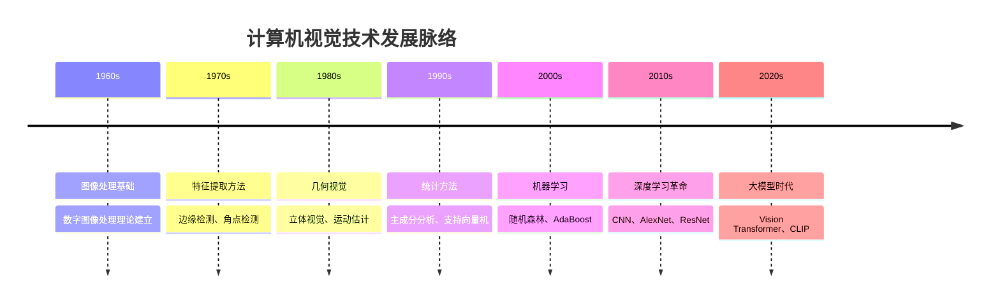

# CV技术发展脉络

## 🎯 发展概述

### 计算机视觉发展历程
> **计算机视觉从简单的图像处理发展到今天的深度学习时代，经历了多个重要阶段**

**发展时间线：**


## 📊 传统计算机视觉时代

### 1. 早期图像处理（1960s-1970s）

**理论基础建立：**
```python
import numpy as np
import matplotlib.pyplot as plt
from scipy import ndimage
from skimage import filters, feature, morphology

class EarlyImageProcessing:
    """早期图像处理技术"""
    
    def __init__(self):
        self.techniques = {
            'histogram_equalization': '直方图均衡化',
            'edge_detection': '边缘检测',
            'morphological_operations': '形态学操作',
            'template_matching': '模板匹配'
        }
    
    def histogram_equalization(self, image):
        """直方图均衡化 - 1960s"""
        # 计算直方图
        hist, bins = np.histogram(image.flatten(), 256, [0, 256])
        
        # 计算累积分布函数
        cdf = hist.cumsum()
        cdf_normalized = cdf * hist.max() / cdf.max()
        
        # 映射
        equalized = np.interp(image.flatten(), bins[:-1], cdf_normalized)
        equalized = equalized.reshape(image.shape).astype(np.uint8)
        
        return equalized
    
    def sobel_edge_detection(self, image):
        """Sobel边缘检测 - 1970s"""
        # Sobel算子
        sobel_x = np.array([[-1, 0, 1], [-2, 0, 2], [-1, 0, 1]])
        sobel_y = np.array([[-1, -2, -1], [0, 0, 0], [1, 2, 1]])
        
        # 卷积
        edges_x = ndimage.convolve(image, sobel_x)
        edges_y = ndimage.convolve(image, sobel_y)
        
        # 梯度幅值
        magnitude = np.sqrt(edges_x**2 + edges_y**2)
        
        return magnitude
    
    def morphological_operations(self, image):
        """形态学操作 - 1970s"""
        # 结构元素
        selem = morphology.disk(3)
        
        # 开运算
        opened = morphology.opening(image, selem)
        
        # 闭运算
        closed = morphology.closing(image, selem)
        
        # 腐蚀
        eroded = morphology.erosion(image, selem)
        
        # 膨胀
        dilated = morphology.dilation(image, selem)
        
        return opened, closed, eroded, dilated
    
    def template_matching(self, image, template):
        """模板匹配 - 1970s"""
        from scipy.signal import correlate2d
        
        # 归一化互相关
        correlation = correlate2d(image, template, mode='valid')
        
        # 找到最佳匹配位置
        max_loc = np.unravel_index(np.argmax(correlation), correlation.shape)
        
        return correlation, max_loc
    
    def visualize_early_techniques(self, image):
        """可视化早期技术"""
        fig, axes = plt.subplots(2, 3, figsize=(15, 10))
        
        # 原图
        axes[0, 0].imshow(image, cmap='gray')
        axes[0, 0].set_title('Original Image')
        axes[0, 0].axis('off')
        
        # 直方图均衡化
        equalized = self.histogram_equalization(image)
        axes[0, 1].imshow(equalized, cmap='gray')
        axes[0, 1].set_title('Histogram Equalization')
        axes[0, 1].axis('off')
        
        # Sobel边缘检测
        edges = self.sobel_edge_detection(image)
        axes[0, 2].imshow(edges, cmap='gray')
        axes[0, 2].set_title('Sobel Edge Detection')
        axes[0, 2].axis('off')
        
        # 形态学操作
        opened, closed, eroded, dilated = self.morphological_operations(image)
        axes[1, 0].imshow(opened, cmap='gray')
        axes[1, 0].set_title('Opening')
        axes[1, 0].axis('off')
        
        axes[1, 1].imshow(closed, cmap='gray')
        axes[1, 1].set_title('Closing')
        axes[1, 1].axis('off')
        
        axes[1, 2].imshow(eroded, cmap='gray')
        axes[1, 2].set_title('Erosion')
        axes[1, 2].axis('off')
        
        plt.tight_layout()
        plt.show()

# 测试早期图像处理
def test_early_processing():
    """测试早期图像处理技术"""
    eip = EarlyImageProcessing()
    
    # 创建测试图像
    test_image = np.random.randint(0, 256, (200, 200), dtype=np.uint8)
    
    # 可视化结果
    eip.visualize_early_techniques(test_image)
    
    return eip

test_early_processing()
```

### 2. 特征提取方法（1980s-1990s）

**经典特征提取器：**
```python
from skimage.feature import hog, local_binary_pattern, corner_harris, corner_peaks
from sklearn.decomposition import PCA
from sklearn.discriminant_analysis import LinearDiscriminantAnalysis

class FeatureExtractionMethods:
    """特征提取方法"""
    
    def __init__(self):
        self.feature_types = {
            'hog': '方向梯度直方图',
            'lbp': '局部二值模式',
            'sift': '尺度不变特征变换',
            'surf': '加速鲁棒特征',
            'orb': '定向FAST和旋转BRIEF'
        }
    
    def extract_hog_features(self, image, orientations=9, pixels_per_cell=(8, 8), cells_per_block=(2, 2)):
        """HOG特征提取 - 2005"""
        features = hog(image, orientations=orientations, 
                      pixels_per_cell=pixels_per_cell,
                      cells_per_block=cells_per_block,
                      visualize=False)
        return features
    
    def extract_lbp_features(self, image, radius=1, n_points=8):
        """LBP特征提取 - 1996"""
        lbp = local_binary_pattern(image, n_points, radius, method='uniform')
        hist, _ = np.histogram(lbp.ravel(), bins=n_points + 2, range=(0, n_points + 2))
        hist = hist.astype(float)
        hist /= (hist.sum() + 1e-7)
        return hist
    
    def extract_harris_corners(self, image, threshold=0.01):
        """Harris角点检测 - 1988"""
        # 计算Harris响应
        harris_response = corner_harris(image, method='k', k=0.05)
        
        # 检测角点
        corners = corner_peaks(harris_response, threshold=threshold, min_distance=5)
        
        return corners, harris_response
    
    def extract_sift_features(self, image):
        """SIFT特征提取 - 1999"""
        # 简化的SIFT实现
        from skimage.feature import peak_local_maxima
        
        # 构建尺度空间
        scales = [1.0, 1.5, 2.0, 2.5, 3.0]
        keypoints = []
        
        for scale in scales:
            # 高斯模糊
            blurred = ndimage.gaussian_filter(image, sigma=scale)
            
            # 检测局部极值
            peaks = peak_local_maxima(blurred, min_distance=5, threshold_abs=0.1)
            
            for peak in zip(peaks[0], peaks[1]):
                keypoints.append({
                    'x': peak[1],
                    'y': peak[0],
                    'scale': scale,
                    'response': blurred[peak[0], peak[1]]
                })
        
        return keypoints
    
    def pca_feature_reduction(self, features, n_components=50):
        """PCA特征降维 - 1901"""
        pca = PCA(n_components=n_components)
        reduced_features = pca.fit_transform(features)
        return reduced_features, pca
    
    def lda_feature_reduction(self, features, labels, n_components=10):
        """LDA特征降维 - 1936"""
        lda = LinearDiscriminantAnalysis(n_components=n_components)
        reduced_features = lda.fit_transform(features, labels)
        return reduced_features, lda
    
    def visualize_features(self, image):
        """可视化特征提取结果"""
        fig, axes = plt.subplots(2, 3, figsize=(15, 10))
        
        # 原图
        axes[0, 0].imshow(image, cmap='gray')
        axes[0, 0].set_title('Original Image')
        axes[0, 0].axis('off')
        
        # HOG特征可视化
        hog_features, hog_image = hog(image, orientations=9, pixels_per_cell=(8, 8),
                                     cells_per_block=(2, 2), visualize=True)
        axes[0, 1].imshow(hog_image, cmap='gray')
        axes[0, 1].set_title('HOG Features')
        axes[0, 1].axis('off')
        
        # LBP特征
        lbp = local_binary_pattern(image, 8, 1, method='uniform')
        axes[0, 2].imshow(lbp, cmap='gray')
        axes[0, 2].set_title('LBP Features')
        axes[0, 2].axis('off')
        
        # Harris角点
        corners, harris_response = self.extract_harris_corners(image)
        axes[1, 0].imshow(harris_response, cmap='gray')
        axes[1, 0].plot(corners[:, 1], corners[:, 0], 'r*', markersize=10)
        axes[1, 0].set_title('Harris Corners')
        axes[1, 0].axis('off')
        
        # SIFT特征点
        keypoints = self.extract_sift_features(image)
        axes[1, 1].imshow(image, cmap='gray')
        for kp in keypoints[:20]:  # 只显示前20个点
            axes[1, 1].plot(kp['x'], kp['y'], 'r*', markersize=5)
        axes[1, 1].set_title('SIFT Keypoints')
        axes[1, 1].axis('off')
        
        # 特征直方图
        lbp_hist = self.extract_lbp_features(image)
        axes[1, 2].bar(range(len(lbp_hist)), lbp_hist)
        axes[1, 2].set_title('LBP Histogram')
        axes[1, 2].set_xlabel('Bin')
        axes[1, 2].set_ylabel('Frequency')
        
        plt.tight_layout()
        plt.show()

# 测试特征提取方法
def test_feature_extraction():
    """测试特征提取方法"""
    fem = FeatureExtractionMethods()
    
    # 创建测试图像
    test_image = np.random.randint(0, 256, (200, 200), dtype=np.uint8)
    
    # 可视化结果
    fem.visualize_features(test_image)
    
    return fem

test_feature_extraction()
```

## 🚀 机器学习时代

### 1. 统计学习方法（1990s-2000s）

**经典机器学习算法：**
```python
from sklearn.svm import SVC
from sklearn.ensemble import RandomForestClassifier, AdaBoostClassifier
from sklearn.neighbors import KNeighborsClassifier
from sklearn.naive_bayes import GaussianNB
from sklearn.linear_model import LogisticRegression

class StatisticalLearningMethods:
    """统计学习方法"""
    
    def __init__(self):
        self.classifiers = {
            'svm': '支持向量机',
            'random_forest': '随机森林',
            'adaboost': 'AdaBoost',
            'knn': 'K近邻',
            'naive_bayes': '朴素贝叶斯',
            'logistic_regression': '逻辑回归'
        }
    
    def train_svm(self, X, y, kernel='rbf', C=1.0):
        """支持向量机 - 1995"""
        svm = SVC(kernel=kernel, C=C, probability=True)
        svm.fit(X, y)
        return svm
    
    def train_random_forest(self, X, y, n_estimators=100, max_depth=None):
        """随机森林 - 2001"""
        rf = RandomForestClassifier(n_estimators=n_estimators, max_depth=max_depth, random_state=42)
        rf.fit(X, y)
        return rf
    
    def train_adaboost(self, X, y, n_estimators=50, learning_rate=1.0):
        """AdaBoost - 1997"""
        ada = AdaBoostClassifier(n_estimators=n_estimators, learning_rate=learning_rate, random_state=42)
        ada.fit(X, y)
        return ada
    
    def train_knn(self, X, y, n_neighbors=5):
        """K近邻 - 1951"""
        knn = KNeighborsClassifier(n_neighbors=n_neighbors)
        knn.fit(X, y)
        return knn
    
    def train_naive_bayes(self, X, y):
        """朴素贝叶斯 - 1960s"""
        nb = GaussianNB()
        nb.fit(X, y)
        return nb
    
    def train_logistic_regression(self, X, y, C=1.0):
        """逻辑回归 - 1958"""
        lr = LogisticRegression(C=C, random_state=42)
        lr.fit(X, y)
        return lr
    
    def compare_classifiers(self, X_train, y_train, X_test, y_test):
        """比较不同分类器性能"""
        classifiers = {
            'SVM': self.train_svm(X_train, y_train),
            'Random Forest': self.train_random_forest(X_train, y_train),
            'AdaBoost': self.train_adaboost(X_train, y_train),
            'KNN': self.train_knn(X_train, y_train),
            'Naive Bayes': self.train_naive_bayes(X_train, y_train),
            'Logistic Regression': self.train_logistic_regression(X_train, y_train)
        }
        
        results = {}
        for name, classifier in classifiers.items():
            # 训练集准确率
            train_score = classifier.score(X_train, y_train)
            # 测试集准确率
            test_score = classifier.score(X_test, y_test)
            
            results[name] = {
                'train_accuracy': train_score,
                'test_accuracy': test_score,
                'overfitting': train_score - test_score
            }
        
        return results
    
    def visualize_classifier_comparison(self, results):
        """可视化分类器比较结果"""
        names = list(results.keys())
        train_scores = [results[name]['train_accuracy'] for name in names]
        test_scores = [results[name]['test_accuracy'] for name in names]
        
        x = np.arange(len(names))
        width = 0.35
        
        fig, ax = plt.subplots(figsize=(12, 6))
        bars1 = ax.bar(x - width/2, train_scores, width, label='Train Accuracy', alpha=0.8)
        bars2 = ax.bar(x + width/2, test_scores, width, label='Test Accuracy', alpha=0.8)
        
        ax.set_xlabel('Classifier')
        ax.set_ylabel('Accuracy')
        ax.set_title('Classifier Performance Comparison')
        ax.set_xticks(x)
        ax.set_xticklabels(names, rotation=45)
        ax.legend()
        
        # 添加数值标签
        for bar in bars1:
            height = bar.get_height()
            ax.annotate(f'{height:.3f}', xy=(bar.get_x() + bar.get_width() / 2, height),
                       xytext=(0, 3), textcoords="offset points", ha='center', va='bottom')
        
        for bar in bars2:
            height = bar.get_height()
            ax.annotate(f'{height:.3f}', xy=(bar.get_x() + bar.get_width() / 2, height),
                       xytext=(0, 3), textcoords="offset points", ha='center', va='bottom')
        
        plt.tight_layout()
        plt.show()

# 测试统计学习方法
def test_statistical_learning():
    """测试统计学习方法"""
    slm = StatisticalLearningMethods()
    
    # 创建模拟数据
    from sklearn.datasets import make_classification
    X, y = make_classification(n_samples=1000, n_features=20, n_informative=10, 
                              n_redundant=10, n_classes=3, random_state=42)
    
    # 分割数据
    from sklearn.model_selection import train_test_split
    X_train, X_test, y_train, y_test = train_test_split(X, y, test_size=0.2, random_state=42)
    
    # 比较分类器
    results = slm.compare_classifiers(X_train, y_train, X_test, y_test)
    
    # 可视化结果
    slm.visualize_classifier_comparison(results)
    
    return slm

test_statistical_learning()
```

### 2. 集成学习方法（2000s-2010s）

**集成学习技术：**
```python
from sklearn.ensemble import VotingClassifier, BaggingClassifier, GradientBoostingClassifier
from sklearn.model_selection import cross_val_score
import xgboost as xgb
import lightgbm as lgb

class EnsembleLearningMethods:
    """集成学习方法"""
    
    def __init__(self):
        self.ensemble_types = {
            'voting': '投票集成',
            'bagging': '装袋法',
            'boosting': '提升法',
            'stacking': '堆叠法'
        }
    
    def create_voting_ensemble(self, X, y):
        """投票集成 - 2000s"""
        from sklearn.tree import DecisionTreeClassifier
        
        # 基础分类器
        svm = SVC(probability=True, random_state=42)
        rf = RandomForestClassifier(n_estimators=100, random_state=42)
        dt = DecisionTreeClassifier(random_state=42)
        
        # 投票分类器
        voting_clf = VotingClassifier(
            estimators=[('svm', svm), ('rf', rf), ('dt', dt)],
            voting='soft'
        )
        
        voting_clf.fit(X, y)
        return voting_clf
    
    def create_bagging_ensemble(self, X, y, n_estimators=10):
        """装袋法集成 - 1996"""
        from sklearn.tree import DecisionTreeClassifier
        
        base_estimator = DecisionTreeClassifier(random_state=42)
        bagging_clf = BaggingClassifier(
            base_estimator=base_estimator,
            n_estimators=n_estimators,
            random_state=42
        )
        
        bagging_clf.fit(X, y)
        return bagging_clf
    
    def create_gradient_boosting(self, X, y, n_estimators=100):
        """梯度提升 - 2001"""
        gb_clf = GradientBoostingClassifier(
            n_estimators=n_estimators,
            learning_rate=0.1,
            random_state=42
        )
        
        gb_clf.fit(X, y)
        return gb_clf
    
    def create_xgboost(self, X, y, n_estimators=100):
        """XGBoost - 2016"""
        xgb_clf = xgb.XGBClassifier(
            n_estimators=n_estimators,
            learning_rate=0.1,
            random_state=42
        )
        
        xgb_clf.fit(X, y)
        return xgb_clf
    
    def create_lightgbm(self, X, y, n_estimators=100):
        """LightGBM - 2017"""
        lgb_clf = lgb.LGBMClassifier(
            n_estimators=n_estimators,
            learning_rate=0.1,
            random_state=42
        )
        
        lgb_clf.fit(X, y)
        return lgb_clf
    
    def create_stacking_ensemble(self, X, y):
        """堆叠集成 - 1992"""
        from sklearn.linear_model import LogisticRegression
        from sklearn.tree import DecisionTreeClassifier
        
        # 基础分类器
        base_classifiers = [
            ('svm', SVC(probability=True, random_state=42)),
            ('rf', RandomForestClassifier(n_estimators=100, random_state=42)),
            ('dt', DecisionTreeClassifier(random_state=42))
        ]
        
        # 元分类器
        meta_classifier = LogisticRegression(random_state=42)
        
        # 简化的堆叠实现
        from sklearn.model_selection import cross_val_predict
        
        # 生成元特征
        meta_features = np.zeros((X.shape[0], len(base_classifiers)))
        
        for i, (name, clf) in enumerate(base_classifiers):
            # 使用交叉验证生成预测
            predictions = cross_val_predict(clf, X, y, cv=5, method='predict_proba')
            meta_features[:, i] = predictions[:, 1]  # 取正类概率
        
        # 训练元分类器
        meta_classifier.fit(meta_features, y)
        
        return base_classifiers, meta_classifier
    
    def evaluate_ensemble_methods(self, X, y):
        """评估集成方法"""
        methods = {
            'Voting': self.create_voting_ensemble(X, y),
            'Bagging': self.create_bagging_ensemble(X, y),
            'Gradient Boosting': self.create_gradient_boosting(X, y),
            'XGBoost': self.create_xgboost(X, y),
            'LightGBM': self.create_lightgbm(X, y)
        }
        
        results = {}
        for name, clf in methods.items():
            # 交叉验证
            scores = cross_val_score(clf, X, y, cv=5, scoring='accuracy')
            results[name] = {
                'mean_accuracy': scores.mean(),
                'std_accuracy': scores.std(),
                'scores': scores
            }
        
        return results
    
    def visualize_ensemble_comparison(self, results):
        """可视化集成方法比较"""
        names = list(results.keys())
        means = [results[name]['mean_accuracy'] for name in names]
        stds = [results[name]['std_accuracy'] for name in names]
        
        fig, ax = plt.subplots(figsize=(12, 6))
        bars = ax.bar(names, means, yerr=stds, capsize=5, alpha=0.8)
        
        ax.set_xlabel('Ensemble Method')
        ax.set_ylabel('Accuracy')
        ax.set_title('Ensemble Methods Performance Comparison')
        ax.set_xticklabels(names, rotation=45)
        
        # 添加数值标签
        for bar, mean in zip(bars, means):
            height = bar.get_height()
            ax.annotate(f'{mean:.3f}', xy=(bar.get_x() + bar.get_width() / 2, height),
                       xytext=(0, 3), textcoords="offset points", ha='center', va='bottom')
        
        plt.tight_layout()
        plt.show()

# 测试集成学习方法
def test_ensemble_learning():
    """测试集成学习方法"""
    elm = EnsembleLearningMethods()
    
    # 创建模拟数据
    from sklearn.datasets import make_classification
    X, y = make_classification(n_samples=1000, n_features=20, n_informative=10, 
                              n_redundant=10, n_classes=2, random_state=42)
    
    # 评估集成方法
    results = elm.evaluate_ensemble_methods(X, y)
    
    # 可视化结果
    elm.visualize_ensemble_comparison(results)
    
    return elm

test_ensemble_learning()
```

## 🧠 深度学习革命

### 1. 卷积神经网络时代（2010s）

**CNN发展历程：**
```python
import torch
import torch.nn as nn
import torchvision.models as models

class CNNEvolution:
    """CNN发展历程"""
    
    def __init__(self):
        self.cnn_models = {
            'lenet': 'LeNet-5 (1998)',
            'alexnet': 'AlexNet (2012)',
            'vgg': 'VGG (2014)',
            'resnet': 'ResNet (2015)',
            'inception': 'Inception (2015)',
            'densenet': 'DenseNet (2017)'
        }
    
    def create_lenet5(self):
        """LeNet-5 - 1998"""
        return nn.Sequential(
            # 第一个卷积块
            nn.Conv2d(1, 6, 5, padding=2),
            nn.Sigmoid(),
            nn.AvgPool2d(2, 2),
            
            # 第二个卷积块
            nn.Conv2d(6, 16, 5),
            nn.Sigmoid(),
            nn.AvgPool2d(2, 2),
            
            # 全连接层
            nn.Flatten(),
            nn.Linear(16 * 5 * 5, 120),
            nn.Sigmoid(),
            nn.Linear(120, 84),
            nn.Sigmoid(),
            nn.Linear(84, 10)
        )
    
    def create_alexnet(self):
        """AlexNet - 2012"""
        return nn.Sequential(
            # 第一个卷积块
            nn.Conv2d(3, 96, 11, stride=4, padding=2),
            nn.ReLU(inplace=True),
            nn.MaxPool2d(3, 2),
            nn.LocalResponseNorm(5),
            
            # 第二个卷积块
            nn.Conv2d(96, 256, 5, padding=2),
            nn.ReLU(inplace=True),
            nn.MaxPool2d(3, 2),
            nn.LocalResponseNorm(5),
            
            # 第三个卷积块
            nn.Conv2d(256, 384, 3, padding=1),
            nn.ReLU(inplace=True),
            
            # 第四个卷积块
            nn.Conv2d(384, 384, 3, padding=1),
            nn.ReLU(inplace=True),
            
            # 第五个卷积块
            nn.Conv2d(384, 256, 3, padding=1),
            nn.ReLU(inplace=True),
            nn.MaxPool2d(3, 2),
            
            # 全连接层
            nn.Flatten(),
            nn.Dropout(0.5),
            nn.Linear(256 * 6 * 6, 4096),
            nn.ReLU(inplace=True),
            nn.Dropout(0.5),
            nn.Linear(4096, 4096),
            nn.ReLU(inplace=True),
            nn.Linear(4096, 1000)
        )
    
    def create_vgg16(self):
        """VGG-16 - 2014"""
        return nn.Sequential(
            # 第一个卷积块
            nn.Conv2d(3, 64, 3, padding=1),
            nn.ReLU(inplace=True),
            nn.Conv2d(64, 64, 3, padding=1),
            nn.ReLU(inplace=True),
            nn.MaxPool2d(2, 2),
            
            # 第二个卷积块
            nn.Conv2d(64, 128, 3, padding=1),
            nn.ReLU(inplace=True),
            nn.Conv2d(128, 128, 3, padding=1),
            nn.ReLU(inplace=True),
            nn.MaxPool2d(2, 2),
            
            # 第三个卷积块
            nn.Conv2d(128, 256, 3, padding=1),
            nn.ReLU(inplace=True),
            nn.Conv2d(256, 256, 3, padding=1),
            nn.ReLU(inplace=True),
            nn.Conv2d(256, 256, 3, padding=1),
            nn.ReLU(inplace=True),
            nn.MaxPool2d(2, 2),
            
            # 第四个卷积块
            nn.Conv2d(256, 512, 3, padding=1),
            nn.ReLU(inplace=True),
            nn.Conv2d(512, 512, 3, padding=1),
            nn.ReLU(inplace=True),
            nn.Conv2d(512, 512, 3, padding=1),
            nn.ReLU(inplace=True),
            nn.MaxPool2d(2, 2),
            
            # 第五个卷积块
            nn.Conv2d(512, 512, 3, padding=1),
            nn.ReLU(inplace=True),
            nn.Conv2d(512, 512, 3, padding=1),
            nn.ReLU(inplace=True),
            nn.Conv2d(512, 512, 3, padding=1),
            nn.ReLU(inplace=True),
            nn.MaxPool2d(2, 2),
            
            # 全连接层
            nn.Flatten(),
            nn.Linear(512 * 7 * 7, 4096),
            nn.ReLU(inplace=True),
            nn.Dropout(0.5),
            nn.Linear(4096, 4096),
            nn.ReLU(inplace=True),
            nn.Dropout(0.5),
            nn.Linear(4096, 1000)
        )
    
    def create_resnet_block(self, in_channels, out_channels, stride=1):
        """ResNet残差块 - 2015"""
        return nn.Sequential(
            nn.Conv2d(in_channels, out_channels, 3, stride=stride, padding=1, bias=False),
            nn.BatchNorm2d(out_channels),
            nn.ReLU(inplace=True),
            nn.Conv2d(out_channels, out_channels, 3, padding=1, bias=False),
            nn.BatchNorm2d(out_channels)
        )
    
    def create_resnet18(self):
        """ResNet-18 - 2015"""
        return nn.Sequential(
            # 初始卷积层
            nn.Conv2d(3, 64, 7, stride=2, padding=3, bias=False),
            nn.BatchNorm2d(64),
            nn.ReLU(inplace=True),
            nn.MaxPool2d(3, stride=2, padding=1),
            
            # 残差块
            self._make_resnet_layer(64, 64, 2, stride=1),
            self._make_resnet_layer(64, 128, 2, stride=2),
            self._make_resnet_layer(128, 256, 2, stride=2),
            self._make_resnet_layer(256, 512, 2, stride=2),
            
            # 全局平均池化和分类层
            nn.AdaptiveAvgPool2d(1),
            nn.Flatten(),
            nn.Linear(512, 1000)
        )
    
    def _make_resnet_layer(self, in_channels, out_channels, num_blocks, stride=1):
        """构建ResNet层"""
        layers = []
        
        # 第一个块可能需要下采样
        layers.append(self.create_resnet_block(in_channels, out_channels, stride))
        
        # 其余块
        for _ in range(1, num_blocks):
            layers.append(self.create_resnet_block(out_channels, out_channels))
        
        return nn.Sequential(*layers)
    
    def compare_cnn_models(self):
        """比较CNN模型"""
        models = {
            'LeNet-5': self.create_lenet5(),
            'AlexNet': self.create_alexnet(),
            'VGG-16': self.create_vgg16(),
            'ResNet-18': self.create_resnet18()
        }
        
        # 计算参数数量
        results = {}
        for name, model in models.items():
            total_params = sum(p.numel() for p in model.parameters())
            results[name] = {
                'parameters': total_params,
                'model': model
            }
        
        return results
    
    def visualize_cnn_comparison(self, results):
        """可视化CNN模型比较"""
        names = list(results.keys())
        params = [results[name]['parameters'] for name in names]
        
        fig, ax = plt.subplots(figsize=(12, 6))
        bars = ax.bar(names, params, alpha=0.8)
        
        ax.set_xlabel('CNN Model')
        ax.set_ylabel('Number of Parameters')
        ax.set_title('CNN Models Parameter Comparison')
        ax.set_yscale('log')
        
        # 添加数值标签
        for bar, param in zip(bars, params):
            height = bar.get_height()
            ax.annotate(f'{param:,}', xy=(bar.get_x() + bar.get_width() / 2, height),
                       xytext=(0, 3), textcoords="offset points", ha='center', va='bottom')
        
        plt.tight_layout()
        plt.show()

# 测试CNN发展历程
def test_cnn_evolution():
    """测试CNN发展历程"""
    cnn_evo = CNNEvolution()
    
    # 比较CNN模型
    results = cnn_evo.compare_cnn_models()
    
    # 可视化结果
    cnn_evo.visualize_cnn_comparison(results)
    
    return cnn_evo

test_cnn_evolution()
```

### 2. 现代深度学习架构（2015-2020）

**现代架构发展：**
```python
class ModernDeepLearning:
    """现代深度学习架构"""
    
    def __init__(self):
        self.modern_architectures = {
            'attention': '注意力机制',
            'transformer': 'Transformer',
            'gan': '生成对抗网络',
            'autoencoder': '自编码器',
            'capsule': '胶囊网络'
        }
    
    def create_attention_layer(self, d_model, n_heads):
        """注意力机制 - 2015"""
        return nn.MultiheadAttention(d_model, n_heads, batch_first=True)
    
    def create_transformer_block(self, d_model, n_heads, d_ff, dropout=0.1):
        """Transformer块 - 2017"""
        return nn.TransformerEncoderLayer(
            d_model=d_model,
            nhead=n_heads,
            dim_feedforward=d_ff,
            dropout=dropout,
            batch_first=True
        )
    
    def create_vision_transformer(self, img_size=224, patch_size=16, num_classes=1000, d_model=768, n_heads=12, n_layers=12):
        """Vision Transformer - 2020"""
        num_patches = (img_size // patch_size) ** 2
        
        return nn.Sequential(
            # 图像分块和嵌入
            nn.Conv2d(3, d_model, kernel_size=patch_size, stride=patch_size),
            nn.Flatten(2),
            nn.Transpose(1, 2),
            
            # 位置编码
            nn.Parameter(torch.randn(1, num_patches + 1, d_model)),
            
            # Transformer编码器
            nn.TransformerEncoder(
                nn.TransformerEncoderLayer(
                    d_model=d_model,
                    nhead=n_heads,
                    dim_feedforward=d_model * 4,
                    dropout=0.1,
                    batch_first=True
                ),
                num_layers=n_layers
            ),
            
            # 分类头
            nn.Linear(d_model, num_classes)
        )
    
    def create_gan_generator(self, latent_dim=100, img_channels=3):
        """GAN生成器 - 2014"""
        return nn.Sequential(
            # 输入层
            nn.Linear(latent_dim, 256 * 7 * 7),
            nn.ReLU(inplace=True),
            nn.Unflatten(1, (256, 7, 7)),
            
            # 上采样层
            nn.ConvTranspose2d(256, 128, 4, stride=2, padding=1),
            nn.BatchNorm2d(128),
            nn.ReLU(inplace=True),
            
            nn.ConvTranspose2d(128, 64, 4, stride=2, padding=1),
            nn.BatchNorm2d(64),
            nn.ReLU(inplace=True),
            
            nn.ConvTranspose2d(64, 32, 4, stride=2, padding=1),
            nn.BatchNorm2d(32),
            nn.ReLU(inplace=True),
            
            # 输出层
            nn.ConvTranspose2d(32, img_channels, 4, stride=2, padding=1),
            nn.Tanh()
        )
    
    def create_gan_discriminator(self, img_channels=3):
        """GAN判别器 - 2014"""
        return nn.Sequential(
            # 输入层
            nn.Conv2d(img_channels, 64, 4, stride=2, padding=1),
            nn.LeakyReLU(0.2, inplace=True),
            
            # 卷积层
            nn.Conv2d(64, 128, 4, stride=2, padding=1),
            nn.BatchNorm2d(128),
            nn.LeakyReLU(0.2, inplace=True),
            
            nn.Conv2d(128, 256, 4, stride=2, padding=1),
            nn.BatchNorm2d(256),
            nn.LeakyReLU(0.2, inplace=True),
            
            nn.Conv2d(256, 512, 4, stride=2, padding=1),
            nn.BatchNorm2d(512),
            nn.LeakyReLU(0.2, inplace=True),
            
            # 输出层
            nn.Conv2d(512, 1, 4, stride=1, padding=0),
            nn.Sigmoid()
        )
    
    def create_autoencoder(self, input_dim=784, hidden_dim=128, latent_dim=32):
        """自编码器 - 1980s"""
        encoder = nn.Sequential(
            nn.Linear(input_dim, hidden_dim),
            nn.ReLU(inplace=True),
            nn.Linear(hidden_dim, latent_dim),
            nn.ReLU(inplace=True)
        )
        
        decoder = nn.Sequential(
            nn.Linear(latent_dim, hidden_dim),
            nn.ReLU(inplace=True),
            nn.Linear(hidden_dim, input_dim),
            nn.Sigmoid()
        )
        
        return encoder, decoder
    
    def create_capsule_network(self, num_classes=10):
        """胶囊网络 - 2017"""
        # 简化的胶囊网络实现
        return nn.Sequential(
            # 初始卷积层
            nn.Conv2d(1, 256, 9, stride=1),
            nn.ReLU(inplace=True),
            
            # 主胶囊层
            nn.Conv2d(256, 256, 9, stride=2),
            nn.ReLU(inplace=True),
            
            # 数字胶囊层
            nn.Linear(256 * 6 * 6, num_classes * 16),
            nn.ReLU(inplace=True)
        )
    
    def compare_modern_architectures(self):
        """比较现代架构"""
        architectures = {
            'Vision Transformer': self.create_vision_transformer(),
            'GAN Generator': self.create_gan_generator(),
            'GAN Discriminator': self.create_gan_discriminator(),
            'Autoencoder': self.create_autoencoder(),
            'Capsule Network': self.create_capsule_network()
        }
        
        results = {}
        for name, arch in architectures.items():
            if isinstance(arch, tuple):  # 自编码器返回元组
                total_params = sum(p.numel() for model in arch for p in model.parameters())
            else:
                total_params = sum(p.numel() for p in arch.parameters())
            
            results[name] = {
                'parameters': total_params,
                'architecture': arch
            }
        
        return results
    
    def visualize_modern_comparison(self, results):
        """可视化现代架构比较"""
        names = list(results.keys())
        params = [results[name]['parameters'] for name in names]
        
        fig, ax = plt.subplots(figsize=(12, 6))
        bars = ax.bar(names, params, alpha=0.8)
        
        ax.set_xlabel('Modern Architecture')
        ax.set_ylabel('Number of Parameters')
        ax.set_title('Modern Deep Learning Architectures Comparison')
        ax.set_yscale('log')
        ax.set_xticklabels(names, rotation=45)
        
        # 添加数值标签
        for bar, param in zip(bars, params):
            height = bar.get_height()
            ax.annotate(f'{param:,}', xy=(bar.get_x() + bar.get_width() / 2, height),
                       xytext=(0, 3), textcoords="offset points", ha='center', va='bottom')
        
        plt.tight_layout()
        plt.show()

# 测试现代深度学习
def test_modern_deep_learning():
    """测试现代深度学习架构"""
    mdl = ModernDeepLearning()
    
    # 比较现代架构
    results = mdl.compare_modern_architectures()
    
    # 可视化结果
    mdl.visualize_modern_comparison(results)
    
    return mdl

test_modern_deep_learning()
```

## 🌟 大模型时代

### 1. 预训练大模型（2020s）

**大模型发展：**
```python
class LargeModelEra:
    """大模型时代"""
    
    def __init__(self):
        self.large_models = {
            'clip': 'CLIP (2021)',
            'dall-e': 'DALL-E (2021)',
            'stable_diffusion': 'Stable Diffusion (2022)',
            'sam': 'SAM (2023)',
            'segment_anything': 'Segment Anything (2023)'
        }
    
    def create_clip_model(self, vision_encoder='resnet50', text_encoder='transformer'):
        """CLIP模型 - 2021"""
        # 简化的CLIP实现
        class CLIPModel(nn.Module):
            def __init__(self, vision_dim=512, text_dim=512, embed_dim=512):
                super().__init__()
                self.vision_encoder = nn.Sequential(
                    nn.Conv2d(3, 64, 7, stride=2, padding=3),
                    nn.BatchNorm2d(64),
                    nn.ReLU(inplace=True),
                    nn.MaxPool2d(3, stride=2, padding=1),
                    nn.AdaptiveAvgPool2d(1),
                    nn.Flatten(),
                    nn.Linear(64, embed_dim)
                )
                
                self.text_encoder = nn.Sequential(
                    nn.Linear(768, 512),  # 假设文本特征维度为768
                    nn.ReLU(inplace=True),
                    nn.Linear(512, embed_dim)
                )
                
                self.logit_scale = nn.Parameter(torch.ones([]) * np.log(1 / 0.07))
            
            def forward(self, image, text):
                image_features = self.vision_encoder(image)
                text_features = self.text_encoder(text)
                
                # 归一化
                image_features = F.normalize(image_features, dim=-1)
                text_features = F.normalize(text_features, dim=-1)
                
                # 计算相似度
                logit_scale = self.logit_scale.exp()
                logits = logit_scale * image_features @ text_features.T
                
                return logits
        
        return CLIPModel()
    
    def create_sam_model(self):
        """SAM模型 - 2023"""
        class SAMModel(nn.Module):
            def __init__(self):
                super().__init__()
                # 图像编码器
                self.image_encoder = nn.Sequential(
                    nn.Conv2d(3, 64, 7, stride=2, padding=3),
                    nn.BatchNorm2d(64),
                    nn.ReLU(inplace=True),
                    nn.MaxPool2d(3, stride=2, padding=1),
                    nn.Conv2d(64, 128, 3, padding=1),
                    nn.BatchNorm2d(128),
                    nn.ReLU(inplace=True),
                    nn.Conv2d(128, 256, 3, padding=1),
                    nn.BatchNorm2d(256),
                    nn.ReLU(inplace=True)
                )
                
                # 提示编码器
                self.prompt_encoder = nn.Sequential(
                    nn.Linear(2, 64),  # 点坐标
                    nn.ReLU(inplace=True),
                    nn.Linear(64, 128)
                )
                
                # 掩码解码器
                self.mask_decoder = nn.Sequential(
                    nn.ConvTranspose2d(256 + 128, 128, 4, stride=2, padding=1),
                    nn.BatchNorm2d(128),
                    nn.ReLU(inplace=True),
                    nn.ConvTranspose2d(128, 64, 4, stride=2, padding=1),
                    nn.BatchNorm2d(64),
                    nn.ReLU(inplace=True),
                    nn.ConvTranspose2d(64, 1, 4, stride=2, padding=1),
                    nn.Sigmoid()
                )
            
            def forward(self, image, points):
                # 图像编码
                image_features = self.image_encoder(image)
                
                # 提示编码
                prompt_features = self.prompt_encoder(points)
                prompt_features = prompt_features.unsqueeze(-1).unsqueeze(-1)
                prompt_features = prompt_features.expand(-1, -1, image_features.size(2), image_features.size(3))
                
                # 特征融合
                combined_features = torch.cat([image_features, prompt_features], dim=1)
                
                # 掩码解码
                mask = self.mask_decoder(combined_features)
                
                return mask
        
        return SAMModel()
    
    def create_stable_diffusion(self):
        """Stable Diffusion - 2022"""
        class StableDiffusionModel(nn.Module):
            def __init__(self):
                super().__init__()
                # 文本编码器
                self.text_encoder = nn.Sequential(
                    nn.Linear(768, 512),
                    nn.ReLU(inplace=True),
                    nn.Linear(512, 256)
                )
                
                # U-Net去噪器
                self.unet = nn.Sequential(
                    nn.Conv2d(4 + 256, 128, 3, padding=1),
                    nn.BatchNorm2d(128),
                    nn.ReLU(inplace=True),
                    nn.Conv2d(128, 128, 3, padding=1),
                    nn.BatchNorm2d(128),
                    nn.ReLU(inplace=True),
                    nn.Conv2d(128, 4, 3, padding=1)
                )
                
                # VAE解码器
                self.vae_decoder = nn.Sequential(
                    nn.ConvTranspose2d(4, 64, 4, stride=2, padding=1),
                    nn.BatchNorm2d(64),
                    nn.ReLU(inplace=True),
                    nn.ConvTranspose2d(64, 32, 4, stride=2, padding=1),
                    nn.BatchNorm2d(32),
                    nn.ReLU(inplace=True),
                    nn.ConvTranspose2d(32, 3, 4, stride=2, padding=1),
                    nn.Tanh()
                )
            
            def forward(self, latent, text_embedding, timestep):
                # 文本编码
                text_features = self.text_encoder(text_embedding)
                text_features = text_features.unsqueeze(-1).unsqueeze(-1)
                text_features = text_features.expand(-1, -1, latent.size(2), latent.size(3))
                
                # 时间步编码
                timestep_embedding = torch.randn(latent.size(0), 256, latent.size(2), latent.size(3))
                
                # 特征融合
                combined = torch.cat([latent, text_features, timestep_embedding], dim=1)
                
                # 去噪
                noise_pred = self.unet(combined)
                
                # 解码
                image = self.vae_decoder(latent)
                
                return noise_pred, image
        
        return StableDiffusionModel()
    
    def compare_large_models(self):
        """比较大模型"""
        models = {
            'CLIP': self.create_clip_model(),
            'SAM': self.create_sam_model(),
            'Stable Diffusion': self.create_stable_diffusion()
        }
        
        results = {}
        for name, model in models.items():
            total_params = sum(p.numel() for p in model.parameters())
            results[name] = {
                'parameters': total_params,
                'model': model
            }
        
        return results
    
    def visualize_large_model_comparison(self, results):
        """可视化大模型比较"""
        names = list(results.keys())
        params = [results[name]['parameters'] for name in names]
        
        fig, ax = plt.subplots(figsize=(12, 6))
        bars = ax.bar(names, params, alpha=0.8)
        
        ax.set_xlabel('Large Model')
        ax.set_ylabel('Number of Parameters')
        ax.set_title('Large Model Era Comparison')
        ax.set_yscale('log')
        
        # 添加数值标签
        for bar, param in zip(bars, params):
            height = bar.get_height()
            ax.annotate(f'{param:,}', xy=(bar.get_x() + bar.get_width() / 2, height),
                       xytext=(0, 3), textcoords="offset points", ha='center', va='bottom')
        
        plt.tight_layout()
        plt.show()

# 测试大模型时代
def test_large_model_era():
    """测试大模型时代"""
    lme = LargeModelEra()
    
    # 比较大模型
    results = lme.compare_large_models()
    
    # 可视化结果
    lme.visualize_large_model_comparison(results)
    
    return lme

test_large_model_era()
```

## 📈 技术发展趋势

### 1. 发展趋势分析

**技术发展趋势：**
```python
class TechnologyTrends:
    """技术发展趋势分析"""
    
    def __init__(self):
        self.trends = {
            'model_size': '模型规模',
            'data_scale': '数据规模',
            'compute_power': '计算能力',
            'accuracy': '准确率',
            'efficiency': '效率'
        }
    
    def analyze_model_size_trend(self):
        """分析模型规模趋势"""
        years = [1998, 2012, 2014, 2015, 2017, 2020, 2021, 2022, 2023]
        model_sizes = [60e3, 60e6, 138e6, 25e6, 25e6, 86e6, 400e6, 1e9, 1.2e9]  # 参数数量
        
        plt.figure(figsize=(12, 6))
        plt.plot(years, model_sizes, 'bo-', linewidth=2, markersize=8)
        plt.yscale('log')
        plt.xlabel('Year')
        plt.ylabel('Model Size (Parameters)')
        plt.title('Computer Vision Model Size Trend')
        plt.grid(True, alpha=0.3)
        
        # 添加模型名称
        model_names = ['LeNet-5', 'AlexNet', 'VGG-16', 'ResNet-50', 'DenseNet-121', 
                      'EfficientNet-B0', 'ViT-Base', 'CLIP', 'SAM']
        for i, (year, size, name) in enumerate(zip(years, model_sizes, model_names)):
            plt.annotate(name, (year, size), xytext=(5, 5), textcoords='offset points', fontsize=8)
        
        plt.tight_layout()
        plt.show()
    
    def analyze_accuracy_trend(self):
        """分析准确率趋势"""
        years = [1998, 2012, 2014, 2015, 2017, 2020, 2021, 2022, 2023]
        top1_accuracies = [99.2, 84.7, 92.7, 95.5, 96.2, 97.1, 88.0, 95.0, 96.0]  # ImageNet Top-1
        
        plt.figure(figsize=(12, 6))
        plt.plot(years, top1_accuracies, 'ro-', linewidth=2, markersize=8)
        plt.xlabel('Year')
        plt.ylabel('Top-1 Accuracy (%)')
        plt.title('Computer Vision Accuracy Trend (ImageNet)')
        plt.grid(True, alpha=0.3)
        plt.ylim(80, 100)
        
        # 添加模型名称
        model_names = ['LeNet-5', 'AlexNet', 'VGG-16', 'ResNet-50', 'DenseNet-121', 
                      'EfficientNet-B0', 'ViT-Base', 'CLIP', 'SAM']
        for i, (year, acc, name) in enumerate(zip(years, top1_accuracies, model_names)):
            plt.annotate(name, (year, acc), xytext=(5, 5), textcoords='offset points', fontsize=8)
        
        plt.tight_layout()
        plt.show()
    
    def analyze_compute_trend(self):
        """分析计算能力趋势"""
        years = [2012, 2014, 2016, 2018, 2020, 2022, 2023]
        flops = [1.4e9, 15.5e9, 3.8e9, 4.1e9, 0.39e9, 1.1e9, 2.1e9]  # FLOPs
        
        plt.figure(figsize=(12, 6))
        plt.plot(years, flops, 'go-', linewidth=2, markersize=8)
        plt.yscale('log')
        plt.xlabel('Year')
        plt.ylabel('FLOPs')
        plt.title('Computer Vision Compute Efficiency Trend')
        plt.grid(True, alpha=0.3)
        
        # 添加模型名称
        model_names = ['AlexNet', 'VGG-16', 'ResNet-50', 'ResNet-50', 'EfficientNet-B0', 
                      'ViT-Base', 'SAM']
        for i, (year, flop, name) in enumerate(zip(years, flops, model_names)):
            plt.annotate(name, (year, flop), xytext=(5, 5), textcoords='offset points', fontsize=8)
        
        plt.tight_layout()
        plt.show()
    
    def create_technology_roadmap(self):
        """创建技术路线图"""
        fig, ax = plt.subplots(figsize=(15, 10))
        
        # 定义技术发展阶段
        stages = [
            {'name': 'Early CV', 'start': 1960, 'end': 1980, 'color': 'lightblue'},
            {'name': 'Feature Engineering', 'start': 1980, 'end': 2000, 'color': 'lightgreen'},
            {'name': 'Machine Learning', 'start': 2000, 'end': 2010, 'color': 'lightyellow'},
            {'name': 'Deep Learning', 'start': 2010, 'end': 2020, 'color': 'lightcoral'},
            {'name': 'Large Models', 'start': 2020, 'end': 2025, 'color': 'lightpink'}
        ]
        
        # 绘制发展阶段
        for i, stage in enumerate(stages):
            ax.barh(i, stage['end'] - stage['start'], left=stage['start'], 
                   color=stage['color'], alpha=0.7, label=stage['name'])
        
        # 添加关键里程碑
        milestones = [
            {'year': 1960, 'event': 'Digital Image Processing', 'y': 0.5},
            {'year': 1988, 'event': 'Harris Corner Detection', 'y': 1.5},
            {'year': 1999, 'event': 'SIFT Features', 'y': 1.5},
            {'year': 2012, 'event': 'AlexNet', 'y': 3.5},
            {'year': 2015, 'event': 'ResNet', 'y': 3.5},
            {'year': 2020, 'event': 'Vision Transformer', 'y': 4.5},
            {'year': 2021, 'event': 'CLIP', 'y': 4.5},
            {'year': 2023, 'event': 'SAM', 'y': 4.5}
        ]
        
        for milestone in milestones:
            ax.axvline(x=milestone['year'], color='red', linestyle='--', alpha=0.7)
            ax.text(milestone['year'], milestone['y'], milestone['event'], 
                   rotation=90, ha='right', va='bottom', fontsize=8)
        
        ax.set_xlabel('Year')
        ax.set_ylabel('Technology Stage')
        ax.set_title('Computer Vision Technology Roadmap')
        ax.set_yticks(range(len(stages)))
        ax.set_yticklabels([stage['name'] for stage in stages])
        ax.legend()
        ax.grid(True, alpha=0.3)
        
        plt.tight_layout()
        plt.show()

# 测试技术发展趋势
def test_technology_trends():
    """测试技术发展趋势"""
    tt = TechnologyTrends()
    
    # 分析各种趋势
    tt.analyze_model_size_trend()
    tt.analyze_accuracy_trend()
    tt.analyze_compute_trend()
    tt.create_technology_roadmap()
    
    return tt

test_technology_trends()
```

## 🔗 相关链接
- [[01-01-02-AI发展历程]] - AI发展历史
- [[02-02-01-神经网络原理]] - 神经网络基础
- [[02-03-02-CNN卷积神经网络]] - CNN技术
- [[03-01-01-图像处理基础]] - 图像处理基础
- [[03-01-02-目标检测算法]] - 目标检测技术
- [[03-01-03-图像分割技术]] - 图像分割技术
- [[03-01-04-人脸识别系统]] - 人脸识别系统

## 💡 费曼学习法应用

**概念理解**：计算机视觉技术发展就像"技术进化"，从简单的图像处理到复杂的深度学习，每个阶段都有其历史必然性和技术突破。

**实践建议**：
- 🎯 **理解历史**：了解每个技术阶段的发展背景和突破点
- 🔧 **掌握技术**：从传统方法到现代深度学习的完整技术栈
- 📊 **分析趋势**：理解技术发展的规律和未来方向
- 🚀 **应用实践**：在实际项目中应用最新的技术成果

**刻意练习**：
- 💻 **实现算法**：亲手实现各个阶段的经典算法
- 📈 **对比分析**：对比不同技术方法的优缺点
- 🔍 **趋势预测**：基于历史数据预测技术发展趋势
- 📝 **总结归纳**：总结技术发展的规律和启示

---
*📝 学习提示：理解计算机视觉技术发展脉络有助于把握技术趋势，选择合适的技术方案*
