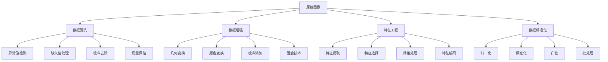

# 图像数据预处理

## 🎯 核心概念

### 图像预处理定义
> **图像数据预处理是将原始图像数据转换为适合机器学习模型训练的标准化格式的过程**

**预处理流程：**


## 📊 数据清洗技术

### 1. 异常值检测

**异常值检测方法：**
```python
import numpy as np
import matplotlib.pyplot as plt
from sklearn.ensemble import IsolationForest
from sklearn.cluster import DBSCAN
from sklearn.preprocessing import StandardScaler
import cv2
from PIL import Image
import os

class ImageAnomalyDetection:
    """图像异常值检测"""
    
    def __init__(self):
        self.detection_methods = {
            'isolation_forest': '孤立森林',
            'dbscan': 'DBSCAN聚类',
            'statistical': '统计方法',
            'reconstruction': '重构误差'
        }
    
    def detect_anomalies_isolation_forest(self, image_features, contamination=0.1):
        """孤立森林异常检测"""
        # 标准化特征
        scaler = StandardScaler()
        features_scaled = scaler.fit_transform(image_features)
        
        # 孤立森林
        iso_forest = IsolationForest(contamination=contamination, random_state=42)
        anomaly_labels = iso_forest.fit_predict(features_scaled)
        
        return anomaly_labels, iso_forest
    
    def detect_anomalies_dbscan(self, image_features, eps=0.5, min_samples=5):
        """DBSCAN异常检测"""
        # 标准化特征
        scaler = StandardScaler()
        features_scaled = scaler.fit_transform(image_features)
        
        # DBSCAN聚类
        dbscan = DBSCAN(eps=eps, min_samples=min_samples)
        cluster_labels = dbscan.fit_predict(features_scaled)
        
        # 噪声点(-1)被认为是异常值
        anomaly_labels = (cluster_labels == -1).astype(int)
        anomaly_labels[anomaly_labels == 1] = -1  # 转换为孤立森林格式
        
        return anomaly_labels, dbscan
    
    def detect_anomalies_statistical(self, image_features, threshold=3):
        """统计方法异常检测"""
        # 计算Z-score
        z_scores = np.abs(StandardScaler().fit_transform(image_features))
        
        # 标记异常值
        anomaly_labels = np.any(z_scores > threshold, axis=1)
        anomaly_labels = np.where(anomaly_labels, -1, 1)
        
        return anomaly_labels
    
    def detect_anomalies_reconstruction(self, images, autoencoder, threshold=0.1):
        """重构误差异常检测"""
        # 使用自编码器重构图像
        with torch.no_grad():
            reconstructed = autoencoder(images)
        
        # 计算重构误差
        reconstruction_error = torch.mean((images - reconstructed) ** 2, dim=(1, 2, 3))
        
        # 标记异常值
        anomaly_labels = (reconstruction_error > threshold).cpu().numpy()
        anomaly_labels = np.where(anomaly_labels, -1, 1)
        
        return anomaly_labels, reconstruction_error
    
    def extract_image_features(self, images):
        """提取图像特征用于异常检测"""
        features = []
        
        for image in images:
            # 基本统计特征
            mean_intensity = np.mean(image)
            std_intensity = np.std(image)
            min_intensity = np.min(image)
            max_intensity = np.max(image)
            
            # 纹理特征
            gray = cv2.cvtColor(image, cv2.COLOR_RGB2GRAY) if len(image.shape) == 3 else image
            laplacian_var = cv2.Laplacian(gray, cv2.CV_64F).var()
            
            # 颜色特征
            if len(image.shape) == 3:
                color_mean = np.mean(image, axis=(0, 1))
                color_std = np.std(image, axis=(0, 1))
                features.append([mean_intensity, std_intensity, min_intensity, max_intensity, 
                               laplacian_var, *color_mean, *color_std])
            else:
                features.append([mean_intensity, std_intensity, min_intensity, max_intensity, laplacian_var])
        
        return np.array(features)
    
    def visualize_anomalies(self, images, anomaly_labels, method_name):
        """可视化异常检测结果"""
        normal_images = [img for img, label in zip(images, anomaly_labels) if label == 1]
        anomaly_images = [img for img, label in zip(images, anomaly_labels) if label == -1]
        
        fig, axes = plt.subplots(2, 5, figsize=(15, 6))
        
        # 显示正常图像
        for i in range(min(5, len(normal_images))):
            axes[0, i].imshow(normal_images[i])
            axes[0, i].set_title(f'Normal {i+1}')
            axes[0, i].axis('off')
        
        # 显示异常图像
        for i in range(min(5, len(anomaly_images))):
            axes[1, i].imshow(anomaly_images[i])
            axes[1, i].set_title(f'Anomaly {i+1}')
            axes[1, i].axis('off')
        
        plt.suptitle(f'Anomaly Detection Results - {method_name}')
        plt.tight_layout()
        plt.show()

# 测试异常值检测
def test_anomaly_detection():
    """测试异常值检测"""
    iad = ImageAnomalyDetection()
    
    # 创建测试数据
    normal_images = [np.random.randint(0, 256, (64, 64, 3), dtype=np.uint8) for _ in range(90)]
    anomaly_images = [np.random.randint(200, 256, (64, 64, 3), dtype=np.uint8) for _ in range(10)]
    test_images = normal_images + anomaly_images
    
    # 提取特征
    features = iad.extract_image_features(test_images)
    
    # 异常检测
    iso_labels, _ = iad.detect_anomalies_isolation_forest(features)
    dbscan_labels, _ = iad.detect_anomalies_dbscan(features)
    stat_labels = iad.detect_anomalies_statistical(features)
    
    # 可视化结果
    iad.visualize_anomalies(test_images, iso_labels, 'Isolation Forest')
    iad.visualize_anomalies(test_images, dbscan_labels, 'DBSCAN')
    iad.visualize_anomalies(test_images, stat_labels, 'Statistical')
    
    return iad

test_anomaly_detection()
```

### 2. 噪声去除

**噪声去除技术：**
```python
from scipy import ndimage
from skimage import restoration, filters
from skimage.restoration import denoise_tv_chambolle, denoise_bilateral

class ImageDenoising:
    """图像去噪"""
    
    def __init__(self):
        self.denoising_methods = {
            'gaussian': '高斯滤波',
            'median': '中值滤波',
            'bilateral': '双边滤波',
            'tv': '总变分去噪',
            'wavelet': '小波去噪',
            'nlmeans': '非局部均值'
        }
    
    def gaussian_denoising(self, image, sigma=1.0):
        """高斯滤波去噪"""
        return ndimage.gaussian_filter(image, sigma=sigma)
    
    def median_denoising(self, image, size=3):
        """中值滤波去噪"""
        return ndimage.median_filter(image, size=size)
    
    def bilateral_denoising(self, image, sigma_color=0.05, sigma_spatial=15):
        """双边滤波去噪"""
        return denoise_bilateral(image, sigma_color=sigma_color, sigma_spatial=sigma_spatial)
    
    def tv_denoising(self, image, weight=0.1):
        """总变分去噪"""
        return denoise_tv_chambolle(image, weight=weight)
    
    def wavelet_denoising(self, image, sigma=0.1):
        """小波去噪"""
        from skimage.restoration import denoise_wavelet
        return denoise_wavelet(image, sigma=sigma, rescale_sigma=True)
    
    def nlmeans_denoising(self, image, patch_size=5, patch_distance=6, h=0.1):
        """非局部均值去噪"""
        from skimage.restoration import denoise_nl_means
        return denoise_nl_means(image, patch_size=patch_size, patch_distance=patch_distance, h=h)
    
    def add_noise(self, image, noise_type='gaussian', **kwargs):
        """添加噪声"""
        if noise_type == 'gaussian':
            noise = np.random.normal(0, kwargs.get('sigma', 0.1), image.shape)
            noisy_image = image + noise
        elif noise_type == 'salt_pepper':
            noise = np.random.random(image.shape)
            noisy_image = image.copy()
            noisy_image[noise < kwargs.get('salt_prob', 0.05)] = 1
            noisy_image[noise > 1 - kwargs.get('pepper_prob', 0.05)] = 0
        elif noise_type == 'poisson':
            noisy_image = np.random.poisson(image * kwargs.get('scale', 10)) / kwargs.get('scale', 10)
        else:
            noisy_image = image
        
        return np.clip(noisy_image, 0, 1)
    
    def calculate_psnr(self, original, denoised):
        """计算PSNR"""
        mse = np.mean((original - denoised) ** 2)
        if mse == 0:
            return float('inf')
        return 20 * np.log10(1.0 / np.sqrt(mse))
    
    def calculate_ssim(self, original, denoised):
        """计算SSIM"""
        from skimage.metrics import structural_similarity as ssim
        return ssim(original, denoised, data_range=1.0)
    
    def compare_denoising_methods(self, image):
        """比较去噪方法"""
        # 添加噪声
        noisy_image = self.add_noise(image, 'gaussian', sigma=0.1)
        
        # 应用不同去噪方法
        denoised_images = {
            'Original': image,
            'Noisy': noisy_image,
            'Gaussian': self.gaussian_denoising(noisy_image),
            'Median': self.median_denoising(noisy_image),
            'Bilateral': self.bilateral_denoising(noisy_image),
            'TV': self.tv_denoising(noisy_image),
            'Wavelet': self.wavelet_denoising(noisy_image),
            'NL-Means': self.nlmeans_denoising(noisy_image)
        }
        
        # 计算评估指标
        results = {}
        for method, denoised in denoised_images.items():
            if method not in ['Original', 'Noisy']:
                psnr = self.calculate_psnr(image, denoised)
                ssim_score = self.calculate_ssim(image, denoised)
                results[method] = {'PSNR': psnr, 'SSIM': ssim_score, 'image': denoised}
        
        return denoised_images, results
    
    def visualize_denoising_results(self, denoised_images, results):
        """可视化去噪结果"""
        fig, axes = plt.subplots(2, 4, figsize=(16, 8))
        
        methods = ['Original', 'Noisy', 'Gaussian', 'Median', 'Bilateral', 'TV', 'Wavelet', 'NL-Means']
        
        for i, method in enumerate(methods):
            row = i // 4
            col = i % 4
            
            axes[row, col].imshow(denoised_images[method], cmap='gray')
            axes[row, col].set_title(method)
            axes[row, col].axis('off')
            
            # 添加评估指标
            if method in results:
                psnr = results[method]['PSNR']
                ssim = results[method]['SSIM']
                axes[row, col].text(0.02, 0.98, f'PSNR: {psnr:.2f}\nSSIM: {ssim:.3f}', 
                                   transform=axes[row, col].transAxes, fontsize=8,
                                   verticalalignment='top', bbox=dict(boxstyle='round', facecolor='white', alpha=0.8))
        
        plt.tight_layout()
        plt.show()

# 测试图像去噪
def test_image_denoising():
    """测试图像去噪"""
    idn = ImageDenoising()
    
    # 创建测试图像
    test_image = np.random.rand(128, 128)
    
    # 比较去噪方法
    denoised_images, results = idn.compare_denoising_methods(test_image)
    
    # 可视化结果
    idn.visualize_denoising_results(denoised_images, results)
    
    return idn

test_image_denoising()
```

## 🎨 数据增强技术

### 1. 几何变换增强

**几何变换方法：**
```python
import torch
import torchvision.transforms as transforms
from torchvision.transforms import functional as F
import albumentations as A
from albumentations.pytorch import ToTensorV2

class GeometricAugmentation:
    """几何变换数据增强"""
    
    def __init__(self):
        self.geometric_transforms = {
            'rotation': '旋转',
            'translation': '平移',
            'scaling': '缩放',
            'shearing': '剪切',
            'flipping': '翻转',
            'cropping': '裁剪',
            'perspective': '透视变换'
        }
    
    def create_rotation_transform(self, degrees=30):
        """旋转变换"""
        return transforms.RandomRotation(degrees=degrees)
    
    def create_translation_transform(self, translate=(0.1, 0.1)):
        """平移变换"""
        return transforms.RandomAffine(degrees=0, translate=translate)
    
    def create_scaling_transform(self, scale=(0.8, 1.2)):
        """缩放变换"""
        return transforms.RandomAffine(degrees=0, scale=scale)
    
    def create_shearing_transform(self, shear=10):
        """剪切变换"""
        return transforms.RandomAffine(degrees=0, shear=shear)
    
    def create_flipping_transform(self, horizontal=True, vertical=False):
        """翻转变换"""
        transforms_list = []
        if horizontal:
            transforms_list.append(transforms.RandomHorizontalFlip(p=0.5))
        if vertical:
            transforms_list.append(transforms.RandomVerticalFlip(p=0.5))
        return transforms.Compose(transforms_list)
    
    def create_cropping_transform(self, size=(224, 224), padding=4):
        """裁剪变换"""
        return transforms.Compose([
            transforms.RandomCrop(size, padding=padding),
            transforms.Resize(size)
        ])
    
    def create_perspective_transform(self, distortion_scale=0.2):
        """透视变换"""
        return transforms.RandomPerspective(distortion_scale=distortion_scale, p=0.5)
    
    def create_albumentations_pipeline(self):
        """Albumentations增强管道"""
        return A.Compose([
            A.Rotate(limit=30, p=0.5),
            A.HorizontalFlip(p=0.5),
            A.VerticalFlip(p=0.3),
            A.ShiftScaleRotate(shift_limit=0.1, scale_limit=0.2, rotate_limit=30, p=0.5),
            A.Perspective(scale=(0.05, 0.1), p=0.3),
            A.RandomCrop(height=224, width=224, p=0.5),
            A.Resize(224, 224),
            A.Normalize(mean=[0.485, 0.456, 0.406], std=[0.229, 0.224, 0.225]),
            ToTensorV2()
        ])
    
    def apply_geometric_transforms(self, image, num_augmentations=8):
        """应用几何变换"""
        augmented_images = [image]
        
        # 旋转
        rotation_transform = self.create_rotation_transform(degrees=30)
        augmented_images.append(rotation_transform(image))
        
        # 平移
        translation_transform = self.create_translation_transform(translate=(0.1, 0.1))
        augmented_images.append(translation_transform(image))
        
        # 缩放
        scaling_transform = self.create_scaling_transform(scale=(0.8, 1.2))
        augmented_images.append(scaling_transform(image))
        
        # 剪切
        shearing_transform = self.create_shearing_transform(shear=10)
        augmented_images.append(shearing_transform(image))
        
        # 翻转
        flipping_transform = self.create_flipping_transform(horizontal=True, vertical=True)
        augmented_images.append(flipping_transform(image))
        
        # 裁剪
        cropping_transform = self.create_cropping_transform(size=(224, 224))
        augmented_images.append(cropping_transform(image))
        
        # 透视变换
        perspective_transform = self.create_perspective_transform(distortion_scale=0.2)
        augmented_images.append(perspective_transform(image))
        
        return augmented_images
    
    def visualize_geometric_transforms(self, image, augmented_images):
        """可视化几何变换结果"""
        fig, axes = plt.subplots(2, 4, figsize=(16, 8))
        
        transform_names = ['Original', 'Rotation', 'Translation', 'Scaling', 
                          'Shearing', 'Flipping', 'Cropping', 'Perspective']
        
        for i, (ax, name, img) in enumerate(zip(axes.flat, transform_names, augmented_images)):
            ax.imshow(img)
            ax.set_title(name)
            ax.axis('off')
        
        plt.tight_layout()
        plt.show()

# 测试几何变换增强
def test_geometric_augmentation():
    """测试几何变换增强"""
    ga = GeometricAugmentation()
    
    # 创建测试图像
    test_image = np.random.randint(0, 256, (256, 256, 3), dtype=np.uint8)
    test_image = Image.fromarray(test_image)
    
    # 应用几何变换
    augmented_images = ga.apply_geometric_transforms(test_image)
    
    # 可视化结果
    ga.visualize_geometric_transforms(test_image, augmented_images)
    
    return ga

test_geometric_augmentation()
```

### 2. 颜色变换增强

**颜色变换方法：**
```python
class ColorAugmentation:
    """颜色变换数据增强"""
    
    def __init__(self):
        self.color_transforms = {
            'brightness': '亮度调整',
            'contrast': '对比度调整',
            'saturation': '饱和度调整',
            'hue': '色调调整',
            'gamma': '伽马校正',
            'color_jitter': '颜色抖动',
            'histogram_equalization': '直方图均衡化',
            'clahe': '对比度限制自适应直方图均衡化'
        }
    
    def create_brightness_transform(self, brightness_range=(0.8, 1.2)):
        """亮度调整"""
        return transforms.ColorJitter(brightness=brightness_range)
    
    def create_contrast_transform(self, contrast_range=(0.8, 1.2)):
        """对比度调整"""
        return transforms.ColorJitter(contrast=contrast_range)
    
    def create_saturation_transform(self, saturation_range=(0.8, 1.2)):
        """饱和度调整"""
        return transforms.ColorJitter(saturation=saturation_range)
    
    def create_hue_transform(self, hue_range=(-0.1, 0.1)):
        """色调调整"""
        return transforms.ColorJitter(hue=hue_range)
    
    def create_gamma_transform(self, gamma_range=(0.8, 1.2)):
        """伽马校正"""
        def gamma_correction(image, gamma):
            return F.adjust_gamma(image, gamma)
        
        return transforms.Lambda(lambda x: gamma_correction(x, np.random.uniform(*gamma_range)))
    
    def create_color_jitter_transform(self, brightness=0.2, contrast=0.2, saturation=0.2, hue=0.1):
        """颜色抖动"""
        return transforms.ColorJitter(
            brightness=brightness,
            contrast=contrast,
            saturation=saturation,
            hue=hue
        )
    
    def create_histogram_equalization_transform(self):
        """直方图均衡化"""
        return transforms.Lambda(lambda x: F.equalize(x))
    
    def create_clahe_transform(self, clip_limit=2.0, tile_grid_size=(8, 8)):
        """CLAHE变换"""
        def clahe_transform(image):
            # 转换为numpy数组
            img_array = np.array(image)
            
            # 应用CLAHE
            clahe = cv2.createCLAHE(clipLimit=clip_limit, tileGridSize=tile_grid_size)
            
            if len(img_array.shape) == 3:
                # 彩色图像
                lab = cv2.cvtColor(img_array, cv2.COLOR_RGB2LAB)
                lab[:, :, 0] = clahe.apply(lab[:, :, 0])
                img_array = cv2.cvtColor(lab, cv2.COLOR_LAB2RGB)
            else:
                # 灰度图像
                img_array = clahe.apply(img_array)
            
            return Image.fromarray(img_array)
        
        return transforms.Lambda(clahe_transform)
    
    def create_albumentations_color_pipeline(self):
        """Albumentations颜色增强管道"""
        return A.Compose([
            A.RandomBrightnessContrast(brightness_limit=0.2, contrast_limit=0.2, p=0.5),
            A.HueSaturationValue(hue_shift_limit=20, sat_shift_limit=30, val_shift_limit=20, p=0.5),
            A.RandomGamma(gamma_limit=(80, 120), p=0.3),
            A.CLAHE(clip_limit=2.0, tile_grid_size=(8, 8), p=0.3),
            A.RandomToneCurve(scale=0.1, p=0.3),
            A.RGBShift(r_shift_limit=20, g_shift_limit=20, b_shift_limit=20, p=0.3),
            A.ChannelShuffle(p=0.1),
            A.Normalize(mean=[0.485, 0.456, 0.406], std=[0.229, 0.224, 0.225]),
            ToTensorV2()
        ])
    
    def apply_color_transforms(self, image):
        """应用颜色变换"""
        augmented_images = [image]
        
        # 亮度调整
        brightness_transform = self.create_brightness_transform(brightness_range=(0.8, 1.2))
        augmented_images.append(brightness_transform(image))
        
        # 对比度调整
        contrast_transform = self.create_contrast_transform(contrast_range=(0.8, 1.2))
        augmented_images.append(contrast_transform(image))
        
        # 饱和度调整
        saturation_transform = self.create_saturation_transform(saturation_range=(0.8, 1.2))
        augmented_images.append(saturation_transform(image))
        
        # 色调调整
        hue_transform = self.create_hue_transform(hue_range=(-0.1, 0.1))
        augmented_images.append(hue_transform(image))
        
        # 伽马校正
        gamma_transform = self.create_gamma_transform(gamma_range=(0.8, 1.2))
        augmented_images.append(gamma_transform(image))
        
        # 颜色抖动
        color_jitter_transform = self.create_color_jitter_transform()
        augmented_images.append(color_jitter_transform(image))
        
        # 直方图均衡化
        hist_eq_transform = self.create_histogram_equalization_transform()
        augmented_images.append(hist_eq_transform(image))
        
        # CLAHE
        clahe_transform = self.create_clahe_transform()
        augmented_images.append(clahe_transform(image))
        
        return augmented_images
    
    def visualize_color_transforms(self, image, augmented_images):
        """可视化颜色变换结果"""
        fig, axes = plt.subplots(3, 3, figsize=(15, 15))
        
        transform_names = ['Original', 'Brightness', 'Contrast', 'Saturation', 
                          'Hue', 'Gamma', 'Color Jitter', 'Histogram Eq', 'CLAHE']
        
        for i, (ax, name, img) in enumerate(zip(axes.flat, transform_names, augmented_images)):
            ax.imshow(img)
            ax.set_title(name)
            ax.axis('off')
        
        plt.tight_layout()
        plt.show()

# 测试颜色变换增强
def test_color_augmentation():
    """测试颜色变换增强"""
    ca = ColorAugmentation()
    
    # 创建测试图像
    test_image = np.random.randint(0, 256, (256, 256, 3), dtype=np.uint8)
    test_image = Image.fromarray(test_image)
    
    # 应用颜色变换
    augmented_images = ca.apply_color_transforms(test_image)
    
    # 可视化结果
    ca.visualize_color_transforms(test_image, augmented_images)
    
    return ca

test_color_augmentation()
```

### 3. 高级增强技术

**高级增强方法：**
```python
class AdvancedAugmentation:
    """高级数据增强技术"""
    
    def __init__(self):
        self.advanced_methods = {
            'mixup': 'Mixup',
            'cutmix': 'CutMix',
            'cutout': 'Cutout',
            'random_erasing': '随机擦除',
            'grid_mask': '网格掩码',
            'mosaic': '马赛克',
            'copy_paste': '复制粘贴',
            'style_transfer': '风格迁移'
        }
    
    def mixup(self, images, labels, alpha=1.0):
        """Mixup数据增强"""
        if alpha > 0:
            lam = np.random.beta(alpha, alpha)
        else:
            lam = 1
        
        batch_size = images.size(0)
        index = torch.randperm(batch_size)
        
        mixed_images = lam * images + (1 - lam) * images[index, :]
        labels_a, labels_b = labels, labels[index]
        
        return mixed_images, labels_a, labels_b, lam
    
    def cutmix(self, images, labels, alpha=1.0):
        """CutMix数据增强"""
        if alpha > 0:
            lam = np.random.beta(alpha, alpha)
        else:
            lam = 1
        
        batch_size = images.size(0)
        index = torch.randperm(batch_size)
        
        y1, y2, x1, x2 = self._rand_bbox(images.size(), lam)
        images[:, :, y1:y2, x1:x2] = images[index, :, y1:y2, x1:x2]
        
        # 调整lambda以匹配像素比例
        lam = 1 - ((x2 - x1) * (y2 - y1) / (images.size()[-1] * images.size()[-2]))
        
        labels_a, labels_b = labels, labels[index]
        
        return images, labels_a, labels_b, lam
    
    def _rand_bbox(self, size, lam):
        """生成随机边界框"""
        W = size[2]
        H = size[3]
        cut_rat = np.sqrt(1. - lam)
        cut_w = np.int(W * cut_rat)
        cut_h = np.int(H * cut_rat)
        
        # 随机选择中心点
        cx = np.random.randint(W)
        cy = np.random.randint(H)
        
        bbx1 = np.clip(cx - cut_w // 2, 0, W)
        bby1 = np.clip(cy - cut_h // 2, 0, H)
        bbx2 = np.clip(cx + cut_w // 2, 0, W)
        bby2 = np.clip(cy + cut_h // 2, 0, H)
        
        return bby1, bby2, bbx1, bbx2
    
    def cutout(self, images, length=16):
        """Cutout数据增强"""
        h, w = images.size(2), images.size(3)
        mask = np.ones((h, w), np.float32)
        
        y = np.random.randint(h)
        x = np.random.randint(w)
        
        y1 = np.clip(y - length // 2, 0, h)
        y2 = np.clip(y + length // 2, 0, h)
        x1 = np.clip(x - length // 2, 0, w)
        x2 = np.clip(x + length // 2, 0, w)
        
        mask[y1:y2, x1:x2] = 0.
        mask = torch.from_numpy(mask).to(images.device)
        mask = mask.expand_as(images)
        images = images * mask
        
        return images
    
    def random_erasing(self, images, probability=0.5, sl=0.02, sh=0.4, r1=0.3):
        """随机擦除"""
        if np.random.uniform(0, 1) >= probability:
            return images
        
        for i in range(images.size(0)):
            img = images[i]
            area = img.size(1) * img.size(2)
            
            target_area = np.random.uniform(sl, sh) * area
            aspect_ratio = np.random.uniform(r1, 1/r1)
            
            h = int(round(np.sqrt(target_area * aspect_ratio)))
            w = int(round(np.sqrt(target_area / aspect_ratio)))
            
            if w < img.size(2) and h < img.size(1):
                x1 = np.random.randint(0, img.size(2) - w)
                y1 = np.random.randint(0, img.size(1) - h)
                
                if img.size(0) == 3:
                    img[0, y1:y1+h, x1:x1+w] = np.random.uniform(0, 1)
                    img[1, y1:y1+h, x1:x1+w] = np.random.uniform(0, 1)
                    img[2, y1:y1+h, x1:x1+w] = np.random.uniform(0, 1)
                else:
                    img[0, y1:y1+h, x1:x1+w] = np.random.uniform(0, 1)
                
                images[i] = img
        
        return images
    
    def grid_mask(self, images, d1=96, d2=224, rotate=1, ratio=0.6):
        """网格掩码"""
        n, c, h, w = images.size()
        
        # 创建网格
        x = np.random.randint(d1, d2)
        grid_h = h // x
        grid_w = w // x
        
        # 随机旋转
        if rotate == 1:
            mask = np.random.randint(0, 2, (grid_h, grid_w))
        else:
            mask = np.random.randint(0, 2, (grid_h, grid_w))
            mask = np.rot90(mask, np.random.randint(0, 4))
        
        # 调整大小
        mask = cv2.resize(mask.astype(np.uint8), (w, h), interpolation=cv2.INTER_NEAREST)
        
        # 应用掩码
        mask = torch.from_numpy(mask).float().to(images.device)
        mask = mask.unsqueeze(0).unsqueeze(0).expand(n, c, -1, -1)
        
        images = images * mask
        
        return images
    
    def mosaic(self, images, labels, img_size=640):
        """马赛克数据增强"""
        s = img_size
        yc, xc = [int(np.random.uniform(-x, 2 * s + x)) for x in [-s // 2, -s // 2]]  # 中心点
        
        labels4 = []
        for i, img in enumerate(images):
            h, w = img.shape[:2]
            
            # 放置图像
            if i == 0:  # 左上
                img4 = np.full((s * 2, s * 2, img.shape[2]), 114, dtype=np.uint8)
                x1a, y1a, x2a, y2a = max(xc - w, 0), max(yc - h, 0), xc, yc
                x1b, y1b, x2b, y2b = w - (x2a - x1a), h - (y2a - y1a), w, h
            elif i == 1:  # 右上
                x1a, y1a, x2a, y2a = xc, max(yc - h, 0), min(xc + w, s * 2), yc
                x1b, y1b, x2b, y2b = 0, h - (y2a - y1a), min(w, x2a - x1a), h
            elif i == 2:  # 左下
                x1a, y1a, x2a, y2a = max(xc - w, 0), yc, xc, min(s * 2, yc + h)
                x1b, y1b, x2b, y2b = w - (x2a - x1a), 0, w, min(h, y2a - y1a)
            elif i == 3:  # 右下
                x1a, y1a, x2a, y2a = xc, yc, min(xc + w, s * 2), min(s * 2, yc + h)
                x1b, y1b, x2b, y2b = 0, 0, min(w, x2a - x1a), min(h, y2a - y1a)
            
            img4[y1a:y2a, x1a:x2a] = img[y1b:y2b, x1b:x2b]
            
            # 调整标签
            padw = x1a - x1b
            padh = y1a - y1b
        
        return img4, labels4
    
    def create_albumentations_advanced_pipeline(self):
        """Albumentations高级增强管道"""
        return A.Compose([
            A.OneOf([
                A.MixUp(alpha=1.0, p=0.3),
                A.CutMix(alpha=1.0, p=0.3),
                A.CoarseDropout(max_holes=8, max_height=8, max_width=8, p=0.3),
            ], p=0.5),
            A.GridMask(num_grid=3, p=0.3),
            A.RandomGridShuffle(grid=(2, 2), p=0.2),
            A.PixelDropout(dropout_prob=0.01, p=0.3),
            A.Normalize(mean=[0.485, 0.456, 0.406], std=[0.229, 0.224, 0.225]),
            ToTensorV2()
        ])
    
    def visualize_advanced_augmentations(self, images, labels):
        """可视化高级增强结果"""
        fig, axes = plt.subplots(2, 4, figsize=(16, 8))
        
        # 原始图像
        axes[0, 0].imshow(images[0])
        axes[0, 0].set_title('Original')
        axes[0, 0].axis('off')
        
        # Mixup
        mixed_images, _, _, lam = self.mixup(images[:2], labels[:2])
        axes[0, 1].imshow(mixed_images[0].permute(1, 2, 0))
        axes[0, 1].set_title(f'Mixup (λ={lam:.2f})')
        axes[0, 1].axis('off')
        
        # CutMix
        cutmix_images, _, _, lam = self.cutmix(images[:2], labels[:2])
        axes[0, 2].imshow(cutmix_images[0].permute(1, 2, 0))
        axes[0, 2].set_title(f'CutMix (λ={lam:.2f})')
        axes[0, 2].axis('off')
        
        # Cutout
        cutout_images = self.cutout(images[:1])
        axes[0, 3].imshow(cutout_images[0].permute(1, 2, 0))
        axes[0, 3].set_title('Cutout')
        axes[0, 3].axis('off')
        
        # Random Erasing
        erased_images = self.random_erasing(images[:1])
        axes[1, 0].imshow(erased_images[0].permute(1, 2, 0))
        axes[1, 0].set_title('Random Erasing')
        axes[1, 0].axis('off')
        
        # Grid Mask
        grid_images = self.grid_mask(images[:1])
        axes[1, 1].imshow(grid_images[0].permute(1, 2, 0))
        axes[1, 1].set_title('Grid Mask')
        axes[1, 1].axis('off')
        
        # 空白
        axes[1, 2].axis('off')
        axes[1, 3].axis('off')
        
        plt.tight_layout()
        plt.show()

# 测试高级增强技术
def test_advanced_augmentation():
    """测试高级增强技术"""
    aa = AdvancedAugmentation()
    
    # 创建测试数据
    test_images = torch.randn(4, 3, 224, 224)
    test_labels = torch.randint(0, 10, (4,))
    
    # 可视化高级增强结果
    aa.visualize_advanced_augmentations(test_images, test_labels)
    
    return aa

test_advanced_augmentation()
```

## 📈 数据标准化技术

### 1. 标准化方法

**标准化技术：**
```python
class DataNormalization:
    """数据标准化"""
    
    def __init__(self):
        self.normalization_methods = {
            'min_max': '最小-最大归一化',
            'z_score': 'Z-score标准化',
            'robust': '鲁棒标准化',
            'unit_vector': '单位向量归一化',
            'decimal_scaling': '小数定标标准化',
            'whitening': '白化',
            'batch_normalization': '批归一化',
            'layer_normalization': '层归一化'
        }
    
    def min_max_normalization(self, data, feature_range=(0, 1)):
        """最小-最大归一化"""
        from sklearn.preprocessing import MinMaxScaler
        
        scaler = MinMaxScaler(feature_range=feature_range)
        normalized_data = scaler.fit_transform(data)
        
        return normalized_data, scaler
    
    def z_score_normalization(self, data):
        """Z-score标准化"""
        from sklearn.preprocessing import StandardScaler
        
        scaler = StandardScaler()
        normalized_data = scaler.fit_transform(data)
        
        return normalized_data, scaler
    
    def robust_normalization(self, data):
        """鲁棒标准化"""
        from sklearn.preprocessing import RobustScaler
        
        scaler = RobustScaler()
        normalized_data = scaler.fit_transform(data)
        
        return normalized_data, scaler
    
    def unit_vector_normalization(self, data):
        """单位向量归一化"""
        from sklearn.preprocessing import Normalizer
        
        scaler = Normalizer()
        normalized_data = scaler.fit_transform(data)
        
        return normalized_data, scaler
    
    def decimal_scaling_normalization(self, data):
        """小数定标标准化"""
        # 计算每个特征的最大绝对值
        max_abs_values = np.max(np.abs(data), axis=0)
        
        # 计算缩放因子
        scaling_factors = 10 ** np.ceil(np.log10(max_abs_values))
        
        # 应用缩放
        normalized_data = data / scaling_factors
        
        return normalized_data, scaling_factors
    
    def whitening(self, data):
        """白化"""
        # 中心化
        centered_data = data - np.mean(data, axis=0)
        
        # 计算协方差矩阵
        cov_matrix = np.cov(centered_data.T)
        
        # 特征值分解
        eigenvals, eigenvecs = np.linalg.eigh(cov_matrix)
        
        # 白化变换
        whitening_matrix = eigenvecs @ np.diag(1.0 / np.sqrt(eigenvals + 1e-5)) @ eigenvecs.T
        whitened_data = centered_data @ whitening_matrix.T
        
        return whitened_data, whitening_matrix
    
    def batch_normalization(self, data, epsilon=1e-5):
        """批归一化"""
        # 计算批统计量
        mean = np.mean(data, axis=0)
        var = np.var(data, axis=0)
        
        # 归一化
        normalized_data = (data - mean) / np.sqrt(var + epsilon)
        
        return normalized_data, {'mean': mean, 'var': var}
    
    def layer_normalization(self, data, epsilon=1e-5):
        """层归一化"""
        # 计算层统计量
        mean = np.mean(data, axis=1, keepdims=True)
        var = np.var(data, axis=1, keepdims=True)
        
        # 归一化
        normalized_data = (data - mean) / np.sqrt(var + epsilon)
        
        return normalized_data, {'mean': mean, 'var': var}
    
    def compare_normalization_methods(self, data):
        """比较标准化方法"""
        methods = {
            'Original': data,
            'Min-Max': self.min_max_normalization(data.copy())[0],
            'Z-Score': self.z_score_normalization(data.copy())[0],
            'Robust': self.robust_normalization(data.copy())[0],
            'Unit Vector': self.unit_vector_normalization(data.copy())[0],
            'Decimal Scaling': self.decimal_scaling_normalization(data.copy())[0],
            'Whitening': self.whitening(data.copy())[0]
        }
        
        return methods
    
    def visualize_normalization_comparison(self, methods):
        """可视化标准化比较"""
        fig, axes = plt.subplots(2, 4, figsize=(16, 8))
        
        for i, (method_name, normalized_data) in enumerate(methods.items()):
            row = i // 4
            col = i % 4
            
            # 绘制分布
            axes[row, col].hist(normalized_data.flatten(), bins=50, alpha=0.7)
            axes[row, col].set_title(method_name)
            axes[row, col].set_xlabel('Value')
            axes[row, col].set_ylabel('Frequency')
            
            # 添加统计信息
            mean_val = np.mean(normalized_data)
            std_val = np.std(normalized_data)
            axes[row, col].text(0.05, 0.95, f'Mean: {mean_val:.3f}\nStd: {std_val:.3f}', 
                               transform=axes[row, col].transAxes, fontsize=8,
                               verticalalignment='top', bbox=dict(boxstyle='round', facecolor='white', alpha=0.8))
        
        plt.tight_layout()
        plt.show()

# 测试数据标准化
def test_data_normalization():
    """测试数据标准化"""
    dn = DataNormalization()
    
    # 创建测试数据
    test_data = np.random.randn(1000, 10)
    
    # 比较标准化方法
    methods = dn.compare_normalization_methods(test_data)
    
    # 可视化结果
    dn.visualize_normalization_comparison(methods)
    
    return dn

test_data_normalization()
```

### 2. 图像特定标准化

**图像标准化技术：**
```python
class ImageNormalization:
    """图像特定标准化"""
    
    def __init__(self):
        self.image_normalization_methods = {
            'imagenet': 'ImageNet标准化',
            'per_channel': '逐通道标准化',
            'global': '全局标准化',
            'local': '局部标准化',
            'adaptive': '自适应标准化',
            'histogram_matching': '直方图匹配',
            'clahe': 'CLAHE标准化'
        }
    
    def imagenet_normalization(self, image):
        """ImageNet标准化"""
        mean = [0.485, 0.456, 0.406]
        std = [0.229, 0.224, 0.225]
        
        normalized_image = image.copy()
        for i in range(3):
            normalized_image[:, :, i] = (normalized_image[:, :, i] - mean[i]) / std[i]
        
        return normalized_image
    
    def per_channel_normalization(self, image):
        """逐通道标准化"""
        normalized_image = image.copy()
        
        for i in range(image.shape[2]):
            channel = image[:, :, i]
            mean = np.mean(channel)
            std = np.std(channel)
            normalized_image[:, :, i] = (channel - mean) / (std + 1e-8)
        
        return normalized_image
    
    def global_normalization(self, image):
        """全局标准化"""
        mean = np.mean(image)
        std = np.std(image)
        normalized_image = (image - mean) / (std + 1e-8)
        
        return normalized_image
    
    def local_normalization(self, image, kernel_size=15):
        """局部标准化"""
        from scipy import ndimage
        
        # 计算局部均值和标准差
        local_mean = ndimage.uniform_filter(image, size=kernel_size)
        local_sq_mean = ndimage.uniform_filter(image**2, size=kernel_size)
        local_std = np.sqrt(local_sq_mean - local_mean**2)
        
        # 标准化
        normalized_image = (image - local_mean) / (local_std + 1e-8)
        
        return normalized_image
    
    def adaptive_normalization(self, image, clip_limit=2.0, tile_grid_size=(8, 8)):
        """自适应标准化"""
        # 转换为uint8
        if image.dtype != np.uint8:
            image_uint8 = (image * 255).astype(np.uint8)
        else:
            image_uint8 = image
        
        # 应用CLAHE
        clahe = cv2.createCLAHE(clipLimit=clip_limit, tileGridSize=tile_grid_size)
        
        if len(image_uint8.shape) == 3:
            # 彩色图像
            lab = cv2.cvtColor(image_uint8, cv2.COLOR_RGB2LAB)
            lab[:, :, 0] = clahe.apply(lab[:, :, 0])
            normalized_image = cv2.cvtColor(lab, cv2.COLOR_LAB2RGB)
        else:
            # 灰度图像
            normalized_image = clahe.apply(image_uint8)
        
        # 转换回float
        normalized_image = normalized_image.astype(np.float32) / 255.0
        
        return normalized_image
    
    def histogram_matching(self, source_image, reference_image):
        """直方图匹配"""
        from skimage.exposure import match_histograms
        
        matched_image = match_histograms(source_image, reference_image)
        
        return matched_image
    
    def create_normalization_pipeline(self, method='imagenet'):
        """创建标准化管道"""
        if method == 'imagenet':
            return transforms.Normalize(mean=[0.485, 0.456, 0.406], std=[0.229, 0.224, 0.225])
        elif method == 'per_channel':
            return transforms.Lambda(lambda x: self.per_channel_normalization(x.numpy()))
        elif method == 'global':
            return transforms.Lambda(lambda x: self.global_normalization(x.numpy()))
        else:
            return transforms.Normalize(mean=[0.5, 0.5, 0.5], std=[0.5, 0.5, 0.5])
    
    def compare_image_normalization_methods(self, image):
        """比较图像标准化方法"""
        methods = {
            'Original': image,
            'ImageNet': self.imagenet_normalization(image.copy()),
            'Per Channel': self.per_channel_normalization(image.copy()),
            'Global': self.global_normalization(image.copy()),
            'Local': self.local_normalization(image.copy()),
            'Adaptive': self.adaptive_normalization(image.copy()),
            'Histogram Match': self.histogram_matching(image.copy(), image.copy())
        }
        
        return methods
    
    def visualize_image_normalization_comparison(self, methods):
        """可视化图像标准化比较"""
        fig, axes = plt.subplots(2, 4, figsize=(16, 8))
        
        for i, (method_name, normalized_image) in enumerate(methods.items()):
            row = i // 4
            col = i % 4
            
            # 显示图像
            axes[row, col].imshow(normalized_image)
            axes[row, col].set_title(method_name)
            axes[row, col].axis('off')
            
            # 添加统计信息
            mean_val = np.mean(normalized_image)
            std_val = np.std(normalized_image)
            axes[row, col].text(0.02, 0.98, f'Mean: {mean_val:.3f}\nStd: {std_val:.3f}', 
                               transform=axes[row, col].transAxes, fontsize=8,
                               verticalalignment='top', bbox=dict(boxstyle='round', facecolor='white', alpha=0.8))
        
        plt.tight_layout()
        plt.show()

# 测试图像标准化
def test_image_normalization():
    """测试图像标准化"""
    inorm = ImageNormalization()
    
    # 创建测试图像
    test_image = np.random.rand(224, 224, 3)
    
    # 比较标准化方法
    methods = inorm.compare_image_normalization_methods(test_image)
    
    # 可视化结果
    inorm.visualize_image_normalization_comparison(methods)
    
    return inorm

test_image_normalization()
```

## 🔗 相关链接
- [[01-03-02-NumPy数据处理]] - NumPy数据处理
- [[01-03-03-Pandas数据分析]] - Pandas数据分析
- [[03-01-01-图像处理基础]] - 图像处理基础
- [[03-01-02-目标检测算法]] - 目标检测技术
- [[03-01-03-图像分割技术]] - 图像分割技术
- [[03-01-04-人脸识别系统]] - 人脸识别系统

## 💡 费曼学习法应用

**概念理解**：图像数据预处理就像"准备食材"，需要清洗、切割、调味，让数据更适合"烹饪"（训练模型）。就像做菜前的准备工作一样重要。

**实践建议**：
- 🎯 **理解流程**：掌握完整的数据预处理流程：清洗→增强→标准化
- 🔧 **选择方法**：根据数据特点和任务需求选择合适的预处理方法
- 📊 **评估效果**：使用合适的指标评估预处理效果
- 🚀 **优化流程**：根据模型性能调整预处理策略

**刻意练习**：
- 💻 **实现方法**：亲手实现各种预处理方法
- 📈 **参数调优**：调整预处理参数观察效果变化
- 🔍 **效果分析**：分析不同预处理方法对模型性能的影响
- 📝 **总结最佳实践**：总结不同场景下的最佳预处理策略

---
*📝 学习提示：图像数据预处理是机器学习成功的关键，建议多实践不同方法，理解其原理和适用场景*
