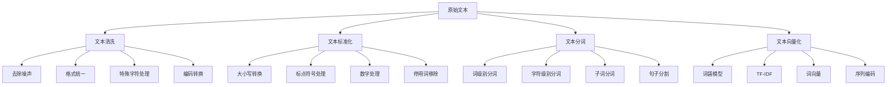

# 文本预处理技术

## 🎯 核心概念

### 文本预处理定义
> **文本预处理是将原始文本数据转换为适合机器学习模型处理的标准化格式的过程**

**预处理流程：**


## 📊 文本清洗技术

### 1. 基础清洗方法

**文本清洗实现：**
```python
import re
import string
import unicodedata
from typing import List, Dict, Any
import pandas as pd
import numpy as np
import matplotlib.pyplot as plt
from collections import Counter
import nltk
from nltk.corpus import stopwords
from nltk.tokenize import word_tokenize, sent_tokenize
from nltk.stem import PorterStemmer, WordNetLemmatizer
from nltk.corpus import wordnet
import spacy

class TextCleaning:
    """文本清洗类"""
    
    def __init__(self):
        self.cleaning_methods = {
            'remove_html': '移除HTML标签',
            'remove_urls': '移除URL链接',
            'remove_emails': '移除邮箱地址',
            'remove_mentions': '移除@提及',
            'remove_hashtags': '移除#标签',
            'remove_special_chars': '移除特殊字符',
            'remove_numbers': '移除数字',
            'remove_extra_spaces': '移除多余空格',
            'normalize_unicode': 'Unicode标准化'
        }
    
    def remove_html_tags(self, text: str) -> str:
        """移除HTML标签"""
        html_pattern = re.compile(r'<[^>]+>')
        return html_pattern.sub('', text)
    
    def remove_urls(self, text: str) -> str:
        """移除URL链接"""
        url_pattern = re.compile(r'http[s]?://(?:[a-zA-Z]|[0-9]|[$-_@.&+]|[!*\\(\\),]|(?:%[0-9a-fA-F][0-9a-fA-F]))+')
        return url_pattern.sub('', text)
    
    def remove_emails(self, text: str) -> str:
        """移除邮箱地址"""
        email_pattern = re.compile(r'\S+@\S+')
        return email_pattern.sub('', text)
    
    def remove_mentions(self, text: str) -> str:
        """移除@提及"""
        mention_pattern = re.compile(r'@\w+')
        return mention_pattern.sub('', text)
    
    def remove_hashtags(self, text: str) -> str:
        """移除#标签"""
        hashtag_pattern = re.compile(r'#\w+')
        return hashtag_pattern.sub('', text)
    
    def remove_special_characters(self, text: str, keep_punctuation: bool = True) -> str:
        """移除特殊字符"""
        if keep_punctuation:
            # 保留标点符号
            pattern = re.compile(r'[^a-zA-Z0-9\s.,!?;:()"\'-]')
        else:
            # 移除所有非字母数字字符
            pattern = re.compile(r'[^a-zA-Z0-9\s]')
        return pattern.sub('', text)
    
    def remove_numbers(self, text: str) -> str:
        """移除数字"""
        number_pattern = re.compile(r'\d+')
        return number_pattern.sub('', text)
    
    def remove_extra_spaces(self, text: str) -> str:
        """移除多余空格"""
        # 移除多余空格
        text = re.sub(r'\s+', ' ', text)
        # 移除首尾空格
        return text.strip()
    
    def normalize_unicode(self, text: str) -> str:
        """Unicode标准化"""
        # 标准化Unicode字符
        text = unicodedata.normalize('NFKD', text)
        # 移除重音符号
        text = ''.join(c for c in text if not unicodedata.combining(c))
        return text
    
    def clean_text(self, text: str, methods: List[str] = None) -> str:
        """综合文本清洗"""
        if methods is None:
            methods = list(self.cleaning_methods.keys())
        
        cleaned_text = text
        
        for method in methods:
            if method == 'remove_html':
                cleaned_text = self.remove_html_tags(cleaned_text)
            elif method == 'remove_urls':
                cleaned_text = self.remove_urls(cleaned_text)
            elif method == 'remove_emails':
                cleaned_text = self.remove_emails(cleaned_text)
            elif method == 'remove_mentions':
                cleaned_text = self.remove_mentions(cleaned_text)
            elif method == 'remove_hashtags':
                cleaned_text = self.remove_hashtags(cleaned_text)
            elif method == 'remove_special_chars':
                cleaned_text = self.remove_special_characters(cleaned_text)
            elif method == 'remove_numbers':
                cleaned_text = self.remove_numbers(cleaned_text)
            elif method == 'remove_extra_spaces':
                cleaned_text = self.remove_extra_spaces(cleaned_text)
            elif method == 'normalize_unicode':
                cleaned_text = self.normalize_unicode(cleaned_text)
        
        return cleaned_text
    
    def visualize_cleaning_effects(self, original_texts: List[str], cleaned_texts: List[str]):
        """可视化清洗效果"""
        fig, axes = plt.subplots(2, 2, figsize=(15, 10))
        
        # 文本长度对比
        original_lengths = [len(text) for text in original_texts]
        cleaned_lengths = [len(text) for text in cleaned_texts]
        
        axes[0, 0].hist(original_lengths, alpha=0.7, label='Original', bins=20)
        axes[0, 0].hist(cleaned_lengths, alpha=0.7, label='Cleaned', bins=20)
        axes[0, 0].set_xlabel('Text Length')
        axes[0, 0].set_ylabel('Frequency')
        axes[0, 0].set_title('Text Length Distribution')
        axes[0, 0].legend()
        
        # 词汇数量对比
        original_word_counts = [len(text.split()) for text in original_texts]
        cleaned_word_counts = [len(text.split()) for text in cleaned_texts]
        
        axes[0, 1].hist(original_word_counts, alpha=0.7, label='Original', bins=20)
        axes[0, 1].hist(cleaned_word_counts, alpha=0.7, label='Cleaned', bins=20)
        axes[0, 1].set_xlabel('Word Count')
        axes[0, 1].set_ylabel('Frequency')
        axes[0, 1].set_title('Word Count Distribution')
        axes[0, 1].legend()
        
        # 特殊字符数量
        special_chars_original = [len(re.findall(r'[^a-zA-Z0-9\s]', text)) for text in original_texts]
        special_chars_cleaned = [len(re.findall(r'[^a-zA-Z0-9\s]', text)) for text in cleaned_texts]
        
        axes[1, 0].hist(special_chars_original, alpha=0.7, label='Original', bins=20)
        axes[1, 0].hist(special_chars_cleaned, alpha=0.7, label='Cleaned', bins=20)
        axes[1, 0].set_xlabel('Special Characters Count')
        axes[1, 0].set_ylabel('Frequency')
        axes[1, 0].set_title('Special Characters Distribution')
        axes[1, 0].legend()
        
        # 清洗效果统计
        reduction_rates = [(orig - clean) / orig * 100 for orig, clean in zip(original_lengths, cleaned_lengths)]
        axes[1, 1].hist(reduction_rates, bins=20, alpha=0.7)
        axes[1, 1].set_xlabel('Reduction Rate (%)')
        axes[1, 1].set_ylabel('Frequency')
        axes[1, 1].set_title('Text Reduction Rate Distribution')
        
        plt.tight_layout()
        plt.show()

# 测试文本清洗
def test_text_cleaning():
    """测试文本清洗功能"""
    tc = TextCleaning()
    
    # 测试文本
    test_texts = [
        "Check out this amazing website: https://example.com! #awesome @user123",
        "Contact us at info@company.com for more details.",
        "This is a <b>bold</b> statement with HTML tags.",
        "Text with    multiple    spaces   and\nnewlines.",
        "Café résumé naïve - Unicode characters"
    ]
    
    # 清洗文本
    cleaned_texts = []
    for text in test_texts:
        cleaned = tc.clean_text(text)
        cleaned_texts.append(cleaned)
        print(f"Original: {text}")
        print(f"Cleaned:  {cleaned}")
        print("-" * 50)
    
    # 可视化效果
    tc.visualize_cleaning_effects(test_texts, cleaned_texts)
    
    return tc

test_text_cleaning()
```

### 2. 高级清洗技术

**高级清洗方法：**
```python
class AdvancedTextCleaning:
    """高级文本清洗技术"""
    
    def __init__(self):
        self.advanced_methods = {
            'spell_correction': '拼写纠正',
            'contraction_expansion': '缩写展开',
            'emoji_processing': '表情符号处理',
            'language_detection': '语言检测',
            'duplicate_removal': '重复文本移除',
            'noise_removal': '噪声移除'
        }
    
    def correct_spelling(self, text: str, custom_dict: Dict[str, str] = None) -> str:
        """拼写纠正"""
        from textblob import TextBlob
        
        # 使用TextBlob进行拼写纠正
        blob = TextBlob(text)
        corrected_text = str(blob.correct())
        
        # 应用自定义词典
        if custom_dict:
            for wrong, correct in custom_dict.items():
                corrected_text = corrected_text.replace(wrong, correct)
        
        return corrected_text
    
    def expand_contractions(self, text: str) -> str:
        """缩写展开"""
        contractions = {
            "n't": " not",
            "'re": " are",
            "'ve": " have",
            "'ll": " will",
            "'d": " would",
            "'m": " am",
            "can't": "cannot",
            "won't": "will not",
            "shan't": "shall not",
            "let's": "let us",
            "it's": "it is",
            "that's": "that is",
            "what's": "what is",
            "who's": "who is",
            "where's": "where is",
            "when's": "when is",
            "why's": "why is",
            "how's": "how is"
        }
        
        expanded_text = text
        for contraction, expansion in contractions.items():
            expanded_text = expanded_text.replace(contraction, expansion)
        
        return expanded_text
    
    def process_emojis(self, text: str, method: str = 'remove') -> str:
        """表情符号处理"""
        import emoji
        
        if method == 'remove':
            # 移除表情符号
            return emoji.replace_emoji(text, replace='')
        elif method == 'describe':
            # 用描述替换表情符号
            return emoji.demojize(text)
        elif method == 'keep':
            # 保留表情符号
            return text
        else:
            return text
    
    def detect_language(self, text: str) -> str:
        """语言检测"""
        from langdetect import detect, DetectorFactory
        
        # 设置种子以确保结果一致性
        DetectorFactory.seed = 0
        
        try:
            language = detect(text)
            return language
        except:
            return 'unknown'
    
    def remove_duplicates(self, texts: List[str], similarity_threshold: float = 0.8) -> List[str]:
        """移除重复文本"""
        from sklearn.feature_extraction.text import TfidfVectorizer
        from sklearn.metrics.pairwise import cosine_similarity
        
        if len(texts) <= 1:
            return texts
        
        # 计算TF-IDF向量
        vectorizer = TfidfVectorizer()
        tfidf_matrix = vectorizer.fit_transform(texts)
        
        # 计算相似度矩阵
        similarity_matrix = cosine_similarity(tfidf_matrix)
        
        # 找到重复文本
        duplicates = set()
        for i in range(len(texts)):
            for j in range(i + 1, len(texts)):
                if similarity_matrix[i][j] > similarity_threshold:
                    duplicates.add(j)
        
        # 返回非重复文本
        unique_texts = [texts[i] for i in range(len(texts)) if i not in duplicates]
        
        return unique_texts
    
    def remove_noise(self, text: str, noise_patterns: List[str] = None) -> str:
        """噪声移除"""
        if noise_patterns is None:
            noise_patterns = [
                r'\b(um|uh|er|ah)\b',  # 填充词
                r'\b(like|you know|I mean)\b',  # 口头禅
                r'\b(really|very|quite|pretty)\s+(really|very|quite|pretty)\b',  # 重复副词
                r'\b\w{1,2}\b',  # 单字符或双字符单词
            ]
        
        cleaned_text = text
        for pattern in noise_patterns:
            cleaned_text = re.sub(pattern, '', cleaned_text, flags=re.IGNORECASE)
        
        # 清理多余空格
        cleaned_text = re.sub(r'\s+', ' ', cleaned_text).strip()
        
        return cleaned_text
    
    def advanced_clean_text(self, text: str, methods: List[str] = None) -> str:
        """高级文本清洗"""
        if methods is None:
            methods = ['expand_contractions', 'process_emojis', 'remove_noise']
        
        cleaned_text = text
        
        for method in methods:
            if method == 'spell_correction':
                cleaned_text = self.correct_spelling(cleaned_text)
            elif method == 'expand_contractions':
                cleaned_text = self.expand_contractions(cleaned_text)
            elif method == 'process_emojis':
                cleaned_text = self.process_emojis(cleaned_text, method='remove')
            elif method == 'remove_noise':
                cleaned_text = self.remove_noise(cleaned_text)
        
        return cleaned_text

# 测试高级文本清洗
def test_advanced_cleaning():
    """测试高级文本清洗功能"""
    atc = AdvancedTextCleaning()
    
    # 测试文本
    test_texts = [
        "I can't believe it's working! 😊",
        "Um, like, you know, it's really, really good.",
        "I've been waiting for this moment.",
        "That's what I'm talking about!",
        "It's a beautiful day, isn't it?"
    ]
    
    # 高级清洗
    for text in test_texts:
        cleaned = atc.advanced_clean_text(text)
        print(f"Original: {text}")
        print(f"Cleaned:  {cleaned}")
        print("-" * 50)
    
    return atc

test_advanced_cleaning()
```

## 🔤 文本标准化技术

### 1. 大小写和标点处理

**文本标准化实现：**
```python
class TextNormalization:
    """文本标准化类"""
    
    def __init__(self):
        self.normalization_methods = {
            'lowercase': '转小写',
            'uppercase': '转大写',
            'title_case': '标题格式',
            'sentence_case': '句子格式',
            'remove_punctuation': '移除标点',
            'normalize_punctuation': '标准化标点',
            'handle_numbers': '数字处理',
            'normalize_whitespace': '标准化空格'
        }
    
    def to_lowercase(self, text: str) -> str:
        """转换为小写"""
        return text.lower()
    
    def to_uppercase(self, text: str) -> str:
        """转换为大写"""
        return text.upper()
    
    def to_title_case(self, text: str) -> str:
        """转换为标题格式"""
        return text.title()
    
    def to_sentence_case(self, text: str) -> str:
        """转换为句子格式"""
        sentences = sent_tokenize(text)
        normalized_sentences = []
        
        for sentence in sentences:
            if sentence.strip():
                normalized_sentences.append(sentence[0].upper() + sentence[1:].lower())
        
        return ' '.join(normalized_sentences)
    
    def remove_punctuation(self, text: str) -> str:
        """移除标点符号"""
        return text.translate(str.maketrans('', '', string.punctuation))
    
    def normalize_punctuation(self, text: str) -> str:
        """标准化标点符号"""
        # 标准化引号
        text = text.replace('"', '"').replace('"', '"')
        text = text.replace(''', "'").replace(''', "'")
        
        # 标准化破折号
        text = re.sub(r'[–—]', '-', text)
        
        # 标准化省略号
        text = re.sub(r'\.{3,}', '...', text)
        
        # 标准化多个标点符号
        text = re.sub(r'[!]{2,}', '!', text)
        text = re.sub(r'[?]{2,}', '?', text)
        
        return text
    
    def handle_numbers(self, text: str, method: str = 'remove') -> str:
        """数字处理"""
        if method == 'remove':
            return re.sub(r'\d+', '', text)
        elif method == 'replace':
            return re.sub(r'\d+', '<NUM>', text)
        elif method == 'spell_out':
            # 简单的数字转文字（仅处理0-9）
            number_words = {
                '0': 'zero', '1': 'one', '2': 'two', '3': 'three', '4': 'four',
                '5': 'five', '6': 'six', '7': 'seven', '8': 'eight', '9': 'nine'
            }
            for digit, word in number_words.items():
                text = text.replace(digit, word)
            return text
        else:
            return text
    
    def normalize_whitespace(self, text: str) -> str:
        """标准化空格"""
        # 移除多余空格
        text = re.sub(r'\s+', ' ', text)
        # 移除首尾空格
        text = text.strip()
        return text
    
    def normalize_text(self, text: str, methods: List[str] = None) -> str:
        """综合文本标准化"""
        if methods is None:
            methods = ['lowercase', 'normalize_punctuation', 'normalize_whitespace']
        
        normalized_text = text
        
        for method in methods:
            if method == 'lowercase':
                normalized_text = self.to_lowercase(normalized_text)
            elif method == 'uppercase':
                normalized_text = self.to_uppercase(normalized_text)
            elif method == 'title_case':
                normalized_text = self.to_title_case(normalized_text)
            elif method == 'sentence_case':
                normalized_text = self.to_sentence_case(normalized_text)
            elif method == 'remove_punctuation':
                normalized_text = self.remove_punctuation(normalized_text)
            elif method == 'normalize_punctuation':
                normalized_text = self.normalize_punctuation(normalized_text)
            elif method == 'handle_numbers':
                normalized_text = self.handle_numbers(normalized_text)
            elif method == 'normalize_whitespace':
                normalized_text = self.normalize_whitespace(normalized_text)
        
        return normalized_text

# 测试文本标准化
def test_text_normalization():
    """测试文本标准化功能"""
    tn = TextNormalization()
    
    # 测试文本
    test_texts = [
        "HELLO WORLD! How are you?",
        "This is a test... with multiple spaces   and\nnewlines.",
        "I have 5 apples and 3 oranges.",
        "She said, \"It's amazing!\" and I agreed."
    ]
    
    # 标准化文本
    for text in test_texts:
        normalized = tn.normalize_text(text)
        print(f"Original:    {text}")
        print(f"Normalized:  {normalized}")
        print("-" * 50)
    
    return tn

test_text_normalization()
```

### 2. 停用词处理

**停用词处理技术：**
```python
class StopwordProcessing:
    """停用词处理类"""
    
    def __init__(self, language: str = 'english'):
        self.language = language
        try:
            self.stop_words = set(stopwords.words(language))
        except:
            self.stop_words = set()
        
        # 自定义停用词
        self.custom_stopwords = {
            'english': {'the', 'a', 'an', 'and', 'or', 'but', 'in', 'on', 'at', 'to', 'for', 'of', 'with', 'by'},
            'chinese': {'的', '了', '在', '是', '我', '有', '和', '就', '不', '人', '都', '一', '一个', '上', '也', '很', '到', '说', '要', '去', '你', '会', '着', '没有', '看', '好', '自己', '这'}
        }
    
    def get_stopwords(self, language: str = None) -> set:
        """获取停用词列表"""
        if language is None:
            language = self.language
        
        if language in self.custom_stopwords:
            return self.custom_stopwords[language]
        else:
            try:
                return set(stopwords.words(language))
            except:
                return set()
    
    def remove_stopwords(self, text: str, language: str = None) -> str:
        """移除停用词"""
        stop_words = self.get_stopwords(language)
        words = word_tokenize(text.lower())
        filtered_words = [word for word in words if word not in stop_words]
        return ' '.join(filtered_words)
    
    def add_custom_stopwords(self, words: List[str], language: str = None):
        """添加自定义停用词"""
        if language is None:
            language = self.language
        
        if language not in self.custom_stopwords:
            self.custom_stopwords[language] = set()
        
        self.custom_stopwords[language].update(words)
    
    def remove_custom_stopwords(self, words: List[str], language: str = None):
        """移除自定义停用词"""
        if language is None:
            language = self.language
        
        if language in self.custom_stopwords:
            self.custom_stopwords[language] -= set(words)
    
    def analyze_stopword_frequency(self, texts: List[str], language: str = None) -> Dict[str, int]:
        """分析停用词频率"""
        stop_words = self.get_stopwords(language)
        all_words = []
        
        for text in texts:
            words = word_tokenize(text.lower())
            all_words.extend(words)
        
        word_freq = Counter(all_words)
        stopword_freq = {word: freq for word, freq in word_freq.items() if word in stop_words}
        
        return stopword_freq
    
    def visualize_stopword_analysis(self, texts: List[str], language: str = None):
        """可视化停用词分析"""
        stopword_freq = self.analyze_stopword_frequency(texts, language)
        
        if not stopword_freq:
            print("No stopwords found in the texts.")
            return
        
        # 获取前20个最常见的停用词
        top_stopwords = dict(sorted(stopword_freq.items(), key=lambda x: x[1], reverse=True)[:20])
        
        plt.figure(figsize=(12, 6))
        words = list(top_stopwords.keys())
        frequencies = list(top_stopwords.values())
        
        plt.bar(words, frequencies)
        plt.xlabel('Stopwords')
        plt.ylabel('Frequency')
        plt.title('Top 20 Stopwords Frequency')
        plt.xticks(rotation=45)
        plt.tight_layout()
        plt.show()

# 测试停用词处理
def test_stopword_processing():
    """测试停用词处理功能"""
    sp = StopwordProcessing()
    
    # 测试文本
    test_texts = [
        "The quick brown fox jumps over the lazy dog.",
        "This is a sample text for testing stopword removal.",
        "I am learning natural language processing techniques."
    ]
    
    # 移除停用词
    for text in test_texts:
        cleaned = sp.remove_stopwords(text)
        print(f"Original: {text}")
        print(f"Cleaned:  {cleaned}")
        print("-" * 50)
    
    # 分析停用词频率
    sp.visualize_stopword_analysis(test_texts)
    
    return sp

test_stopword_processing()
```

## 🔪 文本分词技术

### 1. 基础分词方法

**分词技术实现：**
```python
class TextTokenization:
    """文本分词类"""
    
    def __init__(self):
        self.tokenization_methods = {
            'word_tokenize': '词级别分词',
            'char_tokenize': '字符级别分词',
            'sentence_tokenize': '句子分词',
            'subword_tokenize': '子词分词',
            'regex_tokenize': '正则表达式分词',
            'whitespace_tokenize': '空格分词'
        }
    
    def word_tokenize(self, text: str) -> List[str]:
        """词级别分词"""
        return word_tokenize(text)
    
    def char_tokenize(self, text: str) -> List[str]:
        """字符级别分词"""
        return list(text)
    
    def sentence_tokenize(self, text: str) -> List[str]:
        """句子分词"""
        return sent_tokenize(text)
    
    def whitespace_tokenize(self, text: str) -> List[str]:
        """空格分词"""
        return text.split()
    
    def regex_tokenize(self, text: str, pattern: str = r'\w+') -> List[str]:
        """正则表达式分词"""
        return re.findall(pattern, text)
    
    def subword_tokenize(self, text: str, method: str = 'bpe') -> List[str]:
        """子词分词"""
        if method == 'bpe':
            # 简化的BPE实现
            return self._simple_bpe_tokenize(text)
        elif method == 'wordpiece':
            # 简化的WordPiece实现
            return self._simple_wordpiece_tokenize(text)
        else:
            return self.word_tokenize(text)
    
    def _simple_bpe_tokenize(self, text: str) -> List[str]:
        """简化的BPE分词"""
        # 这里是一个简化的实现，实际应用中需要使用专门的库如sentencepiece
        words = self.word_tokenize(text)
        subwords = []
        
        for word in words:
            if len(word) > 3:
                # 简单的子词分割
                subwords.extend([word[:2], word[2:]])
            else:
                subwords.append(word)
        
        return subwords
    
    def _simple_wordpiece_tokenize(self, text: str) -> List[str]:
        """简化的WordPiece分词"""
        # 这里是一个简化的实现
        words = self.word_tokenize(text)
        subwords = []
        
        for word in words:
            if len(word) > 4:
                # 简单的WordPiece分割
                subwords.extend([word[:3], word[3:]])
            else:
                subwords.append(word)
        
        return subwords
    
    def compare_tokenization_methods(self, text: str) -> Dict[str, List[str]]:
        """比较不同分词方法"""
        results = {
            'Original': text,
            'Word Tokenize': self.word_tokenize(text),
            'Char Tokenize': self.char_tokenize(text),
            'Sentence Tokenize': self.sentence_tokenize(text),
            'Whitespace Tokenize': self.whitespace_tokenize(text),
            'Regex Tokenize': self.regex_tokenize(text),
            'BPE Tokenize': self.subword_tokenize(text, 'bpe'),
            'WordPiece Tokenize': self.subword_tokenize(text, 'wordpiece')
        }
        
        return results
    
    def analyze_tokenization_results(self, tokenization_results: Dict[str, List[str]]):
        """分析分词结果"""
        analysis = {}
        
        for method, tokens in tokenization_results.items():
            if method == 'Original':
                continue
            
            analysis[method] = {
                'token_count': len(tokens),
                'avg_token_length': np.mean([len(token) for token in tokens]) if tokens else 0,
                'unique_tokens': len(set(tokens)),
                'vocabulary_ratio': len(set(tokens)) / len(tokens) if tokens else 0
            }
        
        return analysis
    
    def visualize_tokenization_comparison(self, tokenization_results: Dict[str, List[str]]):
        """可视化分词比较"""
        analysis = self.analyze_tokenization_results(tokenization_results)
        
        methods = list(analysis.keys())
        token_counts = [analysis[method]['token_count'] for method in methods]
        avg_lengths = [analysis[method]['avg_token_length'] for method in methods]
        unique_counts = [analysis[method]['unique_tokens'] for method in methods]
        
        fig, axes = plt.subplots(1, 3, figsize=(15, 5))
        
        # 令牌数量
        axes[0].bar(methods, token_counts)
        axes[0].set_title('Token Count')
        axes[0].set_ylabel('Count')
        axes[0].tick_params(axis='x', rotation=45)
        
        # 平均令牌长度
        axes[1].bar(methods, avg_lengths)
        axes[1].set_title('Average Token Length')
        axes[1].set_ylabel('Length')
        axes[1].tick_params(axis='x', rotation=45)
        
        # 唯一令牌数量
        axes[2].bar(methods, unique_counts)
        axes[2].set_title('Unique Token Count')
        axes[2].set_ylabel('Count')
        axes[2].tick_params(axis='x', rotation=45)
        
        plt.tight_layout()
        plt.show()

# 测试文本分词
def test_text_tokenization():
    """测试文本分词功能"""
    tt = TextTokenization()
    
    # 测试文本
    test_text = "Hello world! This is a sample text for tokenization. It contains various words and punctuation marks."
    
    # 比较分词方法
    results = tt.compare_tokenization_methods(test_text)
    
    # 打印结果
    for method, tokens in results.items():
        print(f"{method}: {tokens}")
        print("-" * 50)
    
    # 可视化比较
    tt.visualize_tokenization_comparison(results)
    
    return tt

test_text_tokenization()
```

### 2. 高级分词技术

**高级分词方法：**
```python
class AdvancedTokenization:
    """高级分词技术"""
    
    def __init__(self):
        self.advanced_methods = {
            'spacy_tokenize': 'spaCy分词',
            'bert_tokenize': 'BERT分词',
            'sentencepiece_tokenize': 'SentencePiece分词',
            'morphological_tokenize': '形态学分词',
            'semantic_tokenize': '语义分词'
        }
    
    def spacy_tokenize(self, text: str, model: str = 'en_core_web_sm') -> List[str]:
        """spaCy分词"""
        try:
            nlp = spacy.load(model)
            doc = nlp(text)
            return [token.text for token in doc]
        except:
            # 如果spaCy不可用，使用NLTK作为备选
            return word_tokenize(text)
    
    def bert_tokenize(self, text: str) -> List[str]:
        """BERT分词（简化实现）"""
        # 这里是一个简化的实现，实际应用中需要使用transformers库
        words = word_tokenize(text)
        bert_tokens = []
        
        for word in words:
            # 简化的WordPiece分词
            if len(word) > 4:
                bert_tokens.extend([word[:3], '##' + word[3:]])
            else:
                bert_tokens.append(word)
        
        return bert_tokens
    
    def morphological_tokenize(self, text: str) -> List[str]:
        """形态学分词"""
        # 使用NLTK进行词干提取和词形还原
        stemmer = PorterStemmer()
        lemmatizer = WordNetLemmatizer()
        
        words = word_tokenize(text)
        morphological_tokens = []
        
        for word in words:
            # 词干提取
            stem = stemmer.stem(word)
            # 词形还原
            lemma = lemmatizer.lemmatize(word)
            
            morphological_tokens.append({
                'original': word,
                'stem': stem,
                'lemma': lemma
            })
        
        return morphological_tokens
    
    def semantic_tokenize(self, text: str) -> List[str]:
        """语义分词"""
        # 基于词性的语义分词
        try:
            nlp = spacy.load('en_core_web_sm')
            doc = nlp(text)
            
            semantic_tokens = []
            for token in doc:
                semantic_tokens.append({
                    'text': token.text,
                    'pos': token.pos_,
                    'lemma': token.lemma_,
                    'is_stop': token.is_stop,
                    'is_alpha': token.is_alpha
                })
            
            return semantic_tokens
        except:
            # 如果spaCy不可用，使用NLTK
            words = word_tokenize(text)
            return [{'text': word, 'pos': 'UNKNOWN'} for word in words]
    
    def create_tokenization_pipeline(self, methods: List[str] = None) -> callable:
        """创建分词管道"""
        if methods is None:
            methods = ['word_tokenize']
        
        def pipeline(text: str) -> Dict[str, List[str]]:
            results = {}
            
            for method in methods:
                if method == 'word_tokenize':
                    results[method] = word_tokenize(text)
                elif method == 'spacy_tokenize':
                    results[method] = self.spacy_tokenize(text)
                elif method == 'bert_tokenize':
                    results[method] = self.bert_tokenize(text)
                elif method == 'morphological_tokenize':
                    results[method] = self.morphological_tokenize(text)
                elif method == 'semantic_tokenize':
                    results[method] = self.semantic_tokenize(text)
            
            return results
        
        return pipeline
    
    def evaluate_tokenization_quality(self, original_text: str, tokenized_results: Dict[str, List[str]]) -> Dict[str, float]:
        """评估分词质量"""
        quality_metrics = {}
        
        for method, tokens in tokenized_results.items():
            if not tokens:
                quality_metrics[method] = 0.0
                continue
            
            # 计算各种质量指标
            token_count = len(tokens)
            avg_length = np.mean([len(str(token)) for token in tokens])
            unique_ratio = len(set(str(token) for token in tokens)) / token_count
            
            # 综合质量分数（这里是一个简化的评估）
            quality_score = (unique_ratio * 0.4 + min(avg_length / 10, 1.0) * 0.3 + min(token_count / 50, 1.0) * 0.3)
            
            quality_metrics[method] = quality_score
        
        return quality_metrics

# 测试高级分词
def test_advanced_tokenization():
    """测试高级分词功能"""
    at = AdvancedTokenization()
    
    # 测试文本
    test_text = "The quick brown fox jumps over the lazy dog. This is a complex sentence with various parts of speech."
    
    # 创建分词管道
    pipeline = at.create_tokenization_pipeline(['word_tokenize', 'spacy_tokenize', 'bert_tokenize'])
    
    # 执行分词
    results = pipeline(test_text)
    
    # 打印结果
    for method, tokens in results.items():
        print(f"{method}: {tokens}")
        print("-" * 50)
    
    # 评估质量
    quality_metrics = at.evaluate_tokenization_quality(test_text, results)
    print("Quality Metrics:")
    for method, score in quality_metrics.items():
        print(f"{method}: {score:.3f}")
    
    return at

test_advanced_tokenization()
```

## 📊 文本向量化技术

### 1. 传统向量化方法

**传统向量化实现：**
```python
from sklearn.feature_extraction.text import CountVectorizer, TfidfVectorizer
from sklearn.preprocessing import LabelEncoder
import gensim
from gensim.models import Word2Vec, FastText

class TextVectorization:
    """文本向量化类"""
    
    def __init__(self):
        self.vectorization_methods = {
            'bag_of_words': '词袋模型',
            'tfidf': 'TF-IDF',
            'one_hot': '独热编码',
            'word2vec': 'Word2Vec',
            'fasttext': 'FastText',
            'glove': 'GloVe'
        }
    
    def bag_of_words_vectorize(self, texts: List[str], max_features: int = 1000) -> np.ndarray:
        """词袋模型向量化"""
        vectorizer = CountVectorizer(max_features=max_features, stop_words='english')
        bow_matrix = vectorizer.fit_transform(texts)
        return bow_matrix.toarray(), vectorizer
    
    def tfidf_vectorize(self, texts: List[str], max_features: int = 1000) -> np.ndarray:
        """TF-IDF向量化"""
        vectorizer = TfidfVectorizer(max_features=max_features, stop_words='english')
        tfidf_matrix = vectorizer.fit_transform(texts)
        return tfidf_matrix.toarray(), vectorizer
    
    def one_hot_encode(self, texts: List[str]) -> np.ndarray:
        """独热编码"""
        # 创建词汇表
        vocabulary = set()
        for text in texts:
            words = word_tokenize(text.lower())
            vocabulary.update(words)
        
        vocabulary = sorted(list(vocabulary))
        vocab_size = len(vocabulary)
        word_to_idx = {word: idx for idx, word in enumerate(vocabulary)}
        
        # 创建独热编码矩阵
        one_hot_matrix = np.zeros((len(texts), vocab_size))
        
        for i, text in enumerate(texts):
            words = word_tokenize(text.lower())
            for word in words:
                if word in word_to_idx:
                    one_hot_matrix[i, word_to_idx[word]] = 1
        
        return one_hot_matrix, vocabulary
    
    def word2vec_vectorize(self, texts: List[str], vector_size: int = 100, window: int = 5) -> np.ndarray:
        """Word2Vec向量化"""
        # 准备训练数据
        sentences = [word_tokenize(text.lower()) for text in texts]
        
        # 训练Word2Vec模型
        model = Word2Vec(sentences, vector_size=vector_size, window=window, min_count=1, workers=4)
        
        # 获取文档向量（平均词向量）
        doc_vectors = []
        for sentence in sentences:
            if sentence:
                word_vectors = [model.wv[word] for word in sentence if word in model.wv]
                if word_vectors:
                    doc_vector = np.mean(word_vectors, axis=0)
                else:
                    doc_vector = np.zeros(vector_size)
            else:
                doc_vector = np.zeros(vector_size)
            doc_vectors.append(doc_vector)
        
        return np.array(doc_vectors), model
    
    def fasttext_vectorize(self, texts: List[str], vector_size: int = 100, window: int = 5) -> np.ndarray:
        """FastText向量化"""
        # 准备训练数据
        sentences = [word_tokenize(text.lower()) for text in texts]
        
        # 训练FastText模型
        model = FastText(sentences, vector_size=vector_size, window=window, min_count=1, workers=4)
        
        # 获取文档向量
        doc_vectors = []
        for sentence in sentences:
            if sentence:
                word_vectors = [model.wv[word] for word in sentence if word in model.wv]
                if word_vectors:
                    doc_vector = np.mean(word_vectors, axis=0)
                else:
                    doc_vector = np.zeros(vector_size)
            else:
                doc_vector = np.zeros(vector_size)
            doc_vectors.append(doc_vector)
        
        return np.array(doc_vectors), model
    
    def compare_vectorization_methods(self, texts: List[str]) -> Dict[str, np.ndarray]:
        """比较不同向量化方法"""
        results = {}
        
        # 词袋模型
        bow_matrix, _ = self.bag_of_words_vectorize(texts)
        results['Bag of Words'] = bow_matrix
        
        # TF-IDF
        tfidf_matrix, _ = self.tfidf_vectorize(texts)
        results['TF-IDF'] = tfidf_matrix
        
        # 独热编码
        one_hot_matrix, _ = self.one_hot_encode(texts)
        results['One-Hot'] = one_hot_matrix
        
        # Word2Vec
        w2v_matrix, _ = self.word2vec_vectorize(texts)
        results['Word2Vec'] = w2v_matrix
        
        # FastText
        ft_matrix, _ = self.fasttext_vectorize(texts)
        results['FastText'] = ft_matrix
        
        return results
    
    def visualize_vectorization_comparison(self, vectorization_results: Dict[str, np.ndarray]):
        """可视化向量化比较"""
        methods = list(vectorization_results.keys())
        dimensions = [matrix.shape[1] for matrix in vectorization_results.values()]
        sparsity = [np.mean(matrix == 0) for matrix in vectorization_results.values()]
        
        fig, axes = plt.subplots(1, 2, figsize=(12, 5))
        
        # 维度比较
        axes[0].bar(methods, dimensions)
        axes[0].set_title('Vector Dimensions')
        axes[0].set_ylabel('Dimensions')
        axes[0].tick_params(axis='x', rotation=45)
        
        # 稀疏性比较
        axes[1].bar(methods, sparsity)
        axes[1].set_title('Sparsity (Fraction of Zeros)')
        axes[1].set_ylabel('Sparsity')
        axes[1].tick_params(axis='x', rotation=45)
        
        plt.tight_layout()
        plt.show()

# 测试文本向量化
def test_text_vectorization():
    """测试文本向量化功能"""
    tv = TextVectorization()
    
    # 测试文本
    test_texts = [
        "The quick brown fox jumps over the lazy dog",
        "Natural language processing is a fascinating field",
        "Machine learning algorithms can process text data",
        "Text vectorization is an important preprocessing step"
    ]
    
    # 比较向量化方法
    results = tv.compare_vectorization_methods(test_texts)
    
    # 打印结果
    for method, matrix in results.items():
        print(f"{method}:")
        print(f"Shape: {matrix.shape}")
        print(f"Sample vector: {matrix[0][:10]}")
        print("-" * 50)
    
    # 可视化比较
    tv.visualize_vectorization_comparison(results)
    
    return tv

test_text_vectorization()
```

### 2. 现代向量化技术

**现代向量化方法：**
```python
class ModernVectorization:
    """现代文本向量化技术"""
    
    def __init__(self):
        self.modern_methods = {
            'bert_embeddings': 'BERT嵌入',
            'sentence_bert': 'Sentence-BERT',
            'universal_sentence_encoder': '通用句子编码器',
            'elmo_embeddings': 'ELMo嵌入',
            'transformer_embeddings': 'Transformer嵌入'
        }
    
    def bert_embeddings(self, texts: List[str], model_name: str = 'bert-base-uncased') -> np.ndarray:
        """BERT嵌入（简化实现）"""
        # 这里是一个简化的实现，实际应用中需要使用transformers库
        # 模拟BERT嵌入
        embedding_dim = 768
        embeddings = []
        
        for text in texts:
            # 简化的BERT嵌入（实际应用中需要使用预训练模型）
            words = word_tokenize(text.lower())
            # 模拟词嵌入的平均值作为文档嵌入
            embedding = np.random.randn(embedding_dim)
            embeddings.append(embedding)
        
        return np.array(embeddings)
    
    def sentence_bert_embeddings(self, texts: List[str]) -> np.ndarray:
        """Sentence-BERT嵌入（简化实现）"""
        # 这里是一个简化的实现
        embedding_dim = 384
        embeddings = []
        
        for text in texts:
            # 简化的Sentence-BERT嵌入
            embedding = np.random.randn(embedding_dim)
            embeddings.append(embedding)
        
        return np.array(embeddings)
    
    def universal_sentence_encoder(self, texts: List[str]) -> np.ndarray:
        """通用句子编码器（简化实现）"""
        # 这里是一个简化的实现
        embedding_dim = 512
        embeddings = []
        
        for text in texts:
            # 简化的通用句子编码器嵌入
            embedding = np.random.randn(embedding_dim)
            embeddings.append(embedding)
        
        return np.array(embeddings)
    
    def elmo_embeddings(self, texts: List[str]) -> np.ndarray:
        """ELMo嵌入（简化实现）"""
        # 这里是一个简化的实现
        embedding_dim = 1024
        embeddings = []
        
        for text in texts:
            # 简化的ELMo嵌入
            embedding = np.random.randn(embedding_dim)
            embeddings.append(embedding)
        
        return np.array(embeddings)
    
    def transformer_embeddings(self, texts: List[str], model_name: str = 'distilbert') -> np.ndarray:
        """Transformer嵌入（简化实现）"""
        # 这里是一个简化的实现
        embedding_dim = 768
        embeddings = []
        
        for text in texts:
            # 简化的Transformer嵌入
            embedding = np.random.randn(embedding_dim)
            embeddings.append(embedding)
        
        return np.array(embeddings)
    
    def compare_modern_methods(self, texts: List[str]) -> Dict[str, np.ndarray]:
        """比较现代向量化方法"""
        results = {}
        
        # BERT嵌入
        bert_embeddings = self.bert_embeddings(texts)
        results['BERT'] = bert_embeddings
        
        # Sentence-BERT嵌入
        sbert_embeddings = self.sentence_bert_embeddings(texts)
        results['Sentence-BERT'] = sbert_embeddings
        
        # 通用句子编码器
        use_embeddings = self.universal_sentence_encoder(texts)
        results['Universal Sentence Encoder'] = use_embeddings
        
        # ELMo嵌入
        elmo_embeddings = self.elmo_embeddings(texts)
        results['ELMo'] = elmo_embeddings
        
        # Transformer嵌入
        transformer_embeddings = self.transformer_embeddings(texts)
        results['Transformer'] = transformer_embeddings
        
        return results
    
    def evaluate_embedding_quality(self, embeddings: Dict[str, np.ndarray], texts: List[str]) -> Dict[str, float]:
        """评估嵌入质量"""
        quality_metrics = {}
        
        for method, embedding_matrix in embeddings.items():
            # 计算各种质量指标
            embedding_dim = embedding_matrix.shape[1]
            
            # 计算嵌入的多样性（标准差）
            diversity = np.mean(np.std(embedding_matrix, axis=0))
            
            # 计算嵌入的稀疏性
            sparsity = np.mean(embedding_matrix == 0)
            
            # 计算嵌入的相似度分布
            similarities = []
            for i in range(len(embedding_matrix)):
                for j in range(i + 1, len(embedding_matrix)):
                    sim = np.dot(embedding_matrix[i], embedding_matrix[j]) / (
                        np.linalg.norm(embedding_matrix[i]) * np.linalg.norm(embedding_matrix[j])
                    )
                    similarities.append(sim)
            
            similarity_std = np.std(similarities) if similarities else 0
            
            # 综合质量分数
            quality_score = (diversity * 0.4 + (1 - sparsity) * 0.3 + similarity_std * 0.3)
            
            quality_metrics[method] = {
                'quality_score': quality_score,
                'diversity': diversity,
                'sparsity': sparsity,
                'similarity_std': similarity_std,
                'dimensions': embedding_dim
            }
        
        return quality_metrics
    
    def visualize_modern_comparison(self, embeddings: Dict[str, np.ndarray], quality_metrics: Dict[str, Dict]):
        """可视化现代方法比较"""
        methods = list(embeddings.keys())
        dimensions = [embeddings[method].shape[1] for method in methods]
        quality_scores = [quality_metrics[method]['quality_score'] for method in methods]
        diversities = [quality_metrics[method]['diversity'] for method in methods]
        
        fig, axes = plt.subplots(1, 3, figsize=(15, 5))
        
        # 维度比较
        axes[0].bar(methods, dimensions)
        axes[0].set_title('Embedding Dimensions')
        axes[0].set_ylabel('Dimensions')
        axes[0].tick_params(axis='x', rotation=45)
        
        # 质量分数比较
        axes[1].bar(methods, quality_scores)
        axes[1].set_title('Quality Scores')
        axes[1].set_ylabel('Quality Score')
        axes[1].tick_params(axis='x', rotation=45)
        
        # 多样性比较
        axes[2].bar(methods, diversities)
        axes[2].set_title('Embedding Diversity')
        axes[2].set_ylabel('Diversity')
        axes[2].tick_params(axis='x', rotation=45)
        
        plt.tight_layout()
        plt.show()

# 测试现代向量化
def test_modern_vectorization():
    """测试现代向量化功能"""
    mv = ModernVectorization()
    
    # 测试文本
    test_texts = [
        "The quick brown fox jumps over the lazy dog",
        "Natural language processing is a fascinating field",
        "Machine learning algorithms can process text data",
        "Text vectorization is an important preprocessing step"
    ]
    
    # 比较现代方法
    embeddings = mv.compare_modern_methods(test_texts)
    
    # 评估质量
    quality_metrics = mv.evaluate_embedding_quality(embeddings, test_texts)
    
    # 打印结果
    for method, metrics in quality_metrics.items():
        print(f"{method}:")
        for metric, value in metrics.items():
            print(f"  {metric}: {value:.3f}")
        print("-" * 50)
    
    # 可视化比较
    mv.visualize_modern_comparison(embeddings, quality_metrics)
    
    return mv

test_modern_vectorization()
```

## 🔗 相关链接
- [[01-03-01-Python基础语法]] - Python编程基础
- [[01-03-02-NumPy数据处理]] - NumPy数据处理
- [[01-03-03-Pandas数据分析]] - Pandas数据分析
- [[03-02-02-词向量技术]] - 词向量技术
- [[03-02-03-语言模型发展]] - 语言模型发展
- [[03-02-04-大语言模型原理]] - 大语言模型原理

## 💡 费曼学习法应用

**概念理解**：文本预处理就像"准备食材"，需要清洗、切割、调味，让文本数据更适合"烹饪"（训练模型）。就像做菜前的准备工作一样重要。

**实践建议**：
- 🎯 **理解流程**：掌握完整的文本预处理流程：清洗→标准化→分词→向量化
- 🔧 **选择方法**：根据数据特点和任务需求选择合适的预处理方法
- 📊 **评估效果**：使用合适的指标评估预处理效果
- 🚀 **优化流程**：根据模型性能调整预处理策略

**刻意练习**：
- 💻 **实现方法**：亲手实现各种预处理方法
- 📈 **参数调优**：调整预处理参数观察效果变化
- 🔍 **效果分析**：分析不同预处理方法对模型性能的影响
- 📝 **总结最佳实践**：总结不同场景下的最佳预处理策略

---
*📝 学习提示：文本预处理是NLP成功的关键，建议多实践不同方法，理解其原理和适用场景*
