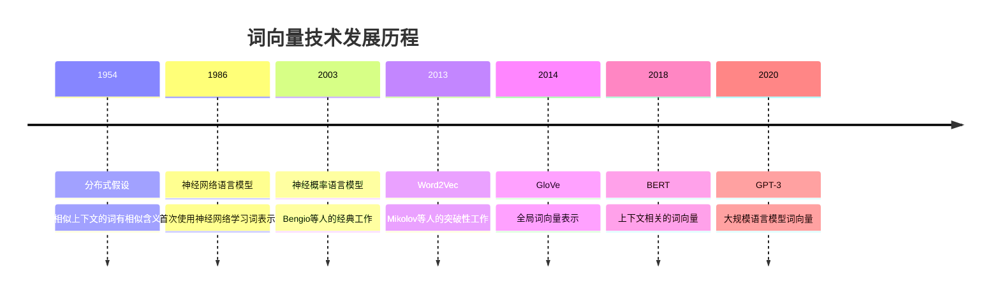

# 词向量技术

## 🎯 核心概念

### 词向量定义
> **词向量是将词语映射到高维空间中的稠密向量表示，能够捕获词语的语义和语法信息**

**词向量发展历程：**


## 📊 传统词向量方法

### 1. 统计方法

**基于统计的词向量：**
```python
import numpy as np
import matplotlib.pyplot as plt
from sklearn.decomposition import PCA, TruncatedSVD
from sklearn.manifold import TSNE
from collections import defaultdict, Counter
import pandas as pd
from scipy.sparse import coo_matrix
import gensim
from gensim.models import Word2Vec, KeyedVectors

class StatisticalWordVectors:
    """基于统计的词向量方法"""
    
    def __init__(self):
        self.methods = {
            'co_occurrence': '共现矩阵',
            'ppmi': 'PPMI矩阵',
            'svd': 'SVD分解',
            'lda': 'LDA主题模型'
        }
    
    def build_co_occurrence_matrix(self, texts, window_size=2, vocab_size=1000):
        """构建共现矩阵"""
        # 构建词汇表
        word_counts = Counter()
        for text in texts:
            words = text.lower().split()
            word_counts.update(words)
        
        # 选择最常见的词汇
        vocab = [word for word, count in word_counts.most_common(vocab_size)]
        word_to_idx = {word: idx for idx, word in enumerate(vocab)}
        
        # 构建共现矩阵
        co_occurrence = np.zeros((vocab_size, vocab_size))
        
        for text in texts:
            words = text.lower().split()
            for i, word in enumerate(words):
                if word in word_to_idx:
                    # 考虑窗口内的其他词
                    start = max(0, i - window_size)
                    end = min(len(words), i + window_size + 1)
                    
                    for j in range(start, end):
                        if i != j and words[j] in word_to_idx:
                            co_occurrence[word_to_idx[word], word_to_idx[words[j]]] += 1
        
        return co_occurrence, vocab
    
    def build_ppmi_matrix(self, co_occurrence_matrix, vocab):
        """构建PPMI矩阵"""
        # 计算总词频
        total_count = np.sum(co_occurrence_matrix)
        
        # 计算边际概率
        word_counts = np.sum(co_occurrence_matrix, axis=1)
        context_counts = np.sum(co_occurrence_matrix, axis=0)
        
        # 计算PPMI
        ppmi_matrix = np.zeros_like(co_occurrence_matrix)
        
        for i in range(len(vocab)):
            for j in range(len(vocab)):
                if co_occurrence_matrix[i, j] > 0:
                    # 计算PMI
                    pmi = np.log2(
                        (co_occurrence_matrix[i, j] * total_count) / 
                        (word_counts[i] * context_counts[j])
                    )
                    # 计算PPMI
                    ppmi_matrix[i, j] = max(0, pmi)
        
        return ppmi_matrix
    
    def svd_decomposition(self, matrix, n_components=100):
        """SVD分解降维"""
        svd = TruncatedSVD(n_components=n_components, random_state=42)
        word_vectors = svd.fit_transform(matrix)
        return word_vectors, svd
    
    def lda_word_vectors(self, texts, num_topics=50, vocab_size=1000):
        """LDA主题模型词向量"""
        from gensim import corpora
        from gensim.models import LdaModel
        
        # 准备数据
        documents = [text.lower().split() for text in texts]
        
        # 创建词典
        dictionary = corpora.Dictionary(documents)
        dictionary.filter_extremes(no_below=2, no_above=0.8, keep_n=vocab_size)
        
        # 创建语料库
        corpus = [dictionary.doc2bow(doc) for doc in documents]
        
        # 训练LDA模型
        lda_model = LdaModel(corpus, num_topics=num_topics, id2word=dictionary, random_state=42)
        
        # 获取词向量（主题分布）
        word_vectors = []
        for word_id in range(len(dictionary)):
            word_topics = lda_model.get_term_topics(word_id, minimum_probability=0)
            word_vector = np.zeros(num_topics)
            for topic_id, prob in word_topics:
                word_vector[topic_id] = prob
            word_vectors.append(word_vector)
        
        return np.array(word_vectors), dictionary, lda_model
    
    def visualize_word_vectors(self, word_vectors, vocab, method='pca', n_words=100):
        """可视化词向量"""
        # 选择要可视化的词
        if len(vocab) > n_words:
            indices = np.random.choice(len(vocab), n_words, replace=False)
            vectors = word_vectors[indices]
            words = [vocab[i] for i in indices]
        else:
            vectors = word_vectors
            words = vocab
        
        # 降维
        if method == 'pca':
            reducer = PCA(n_components=2, random_state=42)
        elif method == 'tsne':
            reducer = TSNE(n_components=2, random_state=42)
        else:
            reducer = PCA(n_components=2, random_state=42)
        
        vectors_2d = reducer.fit_transform(vectors)
        
        # 可视化
        plt.figure(figsize=(12, 8))
        plt.scatter(vectors_2d[:, 0], vectors_2d[:, 1], alpha=0.7)
        
        # 添加词标签
        for i, word in enumerate(words):
            plt.annotate(word, (vectors_2d[i, 0], vectors_2d[i, 1]), 
                        xytext=(5, 5), textcoords='offset points', fontsize=8)
        
        plt.title(f'Word Vectors Visualization ({method.upper()})')
        plt.xlabel('Component 1')
        plt.ylabel('Component 2')
        plt.tight_layout()
        plt.show()
    
    def find_similar_words(self, word_vectors, vocab, target_word, top_k=10):
        """查找相似词"""
        if target_word not in vocab:
            return []
        
        target_idx = vocab.index(target_word)
        target_vector = word_vectors[target_idx]
        
        # 计算余弦相似度
        similarities = []
        for i, vector in enumerate(word_vectors):
            if i != target_idx:
                similarity = np.dot(target_vector, vector) / (
                    np.linalg.norm(target_vector) * np.linalg.norm(vector)
                )
                similarities.append((vocab[i], similarity))
        
        # 排序并返回前k个
        similarities.sort(key=lambda x: x[1], reverse=True)
        return similarities[:top_k]

# 测试统计词向量
def test_statistical_word_vectors():
    """测试统计词向量方法"""
    swv = StatisticalWordVectors()
    
    # 测试文本
    test_texts = [
        "the quick brown fox jumps over the lazy dog",
        "natural language processing is a fascinating field",
        "machine learning algorithms can process text data",
        "artificial intelligence is transforming the world",
        "deep learning models are very powerful",
        "neural networks can learn complex patterns",
        "computer vision and natural language processing",
        "text mining and information retrieval techniques"
    ]
    
    # 构建共现矩阵
    co_occurrence, vocab = swv.build_co_occurrence_matrix(test_texts, window_size=2, vocab_size=50)
    
    # 构建PPMI矩阵
    ppmi_matrix = swv.build_ppmi_matrix(co_occurrence, vocab)
    
    # SVD分解
    word_vectors, svd = swv.svd_decomposition(ppmi_matrix, n_components=10)
    
    # 可视化
    swv.visualize_word_vectors(word_vectors, vocab, method='pca', n_words=20)
    
    # 查找相似词
    similar_words = swv.find_similar_words(word_vectors, vocab, 'learning', top_k=5)
    print("Similar words to 'learning':")
    for word, similarity in similar_words:
        print(f"{word}: {similarity:.3f}")
    
    return swv

test_statistical_word_vectors()
```

### 2. 神经网络方法

**神经网络词向量：**
```python
import torch
import torch.nn as nn
import torch.optim as optim
from torch.utils.data import Dataset, DataLoader
import torch.nn.functional as F

class NeuralWordVectors:
    """神经网络词向量方法"""
    
    def __init__(self, vocab_size, embedding_dim=100):
        self.vocab_size = vocab_size
        self.embedding_dim = embedding_dim
        self.vocab = {}
        self.idx_to_word = {}
    
    def build_vocab(self, texts):
        """构建词汇表"""
        word_counts = Counter()
        for text in texts:
            words = text.lower().split()
            word_counts.update(words)
        
        # 创建词汇表
        self.vocab = {'<PAD>': 0, '<UNK>': 1}
        for word, count in word_counts.most_common():
            if word not in self.vocab:
                self.vocab[word] = len(self.vocab)
        
        self.idx_to_word = {idx: word for word, idx in self.vocab.items()}
        return self.vocab
    
    def create_training_data(self, texts, window_size=2):
        """创建训练数据"""
        training_data = []
        
        for text in texts:
            words = text.lower().split()
            word_ids = [self.vocab.get(word, self.vocab['<UNK>']) for word in words]
            
            for i, target_word in enumerate(word_ids):
                # 获取上下文词
                context_words = []
                start = max(0, i - window_size)
                end = min(len(word_ids), i + window_size + 1)
                
                for j in range(start, end):
                    if i != j:
                        context_words.append(word_ids[j])
                
                # 添加训练样本
                for context_word in context_words:
                    training_data.append((target_word, context_word))
        
        return training_data

class SkipGramModel(nn.Module):
    """Skip-gram模型"""
    
    def __init__(self, vocab_size, embedding_dim):
        super(SkipGramModel, self).__init__()
        self.embeddings = nn.Embedding(vocab_size, embedding_dim)
        self.linear = nn.Linear(embedding_dim, vocab_size)
    
    def forward(self, target_words):
        embeds = self.embeddings(target_words)
        output = self.linear(embeds)
        return output

class CBOWModel(nn.Module):
    """CBOW模型"""
    
    def __init__(self, vocab_size, embedding_dim, window_size=2):
        super(CBOWModel, self).__init__()
        self.embeddings = nn.Embedding(vocab_size, embedding_dim)
        self.linear = nn.Linear(embedding_dim, vocab_size)
        self.window_size = window_size
    
    def forward(self, context_words):
        embeds = self.embeddings(context_words)
        # 平均上下文词向量
        embeds = torch.mean(embeds, dim=1)
        output = self.linear(embeds)
        return output

class WordVectorDataset(Dataset):
    """词向量数据集"""
    
    def __init__(self, training_data):
        self.training_data = training_data
    
    def __len__(self):
        return len(self.training_data)
    
    def __getitem__(self, idx):
        return torch.tensor(self.training_data[idx][0]), torch.tensor(self.training_data[idx][1])

class NeuralWordVectorTrainer:
    """神经网络词向量训练器"""
    
    def __init__(self, model, vocab_size, embedding_dim=100):
        self.model = model
        self.vocab_size = vocab_size
        self.embedding_dim = embedding_dim
        self.device = torch.device('cuda' if torch.cuda.is_available() else 'cpu')
        self.model.to(self.device)
    
    def train_skipgram(self, training_data, epochs=10, batch_size=32, learning_rate=0.01):
        """训练Skip-gram模型"""
        dataset = WordVectorDataset(training_data)
        dataloader = DataLoader(dataset, batch_size=batch_size, shuffle=True)
        
        criterion = nn.CrossEntropyLoss()
        optimizer = optim.Adam(self.model.parameters(), lr=learning_rate)
        
        losses = []
        
        for epoch in range(epochs):
            total_loss = 0
            for target_words, context_words in dataloader:
                target_words = target_words.to(self.device)
                context_words = context_words.to(self.device)
                
                optimizer.zero_grad()
                output = self.model(target_words)
                loss = criterion(output, context_words)
                loss.backward()
                optimizer.step()
                
                total_loss += loss.item()
            
            avg_loss = total_loss / len(dataloader)
            losses.append(avg_loss)
            print(f'Epoch {epoch+1}/{epochs}, Loss: {avg_loss:.4f}')
        
        return losses
    
    def train_cbow(self, training_data, epochs=10, batch_size=32, learning_rate=0.01):
        """训练CBOW模型"""
        # 为CBOW准备数据
        cbow_data = []
        for target, context in training_data:
            cbow_data.append((context, target))  # 交换目标和上下文
        
        dataset = WordVectorDataset(cbow_data)
        dataloader = DataLoader(dataset, batch_size=batch_size, shuffle=True)
        
        criterion = nn.CrossEntropyLoss()
        optimizer = optim.Adam(self.model.parameters(), lr=learning_rate)
        
        losses = []
        
        for epoch in range(epochs):
            total_loss = 0
            for context_words, target_words in dataloader:
                context_words = context_words.to(self.device)
                target_words = target_words.to(self.device)
                
                optimizer.zero_grad()
                output = self.model(context_words.unsqueeze(1))  # 添加维度
                loss = criterion(output, target_words)
                loss.backward()
                optimizer.step()
                
                total_loss += loss.item()
            
            avg_loss = total_loss / len(dataloader)
            losses.append(avg_loss)
            print(f'Epoch {epoch+1}/{epochs}, Loss: {avg_loss:.4f}')
        
        return losses
    
    def get_word_vectors(self):
        """获取词向量"""
        return self.model.embeddings.weight.data.cpu().numpy()
    
    def find_similar_words(self, word_vectors, vocab, target_word, top_k=10):
        """查找相似词"""
        if target_word not in vocab:
            return []
        
        target_idx = vocab[target_word]
        target_vector = word_vectors[target_idx]
        
        # 计算余弦相似度
        similarities = []
        for word, idx in vocab.items():
            if word != target_word:
                vector = word_vectors[idx]
                similarity = np.dot(target_vector, vector) / (
                    np.linalg.norm(target_vector) * np.linalg.norm(vector)
                )
                similarities.append((word, similarity))
        
        # 排序并返回前k个
        similarities.sort(key=lambda x: x[1], reverse=True)
        return similarities[:top_k]

# 测试神经网络词向量
def test_neural_word_vectors():
    """测试神经网络词向量方法"""
    # 测试文本
    test_texts = [
        "the quick brown fox jumps over the lazy dog",
        "natural language processing is a fascinating field",
        "machine learning algorithms can process text data",
        "artificial intelligence is transforming the world",
        "deep learning models are very powerful",
        "neural networks can learn complex patterns"
    ]
    
    # 构建词汇表
    nwv = NeuralWordVectors(vocab_size=100, embedding_dim=50)
    vocab = nwv.build_vocab(test_texts)
    
    # 创建训练数据
    training_data = nwv.create_training_data(test_texts, window_size=2)
    
    # 训练Skip-gram模型
    skipgram_model = SkipGramModel(len(vocab), 50)
    trainer = NeuralWordVectorTrainer(skipgram_model, len(vocab), 50)
    
    print("Training Skip-gram model...")
    losses = trainer.train_skipgram(training_data, epochs=20, batch_size=16)
    
    # 获取词向量
    word_vectors = trainer.get_word_vectors()
    
    # 查找相似词
    similar_words = trainer.find_similar_words(word_vectors, vocab, 'learning', top_k=5)
    print("Similar words to 'learning':")
    for word, similarity in similar_words:
        print(f"{word}: {similarity:.3f}")
    
    return nwv, trainer

test_neural_word_vectors()
```

## 🚀 现代词向量技术

### 1. Word2Vec

**Word2Vec实现：**
```python
class Word2VecImplementation:
    """Word2Vec实现"""
    
    def __init__(self, vector_size=100, window=5, min_count=1, workers=4):
        self.vector_size = vector_size
        self.window = window
        self.min_count = min_count
        self.workers = workers
        self.model = None
    
    def train_word2vec(self, texts, sg=1, epochs=10):
        """训练Word2Vec模型"""
        # 准备数据
        sentences = [text.lower().split() for text in texts]
        
        # 训练模型
        self.model = Word2Vec(
            sentences,
            vector_size=self.vector_size,
            window=self.window,
            min_count=self.min_count,
            workers=self.workers,
            sg=sg,  # 1 for skip-gram, 0 for CBOW
            epochs=epochs
        )
        
        return self.model
    
    def get_word_vector(self, word):
        """获取词向量"""
        if self.model and word in self.model.wv:
            return self.model.wv[word]
        return None
    
    def find_similar_words(self, word, top_k=10):
        """查找相似词"""
        if self.model and word in self.model.wv:
            return self.model.wv.most_similar(word, topn=top_k)
        return []
    
    def get_vocabulary(self):
        """获取词汇表"""
        if self.model:
            return list(self.model.wv.key_to_index.keys())
        return []
    
    def visualize_word_vectors(self, words=None, method='pca'):
        """可视化词向量"""
        if not self.model:
            print("Model not trained yet!")
            return
        
        if words is None:
            words = list(self.model.wv.key_to_index.keys())[:50]
        
        # 获取词向量
        word_vectors = []
        valid_words = []
        for word in words:
            if word in self.model.wv:
                word_vectors.append(self.model.wv[word])
                valid_words.append(word)
        
        if not word_vectors:
            print("No valid words found!")
            return
        
        word_vectors = np.array(word_vectors)
        
        # 降维
        if method == 'pca':
            reducer = PCA(n_components=2, random_state=42)
        elif method == 'tsne':
            reducer = TSNE(n_components=2, random_state=42)
        else:
            reducer = PCA(n_components=2, random_state=42)
        
        vectors_2d = reducer.fit_transform(word_vectors)
        
        # 可视化
        plt.figure(figsize=(12, 8))
        plt.scatter(vectors_2d[:, 0], vectors_2d[:, 1], alpha=0.7)
        
        # 添加词标签
        for i, word in enumerate(valid_words):
            plt.annotate(word, (vectors_2d[i, 0], vectors_2d[i, 1]), 
                        xytext=(5, 5), textcoords='offset points', fontsize=8)
        
        plt.title(f'Word2Vec Visualization ({method.upper()})')
        plt.xlabel('Component 1')
        plt.ylabel('Component 2')
        plt.tight_layout()
        plt.show()
    
    def evaluate_word_vectors(self, test_pairs):
        """评估词向量质量"""
        if not self.model:
            print("Model not trained yet!")
            return
        
        correct = 0
        total = 0
        
        for word1, word2, word3, expected in test_pairs:
            if all(word in self.model.wv for word in [word1, word2, word3, expected]):
                # 计算相似度
                result = self.model.wv.most_similar(
                    positive=[word2, word3], 
                    negative=[word1], 
                    topn=1
                )
                
                if result and result[0][0] == expected:
                    correct += 1
                total += 1
        
        accuracy = correct / total if total > 0 else 0
        return accuracy

# 测试Word2Vec
def test_word2vec():
    """测试Word2Vec实现"""
    w2v = Word2VecImplementation(vector_size=100, window=5)
    
    # 测试文本
    test_texts = [
        "the quick brown fox jumps over the lazy dog",
        "natural language processing is a fascinating field",
        "machine learning algorithms can process text data",
        "artificial intelligence is transforming the world",
        "deep learning models are very powerful",
        "neural networks can learn complex patterns",
        "computer vision and natural language processing",
        "text mining and information retrieval techniques",
        "speech recognition and synthesis systems",
        "knowledge graphs and semantic web technologies"
    ]
    
    # 训练模型
    print("Training Word2Vec model...")
    model = w2v.train_word2vec(test_texts, sg=1, epochs=100)
    
    # 获取词汇表
    vocab = w2v.get_vocabulary()
    print(f"Vocabulary size: {len(vocab)}")
    
    # 查找相似词
    similar_words = w2v.find_similar_words('learning', top_k=5)
    print("Similar words to 'learning':")
    for word, similarity in similar_words:
        print(f"{word}: {similarity:.3f}")
    
    # 可视化
    w2v.visualize_word_vectors(method='pca')
    
    return w2v

test_word2vec()
```

### 2. GloVe

**GloVe实现：**
```python
class GloVeImplementation:
    """GloVe实现"""
    
    def __init__(self, vector_size=100, window_size=10, min_count=1):
        self.vector_size = vector_size
        self.window_size = window_size
        self.min_count = min_count
        self.cooccurrence_matrix = None
        self.word_vectors = None
        self.vocab = {}
        self.idx_to_word = {}
    
    def build_cooccurrence_matrix(self, texts):
        """构建共现矩阵"""
        # 构建词汇表
        word_counts = Counter()
        for text in texts:
            words = text.lower().split()
            word_counts.update(words)
        
        # 过滤低频词
        filtered_words = {word: count for word, count in word_counts.items() 
                         if count >= self.min_count}
        
        # 创建词汇表
        self.vocab = {word: idx for idx, word in enumerate(filtered_words.keys())}
        self.idx_to_word = {idx: word for word, idx in self.vocab.items()}
        
        vocab_size = len(self.vocab)
        self.cooccurrence_matrix = np.zeros((vocab_size, vocab_size))
        
        # 构建共现矩阵
        for text in texts:
            words = text.lower().split()
            word_ids = [self.vocab[word] for word in words if word in self.vocab]
            
            for i, word_id in enumerate(word_ids):
                # 考虑窗口内的其他词
                start = max(0, i - self.window_size)
                end = min(len(word_ids), i + self.window_size + 1)
                
                for j in range(start, end):
                    if i != j:
                        distance = abs(i - j)
                        weight = 1.0 / distance  # 距离权重
                        self.cooccurrence_matrix[word_id, word_ids[j]] += weight
        
        return self.cooccurrence_matrix
    
    def train_glove(self, texts, epochs=100, learning_rate=0.05, x_max=100, alpha=0.75):
        """训练GloVe模型"""
        # 构建共现矩阵
        self.build_cooccurrence_matrix(texts)
        
        vocab_size = len(self.vocab)
        
        # 初始化参数
        W = np.random.normal(0, 0.1, (vocab_size, self.vector_size))
        W_tilde = np.random.normal(0, 0.1, (vocab_size, self.vector_size))
        b = np.zeros(vocab_size)
        b_tilde = np.zeros(vocab_size)
        
        # 训练循环
        for epoch in range(epochs):
            total_loss = 0
            
            for i in range(vocab_size):
                for j in range(vocab_size):
                    if self.cooccurrence_matrix[i, j] > 0:
                        # 计算预测值
                        pred = np.dot(W[i], W_tilde[j]) + b[i] + b_tilde[j]
                        
                        # 计算权重
                        weight = (self.cooccurrence_matrix[i, j] / x_max) ** alpha
                        if self.cooccurrence_matrix[i, j] < x_max:
                            weight = weight
                        else:
                            weight = 1.0
                        
                        # 计算损失
                        loss = weight * (pred - np.log(self.cooccurrence_matrix[i, j])) ** 2
                        total_loss += loss
                        
                        # 计算梯度
                        diff = pred - np.log(self.cooccurrence_matrix[i, j])
                        
                        # 更新参数
                        W[i] -= learning_rate * weight * diff * W_tilde[j]
                        W_tilde[j] -= learning_rate * weight * diff * W[i]
                        b[i] -= learning_rate * weight * diff
                        b_tilde[j] -= learning_rate * weight * diff
            
            if epoch % 10 == 0:
                print(f'Epoch {epoch}, Loss: {total_loss:.4f}')
        
        # 合并词向量
        self.word_vectors = W + W_tilde
        return self.word_vectors
    
    def get_word_vector(self, word):
        """获取词向量"""
        if word in self.vocab:
            return self.word_vectors[self.vocab[word]]
        return None
    
    def find_similar_words(self, word, top_k=10):
        """查找相似词"""
        if word not in self.vocab:
            return []
        
        target_vector = self.get_word_vector(word)
        similarities = []
        
        for other_word, idx in self.vocab.items():
            if other_word != word:
                other_vector = self.word_vectors[idx]
                similarity = np.dot(target_vector, other_vector) / (
                    np.linalg.norm(target_vector) * np.linalg.norm(other_vector)
                )
                similarities.append((other_word, similarity))
        
        # 排序并返回前k个
        similarities.sort(key=lambda x: x[1], reverse=True)
        return similarities[:top_k]
    
    def visualize_word_vectors(self, words=None, method='pca'):
        """可视化词向量"""
        if self.word_vectors is None:
            print("Model not trained yet!")
            return
        
        if words is None:
            words = list(self.vocab.keys())[:50]
        
        # 获取词向量
        word_vectors = []
        valid_words = []
        for word in words:
            if word in self.vocab:
                word_vectors.append(self.word_vectors[self.vocab[word]])
                valid_words.append(word)
        
        if not word_vectors:
            print("No valid words found!")
            return
        
        word_vectors = np.array(word_vectors)
        
        # 降维
        if method == 'pca':
            reducer = PCA(n_components=2, random_state=42)
        elif method == 'tsne':
            reducer = TSNE(n_components=2, random_state=42)
        else:
            reducer = PCA(n_components=2, random_state=42)
        
        vectors_2d = reducer.fit_transform(word_vectors)
        
        # 可视化
        plt.figure(figsize=(12, 8))
        plt.scatter(vectors_2d[:, 0], vectors_2d[:, 1], alpha=0.7)
        
        # 添加词标签
        for i, word in enumerate(valid_words):
            plt.annotate(word, (vectors_2d[i, 0], vectors_2d[i, 1]), 
                        xytext=(5, 5), textcoords='offset points', fontsize=8)
        
        plt.title(f'GloVe Visualization ({method.upper()})')
        plt.xlabel('Component 1')
        plt.ylabel('Component 2')
        plt.tight_layout()
        plt.show()

# 测试GloVe
def test_glove():
    """测试GloVe实现"""
    glove = GloVeImplementation(vector_size=50, window_size=5)
    
    # 测试文本
    test_texts = [
        "the quick brown fox jumps over the lazy dog",
        "natural language processing is a fascinating field",
        "machine learning algorithms can process text data",
        "artificial intelligence is transforming the world",
        "deep learning models are very powerful",
        "neural networks can learn complex patterns",
        "computer vision and natural language processing",
        "text mining and information retrieval techniques"
    ]
    
    # 训练模型
    print("Training GloVe model...")
    word_vectors = glove.train_glove(test_texts, epochs=50)
    
    # 查找相似词
    similar_words = glove.find_similar_words('learning', top_k=5)
    print("Similar words to 'learning':")
    for word, similarity in similar_words:
        print(f"{word}: {similarity:.3f}")
    
    # 可视化
    glove.visualize_word_vectors(method='pca')
    
    return glove

test_glove()
```

## 🧠 上下文相关词向量

### 1. ELMo

**ELMo实现：**
```python
class ELMoImplementation:
    """ELMo实现"""
    
    def __init__(self, vocab_size, embedding_dim=512, hidden_dim=512, num_layers=2):
        self.vocab_size = vocab_size
        self.embedding_dim = embedding_dim
        self.hidden_dim = hidden_dim
        self.num_layers = num_layers
        self.model = None
    
    def create_elmo_model(self):
        """创建ELMo模型"""
        class ELMoModel(nn.Module):
            def __init__(self, vocab_size, embedding_dim, hidden_dim, num_layers):
                super(ELMoModel, self).__init__()
                self.embedding_dim = embedding_dim
                self.hidden_dim = hidden_dim
                self.num_layers = num_layers
                
                # 词嵌入层
                self.embedding = nn.Embedding(vocab_size, embedding_dim)
                
                # 前向LSTM
                self.forward_lstm = nn.LSTM(
                    embedding_dim, hidden_dim, num_layers, 
                    batch_first=True, dropout=0.1
                )
                
                # 后向LSTM
                self.backward_lstm = nn.LSTM(
                    embedding_dim, hidden_dim, num_layers,
                    batch_first=True, dropout=0.1
                )
                
                # 输出层
                self.output_layer = nn.Linear(hidden_dim * 2, vocab_size)
            
            def forward(self, x, forward=True):
                # 词嵌入
                embedded = self.embedding(x)
                
                if forward:
                    # 前向LSTM
                    lstm_out, _ = self.forward_lstm(embedded)
                else:
                    # 后向LSTM
                    lstm_out, _ = self.backward_lstm(embedded)
                
                # 输出
                output = self.output_layer(lstm_out)
                return output
        
        return ELMoModel(self.vocab_size, self.embedding_dim, self.hidden_dim, self.num_layers)
    
    def train_elmo(self, texts, epochs=10, batch_size=32, learning_rate=0.001):
        """训练ELMo模型"""
        # 准备数据
        sentences = [text.lower().split() for text in texts]
        
        # 构建词汇表
        word_counts = Counter()
        for sentence in sentences:
            word_counts.update(sentence)
        
        vocab = {word: idx for idx, word in enumerate(word_counts.keys())}
        vocab['<PAD>'] = len(vocab)
        vocab['<UNK>'] = len(vocab)
        
        # 创建训练数据
        training_data = []
        for sentence in sentences:
            sentence_ids = [vocab.get(word, vocab['<UNK>']) for word in sentence]
            training_data.append(sentence_ids)
        
        # 创建模型
        self.model = self.create_elmo_model()
        device = torch.device('cuda' if torch.cuda.is_available() else 'cpu')
        self.model.to(device)
        
        # 训练
        criterion = nn.CrossEntropyLoss()
        optimizer = optim.Adam(self.model.parameters(), lr=learning_rate)
        
        losses = []
        
        for epoch in range(epochs):
            total_loss = 0
            
            for sentence_ids in training_data:
                if len(sentence_ids) < 2:
                    continue
                
                # 前向训练
                input_seq = torch.tensor(sentence_ids[:-1]).unsqueeze(0).to(device)
                target_seq = torch.tensor(sentence_ids[1:]).to(device)
                
                optimizer.zero_grad()
                forward_output = self.model(input_seq, forward=True)
                forward_loss = criterion(forward_output.squeeze(0), target_seq)
                
                # 后向训练
                input_seq_rev = torch.tensor(sentence_ids[1:]).unsqueeze(0).to(device)
                target_seq_rev = torch.tensor(sentence_ids[:-1]).to(device)
                
                backward_output = self.model(input_seq_rev, forward=False)
                backward_loss = criterion(backward_output.squeeze(0), target_seq_rev)
                
                # 总损失
                loss = forward_loss + backward_loss
                loss.backward()
                optimizer.step()
                
                total_loss += loss.item()
            
            avg_loss = total_loss / len(training_data)
            losses.append(avg_loss)
            print(f'Epoch {epoch+1}/{epochs}, Loss: {avg_loss:.4f}')
        
        return losses, vocab
    
    def get_contextual_embeddings(self, sentence, vocab):
        """获取上下文相关嵌入"""
        if not self.model:
            print("Model not trained yet!")
            return None
        
        # 准备输入
        sentence_ids = [vocab.get(word, vocab['<UNK>']) for word in sentence.lower().split()]
        input_seq = torch.tensor(sentence_ids).unsqueeze(0)
        
        # 获取嵌入
        with torch.no_grad():
            embedded = self.model.embedding(input_seq)
            
            # 前向LSTM
            forward_out, _ = self.model.forward_lstm(embedded)
            
            # 后向LSTM
            backward_out, _ = self.model.backward_lstm(embedded)
            
            # 合并前向和后向表示
            contextual_embeddings = torch.cat([forward_out, backward_out], dim=-1)
        
        return contextual_embeddings.squeeze(0).numpy()

# 测试ELMo
def test_elmo():
    """测试ELMo实现"""
    elmo = ELMoImplementation(vocab_size=1000, embedding_dim=128, hidden_dim=128)
    
    # 测试文本
    test_texts = [
        "the quick brown fox jumps over the lazy dog",
        "natural language processing is a fascinating field",
        "machine learning algorithms can process text data",
        "artificial intelligence is transforming the world"
    ]
    
    # 训练模型
    print("Training ELMo model...")
    losses, vocab = elmo.train_elmo(test_texts, epochs=20)
    
    # 获取上下文嵌入
    sentence = "the quick brown fox"
    embeddings = elmo.get_contextual_embeddings(sentence, vocab)
    
    if embeddings is not None:
        print(f"Contextual embeddings shape: {embeddings.shape}")
    
    return elmo

test_elmo()
```

### 2. BERT

**BERT词向量实现：**
```python
class BERTWordVectors:
    """BERT词向量实现"""
    
    def __init__(self, model_name='bert-base-uncased'):
        self.model_name = model_name
        self.tokenizer = None
        self.model = None
    
    def load_bert_model(self):
        """加载BERT模型"""
        try:
            from transformers import BertTokenizer, BertModel
            
            self.tokenizer = BertTokenizer.from_pretrained(self.model_name)
            self.model = BertModel.from_pretrained(self.model_name)
            self.model.eval()
            
            return True
        except ImportError:
            print("Transformers library not available. Using simplified implementation.")
            return False
    
    def get_bert_embeddings(self, text, layer=-1, pool_method='mean'):
        """获取BERT嵌入"""
        if not self.model or not self.tokenizer:
            if not self.load_bert_model():
                return self._get_simplified_bert_embeddings(text)
        
        # 分词
        tokens = self.tokenizer(text, return_tensors='pt', padding=True, truncation=True)
        
        # 获取嵌入
        with torch.no_grad():
            outputs = self.model(**tokens, output_hidden_states=True)
            
            # 获取指定层的隐藏状态
            hidden_states = outputs.hidden_states[layer]
            
            # 池化方法
            if pool_method == 'mean':
                # 平均池化（排除[CLS]和[SEP]）
                attention_mask = tokens['attention_mask']
                embeddings = hidden_states * attention_mask.unsqueeze(-1)
                embeddings = embeddings.sum(dim=1) / attention_mask.sum(dim=1, keepdim=True)
            elif pool_method == 'cls':
                # 使用[CLS]标记
                embeddings = hidden_states[:, 0, :]
            elif pool_method == 'max':
                # 最大池化
                embeddings = hidden_states.max(dim=1)[0]
            else:
                embeddings = hidden_states.mean(dim=1)
        
        return embeddings.numpy()
    
    def _get_simplified_bert_embeddings(self, text):
        """简化的BERT嵌入实现"""
        # 这里是一个简化的实现，实际应用中需要使用transformers库
        words = text.lower().split()
        embedding_dim = 768
        
        # 模拟BERT嵌入
        embeddings = []
        for word in words:
            # 简化的词嵌入
            embedding = np.random.randn(embedding_dim)
            embeddings.append(embedding)
        
        return np.array(embeddings)
    
    def get_contextual_word_embeddings(self, text, target_word):
        """获取特定词的上下文嵌入"""
        if not self.model or not self.tokenizer:
            if not self.load_bert_model():
                return None
        
        # 分词
        tokens = self.tokenizer(text, return_tensors='pt')
        token_ids = tokens['input_ids'][0]
        
        # 找到目标词的位置
        target_tokens = self.tokenizer.tokenize(target_word)
        target_positions = []
        
        for i, token_id in enumerate(token_ids):
            token = self.tokenizer.convert_ids_to_tokens([token_id])[0]
            if any(target_token in token for target_token in target_tokens):
                target_positions.append(i)
        
        if not target_positions:
            return None
        
        # 获取嵌入
        with torch.no_grad():
            outputs = self.model(**tokens, output_hidden_states=True)
            hidden_states = outputs.hidden_states[-1]  # 最后一层
            
            # 获取目标词的嵌入
            word_embeddings = []
            for pos in target_positions:
                word_embeddings.append(hidden_states[0, pos, :].numpy())
            
            # 平均多个子词的嵌入
            if word_embeddings:
                return np.mean(word_embeddings, axis=0)
        
        return None
    
    def compare_word_embeddings(self, texts, target_word):
        """比较不同上下文中的词嵌入"""
        embeddings = []
        contexts = []
        
        for text in texts:
            if target_word.lower() in text.lower():
                embedding = self.get_contextual_word_embeddings(text, target_word)
                if embedding is not None:
                    embeddings.append(embedding)
                    contexts.append(text)
        
        if not embeddings:
            return None, None
        
        embeddings = np.array(embeddings)
        
        # 计算相似度矩阵
        similarity_matrix = np.zeros((len(embeddings), len(embeddings)))
        for i in range(len(embeddings)):
            for j in range(len(embeddings)):
                similarity = np.dot(embeddings[i], embeddings[j]) / (
                    np.linalg.norm(embeddings[i]) * np.linalg.norm(embeddings[j])
                )
                similarity_matrix[i, j] = similarity
        
        return embeddings, similarity_matrix, contexts
    
    def visualize_contextual_embeddings(self, embeddings, contexts, method='pca'):
        """可视化上下文嵌入"""
        if embeddings is None or len(embeddings) == 0:
            print("No embeddings to visualize!")
            return
        
        # 降维
        if method == 'pca':
            reducer = PCA(n_components=2, random_state=42)
        elif method == 'tsne':
            reducer = TSNE(n_components=2, random_state=42)
        else:
            reducer = PCA(n_components=2, random_state=42)
        
        embeddings_2d = reducer.fit_transform(embeddings)
        
        # 可视化
        plt.figure(figsize=(12, 8))
        plt.scatter(embeddings_2d[:, 0], embeddings_2d[:, 1], alpha=0.7)
        
        # 添加上下文标签
        for i, context in enumerate(contexts):
            plt.annotate(context[:30] + '...', (embeddings_2d[i, 0], embeddings_2d[i, 1]), 
                        xytext=(5, 5), textcoords='offset points', fontsize=8)
        
        plt.title(f'Contextual Word Embeddings ({method.upper()})')
        plt.xlabel('Component 1')
        plt.ylabel('Component 2')
        plt.tight_layout()
        plt.show()

# 测试BERT词向量
def test_bert_word_vectors():
    """测试BERT词向量实现"""
    bert = BERTWordVectors()
    
    # 测试文本
    test_texts = [
        "The bank is closed on Sundays.",
        "I sat on the river bank.",
        "The bank approved my loan.",
        "We walked along the bank of the river."
    ]
    
    # 比较不同上下文中的词嵌入
    target_word = "bank"
    embeddings, similarity_matrix, contexts = bert.compare_word_embeddings(test_texts, target_word)
    
    if embeddings is not None:
        print(f"Found {len(embeddings)} contexts for word '{target_word}'")
        print("Similarity matrix:")
        print(similarity_matrix)
        
        # 可视化
        bert.visualize_contextual_embeddings(embeddings, contexts, method='pca')
    
    return bert

test_bert_word_vectors()
```

## 📈 词向量评估

### 1. 内在评估

**内在评估方法：**
```python
class WordVectorEvaluation:
    """词向量评估类"""
    
    def __init__(self):
        self.evaluation_methods = {
            'similarity_correlation': '相似度相关性',
            'analogy_task': '类比任务',
            'clustering_quality': '聚类质量',
            'semantic_coherence': '语义一致性'
        }
    
    def evaluate_similarity_correlation(self, word_vectors, vocab, human_similarities):
        """评估相似度相关性"""
        # 计算词向量相似度
        vector_similarities = []
        human_scores = []
        
        for word1, word2, human_score in human_similarities:
            if word1 in vocab and word2 in vocab:
                vec1 = word_vectors[vocab[word1]]
                vec2 = word_vectors[vocab[word2]]
                
                # 计算余弦相似度
                similarity = np.dot(vec1, vec2) / (
                    np.linalg.norm(vec1) * np.linalg.norm(vec2)
                )
                
                vector_similarities.append(similarity)
                human_scores.append(human_score)
        
        if not vector_similarities:
            return 0.0
        
        # 计算相关系数
        correlation = np.corrcoef(vector_similarities, human_scores)[0, 1]
        return correlation
    
    def evaluate_analogy_task(self, word_vectors, vocab, analogy_pairs):
        """评估类比任务"""
        correct = 0
        total = 0
        
        for word_a, word_b, word_c, expected_word in analogy_pairs:
            if all(word in vocab for word in [word_a, word_b, word_c, expected_word]):
                # 计算类比向量
                vec_a = word_vectors[vocab[word_a]]
                vec_b = word_vectors[vocab[word_b]]
                vec_c = word_vectors[vocab[word_c]]
                
                # 类比关系: a - b + c
                analogy_vector = vec_a - vec_b + vec_c
                
                # 找到最相似的词
                similarities = []
                for word, idx in vocab.items():
                    if word not in [word_a, word_b, word_c]:
                        vec = word_vectors[idx]
                        similarity = np.dot(analogy_vector, vec) / (
                            np.linalg.norm(analogy_vector) * np.linalg.norm(vec)
                        )
                        similarities.append((word, similarity))
                
                # 排序并检查是否正确
                similarities.sort(key=lambda x: x[1], reverse=True)
                if similarities and similarities[0][0] == expected_word:
                    correct += 1
                total += 1
        
        accuracy = correct / total if total > 0 else 0
        return accuracy
    
    def evaluate_clustering_quality(self, word_vectors, vocab, word_categories):
        """评估聚类质量"""
        from sklearn.cluster import KMeans
        from sklearn.metrics import adjusted_rand_score, normalized_mutual_info_score
        
        # 准备数据
        words = []
        vectors = []
        true_labels = []
        
        for category, word_list in word_categories.items():
            for word in word_list:
                if word in vocab:
                    words.append(word)
                    vectors.append(word_vectors[vocab[word]])
                    true_labels.append(category)
        
        if not vectors:
            return 0.0, 0.0
        
        vectors = np.array(vectors)
        
        # K-means聚类
        n_clusters = len(word_categories)
        kmeans = KMeans(n_clusters=n_clusters, random_state=42)
        predicted_labels = kmeans.fit_predict(vectors)
        
        # 计算评估指标
        ari = adjusted_rand_score(true_labels, predicted_labels)
        nmi = normalized_mutual_info_score(true_labels, predicted_labels)
        
        return ari, nmi
    
    def evaluate_semantic_coherence(self, word_vectors, vocab, semantic_pairs):
        """评估语义一致性"""
        coherence_scores = []
        
        for positive_pairs, negative_pairs in semantic_pairs:
            # 计算正样本相似度
            positive_similarities = []
            for word1, word2 in positive_pairs:
                if word1 in vocab and word2 in vocab:
                    vec1 = word_vectors[vocab[word1]]
                    vec2 = word_vectors[vocab[word2]]
                    similarity = np.dot(vec1, vec2) / (
                        np.linalg.norm(vec1) * np.linalg.norm(vec2)
                    )
                    positive_similarities.append(similarity)
            
            # 计算负样本相似度
            negative_similarities = []
            for word1, word2 in negative_pairs:
                if word1 in vocab and word2 in vocab:
                    vec1 = word_vectors[vocab[word1]]
                    vec2 = word_vectors[vocab[word2]]
                    similarity = np.dot(vec1, vec2) / (
                        np.linalg.norm(vec1) * np.linalg.norm(vec2)
                    )
                    negative_similarities.append(similarity)
            
            # 计算一致性分数
            if positive_similarities and negative_similarities:
                pos_mean = np.mean(positive_similarities)
                neg_mean = np.mean(negative_similarities)
                coherence = pos_mean - neg_mean
                coherence_scores.append(coherence)
        
        return np.mean(coherence_scores) if coherence_scores else 0.0
    
    def comprehensive_evaluation(self, word_vectors, vocab, test_data):
        """综合评估"""
        results = {}
        
        # 相似度相关性评估
        if 'similarity_pairs' in test_data:
            correlation = self.evaluate_similarity_correlation(
                word_vectors, vocab, test_data['similarity_pairs']
            )
            results['similarity_correlation'] = correlation
        
        # 类比任务评估
        if 'analogy_pairs' in test_data:
            analogy_accuracy = self.evaluate_analogy_task(
                word_vectors, vocab, test_data['analogy_pairs']
            )
            results['analogy_accuracy'] = analogy_accuracy
        
        # 聚类质量评估
        if 'word_categories' in test_data:
            ari, nmi = self.evaluate_clustering_quality(
                word_vectors, vocab, test_data['word_categories']
            )
            results['clustering_ari'] = ari
            results['clustering_nmi'] = nmi
        
        # 语义一致性评估
        if 'semantic_pairs' in test_data:
            coherence = self.evaluate_semantic_coherence(
                word_vectors, vocab, test_data['semantic_pairs']
            )
            results['semantic_coherence'] = coherence
        
        return results

# 测试词向量评估
def test_word_vector_evaluation():
    """测试词向量评估功能"""
    wve = WordVectorEvaluation()
    
    # 创建测试数据
    test_data = {
        'similarity_pairs': [
            ('cat', 'dog', 0.8),
            ('king', 'queen', 0.9),
            ('car', 'vehicle', 0.7),
            ('happy', 'sad', 0.2)
        ],
        'analogy_pairs': [
            ('king', 'queen', 'man', 'woman'),
            ('cat', 'dog', 'kitten', 'puppy'),
            ('big', 'small', 'large', 'tiny')
        ],
        'word_categories': {
            'animals': ['cat', 'dog', 'bird', 'fish'],
            'colors': ['red', 'blue', 'green', 'yellow'],
            'emotions': ['happy', 'sad', 'angry', 'excited']
        },
        'semantic_pairs': [
            ([('cat', 'dog'), ('king', 'queen')], [('cat', 'blue'), ('king', 'sad')])
        ]
    }
    
    # 创建模拟词向量
    vocab = {'cat': 0, 'dog': 1, 'king': 2, 'queen': 3, 'man': 4, 'woman': 5,
             'bird': 6, 'fish': 7, 'red': 8, 'blue': 9, 'green': 10, 'yellow': 11,
             'happy': 12, 'sad': 13, 'angry': 14, 'excited': 15, 'kitten': 16,
             'puppy': 17, 'big': 18, 'small': 19, 'large': 20, 'tiny': 21,
             'car': 22, 'vehicle': 23}
    
    # 创建模拟词向量（相似词应该有相似的向量）
    word_vectors = np.random.randn(len(vocab), 100)
    
    # 评估
    results = wve.comprehensive_evaluation(word_vectors, vocab, test_data)
    
    print("Evaluation Results:")
    for metric, score in results.items():
        print(f"{metric}: {score:.3f}")
    
    return wve

test_word_vector_evaluation()
```

## 🔗 相关链接
- [[01-02-01-线性代数基础]] - 线性代数基础
- [[02-02-01-神经网络原理]] - 神经网络基础
- [[03-02-01-文本预处理技术]] - 文本预处理
- [[03-02-03-语言模型发展]] - 语言模型发展
- [[03-02-04-大语言模型原理]] - 大语言模型原理

## 💡 费曼学习法应用

**概念理解**：词向量就像"词语的身份证"，每个词都有一个数字编码，相似的词有相似的编码。就像给每个词分配一个地址，语义相近的词住在同一个社区。

**实践建议**：
- 🎯 **理解原理**：掌握不同词向量方法的数学原理和适用场景
- 🔧 **实践应用**：在实际项目中应用词向量技术
- 📊 **评估质量**：使用合适的指标评估词向量质量
- 🚀 **选择方法**：根据任务需求选择合适的词向量方法

**刻意练习**：
- 💻 **实现算法**：亲手实现经典词向量算法
- 📈 **参数调优**：调整模型参数观察效果变化
- 🔍 **质量分析**：分析不同方法的优缺点
- 📝 **总结对比**：总结不同词向量方法的适用场景

---
*📝 学习提示：词向量是NLP的基础技术，建议深入理解其原理，多实践不同方法*
