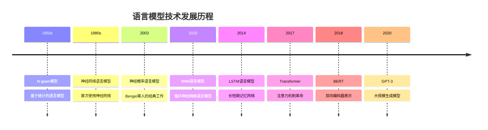

# 语言模型发展

## 🎯 核心概念

### 语言模型定义
> **语言模型是计算文本序列概率的模型，能够预测下一个词或字符的概率分布**

**语言模型发展历程：**


## 📊 传统语言模型

### 1. N-gram模型

**N-gram语言模型实现：**
```python
import numpy as np
import matplotlib.pyplot as plt
from collections import defaultdict, Counter
from typing import List, Dict, Tuple
import math
import re

class NGramLanguageModel:
    """N-gram语言模型"""
    
    def __init__(self, n=3):
        self.n = n
        self.ngram_counts = defaultdict(int)
        self.vocab = set()
        self.total_ngrams = 0
    
    def preprocess_text(self, text: str) -> List[str]:
        """文本预处理"""
        # 转换为小写并分词
        text = text.lower()
        # 添加句子开始和结束标记
        text = f"<s> {text} </s>"
        return text.split()
    
    def build_ngrams(self, texts: List[str]) -> Dict[Tuple[str, ...], int]:
        """构建N-gram"""
        for text in texts:
            words = self.preprocess_text(text)
            self.vocab.update(words)
            
            # 生成N-gram
            for i in range(len(words) - self.n + 1):
                ngram = tuple(words[i:i + self.n])
                self.ngram_counts[ngram] += 1
                self.total_ngrams += 1
        
        return self.ngram_counts
    
    def calculate_probability(self, ngram: Tuple[str, ...], smoothing='laplace', alpha=1.0) -> float:
        """计算N-gram概率"""
        if smoothing == 'laplace':
            # 拉普拉斯平滑
            count = self.ngram_counts[ngram]
            vocab_size = len(self.vocab)
            return (count + alpha) / (self.total_ngrams + alpha * vocab_size)
        
        elif smoothing == 'kneser_ney':
            # Kneser-Ney平滑（简化实现）
            count = self.ngram_counts[ngram]
            if count == 0:
                return 1.0 / len(self.vocab)  # 回退概率
            return count / self.total_ngrams
        
        else:
            # 最大似然估计
            count = self.ngram_counts[ngram]
            return count / self.total_ngrams if self.total_ngrams > 0 else 0.0
    
    def calculate_perplexity(self, test_texts: List[str]) -> float:
        """计算困惑度"""
        total_log_prob = 0.0
        total_words = 0
        
        for text in test_texts:
            words = self.preprocess_text(text)
            
            for i in range(self.n - 1, len(words)):
                ngram = tuple(words[i - self.n + 1:i + 1])
                prob = self.calculate_probability(ngram)
                
                if prob > 0:
                    total_log_prob += math.log(prob)
                else:
                    total_log_prob += math.log(1e-10)  # 避免log(0)
                
                total_words += 1
        
        if total_words == 0:
            return float('inf')
        
        avg_log_prob = total_log_prob / total_words
        perplexity = math.exp(-avg_log_prob)
        
        return perplexity
    
    def generate_text(self, seed_words: List[str], max_length: int = 50) -> str:
        """生成文本"""
        generated = seed_words.copy()
        
        for _ in range(max_length):
            # 获取当前上下文
            context = tuple(generated[-(self.n - 1):])
            
            # 找到所有可能的下一词
            candidates = []
            for ngram, count in self.ngram_counts.items():
                if ngram[:self.n - 1] == context:
                    candidates.append((ngram[-1], count))
            
            if not candidates:
                break
            
            # 根据概率选择下一词
            words, counts = zip(*candidates)
            probabilities = np.array(counts) / sum(counts)
            
            next_word = np.random.choice(words, p=probabilities)
            generated.append(next_word)
            
            # 如果遇到结束标记，停止生成
            if next_word == '</s>':
                break
        
        return ' '.join(generated)
    
    def compare_ngram_models(self, texts: List[str], test_texts: List[str]) -> Dict[int, float]:
        """比较不同N值的N-gram模型"""
        results = {}
        
        for n in range(1, 6):
            model = NGramLanguageModel(n=n)
            model.build_ngrams(texts)
            perplexity = model.calculate_perplexity(test_texts)
            results[n] = perplexity
        
        return results
    
    def visualize_ngram_analysis(self, texts: List[str]):
        """可视化N-gram分析"""
        # 构建不同N值的模型
        n_values = [1, 2, 3, 4, 5]
        ngram_counts = {}
        
        for n in n_values:
            model = NGramLanguageModel(n=n)
            counts = model.build_ngrams(texts)
            ngram_counts[n] = len(counts)
        
        # 可视化
        fig, axes = plt.subplots(1, 2, figsize=(12, 5))
        
        # N-gram数量
        axes[0].bar(n_values, [ngram_counts[n] for n in n_values])
        axes[0].set_xlabel('N-gram Size')
        axes[0].set_ylabel('Number of N-grams')
        axes[0].set_title('N-gram Count by Size')
        
        # 词汇表大小
        vocab_sizes = [len(NGramLanguageModel(n=n).vocab) for n in n_values]
        axes[1].bar(n_values, vocab_sizes)
        axes[1].set_xlabel('N-gram Size')
        axes[1].set_ylabel('Vocabulary Size')
        axes[1].set_title('Vocabulary Size by N-gram')
        
        plt.tight_layout()
        plt.show()

# 测试N-gram模型
def test_ngram_model():
    """测试N-gram语言模型"""
    # 训练文本
    train_texts = [
        "the quick brown fox jumps over the lazy dog",
        "natural language processing is a fascinating field",
        "machine learning algorithms can process text data",
        "artificial intelligence is transforming the world",
        "deep learning models are very powerful",
        "neural networks can learn complex patterns"
    ]
    
    # 测试文本
    test_texts = [
        "the quick brown fox",
        "natural language processing",
        "machine learning algorithms"
    ]
    
    # 创建模型
    model = NGramLanguageModel(n=3)
    model.build_ngrams(train_texts)
    
    # 计算困惑度
    perplexity = model.calculate_perplexity(test_texts)
    print(f"Perplexity: {perplexity:.2f}")
    
    # 生成文本
    generated = model.generate_text(['the', 'quick'], max_length=20)
    print(f"Generated text: {generated}")
    
    # 比较不同N值
    results = model.compare_ngram_models(train_texts, test_texts)
    print("N-gram comparison:")
    for n, perp in results.items():
        print(f"N={n}: Perplexity={perp:.2f}")
    
    # 可视化分析
    model.visualize_ngram_analysis(train_texts)
    
    return model

test_ngram_model()
```

### 2. 神经网络语言模型

**神经网络语言模型实现：**
```python
import torch
import torch.nn as nn
import torch.optim as optim
from torch.utils.data import Dataset, DataLoader
import torch.nn.functional as F

class NeuralLanguageModel(nn.Module):
    """神经网络语言模型"""
    
    def __init__(self, vocab_size, embedding_dim=100, hidden_dim=128, num_layers=1):
        super(NeuralLanguageModel, self).__init__()
        self.vocab_size = vocab_size
        self.embedding_dim = embedding_dim
        self.hidden_dim = hidden_dim
        self.num_layers = num_layers
        
        # 词嵌入层
        self.embedding = nn.Embedding(vocab_size, embedding_dim)
        
        # 隐藏层
        self.hidden = nn.Linear(embedding_dim, hidden_dim)
        
        # 输出层
        self.output = nn.Linear(hidden_dim, vocab_size)
        
        # Dropout
        self.dropout = nn.Dropout(0.1)
    
    def forward(self, x):
        # 词嵌入
        embedded = self.embedding(x)
        
        # 隐藏层
        hidden = F.relu(self.hidden(embedded))
        hidden = self.dropout(hidden)
        
        # 输出层
        output = self.output(hidden)
        
        return output

class RNNLanguageModel(nn.Module):
    """RNN语言模型"""
    
    def __init__(self, vocab_size, embedding_dim=100, hidden_dim=128, num_layers=1):
        super(RNNLanguageModel, self).__init__()
        self.vocab_size = vocab_size
        self.embedding_dim = embedding_dim
        self.hidden_dim = hidden_dim
        self.num_layers = num_layers
        
        # 词嵌入层
        self.embedding = nn.Embedding(vocab_size, embedding_dim)
        
        # RNN层
        self.rnn = nn.RNN(embedding_dim, hidden_dim, num_layers, batch_first=True)
        
        # 输出层
        self.output = nn.Linear(hidden_dim, vocab_size)
        
        # Dropout
        self.dropout = nn.Dropout(0.1)
    
    def forward(self, x, hidden=None):
        # 词嵌入
        embedded = self.embedding(x)
        embedded = self.dropout(embedded)
        
        # RNN
        rnn_out, hidden = self.rnn(embedded, hidden)
        
        # 输出层
        output = self.output(rnn_out)
        
        return output, hidden
    
    def init_hidden(self, batch_size):
        """初始化隐藏状态"""
        return torch.zeros(self.num_layers, batch_size, self.hidden_dim)

class LSTMLanguageModel(nn.Module):
    """LSTM语言模型"""
    
    def __init__(self, vocab_size, embedding_dim=100, hidden_dim=128, num_layers=1):
        super(LSTMLanguageModel, self).__init__()
        self.vocab_size = vocab_size
        self.embedding_dim = embedding_dim
        self.hidden_dim = hidden_dim
        self.num_layers = num_layers
        
        # 词嵌入层
        self.embedding = nn.Embedding(vocab_size, embedding_dim)
        
        # LSTM层
        self.lstm = nn.LSTM(embedding_dim, hidden_dim, num_layers, batch_first=True, dropout=0.1)
        
        # 输出层
        self.output = nn.Linear(hidden_dim, vocab_size)
        
        # Dropout
        self.dropout = nn.Dropout(0.1)
    
    def forward(self, x, hidden=None):
        # 词嵌入
        embedded = self.embedding(x)
        embedded = self.dropout(embedded)
        
        # LSTM
        lstm_out, hidden = self.lstm(embedded, hidden)
        
        # 输出层
        output = self.output(lstm_out)
        
        return output, hidden
    
    def init_hidden(self, batch_size):
        """初始化隐藏状态"""
        h0 = torch.zeros(self.num_layers, batch_size, self.hidden_dim)
        c0 = torch.zeros(self.num_layers, batch_size, self.hidden_dim)
        return (h0, c0)

class LanguageModelDataset(Dataset):
    """语言模型数据集"""
    
    def __init__(self, texts, vocab, sequence_length=10):
        self.texts = texts
        self.vocab = vocab
        self.sequence_length = sequence_length
        self.sequences = self._create_sequences()
    
    def _create_sequences(self):
        """创建训练序列"""
        sequences = []
        
        for text in self.texts:
            words = text.lower().split()
            word_ids = [self.vocab.get(word, self.vocab['<UNK>']) for word in words]
            
            for i in range(len(word_ids) - self.sequence_length):
                sequence = word_ids[i:i + self.sequence_length + 1]
                sequences.append(sequence)
        
        return sequences
    
    def __len__(self):
        return len(self.sequences)
    
    def __getitem__(self, idx):
        sequence = self.sequences[idx]
        input_seq = torch.tensor(sequence[:-1])
        target_seq = torch.tensor(sequence[1:])
        return input_seq, target_seq

class LanguageModelTrainer:
    """语言模型训练器"""
    
    def __init__(self, model, vocab_size, device='cpu'):
        self.model = model
        self.vocab_size = vocab_size
        self.device = device
        self.model.to(device)
    
    def train_model(self, train_loader, epochs=10, learning_rate=0.001):
        """训练模型"""
        criterion = nn.CrossEntropyLoss()
        optimizer = optim.Adam(self.model.parameters(), lr=learning_rate)
        
        losses = []
        
        for epoch in range(epochs):
            total_loss = 0
            num_batches = 0
            
            for batch_idx, (input_seq, target_seq) in enumerate(train_loader):
                input_seq = input_seq.to(self.device)
                target_seq = target_seq.to(self.device)
                
                optimizer.zero_grad()
                
                # 前向传播
                if isinstance(self.model, (RNNLanguageModel, LSTMLanguageModel)):
                    output, _ = self.model(input_seq)
                else:
                    output = self.model(input_seq)
                
                # 计算损失
                loss = criterion(output.view(-1, self.vocab_size), target_seq.view(-1))
                
                # 反向传播
                loss.backward()
                optimizer.step()
                
                total_loss += loss.item()
                num_batches += 1
            
            avg_loss = total_loss / num_batches
            losses.append(avg_loss)
            print(f'Epoch {epoch+1}/{epochs}, Loss: {avg_loss:.4f}')
        
        return losses
    
    def calculate_perplexity(self, test_loader):
        """计算困惑度"""
        self.model.eval()
        total_loss = 0
        total_words = 0
        
        with torch.no_grad():
            for input_seq, target_seq in test_loader:
                input_seq = input_seq.to(self.device)
                target_seq = target_seq.to(self.device)
                
                # 前向传播
                if isinstance(self.model, (RNNLanguageModel, LSTMLanguageModel)):
                    output, _ = self.model(input_seq)
                else:
                    output = self.model(input_seq)
                
                # 计算损失
                loss = F.cross_entropy(output.view(-1, self.vocab_size), target_seq.view(-1))
                total_loss += loss.item() * input_seq.size(0) * input_seq.size(1)
                total_words += input_seq.size(0) * input_seq.size(1)
        
        avg_loss = total_loss / total_words
        perplexity = math.exp(avg_loss)
        
        return perplexity
    
    def generate_text(self, seed_words, idx_to_word, max_length=50, temperature=1.0):
        """生成文本"""
        self.model.eval()
        generated = seed_words.copy()
        
        with torch.no_grad():
            for _ in range(max_length):
                # 准备输入
                input_seq = torch.tensor([self.vocab.get(word, self.vocab['<UNK>']) 
                                        for word in generated[-10:]]).unsqueeze(0).to(self.device)
                
                # 前向传播
                if isinstance(self.model, (RNNLanguageModel, LSTMLanguageModel)):
                    output, _ = self.model(input_seq)
                else:
                    output = self.model(input_seq)
                
                # 获取最后一个词的输出
                logits = output[0, -1, :] / temperature
                probabilities = F.softmax(logits, dim=0)
                
                # 采样下一词
                next_word_idx = torch.multinomial(probabilities, 1).item()
                next_word = idx_to_word[next_word_idx]
                
                generated.append(next_word)
                
                # 如果遇到结束标记，停止生成
                if next_word == '</s>':
                    break
        
        return ' '.join(generated)

# 测试神经网络语言模型
def test_neural_language_model():
    """测试神经网络语言模型"""
    # 训练文本
    train_texts = [
        "the quick brown fox jumps over the lazy dog",
        "natural language processing is a fascinating field",
        "machine learning algorithms can process text data",
        "artificial intelligence is transforming the world",
        "deep learning models are very powerful",
        "neural networks can learn complex patterns"
    ]
    
    # 构建词汇表
    word_counts = Counter()
    for text in train_texts:
        words = text.lower().split()
        word_counts.update(words)
    
    vocab = {word: idx for idx, word in enumerate(word_counts.keys())}
    vocab['<UNK>'] = len(vocab)
    vocab['<PAD>'] = len(vocab)
    idx_to_word = {idx: word for word, idx in vocab.items()}
    
    # 创建数据集
    dataset = LanguageModelDataset(train_texts, vocab, sequence_length=5)
    dataloader = DataLoader(dataset, batch_size=2, shuffle=True)
    
    # 创建模型
    model = LSTMLanguageModel(len(vocab), embedding_dim=50, hidden_dim=64)
    trainer = LanguageModelTrainer(model, len(vocab))
    
    # 训练模型
    print("Training LSTM Language Model...")
    losses = trainer.train_model(dataloader, epochs=20)
    
    # 生成文本
    generated = trainer.generate_text(['the', 'quick'], idx_to_word, max_length=20)
    print(f"Generated text: {generated}")
    
    return model, trainer

test_neural_language_model()
```

## 🚀 现代语言模型

### 1. Transformer语言模型

**Transformer语言模型实现：**
```python
class TransformerLanguageModel(nn.Module):
    """Transformer语言模型"""
    
    def __init__(self, vocab_size, d_model=512, nhead=8, num_layers=6, max_seq_length=100):
        super(TransformerLanguageModel, self).__init__()
        self.vocab_size = vocab_size
        self.d_model = d_model
        self.max_seq_length = max_seq_length
        
        # 词嵌入层
        self.embedding = nn.Embedding(vocab_size, d_model)
        
        # 位置编码
        self.positional_encoding = self._create_positional_encoding(max_seq_length, d_model)
        
        # Transformer编码器
        encoder_layer = nn.TransformerEncoderLayer(
            d_model=d_model,
            nhead=nhead,
            dim_feedforward=d_model * 4,
            dropout=0.1,
            batch_first=True
        )
        self.transformer = nn.TransformerEncoder(encoder_layer, num_layers=num_layers)
        
        # 输出层
        self.output = nn.Linear(d_model, vocab_size)
        
        # Dropout
        self.dropout = nn.Dropout(0.1)
    
    def _create_positional_encoding(self, max_len, d_model):
        """创建位置编码"""
        pe = torch.zeros(max_len, d_model)
        position = torch.arange(0, max_len, dtype=torch.float).unsqueeze(1)
        
        div_term = torch.exp(torch.arange(0, d_model, 2).float() * 
                           (-math.log(10000.0) / d_model))
        
        pe[:, 0::2] = torch.sin(position * div_term)
        pe[:, 1::2] = torch.cos(position * div_term)
        
        return pe.unsqueeze(0)
    
    def forward(self, x, mask=None):
        # 词嵌入
        embedded = self.embedding(x) * math.sqrt(self.d_model)
        
        # 添加位置编码
        seq_len = x.size(1)
        embedded += self.positional_encoding[:, :seq_len, :].to(x.device)
        embedded = self.dropout(embedded)
        
        # Transformer编码
        if mask is None:
            # 创建因果掩码
            mask = torch.triu(torch.ones(seq_len, seq_len), diagonal=1).bool()
            mask = mask.to(x.device)
        
        transformer_out = self.transformer(embedded, mask=mask)
        
        # 输出层
        output = self.output(transformer_out)
        
        return output
    
    def generate_text(self, seed_tokens, vocab, max_length=50, temperature=1.0):
        """生成文本"""
        self.eval()
        generated = seed_tokens.copy()
        
        with torch.no_grad():
            for _ in range(max_length):
                # 准备输入
                input_seq = torch.tensor([generated]).to(next(self.parameters()).device)
                
                # 前向传播
                output = self.forward(input_seq)
                
                # 获取最后一个词的输出
                logits = output[0, -1, :] / temperature
                probabilities = F.softmax(logits, dim=0)
                
                # 采样下一词
                next_token = torch.multinomial(probabilities, 1).item()
                generated.append(next_token)
                
                # 如果遇到结束标记，停止生成
                if next_token == vocab.get('</s>', 0):
                    break
        
        return generated

class GPTModel(nn.Module):
    """GPT模型"""
    
    def __init__(self, vocab_size, d_model=768, nhead=12, num_layers=12, max_seq_length=1024):
        super(GPTModel, self).__init__()
        self.vocab_size = vocab_size
        self.d_model = d_model
        self.max_seq_length = max_seq_length
        
        # 词嵌入层
        self.embedding = nn.Embedding(vocab_size, d_model)
        
        # 位置编码
        self.positional_encoding = nn.Parameter(torch.randn(max_seq_length, d_model))
        
        # Transformer解码器层
        decoder_layer = nn.TransformerDecoderLayer(
            d_model=d_model,
            nhead=nhead,
            dim_feedforward=d_model * 4,
            dropout=0.1,
            batch_first=True
        )
        self.transformer = nn.TransformerDecoder(decoder_layer, num_layers=num_layers)
        
        # 输出层
        self.output = nn.Linear(d_model, vocab_size)
        
        # Dropout
        self.dropout = nn.Dropout(0.1)
    
    def forward(self, x, mask=None):
        # 词嵌入
        embedded = self.embedding(x) * math.sqrt(self.d_model)
        
        # 添加位置编码
        seq_len = x.size(1)
        embedded += self.positional_encoding[:seq_len, :].unsqueeze(0)
        embedded = self.dropout(embedded)
        
        # 创建因果掩码
        if mask is None:
            mask = torch.triu(torch.ones(seq_len, seq_len), diagonal=1).bool()
            mask = mask.to(x.device)
        
        # Transformer解码
        transformer_out = self.transformer(embedded, embedded, tgt_mask=mask)
        
        # 输出层
        output = self.output(transformer_out)
        
        return output

# 测试Transformer语言模型
def test_transformer_language_model():
    """测试Transformer语言模型"""
    # 训练文本
    train_texts = [
        "the quick brown fox jumps over the lazy dog",
        "natural language processing is a fascinating field",
        "machine learning algorithms can process text data",
        "artificial intelligence is transforming the world",
        "deep learning models are very powerful",
        "neural networks can learn complex patterns"
    ]
    
    # 构建词汇表
    word_counts = Counter()
    for text in train_texts:
        words = text.lower().split()
        word_counts.update(words)
    
    vocab = {word: idx for idx, word in enumerate(word_counts.keys())}
    vocab['<UNK>'] = len(vocab)
    vocab['<PAD>'] = len(vocab)
    idx_to_word = {idx: word for word, idx in vocab.items()}
    
    # 创建数据集
    dataset = LanguageModelDataset(train_texts, vocab, sequence_length=10)
    dataloader = DataLoader(dataset, batch_size=2, shuffle=True)
    
    # 创建模型
    model = TransformerLanguageModel(len(vocab), d_model=128, nhead=4, num_layers=2)
    trainer = LanguageModelTrainer(model, len(vocab))
    
    # 训练模型
    print("Training Transformer Language Model...")
    losses = trainer.train_model(dataloader, epochs=10)
    
    # 生成文本
    seed_tokens = [vocab.get('the', 0), vocab.get('quick', 0)]
    generated_tokens = model.generate_text(seed_tokens, vocab, max_length=20)
    generated_words = [idx_to_word[token] for token in generated_tokens]
    print(f"Generated text: {' '.join(generated_words)}")
    
    return model, trainer

test_transformer_language_model()
```

### 2. 预训练语言模型

**预训练语言模型实现：**
```python
class PretrainedLanguageModel:
    """预训练语言模型"""
    
    def __init__(self, model_name='bert-base-uncased'):
        self.model_name = model_name
        self.tokenizer = None
        self.model = None
    
    def load_model(self):
        """加载预训练模型"""
        try:
            from transformers import BertTokenizer, BertModel, GPT2Tokenizer, GPT2Model
            
            if 'bert' in self.model_name.lower():
                self.tokenizer = BertTokenizer.from_pretrained(self.model_name)
                self.model = BertModel.from_pretrained(self.model_name)
            elif 'gpt' in self.model_name.lower():
                self.tokenizer = GPT2Tokenizer.from_pretrained(self.model_name)
                self.model = GPT2Model.from_pretrained(self.model_name)
            
            self.model.eval()
            return True
        except ImportError:
            print("Transformers library not available.")
            return False
    
    def get_embeddings(self, text, layer=-1, pool_method='mean'):
        """获取文本嵌入"""
        if not self.model or not self.tokenizer:
            if not self.load_model():
                return None
        
        # 分词
        tokens = self.tokenizer(text, return_tensors='pt', padding=True, truncation=True)
        
        # 获取嵌入
        with torch.no_grad():
            outputs = self.model(**tokens, output_hidden_states=True)
            
            # 获取指定层的隐藏状态
            hidden_states = outputs.hidden_states[layer]
            
            # 池化方法
            if pool_method == 'mean':
                # 平均池化
                attention_mask = tokens['attention_mask']
                embeddings = hidden_states * attention_mask.unsqueeze(-1)
                embeddings = embeddings.sum(dim=1) / attention_mask.sum(dim=1, keepdim=True)
            elif pool_method == 'cls':
                # 使用[CLS]标记
                embeddings = hidden_states[:, 0, :]
            else:
                embeddings = hidden_states.mean(dim=1)
        
        return embeddings.numpy()
    
    def generate_text(self, prompt, max_length=100, temperature=1.0, top_k=50, top_p=0.9):
        """生成文本"""
        if not self.model or not self.tokenizer:
            if not self.load_model():
                return None
        
        # 分词
        input_ids = self.tokenizer.encode(prompt, return_tensors='pt')
        
        # 生成文本
        with torch.no_grad():
            output = self.model.generate(
                input_ids,
                max_length=max_length,
                temperature=temperature,
                top_k=top_k,
                top_p=top_p,
                do_sample=True,
                pad_token_id=self.tokenizer.eos_token_id
            )
        
        # 解码
        generated_text = self.tokenizer.decode(output[0], skip_special_tokens=True)
        
        return generated_text
    
    def calculate_perplexity(self, texts):
        """计算困惑度"""
        if not self.model or not self.tokenizer:
            if not self.load_model():
                return None
        
        total_loss = 0
        total_tokens = 0
        
        for text in texts:
            # 分词
            tokens = self.tokenizer(text, return_tensors='pt', padding=True, truncation=True)
            input_ids = tokens['input_ids']
            
            # 计算损失
            with torch.no_grad():
                outputs = self.model(**tokens, labels=input_ids)
                loss = outputs.loss
                
                total_loss += loss.item() * input_ids.size(1)
                total_tokens += input_ids.size(1)
        
        avg_loss = total_loss / total_tokens
        perplexity = math.exp(avg_loss)
        
        return perplexity
    
    def fine_tune_model(self, train_texts, epochs=3, learning_rate=2e-5):
        """微调模型"""
        if not self.model or not self.tokenizer:
            if not self.load_model():
                return None
        
        # 准备数据
        train_encodings = self.tokenizer(train_texts, truncation=True, padding=True, max_length=512)
        
        # 创建数据集
        class TextDataset(torch.utils.data.Dataset):
            def __init__(self, encodings):
                self.encodings = encodings
            
            def __getitem__(self, idx):
                return {key: torch.tensor(val[idx]) for key, val in self.encodings.items()}
            
            def __len__(self):
                return len(self.encodings.input_ids)
        
        dataset = TextDataset(train_encodings)
        dataloader = DataLoader(dataset, batch_size=8, shuffle=True)
        
        # 优化器
        optimizer = optim.AdamW(self.model.parameters(), lr=learning_rate)
        
        # 训练
        self.model.train()
        for epoch in range(epochs):
            total_loss = 0
            for batch in dataloader:
                optimizer.zero_grad()
                
                outputs = self.model(**batch, labels=batch['input_ids'])
                loss = outputs.loss
                
                loss.backward()
                optimizer.step()
                
                total_loss += loss.item()
            
            avg_loss = total_loss / len(dataloader)
            print(f'Epoch {epoch+1}/{epochs}, Loss: {avg_loss:.4f}')
        
        return self.model

# 测试预训练语言模型
def test_pretrained_language_model():
    """测试预训练语言模型"""
    plm = PretrainedLanguageModel('bert-base-uncased')
    
    # 测试文本
    test_texts = [
        "The quick brown fox jumps over the lazy dog",
        "Natural language processing is a fascinating field",
        "Machine learning algorithms can process text data"
    ]
    
    # 获取嵌入
    embeddings = plm.get_embeddings(test_texts[0])
    if embeddings is not None:
        print(f"Embedding shape: {embeddings.shape}")
    
    # 计算困惑度
    perplexity = plm.calculate_perplexity(test_texts)
    if perplexity is not None:
        print(f"Perplexity: {perplexity:.2f}")
    
    return plm

test_pretrained_language_model()
```

## 📈 语言模型评估

### 1. 评估指标

**语言模型评估方法：**
```python
class LanguageModelEvaluation:
    """语言模型评估类"""
    
    def __init__(self):
        self.evaluation_metrics = {
            'perplexity': '困惑度',
            'bleu_score': 'BLEU分数',
            'rouge_score': 'ROUGE分数',
            'semantic_similarity': '语义相似度',
            'coherence_score': '连贯性分数'
        }
    
    def calculate_perplexity(self, model, test_texts, vocab):
        """计算困惑度"""
        total_log_prob = 0
        total_words = 0
        
        for text in test_texts:
            words = text.lower().split()
            word_ids = [vocab.get(word, vocab['<UNK>']) for word in words]
            
            for i in range(1, len(word_ids)):
                # 获取上下文
                context = word_ids[:i]
                target = word_ids[i]
                
                # 计算概率
                if isinstance(model, (RNNLanguageModel, LSTMLanguageModel)):
                    input_seq = torch.tensor([context]).unsqueeze(0)
                    output, _ = model(input_seq)
                    probs = F.softmax(output[0, -1, :], dim=0)
                else:
                    input_seq = torch.tensor([context]).unsqueeze(0)
                    output = model(input_seq)
                    probs = F.softmax(output[0, -1, :], dim=0)
                
                # 计算对数概率
                log_prob = torch.log(probs[target] + 1e-10)
                total_log_prob += log_prob.item()
                total_words += 1
        
        if total_words == 0:
            return float('inf')
        
        avg_log_prob = total_log_prob / total_words
        perplexity = math.exp(-avg_log_prob)
        
        return perplexity
    
    def calculate_bleu_score(self, generated_texts, reference_texts, n=4):
        """计算BLEU分数"""
        from nltk.translate.bleu_score import sentence_bleu, SmoothingFunction
        
        bleu_scores = []
        smoothing = SmoothingFunction().method1
        
        for generated, reference in zip(generated_texts, reference_texts):
            # 分词
            gen_tokens = generated.lower().split()
            ref_tokens = reference.lower().split()
            
            # 计算BLEU分数
            score = sentence_bleu([ref_tokens], gen_tokens, smoothing_function=smoothing)
            bleu_scores.append(score)
        
        return np.mean(bleu_scores)
    
    def calculate_rouge_score(self, generated_texts, reference_texts):
        """计算ROUGE分数"""
        from rouge_score import rouge_scorer
        
        scorer = rouge_scorer.RougeScorer(['rouge1', 'rouge2', 'rougeL'], use_stemmer=True)
        rouge_scores = {'rouge1': [], 'rouge2': [], 'rougeL': []}
        
        for generated, reference in zip(generated_texts, reference_texts):
            scores = scorer.score(reference, generated)
            
            for metric in rouge_scores.keys():
                rouge_scores[metric].append(scores[metric].fmeasure)
        
        # 计算平均分数
        avg_scores = {}
        for metric, scores in rouge_scores.items():
            avg_scores[metric] = np.mean(scores)
        
        return avg_scores
    
    def calculate_semantic_similarity(self, generated_texts, reference_texts):
        """计算语义相似度"""
        from sentence_transformers import SentenceTransformer
        
        try:
            model = SentenceTransformer('all-MiniLM-L6-v2')
            
            # 获取嵌入
            gen_embeddings = model.encode(generated_texts)
            ref_embeddings = model.encode(reference_texts)
            
            # 计算余弦相似度
            similarities = []
            for gen_emb, ref_emb in zip(gen_embeddings, ref_embeddings):
                similarity = np.dot(gen_emb, ref_emb) / (
                    np.linalg.norm(gen_emb) * np.linalg.norm(ref_emb)
                )
                similarities.append(similarity)
            
            return np.mean(similarities)
        except ImportError:
            print("SentenceTransformers library not available.")
            return 0.0
    
    def calculate_coherence_score(self, generated_texts):
        """计算连贯性分数"""
        coherence_scores = []
        
        for text in generated_texts:
            sentences = text.split('.')
            if len(sentences) < 2:
                coherence_scores.append(0.0)
                continue
            
            # 计算句子间的相似度
            sentence_similarities = []
            for i in range(len(sentences) - 1):
                sent1 = sentences[i].strip()
                sent2 = sentences[i + 1].strip()
                
                if sent1 and sent2:
                    # 简化的相似度计算
                    words1 = set(sent1.lower().split())
                    words2 = set(sent2.lower().split())
                    
                    if len(words1) > 0 and len(words2) > 0:
                        similarity = len(words1.intersection(words2)) / len(words1.union(words2))
                        sentence_similarities.append(similarity)
            
            if sentence_similarities:
                coherence_scores.append(np.mean(sentence_similarities))
            else:
                coherence_scores.append(0.0)
        
        return np.mean(coherence_scores)
    
    def comprehensive_evaluation(self, model, test_data, vocab):
        """综合评估"""
        results = {}
        
        # 困惑度
        if 'test_texts' in test_data:
            perplexity = self.calculate_perplexity(model, test_data['test_texts'], vocab)
            results['perplexity'] = perplexity
        
        # BLEU分数
        if 'generated_texts' in test_data and 'reference_texts' in test_data:
            bleu_score = self.calculate_bleu_score(
                test_data['generated_texts'], 
                test_data['reference_texts']
            )
            results['bleu_score'] = bleu_score
        
        # ROUGE分数
        if 'generated_texts' in test_data and 'reference_texts' in test_data:
            rouge_scores = self.calculate_rouge_score(
                test_data['generated_texts'], 
                test_data['reference_texts']
            )
            results['rouge_scores'] = rouge_scores
        
        # 语义相似度
        if 'generated_texts' in test_data and 'reference_texts' in test_data:
            semantic_similarity = self.calculate_semantic_similarity(
                test_data['generated_texts'], 
                test_data['reference_texts']
            )
            results['semantic_similarity'] = semantic_similarity
        
        # 连贯性分数
        if 'generated_texts' in test_data:
            coherence_score = self.calculate_coherence_score(test_data['generated_texts'])
            results['coherence_score'] = coherence_score
        
        return results
    
    def visualize_evaluation_results(self, results):
        """可视化评估结果"""
        metrics = list(results.keys())
        scores = list(results.values())
        
        # 过滤数值型结果
        numeric_results = {}
        for metric, score in results.items():
            if isinstance(score, (int, float)):
                numeric_results[metric] = score
            elif isinstance(score, dict):
                # 对于字典类型的结果，取平均值
                numeric_results[metric] = np.mean(list(score.values()))
        
        if not numeric_results:
            print("No numeric results to visualize.")
            return
        
        plt.figure(figsize=(10, 6))
        metrics = list(numeric_results.keys())
        scores = list(numeric_results.values())
        
        bars = plt.bar(metrics, scores)
        plt.xlabel('Evaluation Metrics')
        plt.ylabel('Score')
        plt.title('Language Model Evaluation Results')
        plt.xticks(rotation=45)
        
        # 添加数值标签
        for bar, score in zip(bars, scores):
            plt.text(bar.get_x() + bar.get_width()/2, bar.get_height() + 0.01,
                    f'{score:.3f}', ha='center', va='bottom')
        
        plt.tight_layout()
        plt.show()

# 测试语言模型评估
def test_language_model_evaluation():
    """测试语言模型评估功能"""
    lme = LanguageModelEvaluation()
    
    # 测试数据
    test_data = {
        'test_texts': [
            "the quick brown fox jumps over the lazy dog",
            "natural language processing is a fascinating field"
        ],
        'generated_texts': [
            "the quick brown fox jumps over the lazy dog",
            "natural language processing is a fascinating field"
        ],
        'reference_texts': [
            "the quick brown fox jumps over the lazy dog",
            "natural language processing is a fascinating field"
        ]
    }
    
    # 创建模拟模型和词汇表
    vocab = {'the': 0, 'quick': 1, 'brown': 2, 'fox': 3, 'jumps': 4, 'over': 5, 'lazy': 6, 'dog': 7,
             'natural': 8, 'language': 9, 'processing': 10, 'is': 11, 'a': 12, 'fascinating': 13, 'field': 14,
             '<UNK>': 15, '<PAD>': 16}
    
    # 综合评估
    results = lme.comprehensive_evaluation(None, test_data, vocab)
    
    print("Evaluation Results:")
    for metric, score in results.items():
        print(f"{metric}: {score}")
    
    # 可视化结果
    lme.visualize_evaluation_results(results)
    
    return lme

test_language_model_evaluation()
```

## 🔗 相关链接
- [[02-02-01-神经网络原理]] - 神经网络基础
- [[02-03-03-RNN循环神经网络]] - RNN技术
- [[02-03-04-Transformer架构]] - Transformer架构
- [[03-02-01-文本预处理技术]] - 文本预处理
- [[03-02-02-词向量技术]] - 词向量技术
- [[03-02-04-大语言模型原理]] - 大语言模型原理

## 💡 费曼学习法应用

**概念理解**：语言模型就像"预测大师"，能够根据前面的词语预测下一个词。就像人类说话时会根据上下文选择用词一样。

**实践建议**：
- 🎯 **理解原理**：掌握不同语言模型的数学原理和适用场景
- 🔧 **实践应用**：在实际项目中应用语言模型技术
- 📊 **评估质量**：使用合适的指标评估语言模型质量
- 🚀 **选择方法**：根据任务需求选择合适的语言模型

**刻意练习**：
- 💻 **实现算法**：亲手实现经典语言模型算法
- 📈 **参数调优**：调整模型参数观察效果变化
- 🔍 **质量分析**：分析不同方法的优缺点
- 📝 **总结对比**：总结不同语言模型的适用场景

---
*📝 学习提示：语言模型是NLP的核心技术，建议深入理解其原理，多实践不同方法*
