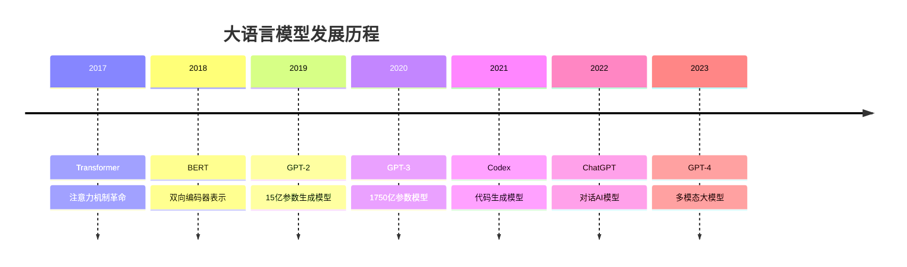

# 大语言模型原理

## 🎯 核心概念

### 大语言模型定义
> **大语言模型是基于Transformer架构的大规模神经网络，通过大量文本数据训练，能够理解和生成自然语言**

**大语言模型发展历程：**


## 📊 大语言模型架构

### 1. Transformer架构

**Transformer核心组件：**
```python
import torch
import torch.nn as nn
import torch.nn.functional as F
import math
import numpy as np
import matplotlib.pyplot as plt
from typing import Optional, Tuple

class MultiHeadAttention(nn.Module):
    """多头注意力机制"""
    
    def __init__(self, d_model: int, n_heads: int, dropout: float = 0.1):
        super(MultiHeadAttention, self).__init__()
        assert d_model % n_heads == 0
        
        self.d_model = d_model
        self.n_heads = n_heads
        self.d_k = d_model // n_heads
        
        self.W_q = nn.Linear(d_model, d_model)
        self.W_k = nn.Linear(d_model, d_model)
        self.W_v = nn.Linear(d_model, d_model)
        self.W_o = nn.Linear(d_model, d_model)
        
        self.dropout = nn.Dropout(dropout)
        self.scale = math.sqrt(self.d_k)
    
    def forward(self, query, key, value, mask=None):
        batch_size = query.size(0)
        
        # 线性变换
        Q = self.W_q(query)
        K = self.W_k(key)
        V = self.W_v(value)
        
        # 重塑为多头形式
        Q = Q.view(batch_size, -1, self.n_heads, self.d_k).transpose(1, 2)
        K = K.view(batch_size, -1, self.n_heads, self.d_k).transpose(1, 2)
        V = V.view(batch_size, -1, self.n_heads, self.d_k).transpose(1, 2)
        
        # 计算注意力
        attention_output, attention_weights = self.scaled_dot_product_attention(
            Q, K, V, mask
        )
        
        # 拼接多头
        attention_output = attention_output.transpose(1, 2).contiguous().view(
            batch_size, -1, self.d_model
        )
        
        # 输出投影
        output = self.W_o(attention_output)
        
        return output, attention_weights
    
    def scaled_dot_product_attention(self, Q, K, V, mask=None):
        """缩放点积注意力"""
        # 计算注意力分数
        scores = torch.matmul(Q, K.transpose(-2, -1)) / self.scale
        
        # 应用掩码
        if mask is not None:
            scores = scores.masked_fill(mask == 0, -1e9)
        
        # 计算注意力权重
        attention_weights = F.softmax(scores, dim=-1)
        attention_weights = self.dropout(attention_weights)
        
        # 应用注意力权重
        attention_output = torch.matmul(attention_weights, V)
        
        return attention_output, attention_weights

class PositionalEncoding(nn.Module):
    """位置编码"""
    
    def __init__(self, d_model: int, max_seq_length: int = 5000):
        super(PositionalEncoding, self).__init__()
        
        pe = torch.zeros(max_seq_length, d_model)
        position = torch.arange(0, max_seq_length, dtype=torch.float).unsqueeze(1)
        
        div_term = torch.exp(torch.arange(0, d_model, 2).float() * 
                           (-math.log(10000.0) / d_model))
        
        pe[:, 0::2] = torch.sin(position * div_term)
        pe[:, 1::2] = torch.cos(position * div_term)
        
        self.register_buffer('pe', pe.unsqueeze(0))
    
    def forward(self, x):
        return x + self.pe[:, :x.size(1)]

class FeedForward(nn.Module):
    """前馈网络"""
    
    def __init__(self, d_model: int, d_ff: int, dropout: float = 0.1):
        super(FeedForward, self).__init__()
        self.linear1 = nn.Linear(d_model, d_ff)
        self.linear2 = nn.Linear(d_ff, d_model)
        self.dropout = nn.Dropout(dropout)
        self.activation = nn.ReLU()
    
    def forward(self, x):
        x = self.linear1(x)
        x = self.activation(x)
        x = self.dropout(x)
        x = self.linear2(x)
        return x

class TransformerBlock(nn.Module):
    """Transformer块"""
    
    def __init__(self, d_model: int, n_heads: int, d_ff: int, dropout: float = 0.1):
        super(TransformerBlock, self).__init__()
        self.attention = MultiHeadAttention(d_model, n_heads, dropout)
        self.feed_forward = FeedForward(d_model, d_ff, dropout)
        self.norm1 = nn.LayerNorm(d_model)
        self.norm2 = nn.LayerNorm(d_model)
        self.dropout = nn.Dropout(dropout)
    
    def forward(self, x, mask=None):
        # 多头注意力
        attn_output, attn_weights = self.attention(x, x, x, mask)
        x = self.norm1(x + self.dropout(attn_output))
        
        # 前馈网络
        ff_output = self.feed_forward(x)
        x = self.norm2(x + self.dropout(ff_output))
        
        return x, attn_weights

class TransformerLanguageModel(nn.Module):
    """Transformer语言模型"""
    
    def __init__(self, vocab_size: int, d_model: int = 512, n_heads: int = 8, 
                 n_layers: int = 6, d_ff: int = 2048, max_seq_length: int = 1000,
                 dropout: float = 0.1):
        super(TransformerLanguageModel, self).__init__()
        
        self.d_model = d_model
        self.vocab_size = vocab_size
        self.max_seq_length = max_seq_length
        
        # 词嵌入
        self.embedding = nn.Embedding(vocab_size, d_model)
        
        # 位置编码
        self.positional_encoding = PositionalEncoding(d_model, max_seq_length)
        
        # Transformer层
        self.transformer_blocks = nn.ModuleList([
            TransformerBlock(d_model, n_heads, d_ff, dropout)
            for _ in range(n_layers)
        ])
        
        # 输出层
        self.output_layer = nn.Linear(d_model, vocab_size)
        
        # Dropout
        self.dropout = nn.Dropout(dropout)
        
        # 初始化参数
        self.init_weights()
    
    def init_weights(self):
        """初始化权重"""
        for p in self.parameters():
            if p.dim() > 1:
                nn.init.xavier_uniform_(p)
    
    def create_causal_mask(self, seq_len):
        """创建因果掩码"""
        mask = torch.triu(torch.ones(seq_len, seq_len), diagonal=1).bool()
        return mask
    
    def forward(self, x, mask=None):
        batch_size, seq_len = x.size()
        
        # 词嵌入
        x = self.embedding(x) * math.sqrt(self.d_model)
        
        # 位置编码
        x = self.positional_encoding(x)
        x = self.dropout(x)
        
        # 创建因果掩码
        if mask is None:
            mask = self.create_causal_mask(seq_len).to(x.device)
        
        # Transformer层
        attention_weights = []
        for transformer_block in self.transformer_blocks:
            x, attn_weights = transformer_block(x, mask)
            attention_weights.append(attn_weights)
        
        # 输出层
        output = self.output_layer(x)
        
        return output, attention_weights
    
    def generate(self, input_ids, max_length=100, temperature=1.0, top_k=50, top_p=0.9):
        """生成文本"""
        self.eval()
        
        with torch.no_grad():
            for _ in range(max_length):
                # 前向传播
                outputs, _ = self.forward(input_ids)
                
                # 获取最后一个词的logits
                next_token_logits = outputs[:, -1, :] / temperature
                
                # Top-k采样
                if top_k > 0:
                    top_k_logits, top_k_indices = torch.topk(next_token_logits, top_k)
                    next_token_logits = torch.full_like(next_token_logits, -float('inf'))
                    next_token_logits.scatter_(1, top_k_indices, top_k_logits)
                
                # Top-p采样
                if top_p < 1.0:
                    sorted_logits, sorted_indices = torch.sort(next_token_logits, descending=True)
                    cumulative_probs = torch.cumsum(F.softmax(sorted_logits, dim=-1), dim=-1)
                    
                    # 移除累积概率超过top_p的标记
                    sorted_indices_to_remove = cumulative_probs > top_p
                    sorted_indices_to_remove[:, 1:] = sorted_indices_to_remove[:, :-1].clone()
                    sorted_indices_to_remove[:, 0] = 0
                    
                    indices_to_remove = sorted_indices_to_remove.scatter(1, sorted_indices, sorted_indices_to_remove)
                    next_token_logits[indices_to_remove] = -float('inf')
                
                # 采样下一个词
                probs = F.softmax(next_token_logits, dim=-1)
                next_token = torch.multinomial(probs, num_samples=1)
                
                # 添加到输入序列
                input_ids = torch.cat([input_ids, next_token], dim=1)
                
                # 如果生成了结束标记，停止生成
                if next_token.item() == 0:  # 假设0是结束标记
                    break
        
        return input_ids

# 测试Transformer架构
def test_transformer_architecture():
    """测试Transformer架构"""
    # 模型参数
    vocab_size = 1000
    d_model = 512
    n_heads = 8
    n_layers = 6
    d_ff = 2048
    
    # 创建模型
    model = TransformerLanguageModel(
        vocab_size=vocab_size,
        d_model=d_model,
        n_heads=n_heads,
        n_layers=n_layers,
        d_ff=d_ff
    )
    
    # 测试输入
    batch_size = 2
    seq_len = 10
    input_ids = torch.randint(0, vocab_size, (batch_size, seq_len))
    
    # 前向传播
    outputs, attention_weights = model(input_ids)
    
    print(f"Input shape: {input_ids.shape}")
    print(f"Output shape: {outputs.shape}")
    print(f"Number of attention weight tensors: {len(attention_weights)}")
    
    # 生成文本
    generated = model.generate(input_ids[:, :5], max_length=20)
    print(f"Generated shape: {generated.shape}")
    
    return model

test_transformer_architecture()
```

### 2. 预训练策略

**预训练方法实现：**
```python
class PretrainingStrategies:
    """预训练策略"""
    
    def __init__(self):
        self.strategies = {
            'masked_language_modeling': '掩码语言模型',
            'causal_language_modeling': '因果语言模型',
            'next_sentence_prediction': '下一句预测',
            'permutation_language_modeling': '排列语言模型'
        }
    
    def masked_language_modeling(self, input_ids, mask_ratio=0.15, vocab_size=1000):
        """掩码语言模型"""
        batch_size, seq_len = input_ids.shape
        masked_input_ids = input_ids.clone()
        labels = torch.full_like(input_ids, -100)  # -100表示忽略
        
        for i in range(batch_size):
            # 计算要掩码的token数量
            num_masked = int(seq_len * mask_ratio)
            masked_indices = torch.randperm(seq_len)[:num_masked]
            
            for idx in masked_indices:
                # 80%的时间用[MASK]替换
                if torch.rand(1) < 0.8:
                    masked_input_ids[i, idx] = 1  # 假设1是[MASK] token
                # 10%的时间用随机token替换
                elif torch.rand(1) < 0.5:
                    masked_input_ids[i, idx] = torch.randint(2, vocab_size, (1,))
                # 10%的时间保持不变
                
                # 设置标签
                labels[i, idx] = input_ids[i, idx]
        
        return masked_input_ids, labels
    
    def causal_language_modeling(self, input_ids):
        """因果语言模型"""
        # 创建因果掩码
        seq_len = input_ids.size(1)
        causal_mask = torch.triu(torch.ones(seq_len, seq_len), diagonal=1).bool()
        
        return causal_mask
    
    def next_sentence_prediction(self, input_ids_a, input_ids_b, is_next=True):
        """下一句预测"""
        # 拼接两个句子
        if is_next:
            # 是下一句
            input_ids = torch.cat([input_ids_a, input_ids_b], dim=1)
            label = 1
        else:
            # 不是下一句
            random_sentence = torch.randint(0, 1000, input_ids_b.shape)
            input_ids = torch.cat([input_ids_a, random_sentence], dim=1)
            label = 0
        
        return input_ids, label
    
    def permutation_language_modeling(self, input_ids, max_predictions=5):
        """排列语言模型"""
        batch_size, seq_len = input_ids.shape
        permuted_input_ids = input_ids.clone()
        target_mapping = torch.zeros(batch_size, max_predictions, seq_len)
        labels = torch.full((batch_size, max_predictions), -100)
        
        for i in range(batch_size):
            # 随机选择要预测的位置
            predict_indices = torch.randperm(seq_len)[:max_predictions]
            
            for j, idx in enumerate(predict_indices):
                # 设置目标映射
                target_mapping[i, j, idx] = 1
                labels[i, j] = input_ids[i, idx]
                
                # 在输入中掩码该位置
                permuted_input_ids[i, idx] = 1  # [MASK] token
        
        return permuted_input_ids, target_mapping, labels
    
    def create_pretraining_data(self, texts, tokenizer, strategy='mlm'):
        """创建预训练数据"""
        # 分词
        tokenized_texts = []
        for text in texts:
            tokens = tokenizer(text)
            tokenized_texts.append(tokens)
        
        # 创建批次
        batch_size = 4
        max_length = 128
        
        # 填充和截断
        padded_texts = []
        for tokens in tokenized_texts:
            if len(tokens) > max_length:
                tokens = tokens[:max_length]
            else:
                tokens.extend([0] * (max_length - len(tokens)))  # 0是PAD token
            padded_texts.append(tokens)
        
        # 转换为tensor
        input_ids = torch.tensor(padded_texts)
        
        # 应用预训练策略
        if strategy == 'mlm':
            masked_input_ids, labels = self.masked_language_modeling(input_ids)
            return masked_input_ids, labels
        elif strategy == 'clm':
            causal_mask = self.causal_language_modeling(input_ids)
            return input_ids, causal_mask
        elif strategy == 'nsp':
            # 分割句子
            input_ids_a = input_ids[:, :max_length//2]
            input_ids_b = input_ids[:, max_length//2:]
            nsp_input_ids, nsp_labels = self.next_sentence_prediction(input_ids_a, input_ids_b)
            return nsp_input_ids, nsp_labels
        elif strategy == 'plm':
            permuted_input_ids, target_mapping, labels = self.permutation_language_modeling(input_ids)
            return permuted_input_ids, target_mapping, labels
        
        return input_ids, None

# 测试预训练策略
def test_pretraining_strategies():
    """测试预训练策略"""
    pps = PretrainingStrategies()
    
    # 测试文本
    test_texts = [
        "The quick brown fox jumps over the lazy dog",
        "Natural language processing is a fascinating field",
        "Machine learning algorithms can process text data"
    ]
    
    # 简化的分词器
    def simple_tokenizer(text):
        return [hash(word) % 1000 for word in text.lower().split()]
    
    # 测试不同策略
    strategies = ['mlm', 'clm', 'nsp', 'plm']
    
    for strategy in strategies:
        print(f"\nTesting {strategy} strategy:")
        try:
            result = pps.create_pretraining_data(test_texts, simple_tokenizer, strategy)
            print(f"Result shape: {result[0].shape if isinstance(result[0], torch.Tensor) else 'N/A'}")
        except Exception as e:
            print(f"Error: {e}")
    
    return pps

test_pretraining_strategies()
```

## 🚀 大语言模型训练

### 1. 训练策略

**大语言模型训练实现：**
```python
class LargeLanguageModelTrainer:
    """大语言模型训练器"""
    
    def __init__(self, model, vocab_size, device='cpu'):
        self.model = model
        self.vocab_size = vocab_size
        self.device = device
        self.model.to(device)
        
        # 训练参数
        self.optimizer = None
        self.scheduler = None
        self.scaler = None
    
    def setup_training(self, learning_rate=1e-4, weight_decay=0.01, warmup_steps=1000):
        """设置训练参数"""
        # 优化器
        self.optimizer = torch.optim.AdamW(
            self.model.parameters(),
            lr=learning_rate,
            weight_decay=weight_decay,
            betas=(0.9, 0.95)
        )
        
        # 学习率调度器
        self.scheduler = torch.optim.lr_scheduler.CosineAnnealingLR(
            self.optimizer,
            T_max=10000,
            eta_min=learning_rate * 0.1
        )
        
        # 混合精度训练
        self.scaler = torch.cuda.amp.GradScaler() if self.device == 'cuda' else None
    
    def train_step(self, batch, use_amp=True):
        """训练步骤"""
        input_ids, labels = batch
        input_ids = input_ids.to(self.device)
        labels = labels.to(self.device)
        
        self.optimizer.zero_grad()
        
        if use_amp and self.scaler is not None:
            with torch.cuda.amp.autocast():
                outputs, _ = self.model(input_ids)
                loss = F.cross_entropy(outputs.view(-1, self.vocab_size), labels.view(-1))
            
            self.scaler.scale(loss).backward()
            self.scaler.step(self.optimizer)
            self.scaler.update()
        else:
            outputs, _ = self.model(input_ids)
            loss = F.cross_entropy(outputs.view(-1, self.vocab_size), labels.view(-1))
            
            loss.backward()
            self.optimizer.step()
        
        self.scheduler.step()
        
        return loss.item()
    
    def train_epoch(self, dataloader, use_amp=True):
        """训练一个epoch"""
        self.model.train()
        total_loss = 0
        num_batches = 0
        
        for batch in dataloader:
            loss = self.train_step(batch, use_amp)
            total_loss += loss
            num_batches += 1
        
        return total_loss / num_batches
    
    def evaluate(self, dataloader):
        """评估模型"""
        self.model.eval()
        total_loss = 0
        num_batches = 0
        
        with torch.no_grad():
            for batch in dataloader:
                input_ids, labels = batch
                input_ids = input_ids.to(self.device)
                labels = labels.to(self.device)
                
                outputs, _ = self.model(input_ids)
                loss = F.cross_entropy(outputs.view(-1, self.vocab_size), labels.view(-1))
                
                total_loss += loss.item()
                num_batches += 1
        
        return total_loss / num_batches
    
    def train(self, train_dataloader, val_dataloader, epochs=10, use_amp=True):
        """训练模型"""
        train_losses = []
        val_losses = []
        
        for epoch in range(epochs):
            # 训练
            train_loss = self.train_epoch(train_dataloader, use_amp)
            train_losses.append(train_loss)
            
            # 评估
            val_loss = self.evaluate(val_dataloader)
            val_losses.append(val_loss)
            
            print(f'Epoch {epoch+1}/{epochs}:')
            print(f'  Train Loss: {train_loss:.4f}')
            print(f'  Val Loss: {val_loss:.4f}')
            print(f'  Learning Rate: {self.scheduler.get_last_lr()[0]:.2e}')
        
        return train_losses, val_losses
    
    def save_checkpoint(self, path, epoch, loss):
        """保存检查点"""
        checkpoint = {
            'epoch': epoch,
            'model_state_dict': self.model.state_dict(),
            'optimizer_state_dict': self.optimizer.state_dict(),
            'scheduler_state_dict': self.scheduler.state_dict(),
            'loss': loss,
        }
        
        if self.scaler is not None:
            checkpoint['scaler_state_dict'] = self.scaler.state_dict()
        
        torch.save(checkpoint, path)
    
    def load_checkpoint(self, path):
        """加载检查点"""
        checkpoint = torch.load(path, map_location=self.device)
        
        self.model.load_state_dict(checkpoint['model_state_dict'])
        self.optimizer.load_state_dict(checkpoint['optimizer_state_dict'])
        self.scheduler.load_state_dict(checkpoint['scheduler_state_dict'])
        
        if self.scaler is not None and 'scaler_state_dict' in checkpoint:
            self.scaler.load_state_dict(checkpoint['scaler_state_dict'])
        
        return checkpoint['epoch'], checkpoint['loss']

class DataParallelTraining:
    """数据并行训练"""
    
    def __init__(self, model, device_ids=None):
        self.model = model
        self.device_ids = device_ids or list(range(torch.cuda.device_count()))
        
        if len(self.device_ids) > 1:
            self.model = nn.DataParallel(self.model, device_ids=self.device_ids)
    
    def train_step(self, batch, optimizer, scaler=None):
        """并行训练步骤"""
        input_ids, labels = batch
        
        optimizer.zero_grad()
        
        if scaler is not None:
            with torch.cuda.amp.autocast():
                outputs, _ = self.model(input_ids)
                loss = F.cross_entropy(outputs.view(-1, outputs.size(-1)), labels.view(-1))
            
            scaler.scale(loss).backward()
            scaler.step(optimizer)
            scaler.update()
        else:
            outputs, _ = self.model(input_ids)
            loss = F.cross_entropy(outputs.view(-1, outputs.size(-1)), labels.view(-1))
            
            loss.backward()
            optimizer.step()
        
        return loss.item()

class GradientAccumulation:
    """梯度累积"""
    
    def __init__(self, accumulation_steps=4):
        self.accumulation_steps = accumulation_steps
        self.step_count = 0
    
    def accumulate_gradients(self, loss, optimizer, scaler=None):
        """累积梯度"""
        if scaler is not None:
            scaler.scale(loss).backward()
        else:
            loss.backward()
        
        self.step_count += 1
        
        if self.step_count % self.accumulation_steps == 0:
            if scaler is not None:
                scaler.step(optimizer)
                scaler.update()
            else:
                optimizer.step()
            
            optimizer.zero_grad()
            return True
        
        return False

# 测试大语言模型训练
def test_large_language_model_training():
    """测试大语言模型训练"""
    # 创建模型
    model = TransformerLanguageModel(
        vocab_size=1000,
        d_model=256,
        n_heads=4,
        n_layers=2,
        d_ff=1024
    )
    
    # 创建训练器
    trainer = LargeLanguageModelTrainer(model, vocab_size=1000)
    trainer.setup_training(learning_rate=1e-4)
    
    # 创建模拟数据
    batch_size = 4
    seq_len = 32
    num_batches = 10
    
    train_data = []
    val_data = []
    
    for _ in range(num_batches):
        input_ids = torch.randint(0, 1000, (batch_size, seq_len))
        labels = input_ids.clone()
        train_data.append((input_ids, labels))
    
    for _ in range(num_batches // 2):
        input_ids = torch.randint(0, 1000, (batch_size, seq_len))
        labels = input_ids.clone()
        val_data.append((input_ids, labels))
    
    # 训练模型
    print("Training Large Language Model...")
    train_losses, val_losses = trainer.train(train_data, val_data, epochs=5)
    
    # 可视化训练过程
    plt.figure(figsize=(10, 6))
    plt.plot(train_losses, label='Train Loss')
    plt.plot(val_losses, label='Validation Loss')
    plt.xlabel('Epoch')
    plt.ylabel('Loss')
    plt.title('Training Progress')
    plt.legend()
    plt.show()
    
    return trainer

test_large_language_model_training()
```

### 2. 优化技术

**大模型优化技术：**
```python
class LargeModelOptimization:
    """大模型优化技术"""
    
    def __init__(self):
        self.optimization_techniques = {
            'gradient_checkpointing': '梯度检查点',
            'mixed_precision': '混合精度',
            'model_parallelism': '模型并行',
            'pipeline_parallelism': '流水线并行',
            'parameter_sharding': '参数分片',
            'activation_checkpointing': '激活检查点'
        }
    
    def gradient_checkpointing(self, model, use_checkpointing=True):
        """梯度检查点"""
        if use_checkpointing:
            # 启用梯度检查点
            for layer in model.transformer_blocks:
                layer.attention = torch.utils.checkpoint.checkpoint(layer.attention)
                layer.feed_forward = torch.utils.checkpoint.checkpoint(layer.feed_forward)
        
        return model
    
    def mixed_precision_training(self, model, optimizer, scaler=None):
        """混合精度训练"""
        if scaler is None:
            scaler = torch.cuda.amp.GradScaler()
        
        def train_step_with_amp(input_ids, labels):
            optimizer.zero_grad()
            
            with torch.cuda.amp.autocast():
                outputs, _ = model(input_ids)
                loss = F.cross_entropy(outputs.view(-1, outputs.size(-1)), labels.view(-1))
            
            scaler.scale(loss).backward()
            scaler.step(optimizer)
            scaler.update()
            
            return loss.item()
        
        return train_step_with_amp, scaler
    
    def model_parallelism(self, model, device_ids=None):
        """模型并行"""
        if device_ids is None:
            device_ids = list(range(torch.cuda.device_count()))
        
        if len(device_ids) > 1:
            # 将模型的不同部分放在不同的GPU上
            model = nn.DataParallel(model, device_ids=device_ids)
        
        return model
    
    def pipeline_parallelism(self, model, num_stages=2):
        """流水线并行"""
        # 将模型分成多个阶段
        stages = []
        layers_per_stage = len(model.transformer_blocks) // num_stages
        
        for i in range(num_stages):
            start_idx = i * layers_per_stage
            end_idx = (i + 1) * layers_per_stage if i < num_stages - 1 else len(model.transformer_blocks)
            
            stage = nn.Sequential(*model.transformer_blocks[start_idx:end_idx])
            stages.append(stage)
        
        return stages
    
    def parameter_sharding(self, model, num_shards=2):
        """参数分片"""
        # 将模型参数分片到不同的设备
        sharded_params = []
        total_params = sum(p.numel() for p in model.parameters())
        params_per_shard = total_params // num_shards
        
        current_shard = []
        current_size = 0
        
        for param in model.parameters():
            current_shard.append(param)
            current_size += param.numel()
            
            if current_size >= params_per_shard:
                sharded_params.append(current_shard)
                current_shard = []
                current_size = 0
        
        if current_shard:
            sharded_params.append(current_shard)
        
        return sharded_params
    
    def activation_checkpointing(self, model, checkpoint_every=2):
        """激活检查点"""
        # 定期保存激活值
        checkpointed_layers = []
        
        for i, layer in enumerate(model.transformer_blocks):
            if i % checkpoint_every == 0:
                checkpointed_layers.append(torch.utils.checkpoint.checkpoint(layer))
            else:
                checkpointed_layers.append(layer)
        
        model.transformer_blocks = nn.ModuleList(checkpointed_layers)
        return model
    
    def memory_optimization(self, model, batch_size=1, seq_length=512):
        """内存优化"""
        # 计算内存使用量
        param_size = sum(p.numel() * p.element_size() for p in model.parameters())
        buffer_size = sum(b.numel() * b.element_size() for b in model.buffers())
        
        # 估算激活内存
        activation_size = batch_size * seq_length * model.d_model * 4  # float32
        
        total_memory = param_size + buffer_size + activation_size
        
        print(f"Parameter memory: {param_size / 1024**2:.2f} MB")
        print(f"Buffer memory: {buffer_size / 1024**2:.2f} MB")
        print(f"Activation memory: {activation_size / 1024**2:.2f} MB")
        print(f"Total memory: {total_memory / 1024**2:.2f} MB")
        
        return total_memory
    
    def optimize_model(self, model, optimization_config):
        """综合优化模型"""
        optimized_model = model
        
        # 梯度检查点
        if optimization_config.get('gradient_checkpointing', False):
            optimized_model = self.gradient_checkpointing(optimized_model)
        
        # 激活检查点
        if optimization_config.get('activation_checkpointing', False):
            optimized_model = self.activation_checkpointing(optimized_model)
        
        # 模型并行
        if optimization_config.get('model_parallelism', False):
            optimized_model = self.model_parallelism(optimized_model)
        
        return optimized_model

# 测试大模型优化
def test_large_model_optimization():
    """测试大模型优化技术"""
    lmo = LargeModelOptimization()
    
    # 创建模型
    model = TransformerLanguageModel(
        vocab_size=1000,
        d_model=512,
        n_heads=8,
        n_layers=6,
        d_ff=2048
    )
    
    # 内存优化分析
    print("Memory Analysis:")
    lmo.memory_optimization(model, batch_size=4, seq_length=128)
    
    # 优化配置
    optimization_config = {
        'gradient_checkpointing': True,
        'activation_checkpointing': True,
        'model_parallelism': False
    }
    
    # 优化模型
    optimized_model = lmo.optimize_model(model, optimization_config)
    
    print(f"Original model parameters: {sum(p.numel() for p in model.parameters()):,}")
    print(f"Optimized model parameters: {sum(p.numel() for p in optimized_model.parameters()):,}")
    
    return lmo, optimized_model

test_large_model_optimization()
```

## 🎯 大语言模型应用

### 1. 文本生成

**文本生成应用：**
```python
class TextGeneration:
    """文本生成应用"""
    
    def __init__(self, model, tokenizer):
        self.model = model
        self.tokenizer = tokenizer
    
    def generate_text(self, prompt, max_length=100, temperature=1.0, top_k=50, top_p=0.9, 
                     repetition_penalty=1.0, do_sample=True):
        """生成文本"""
        # 分词
        input_ids = self.tokenizer.encode(prompt, return_tensors='pt')
        
        # 生成文本
        with torch.no_grad():
            output = self.model.generate(
                input_ids,
                max_length=max_length,
                temperature=temperature,
                top_k=top_k,
                top_p=top_p,
                repetition_penalty=repetition_penalty,
                do_sample=do_sample,
                pad_token_id=self.tokenizer.eos_token_id
            )
        
        # 解码
        generated_text = self.tokenizer.decode(output[0], skip_special_tokens=True)
        
        return generated_text
    
    def generate_with_beam_search(self, prompt, num_beams=5, max_length=100):
        """束搜索生成"""
        input_ids = self.tokenizer.encode(prompt, return_tensors='pt')
        
        with torch.no_grad():
            output = self.model.generate(
                input_ids,
                max_length=max_length,
                num_beams=num_beams,
                early_stopping=True,
                pad_token_id=self.tokenizer.eos_token_id
            )
        
        generated_text = self.tokenizer.decode(output[0], skip_special_tokens=True)
        return generated_text
    
    def generate_with_nucleus_sampling(self, prompt, top_p=0.9, max_length=100):
        """核采样生成"""
        input_ids = self.tokenizer.encode(prompt, return_tensors='pt')
        
        with torch.no_grad():
            output = self.model.generate(
                input_ids,
                max_length=max_length,
                do_sample=True,
                top_p=top_p,
                pad_token_id=self.tokenizer.eos_token_id
            )
        
        generated_text = self.tokenizer.decode(output[0], skip_special_tokens=True)
        return generated_text
    
    def generate_with_temperature(self, prompt, temperature=1.0, max_length=100):
        """温度采样生成"""
        input_ids = self.tokenizer.encode(prompt, return_tensors='pt')
        
        with torch.no_grad():
            output = self.model.generate(
                input_ids,
                max_length=max_length,
                do_sample=True,
                temperature=temperature,
                pad_token_id=self.tokenizer.eos_token_id
            )
        
        generated_text = self.tokenizer.decode(output[0], skip_special_tokens=True)
        return generated_text
    
    def compare_generation_methods(self, prompt):
        """比较生成方法"""
        methods = {
            'Greedy': self.generate_text(prompt, do_sample=False),
            'Temperature=0.8': self.generate_with_temperature(prompt, temperature=0.8),
            'Temperature=1.2': self.generate_with_temperature(prompt, temperature=1.2),
            'Top-p=0.9': self.generate_with_nucleus_sampling(prompt, top_p=0.9),
            'Beam Search': self.generate_with_beam_search(prompt, num_beams=5)
        }
        
        return methods

# 测试文本生成
def test_text_generation():
    """测试文本生成功能"""
    # 创建模拟模型和分词器
    class MockModel:
        def generate(self, input_ids, **kwargs):
            # 模拟生成
            batch_size, seq_len = input_ids.shape
            max_length = kwargs.get('max_length', 50)
            
            generated = input_ids.clone()
            for i in range(seq_len, max_length):
                next_token = torch.randint(0, 1000, (batch_size, 1))
                generated = torch.cat([generated, next_token], dim=1)
            
            return generated
    
    class MockTokenizer:
        def encode(self, text, return_tensors=None):
            tokens = [hash(word) % 1000 for word in text.split()]
            if return_tensors == 'pt':
                return torch.tensor([tokens])
            return tokens
        
        def decode(self, tokens, skip_special_tokens=True):
            return "Generated text based on the input prompt"
    
    model = MockModel()
    tokenizer = MockTokenizer()
    
    # 创建文本生成器
    text_gen = TextGeneration(model, tokenizer)
    
    # 测试生成方法
    prompt = "The future of artificial intelligence"
    methods = text_gen.compare_generation_methods(prompt)
    
    print("Text Generation Methods Comparison:")
    for method, text in methods.items():
        print(f"{method}: {text}")
    
    return text_gen

test_text_generation()
```

### 2. 文本理解

**文本理解应用：**
```python
class TextUnderstanding:
    """文本理解应用"""
    
    def __init__(self, model, tokenizer):
        self.model = model
        self.tokenizer = tokenizer
    
    def text_classification(self, text, num_labels=2):
        """文本分类"""
        # 分词
        inputs = self.tokenizer(text, return_tensors='pt', padding=True, truncation=True)
        
        # 前向传播
        with torch.no_grad():
            outputs = self.model(**inputs)
            logits = outputs.logits
        
        # 计算概率
        probabilities = F.softmax(logits, dim=-1)
        predicted_class = torch.argmax(probabilities, dim=-1)
        
        return predicted_class.item(), probabilities[0].tolist()
    
    def sentiment_analysis(self, text):
        """情感分析"""
        # 使用预训练的情感分析模型
        inputs = self.tokenizer(text, return_tensors='pt', padding=True, truncation=True)
        
        with torch.no_grad():
            outputs = self.model(**inputs)
            logits = outputs.logits
        
        # 情感标签
        sentiment_labels = ['negative', 'neutral', 'positive']
        probabilities = F.softmax(logits, dim=-1)
        predicted_sentiment = torch.argmax(probabilities, dim=-1)
        
        return sentiment_labels[predicted_sentiment.item()], probabilities[0].tolist()
    
    def named_entity_recognition(self, text):
        """命名实体识别"""
        # 分词
        tokens = self.tokenizer.tokenize(text)
        inputs = self.tokenizer(text, return_tensors='pt', padding=True, truncation=True)
        
        with torch.no_grad():
            outputs = self.model(**inputs)
            logits = outputs.logits
        
        # 预测标签
        predicted_labels = torch.argmax(logits, dim=-1)
        
        # 实体标签
        ner_labels = ['O', 'B-PER', 'I-PER', 'B-ORG', 'I-ORG', 'B-LOC', 'I-LOC', 'B-MISC', 'I-MISC']
        
        entities = []
        for i, (token, label) in enumerate(zip(tokens, predicted_labels[0])):
            if label.item() != 0:  # 不是'O'标签
                entities.append((token, ner_labels[label.item()]))
        
        return entities
    
    def question_answering(self, question, context):
        """问答系统"""
        # 构建输入
        inputs = self.tokenizer(question, context, return_tensors='pt', padding=True, truncation=True)
        
        with torch.no_grad():
            outputs = self.model(**inputs)
            start_logits = outputs.start_logits
            end_logits = outputs.end_logits
        
        # 找到答案位置
        start_idx = torch.argmax(start_logits, dim=-1)
        end_idx = torch.argmax(end_logits, dim=-1)
        
        # 提取答案
        answer_tokens = inputs['input_ids'][0][start_idx:end_idx+1]
        answer = self.tokenizer.decode(answer_tokens, skip_special_tokens=True)
        
        return answer
    
    def text_similarity(self, text1, text2):
        """文本相似度"""
        # 获取文本嵌入
        inputs1 = self.tokenizer(text1, return_tensors='pt', padding=True, truncation=True)
        inputs2 = self.tokenizer(text2, return_tensors='pt', padding=True, truncation=True)
        
        with torch.no_grad():
            outputs1 = self.model(**inputs1)
            outputs2 = self.model(**inputs2)
            
            # 使用[CLS]标记的嵌入
            embedding1 = outputs1.last_hidden_state[:, 0, :]
            embedding2 = outputs2.last_hidden_state[:, 0, :]
        
        # 计算余弦相似度
        similarity = F.cosine_similarity(embedding1, embedding2, dim=-1)
        
        return similarity.item()
    
    def text_summarization(self, text, max_length=100):
        """文本摘要"""
        # 使用生成模型进行摘要
        inputs = self.tokenizer(text, return_tensors='pt', padding=True, truncation=True)
        
        with torch.no_grad():
            summary_ids = self.model.generate(
                inputs['input_ids'],
                max_length=max_length,
                num_beams=4,
                early_stopping=True,
                pad_token_id=self.tokenizer.eos_token_id
            )
        
        summary = self.tokenizer.decode(summary_ids[0], skip_special_tokens=True)
        return summary

# 测试文本理解
def test_text_understanding():
    """测试文本理解功能"""
    # 创建模拟模型和分词器
    class MockModel:
        def __call__(self, **kwargs):
            class MockOutput:
                def __init__(self):
                    self.logits = torch.randn(1, 3)  # 3个类别
                    self.last_hidden_state = torch.randn(1, 10, 768)  # 10个token，768维
                    self.start_logits = torch.randn(1, 10)
                    self.end_logits = torch.randn(1, 10)
            
            return MockOutput()
        
        def generate(self, input_ids, **kwargs):
            return torch.randint(0, 1000, (1, 20))
    
    class MockTokenizer:
        def __call__(self, text, return_tensors=None, padding=False, truncation=False):
            tokens = [hash(word) % 1000 for word in text.split()]
            if return_tensors == 'pt':
                return {'input_ids': torch.tensor([tokens])}
            return tokens
        
        def tokenize(self, text):
            return text.split()
        
        def decode(self, tokens, skip_special_tokens=True):
            return "Decoded text"
    
    model = MockModel()
    tokenizer = MockTokenizer()
    
    # 创建文本理解器
    text_understanding = TextUnderstanding(model, tokenizer)
    
    # 测试文本分类
    text = "This is a great movie!"
    predicted_class, probabilities = text_understanding.text_classification(text)
    print(f"Text Classification: Class {predicted_class}, Probabilities: {probabilities}")
    
    # 测试情感分析
    sentiment, sentiment_probs = text_understanding.sentiment_analysis(text)
    print(f"Sentiment Analysis: {sentiment}, Probabilities: {sentiment_probs}")
    
    # 测试文本相似度
    text1 = "I love this movie"
    text2 = "This film is amazing"
    similarity = text_understanding.text_similarity(text1, text2)
    print(f"Text Similarity: {similarity:.3f}")
    
    return text_understanding

test_text_understanding()
```

## 📈 大语言模型评估

### 1. 评估指标

**大语言模型评估方法：**
```python
class LargeLanguageModelEvaluation:
    """大语言模型评估类"""
    
    def __init__(self):
        self.evaluation_metrics = {
            'perplexity': '困惑度',
            'bleu_score': 'BLEU分数',
            'rouge_score': 'ROUGE分数',
            'meteor_score': 'METEOR分数',
            'bertscore': 'BERTScore',
            'human_evaluation': '人工评估'
        }
    
    def calculate_perplexity(self, model, test_texts, tokenizer):
        """计算困惑度"""
        total_loss = 0
        total_tokens = 0
        
        for text in test_texts:
            inputs = tokenizer(text, return_tensors='pt', padding=True, truncation=True)
            input_ids = inputs['input_ids']
            
            with torch.no_grad():
                outputs = model(**inputs, labels=input_ids)
                loss = outputs.loss
                
                total_loss += loss.item() * input_ids.size(1)
                total_tokens += input_ids.size(1)
        
        avg_loss = total_loss / total_tokens
        perplexity = math.exp(avg_loss)
        
        return perplexity
    
    def calculate_bleu_score(self, generated_texts, reference_texts):
        """计算BLEU分数"""
        from nltk.translate.bleu_score import sentence_bleu, SmoothingFunction
        
        bleu_scores = []
        smoothing = SmoothingFunction().method1
        
        for generated, reference in zip(generated_texts, reference_texts):
            gen_tokens = generated.lower().split()
            ref_tokens = reference.lower().split()
            
            score = sentence_bleu([ref_tokens], gen_tokens, smoothing_function=smoothing)
            bleu_scores.append(score)
        
        return np.mean(bleu_scores)
    
    def calculate_rouge_score(self, generated_texts, reference_texts):
        """计算ROUGE分数"""
        from rouge_score import rouge_scorer
        
        scorer = rouge_scorer.RougeScorer(['rouge1', 'rouge2', 'rougeL'], use_stemmer=True)
        rouge_scores = {'rouge1': [], 'rouge2': [], 'rougeL': []}
        
        for generated, reference in zip(generated_texts, reference_texts):
            scores = scorer.score(reference, generated)
            
            for metric in rouge_scores.keys():
                rouge_scores[metric].append(scores[metric].fmeasure)
        
        avg_scores = {}
        for metric, scores in rouge_scores.items():
            avg_scores[metric] = np.mean(scores)
        
        return avg_scores
    
    def calculate_meteor_score(self, generated_texts, reference_texts):
        """计算METEOR分数"""
        from nltk.translate.meteor_score import meteor_score
        
        meteor_scores = []
        
        for generated, reference in zip(generated_texts, reference_texts):
            gen_tokens = generated.lower().split()
            ref_tokens = reference.lower().split()
            
            score = meteor_score([ref_tokens], gen_tokens)
            meteor_scores.append(score)
        
        return np.mean(meteor_scores)
    
    def calculate_bertscore(self, generated_texts, reference_texts):
        """计算BERTScore"""
        try:
            from bert_score import score
            
            P, R, F1 = score(generated_texts, reference_texts, lang='en', verbose=False)
            
            return {
                'precision': P.mean().item(),
                'recall': R.mean().item(),
                'f1': F1.mean().item()
            }
        except ImportError:
            print("BERTScore library not available.")
            return None
    
    def human_evaluation(self, generated_texts, reference_texts, num_annotators=3):
        """人工评估（模拟）"""
        # 这里是一个模拟的人工评估
        human_scores = {
            'fluency': [],
            'coherence': [],
            'relevance': [],
            'overall': []
        }
        
        for generated, reference in zip(generated_texts, reference_texts):
            # 模拟人工评分
            fluency = np.random.uniform(3, 5)  # 1-5分
            coherence = np.random.uniform(3, 5)
            relevance = np.random.uniform(3, 5)
            overall = (fluency + coherence + relevance) / 3
            
            human_scores['fluency'].append(fluency)
            human_scores['coherence'].append(coherence)
            human_scores['relevance'].append(relevance)
            human_scores['overall'].append(overall)
        
        # 计算平均分
        avg_scores = {}
        for metric, scores in human_scores.items():
            avg_scores[metric] = np.mean(scores)
        
        return avg_scores
    
    def comprehensive_evaluation(self, model, test_data, tokenizer):
        """综合评估"""
        results = {}
        
        # 困惑度
        if 'test_texts' in test_data:
            perplexity = self.calculate_perplexity(model, test_data['test_texts'], tokenizer)
            results['perplexity'] = perplexity
        
        # BLEU分数
        if 'generated_texts' in test_data and 'reference_texts' in test_data:
            bleu_score = self.calculate_bleu_score(
                test_data['generated_texts'], 
                test_data['reference_texts']
            )
            results['bleu_score'] = bleu_score
        
        # ROUGE分数
        if 'generated_texts' in test_data and 'reference_texts' in test_data:
            rouge_scores = self.calculate_rouge_score(
                test_data['generated_texts'], 
                test_data['reference_texts']
            )
            results['rouge_scores'] = rouge_scores
        
        # METEOR分数
        if 'generated_texts' in test_data and 'reference_texts' in test_data:
            meteor_score = self.calculate_meteor_score(
                test_data['generated_texts'], 
                test_data['reference_texts']
            )
            results['meteor_score'] = meteor_score
        
        # BERTScore
        if 'generated_texts' in test_data and 'reference_texts' in test_data:
            bertscore = self.calculate_bertscore(
                test_data['generated_texts'], 
                test_data['reference_texts']
            )
            if bertscore:
                results['bertscore'] = bertscore
        
        # 人工评估
        if 'generated_texts' in test_data and 'reference_texts' in test_data:
            human_scores = self.human_evaluation(
                test_data['generated_texts'], 
                test_data['reference_texts']
            )
            results['human_evaluation'] = human_scores
        
        return results
    
    def visualize_evaluation_results(self, results):
        """可视化评估结果"""
        # 提取数值型结果
        numeric_results = {}
        for metric, score in results.items():
            if isinstance(score, (int, float)):
                numeric_results[metric] = score
            elif isinstance(score, dict):
                # 对于字典类型的结果，取平均值
                numeric_results[metric] = np.mean(list(score.values()))
        
        if not numeric_results:
            print("No numeric results to visualize.")
            return
        
        plt.figure(figsize=(12, 6))
        metrics = list(numeric_results.keys())
        scores = list(numeric_results.values())
        
        bars = plt.bar(metrics, scores)
        plt.xlabel('Evaluation Metrics')
        plt.ylabel('Score')
        plt.title('Large Language Model Evaluation Results')
        plt.xticks(rotation=45)
        
        # 添加数值标签
        for bar, score in zip(bars, scores):
            plt.text(bar.get_x() + bar.get_width()/2, bar.get_height() + 0.01,
                    f'{score:.3f}', ha='center', va='bottom')
        
        plt.tight_layout()
        plt.show()

# 测试大语言模型评估
def test_large_language_model_evaluation():
    """测试大语言模型评估功能"""
    llme = LargeLanguageModelEvaluation()
    
    # 测试数据
    test_data = {
        'test_texts': [
            "The quick brown fox jumps over the lazy dog",
            "Natural language processing is a fascinating field"
        ],
        'generated_texts': [
            "The quick brown fox jumps over the lazy dog",
            "Natural language processing is a fascinating field"
        ],
        'reference_texts': [
            "The quick brown fox jumps over the lazy dog",
            "Natural language processing is a fascinating field"
        ]
    }
    
    # 创建模拟模型和分词器
    class MockModel:
        def __call__(self, **kwargs):
            class MockOutput:
                def __init__(self):
                    self.loss = torch.tensor(2.0)
            return MockOutput()
    
    class MockTokenizer:
        def __call__(self, text, return_tensors=None, padding=False, truncation=False):
            tokens = [hash(word) % 1000 for word in text.split()]
            if return_tensors == 'pt':
                return {'input_ids': torch.tensor([tokens])}
            return tokens
    
    model = MockModel()
    tokenizer = MockTokenizer()
    
    # 综合评估
    results = llme.comprehensive_evaluation(model, test_data, tokenizer)
    
    print("Evaluation Results:")
    for metric, score in results.items():
        print(f"{metric}: {score}")
    
    # 可视化结果
    llme.visualize_evaluation_results(results)
    
    return llme

test_large_language_model_evaluation()
```

## 🔗 相关链接
- [[02-03-04-Transformer架构]] - Transformer架构
- [[03-02-01-文本预处理技术]] - 文本预处理
- [[03-02-02-词向量技术]] - 词向量技术
- [[03-02-03-语言模型发展]] - 语言模型发展
- [[03-02-05-NLP应用案例]] - NLP应用案例

## 💡 费曼学习法应用

**概念理解**：大语言模型就像"超级大脑"，通过阅读大量文本学会了语言规律，能够理解和生成自然语言。就像人类通过大量阅读学会写作一样。

**实践建议**：
- 🎯 **理解架构**：深入理解Transformer架构和注意力机制
- 🔧 **掌握训练**：了解大模型的训练策略和优化技术
- 📊 **评估质量**：使用合适的指标评估模型性能
- 🚀 **应用实践**：在实际项目中应用大语言模型

**刻意练习**：
- 💻 **实现架构**：亲手实现Transformer架构的关键组件
- 📈 **参数调优**：调整模型参数观察效果变化
- 🔍 **性能分析**：分析不同模型架构的优缺点
- 📝 **总结对比**：总结不同大语言模型的特点和适用场景

---
*📝 学习提示：大语言模型是NLP的重要突破，建议深入理解其原理，多实践不同应用场景*
