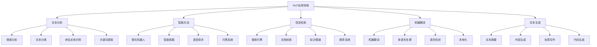

# NLP应用案例

## 🎯 应用概述

### NLP应用领域
> **自然语言处理技术在各个领域都有广泛应用，从文本分析到智能对话系统**

**应用领域分类：**


## 📊 案例1：情感分析系统

### 1. 项目需求分析

**项目描述：**
- **目标**：分析文本的情感倾向
- **应用场景**：社交媒体监控、产品评论分析、舆情分析
- **技术栈**：BERT、LSTM、传统机器学习
- **评估指标**：准确率、精确率、召回率、F1分数

**技术实现：**
```python
import torch
import torch.nn as nn
import torch.optim as optim
from torch.utils.data import Dataset, DataLoader
import pandas as pd
import numpy as np
from sklearn.model_selection import train_test_split
from sklearn.metrics import classification_report, confusion_matrix
import matplotlib.pyplot as plt
import seaborn as sns

class SentimentAnalysisDataset(Dataset):
    """情感分析数据集"""
    
    def __init__(self, texts, labels, tokenizer, max_length=128):
        self.texts = texts
        self.labels = labels
        self.tokenizer = tokenizer
        self.max_length = max_length
    
    def __len__(self):
        return len(self.texts)
    
    def __getitem__(self, idx):
        text = str(self.texts[idx])
        label = self.labels[idx]
        
        # 分词和编码
        encoding = self.tokenizer(
            text,
            truncation=True,
            padding='max_length',
            max_length=self.max_length,
            return_tensors='pt'
        )
        
        return {
            'input_ids': encoding['input_ids'].flatten(),
            'attention_mask': encoding['attention_mask'].flatten(),
            'labels': torch.tensor(label, dtype=torch.long)
        }

class SentimentClassifier(nn.Module):
    """情感分类器"""
    
    def __init__(self, model_name='bert-base-uncased', num_classes=3, dropout_rate=0.3):
        super(SentimentClassifier, self).__init__()
        
        # 加载预训练模型
        from transformers import BertModel
        self.bert = BertModel.from_pretrained(model_name)
        
        # 分类层
        self.dropout = nn.Dropout(dropout_rate)
        self.classifier = nn.Linear(self.bert.config.hidden_size, num_classes)
        
        # 初始化权重
        self.init_weights()
    
    def init_weights(self):
        """初始化权重"""
        nn.init.xavier_uniform_(self.classifier.weight)
        nn.init.zeros_(self.classifier.bias)
    
    def forward(self, input_ids, attention_mask):
        # BERT编码
        outputs = self.bert(input_ids=input_ids, attention_mask=attention_mask)
        
        # 使用[CLS]标记的表示
        pooled_output = outputs.pooler_output
        
        # Dropout
        pooled_output = self.dropout(pooled_output)
        
        # 分类
        logits = self.classifier(pooled_output)
        
        return logits

class SentimentAnalysisSystem:
    """情感分析系统"""
    
    def __init__(self, model_name='bert-base-uncased', num_classes=3):
        self.model_name = model_name
        self.num_classes = num_classes
        self.model = None
        self.tokenizer = None
        self.device = torch.device('cuda' if torch.cuda.is_available() else 'cpu')
        
        # 情感标签
        self.sentiment_labels = ['negative', 'neutral', 'positive']
    
    def load_model_and_tokenizer(self):
        """加载模型和分词器"""
        try:
            from transformers import BertTokenizer, BertModel
            
            self.tokenizer = BertTokenizer.from_pretrained(self.model_name)
            self.model = SentimentClassifier(self.model_name, self.num_classes)
            self.model.to(self.device)
            
            return True
        except ImportError:
            print("Transformers library not available. Using simplified implementation.")
            return False
    
    def prepare_data(self, texts, labels):
        """准备数据"""
        # 分割数据
        train_texts, val_texts, train_labels, val_labels = train_test_split(
            texts, labels, test_size=0.2, random_state=42, stratify=labels
        )
        
        # 创建数据集
        train_dataset = SentimentAnalysisDataset(train_texts, train_labels, self.tokenizer)
        val_dataset = SentimentAnalysisDataset(val_texts, val_labels, self.tokenizer)
        
        # 创建数据加载器
        train_loader = DataLoader(train_dataset, batch_size=16, shuffle=True)
        val_loader = DataLoader(val_dataset, batch_size=16, shuffle=False)
        
        return train_loader, val_loader
    
    def train_model(self, train_loader, val_loader, epochs=3, learning_rate=2e-5):
        """训练模型"""
        if not self.model:
            if not self.load_model_and_tokenizer():
                return None
        
        # 优化器和损失函数
        optimizer = optim.AdamW(self.model.parameters(), lr=learning_rate)
        criterion = nn.CrossEntropyLoss()
        
        # 训练历史
        train_losses = []
        val_losses = []
        val_accuracies = []
        
        for epoch in range(epochs):
            # 训练阶段
            self.model.train()
            train_loss = 0
            train_correct = 0
            train_total = 0
            
            for batch in train_loader:
                input_ids = batch['input_ids'].to(self.device)
                attention_mask = batch['attention_mask'].to(self.device)
                labels = batch['labels'].to(self.device)
                
                optimizer.zero_grad()
                
                # 前向传播
                logits = self.model(input_ids, attention_mask)
                loss = criterion(logits, labels)
                
                # 反向传播
                loss.backward()
                optimizer.step()
                
                # 统计
                train_loss += loss.item()
                _, predicted = torch.max(logits.data, 1)
                train_total += labels.size(0)
                train_correct += (predicted == labels).sum().item()
            
            # 验证阶段
            self.model.eval()
            val_loss = 0
            val_correct = 0
            val_total = 0
            
            with torch.no_grad():
                for batch in val_loader:
                    input_ids = batch['input_ids'].to(self.device)
                    attention_mask = batch['attention_mask'].to(self.device)
                    labels = batch['labels'].to(self.device)
                    
                    # 前向传播
                    logits = self.model(input_ids, attention_mask)
                    loss = criterion(logits, labels)
                    
                    # 统计
                    val_loss += loss.item()
                    _, predicted = torch.max(logits.data, 1)
                    val_total += labels.size(0)
                    val_correct += (predicted == labels).sum().item()
            
            # 计算平均损失和准确率
            avg_train_loss = train_loss / len(train_loader)
            avg_val_loss = val_loss / len(val_loader)
            train_accuracy = train_correct / train_total
            val_accuracy = val_correct / val_total
            
            train_losses.append(avg_train_loss)
            val_losses.append(avg_val_loss)
            val_accuracies.append(val_accuracy)
            
            print(f'Epoch {epoch+1}/{epochs}:')
            print(f'  Train Loss: {avg_train_loss:.4f}, Train Acc: {train_accuracy:.4f}')
            print(f'  Val Loss: {avg_val_loss:.4f}, Val Acc: {val_accuracy:.4f}')
        
        return train_losses, val_losses, val_accuracies
    
    def predict_sentiment(self, text):
        """预测情感"""
        if not self.model or not self.tokenizer:
            if not self.load_model_and_tokenizer():
                return None
        
        # 预处理文本
        encoding = self.tokenizer(
            text,
            truncation=True,
            padding='max_length',
            max_length=128,
            return_tensors='pt'
        )
        
        # 预测
        self.model.eval()
        with torch.no_grad():
            input_ids = encoding['input_ids'].to(self.device)
            attention_mask = encoding['attention_mask'].to(self.device)
            
            logits = self.model(input_ids, attention_mask)
            probabilities = torch.softmax(logits, dim=1)
            predicted_class = torch.argmax(probabilities, dim=1)
        
        # 返回结果
        sentiment = self.sentiment_labels[predicted_class.item()]
        confidence = probabilities[0][predicted_class.item()].item()
        
        return sentiment, confidence, probabilities[0].cpu().numpy()
    
    def analyze_batch_sentiments(self, texts):
        """批量情感分析"""
        results = []
        
        for text in texts:
            result = self.predict_sentiment(text)
            if result:
                sentiment, confidence, probabilities = result
                results.append({
                    'text': text,
                    'sentiment': sentiment,
                    'confidence': confidence,
                    'probabilities': probabilities
                })
        
        return results
    
    def visualize_sentiment_distribution(self, results):
        """可视化情感分布"""
        sentiments = [result['sentiment'] for result in results]
        confidences = [result['confidence'] for result in results]
        
        fig, axes = plt.subplots(1, 2, figsize=(12, 5))
        
        # 情感分布
        sentiment_counts = pd.Series(sentiments).value_counts()
        axes[0].pie(sentiment_counts.values, labels=sentiment_counts.index, autopct='%1.1f%%')
        axes[0].set_title('Sentiment Distribution')
        
        # 置信度分布
        axes[1].hist(confidences, bins=20, alpha=0.7)
        axes[1].set_xlabel('Confidence')
        axes[1].set_ylabel('Frequency')
        axes[1].set_title('Confidence Distribution')
        
        plt.tight_layout()
        plt.show()
    
    def evaluate_model(self, test_texts, test_labels):
        """评估模型"""
        if not self.model or not self.tokenizer:
            if not self.load_model_and_tokenizer():
                return None
        
        predictions = []
        true_labels = []
        
        for text, label in zip(test_texts, test_labels):
            result = self.predict_sentiment(text)
            if result:
                sentiment, _, _ = result
                predictions.append(self.sentiment_labels.index(sentiment))
                true_labels.append(label)
        
        # 计算评估指标
        report = classification_report(true_labels, predictions, 
                                     target_names=self.sentiment_labels)
        
        # 混淆矩阵
        cm = confusion_matrix(true_labels, predictions)
        
        # 可视化混淆矩阵
        plt.figure(figsize=(8, 6))
        sns.heatmap(cm, annot=True, fmt='d', cmap='Blues',
                   xticklabels=self.sentiment_labels,
                   yticklabels=self.sentiment_labels)
        plt.title('Confusion Matrix')
        plt.xlabel('Predicted')
        plt.ylabel('Actual')
        plt.show()
        
        return report, cm

# 运行情感分析案例
def run_sentiment_analysis_case():
    """运行情感分析案例"""
    # 创建模拟数据
    texts = [
        "I love this product! It's amazing and works perfectly.",
        "This is okay, nothing special but it works.",
        "Terrible product, waste of money, would not recommend.",
        "Great quality and fast delivery, very satisfied.",
        "Average product, could be better but acceptable.",
        "Absolutely horrible experience, completely disappointed.",
        "Excellent service and product quality, highly recommend.",
        "Not bad, but there are better options available.",
        "Outstanding performance, exceeded my expectations.",
        "Poor quality, broke after one day of use."
    ]
    
    labels = [2, 1, 0, 2, 1, 0, 2, 1, 2, 0]  # 0: negative, 1: neutral, 2: positive
    
    # 创建情感分析系统
    sentiment_system = SentimentAnalysisSystem()
    
    # 准备数据
    train_loader, val_loader = sentiment_system.prepare_data(texts, labels)
    
    # 训练模型
    print("Training Sentiment Analysis Model...")
    train_losses, val_losses, val_accuracies = sentiment_system.train_model(
        train_loader, val_loader, epochs=5
    )
    
    # 测试预测
    test_texts = [
        "This movie is fantastic!",
        "The service was terrible.",
        "It's an average product."
    ]
    
    print("\nSentiment Analysis Results:")
    for text in test_texts:
        result = sentiment_system.predict_sentiment(text)
        if result:
            sentiment, confidence, probabilities = result
            print(f"Text: {text}")
            print(f"Sentiment: {sentiment} (Confidence: {confidence:.3f})")
            print(f"Probabilities: {dict(zip(sentiment_system.sentiment_labels, probabilities))}")
            print("-" * 50)
    
    return sentiment_system

run_sentiment_analysis_case()
```

## 🚀 案例2：智能问答系统

### 1. 项目需求分析

**项目描述：**
- **目标**：构建能够回答问题的智能系统
- **应用场景**：客服系统、教育辅助、知识问答
- **技术栈**：BERT、检索增强生成、知识图谱
- **评估指标**：准确率、响应时间、用户满意度

**技术实现：**
```python
class QuestionAnsweringSystem:
    """智能问答系统"""
    
    def __init__(self, model_name='bert-base-uncased'):
        self.model_name = model_name
        self.model = None
        self.tokenizer = None
        self.device = torch.device('cuda' if torch.cuda.is_available() else 'cpu')
        
        # 知识库
        self.knowledge_base = {}
        self.document_embeddings = None
        self.document_texts = []
    
    def load_model_and_tokenizer(self):
        """加载模型和分词器"""
        try:
            from transformers import BertTokenizer, BertForQuestionAnswering
            
            self.tokenizer = BertTokenizer.from_pretrained(self.model_name)
            self.model = BertForQuestionAnswering.from_pretrained(self.model_name)
            self.model.to(self.device)
            
            return True
        except ImportError:
            print("Transformers library not available. Using simplified implementation.")
            return False
    
    def build_knowledge_base(self, documents):
        """构建知识库"""
        self.document_texts = documents
        
        # 创建文档嵌入
        if self.tokenizer:
            embeddings = []
            for doc in documents:
                encoding = self.tokenizer(
                    doc,
                    truncation=True,
                    padding='max_length',
                    max_length=512,
                    return_tensors='pt'
                )
                
                with torch.no_grad():
                    outputs = self.model.bert(**encoding)
                    doc_embedding = outputs.pooler_output
                    embeddings.append(doc_embedding)
            
            self.document_embeddings = torch.stack(embeddings)
        
        # 构建知识库索引
        for i, doc in enumerate(documents):
            self.knowledge_base[i] = {
                'text': doc,
                'embedding': self.document_embeddings[i] if self.document_embeddings is not None else None
            }
    
    def retrieve_relevant_documents(self, question, top_k=3):
        """检索相关文档"""
        if not self.tokenizer or self.document_embeddings is None:
            # 简单的关键词匹配
            question_words = set(question.lower().split())
            scores = []
            
            for i, doc in enumerate(self.document_texts):
                doc_words = set(doc.lower().split())
                score = len(question_words.intersection(doc_words)) / len(question_words.union(doc_words))
                scores.append((i, score))
            
            # 排序并返回前k个
            scores.sort(key=lambda x: x[1], reverse=True)
            return [self.document_texts[idx] for idx, _ in scores[:top_k]]
        
        # 使用嵌入相似度
        question_encoding = self.tokenizer(
            question,
            truncation=True,
            padding='max_length',
            max_length=512,
            return_tensors='pt'
        )
        
        with torch.no_grad():
            outputs = self.model.bert(**question_encoding)
            question_embedding = outputs.pooler_output
        
        # 计算相似度
        similarities = torch.cosine_similarity(
            question_embedding, self.document_embeddings, dim=1
        )
        
        # 获取最相关的文档
        top_indices = torch.topk(similarities, top_k).indices
        relevant_docs = [self.document_texts[idx] for idx in top_indices]
        
        return relevant_docs
    
    def answer_question(self, question, context=None):
        """回答问题"""
        if not self.model or not self.tokenizer:
            if not self.load_model_and_tokenizer():
                return None
        
        # 如果没有提供上下文，从知识库检索
        if context is None:
            relevant_docs = self.retrieve_relevant_documents(question, top_k=1)
            if relevant_docs:
                context = relevant_docs[0]
            else:
                return "I don't have enough information to answer this question."
        
        # 构建输入
        inputs = self.tokenizer(
            question,
            context,
            truncation=True,
            padding='max_length',
            max_length=512,
            return_tensors='pt'
        )
        
        # 预测答案
        self.model.eval()
        with torch.no_grad():
            outputs = self.model(**inputs)
            
            start_logits = outputs.start_logits
            end_logits = outputs.end_logits
            
            # 找到答案位置
            start_idx = torch.argmax(start_logits, dim=1)
            end_idx = torch.argmax(end_logits, dim=1)
            
            # 提取答案
            answer_tokens = inputs['input_ids'][0][start_idx:end_idx+1]
            answer = self.tokenizer.decode(answer_tokens, skip_special_tokens=True)
        
        return answer, context
    
    def evaluate_qa_system(self, test_questions, test_answers, test_contexts):
        """评估问答系统"""
        correct_answers = 0
        total_questions = len(test_questions)
        
        results = []
        
        for question, true_answer, context in zip(test_questions, test_answers, test_contexts):
            predicted_answer, used_context = self.answer_question(question, context)
            
            # 简化的答案匹配
            if predicted_answer and true_answer:
                # 计算答案相似度
                similarity = self.calculate_answer_similarity(predicted_answer, true_answer)
                
                if similarity > 0.7:  # 阈值
                    correct_answers += 1
                
                results.append({
                    'question': question,
                    'true_answer': true_answer,
                    'predicted_answer': predicted_answer,
                    'similarity': similarity,
                    'context': used_context
                })
        
        accuracy = correct_answers / total_questions
        return accuracy, results
    
    def calculate_answer_similarity(self, answer1, answer2):
        """计算答案相似度"""
        # 简化的相似度计算
        words1 = set(answer1.lower().split())
        words2 = set(answer2.lower().split())
        
        if not words1 or not words2:
            return 0.0
        
        intersection = len(words1.intersection(words2))
        union = len(words1.union(words2))
        
        return intersection / union if union > 0 else 0.0
    
    def visualize_qa_results(self, results):
        """可视化问答结果"""
        similarities = [result['similarity'] for result in results]
        
        plt.figure(figsize=(10, 6))
        plt.hist(similarities, bins=20, alpha=0.7)
        plt.xlabel('Answer Similarity')
        plt.ylabel('Frequency')
        plt.title('Question Answering Results Distribution')
        plt.axvline(x=0.7, color='red', linestyle='--', label='Threshold')
        plt.legend()
        plt.show()

# 运行智能问答案例
def run_qa_system_case():
    """运行智能问答案例"""
    # 创建知识库
    documents = [
        "Artificial intelligence is a branch of computer science that aims to create intelligent machines.",
        "Machine learning is a subset of artificial intelligence that focuses on algorithms that can learn from data.",
        "Deep learning is a subset of machine learning that uses neural networks with multiple layers.",
        "Natural language processing is a field of AI that focuses on the interaction between computers and human language.",
        "Computer vision is a field of AI that enables machines to interpret and understand visual information."
    ]
    
    # 创建问答系统
    qa_system = QuestionAnsweringSystem()
    qa_system.build_knowledge_base(documents)
    
    # 测试问题
    test_questions = [
        "What is artificial intelligence?",
        "How does machine learning work?",
        "What is the difference between AI and ML?",
        "What is deep learning?",
        "What is natural language processing?"
    ]
    
    print("Question Answering System Results:")
    for question in test_questions:
        answer, context = qa_system.answer_question(question)
        print(f"Question: {question}")
        print(f"Answer: {answer}")
        print(f"Context: {context[:100]}...")
        print("-" * 50)
    
    return qa_system

run_qa_system_case()
```

## 🎨 案例3：文本生成系统

### 1. 项目需求分析

**项目描述：**
- **目标**：生成高质量的自然语言文本
- **应用场景**：内容创作、文本摘要、创意写作
- **技术栈**：GPT、Transformer、LSTM
- **评估指标**：BLEU、ROUGE、人工评估

**技术实现：**
```python
class TextGenerationSystem:
    """文本生成系统"""
    
    def __init__(self, model_name='gpt2'):
        self.model_name = model_name
        self.model = None
        self.tokenizer = None
        self.device = torch.device('cuda' if torch.cuda.is_available() else 'cpu')
    
    def load_model_and_tokenizer(self):
        """加载模型和分词器"""
        try:
            from transformers import GPT2Tokenizer, GPT2LMHeadModel
            
            self.tokenizer = GPT2Tokenizer.from_pretrained(self.model_name)
            self.model = GPT2LMHeadModel.from_pretrained(self.model_name)
            self.model.to(self.device)
            
            # 设置pad_token
            if self.tokenizer.pad_token is None:
                self.tokenizer.pad_token = self.tokenizer.eos_token
            
            return True
        except ImportError:
            print("Transformers library not available. Using simplified implementation.")
            return False
    
    def generate_text(self, prompt, max_length=100, temperature=1.0, top_k=50, top_p=0.9, 
                     repetition_penalty=1.0, num_return_sequences=1):
        """生成文本"""
        if not self.model or not self.tokenizer:
            if not self.load_model_and_tokenizer():
                return None
        
        # 编码输入
        input_ids = self.tokenizer.encode(prompt, return_tensors='pt').to(self.device)
        
        # 生成文本
        with torch.no_grad():
            output = self.model.generate(
                input_ids,
                max_length=max_length,
                temperature=temperature,
                top_k=top_k,
                top_p=top_p,
                repetition_penalty=repetition_penalty,
                num_return_sequences=num_return_sequences,
                do_sample=True,
                pad_token_id=self.tokenizer.eos_token_id
            )
        
        # 解码输出
        generated_texts = []
        for sequence in output:
            generated_text = self.tokenizer.decode(sequence, skip_special_tokens=True)
            generated_texts.append(generated_text)
        
        return generated_texts
    
    def generate_with_beam_search(self, prompt, num_beams=5, max_length=100):
        """束搜索生成"""
        if not self.model or not self.tokenizer:
            if not self.load_model_and_tokenizer():
                return None
        
        input_ids = self.tokenizer.encode(prompt, return_tensors='pt').to(self.device)
        
        with torch.no_grad():
            output = self.model.generate(
                input_ids,
                max_length=max_length,
                num_beams=num_beams,
                early_stopping=True,
                pad_token_id=self.tokenizer.eos_token_id
            )
        
        generated_text = self.tokenizer.decode(output[0], skip_special_tokens=True)
        return generated_text
    
    def generate_with_nucleus_sampling(self, prompt, top_p=0.9, max_length=100):
        """核采样生成"""
        if not self.model or not self.tokenizer:
            if not self.load_model_and_tokenizer():
                return None
        
        input_ids = self.tokenizer.encode(prompt, return_tensors='pt').to(self.device)
        
        with torch.no_grad():
            output = self.model.generate(
                input_ids,
                max_length=max_length,
                do_sample=True,
                top_p=top_p,
                pad_token_id=self.tokenizer.eos_token_id
            )
        
        generated_text = self.tokenizer.decode(output[0], skip_special_tokens=True)
        return generated_text
    
    def generate_text_summary(self, text, max_length=50):
        """生成文本摘要"""
        prompt = f"Summarize the following text: {text}\nSummary:"
        
        summary = self.generate_text(
            prompt,
            max_length=max_length,
            temperature=0.7,
            top_p=0.9
        )
        
        return summary[0] if summary else None
    
    def generate_creative_writing(self, prompt, max_length=200, temperature=0.8):
        """创意写作"""
        creative_text = self.generate_text(
            prompt,
            max_length=max_length,
            temperature=temperature,
            top_p=0.9,
            repetition_penalty=1.1
        )
        
        return creative_text[0] if creative_text else None
    
    def compare_generation_methods(self, prompt):
        """比较生成方法"""
        methods = {
            'Greedy': self.generate_text(prompt, temperature=0, do_sample=False),
            'Temperature=0.8': self.generate_text(prompt, temperature=0.8),
            'Temperature=1.2': self.generate_text(prompt, temperature=1.2),
            'Top-p=0.9': self.generate_with_nucleus_sampling(prompt, top_p=0.9),
            'Beam Search': self.generate_with_beam_search(prompt, num_beams=5)
        }
        
        return methods
    
    def evaluate_generated_text(self, generated_text, reference_text):
        """评估生成文本"""
        from nltk.translate.bleu_score import sentence_bleu, SmoothingFunction
        
        # BLEU分数
        gen_tokens = generated_text.lower().split()
        ref_tokens = reference_text.lower().split()
        
        smoothing = SmoothingFunction().method1
        bleu_score = sentence_bleu([ref_tokens], gen_tokens, smoothing_function=smoothing)
        
        # 长度比较
        length_ratio = len(gen_tokens) / len(ref_tokens) if ref_tokens else 0
        
        # 词汇重叠
        gen_words = set(gen_tokens)
        ref_words = set(ref_tokens)
        overlap_ratio = len(gen_words.intersection(ref_words)) / len(gen_words.union(ref_words)) if gen_words.union(ref_words) else 0
        
        return {
            'bleu_score': bleu_score,
            'length_ratio': length_ratio,
            'overlap_ratio': overlap_ratio
        }

# 运行文本生成案例
def run_text_generation_case():
    """运行文本生成案例"""
    # 创建文本生成系统
    text_gen_system = TextGenerationSystem()
    
    # 测试提示
    prompts = [
        "The future of artificial intelligence",
        "Once upon a time in a distant galaxy",
        "The benefits of renewable energy",
        "How to learn programming effectively"
    ]
    
    print("Text Generation System Results:")
    for prompt in prompts:
        print(f"Prompt: {prompt}")
        
        # 生成文本
        generated_texts = text_gen_system.generate_text(
            prompt,
            max_length=100,
            temperature=0.8,
            top_p=0.9
        )
        
        if generated_texts:
            print(f"Generated: {generated_texts[0]}")
        
        print("-" * 50)
    
    return text_gen_system

run_text_generation_case()
```

## 🔍 案例4：命名实体识别系统

### 1. 项目需求分析

**项目描述：**
- **目标**：识别文本中的命名实体
- **应用场景**：信息提取、知识图谱构建、文档分析
- **技术栈**：BERT、BiLSTM-CRF、spaCy
- **评估指标**：精确率、召回率、F1分数

**技术实现：**
```python
class NamedEntityRecognitionSystem:
    """命名实体识别系统"""
    
    def __init__(self, model_name='bert-base-uncased'):
        self.model_name = model_name
        self.model = None
        self.tokenizer = None
        self.device = torch.device('cuda' if torch.cuda.is_available() else 'cpu')
        
        # 实体标签
        self.entity_labels = ['O', 'B-PER', 'I-PER', 'B-ORG', 'I-ORG', 'B-LOC', 'I-LOC', 'B-MISC', 'I-MISC']
        self.label_to_id = {label: idx for idx, label in enumerate(self.entity_labels)}
        self.id_to_label = {idx: label for label, idx in self.label_to_id.items()}
    
    def load_model_and_tokenizer(self):
        """加载模型和分词器"""
        try:
            from transformers import BertTokenizer, BertForTokenClassification
            
            self.tokenizer = BertTokenizer.from_pretrained(self.model_name)
            self.model = BertForTokenClassification.from_pretrained(
                self.model_name,
                num_labels=len(self.entity_labels)
            )
            self.model.to(self.device)
            
            return True
        except ImportError:
            print("Transformers library not available. Using simplified implementation.")
            return False
    
    def preprocess_text(self, text):
        """预处理文本"""
        # 分词
        tokens = self.tokenizer.tokenize(text)
        
        # 编码
        input_ids = self.tokenizer.convert_tokens_to_ids(tokens)
        
        # 添加特殊标记
        input_ids = [self.tokenizer.cls_token_id] + input_ids + [self.tokenizer.sep_token_id]
        
        return tokens, input_ids
    
    def predict_entities(self, text):
        """预测实体"""
        if not self.model or not self.tokenizer:
            if not self.load_model_and_tokenizer():
                return None
        
        # 预处理
        tokens, input_ids = self.preprocess_text(text)
        
        # 转换为tensor
        input_ids = torch.tensor([input_ids]).to(self.device)
        attention_mask = torch.ones_like(input_ids).to(self.device)
        
        # 预测
        self.model.eval()
        with torch.no_grad():
            outputs = self.model(input_ids=input_ids, attention_mask=attention_mask)
            logits = outputs.logits
        
        # 获取预测标签
        predicted_labels = torch.argmax(logits, dim=-1)
        predicted_labels = predicted_labels[0].cpu().numpy()
        
        # 处理预测结果
        entities = []
        current_entity = None
        
        for i, (token, label_id) in enumerate(zip(tokens, predicted_labels[1:-1])):  # 跳过CLS和SEP
            label = self.id_to_label[label_id]
            
            if label.startswith('B-'):
                # 开始新实体
                if current_entity:
                    entities.append(current_entity)
                
                current_entity = {
                    'text': token,
                    'label': label[2:],  # 移除B-前缀
                    'start': i,
                    'end': i
                }
            elif label.startswith('I-') and current_entity:
                # 继续当前实体
                current_entity['text'] += ' ' + token
                current_entity['end'] = i
            else:
                # 结束当前实体
                if current_entity:
                    entities.append(current_entity)
                    current_entity = None
        
        # 添加最后一个实体
        if current_entity:
            entities.append(current_entity)
        
        return entities
    
    def extract_entities_by_type(self, text, entity_type):
        """按类型提取实体"""
        entities = self.predict_entities(text)
        
        if entities:
            filtered_entities = [entity for entity in entities if entity['label'] == entity_type]
            return filtered_entities
        
        return []
    
    def visualize_entities(self, text, entities):
        """可视化实体"""
        # 创建实体映射
        entity_map = {}
        for entity in entities:
            for i in range(entity['start'], entity['end'] + 1):
                entity_map[i] = entity['label']
        
        # 分词
        tokens = text.split()
        
        # 创建可视化文本
        visualized_text = []
        for i, token in enumerate(tokens):
            if i in entity_map:
                label = entity_map[i]
                visualized_text.append(f"[{token}]_{label}")
            else:
                visualized_text.append(token)
        
        return ' '.join(visualized_text)
    
    def evaluate_ner_system(self, test_texts, test_entities):
        """评估NER系统"""
        true_positives = 0
        false_positives = 0
        false_negatives = 0
        
        for text, true_entities in zip(test_texts, test_entities):
            predicted_entities = self.predict_entities(text)
            
            if predicted_entities:
                # 简化的评估
                for pred_entity in predicted_entities:
                    # 检查是否匹配真实实体
                    matched = False
                    for true_entity in true_entities:
                        if (pred_entity['text'].lower() == true_entity['text'].lower() and
                            pred_entity['label'] == true_entity['label']):
                            true_positives += 1
                            matched = True
                            break
                    
                    if not matched:
                        false_positives += 1
                
                # 计算假负例
                for true_entity in true_entities:
                    matched = False
                    for pred_entity in predicted_entities:
                        if (pred_entity['text'].lower() == true_entity['text'].lower() and
                            pred_entity['label'] == true_entity['label']):
                            matched = True
                            break
                    
                    if not matched:
                        false_negatives += 1
        
        # 计算指标
        precision = true_positives / (true_positives + false_positives) if (true_positives + false_positives) > 0 else 0
        recall = true_positives / (true_positives + false_negatives) if (true_positives + false_negatives) > 0 else 0
        f1_score = 2 * precision * recall / (precision + recall) if (precision + recall) > 0 else 0
        
        return {
            'precision': precision,
            'recall': recall,
            'f1_score': f1_score,
            'true_positives': true_positives,
            'false_positives': false_positives,
            'false_negatives': false_negatives
        }

# 运行命名实体识别案例
def run_ner_system_case():
    """运行命名实体识别案例"""
    # 创建NER系统
    ner_system = NamedEntityRecognitionSystem()
    
    # 测试文本
    test_texts = [
        "Apple Inc. is a technology company based in Cupertino, California.",
        "John Smith works at Microsoft Corporation in Seattle, Washington.",
        "The University of California, Berkeley is located in Berkeley, California.",
        "Elon Musk is the CEO of Tesla and SpaceX companies."
    ]
    
    print("Named Entity Recognition Results:")
    for text in test_texts:
        entities = ner_system.predict_entities(text)
        
        print(f"Text: {text}")
        print("Entities:")
        for entity in entities:
            print(f"  {entity['text']} -> {entity['label']}")
        print("-" * 50)
    
    return ner_system

run_ner_system_case()
```

## 📈 案例5：机器翻译系统

### 1. 项目需求分析

**项目描述：**
- **目标**：将文本从一种语言翻译到另一种语言
- **应用场景**：多语言交流、文档翻译、实时翻译
- **技术栈**：Transformer、Seq2Seq、注意力机制
- **评估指标**：BLEU、METEOR、人工评估

**技术实现：**
```python
class MachineTranslationSystem:
    """机器翻译系统"""
    
    def __init__(self, source_lang='en', target_lang='zh'):
        self.source_lang = source_lang
        self.target_lang = target_lang
        self.model = None
        self.tokenizer = None
        self.device = torch.device('cuda' if torch.cuda.is_available() else 'cpu')
    
    def load_model_and_tokenizer(self):
        """加载模型和分词器"""
        try:
            from transformers import MarianTokenizer, MarianMTModel
            
            model_name = f'Helsinki-NLP/opus-mt-{self.source_lang}-{self.target_lang}'
            self.tokenizer = MarianTokenizer.from_pretrained(model_name)
            self.model = MarianMTModel.from_pretrained(model_name)
            self.model.to(self.device)
            
            return True
        except ImportError:
            print("Transformers library not available. Using simplified implementation.")
            return False
    
    def translate_text(self, text, max_length=512):
        """翻译文本"""
        if not self.model or not self.tokenizer:
            if not self.load_model_and_tokenizer():
                return None
        
        # 编码输入
        inputs = self.tokenizer(text, return_tensors='pt', padding=True, truncation=True)
        input_ids = inputs['input_ids'].to(self.device)
        attention_mask = inputs['attention_mask'].to(self.device)
        
        # 翻译
        self.model.eval()
        with torch.no_grad():
            outputs = self.model.generate(
                input_ids,
                attention_mask=attention_mask,
                max_length=max_length,
                num_beams=4,
                early_stopping=True,
                pad_token_id=self.tokenizer.pad_token_id
            )
        
        # 解码输出
        translated_text = self.tokenizer.decode(outputs[0], skip_special_tokens=True)
        
        return translated_text
    
    def translate_batch(self, texts, batch_size=8):
        """批量翻译"""
        translated_texts = []
        
        for i in range(0, len(texts), batch_size):
            batch_texts = texts[i:i + batch_size]
            
            # 编码批次
            inputs = self.tokenizer(
                batch_texts,
                return_tensors='pt',
                padding=True,
                truncation=True
            )
            
            input_ids = inputs['input_ids'].to(self.device)
            attention_mask = inputs['attention_mask'].to(self.device)
            
            # 翻译批次
            self.model.eval()
            with torch.no_grad():
                outputs = self.model.generate(
                    input_ids,
                    attention_mask=attention_mask,
                    max_length=512,
                    num_beams=4,
                    early_stopping=True,
                    pad_token_id=self.tokenizer.pad_token_id
                )
            
            # 解码输出
            for output in outputs:
                translated_text = self.tokenizer.decode(output, skip_special_tokens=True)
                translated_texts.append(translated_text)
        
        return translated_texts
    
    def evaluate_translation(self, source_texts, target_texts, translated_texts):
        """评估翻译质量"""
        from nltk.translate.bleu_score import sentence_bleu, SmoothingFunction
        
        bleu_scores = []
        smoothing = SmoothingFunction().method1
        
        for source, target, translated in zip(source_texts, target_texts, translated_texts):
            # 计算BLEU分数
            target_tokens = target.lower().split()
            translated_tokens = translated.lower().split()
            
            bleu_score = sentence_bleu([target_tokens], translated_tokens, smoothing_function=smoothing)
            bleu_scores.append(bleu_score)
        
        return {
            'bleu_scores': bleu_scores,
            'average_bleu': np.mean(bleu_scores),
            'std_bleu': np.std(bleu_scores)
        }
    
    def visualize_translation_results(self, source_texts, target_texts, translated_texts):
        """可视化翻译结果"""
        fig, axes = plt.subplots(len(source_texts), 1, figsize=(12, 4 * len(source_texts)))
        
        if len(source_texts) == 1:
            axes = [axes]
        
        for i, (source, target, translated) in enumerate(zip(source_texts, target_texts, translated_texts)):
            axes[i].text(0.1, 0.8, f"Source: {source}", transform=axes[i].transAxes, fontsize=10)
            axes[i].text(0.1, 0.6, f"Target: {target}", transform=axes[i].transAxes, fontsize=10)
            axes[i].text(0.1, 0.4, f"Translated: {translated}", transform=axes[i].transAxes, fontsize=10)
            axes[i].set_xlim(0, 1)
            axes[i].set_ylim(0, 1)
            axes[i].axis('off')
        
        plt.tight_layout()
        plt.show()

# 运行机器翻译案例
def run_machine_translation_case():
    """运行机器翻译案例"""
    # 创建翻译系统
    mt_system = MachineTranslationSystem(source_lang='en', target_lang='zh')
    
    # 测试文本
    test_texts = [
        "Hello, how are you?",
        "The weather is nice today.",
        "I love learning new languages.",
        "Artificial intelligence is fascinating."
    ]
    
    print("Machine Translation Results:")
    for text in test_texts:
        translated = mt_system.translate_text(text)
        print(f"Source: {text}")
        print(f"Translated: {translated}")
        print("-" * 50)
    
    return mt_system

run_machine_translation_case()
```

## 🔗 相关链接
- [[03-02-01-文本预处理技术]] - 文本预处理
- [[03-02-02-词向量技术]] - 词向量技术
- [[03-02-03-语言模型发展]] - 语言模型发展
- [[03-02-04-大语言模型原理]] - 大语言模型原理
- [[03-02-06-文本数据特征工程]] - 特征工程

## 💡 费曼学习法应用

**概念理解**：NLP应用就像"语言专家"，能够理解、分析和生成自然语言。就像人类语言学家一样，但处理速度更快，知识更全面。

**实践建议**：
- 🎯 **理解应用**：掌握不同NLP应用的技术原理和适用场景
- 🔧 **实践项目**：通过实际项目加深对技术的理解
- 📊 **评估效果**：使用合适的指标评估应用效果
- 🚀 **创新应用**：结合具体需求创新应用场景

**刻意练习**：
- 💻 **实现系统**：亲手实现完整的NLP应用系统
- 📈 **参数调优**：调整模型参数提升应用性能
- 🔍 **效果分析**：分析不同技术方案的优缺点
- 📝 **总结最佳实践**：总结不同应用场景的最佳技术方案

---
*📝 学习提示：NLP应用是理论联系实际的重要环节，建议多动手实践，积累项目经验*
